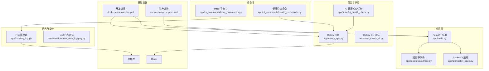
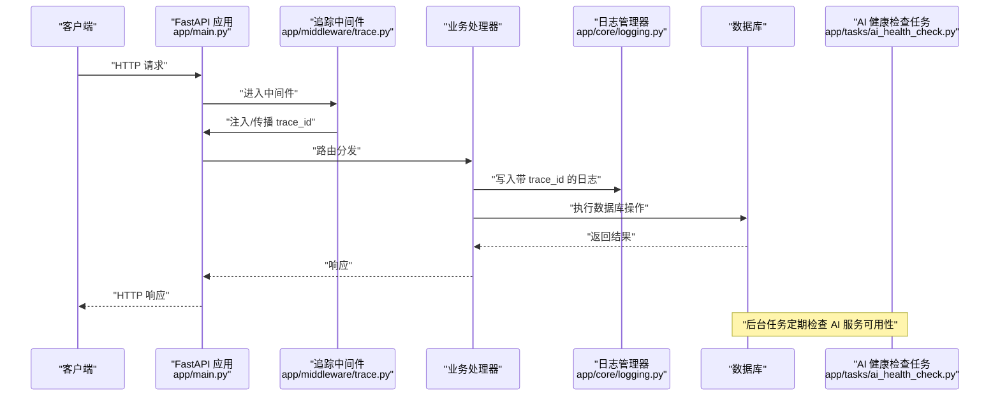
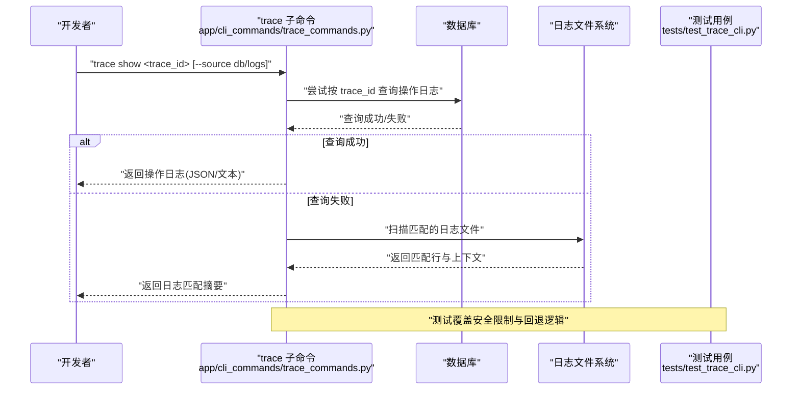
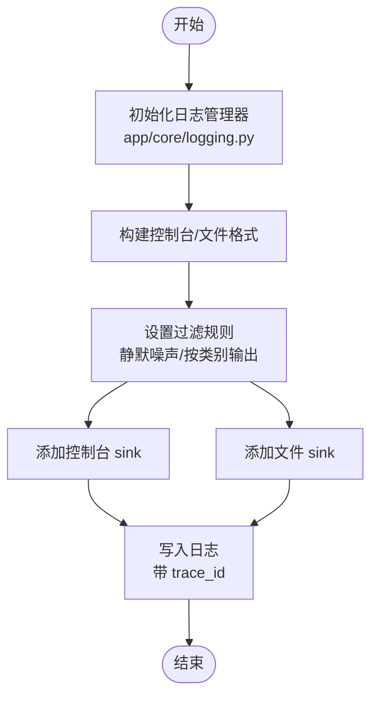
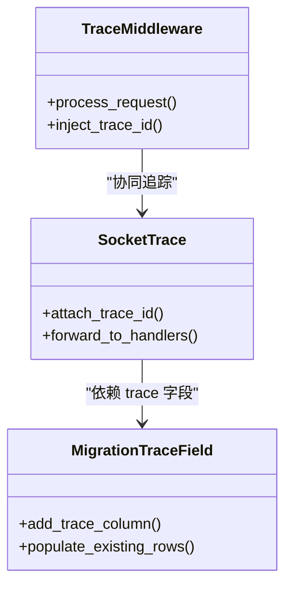
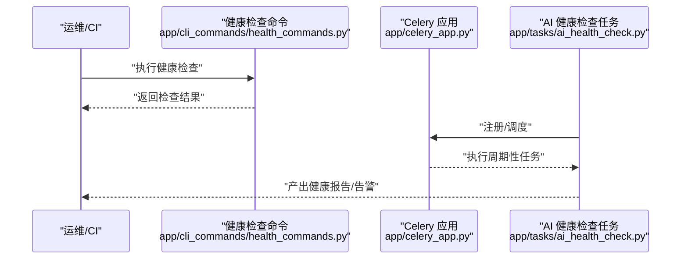
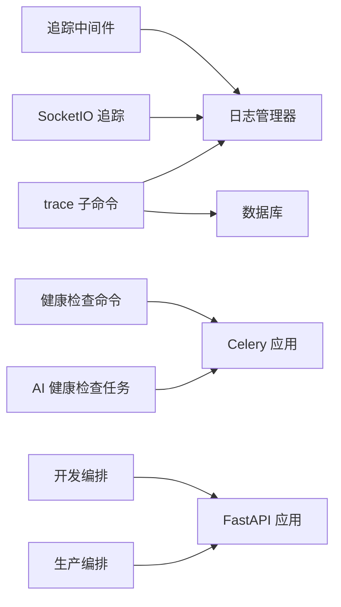

# 调试工具和技巧

<cite>
**本文引用的文件**
- [backend/app/cli_commands/trace_commands.py](file://backend/app/cli_commands/trace_commands.py)
- [backend/tests/test_trace_cli.py](file://backend/tests/test_trace_cli.py)
- [backend/app/core/logging.py](file://backend/app/core/logging.py)
- [backend/tests/services/test_auth_logging.py](file://backend/tests/services/test_auth_logging.py)
- [backend/app/middleware/trace.py](file://backend/app/middleware/trace.py)
- [backend/app/sio/socket_trace.py](file://backend/app/sio/socket_trace.py)
- [backend/migrations/versions/20260330_0090_action_log_trace.py](file://backend/migrations/versions/20260330_0090_action_log_trace.py)
- [backend/app/cli_commands/health_commands.py](file://backend/app/cli_commands/health_commands.py)
- [backend/tests/test_celery_cli.py](file://backend/tests/test_celery_cli.py)
- [backend/app/tasks/ai_health_check.py](file://backend/app/tasks/ai_health_check.py)
- [backend/app/celery_app.py](file://backend/app/celery_app.py)
- [backend/app/main.py](file://backend/app/main.py)
- [backend/pyproject.toml](file://backend/pyproject.toml)
- [backend/docker-compose.dev.yml](file://backend/docker-compose.dev.yml)
- [backend/docker-compose.prod.yml](file://backend/docker-compose.prod.yml)
</cite>

## 目录
1. [简介](#简介)
2. [项目结构](#项目结构)
3. [核心组件](#核心组件)
4. [架构总览](#架构总览)
5. [详细组件分析](#详细组件分析)
6. [依赖分析](#依赖分析)
7. [性能考虑](#性能考虑)
8. [故障排查指南](#故障排查指南)
9. [结论](#结论)
10. [附录](#附录)

## 简介
本文件面向开发与运维工程师，系统性梳理后端调试工具与技巧，覆盖本地 IDE 断点调试、远程调试配置、日志调试、命令行健康检查与状态观测、数据库连接测试、AI 调用模拟、性能分析（内存/CPU/网络）、单元与集成测试调试、以及生产环境安全调试实践。内容以仓库现有实现为依据，结合可操作的流程图与序列图，帮助快速定位问题并建立稳健的调试体系。

## 项目结构
后端采用 Python/FastAPI 应用，配合 Celery 异步任务、Redis/数据库等基础设施。调试相关能力主要分布在以下模块：
- 命令行调试：trace 子命令、健康检查命令、Celery CLI 测试
- 日志系统：统一日志管理器、分类日志、敏感信息脱敏
- 追踪链路：中间件注入 trace_id、SocketIO 追踪、迁移记录 trace 字段
- 健康与状态：定时健康检查任务、运行时状态 CLI
- 性能与监控：Prometheus 中间件（用于指标采集）

**图表来源**
- [backend/app/main.py](file://backend/app/main.py)
- [backend/app/middleware/trace.py](file://backend/app/middleware/trace.py)
- [backend/app/sio/socket_trace.py](file://backend/app/sio/socket_trace.py)
- [backend/app/cli_commands/trace_commands.py](file://backend/app/cli_commands/trace_commands.py)
- [backend/app/cli_commands/health_commands.py](file://backend/app/cli_commands/health_commands.py)
- [backend/app/core/logging.py](file://backend/app/core/logging.py)
- [backend/app/tasks/ai_health_check.py](file://backend/app/tasks/ai_health_check.py)
- [backend/app/celery_app.py](file://backend/app/celery_app.py)
- [backend/docker-compose.dev.yml](file://backend/docker-compose.dev.yml)
- [backend/docker-compose.prod.yml](file://backend/docker-compose.prod.yml)

**章节来源**
- [backend/app/main.py](file://backend/app/main.py)
- [backend/docker-compose.dev.yml](file://backend/docker-compose.dev.yml)
- [backend/docker-compose.prod.yml](file://backend/docker-compose.prod.yml)

## 核心组件
- 追踪与日志
  - trace_id 注入与传播：通过中间件与 SocketIO 追踪组件，确保请求全链路可追踪
  - 日志管理器：统一控制台/文件输出、过滤策略、敏感信息脱敏
  - 认证日志：对用户标识进行掩码处理，避免敏感信息泄露
- 健康与状态
  - trace 子命令：基于 trace_id 搜索操作日志或日志文件，支持 JSON 输出与安全限制
  - 健康检查命令：检查服务与依赖可用性
  - AI 健康检查任务：周期性验证 AI 服务连通性与响应
- 命令行与运行时
  - Celery CLI 测试：验证异步任务相关命令行为
  - 运行时状态 CLI：查看运行状态（由 trace_commands 提供）
- 生产安全
  - trace 输出安全：生产环境默认阻断不安全输出，需显式授权
  - 日志级别与静默：可通过配置调整日志级别与静默特定噪声

**章节来源**
- [backend/app/middleware/trace.py](file://backend/app/middleware/trace.py)
- [backend/app/sio/socket_trace.py](file://backend/app/sio/socket_trace.py)
- [backend/app/core/logging.py](file://backend/app/core/logging.py)
- [backend/tests/services/test_auth_logging.py](file://backend/tests/services/test_auth_logging.py)
- [backend/app/cli_commands/trace_commands.py](file://backend/app/cli_commands/trace_commands.py)
- [backend/app/cli_commands/health_commands.py](file://backend/app/cli_commands/health_commands.py)
- [backend/app/tasks/ai_health_check.py](file://backend/app/tasks/ai_health_check.py)
- [backend/tests/test_celery_cli.py](file://backend/tests/test_celery_cli.py)

## 架构总览
下图展示从客户端到服务端、再到日志与任务系统的调试路径，强调 trace_id 在各环节的传递与落盘。

**图表来源**
- [backend/app/main.py](file://backend/app/main.py)
- [backend/app/middleware/trace.py](file://backend/app/middleware/trace.py)
- [backend/app/core/logging.py](file://backend/app/core/logging.py)
- [backend/app/tasks/ai_health_check.py](file://backend/app/tasks/ai_health_check.py)

## 详细组件分析

### 组件一：trace 子命令与追踪回溯
- 功能要点
  - 支持按 trace_id 查询操作日志或日志文件，自动回退策略
  - JSON 输出便于机器解析，文本输出包含关键错误与响应消息
  - 生产环境默认阻断不安全输出，需显式授权环境变量
- 调试流程
  - 客户端发起请求，中间件注入 trace_id
  - 业务日志落盘，包含 trace_id
  - 使用 trace show 命令按 trace_id 检索，优先查询数据库，失败则回退到日志文件
  - 对主错误与匹配块进行摘要与脱敏输出

**图表来源**
- [backend/app/cli_commands/trace_commands.py](file://backend/app/cli_commands/trace_commands.py)
- [backend/tests/test_trace_cli.py](file://backend/tests/test_trace_cli.py)

**章节来源**
- [backend/app/cli_commands/trace_commands.py](file://backend/app/cli_commands/trace_commands.py)
- [backend/tests/test_trace_cli.py](file://backend/tests/test_trace_cli.py)

### 组件二：日志系统与敏感信息脱敏
- 功能要点
  - 统一日志格式，包含时间、级别、logger 名称、trace_id
  - 控制台与文件双通道输出，支持过滤（如静默数据库/WS握手噪声）
  - 敏感信息掩码（如邮箱、用户名），认证日志单独落盘
- 调试建议
  - 开发期提高日志级别，启用文件输出，观察 trace_id 关联
  - 生产期谨慎开启高冗余日志，必要时仅临时提升特定模块日志级别

**图表来源**
- [backend/app/core/logging.py](file://backend/app/core/logging.py)

**章节来源**
- [backend/app/core/logging.py](file://backend/app/core/logging.py)
- [backend/tests/services/test_auth_logging.py](file://backend/tests/services/test_auth_logging.py)

### 组件三：中间件与 SocketIO 追踪
- 功能要点
  - 中间件注入 trace_id，贯穿请求生命周期
  - SocketIO 层面同样携带 trace_id，便于实时通信链路追踪
  - 迁移中新增 trace 字段，确保历史数据具备可追溯性

**图表来源**
- [backend/app/middleware/trace.py](file://backend/app/middleware/trace.py)
- [backend/app/sio/socket_trace.py](file://backend/app/sio/socket_trace.py)
- [backend/migrations/versions/20260330_0090_action_log_trace.py](file://backend/migrations/versions/20260330_0090_action_log_trace.py)

**章节来源**
- [backend/app/middleware/trace.py](file://backend/app/middleware/trace.py)
- [backend/app/sio/socket_trace.py](file://backend/app/sio/socket_trace.py)
- [backend/migrations/versions/20260330_0090_action_log_trace.py](file://backend/migrations/versions/20260330_0090_action_log_trace.py)

### 组件四：健康检查与状态观测
- 健康检查命令
  - 检查服务可用性与依赖项（数据库、缓存等）
  - 可作为 CI/CD 前置校验与运维巡检工具
- AI 健康检查任务
  - 定时任务轮询 AI 服务连通性与关键接口可用性
  - 结合日志与告警联动，快速发现上游异常
- Celery CLI 行为验证
  - 通过测试确保异步任务相关命令在不同环境下的稳定性

**图表来源**
- [backend/app/cli_commands/health_commands.py](file://backend/app/cli_commands/health_commands.py)
- [backend/app/tasks/ai_health_check.py](file://backend/app/tasks/ai_health_check.py)
- [backend/app/celery_app.py](file://backend/app/celery_app.py)
- [backend/tests/test_celery_cli.py](file://backend/tests/test_celery_cli.py)

**章节来源**
- [backend/app/cli_commands/health_commands.py](file://backend/app/cli_commands/health_commands.py)
- [backend/app/tasks/ai_health_check.py](file://backend/app/tasks/ai_health_check.py)
- [backend/tests/test_celery_cli.py](file://backend/tests/test_celery_cli.py)

## 依赖分析
- 组件耦合
  - 中间件与 SocketIO 追踪依赖 trace_id 注入机制
  - 日志系统被业务广泛依赖，是问题定位的核心入口
  - 健康检查与任务系统依赖 Celery 与基础设施（数据库/缓存）
- 外部依赖
  - Docker 编排文件定义开发与生产环境的服务拓扑
  - 项目配置文件提供构建与运行参数

**图表来源**
- [backend/app/middleware/trace.py](file://backend/app/middleware/trace.py)
- [backend/app/sio/socket_trace.py](file://backend/app/sio/socket_trace.py)
- [backend/app/core/logging.py](file://backend/app/core/logging.py)
- [backend/app/cli_commands/trace_commands.py](file://backend/app/cli_commands/trace_commands.py)
- [backend/app/cli_commands/health_commands.py](file://backend/app/cli_commands/health_commands.py)
- [backend/app/tasks/ai_health_check.py](file://backend/app/tasks/ai_health_check.py)
- [backend/app/celery_app.py](file://backend/app/celery_app.py)
- [backend/docker-compose.dev.yml](file://backend/docker-compose.dev.yml)
- [backend/docker-compose.prod.yml](file://backend/docker-compose.prod.yml)

**章节来源**
- [backend/docker-compose.dev.yml](file://backend/docker-compose.dev.yml)
- [backend/docker-compose.prod.yml](file://backend/docker-compose.prod.yml)

## 性能考虑
- 日志开销控制
  - 合理设置日志级别，避免高频写入
  - 使用文件 sink 分类存储，减少控制台噪声干扰
- 追踪与指标
  - 利用中间件与 SocketIO 追踪定位慢请求路径
  - 结合 Prometheus 指标（如中间件暴露）进行端到端延迟分析
- 数据库与缓存
  - 通过健康检查命令与任务监控数据库/缓存可用性
  - 避免在调试阶段执行大事务或高并发批量操作

[本节为通用指导，无需列出具体文件来源]

## 故障排查指南
- trace 输出被阻断（生产环境）
  - 现象：使用 --no-redact 或 unsafe 输出时报错并被阻止
  - 处理：在允许的环境下设置授权变量，或改用安全输出模式
  - 参考：测试用例覆盖该场景
- 日志未显示 trace_id
  - 检查日志管理器初始化与过滤规则
  - 确认中间件已正确注入 trace_id
- 数据库连接问题
  - 使用健康检查命令验证数据库连通性
  - 查看日志中数据库相关错误与重试记录
- AI 服务不可用
  - 触发或检查 AI 健康检查任务，确认上游服务状态
- 单元/集成测试失败
  - 使用测试夹具与断言失败分析，定位数据准备与期望值偏差
  - 对比预期输出与实际输出，逐步缩小范围

**章节来源**
- [backend/tests/test_trace_cli.py](file://backend/tests/test_trace_cli.py)
- [backend/app/core/logging.py](file://backend/app/core/logging.py)
- [backend/app/middleware/trace.py](file://backend/app/middleware/trace.py)
- [backend/app/cli_commands/health_commands.py](file://backend/app/cli_commands/health_commands.py)
- [backend/app/tasks/ai_health_check.py](file://backend/app/tasks/ai_health_check.py)

## 结论
通过 trace 子命令、统一日志系统、中间件与 SocketIO 追踪、健康检查命令与任务、以及严格的生产安全策略，本项目形成了从请求到落盘、从本地到生产的完整调试闭环。建议在日常开发中固定使用 trace_id 关联日志，结合健康检查命令与任务监控，持续优化性能与稳定性。

## 附录
- 常用命令与入口
  - trace 子命令：用于按 trace_id 回溯操作日志与日志文件
  - 健康检查命令：验证服务与依赖可用性
  - 运行时状态 CLI：查看运行状态（由 trace_commands 提供）
- 环境与编排
  - 开发环境：docker-compose.dev.yml
  - 生产环境：docker-compose.prod.yml
- 项目配置
  - 构建与运行参数参考 pyproject.toml

**章节来源**
- [backend/app/cli_commands/trace_commands.py](file://backend/app/cli_commands/trace_commands.py)
- [backend/app/cli_commands/health_commands.py](file://backend/app/cli_commands/health_commands.py)
- [backend/docker-compose.dev.yml](file://backend/docker-compose.dev.yml)
- [backend/docker-compose.prod.yml](file://backend/docker-compose.prod.yml)
- [backend/pyproject.toml](file://backend/pyproject.toml)