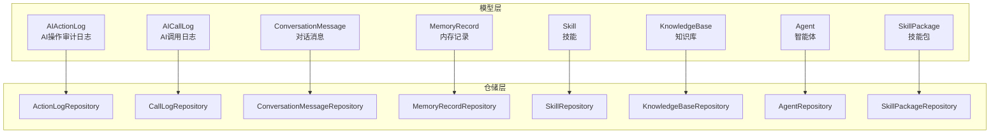
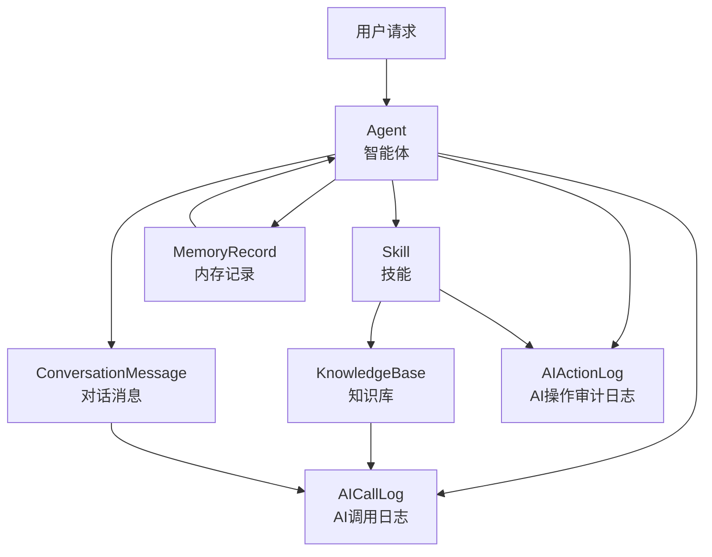
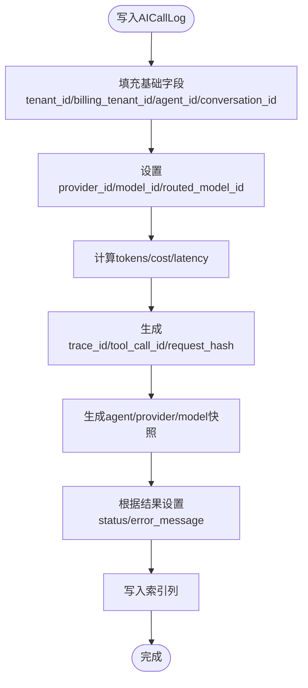
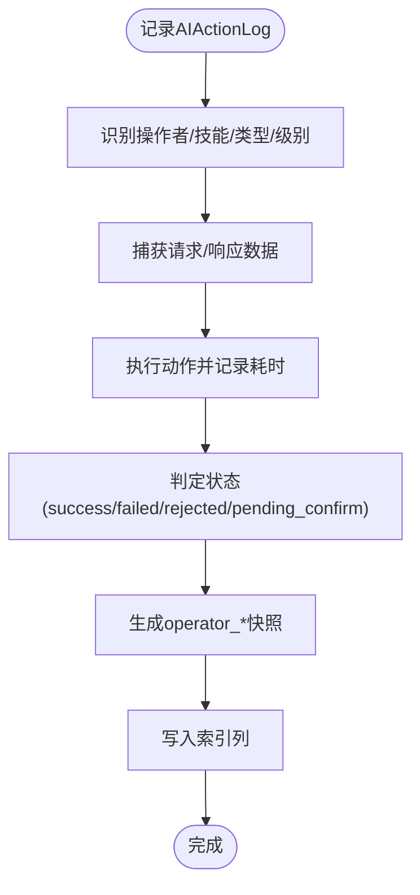
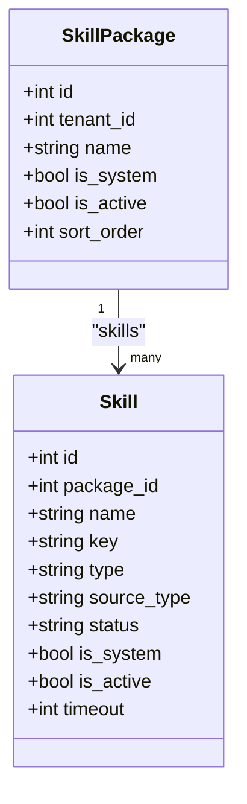
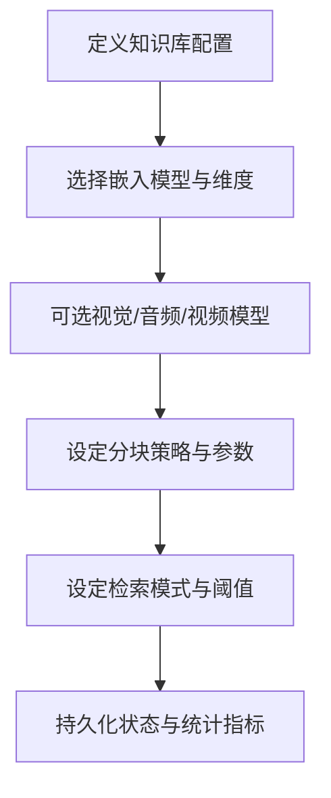
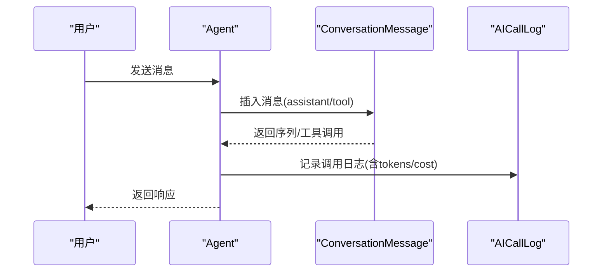
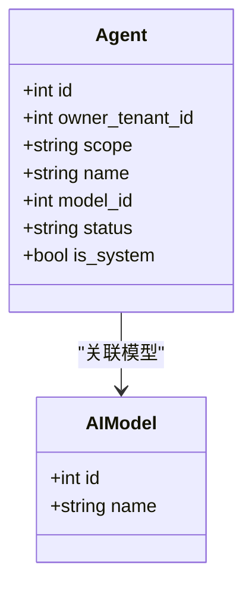
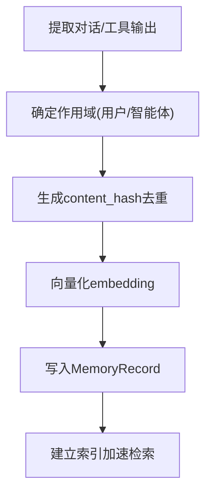
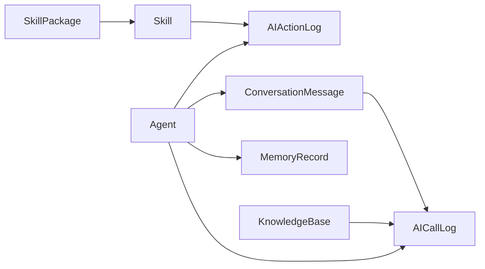

# AI业务模型

<cite>

**本文档引用的文件**
- [action_log.py](file://backend/app/models/ai/action_log.py)
- [call_log.py](file://backend/app/models/ai/call_log.py)
- [skill.py](file://backend/app/models/ai/skill.py)
- [knowledge_base.py](file://backend/app/models/ai/knowledge_base.py)
- [conversation_message.py](file://backend/app/models/ai/conversation_message.py)
- [agent.py](file://backend/app/models/ai/agent.py)
- [skill_package.py](file://backend/app/models/ai/skill_package.py)
- [memory_record.py](file://backend/app/models/ai/memory_record.py)
- [action_log_repository.py](file://backend/app/repositories/ai/action_log_repository.py)
- [call_log_repository.py](file://backend/app/repositories/ai/call_log_repository.py)
- [conversation_message_repository.py](file://backend/app/repositories/ai/conversation_message_repository.py)
- [memory_record_repository.py](file://backend/app/repositories/ai/memory_record_repository.py)
- [skill_repository.py](file://backend/app/repositories/ai/skill_repository.py)
- [knowledge_base_repository.py](file://backend/app/repositories/ai/knowledge_base_repository.py)
- [agent_repository.py](file://backend/app/repositories/ai/agent_repository.py)
- [skill_package_repository.py](file://backend/app/repositories/ai/skill_package_repository.py)
- [ai_call_log_table_migrations](file://backend/migrations/versions/20260221_0e818abf253a_add_skill_call_logs_table.py)
- [ai_action_log_table_migrations](file://backend/migrations/versions/20260211_ee87f790553e_add_ai_action_logs_table.py)
- [ai_query_log_table_migrations](file://backend/migrations/versions/20260212_6f8e790c9a68_add_ai_query_logs_table.py)
- [ai_memory_record_table_migrations](file://backend/migrations/versions/20260329_0030_add_memory_records.py)
- [ai_conversation_message_table_migrations](file://backend/migrations/versions/20260305_add_agent_id_to_conversation_messages.py)
- [ai_agent_table_migrations](file://backend/migrations/versions/20260210_0005_create_agent_engine_tables.py)
- [ai_skill_table_migrations](file://backend/migrations/versions/20260213_63eadfe34156_add_skills_and_agent_skill_bindings_.py)
- [ai_skill_package_table_migrations](file://backend/migrations/versions/20260213_add_skill_packages.py)
</cite>

## 目录
1. [简介](#简介)
2. [项目结构](#项目结构)
3. [核心组件](#核心组件)
4. [架构总览](#架构总览)
5. [详细组件分析](#详细组件分析)
6. [依赖关系分析](#依赖关系分析)
7. [性能考量](#性能考量)
8. [故障排查指南](#故障排查指南)
9. [结论](#结论)
10. [附录](#附录)

## 简介
本文件面向AI业务的核心数据模型，围绕以下实体进行系统化技术文档化：AI调用日志（action_log）、调用记录（call_log）、技能（skill）、知识库（knowledge_base）、对话消息（conversation_message）、智能体（agent）、技能包（skill_package）、内存记录（memory_record）。文档涵盖：
- 数据结构设计与字段定义
- 业务规则与约束条件
- 索引策略与查询优化
- AI调用链路的数据流转
- 技能执行过程中的数据传递与状态管理
- 数据操作示例与性能调优建议
- 扩展性设计与版本演进策略

## 项目结构
AI业务模型位于后端应用的models/ai与repositories/ai目录中，并配套迁移脚本确保数据库schema演进。核心模块如下：
- 模型层：定义各实体的字段、关系、索引与约束
- 仓储层：封装对模型的增删改查与复杂查询
- 迁移层：版本化的数据库结构变更

图表来源
- [action_log.py:16-236](file://backend/app/models/ai/action_log.py#L16-L236)
- [call_log.py:18-310](file://backend/app/models/ai/call_log.py#L18-L310)
- [skill.py:19-254](file://backend/app/models/ai/skill.py#L19-L254)
- [knowledge_base.py:33-273](file://backend/app/models/ai/knowledge_base.py#L33-L273)
- [conversation_message.py:18-178](file://backend/app/models/ai/conversation_message.py#L18-L178)
- [agent.py:34-369](file://backend/app/models/ai/agent.py#L34-L369)
- [skill_package.py:21-174](file://backend/app/models/ai/skill_package.py#L21-L174)
- [memory_record.py:20-213](file://backend/app/models/ai/memory_record.py#L20-L213)

章节来源
- [action_log.py:1-236](file://backend/app/models/ai/action_log.py#L1-L236)
- [call_log.py:1-310](file://backend/app/models/ai/call_log.py#L1-L310)
- [skill.py:1-254](file://backend/app/models/ai/skill.py#L1-L254)
- [knowledge_base.py:1-273](file://backend/app/models/ai/knowledge_base.py#L1-L273)
- [conversation_message.py:1-178](file://backend/app/models/ai/conversation_message.py#L1-L178)
- [agent.py:1-369](file://backend/app/models/ai/agent.py#L1-L369)
- [skill_package.py:1-174](file://backend/app/models/ai/skill_package.py#L1-L174)
- [memory_record.py:1-213](file://backend/app/models/ai/memory_record.py#L1-L213)

## 核心组件
本节概述各核心实体的职责、关键字段与约束。

- AI操作审计日志（AIActionLog）
  - 职责：记录AI工具调用与业务操作的审计轨迹，支持安全追溯、合规审计与操作分析
  - 关键字段：agent_id、conversation_id、execution_decision_id、trace_id、tool_call_id、skill_id、operator_* 快照、action_name、action_type、action_level、request_data、response_data、status、error_message、duration_ms
  - 约束与索引：多维复合索引（类型+时间、企业+时间、操作者+时间），便于审计报表与趋势分析

- AI调用日志（AICallLog）
  - 职责：记录所有AI调用请求与响应，支撑计费、用量统计与监控
  - 关键字段：user_id、user_type、billing_tenant_id、actor_user_id、access_channel、agent_id、conversation_id、trace_id、tool_call_id、provider_id、model_id、request_type、call_type、tokens、cost、latency_ms、status、error_message、request_hash、request_metadata、routed_model_id、route_reason、agent_* 快照
  - 约束与索引：企业+时间、计费企业+时间、智能体+时间、对话+时间、用户+状态、模型+时间等复合索引

- 技能（Skill）
  - 职责：封装智能体在运行时可用的能力单元，经解析转换为LLM工具定义
  - 关键字段：package_id、name、key、type、source_type、source_ref、version、status、is_readonly、config、toolkit_*、input_schema、output_schema、is_system、is_active、sort_order、timeout
  - 约束与索引：复合索引（tenant_id+type、tenant_id+is_active、source_type+status）

- 知识库（KnowledgeBase）
  - 职责：定义知识库基本信息、嵌入模型、分块策略、检索配置等
  - 关键字段：owner_tenant_id、scope、name、description、embedding_model_id、embedding_dimensions、vision_model_id、extract_images、audio_model_id、video_model_id、chunk_size、chunk_overlap、chunk_strategy、search_mode、top_k、score_threshold、document_count、total_chunks、total_size_bytes、status
  - 约束与索引：scope与owner_tenant_id联合校验约束，复合索引（owner_tenant_id+status）

- 对话消息（ConversationMessage）
  - 职责：独立存储每条对话消息，支持结构化查询、索引与function calling
  - 关键字段：conversation_id、role、content、sequence、token_count、tool_calls、tool_call_id、tool_name、agent_id、model_id、metadata_
  - 约束与索引：复合索引（conversation_id+sequence、tenant_id+conversation_id）

- 智能体（Agent）
  - 职责：存储智能体配置，包括系统提示词、关联AI模型、参数设置、工具绑定等
  - 关键字段：owner_tenant_id、scope、source_plugin、name、description、avatar、model_id、system_prompt、temperature、max_tokens、top_p、status、execution_mode、published_version、visibility、quota_config、routing_config、memory_enabled、input_variables、rag_config、context_config、output_schema、is_system、welcome_message、suggested_questions
  - 约束与索引：复合索引（owner_tenant_id+status）

- 技能包（SkillPackage）
  - 职责：技能的上层分组容器，承载分组、来源与展示职责
  - 关键字段：tenant_id、name、description、avatar、is_recommended、source_plugin、is_system、valves_schema、valves_config、is_active、sort_order
  - 约束与索引：复合索引（tenant_id+is_active）

- 内存记录（MemoryRecord）
  - 职责：存储按tenant/user/agent作用域划分的长期记忆候选与已验证记录
  - 关键字段：agent_id、user_id、scope_type、scope_key、memory_type、content、summary、keywords、content_hash、embedding_model_id、embedding_dimensions、embedding、confidence、importance、source_kind、source_ref、status、last_recalled_at、expires_at、metadata_
  - 约束与索引：复合索引（scope_lookup、scope_type_hash）

章节来源
- [action_log.py:16-236](file://backend/app/models/ai/action_log.py#L16-L236)
- [call_log.py:18-310](file://backend/app/models/ai/call_log.py#L18-L310)
- [skill.py:19-254](file://backend/app/models/ai/skill.py#L19-L254)
- [knowledge_base.py:33-273](file://backend/app/models/ai/knowledge_base.py#L33-L273)
- [conversation_message.py:18-178](file://backend/app/models/ai/conversation_message.py#L18-L178)
- [agent.py:34-369](file://backend/app/models/ai/agent.py#L34-L369)
- [skill_package.py:21-174](file://backend/app/models/ai/skill_package.py#L21-L174)
- [memory_record.py:20-213](file://backend/app/models/ai/memory_record.py#L20-L213)

## 架构总览
AI业务模型围绕“调用链路”贯穿多个实体：用户请求进入智能体，触发技能执行与知识库检索，期间产生调用日志与操作审计日志，对话消息持久化，长期记忆被抽取与更新，最终返回响应并记录用量与成本。

图表来源
- [agent.py:34-369](file://backend/app/models/ai/agent.py#L34-L369)
- [skill.py:19-254](file://backend/app/models/ai/skill.py#L19-L254)
- [knowledge_base.py:33-273](file://backend/app/models/ai/knowledge_base.py#L33-L273)
- [conversation_message.py:18-178](file://backend/app/models/ai/conversation_message.py#L18-L178)
- [call_log.py:18-310](file://backend/app/models/ai/call_log.py#L18-L310)
- [action_log.py:16-236](file://backend/app/models/ai/action_log.py#L16-L236)
- [memory_record.py:20-213](file://backend/app/models/ai/memory_record.py#L20-L213)

## 详细组件分析

### AI调用日志（AICallLog）分析
- 数据结构要点
  - 关联字段：tenant_id、billing_tenant_id、agent_id、conversation_id、provider_id、model_id、routed_model_id、tenant_publication_id
  - 行为指标：input_tokens、output_tokens、total_tokens、cost、latency_ms、status、error_message
  - 追踪字段：trace_id、tool_call_id、request_hash、request_metadata
  - 快照字段：agent_*、billing_tenant_*、model_*、provider_* 等
- 业务规则
  - call_type区分主对话、内部记忆、内部工具等场景
  - request_type区分聊天、查询等请求类型
  - status枚举覆盖成功、失败、拒绝、待确认等
- 索引策略
  - 企业+时间、计费企业+时间、智能体+时间、对话+时间、用户+状态、模型+时间
- 性能影响
  - 大体量写入场景下，建议按天分区或基于tenant_id的分片策略
  - request_metadata采用JSON存储，需谨慎控制字段数量与大小

图表来源
- [call_log.py:18-310](file://backend/app/models/ai/call_log.py#L18-L310)

章节来源
- [call_log.py:18-310](file://backend/app/models/ai/call_log.py#L18-L310)

### AI操作审计日志（AIActionLog）分析
- 数据结构要点
  - 关联字段：agent_id、conversation_id、execution_decision_id、trace_id、tool_call_id、skill_id、operator_* 快照
  - 行为字段：action_name、action_type（query/action/confirm）、action_level（read/safe_write/dangerous）、status（success/failed/rejected/pending_confirm）
  - 数据载荷：request_data、response_data、error_message、duration_ms
- 业务规则
  - 用于安全审计与合规追溯，支持按操作者、类型、时间维度查询
- 索引策略
  - action_type+created_at、tenant_id+created_at、operator_id+created_at

图表来源
- [action_log.py:16-236](file://backend/app/models/ai/action_log.py#L16-L236)

章节来源
- [action_log.py:16-236](file://backend/app/models/ai/action_log.py#L16-L236)

### 技能（Skill）与技能包（SkillPackage）分析
- 技能（Skill）
  - 字段：package_id、name、key、type、source_type、version、status、is_readonly、config、toolkit_*、input/output_schema、is_system、is_active、sort_order、timeout
  - 关系：与SkillPackage、SkillResource、SkillCapabilityBinding、AgentSkillGrant关联
  - 约束：复合索引（tenant_id+type、tenant_id+is_active、source_type+status）
- 技能包（SkillPackage）
  - 字段：tenant_id、name、description、avatar、is_recommended、source_plugin、is_system、valves_schema、valves_config、is_active、sort_order
  - 关系：与Skill关联
  - 约束：复合索引（tenant_id+is_active）

图表来源
- [skill.py:19-254](file://backend/app/models/ai/skill.py#L19-L254)
- [skill_package.py:21-174](file://backend/app/models/ai/skill_package.py#L21-L174)

章节来源
- [skill.py:19-254](file://backend/app/models/ai/skill.py#L19-L254)
- [skill_package.py:21-174](file://backend/app/models/ai/skill_package.py#L21-L174)

### 知识库（KnowledgeBase）分析
- 字段：owner_tenant_id、scope、name、description、embedding_model_id、embedding_dimensions、vision_model_id、extract_images、audio_model_id、video_model_id、chunk_size、chunk_overlap、chunk_strategy、search_mode、top_k、score_threshold、document_count、total_chunks、total_size_bytes、status
- 约束：scope与owner_tenant_id联合校验，确保平台级与企业级知识库的投放范围正确
- 关系：与AI模型、文档集合、智能体绑定等关联

图表来源
- [knowledge_base.py:33-273](file://backend/app/models/ai/knowledge_base.py#L33-L273)

章节来源
- [knowledge_base.py:33-273](file://backend/app/models/ai/knowledge_base.py#L33-L273)

### 对话消息（ConversationMessage）分析
- 字段：conversation_id、role（system/user/assistant/tool）、content、sequence、token_count、tool_calls、tool_call_id、tool_name、agent_id、model_id、metadata_
- 约束：复合索引（conversation_id+sequence、tenant_id+conversation_id）
- 用途：支持按序号与租户维度高效查询，支撑function calling与工具调用追踪

图表来源
- [conversation_message.py:18-178](file://backend/app/models/ai/conversation_message.py#L18-L178)
- [call_log.py:18-310](file://backend/app/models/ai/call_log.py#L18-L310)

章节来源
- [conversation_message.py:18-178](file://backend/app/models/ai/conversation_message.py#L18-L178)

### 智能体（Agent）分析
- 字段：owner_tenant_id、scope、source_plugin、name、description、avatar、model_id、system_prompt、temperature、max_tokens、top_p、status、execution_mode、published_version、visibility、quota_config、routing_config、memory_enabled、input_variables、rag_config、context_config、output_schema、is_system、welcome_message、suggested_questions
- 关系：与AI模型、对话、技能授权、知识库绑定、版本等关联
- 约束：复合索引（owner_tenant_id+status）

图表来源
- [agent.py:34-369](file://backend/app/models/ai/agent.py#L34-L369)

章节来源
- [agent.py:34-369](file://backend/app/models/ai/agent.py#L34-L369)

### 内存记录（MemoryRecord）分析
- 字段：agent_id、user_id、scope_type、scope_key、memory_type、content、summary、keywords、content_hash、embedding_model_id、embedding_dimensions、embedding、confidence、importance、source_kind、source_ref、status、last_recalled_at、expires_at、metadata_
- 约束：复合索引（scope_lookup、scope_type_hash）
- 用途：长期记忆候选与已验证记录的持久化与检索

图表来源
- [memory_record.py:20-213](file://backend/app/models/ai/memory_record.py#L20-L213)

章节来源
- [memory_record.py:20-213](file://backend/app/models/ai/memory_record.py#L20-L213)

## 依赖关系分析
- 实体间依赖
  - AICallLog 依赖 Agent、AIProvider、AIModel、AgentConversation、TenantAgentPublication
  - AIActionLog 依赖 Agent、ConversationMessage、ExecutionDecision、Skill、TenantAdmin/TenantUser
  - ConversationMessage 依赖 AgentConversation、Agent、AIModel
  - MemoryRecord 依赖 AIModel（可选）
  - Skill 依赖 SkillPackage、SkillResource、SkillCapabilityBinding、AgentSkillGrant
  - KnowledgeBase 依赖 AIModel（多模型）、KnowledgeDocument、AgentKnowledgeBaseBinding
  - Agent 依赖 AIModel、AgentConversation、AgentSkillGrant、AgentKnowledgeBaseBinding、AgentVersion
- 仓储层依赖
  - 各Repository封装对模型的CRUD与复杂查询，提供事务与批量操作接口

图表来源
- [agent.py:34-369](file://backend/app/models/ai/agent.py#L34-L369)
- [call_log.py:18-310](file://backend/app/models/ai/call_log.py#L18-L310)
- [action_log.py:16-236](file://backend/app/models/ai/action_log.py#L16-L236)
- [conversation_message.py:18-178](file://backend/app/models/ai/conversation_message.py#L18-L178)
- [memory_record.py:20-213](file://backend/app/models/ai/memory_record.py#L20-L213)
- [skill.py:19-254](file://backend/app/models/ai/skill.py#L19-L254)
- [knowledge_base.py:33-273](file://backend/app/models/ai/knowledge_base.py#L33-L273)
- [skill_package.py:21-174](file://backend/app/models/ai/skill_package.py#L21-L174)

章节来源
- [agent.py:34-369](file://backend/app/models/ai/agent.py#L34-L369)
- [call_log.py:18-310](file://backend/app/models/ai/call_log.py#L18-L310)
- [action_log.py:16-236](file://backend/app/models/ai/action_log.py#L16-L236)
- [conversation_message.py:18-178](file://backend/app/models/ai/conversation_message.py#L18-L178)
- [memory_record.py:20-213](file://backend/app/models/ai/memory_record.py#L20-L213)
- [skill.py:19-254](file://backend/app/models/ai/skill.py#L19-L254)
- [knowledge_base.py:33-273](file://backend/app/models/ai/knowledge_base.py#L33-L273)
- [skill_package.py:21-174](file://backend/app/models/ai/skill_package.py#L21-L174)

## 性能考量
- 查询优化
  - 利用复合索引：按tenant_id+created_at、agent_id+created_at、conversation_id+created_at、user_id+status等组合查询
  - 控制JSON字段体积：request_metadata、request_data、response_data避免过大JSON导致IO压力
  - 分页与投影：优先只查询必要字段，减少JOIN与大字段传输
- 批量处理
  - 日志写入采用批量插入与异步落盘，降低写放大
  - 对话消息按sequence有序写入，避免随机IO
- 缓存与分区
  - 对高频查询（如最近N条调用）引入短期缓存
  - 按天/月分区AICallLog与AIActionLog，提升归档与清理效率
- 资源隔离
  - tenant_id作为强过滤键，结合租户维度的软删除与回收站策略，避免跨租户数据泄露与扫描

## 故障排查指南
- 常见问题定位
  - 调用失败：检查AICallLog.status与error_message，核对provider_id/model_id/routed_model_id
  - 审计缺失：检查AIActionLog的operator_id、action_type、trace_id是否正确生成
  - 对话错乱：检查ConversationMessage.sequence与conversation_id索引一致性
  - 记忆重复：检查MemoryRecord.content_hash与scope_type_hash索引是否命中
- 诊断步骤
  - 通过trace_id串联AICallLog与AIActionLog，复现调用链
  - 使用tenant_id+时间窗口导出日志，定位异常时段
  - 对比快照字段（agent_name_snapshot、provider_name_snapshot、model_name_snapshot）与当前对象状态差异
- 修复建议
  - 对于索引缺失导致的慢查询，补充复合索引
  - 对于JSON字段膨胀，拆分或压缩字段
  - 对于高并发写入，采用批量提交与背压策略

章节来源
- [call_log_repository.py](file://backend/app/repositories/ai/call_log_repository.py)
- [action_log_repository.py](file://backend/app/repositories/ai/action_log_repository.py)
- [conversation_message_repository.py](file://backend/app/repositories/ai/conversation_message_repository.py)
- [memory_record_repository.py](file://backend/app/repositories/ai/memory_record_repository.py)

## 结论
本文档系统梳理了AI业务核心模型的数据结构、业务规则、索引策略与调用链路。通过合理的字段设计、约束与索引，配合仓储层的查询优化与批量处理能力，能够有效支撑高并发、可审计、可追溯的AI服务。未来演进可在以下方向持续优化：模型字段的版本化管理、索引的动态调整、缓存与分区策略的自动化治理。

## 附录
- 版本演进建议
  - 字段演进：新增字段采用可选JSON或快照机制，避免破坏历史查询
  - 索引演进：定期评估查询模式，合并冗余索引，新增复合索引
  - 数据治理：引入生命周期策略（过期时间、归档规则），结合回收站与软删除
- 迁移脚本参考
  - 调用日志表：[ai_call_log_table_migrations](file://backend/migrations/versions/20260221_0e818abf253a_add_skill_call_logs_table.py)
  - 审计日志表：[ai_action_log_table_migrations](file://backend/migrations/versions/20260211_ee87f790553e_add_ai_action_logs_table.py)
  - 查询日志表：[ai_query_log_table_migrations](file://backend/migrations/versions/20260212_6f8e790c9a68_add_ai_query_logs_table.py)
  - 内存记录表：[ai_memory_record_table_migrations](file://backend/migrations/versions/20260329_0030_add_memory_records.py)
  - 知识库表：[ai_knowledge_base_table_migrations](file://backend/migrations/versions/20260211_ee87f790553e_add_ai_action_logs_table.py)
  - 对话消息表：[ai_conversation_message_table_migrations](file://backend/migrations/versions/20260305_add_agent_id_to_conversation_messages.py)
  - 智能体表：[ai_agent_table_migrations](file://backend/migrations/versions/20260210_0005_create_agent_engine_tables.py)
  - 技能表：[ai_skill_table_migrations](file://backend/migrations/versions/20260213_63eadfe34156_add_skills_and_agent_skill_bindings_.py)
  - 技能包表：[ai_skill_package_table_migrations](file://backend/migrations/versions/20260213_add_skill_packages.py)