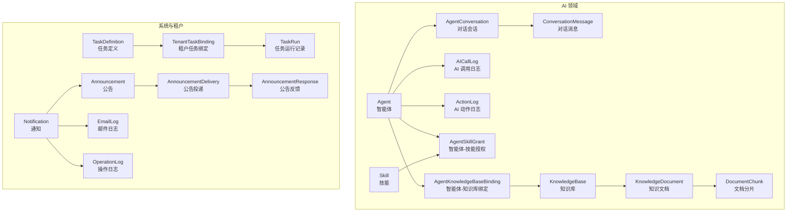
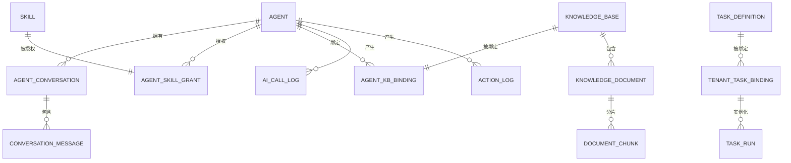
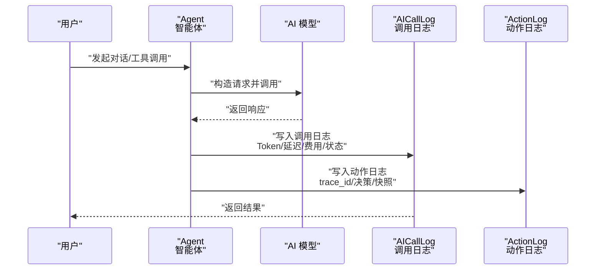
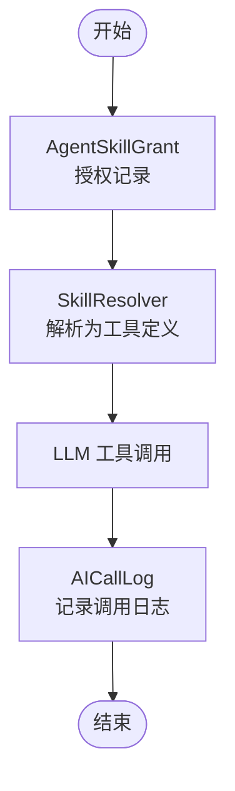
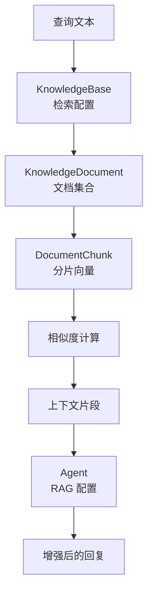
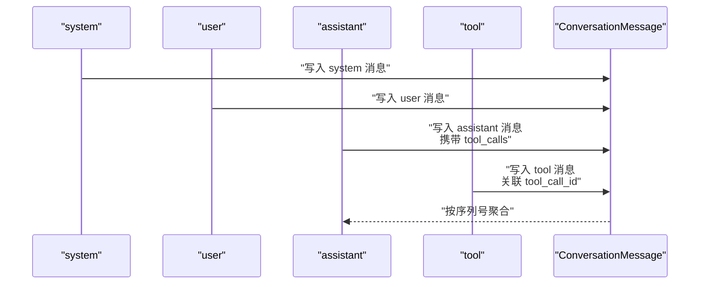
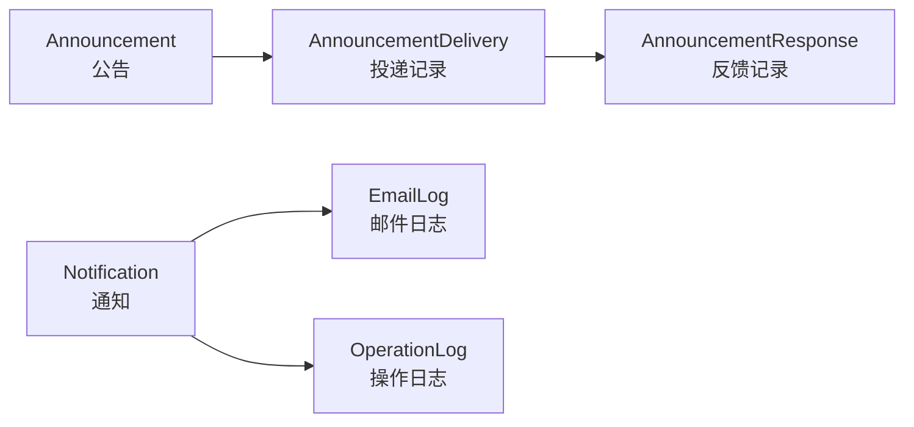
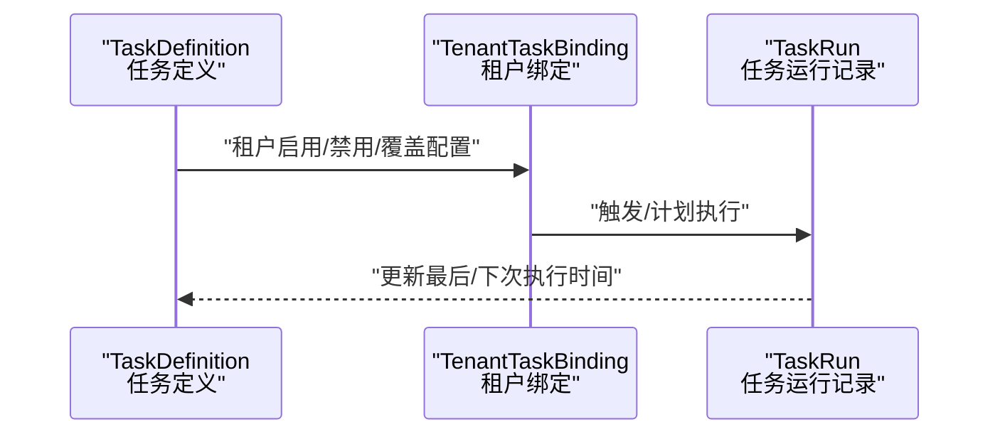
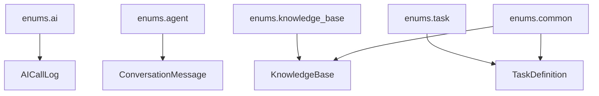

# 业务数据模型

<cite>
**本文档引用的文件**
- [backend/app/models/ai/call_log.py](file://backend/app/models/ai/call_log.py)
- [backend/app/models/ai/conversation_message.py](file://backend/app/models/ai/conversation_message.py)
- [backend/app/models/ai/knowledge_base.py](file://backend/app/models/ai/knowledge_base.py)
- [backend/app/models/ai/agent.py](file://backend/app/models/ai/agent.py)
- [backend/app/models/ai/skill.py](file://backend/app/models/ai/skill.py)
- [backend/app/models/system/task_definition.py](file://backend/app/models/system/task_definition.py)
- [backend/app/models/common/notification.py](file://backend/app/models/common/notification.py)
- [backend/app/models/ai/agent_conversation.py](file://backend/app/models/ai/agent_conversation.py)
- [backend/app/models/ai/agent_kb_binding.py](file://backend/app/models/ai/agent_kb_binding.py)
- [backend/app/models/ai/agent_skill_grant.py](file://backend/app/models/ai/agent_skill_grant.py)
- [backend/app/models/ai/knowledge_document.py](file://backend/app/models/ai/knowledge_document.py)
- [backend/app/models/ai/document_chunk.py](file://backend/app/models/ai/document_chunk.py)
- [backend/app/models/ai/action_log.py](file://backend/app/models/ai/action_log.py)
- [backend/app/models/system/task_run.py](file://backend/app/models/system/task_run.py)
- [backend/app/models/system/tenant_task_binding.py](file://backend/app/models/system/tenant_task_binding.py)
- [backend/app/models/system/operation_log.py](file://backend/app/models/system/operation_log.py)
- [backend/app/models/system/email_log.py](file://backend/app/models/system/email_log.py)
- [backend/app/models/tenant/announcement.py](file://backend/app/models/tenant/announcement.py)
- [backend/app/models/tenant/announcement_delivery.py](file://backend/app/models/tenant/announcement_delivery.py)
- [backend/app/models/tenant/announcement_response.py](file://backend/app/models/tenant/announcement_response.py)
- [backend/app/enums/ai.py](file://backend/app/enums/ai.py)
- [backend/app/enums/agent.py](file://backend/app/enums/agent.py)
- [backend/app/enums/knowledge_base.py](file://backend/app/enums/knowledge_base.py)
- [backend/app/enums/task.py](file://backend/app/enums/task.py)
- [backend/app/enums/common.py](file://backend/app/enums/common.py)
</cite>

## 目录
1. [简介](#简介)
2. [项目结构](#项目结构)
3. [核心组件](#核心组件)
4. [架构总览](#架构总览)
5. [详细组件分析](#详细组件分析)
6. [依赖分析](#依赖分析)
7. [性能考虑](#性能考虑)
8. [故障排查指南](#故障排查指南)
9. [结论](#结论)
10. [附录](#附录)

## 简介
本文件聚焦于业务数据模型，系统性梳理并文档化以下核心业务实体及其交互关系：
- AI 调用日志：记录每次 AI 请求与响应，支撑计费、用量统计与可观测性。
- 技能管理：封装可被智能体使用的技能单元，支持多种类型与来源。
- 知识库：提供向量化检索能力，支撑 RAG 场景。
- 对话消息：独立存储对话消息，支持角色、函数调用与序列化。
- 通知系统：涵盖站内公告、邮件通知与系统通知等。
- 任务调度：下一代任务定义与运行模型，统一承载定时与后台任务。

文档解释各模型的设计理念、业务规则与约束，并给出数据层面的业务流程映射、查询优化建议与扩展演进策略。

## 项目结构
围绕上述业务主题，后端采用按领域分层的组织方式：
- models：业务实体定义（SQLAlchemy ORM 模型）
- schemas：API 输入输出与校验模型
- services：业务服务层
- repositories：仓储层
- enums：枚举与常量
- tasks：Celery 任务定义
- migrations：数据库迁移脚本

图表来源
- [backend/app/models/ai/agent.py:34-369](file://backend/app/models/ai/agent.py#L34-L369)
- [backend/app/models/ai/agent_conversation.py](file://backend/app/models/ai/agent_conversation.py)
- [backend/app/models/ai/conversation_message.py:18-178](file://backend/app/models/ai/conversation_message.py#L18-L178)
- [backend/app/models/ai/call_log.py:18-310](file://backend/app/models/ai/call_log.py#L18-L310)
- [backend/app/models/ai/action_log.py](file://backend/app/models/ai/action_log.py)
- [backend/app/models/ai/skill.py:19-254](file://backend/app/models/ai/skill.py#L19-L254)
- [backend/app/models/ai/knowledge_base.py:33-273](file://backend/app/models/ai/knowledge_base.py#L33-L273)
- [backend/app/models/ai/knowledge_document.py](file://backend/app/models/ai/knowledge_document.py)
- [backend/app/models/ai/document_chunk.py](file://backend/app/models/ai/document_chunk.py)
- [backend/app/models/ai/agent_kb_binding.py](file://backend/app/models/ai/agent_kb_binding.py)
- [backend/app/models/ai/agent_skill_grant.py](file://backend/app/models/ai/agent_skill_grant.py)
- [backend/app/models/system/task_definition.py:19-250](file://backend/app/models/system/task_definition.py#L19-L250)
- [backend/app/models/system/task_run.py](file://backend/app/models/system/task_run.py)
- [backend/app/models/system/tenant_task_binding.py](file://backend/app/models/system/tenant_task_binding.py)
- [backend/app/models/common/notification.py](file://backend/app/models/common/notification.py)
- [backend/app/models/tenant/announcement.py](file://backend/app/models/tenant/announcement.py)
- [backend/app/models/tenant/announcement_delivery.py](file://backend/app/models/tenant/announcement_delivery.py)
- [backend/app/models/tenant/announcement_response.py](file://backend/app/models/tenant/announcement_response.py)
- [backend/app/models/system/operation_log.py](file://backend/app/models/system/operation_log.py)
- [backend/app/models/system/email_log.py](file://backend/app/models/system/email_log.py)

章节来源
- [backend/app/models/ai/agent.py:34-369](file://backend/app/models/ai/agent.py#L34-L369)
- [backend/app/models/system/task_definition.py:19-250](file://backend/app/models/system/task_definition.py#L19-L250)

## 核心组件
本节对关键业务实体进行深入剖析，说明其字段含义、索引设计、关系映射与约束规则。

- AI 调用日志（AICallLog）
  - 设计理念：统一记录 AI 请求与响应，支持计费、延迟、Token 使用、错误信息与路由结果快照，便于审计与成本分析。
  - 关键字段：用户标识、计费归属、调用方、访问渠道、供应商与模型、请求类型与调用类型、Token 用量、费用、延迟、状态、错误、请求哈希、请求元数据、路由结果与快照。
  - 约束与索引：多维度复合索引（企业+时间、计费企业+时间、智能体+时间、会话+时间、用户+状态、模型+时间），支持高效统计与筛选。
  - 业务规则：状态枚举、请求类型与调用类型枚举、路由结果与快照字段用于历史可读性。

- 对话消息（ConversationMessage）
  - 设计理念：独立存储每条消息，支持角色（system/user/assistant/tool）、函数调用（tool_calls、tool_call_id）、序列号与 Token 统计。
  - 关键字段：角色、内容、序列、Token 数、工具调用 JSON、工具调用 ID、工具名称、性能指标、关联智能体与模型、元数据。
  - 约束与索引：复合索引（会话+序列、租户+会话），支持有序遍历与快速定位。
  - 业务规则：assistant 角色可携带工具调用；tool 角色需关联工具调用 ID 与工具名称。

- 知识库（KnowledgeBase）
  - 设计理念：统一管理嵌入模型、视觉/音频/视频模型、分块策略、检索配置与状态；支持资源作用域与软删除。
  - 关键字段：归属企业、作用域、名称、描述、头像、嵌入模型与维度、视觉/音频/视频模型、分块大小与重叠、分块策略、检索模式、TopK、分数阈值、文档数量、分片总数、字节总量、状态。
  - 约束与索引：检查约束确保作用域与归属一致性，复合索引（归属企业+状态）。
  - 业务规则：平台级知识库作用域限定；Agent 运行时可覆盖 KB 级默认检索参数。

- 智能体（Agent）
  - 设计理念：抽象智能体配置，包括系统提示词、模型参数、状态与模式、配额、路由、记忆、变量、RAG、上下文、输出模式、欢迎语与建议问题。
  - 关键字段：作用域、来源插件、名称、描述、头像、关联模型、系统提示词、温度、最大 Token、TopP、状态、执行模式、已发布版本、可见性、配额配置、路由配置、记忆开关、输入变量、RAG 配置、上下文配置、输出模式、系统标志、欢迎语、建议问题。
  - 约束与索引：复合索引（归属企业+状态）。
  - 业务规则：系统标志与可见性控制投放范围；技能与知识库通过中间表授权与绑定。

- 技能（Skill）
  - 设计理念：面向用户的技能管理单元，支持 Toolkit、知识库、数据智能、内置等类型；通过解析器转换为 LLM 工具定义。
  - 关键字段：所属技能包、名称、稳定 Key、描述、头像、类型与来源、来源引用、技能 Markdown、版本、状态、只读托管、类型特定配置、工具包内容与元数据、输入/输出 Schema、系统标志、激活状态、排序、超时。
  - 约束与索引：多维索引（企业+类型、企业+激活、来源+状态）。
  - 业务规则：技能必须归属技能包；授权与绑定通过中间表实现解耦。

- 任务定义（TaskDefinition）
  - 设计理念：下一代任务调度的目录层，统一描述任务类型、调度方式、默认参数、优先级、重试与超时、通知策略与启用状态。
  - 关键字段：归属企业、唯一编码、名称、定义类型、处理器路径、分类、描述、作用域、默认调度类型、Cron 表达式、间隔秒数、默认队列、默认优先级、默认参数、覆盖配置 Schema、所需特性与插件、系统内置标志、最大重试、重试间隔、超时、失败通知、通知邮箱、启用状态、可编辑与可删除、最后/下次执行时间。
  - 约束与索引：优先级范围检查、唯一编码、作用域+类型、归属企业+启用、优先级索引。
  - 业务规则：定义类型与调度类型决定运行策略；默认参数可被租户覆盖。

章节来源
- [backend/app/models/ai/call_log.py:18-310](file://backend/app/models/ai/call_log.py#L18-L310)
- [backend/app/models/ai/conversation_message.py:18-178](file://backend/app/models/ai/conversation_message.py#L18-L178)
- [backend/app/models/ai/knowledge_base.py:33-273](file://backend/app/models/ai/knowledge_base.py#L33-L273)
- [backend/app/models/ai/agent.py:34-369](file://backend/app/models/ai/agent.py#L34-L369)
- [backend/app/models/ai/skill.py:19-254](file://backend/app/models/ai/skill.py#L19-L254)
- [backend/app/models/system/task_definition.py:19-250](file://backend/app/models/system/task_definition.py#L19-L250)

## 架构总览
下图展示核心业务实体在数据层面的交互关系与数据流：

图表来源
- [backend/app/models/ai/agent.py:34-369](file://backend/app/models/ai/agent.py#L34-L369)
- [backend/app/models/ai/agent_conversation.py](file://backend/app/models/ai/agent_conversation.py)
- [backend/app/models/ai/conversation_message.py:18-178](file://backend/app/models/ai/conversation_message.py#L18-L178)
- [backend/app/models/ai/skill.py:19-254](file://backend/app/models/ai/skill.py#L19-L254)
- [backend/app/models/ai/agent_skill_grant.py](file://backend/app/models/ai/agent_skill_grant.py)
- [backend/app/models/ai/knowledge_base.py:33-273](file://backend/app/models/ai/knowledge_base.py#L33-L273)
- [backend/app/models/ai/agent_kb_binding.py](file://backend/app/models/ai/agent_kb_binding.py)
- [backend/app/models/ai/knowledge_document.py](file://backend/app/models/ai/knowledge_document.py)
- [backend/app/models/ai/document_chunk.py](file://backend/app/models/ai/document_chunk.py)
- [backend/app/models/ai/call_log.py:18-310](file://backend/app/models/ai/call_log.py#L18-L310)
- [backend/app/models/ai/action_log.py](file://backend/app/models/ai/action_log.py)
- [backend/app/models/system/task_definition.py:19-250](file://backend/app/models/system/task_definition.py#L19-L250)
- [backend/app/models/system/tenant_task_binding.py](file://backend/app/models/system/tenant_task_binding.py)
- [backend/app/models/system/task_run.py](file://backend/app/models/system/task_run.py)

## 详细组件分析

### AI 调用链路（从调用到日志）
该流程体现一次完整的 AI 调用在数据层面的流转与落盘。

图表来源
- [backend/app/models/ai/call_log.py:18-310](file://backend/app/models/ai/call_log.py#L18-L310)
- [backend/app/models/ai/action_log.py](file://backend/app/models/ai/action_log.py)
- [backend/app/models/ai/agent.py:34-369](file://backend/app/models/ai/agent.py#L34-L369)

章节来源
- [backend/app/models/ai/call_log.py:18-310](file://backend/app/models/ai/call_log.py#L18-L310)
- [backend/app/models/ai/action_log.py](file://backend/app/models/ai/action_log.py)

### 技能执行过程（授权、解析与调用）
技能作为智能体可执行能力的最小单元，通过授权与解析器转换为工具定义并参与调用。

图表来源
- [backend/app/models/ai/agent_skill_grant.py](file://backend/app/models/ai/agent_skill_grant.py)
- [backend/app/models/ai/skill.py:19-254](file://backend/app/models/ai/skill.py#L19-L254)
- [backend/app/models/ai/call_log.py:18-310](file://backend/app/models/ai/call_log.py#L18-L310)

章节来源
- [backend/app/models/ai/skill.py:19-254](file://backend/app/models/ai/skill.py#L19-L254)
- [backend/app/models/ai/agent_skill_grant.py](file://backend/app/models/ai/agent_skill_grant.py)

### 知识检索流程（RAG）
知识库驱动的检索流程，结合智能体配置与文档分片完成相似度匹配与上下文增强。

图表来源
- [backend/app/models/ai/knowledge_base.py:33-273](file://backend/app/models/ai/knowledge_base.py#L33-L273)
- [backend/app/models/ai/knowledge_document.py](file://backend/app/models/ai/knowledge_document.py)
- [backend/app/models/ai/document_chunk.py](file://backend/app/models/ai/document_chunk.py)
- [backend/app/models/ai/agent.py:34-369](file://backend/app/models/ai/agent.py#L34-L369)

章节来源
- [backend/app/models/ai/knowledge_base.py:33-273](file://backend/app/models/ai/knowledge_base.py#L33-L273)
- [backend/app/models/ai/agent.py:34-369](file://backend/app/models/ai/agent.py#L34-L369)

### 对话消息序列与函数调用
对话消息以序列号维护顺序，支持 assistant 的工具调用与 tool 角色的回传。

图表来源
- [backend/app/models/ai/conversation_message.py:18-178](file://backend/app/models/ai/conversation_message.py#L18-L178)

章节来源
- [backend/app/models/ai/conversation_message.py:18-178](file://backend/app/models/ai/conversation_message.py#L18-L178)

### 通知系统（站内公告、邮件与操作日志）
通知体系覆盖站内公告、邮件发送与系统操作日志，支撑运营与审计。

图表来源
- [backend/app/models/tenant/announcement.py](file://backend/app/models/tenant/announcement.py)
- [backend/app/models/tenant/announcement_delivery.py](file://backend/app/models/tenant/announcement_delivery.py)
- [backend/app/models/tenant/announcement_response.py](file://backend/app/models/tenant/announcement_response.py)
- [backend/app/models/common/notification.py](file://backend/app/models/common/notification.py)
- [backend/app/models/system/email_log.py](file://backend/app/models/system/email_log.py)
- [backend/app/models/system/operation_log.py](file://backend/app/models/system/operation_log.py)

章节来源
- [backend/app/models/tenant/announcement.py](file://backend/app/models/tenant/announcement.py)
- [backend/app/models/tenant/announcement_delivery.py](file://backend/app/models/tenant/announcement_delivery.py)
- [backend/app/models/tenant/announcement_response.py](file://backend/app/models/tenant/announcement_response.py)
- [backend/app/models/common/notification.py](file://backend/app/models/common/notification.py)
- [backend/app/models/system/email_log.py](file://backend/app/models/system/email_log.py)
- [backend/app/models/system/operation_log.py](file://backend/app/models/system/operation_log.py)

### 任务调度（定义、绑定与运行）
任务调度采用“定义—绑定—运行”的三层结构，支持优先级、重试与通知。

图表来源
- [backend/app/models/system/task_definition.py:19-250](file://backend/app/models/system/task_definition.py#L19-L250)
- [backend/app/models/system/tenant_task_binding.py](file://backend/app/models/system/tenant_task_binding.py)
- [backend/app/models/system/task_run.py](file://backend/app/models/system/task_run.py)

章节来源
- [backend/app/models/system/task_definition.py:19-250](file://backend/app/models/system/task_definition.py#L19-L250)
- [backend/app/models/system/tenant_task_binding.py](file://backend/app/models/system/tenant_task_binding.py)
- [backend/app/models/system/task_run.py](file://backend/app/models/system/task_run.py)

## 依赖分析
- 枚举与常量：各模型广泛使用枚举与作用域常量，保证数据一致性与可读性。
- 外键与级联：智能体删除时级联删除对话、版本、授权与绑定；知识库删除时软删除文档。
- 资源作用域：通过作用域枚举与归属企业字段表达资源投放范围，配合中间表实现灵活授权。

图表来源
- [backend/app/enums/ai.py](file://backend/app/enums/ai.py)
- [backend/app/enums/agent.py](file://backend/app/enums/agent.py)
- [backend/app/enums/knowledge_base.py](file://backend/app/enums/knowledge_base.py)
- [backend/app/enums/task.py](file://backend/app/enums/task.py)
- [backend/app/enums/common.py](file://backend/app/enums/common.py)
- [backend/app/models/ai/call_log.py:18-310](file://backend/app/models/ai/call_log.py#L18-L310)
- [backend/app/models/ai/conversation_message.py:18-178](file://backend/app/models/ai/conversation_message.py#L18-L178)
- [backend/app/models/ai/knowledge_base.py:33-273](file://backend/app/models/ai/knowledge_base.py#L33-L273)
- [backend/app/models/system/task_definition.py:19-250](file://backend/app/models/system/task_definition.py#L19-L250)

章节来源
- [backend/app/enums/ai.py](file://backend/app/enums/ai.py)
- [backend/app/enums/agent.py](file://backend/app/enums/agent.py)
- [backend/app/enums/knowledge_base.py](file://backend/app/enums/knowledge_base.py)
- [backend/app/enums/task.py](file://backend/app/enums/task.py)
- [backend/app/enums/common.py](file://backend/app/enums/common.py)

## 性能考虑
- 索引策略
  - AI 调用日志：按企业/计费企业/智能体/会话/模型/用户状态建立复合索引，满足高频统计与筛选需求。
  - 对话消息：按会话+序列与租户+会话建立索引，支持有序遍历与快速定位。
  - 知识库：按归属企业+状态建立索引，加速检索与状态统计。
  - 任务定义：按编码唯一、作用域+类型、归属企业+启用、默认优先级建立索引，提升调度效率。
- 查询优化建议
  - 分页与投影：列表接口尽量使用投影字段与分页，避免 SELECT *。
  - 复合过滤：优先使用已建索引字段组合进行 WHERE 条件过滤。
  - 缓存命中：利用请求哈希字段进行重复请求识别与缓存命中判断。
- 写入优化
  - 批量插入：对话消息与调用日志可采用批量写入减少往返。
  - 异步处理：任务调度与通知发送建议异步化，降低主流程阻塞。

## 故障排查指南
- AI 调用异常
  - 检查状态字段与错误信息字段，确认调用是否成功；核对延迟与费用字段是否为空。
  - 关注路由结果与快照字段，定位模型选择与权限问题。
- 对话消息缺失
  - 核对会话 ID 与序列号索引，确认消息是否正确写入；检查工具调用 ID 是否匹配。
- 知识库检索异常
  - 检查嵌入模型与维度、分块策略与 TopK 设置；确认文档分片是否完成向量化。
- 任务未执行
  - 检查任务定义启用状态、租户绑定状态与下次执行时间；查看任务运行记录与重试次数。

章节来源
- [backend/app/models/ai/call_log.py:18-310](file://backend/app/models/ai/call_log.py#L18-L310)
- [backend/app/models/ai/conversation_message.py:18-178](file://backend/app/models/ai/conversation_message.py#L18-L178)
- [backend/app/models/ai/knowledge_base.py:33-273](file://backend/app/models/ai/knowledge_base.py#L33-L273)
- [backend/app/models/system/task_definition.py:19-250](file://backend/app/models/system/task_definition.py#L19-L250)

## 结论
本文档从数据模型视角系统化梳理了 AI 调用日志、技能管理、知识库、对话消息、通知系统与任务调度的核心实体与交互关系。通过明确字段语义、索引设计与业务规则，为后续功能扩展与性能优化提供了坚实基础。建议在新增字段或调整业务逻辑时，同步完善索引与约束，确保数据一致性与查询效率。

## 附录
- 扩展性与演进策略
  - 字段演进：新增字段应具备默认值与非空约束，避免破坏现有查询与统计。
  - 索引演进：根据查询热点动态增加复合索引，定期审查冗余索引。
  - 架构演进：任务调度与通知体系逐步向事件驱动与可观测性方向演进，保持模块解耦与可观测性指标完善。