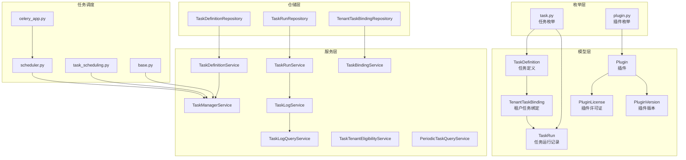
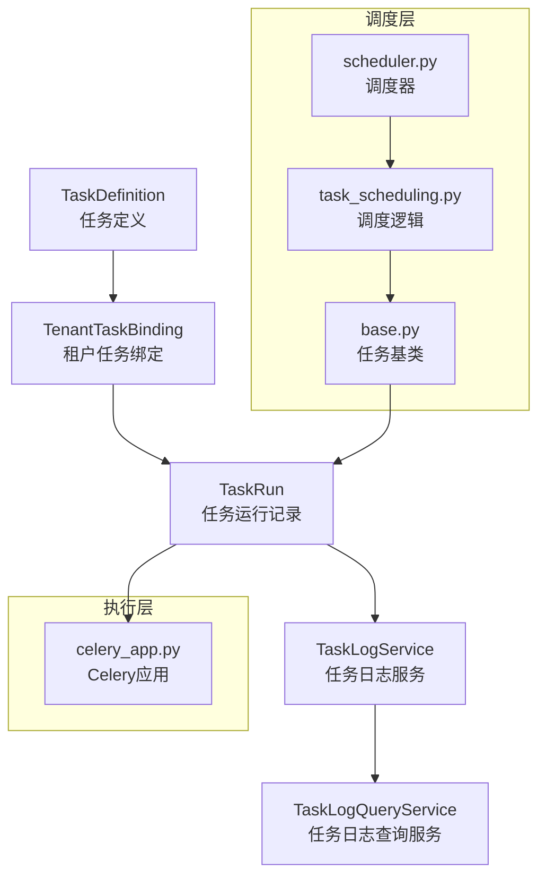
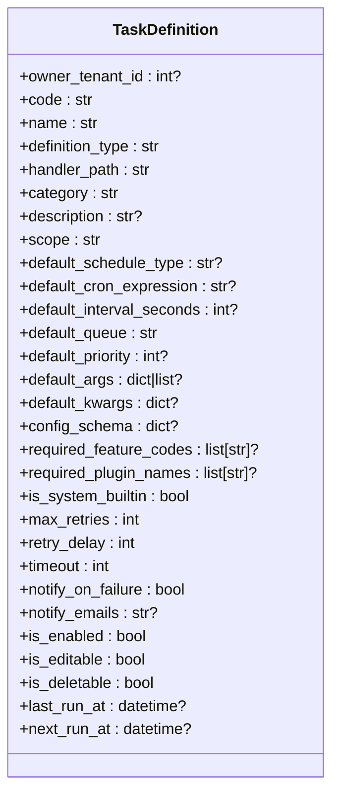
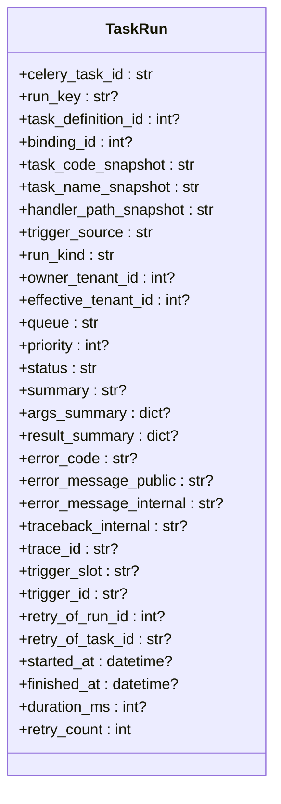
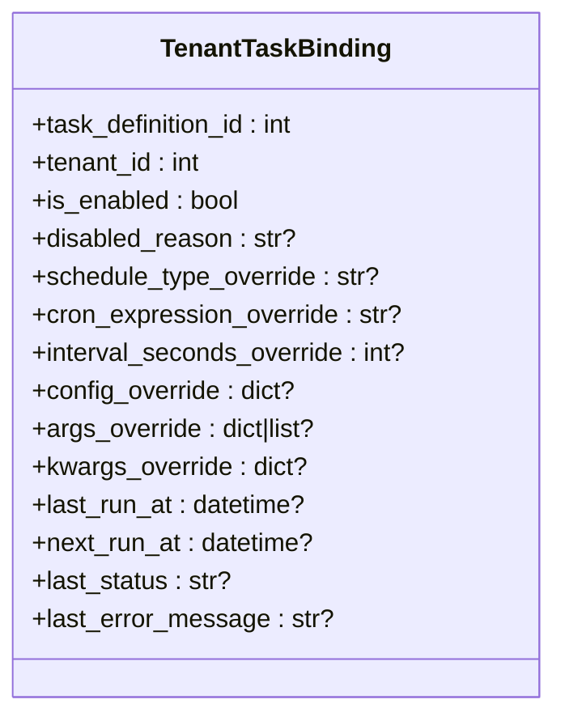
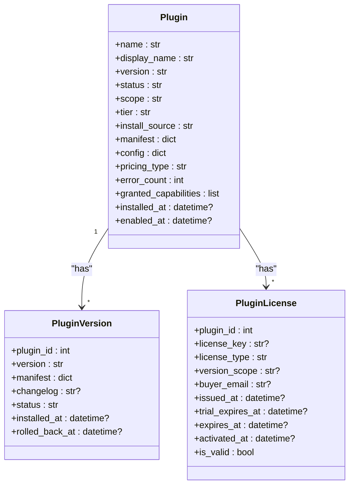
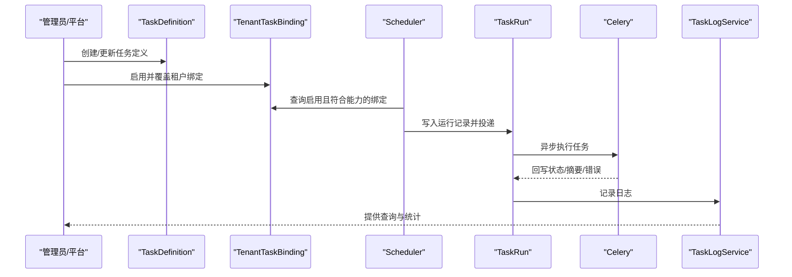
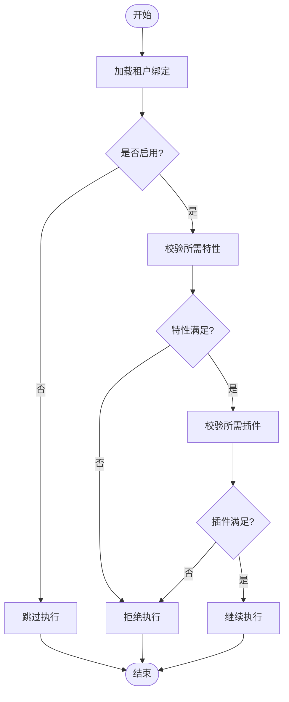
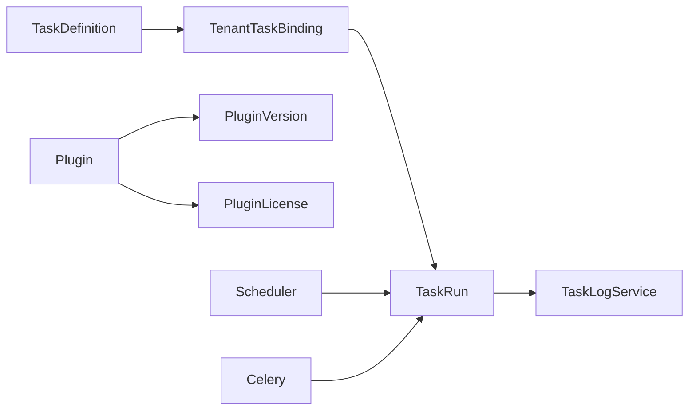

# 任务管理系统模型

<cite>
**本文引用的文件**
- [backend/app/models/system/task_definition.py](file://backend/app/models/system/task_definition.py)
- [backend/app/models/system/task_run.py](file://backend/app/models/system/task_run.py)
- [backend/app/models/system/tenant_task_binding.py](file://backend/app/models/system/tenant_task_binding.py)
- [backend/app/models/system/plugin.py](file://backend/app/models/system/plugin.py)
- [backend/app/models/system/plugin_license.py](file://backend/app/models/system/plugin_license.py)
- [backend/app/models/system/plugin_version.py](file://backend/app/models/system/plugin_version.py)
- [backend/app/enums/task.py](file://backend/app/enums/task.py)
- [backend/app/enums/plugin.py](file://backend/app/enums/plugin.py)
- [backend/app/repositories/system/task_definition_repository.py](file://backend/app/repositories/system/task_definition_repository.py)
- [backend/app/repositories/system/task_run_repository.py](file://backend/app/repositories/system/task_run_repository.py)
- [backend/app/repositories/system/tenant_task_binding_repository.py](file://backend/app/repositories/system/tenant_task_binding_repository.py)
- [backend/app/services/system/task_definition_service.py](file://backend/app/services/system/task_definition_service.py)
- [backend/app/services/system/task_run_service.py](file://backend/app/services/system/task_run_service.py)
- [backend/app/services/system/task_binding_service.py](file://backend/app/services/system/task_binding_service.py)
- [backend/app/services/system/task_manager_service.py](file://backend/app/services/system/task_manager_service.py)
- [backend/app/services/system/task_log_service.py](file://backend/app/services/system/task_log_service.py)
- [backend/app/services/system/task_log_query_service.py](file://backend/app/services/system/task_log_query_service.py)
- [backend/app/services/system/task_tenant_eligibility_service.py](file://backend/app/services/system/task_tenant_eligibility_service.py)
- [backend/app/services/system/periodic_task_query_service.py](file://backend/app/services/system/periodic_task_query_service.py)
- [backend/app/schemas/system/periodic_task.py](file://backend/app/schemas/system/periodic_task.py)
- [backend/app/schemas/system/task_log.py](file://backend/app/schemas/system/task_log.py)
- [backend/app/tasks/scheduler.py](file://backend/app/tasks/scheduler.py)
- [backend/app/tasks/task_scheduling.py](file://backend/app/tasks/task_scheduling.py)
- [backend/app/tasks/base.py](file://backend/app/tasks/base.py)
- [backend/app/celery_app.py](file://backend/app/celery_app.py)
- [backend/migrations/versions/20260325_0001_task_scheduling_foundation.py](file://backend/migrations/versions/20260325_0001_task_scheduling_foundation.py)
- [backend/migrations/versions/20260325_0002_task_definition_operational_fields.py](file://backend/migrations/versions/20260325_0002_task_definition_operational_fields.py)
- [backend/migrations/versions/20260325_0003_task_definition_operational_fields.py](file://backend/migrations/versions/20260325_0003_task_definition_operational_fields.py)
- [backend/migrations/versions/20260325_0004_backfill_task_definitions_from_periodic_tasks.py](file://backend/migrations/versions/20260325_0004_backfill_task_definitions_from_periodic_tasks.py)
- [backend/migrations/versions/20260325_0005_drop_legacy_task_tables.py](file://backend/migrations/versions/20260325_0005_drop_legacy_task_tables.py)
- [backend/migrations/versions/20260329_0010_normalize_task_definition_platform_scope.py](file://backend/migrations/versions/20260329_0010_normalize_task_definition_platform_scope.py)
- [backend/migrations/versions/20260329_0020_cleanup_task_binding_scope_semantics.py](file://backend/migrations/versions/20260329_0020_cleanup_task_binding_scope_semantics.py)
</cite>

## 目录
1. [引言](#引言)
2. [项目结构](#项目结构)
3. [核心组件](#核心组件)
4. [架构总览](#架构总览)
5. [详细组件分析](#详细组件分析)
6. [依赖分析](#依赖分析)
7. [性能考虑](#性能考虑)
8. [故障排查指南](#故障排查指南)
9. [结论](#结论)
10. [附录](#附录)

## 引言
本文件面向任务管理系统的核心数据模型与插件生态，系统化梳理任务定义、任务执行、租户任务绑定等核心实体，并扩展到插件、插件许可证、插件版本等模型设计。文档同时覆盖任务调度的业务流程（定义、执行计划、状态跟踪、结果记录）、任务与租户的绑定关系与权限控制机制、扩展点与自定义任务类型的实现方式、性能优化策略与大规模任务处理最佳实践，以及任务系统与插件生态的集成与版本兼容性管理。

## 项目结构
任务管理与插件相关的关键模块分布于以下目录：
- 模型层：backend/app/models/system 下的任务与插件相关模型
- 枚举层：backend/app/enums 下的任务与插件枚举
- 仓储层：backend/app/repositories/system 下的任务与插件相关仓储
- 服务层：backend/app/services/system 下的任务与插件相关服务
- 任务调度：backend/app/tasks 下的调度器与调度逻辑
- 迁移：backend/migrations/versions 下的任务调度迁移脚本

图表来源
- [backend/app/models/system/task_definition.py:1-250](file://backend/app/models/system/task_definition.py#L1-L250)
- [backend/app/models/system/task_run.py:1-268](file://backend/app/models/system/task_run.py#L1-L268)
- [backend/app/models/system/tenant_task_binding.py:1-145](file://backend/app/models/system/tenant_task_binding.py#L1-L145)
- [backend/app/models/system/plugin.py:1-253](file://backend/app/models/system/plugin.py#L1-L253)
- [backend/app/models/system/plugin_license.py:1-84](file://backend/app/models/system/plugin_license.py#L1-L84)
- [backend/app/models/system/plugin_version.py:1-69](file://backend/app/models/system/plugin_version.py#L1-L69)
- [backend/app/enums/task.py](file://backend/app/enums/task.py)
- [backend/app/enums/plugin.py](file://backend/app/enums/plugin.py)
- [backend/app/repositories/system/task_definition_repository.py](file://backend/app/repositories/system/task_definition_repository.py)
- [backend/app/repositories/system/task_run_repository.py](file://backend/app/repositories/system/task_run_repository.py)
- [backend/app/repositories/system/tenant_task_binding_repository.py](file://backend/app/repositories/system/tenant_task_binding_repository.py)
- [backend/app/services/system/task_definition_service.py](file://backend/app/services/system/task_definition_service.py)
- [backend/app/services/system/task_run_service.py](file://backend/app/services/system/task_run_service.py)
- [backend/app/services/system/task_binding_service.py](file://backend/app/services/system/task_binding_service.py)
- [backend/app/services/system/task_manager_service.py](file://backend/app/services/system/task_manager_service.py)
- [backend/app/services/system/task_log_service.py](file://backend/app/services/system/task_log_service.py)
- [backend/app/services/system/task_log_query_service.py](file://backend/app/services/system/task_log_query_service.py)
- [backend/app/services/system/task_tenant_eligibility_service.py](file://backend/app/services/system/task_tenant_eligibility_service.py)
- [backend/app/services/system/periodic_task_query_service.py](file://backend/app/services/system/periodic_task_query_service.py)
- [backend/app/tasks/scheduler.py](file://backend/app/tasks/scheduler.py)
- [backend/app/tasks/task_scheduling.py](file://backend/app/tasks/task_scheduling.py)
- [backend/app/tasks/base.py](file://backend/app/tasks/base.py)
- [backend/app/celery_app.py](file://backend/app/celery_app.py)

章节来源
- [backend/app/models/system/task_definition.py:1-250](file://backend/app/models/system/task_definition.py#L1-L250)
- [backend/app/models/system/task_run.py:1-268](file://backend/app/models/system/task_run.py#L1-L268)
- [backend/app/models/system/tenant_task_binding.py:1-145](file://backend/app/models/system/tenant_task_binding.py#L1-L145)
- [backend/app/models/system/plugin.py:1-253](file://backend/app/models/system/plugin.py#L1-L253)
- [backend/app/models/system/plugin_license.py:1-84](file://backend/app/models/system/plugin_license.py#L1-L84)
- [backend/app/models/system/plugin_version.py:1-69](file://backend/app/models/system/plugin_version.py#L1-L69)

## 核心组件
本节聚焦任务与插件的核心数据模型及其职责边界。

- 任务定义（TaskDefinition）
  - 职责：描述“这是什么任务”，不直接表达企业启停或执行结果；统一承载平台任务定义，支持默认调度策略、队列与优先级、重试与超时、通知策略、可编辑/可删除等属性。
  - 关键字段：唯一编码、名称、处理器路径、分类、默认调度类型与表达式、默认间隔秒数、默认队列与优先级、默认参数、配置Schema、所需特性与插件、系统内置标记、重试/超时/通知等。
  - 索引与约束：唯一索引（code）、过滤/排序索引、检查约束（优先级范围）、外键（owner_tenant_id）。

- 任务运行记录（TaskRun）
  - 职责：记录单次执行与调度定义、租户绑定、触发来源之间的关系；承载执行状态、结果摘要、错误信息、链路追踪、重试来源等。
  - 关键字段：Celery任务ID、业务运行幂等键、定义与绑定快照、触发来源与运行类型、影响租户、队列与优先级、状态、摘要与输入/输出摘要、错误码与内外部错误信息、trace_id、触发槽位与请求ID、重试计数与来源等。
  - 索引与约束：唯一索引（celery_task_id、run_key）、多维过滤索引、外键（task_definition_id、binding_id、owner_tenant_id、effective_tenant_id）。

- 租户任务绑定（TenantTaskBinding）
  - 职责：表达企业对平台任务定义的启用、覆盖与运行态；每条记录代表“某企业是否启用某任务定义，以及如何覆盖默认策略”。
  - 关键字段：任务定义ID、租户ID、启用状态与禁用原因、调度覆盖（类型/表达式/间隔）、配置与参数覆盖、最近运行时间与状态、最近失败摘要等。
  - 索引与约束：唯一约束（定义-租户组合）、过滤索引、外键（task_definition_id、tenant_id）。

- 插件（Plugin）
  - 职责：插件主表，记录插件基本信息、外观、来源、分类与状态、定价、健康监控、依赖追踪、能力授权、时间戳等；并维护版本与许可证的级联删除依赖。
  - 关键字段：名称/显示名、当前版本、描述/作者、图标/颜色、主页/仓库/许可证/标签、作用域/状态/信任等级/安装来源/市场标识、清单/全局配置/AI需求、定价类型/详情、错误统计、已安装依赖、授权能力、安装/启用时间等。
  - 索引与约束：唯一索引（name）、过滤/排序/选择索引、删除依赖（PluginVersion、PluginLicense）。

- 插件许可证（PluginLicense）
  - 职责：记录插件许可证信息，支持试用/固定期限/永久等类型、版本范围、购买者邮箱、签发/激活/到期时间、有效性等。
  - 关键字段：插件ID、License Key、许可类型、版本范围、购买者邮箱、签发/激活/到期时间、有效性等。

- 插件版本（PluginVersion）
  - 职责：记录插件版本历史，包含版本号、清单、变更日志、状态、安装/回退时间等。
  - 关键字段：插件ID、版本号、清单、变更日志、状态、安装/回退时间等。

章节来源
- [backend/app/models/system/task_definition.py:19-250](file://backend/app/models/system/task_definition.py#L19-L250)
- [backend/app/models/system/task_run.py:18-268](file://backend/app/models/system/task_run.py#L18-L268)
- [backend/app/models/system/tenant_task_binding.py:17-145](file://backend/app/models/system/tenant_task_binding.py#L17-L145)
- [backend/app/models/system/plugin.py:14-253](file://backend/app/models/system/plugin.py#L14-L253)
- [backend/app/models/system/plugin_license.py:13-84](file://backend/app/models/system/plugin_license.py#L13-L84)
- [backend/app/models/system/plugin_version.py:13-69](file://backend/app/models/system/plugin_version.py#L13-L69)

## 架构总览
任务管理与插件生态通过“定义-绑定-执行-日志”的闭环协作实现统一调度与可观测性。调度器根据任务定义与租户绑定生成运行实例，执行器通过Celery异步执行，运行记录与日志服务负责状态与结果的持久化与查询。

图表来源
- [backend/app/tasks/scheduler.py](file://backend/app/tasks/scheduler.py)
- [backend/app/tasks/task_scheduling.py](file://backend/app/tasks/task_scheduling.py)
- [backend/app/tasks/base.py](file://backend/app/tasks/base.py)
- [backend/app/celery_app.py](file://backend/app/celery_app.py)
- [backend/app/models/system/task_definition.py:19-250](file://backend/app/models/system/task_definition.py#L19-L250)
- [backend/app/models/system/tenant_task_binding.py:17-145](file://backend/app/models/system/tenant_task_binding.py#L17-L145)
- [backend/app/models/system/task_run.py:18-268](file://backend/app/models/system/task_run.py#L18-L268)
- [backend/app/services/system/task_log_service.py](file://backend/app/services/system/task_log_service.py)
- [backend/app/services/system/task_log_query_service.py](file://backend/app/services/system/task_log_query_service.py)

## 详细组件分析

### 任务定义（TaskDefinition）分析
- 数据结构与复杂度
  - 字段数量：约30个字段，涵盖元数据、调度策略、执行参数、安全与合规、生命周期等。
  - 索引策略：唯一索引（code）、复合过滤索引（scope+definition_type、owner_tenant_id+is_enabled、default_priority），满足高并发查询与过滤。
  - 约束：优先级范围检查、外键约束（owner_tenant_id -> tenants.id）。
- 设计要点
  - 默认调度策略与执行参数通过JSON字段灵活扩展，便于跨租户统一配置与覆盖。
  - required_feature_codes与required_plugin_names用于任务启用前的租户能力与插件可见性校验。
  - is_system_builtin用于区分平台内置任务，便于权限与可见性控制。
- 性能与扩展
  - 通过过滤/排序索引支持大规模任务检索；建议在高频查询字段上保持索引一致性。
  - 可通过配置Schema与默认参数减少运行时计算开销。

图表来源
- [backend/app/models/system/task_definition.py:19-250](file://backend/app/models/system/task_definition.py#L19-L250)

章节来源
- [backend/app/models/system/task_definition.py:19-250](file://backend/app/models/system/task_definition.py#L19-L250)

### 任务运行记录（TaskRun）分析
- 数据结构与复杂度
  - 字段数量：约40个字段，覆盖执行上下文、触发来源、状态、结果与追踪。
  - 索引策略：唯一索引（celery_task_id、run_key）、多维过滤索引（定义-状态、影响租户-创建时间、触发来源-类型-创建时间等）。
  - 约束：外键（task_definition_id、binding_id、owner_tenant_id、effective_tenant_id、retry_of_run_id）。
- 设计要点
  - 快照字段（task_code_snapshot、task_name_snapshot、handler_path_snapshot）确保历史可追溯。
  - 触发来源与运行类型区分平台/手动/周期等场景，便于审计与统计。
  - 错误信息分公开/内部，trace_id支持端到端追踪。
- 性能与扩展
  - 建议对高频查询维度（状态、租户、创建时间）建立复合索引。
  - 对大字段（摘要、错误信息）进行压缩或外部存储以降低行宽。

图表来源
- [backend/app/models/system/task_run.py:18-268](file://backend/app/models/system/task_run.py#L18-L268)

章节来源
- [backend/app/models/system/task_run.py:18-268](file://backend/app/models/system/task_run.py#L18-L268)

### 租户任务绑定（TenantTaskBinding）分析
- 数据结构与复杂度
  - 字段数量：约20个字段，涵盖启用状态、调度与参数覆盖、运行状态与错误摘要等。
  - 索引策略：唯一约束（定义-租户组合）、过滤索引（租户+启用、定义+启用）。
  - 约束：外键（task_definition_id、tenant_id）。
- 设计要点
  - 支持对默认调度策略与参数的覆盖，满足租户差异化需求。
  - 记录最近运行状态与失败摘要，便于运维与告警。
- 性能与扩展
  - 唯一约束保证租户-定义组合的幂等性，避免重复绑定。
  - 建议定期清理无效绑定与过期覆盖项。

图表来源
- [backend/app/models/system/tenant_task_binding.py:17-145](file://backend/app/models/system/tenant_task_binding.py#L17-L145)

章节来源
- [backend/app/models/system/tenant_task_binding.py:17-145](file://backend/app/models/system/tenant_task_binding.py#L17-L145)

### 插件系统模型分析
- 插件（Plugin）
  - 关系：与PluginVersion、PluginLicense存在级联删除依赖，确保插件卸载时清理关联数据。
  - 字段：名称/显示名、版本、描述/作者、图标/颜色、主页/仓库/许可证/标签、作用域/状态/信任等级/安装来源/市场标识、清单/全局配置/AI需求、定价类型/详情、错误统计、已安装依赖、授权能力、安装/启用时间等。
- 插件许可证（PluginLicense）
  - 字段：插件ID、License Key、许可类型（试用/固定期限/永久）、版本范围、购买者邮箱、签发/激活/到期时间、有效性。
- 插件版本（PluginVersion）
  - 字段：插件ID、版本号、清单、变更日志、状态、安装/回退时间。

图表来源
- [backend/app/models/system/plugin.py:14-253](file://backend/app/models/system/plugin.py#L14-L253)
- [backend/app/models/system/plugin_license.py:13-84](file://backend/app/models/system/plugin_license.py#L13-L84)
- [backend/app/models/system/plugin_version.py:13-69](file://backend/app/models/system/plugin_version.py#L13-L69)

章节来源
- [backend/app/models/system/plugin.py:14-253](file://backend/app/models/system/plugin.py#L14-L253)
- [backend/app/models/system/plugin_license.py:13-84](file://backend/app/models/system/plugin_license.py#L13-L84)
- [backend/app/models/system/plugin_version.py:13-69](file://backend/app/models/system/plugin_version.py#L13-L69)

### 任务调度业务流程
- 任务定义阶段
  - 创建/更新任务定义，设置默认调度策略、执行参数、通知策略与可见性。
  - 通过required_feature_codes与required_plugin_names声明能力与插件依赖。
- 绑定阶段
  - 租户启用平台任务定义，可选择覆盖默认调度与参数。
  - 系统根据绑定状态与能力校验决定是否允许执行。
- 执行计划阶段
  - 调度器根据定义与绑定生成运行实例，写入TaskRun并投递到Celery。
  - 支持周期/间隔/Cron等多种调度类型与优先级队列。
- 执行与状态跟踪
  - 执行器异步执行任务，更新TaskRun状态、摘要与错误信息。
  - 日志服务记录执行轨迹，查询服务支持按条件检索。
- 结果记录与通知
  - 成功/失败均记录摘要与追踪信息；失败时按策略发送通知。

图表来源
- [backend/app/tasks/scheduler.py](file://backend/app/tasks/scheduler.py)
- [backend/app/tasks/task_scheduling.py](file://backend/app/tasks/task_scheduling.py)
- [backend/app/models/system/task_definition.py:19-250](file://backend/app/models/system/task_definition.py#L19-L250)
- [backend/app/models/system/tenant_task_binding.py:17-145](file://backend/app/models/system/tenant_task_binding.py#L17-L145)
- [backend/app/models/system/task_run.py:18-268](file://backend/app/models/system/task_run.py#L18-L268)
- [backend/app/services/system/task_log_service.py](file://backend/app/services/system/task_log_service.py)

章节来源
- [backend/app/tasks/scheduler.py](file://backend/app/tasks/scheduler.py)
- [backend/app/tasks/task_scheduling.py](file://backend/app/tasks/task_scheduling.py)
- [backend/app/models/system/task_definition.py:19-250](file://backend/app/models/system/task_definition.py#L19-L250)
- [backend/app/models/system/tenant_task_binding.py:17-145](file://backend/app/models/system/tenant_task_binding.py#L17-L145)
- [backend/app/models/system/task_run.py:18-268](file://backend/app/models/system/task_run.py#L18-L268)
- [backend/app/services/system/task_log_service.py](file://backend/app/services/system/task_log_service.py)

### 任务与租户的绑定关系与权限控制
- 绑定关系
  - TenantTaskBinding记录租户对任务定义的启用状态与覆盖策略，唯一约束保证租户-定义组合的幂等性。
  - 通过required_feature_codes与required_plugin_names在绑定阶段进行能力与插件可见性校验。
- 权限控制机制
  - scope字段控制任务资源投放范围（如平台/租户/全局），结合owner_tenant_id限制归属。
  - is_system_builtin用于区分平台内置任务，便于管理员权限与可见性控制。
  - 通过TaskTenantEligibilityService在执行前进行租户资格与能力评估。

图表来源
- [backend/app/models/system/tenant_task_binding.py:17-145](file://backend/app/models/system/tenant_task_binding.py#L17-L145)
- [backend/app/models/system/task_definition.py:19-250](file://backend/app/models/system/task_definition.py#L19-L250)
- [backend/app/services/system/task_tenant_eligibility_service.py](file://backend/app/services/system/task_tenant_eligibility_service.py)

章节来源
- [backend/app/models/system/tenant_task_binding.py:17-145](file://backend/app/models/system/tenant_task_binding.py#L17-L145)
- [backend/app/models/system/task_definition.py:19-250](file://backend/app/models/system/task_definition.py#L19-L250)
- [backend/app/services/system/task_tenant_eligibility_service.py](file://backend/app/services/system/task_tenant_eligibility_service.py)

### 扩展点与自定义任务类型实现
- 扩展点
  - handler_path指向具体执行处理器，支持自定义任务类型注册与解析。
  - config_schema与默认参数允许在定义层声明可配置项，运行时动态注入。
  - required_feature_codes与required_plugin_names用于声明能力与插件依赖，便于扩展生态。
- 自定义任务类型实现步骤
  - 定义任务处理器（handler_path），遵循任务基类约定。
  - 在TaskDefinition中注册任务定义，设置默认调度与参数。
  - 通过TenantTaskBinding启用并覆盖租户策略。
  - 使用TaskManagerService进行启动/停止/重试等操作。

章节来源
- [backend/app/models/system/task_definition.py:19-250](file://backend/app/models/system/task_definition.py#L19-L250)
- [backend/app/tasks/base.py](file://backend/app/tasks/base.py)
- [backend/app/services/system/task_manager_service.py](file://backend/app/services/system/task_manager_service.py)

### 任务系统与插件生态的集成与版本兼容性
- 集成方式
  - 通过required_plugin_names声明任务所需的插件名称，绑定阶段进行可见性与可用性校验。
  - 插件的manifest与config为任务提供运行时能力与配置注入。
- 版本兼容性管理
  - PluginVersion记录版本历史与状态，支持安装/回退。
  - PluginLicense管理试用/固定期限/永久等许可类型与有效期。
  - 通过版本范围（version_scope）与清单（manifest）控制兼容性。

章节来源
- [backend/app/models/system/task_definition.py:19-250](file://backend/app/models/system/task_definition.py#L19-L250)
- [backend/app/models/system/plugin.py:14-253](file://backend/app/models/system/plugin.py#L14-L253)
- [backend/app/models/system/plugin_version.py:13-69](file://backend/app/models/system/plugin_version.py#L13-L69)
- [backend/app/models/system/plugin_license.py:13-84](file://backend/app/models/system/plugin_license.py#L13-L84)

## 依赖分析
- 组件耦合与内聚
  - TaskDefinition与TenantTaskBinding强耦合（一对多），TenantTaskBinding与TaskRun弱耦合（一对多）。
  - 插件主表与版本/许可证存在级联删除依赖，降低数据碎片风险。
- 直接与间接依赖
  - TaskRun依赖TaskDefinition与TenantTaskBinding快照，间接依赖租户与插件生态。
  - 调度器与执行器通过Celery解耦，日志服务提供统一查询入口。
- 外部依赖与集成点
  - Celery作为消息中间件与执行引擎。
  - 数据库索引与约束保障查询性能与数据一致性。

图表来源
- [backend/app/models/system/task_definition.py:19-250](file://backend/app/models/system/task_definition.py#L19-L250)
- [backend/app/models/system/tenant_task_binding.py:17-145](file://backend/app/models/system/tenant_task_binding.py#L17-L145)
- [backend/app/models/system/task_run.py:18-268](file://backend/app/models/system/task_run.py#L18-L268)
- [backend/app/models/system/plugin.py:14-253](file://backend/app/models/system/plugin.py#L14-L253)
- [backend/app/models/system/plugin_version.py:13-69](file://backend/app/models/system/plugin_version.py#L13-L69)
- [backend/app/models/system/plugin_license.py:13-84](file://backend/app/models/system/plugin_license.py#L13-L84)
- [backend/app/tasks/scheduler.py](file://backend/app/tasks/scheduler.py)
- [backend/app/celery_app.py](file://backend/app/celery_app.py)

章节来源
- [backend/app/models/system/task_definition.py:19-250](file://backend/app/models/system/task_definition.py#L19-L250)
- [backend/app/models/system/tenant_task_binding.py:17-145](file://backend/app/models/system/tenant_task_binding.py#L17-L145)
- [backend/app/models/system/task_run.py:18-268](file://backend/app/models/system/task_run.py#L18-L268)
- [backend/app/models/system/plugin.py:14-253](file://backend/app/models/system/plugin.py#L14-L253)
- [backend/app/models/system/plugin_version.py:13-69](file://backend/app/models/system/plugin_version.py#L13-L69)
- [backend/app/models/system/plugin_license.py:13-84](file://backend/app/models/system/plugin_license.py#L13-L84)
- [backend/app/tasks/scheduler.py](file://backend/app/tasks/scheduler.py)
- [backend/app/celery_app.py](file://backend/app/celery_app.py)

## 性能考虑
- 索引与查询优化
  - 为高频过滤字段（code、scope、owner_tenant_id、definition_type、tenant_id、is_enabled、status、created_at）建立复合索引。
  - 对TaskRun按定义-状态、租户-创建时间、触发来源-类型-创建时间建立索引，提升查询效率。
- 执行与队列
  - 使用默认队列与优先级字段，结合任务类型合理分配队列，避免热点队列。
  - 控制max_retries与retry_delay，防止抖动放大。
- 存储与日志
  - 对大字段（摘要、错误信息）进行压缩或外部化存储，降低行宽与IO压力。
  - 定期归档旧日志，保留必要索引与统计字段。
- 并发与锁
  - 使用幂等键（run_key）避免重复执行。
  - 对关键更新使用乐观锁或事务隔离级别，减少冲突。

## 故障排查指南
- 常见问题定位
  - 任务未执行：检查TenantTaskBinding启用状态与能力/插件依赖校验；查看TaskRun状态与错误摘要。
  - 执行失败：查看error_message_public/internal与traceback_internal，结合trace_id定位。
  - 调度异常：核对TaskDefinition默认调度与TenantTaskBinding覆盖是否一致；检查Cron/间隔表达式。
- 排查工具与接口
  - TaskLogQueryService提供按条件检索与统计；TaskRunRepository支持批量查询与更新。
  - TaskTenantEligibilityService用于快速验证租户资格与能力。

章节来源
- [backend/app/services/system/task_log_query_service.py](file://backend/app/services/system/task_log_query_service.py)
- [backend/app/repositories/system/task_run_repository.py](file://backend/app/repositories/system/task_run_repository.py)
- [backend/app/services/system/task_tenant_eligibility_service.py](file://backend/app/services/system/task_tenant_eligibility_service.py)

## 结论
任务管理系统通过“定义-绑定-执行-日志”闭环实现了统一调度与可观测性，结合租户能力与插件生态，支持灵活的扩展与版本兼容。通过合理的索引、队列与日志策略，可在大规模任务场景下保持稳定与高性能。建议持续完善能力校验与插件依赖治理，强化可观测性与自动化运维能力。

## 附录
- 迁移脚本要点
  - 任务调度基础表与字段迁移：创建task_definitions、task_runs、tenant_task_bindings等表及索引。
  - 从旧周期任务迁移至新模型：将periodic_tasks数据映射到task_definitions并清理旧表。
  - 平台作用域规范化与绑定语义清理：统一scope与绑定语义，确保跨租户一致性。

章节来源
- [backend/migrations/versions/20260325_0001_task_scheduling_foundation.py](file://backend/migrations/versions/20260325_0001_task_scheduling_foundation.py)
- [backend/migrations/versions/20260325_0002_task_definition_operational_fields.py](file://backend/migrations/versions/20260325_0002_task_definition_operational_fields.py)
- [backend/migrations/versions/20260325_0003_task_definition_operational_fields.py](file://backend/migrations/versions/20260325_0003_task_definition_operational_fields.py)
- [backend/migrations/versions/20260325_0004_backfill_task_definitions_from_periodic_tasks.py](file://backend/migrations/versions/20260325_0004_backfill_task_definitions_from_periodic_tasks.py)
- [backend/migrations/versions/20260325_0005_drop_legacy_task_tables.py](file://backend/migrations/versions/20260325_0005_drop_legacy_task_tables.py)
- [backend/migrations/versions/20260329_0010_normalize_task_definition_platform_scope.py](file://backend/migrations/versions/20260329_0010_normalize_task_definition_platform_scope.py)
- [backend/migrations/versions/20260329_0020_cleanup_task_binding_scope_semantics.py](file://backend/migrations/versions/20260329_0020_cleanup_task_binding_scope_semantics.py)