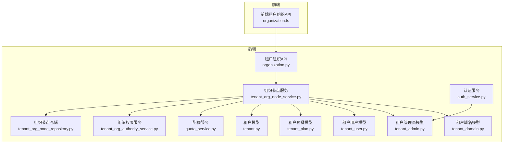
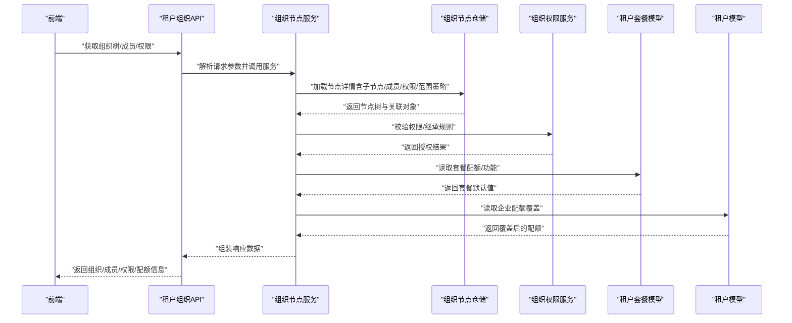
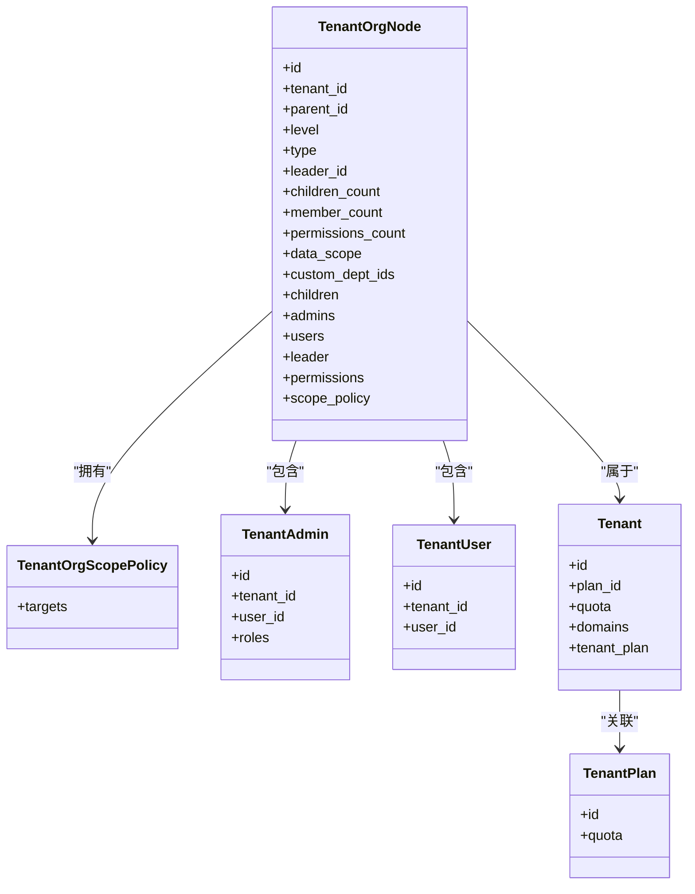
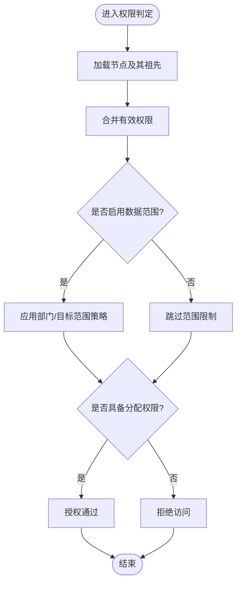
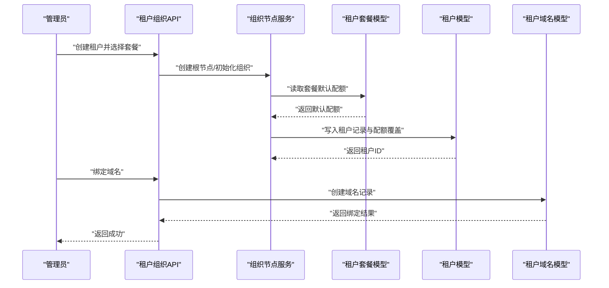
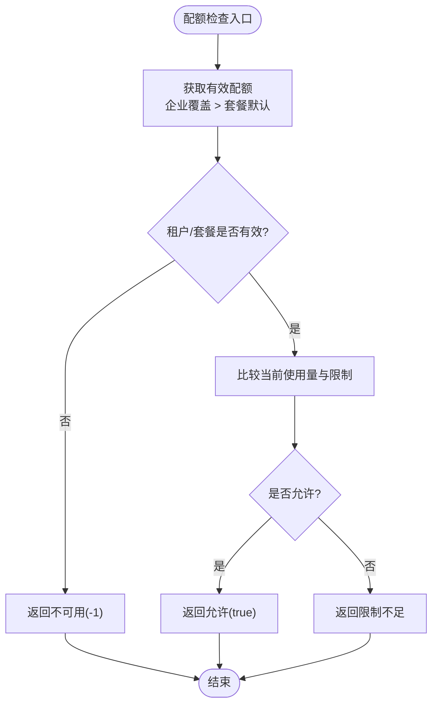
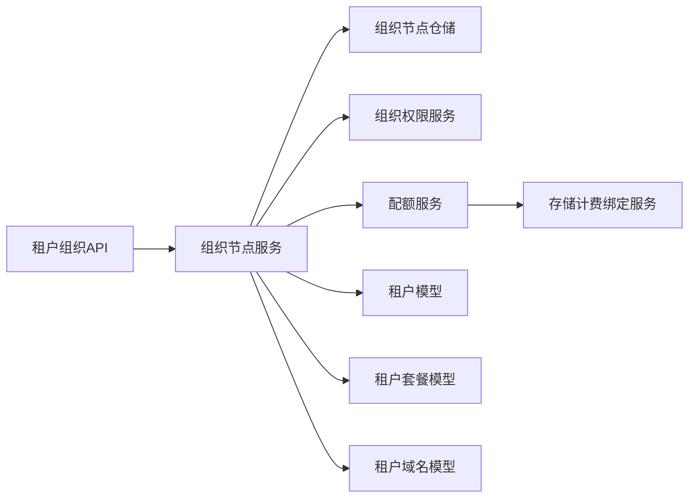

# 租户组织模型

<cite>
**本文引用的文件**
- [backend/app/models/org/tenant_org_node.py](file://backend/app/models/org/tenant_org_node.py)
- [backend/app/models/tenant/tenant.py](file://backend/app/models/tenant/tenant.py)
- [backend/app/models/tenant/tenant_admin.py](file://backend/app/models/tenant/tenant_admin.py)
- [backend/app/models/tenant/tenant_domain.py](file://backend/app/models/tenant/tenant_domain.py)
- [backend/app/models/tenant/tenant_plan.py](file://backend/app/models/tenant/tenant_plan.py)
- [backend/app/models/tenant/tenant_user.py](file://backend/app/models/tenant/tenant_user.py)
- [backend/app/repositories/tenant/tenant_org_node_repository.py](file://backend/app/repositories/tenant/tenant_org_node_repository.py)
- [backend/app/services/tenant/tenant_org_node_service.py](file://backend/app/services/tenant/tenant_org_node_service.py)
- [backend/app/services/tenant/tenant_org_authority_service.py](file://backend/app/services/tenant/tenant_org_authority_service.py)
- [backend/app/services/tenant/quota_service.py](file://backend/app/services/tenant/quota_service.py)
- [backend/app/api/tenant/organization.py](file://backend/app/api/tenant/organization.py)
- [frontend/apps/web-antd/src/api/tenant/organization.ts](file://frontend/apps/web-antd/src/api/tenant/organization.ts)
- [backend/migrations/versions/20260116_0006_add_organization_root_nodes.py](file://backend/migrations/versions/20260116_0006_add_organization_root_nodes.py)
- [backend/migrations/versions/20260117_f785c12f1c4f_add_tenant_plan_tables.py](file://backend/migrations/versions/20260117_f785c12f1c4f_add_tenant_plan_tables.py)
- [backend/migrations/versions/20260307_add_tenant_user_roles.py](file://backend/migrations/versions/20260307_add_tenant_user_roles.py)
- [backend/migrations/versions/20260325_org_authority_rebuild.py](file://backend/migrations/versions/20260325_org_authority_rebuild.py)
- [backend/migrations/versions/20260325_org_node_perm.py](file://backend/migrations/versions/20260325_org_node_perm.py)
- [backend/app/ai/quota_manager.py](file://backend/app/ai/quota_manager.py)
- [backend/app/services/common/auth_service.py](file://backend/app/services/common/auth_service.py)
- [backend/plugins/storage-billing/backend/services/binding_service.py](file://backend/plugins/storage-billing/backend/services/binding_service.py)
</cite>

## 目录
1. [引言](#引言)
2. [项目结构](#项目结构)
3. [核心组件](#核心组件)
4. [架构总览](#架构总览)
5. [详细组件分析](#详细组件分析)
6. [依赖分析](#依赖分析)
7. [性能考虑](#性能考虑)
8. [故障排查指南](#故障排查指南)
9. [结论](#结论)
10. [附录](#附录)

## 引言
本技术文档围绕多租户组织模型展开，系统性阐述租户（tenant）、租户用户（tenant_user）、租户域名（tenant_domain）、租户管理员（tenant_admin）、租户套餐（tenant_plan）等核心实体的数据结构与交互关系，并深入解析管理组织节点（admin_org_node）与租户组织节点（tenant_org_node）的层级结构设计、权限继承机制、业务流程（租户创建、用户管理、域名绑定、权限分配）、安全隔离策略、数据保护措施、扩容与迁移方案，以及租户套餐与功能权限的映射关系与计费模型集成。

## 项目结构
后端采用分层架构，多租户相关能力主要分布在以下模块：
- 模型层：定义租户、用户、域名、套餐、组织节点等实体及其关系
- 仓储层：封装数据库访问与查询优化（如 selectinload）
- 服务层：组织节点服务、权限服务、配额服务等业务逻辑
- API 层：对外暴露租户组织管理接口
- 迁移脚本：组织根节点、套餐表、用户角色、权限重建等历史演进

图表来源
- [backend/app/api/tenant/organization.py](file://backend/app/api/tenant/organization.py)
- [backend/app/services/tenant/tenant_org_node_service.py](file://backend/app/services/tenant/tenant_org_node_service.py)
- [backend/app/services/tenant/tenant_org_authority_service.py](file://backend/app/services/tenant/tenant_org_authority_service.py)
- [backend/app/repositories/tenant/tenant_org_node_repository.py](file://backend/app/repositories/tenant/tenant_org_node_repository.py)
- [backend/app/models/tenant/tenant.py](file://backend/app/models/tenant/tenant.py)
- [backend/app/models/tenant/tenant_plan.py](file://backend/app/models/tenant/tenant_plan.py)
- [backend/app/models/tenant/tenant_user.py](file://backend/app/models/tenant/tenant_user.py)
- [backend/app/models/tenant/tenant_admin.py](file://backend/app/models/tenant/tenant_admin.py)
- [backend/app/models/tenant/tenant_domain.py](file://backend/app/models/tenant/tenant_domain.py)
- [backend/app/services/tenant/quota_service.py](file://backend/app/services/tenant/quota_service.py)
- [backend/app/services/common/auth_service.py](file://backend/app/services/common/auth_service.py)
- [frontend/apps/web-antd/src/api/tenant/organization.ts](file://frontend/apps/web-antd/src/api/tenant/organization.ts)

章节来源
- [backend/app/api/tenant/organization.py](file://backend/app/api/tenant/organization.py)
- [backend/app/services/tenant/tenant_org_node_service.py](file://backend/app/services/tenant/tenant_org_node_service.py)
- [backend/app/repositories/tenant/tenant_org_node_repository.py](file://backend/app/repositories/tenant/tenant_org_node_repository.py)
- [frontend/apps/web-antd/src/api/tenant/organization.ts](file://frontend/apps/web-antd/src/api/tenant/organization.ts)

## 核心组件
本节聚焦多租户核心实体的数据结构与职责边界，涵盖租户、用户、域名、管理员、套餐及组织节点。

- 租户（tenant）
  - 关键字段：唯一标识、代码、名称、状态、套餐关联、配额覆盖、到期时间、备注、已退役设置等
  - 关系：一对多绑定域名；与套餐双向关联
  - 用途：承载租户生命周期、配额优先级（企业覆盖 > 套餐默认）、到期控制

- 租户用户（tenant_user）
  - 关键字段：归属租户、个人资料、登录凭据、状态等
  - 用途：租户内用户身份与会话管理

- 租户域名（tenant_domain）
  - 关键字段：租户绑定的域名、证书、状态、生效范围等
  - 用途：域名绑定、SSL 证书管理、按域鉴权

- 租户管理员（tenant_admin）
  - 关键字段：归属租户、角色、权限位、登录凭据、状态等
  - 用途：租户侧管理权限与操作审计

- 租户套餐（tenant_plan）
  - 关键字段：套餐代码、名称、状态、默认配额、功能开关等
  - 用途：定义租户可用能力与资源上限

- 组织节点（tenant_org_node）
  - 关键字段：层级、父节点、类型、负责人、成员数、权限集合、数据范围、自定义作用域目标等
  - 关系：父子层级、权限、成员（用户/管理员）、范围策略
  - 用途：组织树形结构、权限继承、成员管理、数据范围控制

章节来源
- [backend/app/models/tenant/tenant.py](file://backend/app/models/tenant/tenant.py)
- [backend/app/models/tenant/tenant_user.py](file://backend/app/models/tenant/tenant_user.py)
- [backend/app/models/tenant/tenant_domain.py](file://backend/app/models/tenant/tenant_domain.py)
- [backend/app/models/tenant/tenant_admin.py](file://backend/app/models/tenant/tenant_admin.py)
- [backend/app/models/tenant/tenant_plan.py](file://backend/app/models/tenant/tenant_plan.py)
- [backend/app/models/org/tenant_org_node.py](file://backend/app/models/org/tenant_org_node.py)

## 架构总览
多租户架构以“租户”为中心，通过组织节点构建树形层级，结合权限服务与配额服务实现细粒度控制。前端通过 API 调用后端服务完成组织管理、成员管理、权限分配与域名绑定等操作。

图表来源
- [backend/app/api/tenant/organization.py](file://backend/app/api/tenant/organization.py)
- [backend/app/services/tenant/tenant_org_node_service.py](file://backend/app/services/tenant/tenant_org_node_service.py)
- [backend/app/repositories/tenant/tenant_org_node_repository.py](file://backend/app/repositories/tenant/tenant_org_node_repository.py)
- [backend/app/services/tenant/tenant_org_authority_service.py](file://backend/app/services/tenant/tenant_org_authority_service.py)
- [backend/app/models/tenant/tenant_plan.py](file://backend/app/models/tenant/tenant_plan.py)
- [backend/app/models/tenant/tenant.py](file://backend/app/models/tenant/tenant.py)

## 详细组件分析

### 组织节点模型与仓储
- 数据结构要点
  - 节点具备层级、父子关系、类型、负责人、成员计数、权限集合、数据范围与自定义作用域目标
  - 支持懒加载与预加载组合，减少 N+1 查询
- 仓储特性
  - 提供按编码查询、编码唯一性校验、详情选项（预加载子节点、管理员、用户、领导者、范围策略、权限）
- 服务层职责
  - 组织节点服务负责树构建、成员管理、权限继承计算、配额与范围策略应用
  - 权限服务负责节点权限分配与继承规则校验

图表来源
- [backend/app/models/org/tenant_org_node.py](file://backend/app/models/org/tenant_org_node.py)
- [backend/app/models/tenant/tenant.py](file://backend/app/models/tenant/tenant.py)
- [backend/app/models/tenant/tenant_plan.py](file://backend/app/models/tenant/tenant_plan.py)
- [backend/app/models/tenant/tenant_admin.py](file://backend/app/models/tenant/tenant_admin.py)
- [backend/app/models/tenant/tenant_user.py](file://backend/app/models/tenant/tenant_user.py)

章节来源
- [backend/app/repositories/tenant/tenant_org_node_repository.py](file://backend/app/repositories/tenant/tenant_org_node_repository.py)
- [backend/app/services/tenant/tenant_org_node_service.py](file://backend/app/services/tenant/tenant_org_node_service.py)
- [backend/app/services/tenant/tenant_org_authority_service.py](file://backend/app/services/tenant/tenant_org_authority_service.py)

### 权限继承与范围策略
- 权限继承
  - 通过祖先链路合并有效权限，支持“仅自定义”或“自定义+继承”的混合模式
  - 节点可配置“可分配权限”与“可管理成员AI”等能力位
- 数据范围
  - 支持全局、部门自定义等范围模式，自定义目标可限定可见/可操作范围
- 授权判定
  - 通过组织权限服务对节点进行权限分配与继承规则校验，确保最小权限与正确继承

图表来源
- [backend/app/services/tenant/tenant_org_authority_service.py](file://backend/app/services/tenant/tenant_org_authority_service.py)
- [backend/app/models/org/tenant_org_node.py](file://backend/app/models/org/tenant_org_node.py)

章节来源
- [backend/app/services/tenant/tenant_org_authority_service.py](file://backend/app/services/tenant/tenant_org_authority_service.py)
- [backend/migrations/versions/20260325_org_authority_rebuild.py](file://backend/migrations/versions/20260325_org_authority_rebuild.py)
- [backend/migrations/versions/20260325_org_node_perm.py](file://backend/migrations/versions/20260325_org_node_perm.py)

### 租户创建与域名绑定流程
- 租户创建
  - 选择套餐并初始化配额；若未设置套餐，则使用套餐默认配额
  - 可设置到期时间与备注
- 域名绑定
  - 将域名与租户绑定，支持证书与状态管理
  - 域名唯一性约束与租户维度隔离
- 用户与管理员
  - 注册租户用户与管理员，支持密码重置与登录认证
  - 管理员具备租户内组织与权限管理能力

图表来源
- [backend/app/api/tenant/organization.py](file://backend/app/api/tenant/organization.py)
- [backend/app/services/tenant/tenant_org_node_service.py](file://backend/app/services/tenant/tenant_org_node_service.py)
- [backend/app/models/tenant/tenant_plan.py](file://backend/app/models/tenant/tenant_plan.py)
- [backend/app/models/tenant/tenant.py](file://backend/app/models/tenant/tenant.py)
- [backend/app/models/tenant/tenant_domain.py](file://backend/app/models/tenant/tenant_domain.py)

章节来源
- [backend/app/services/common/auth_service.py](file://backend/app/services/common/auth_service.py)
- [backend/migrations/versions/20260117_f785c12f1c4f_add_tenant_plan_tables.py](file://backend/migrations/versions/20260117_f785c12f1c4f_add_tenant_plan_tables.py)
- [backend/migrations/versions/20260112_0002_tenant_domains.py](file://backend/migrations/versions/20260112_0002_tenant_domains.py)

### 配额与计费模型集成
- 配额优先级
  - 企业配额覆盖 > 套餐默认配额；当租户被禁用或套餐无效时，相关配额降级为不可用
- 计费集成
  - 存储计费插件提供“官方对账/直通”两种计费模式，支持桶、域名、账号、标签等作用域类型
  - 通过绑定服务序列化/反序列化计费绑定信息，记录验证状态与快照

图表来源
- [backend/app/services/tenant/quota_service.py](file://backend/app/services/tenant/quota_service.py)
- [backend/app/ai/quota_manager.py](file://backend/app/ai/quota_manager.py)
- [backend/plugins/storage-billing/backend/services/binding_service.py](file://backend/plugins/storage-billing/backend/services/binding_service.py)

章节来源
- [backend/app/services/tenant/quota_service.py](file://backend/app/services/tenant/quota_service.py)
- [backend/app/ai/quota_manager.py](file://backend/app/ai/quota_manager.py)
- [backend/plugins/storage-billing/backend/services/binding_service.py](file://backend/plugins/storage-billing/backend/services/binding_service.py)

### 安全策略与数据保护
- 多租户隔离
  - 所有实体均以租户维度隔离，查询默认带租户上下文过滤
  - 唯一性约束在租户维度生效（如域名、用户角色等）
- 权限最小化
  - 通过组织节点权限继承与范围策略，确保用户仅能访问其授权范围内的资源
- 登录与审计
  - 管理员登录支持验证码、开发引导登录、令牌刷新与密码变更
  - 操作日志与审计追踪贯穿关键流程

章节来源
- [backend/migrations/versions/20260307_add_tenant_user_roles.py](file://backend/migrations/versions/20260307_add_tenant_user_roles.py)
- [backend/migrations/versions/20260325_org_authority_rebuild.py](file://backend/migrations/versions/20260325_org_authority_rebuild.py)
- [backend/app/services/common/auth_service.py](file://backend/app/services/common/auth_service.py)

### 扩容与迁移方案
- 扩容
  - 通过配额服务动态评估当前使用量与限制，必要时触发套餐升级或企业配额覆盖
  - 存储计费插件支持按桶/域名/账号/标签等作用域扩展计费维度
- 迁移
  - 组织节点与权限重建迁移脚本确保历史数据兼容与权限体系稳定
  - 域名与证书迁移需同步更新绑定状态与验证状态

章节来源
- [backend/app/services/tenant/quota_service.py](file://backend/app/services/tenant/quota_service.py)
- [backend/plugins/storage-billing/backend/services/binding_service.py](file://backend/plugins/storage-billing/backend/services/binding_service.py)
- [backend/migrations/versions/20260325_org_authority_rebuild.py](file://backend/migrations/versions/20260325_org_authority_rebuild.py)
- [backend/migrations/versions/20260112_0002_tenant_domains.py](file://backend/migrations/versions/20260112_0002_tenant_domains.py)

## 依赖分析
- 组件耦合
  - 组织节点服务依赖仓储、权限服务、配额服务与模型层
  - API 层薄封装，主要负责参数解析与响应组装
- 外部依赖
  - 存储计费插件提供计费绑定与验证能力
  - Redis 用于配额检查缓存（在配额服务中使用）

图表来源
- [backend/app/api/tenant/organization.py](file://backend/app/api/tenant/organization.py)
- [backend/app/services/tenant/tenant_org_node_service.py](file://backend/app/services/tenant/tenant_org_node_service.py)
- [backend/app/repositories/tenant/tenant_org_node_repository.py](file://backend/app/repositories/tenant/tenant_org_node_repository.py)
- [backend/app/services/tenant/tenant_org_authority_service.py](file://backend/app/services/tenant/tenant_org_authority_service.py)
- [backend/app/services/tenant/quota_service.py](file://backend/app/services/tenant/quota_service.py)
- [backend/plugins/storage-billing/backend/services/binding_service.py](file://backend/plugins/storage-billing/backend/services/binding_service.py)

章节来源
- [backend/app/api/tenant/organization.py](file://backend/app/api/tenant/organization.py)
- [backend/app/services/tenant/tenant_org_node_service.py](file://backend/app/services/tenant/tenant_org_node_service.py)
- [backend/app/repositories/tenant/tenant_org_node_repository.py](file://backend/app/repositories/tenant/tenant_org_node_repository.py)
- [backend/app/services/tenant/quota_service.py](file://backend/app/services/tenant/quota_service.py)
- [backend/plugins/storage-billing/backend/services/binding_service.py](file://backend/plugins/storage-billing/backend/services/binding_service.py)

## 性能考虑
- 查询优化
  - 使用 selectinload 预加载子节点、管理员、用户、领导者、范围策略与权限，避免 N+1 问题
  - 仓储提供按编码查询与唯一性校验，减少重复扫描
- 缓存与配额
  - 配额检查结果可利用缓存降低数据库压力
- 前端渲染
  - 前端 API 对成员列表支持分页与后代包含选项，减轻一次性传输压力

章节来源
- [backend/app/repositories/tenant/tenant_org_node_repository.py](file://backend/app/repositories/tenant/tenant_org_node_repository.py)
- [frontend/apps/web-antd/src/api/tenant/organization.ts](file://frontend/apps/web-antd/src/api/tenant/organization.ts)

## 故障排查指南
- 常见问题
  - 权限不足：检查节点权限分配与继承链，确认“可分配权限”位与祖先节点授权
  - 数据范围异常：核对范围策略与自定义目标，确保目标节点未被删除
  - 配额超限：查看企业配额覆盖与套餐默认值，确认租户/套餐有效性
  - 域名绑定失败：检查域名唯一性与证书状态，确认绑定状态与验证状态
- 定位方法
  - 后端：通过组织权限服务与仓储日志定位权限与数据范围问题
  - 前端：通过成员列表分页参数与后代包含选项缩小范围

章节来源
- [backend/app/services/tenant/tenant_org_authority_service.py](file://backend/app/services/tenant/tenant_org_authority_service.py)
- [backend/app/repositories/tenant/tenant_org_node_repository.py](file://backend/app/repositories/tenant/tenant_org_node_repository.py)
- [backend/app/services/tenant/quota_service.py](file://backend/app/services/tenant/quota_service.py)
- [backend/app/models/tenant/tenant_domain.py](file://backend/app/models/tenant/tenant_domain.py)

## 结论
本多租户组织模型以租户为核心，通过组织节点树实现灵活的层级管理与权限继承，结合配额与计费体系保障资源可控与成本透明。权限服务与范围策略确保最小权限原则与数据隔离，迁移与扩容方案支撑业务持续演进。前后端协同通过标准化 API 与数据模型，形成高内聚、低耦合的多租户能力体系。

## 附录
- 历史演进
  - 组织根节点与权限重建迁移脚本确保历史数据兼容
  - 用户角色与租户维度唯一性约束逐步完善
- 相关迁移脚本
  - [添加组织根节点](file://backend/migrations/versions/20260116_0006_add_organization_root_nodes.py)
  - [添加租户套餐表](file://backend/migrations/versions/20260117_f785c12f1c4f_add_tenant_plan_tables.py)
  - [添加租户用户角色](file://backend/migrations/versions/20260307_add_tenant_user_roles.py)
  - [组织权限重建](file://backend/migrations/versions/20260325_org_authority_rebuild.py)
  - [组织节点权限](file://backend/migrations/versions/20260325_org_node_perm.py)