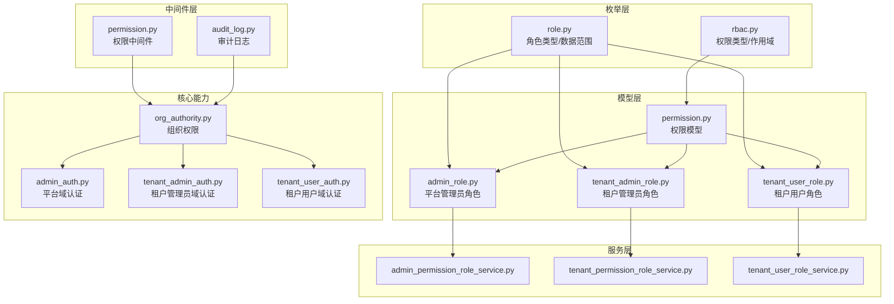
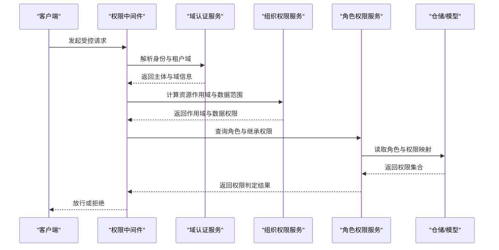
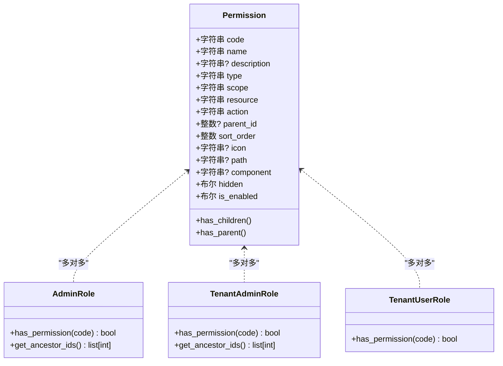
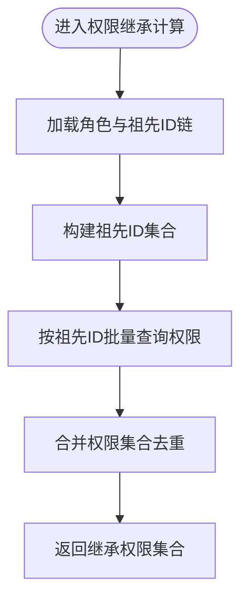

# 认证权限模型

<cite>
**本文档引用的文件**
- [rbac.py](file://backend/app/enums/rbac.py)
- [role.py](file://backend/app/enums/role.py)
- [permission.py](file://backend/app/models/auth/permission.py)
- [admin_role.py](file://backend/app/models/auth/admin_role.py)
- [tenant_admin_role.py](file://backend/app/models/auth/tenant_admin_role.py)
- [tenant_user_role.py](file://backend/app/models/auth/tenant_user_role.py)
- [permission.py](file://backend/app/middleware/permission.py)
- [org_authority.py](file://backend/app/core/org_authority.py)
- [admin_auth.py](file://backend/app/services/common/auth_domains/admin_auth.py)
- [tenant_admin_auth.py](file://backend/app/services/common/auth_domains/tenant_admin_auth.py)
- [tenant_user_auth.py](file://backend/app/services/common/auth_domains/tenant_user_auth.py)
- [admin_permission_role_service.py](file://backend/app/services/system/admin_permission_role_service.py)
- [tenant_permission_role_service.py](file://backend/app/services/tenant/tenant_permission_role_service.py)
- [tenant_user_role_service.py](file://backend/app/services/tenant/tenant_user_role_service.py)
- [tenant_user_role_repository.py](file://backend/app/repositories/tenant/tenant_user_role_repository.py)
- [audit_log.py](file://backend/app/middleware/audit_log.py)
- [operation_log_service_parts/permissions.py](file://backend/app/services/system/operation_log_service_parts/permissions.py)
- [20260320_unified_resource_and_permission_scope.py](file://backend/migrations/versions/20260320_unified_resource_and_permission_scope.py)
- [20260325_org_authority_rebuild.py](file://backend/migrations/versions/20260325_org_authority_rebuild.py)
</cite>

## 目录
1. [引言](#引言)
2. [项目结构](#项目结构)
3. [核心组件](#核心组件)
4. [架构总览](#架构总览)
5. [详细组件分析](#详细组件分析)
6. [依赖分析](#依赖分析)
7. [性能考虑](#性能考虑)
8. [故障排查指南](#故障排查指南)
9. [结论](#结论)
10. [附录](#附录)

## 引言
本文件系统化阐述本项目的认证授权模型，重点围绕基于角色的访问控制（RBAC）体系，覆盖管理员角色（admin_role）、权限（permission）、租户管理员角色（tenant_admin_role）、租户用户角色（tenant_user_role）等核心实体的数据结构设计与实现机制。文档同时说明角色继承、权限分配、资源访问控制、权限层次结构与作用域管理、权限验证业务流程与安全策略、扩展点与自定义权限类型、权限与业务资源绑定及动态权限控制、以及权限审计与合规性检查的技术实现。

## 项目结构
RBAC相关代码主要分布在以下模块：
- 枚举层：权限类型与作用域、角色类型与数据范围
- 模型层：权限、平台管理员角色、租户管理员角色、租户用户角色
- 服务层：系统与租户维度的角色权限服务
- 中间件层：权限中间件与审计日志
- 核心能力：组织权限与域认证服务
- 迁移层：权限与资源作用域统一、组织权限重建

图表来源
- [rbac.py:1-37](file://backend/app/enums/rbac.py#L1-L37)
- [role.py:1-47](file://backend/app/enums/role.py#L1-L47)
- [permission.py:1-159](file://backend/app/models/auth/permission.py#L1-L159)
- [admin_role.py:1-322](file://backend/app/models/auth/admin_role.py#L1-L322)
- [tenant_admin_role.py:1-327](file://backend/app/models/auth/tenant_admin_role.py#L1-L327)
- [tenant_user_role.py:1-177](file://backend/app/models/auth/tenant_user_role.py#L1-L177)
- [permission.py](file://backend/app/middleware/permission.py)
- [audit_log.py](file://backend/app/middleware/audit_log.py)
- [org_authority.py](file://backend/app/core/org_authority.py)
- [admin_auth.py](file://backend/app/services/common/auth_domains/admin_auth.py)
- [tenant_admin_auth.py](file://backend/app/services/common/auth_domains/tenant_admin_auth.py)
- [tenant_user_auth.py](file://backend/app/services/common/auth_domains/tenant_user_auth.py)

章节来源
- [rbac.py:1-37](file://backend/app/enums/rbac.py#L1-L37)
- [role.py:1-47](file://backend/app/enums/role.py#L1-L47)

## 核心组件
本节聚焦RBAC核心实体及其职责边界与协作关系。

- 权限（Permission）
  - 定义系统中所有权限点，支持菜单与操作两类权限，具备作用域（admin/tenant/both）与资源标识、操作标识等字段，支持装饰器自动注册与同步。
  - 具备联合唯一约束（code+scope），支持菜单树形结构与排序。
- 平台管理员角色（AdminRole）
  - 平台级角色，支持多级层级结构（父子关系、物化路径），子角色自动继承父角色权限；与权限为多对多关系；支持数据权限范围（行级过滤）。
- 租户管理员角色（TenantAdminRole）
  - 租户级角色，支持多级层级结构，继承规则与平台角色一致；在租户内保持角色代码唯一；支持数据权限范围。
- 租户用户角色（TenantUserRole）
  - 租户级用户角色，采用扁平结构（无层级），与权限多对多关联；用于业务用户权限控制。

章节来源
- [permission.py:1-159](file://backend/app/models/auth/permission.py#L1-L159)
- [admin_role.py:1-322](file://backend/app/models/auth/admin_role.py#L1-L322)
- [tenant_admin_role.py:1-327](file://backend/app/models/auth/tenant_admin_role.py#L1-L327)
- [tenant_user_role.py:1-177](file://backend/app/models/auth/tenant_user_role.py#L1-L177)

## 架构总览
RBAC架构由“权限定义—角色承载—用户归属—访问控制—审计合规”构成闭环。权限中间件负责请求级的权限校验，组织权限与域认证服务负责上下文解析与作用域判定，服务层负责角色权限的增删改查与继承计算，模型层负责持久化与关系映射，迁移层保障权限与资源作用域演进的一致性。

图表来源
- [permission.py](file://backend/app/middleware/permission.py)
- [org_authority.py](file://backend/app/core/org_authority.py)
- [admin_auth.py](file://backend/app/services/common/auth_domains/admin_auth.py)
- [tenant_admin_auth.py](file://backend/app/services/common/auth_domains/tenant_admin_auth.py)
- [tenant_user_auth.py](file://backend/app/services/common/auth_domains/tenant_user_auth.py)
- [admin_permission_role_service.py](file://backend/app/services/system/admin_permission_role_service.py)
- [tenant_permission_role_service.py](file://backend/app/services/tenant/tenant_permission_role_service.py)

## 详细组件分析

### 权限模型（Permission）
- 数据结构要点
  - 唯一性：code+scope联合唯一，确保权限代码在同一作用域内不重复。
  - 类型：菜单（menu）与操作（operation）两类，菜单类包含图标、前端路由、组件、隐藏等字段。
  - 作用域：admin/tenant/both，区分权限归属端别（与资源作用域解耦）。
  - 资源与动作：resource/action用于与业务资源绑定与动态控制。
  - 层级：支持父子关系与排序，形成权限树。
  - 状态：启用/禁用标志，便于灰度与回收。
- 复杂度与性能
  - 联合索引（code, scope）支持快速定位权限。
  - 菜单树查询采用selectin加载，减少N+1问题。
- 错误处理
  - 删除依赖：子权限级联软删除，避免孤儿权限。
- 扩展点
  - 通过装饰器自动注册权限，便于集中治理与版本化同步。

图表来源
- [permission.py:1-159](file://backend/app/models/auth/permission.py#L1-L159)
- [admin_role.py:289-314](file://backend/app/models/auth/admin_role.py#L289-L314)
- [tenant_admin_role.py:294-319](file://backend/app/models/auth/tenant_admin_role.py#L294-L319)
- [tenant_user_role.py:158-168](file://backend/app/models/auth/tenant_user_role.py#L158-L168)

章节来源
- [permission.py:1-159](file://backend/app/models/auth/permission.py#L1-L159)

### 平台管理员角色（AdminRole）
- 层级与继承
  - 物化路径（path）记录祖先ID序列，支持快速解析祖先集合。
  - 子角色自动继承父角色权限，继承计算通过祖先ID链与权限映射完成。
- 数据权限
  - 支持多种数据范围（全部/本部门及下级/仅本部门/仅自己/自定义部门列表），用于行级数据过滤。
- 成员与组织节点
  - 支持部门/岗位/职能角色三种节点类型，负责人与成员管理。
- 性能与复杂度
  - 层级查询基于物化路径解析，时间复杂度低；权限继承通过祖先ID集合并权限集合求并，适合批量计算。
- 错误处理
  - 删除依赖：阻止删除仍有管理员或存在子角色的管理员角色。

图表来源
- [admin_role.py:301-314](file://backend/app/models/auth/admin_role.py#L301-L314)
- [admin_role.py:227-232](file://backend/app/models/auth/admin_role.py#L227-L232)

章节来源
- [admin_role.py:1-322](file://backend/app/models/auth/admin_role.py#L1-L322)

### 租户管理员角色（TenantAdminRole）
- 与平台角色一致的继承机制，但作用域限定在租户内。
- 在租户内保持角色代码唯一，不同租户可同名。
- 支持数据权限范围与成员管理。

章节来源
- [tenant_admin_role.py:1-327](file://backend/app/models/auth/tenant_admin_role.py#L1-L327)

### 租户用户角色（TenantUserRole）
- 扁平结构，无层级，权限直接授予角色。
- 适用于业务用户场景，权限分配简洁明确。

章节来源
- [tenant_user_role.py:1-177](file://backend/app/models/auth/tenant_user_role.py#L1-L177)

### 权限中间件与域认证
- 权限中间件
  - 在请求进入业务控制器前进行权限校验，结合域认证与组织权限服务确定资源作用域与数据范围。
- 域认证服务
  - 平台域、租户管理员域、租户用户域分别解析身份与上下文，确保权限判定在正确域内执行。
- 组织权限服务
  - 提供资源作用域与数据权限的计算能力，支撑行级过滤与跨域权限判定。

章节来源
- [permission.py](file://backend/app/middleware/permission.py)
- [org_authority.py](file://backend/app/core/org_authority.py)
- [admin_auth.py](file://backend/app/services/common/auth_domains/admin_auth.py)
- [tenant_admin_auth.py](file://backend/app/services/common/auth_domains/tenant_admin_auth.py)
- [tenant_user_auth.py](file://backend/app/services/common/auth_domains/tenant_user_auth.py)

### 服务层：角色权限服务
- 系统级服务
  - 平台管理员角色权限服务：负责平台级角色与权限的增删改查、继承计算与同步。
- 租户级服务
  - 租户管理员角色权限服务：负责租户内角色权限管理与继承。
  - 租户用户角色服务：负责租户用户角色权限管理与用户绑定。
- 仓储与模型
  - 通过仓储层与模型层的多对多关系维护角色与权限映射，支持批量查询与更新。

章节来源
- [admin_permission_role_service.py](file://backend/app/services/system/admin_permission_role_service.py)
- [tenant_permission_role_service.py](file://backend/app/services/tenant/tenant_permission_role_service.py)
- [tenant_user_role_service.py](file://backend/app/services/tenant/tenant_user_role_service.py)
- [tenant_user_role_repository.py](file://backend/app/repositories/tenant/tenant_user_role_repository.py)

## 依赖分析
- 组件耦合
  - 权限模型是所有角色的承载者，角色与权限之间为多对多关系，通过中间表维护。
  - 角色模型依赖枚举（权限类型、作用域、角色类型、数据范围）。
  - 服务层依赖仓储层与模型层，向上提供领域服务。
  - 中间件依赖域认证与组织权限服务，向下驱动服务层。
- 外部依赖
  - 数据库ORM（SQLAlchemy）负责模型映射与查询优化。
  - 迁移层保证权限与资源作用域演进过程中的数据一致性。

图表来源
- [rbac.py:1-37](file://backend/app/enums/rbac.py#L1-L37)
- [role.py:1-47](file://backend/app/enums/role.py#L1-L47)
- [permission.py:1-159](file://backend/app/models/auth/permission.py#L1-L159)
- [admin_role.py:1-322](file://backend/app/models/auth/admin_role.py#L1-L322)
- [tenant_admin_role.py:1-327](file://backend/app/models/auth/tenant_admin_role.py#L1-L327)
- [tenant_user_role.py:1-177](file://backend/app/models/auth/tenant_user_role.py#L1-L177)

## 性能考虑
- 索引与查询
  - 权限联合唯一索引（code, scope）与多处字段索引（parent_id、path、level等）提升查询效率。
  - 菜单树与角色层级采用selectin加载，降低N+1查询开销。
- 继承计算
  - 通过物化路径解析祖先ID集合，配合批量权限查询与集合合并，实现高效继承。
- 缓存与批处理
  - 建议在高频权限查询场景引入缓存（如Redis）存储角色-权限映射与继承结果，结合失效策略保证一致性。
- 分页与排序
  - 角色与权限支持分页与排序，建议在前端与后端均实施合理的分页策略，避免一次性加载过多数据。

## 故障排查指南
- 权限未生效
  - 检查权限作用域（scope）与请求端别是否匹配；确认权限状态（is_enabled）与资源/动作绑定是否正确。
  - 核查角色是否继承了目标权限（平台/租户角色的物化路径与祖先ID链）。
- 角色删除失败
  - 查看删除依赖：若角色仍有关联管理员或子角色，将被阻止删除。
- 数据越权
  - 检查数据权限范围（data_scope）与自定义部门列表（custom_dept_ids）配置，确认组织权限服务的作用域计算逻辑。
- 审计与合规
  - 使用审计日志中间件记录权限相关操作；结合操作日志服务对敏感权限变更进行追踪与回溯。

章节来源
- [permission.py](file://backend/app/middleware/permission.py)
- [audit_log.py](file://backend/app/middleware/audit_log.py)
- [operation_log_service_parts/permissions.py](file://backend/app/services/system/operation_log_service_parts/permissions.py)

## 结论
本RBAC模型以权限为核心，通过清晰的权限类型与作用域、角色层级与继承、以及数据权限范围，实现了平台与租户双层权限体系。权限中间件与域认证、组织权限服务共同构成了请求级的访问控制闭环。迁移层保障了权限与资源作用域演进的稳定性。整体设计兼顾灵活性与安全性，支持扩展与定制，并提供了完善的审计与合规能力。

## 附录

### 权限与资源绑定及动态控制
- 资源绑定
  - 权限模型包含resource与action字段，用于与具体业务资源与操作绑定，支持细粒度控制。
- 动态权限控制
  - 通过组织权限服务与数据权限范围，实现基于上下文的动态权限判定与行级过滤。
- 迁移演进
  - 权限与资源作用域统一迁移确保历史数据与新模型兼容，组织权限重建迁移保障权限树与继承关系的正确性。

章节来源
- [permission.py:83-94](file://backend/app/models/auth/permission.py#L83-L94)
- [org_authority.py](file://backend/app/core/org_authority.py)
- [20260320_unified_resource_and_permission_scope.py](file://backend/migrations/versions/20260320_unified_resource_and_permission_scope.py)
- [20260325_org_authority_rebuild.py](file://backend/migrations/versions/20260325_org_authority_rebuild.py)