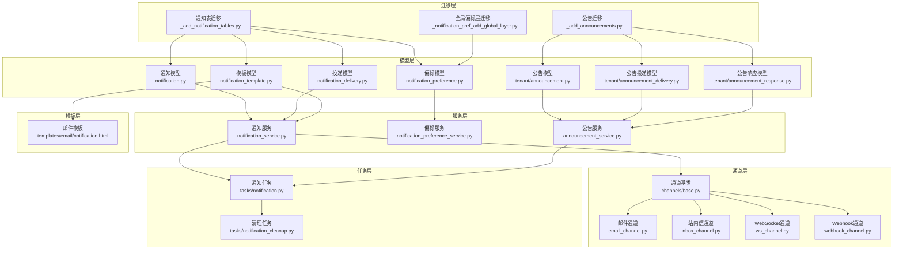
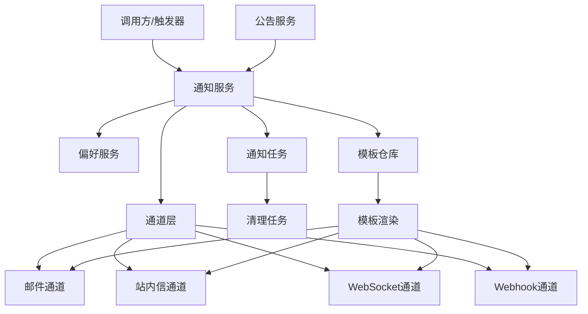
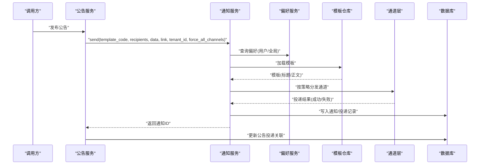
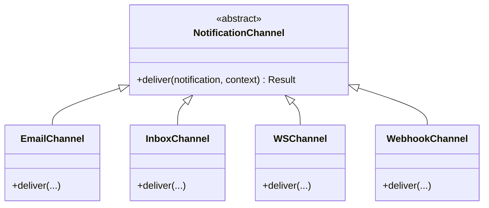
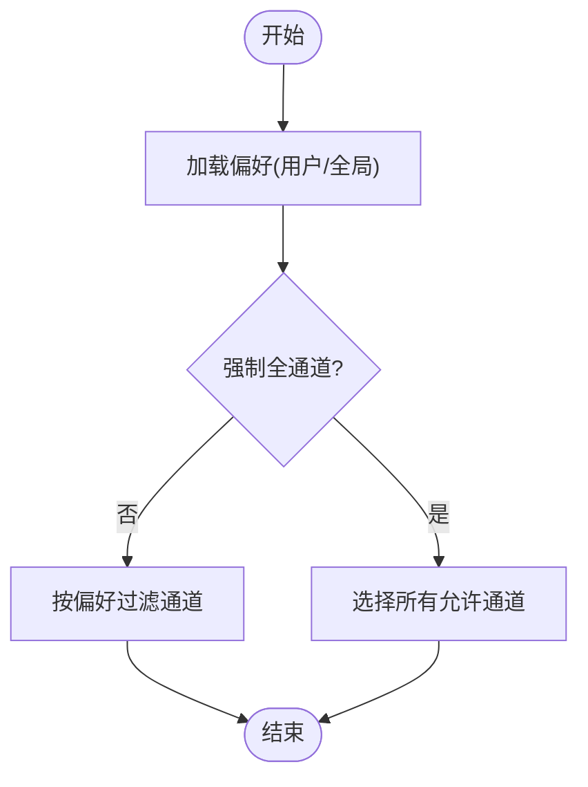
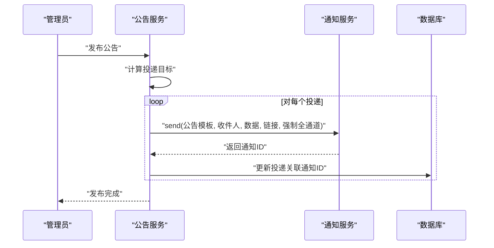
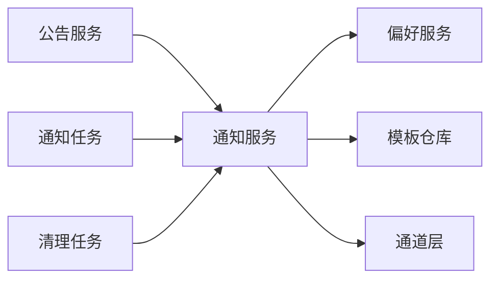
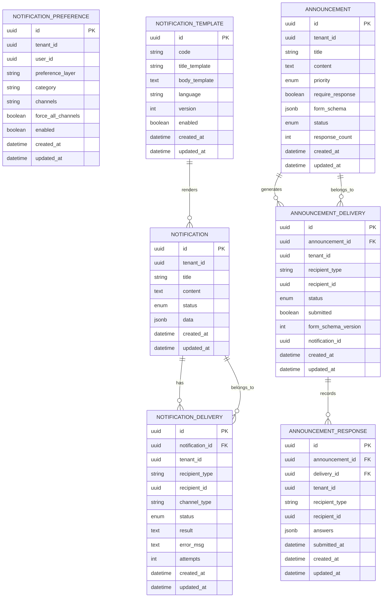

# 通知系统模型

<cite>
**本文引用的文件**
- [backend/app/models/common/notification.py](file://backend/app/models/common/notification.py)
- [backend/app/models/common/notification_delivery.py](file://backend/app/models/common/notification_delivery.py)
- [backend/app/models/common/notification_preference.py](file://backend/app/models/common/notification_preference.py)
- [backend/app/models/common/notification_template.py](file://backend/app/models/common/notification_template.py)
- [backend/app/models/tenant/announcement.py](file://backend/app/models/tenant/announcement.py)
- [backend/app/models/tenant/announcement_delivery.py](file://backend/app/models/tenant/announcement_delivery.py)
- [backend/app/models/tenant/announcement_response.py](file://backend/app/models/tenant/announcement_response.py)
- [backend/app/services/common/notification_service.py](file://backend/app/services/common/notification_service.py)
- [backend/app/services/common/notification_preference_service.py](file://backend/app/services/common/notification_preference_service.py)
- [backend/app/services/common/channels/base.py](file://backend/app/services/common/channels/base.py)
- [backend/app/services/common/channels/email_channel.py](file://backend/app/services/common/channels/email_channel.py)
- [backend/app/services/common/channels/inbox_channel.py](file://backend/app/services/common/channels/inbox_channel.py)
- [backend/app/services/common/channels/webhook_channel.py](file://backend/app/services/common/channels/webhook_channel.py)
- [backend/app/services/common/channels/ws_channel.py](file://backend/app/services/common/channels/ws_channel.py)
- [backend/app/services/tenant/announcement_service.py](file://backend/app/services/tenant/announcement_service.py)
- [backend/app/repositories/common/notification_template_repository.py](file://backend/app/repositories/common/notification_template_repository.py)
- [backend/app/tasks/notification.py](file://backend/app/tasks/notification.py)
- [backend/app/tasks/notification_cleanup.py](file://backend/app/tasks/notification_cleanup.py)
- [backend/migrations/versions/20260221_6b4fe69b2efc_add_notification_tables.py](file://backend/migrations/versions/20260221_6b4fe69b2efc_add_notification_tables.py)
- [backend/migrations/versions/20260222_seed_notification_cleanup_task.py](file://backend/migrations/versions/20260222_seed_notification_cleanup_task.py)
- [backend/migrations/versions/20260314_0949_notification_pref_add_global_layer.py](file://backend/migrations/versions/20260314_0949_notification_pref_add_global_layer.py)
- [backend/migrations/versions/20260430_0022_add_announcements.py](file://backend/migrations/versions/20260430_0022_add_announcements.py)
- [backend/app/templates/email/notification.html](file://backend/app/templates/email/notification.html)
</cite>

## 目录
1. [引言](#引言)
2. [项目结构](#项目结构)
3. [核心组件](#核心组件)
4. [架构总览](#架构总览)
5. [详细组件分析](#详细组件分析)
6. [依赖关系分析](#依赖关系分析)
7. [性能考虑](#性能考虑)
8. [故障排查指南](#故障排查指南)
9. [结论](#结论)
10. [附录](#附录)

## 引言
本文件面向通知系统模型，系统性梳理通知（notification）、通知投递（delivery）、通知偏好（preference）、通知模板（template）等核心实体的数据结构与交互；同时覆盖租户公告（announcement）、公告投递（delivery）、公告响应（response）的模型设计与业务流程。文档还解释通知创建、模板渲染、投递策略、状态跟踪等环节，并说明通知偏好对投递行为的影响机制，给出扩展点、自定义模板实现方式、性能优化策略与大规模投递最佳实践，以及与用户偏好的集成与隐私保护措施。

## 项目结构
通知系统由“模型层”“服务层”“通道层”“任务层”“模板层”“迁移层”构成，贯穿通用通知与租户公告两条主线。

图表来源
- [backend/app/models/common/notification.py](file://backend/app/models/common/notification.py)
- [backend/app/models/common/notification_delivery.py](file://backend/app/models/common/notification_delivery.py)
- [backend/app/models/common/notification_preference.py](file://backend/app/models/common/notification_preference.py)
- [backend/app/models/common/notification_template.py](file://backend/app/models/common/notification_template.py)
- [backend/app/models/tenant/announcement.py](file://backend/app/models/tenant/announcement.py)
- [backend/app/models/tenant/announcement_delivery.py](file://backend/app/models/tenant/announcement_delivery.py)
- [backend/app/models/tenant/announcement_response.py](file://backend/app/models/tenant/announcement_response.py)
- [backend/app/services/common/notification_service.py](file://backend/app/services/common/notification_service.py)
- [backend/app/services/common/notification_preference_service.py](file://backend/app/services/common/notification_preference_service.py)
- [backend/app/services/common/channels/base.py](file://backend/app/services/common/channels/base.py)
- [backend/app/services/common/channels/email_channel.py](file://backend/app/services/common/channels/email_channel.py)
- [backend/app/services/common/channels/inbox_channel.py](file://backend/app/services/common/channels/inbox_channel.py)
- [backend/app/services/common/channels/webhook_channel.py](file://backend/app/services/common/channels/webhook_channel.py)
- [backend/app/services/common/channels/ws_channel.py](file://backend/app/services/common/channels/ws_channel.py)
- [backend/app/services/tenant/announcement_service.py](file://backend/app/services/tenant/announcement_service.py)
- [backend/app/tasks/notification.py](file://backend/app/tasks/notification.py)
- [backend/app/tasks/notification_cleanup.py](file://backend/app/tasks/notification_cleanup.py)
- [backend/migrations/versions/20260221_6b4fe69b2efc_add_notification_tables.py](file://backend/migrations/versions/20260221_6b4fe69b2efc_add_notification_tables.py)
- [backend/migrations/versions/20260430_0022_add_announcements.py](file://backend/migrations/versions/20260430_0022_add_announcements.py)
- [backend/migrations/versions/20260314_0949_notification_pref_add_global_layer.py](file://backend/migrations/versions/20260314_0949_notification_pref_add_global_layer.py)
- [backend/app/templates/email/notification.html](file://backend/app/templates/email/notification.html)

章节来源
- [backend/app/models/common/notification.py](file://backend/app/models/common/notification.py)
- [backend/app/models/common/notification_delivery.py](file://backend/app/models/common/notification_delivery.py)
- [backend/app/models/common/notification_preference.py](file://backend/app/models/common/notification_preference.py)
- [backend/app/models/common/notification_template.py](file://backend/app/models/common/notification_template.py)
- [backend/app/models/tenant/announcement.py](file://backend/app/models/tenant/announcement.py)
- [backend/app/models/tenant/announcement_delivery.py](file://backend/app/models/tenant/announcement_delivery.py)
- [backend/app/models/tenant/announcement_response.py](file://backend/app/models/tenant/announcement_response.py)
- [backend/app/services/common/notification_service.py](file://backend/app/services/common/notification_service.py)
- [backend/app/services/common/notification_preference_service.py](file://backend/app/services/common/notification_preference_service.py)
- [backend/app/services/common/channels/base.py](file://backend/app/services/common/channels/base.py)
- [backend/app/services/common/channels/email_channel.py](file://backend/app/services/common/channels/email_channel.py)
- [backend/app/services/common/channels/inbox_channel.py](file://backend/app/services/common/channels/inbox_channel.py)
- [backend/app/services/common/channels/webhook_channel.py](file://backend/app/services/common/channels/webhook_channel.py)
- [backend/app/services/common/channels/ws_channel.py](file://backend/app/services/common/channels/ws_channel.py)
- [backend/app/services/tenant/announcement_service.py](file://backend/app/services/tenant/announcement_service.py)
- [backend/app/tasks/notification.py](file://backend/app/tasks/notification.py)
- [backend/app/tasks/notification_cleanup.py](file://backend/app/tasks/notification_cleanup.py)
- [backend/migrations/versions/20260221_6b4fe69b2efc_add_notification_tables.py](file://backend/migrations/versions/20260221_6b4fe69b2efc_add_notification_tables.py)
- [backend/migrations/versions/20260430_0022_add_announcements.py](file://backend/migrations/versions/20260430_0022_add_announcements.py)
- [backend/migrations/versions/20260314_0949_notification_pref_add_global_layer.py](file://backend/migrations/versions/20260314_0949_notification_pref_add_global_layer.py)
- [backend/app/templates/email/notification.html](file://backend/app/templates/email/notification.html)

## 核心组件
- 通知（Notification）
  - 描述：一次具体的通知实例，包含标题、内容、优先级、关联数据、租户标识、状态、创建时间等字段。
  - 关键属性：标题、内容、优先级、关联数据、租户ID、状态、创建/更新时间。
  - 章节来源
    - [backend/app/models/common/notification.py](file://backend/app/models/common/notification.py)

- 通知投递（NotificationDelivery）
  - 描述：通知在某一通道下的投递记录，包含收件人类型/ID、通道类型、状态、结果、错误信息、尝试次数等。
  - 关键属性：收件人类型/ID、通道类型、状态、结果、错误、重试次数。
  - 章节来源
    - [backend/app/models/common/notification_delivery.py](file://backend/app/models/common/notification_delivery.py)

- 通知偏好（NotificationPreference）
  - 描述：用户或全局层面对通知类型的偏好配置，决定是否允许、是否强制、是否多通道投递等。
  - 关键属性：偏好层级（用户/全局）、通知类型、通道白名单、强制投递标志、启用状态。
  - 章节来源
    - [backend/app/models/common/notification_preference.py](file://backend/app/models/common/notification_preference.py)

- 通知模板（NotificationTemplate）
  - 描述：用于渲染通知内容的模板，支持标题/正文模板、语言、版本、启用状态等。
  - 关键属性：模板代码、标题模板、正文模板、语言、版本、启用状态。
  - 章节来源
    - [backend/app/models/common/notification_template.py](file://backend/app/models/common/notification_template.py)

- 租户公告（Announcement）
  - 描述：面向租户用户的公告，包含标题、内容、优先级、是否需要响应、表单模式、发布状态、响应计数等。
  - 关键属性：标题、内容、优先级、是否需要响应、表单模式、状态、响应计数。
  - 章节来源
    - [backend/app/models/tenant/announcement.py](file://backend/app/models/tenant/announcement.py)

- 公告投递（AnnouncementDelivery）
  - 描述：公告向特定收件人的投递记录，包含收件人类型/ID、状态、提交状态、表单版本、通知ID等。
  - 关键属性：收件人类型/ID、状态、提交状态、表单版本、通知ID。
  - 章节来源
    - [backend/app/models/tenant/announcement_delivery.py](file://backend/app/models/tenant/announcement_delivery.py)

- 公告响应（AnnouncementResponse）
  - 描述：收件人对公告的响应，包含答案集合、提交时间、关联公告/投递/租户等。
  - 关键属性：答案集合、提交时间、关联对象。
  - 章节来源
    - [backend/app/models/tenant/announcement_response.py](file://backend/app/models/tenant/announcement_response.py)

## 架构总览
通知系统采用“服务编排 + 通道分发”的架构。服务层负责业务编排与策略决策，通道层负责具体投递实现，任务层负责异步执行与清理。

图表来源
- [backend/app/services/common/notification_service.py](file://backend/app/services/common/notification_service.py)
- [backend/app/services/common/notification_preference_service.py](file://backend/app/services/common/notification_preference_service.py)
- [backend/app/repositories/common/notification_template_repository.py](file://backend/app/repositories/common/notification_template_repository.py)
- [backend/app/services/common/channels/base.py](file://backend/app/services/common/channels/base.py)
- [backend/app/services/common/channels/email_channel.py](file://backend/app/services/common/channels/email_channel.py)
- [backend/app/services/common/channels/inbox_channel.py](file://backend/app/services/common/channels/inbox_channel.py)
- [backend/app/services/common/channels/webhook_channel.py](file://backend/app/services/common/channels/webhook_channel.py)
- [backend/app/services/common/channels/ws_channel.py](file://backend/app/services/common/channels/ws_channel.py)
- [backend/app/tasks/notification.py](file://backend/app/tasks/notification.py)
- [backend/app/tasks/notification_cleanup.py](file://backend/app/tasks/notification_cleanup.py)
- [backend/app/templates/email/notification.html](file://backend/app/templates/email/notification.html)

## 详细组件分析

### 通知服务（NotificationService）
职责
- 解析模板、合并上下文数据、应用偏好策略、选择通道、发起投递、记录投递结果与状态。
- 支持强制全通道投递、按偏好过滤通道、失败重试与降级处理。

关键流程
- 模板解析与渲染：根据模板代码与上下文数据生成最终标题/正文。
- 偏好策略：查询用户/全局偏好，确定允许的通道与是否强制全通道。
- 通道分发：遍历通道列表，逐个投递并记录结果。
- 状态跟踪：维护通知与投递的状态机，支持成功、失败、重试、取消等状态。

图表来源
- [backend/app/services/tenant/announcement_service.py](file://backend/app/services/tenant/announcement_service.py)
- [backend/app/services/common/notification_service.py](file://backend/app/services/common/notification_service.py)
- [backend/app/services/common/notification_preference_service.py](file://backend/app/services/common/notification_preference_service.py)
- [backend/app/repositories/common/notification_template_repository.py](file://backend/app/repositories/common/notification_template_repository.py)
- [backend/app/services/common/channels/base.py](file://backend/app/services/common/channels/base.py)

章节来源
- [backend/app/services/common/notification_service.py](file://backend/app/services/common/notification_service.py)
- [backend/app/services/tenant/announcement_service.py](file://backend/app/services/tenant/announcement_service.py)

### 通道层（Channel Layer）
职责
- 定义统一的通道接口，具体实现包括邮件、站内信、WebSocket、Webhook等。
- 负责实际投递与错误处理，向上游返回结果与异常。

图表来源
- [backend/app/services/common/channels/base.py](file://backend/app/services/common/channels/base.py)
- [backend/app/services/common/channels/email_channel.py](file://backend/app/services/common/channels/email_channel.py)
- [backend/app/services/common/channels/inbox_channel.py](file://backend/app/services/common/channels/inbox_channel.py)
- [backend/app/services/common/channels/webhook_channel.py](file://backend/app/services/common/channels/webhook_channel.py)
- [backend/app/services/common/channels/ws_channel.py](file://backend/app/services/common/channels/ws_channel.py)

章节来源
- [backend/app/services/common/channels/base.py](file://backend/app/services/common/channels/base.py)
- [backend/app/services/common/channels/email_channel.py](file://backend/app/services/common/channels/email_channel.py)
- [backend/app/services/common/channels/inbox_channel.py](file://backend/app/services/common/channels/inbox_channel.py)
- [backend/app/services/common/channels/webhook_channel.py](file://backend/app/services/common/channels/webhook_channel.py)
- [backend/app/services/common/channels/ws_channel.py](file://backend/app/services/common/channels/ws_channel.py)

### 偏好服务（NotificationPreferenceService）
职责
- 维护用户与全局层面对通知类型的偏好，决定是否允许、是否强制全通道、通道白名单等。
- 在通知服务中被调用以影响投递策略。

图表来源
- [backend/app/services/common/notification_preference_service.py](file://backend/app/services/common/notification_preference_service.py)
- [backend/app/models/common/notification_preference.py](file://backend/app/models/common/notification_preference.py)

章节来源
- [backend/app/services/common/notification_preference_service.py](file://backend/app/services/common/notification_preference_service.py)
- [backend/app/models/common/notification_preference.py](file://backend/app/models/common/notification_preference.py)

### 公告服务（AnnouncementService）
职责
- 发布公告时批量生成通知投递，支持强制全通道投递。
- 处理公告阅读、响应提交、状态校验与统计更新。

关键流程
- 发布阶段：遍历公告投递目标，调用通知服务发送公告通知，并回填通知ID。
- 阅读/响应阶段：校验公告状态、收件人类型与权限，写入响应并标记已读/已提交。

图表来源
- [backend/app/services/tenant/announcement_service.py](file://backend/app/services/tenant/announcement_service.py)
- [backend/app/services/common/notification_service.py](file://backend/app/services/common/notification_service.py)

章节来源
- [backend/app/services/tenant/announcement_service.py](file://backend/app/services/tenant/announcement_service.py)

### 模板与渲染
- 模板模型：包含模板代码、标题模板、正文模板、语言、版本、启用状态等。
- 渲染流程：服务层加载模板，结合上下文数据渲染出最终标题/正文，再下发到各通道。
- 邮件模板示例：系统提供默认邮件模板，可作为自定义模板的参考。

章节来源
- [backend/app/models/common/notification_template.py](file://backend/app/models/common/notification_template.py)
- [backend/app/repositories/common/notification_template_repository.py](file://backend/app/repositories/common/notification_template_repository.py)
- [backend/app/templates/email/notification.html](file://backend/app/templates/email/notification.html)

### 任务与清理
- 通知任务：异步执行通知投递，避免阻塞请求线程。
- 清理任务：定期清理过期或历史通知数据，控制存储增长。

章节来源
- [backend/app/tasks/notification.py](file://backend/app/tasks/notification.py)
- [backend/app/tasks/notification_cleanup.py](file://backend/app/tasks/notification_cleanup.py)

## 依赖关系分析
- 低耦合高内聚：服务层通过抽象通道接口与模板仓库解耦具体实现。
- 可观测性：通知与投递状态记录完整，便于追踪与审计。
- 扩展性：新增通道只需实现通道接口，模板可独立演进。

图表来源
- [backend/app/services/common/notification_service.py](file://backend/app/services/common/notification_service.py)
- [backend/app/services/common/notification_preference_service.py](file://backend/app/services/common/notification_preference_service.py)
- [backend/app/repositories/common/notification_template_repository.py](file://backend/app/repositories/common/notification_template_repository.py)
- [backend/app/services/common/channels/base.py](file://backend/app/services/common/channels/base.py)
- [backend/app/services/tenant/announcement_service.py](file://backend/app/services/tenant/announcement_service.py)
- [backend/app/tasks/notification.py](file://backend/app/tasks/notification.py)
- [backend/app/tasks/notification_cleanup.py](file://backend/app/tasks/notification_cleanup.py)

## 性能考虑
- 异步投递：通过任务队列异步执行投递，降低请求延迟。
- 批量处理：公告发布时批量生成投递，减少重复查询与事务开销。
- 缓存策略：模板与偏好可引入缓存，减少数据库访问。
- 分片与限流：通道层实现限流与退避重试，避免下游过载。
- 存储清理：定期清理过期通知，控制表规模与索引维护成本。
- 并发控制：通道并发度与重试策略需与下游能力匹配，避免抖动。

## 故障排查指南
常见问题
- 投递失败：检查通道可用性、凭据配置、网络连通性与限流阈值。
- 偏好未生效：确认用户/全局偏好层级、通道白名单与强制投递标志。
- 公告响应异常：核对公告状态、收件人类型、表单模式与提交权限。
- 模板渲染错误：验证模板代码、上下文数据完整性与语言版本。

定位步骤
- 查看通知与投递状态：确认状态机流转是否符合预期。
- 检查任务日志：定位异步投递中的异常堆栈。
- 回放模板渲染：比对渲染前后的上下文与输出。
- 校验偏好策略：确认策略匹配与通道过滤逻辑。

章节来源
- [backend/app/services/common/notification_service.py](file://backend/app/services/common/notification_service.py)
- [backend/app/services/common/notification_preference_service.py](file://backend/app/services/common/notification_preference_service.py)
- [backend/app/services/tenant/announcement_service.py](file://backend/app/services/tenant/announcement_service.py)
- [backend/app/tasks/notification.py](file://backend/app/tasks/notification.py)

## 结论
通知系统通过清晰的模型分层、可插拔的通道层与完善的偏好策略，实现了灵活、可观测且可扩展的通知能力。公告模块在此基础上提供了面向租户的发布、投递、响应闭环。配合异步任务与清理策略，系统可在保证用户体验的同时，支撑大规模投递场景。

## 附录

### 数据模型关系图

图表来源
- [backend/app/models/common/notification.py](file://backend/app/models/common/notification.py)
- [backend/app/models/common/notification_delivery.py](file://backend/app/models/common/notification_delivery.py)
- [backend/app/models/common/notification_preference.py](file://backend/app/models/common/notification_preference.py)
- [backend/app/models/common/notification_template.py](file://backend/app/models/common/notification_template.py)
- [backend/app/models/tenant/announcement.py](file://backend/app/models/tenant/announcement.py)
- [backend/app/models/tenant/announcement_delivery.py](file://backend/app/models/tenant/announcement_delivery.py)
- [backend/app/models/tenant/announcement_response.py](file://backend/app/models/tenant/announcement_response.py)

### 迁移与版本演进
- 通知表迁移：创建通知、投递、偏好、模板相关表与约束。
- 公告迁移：新增公告、公告投递、公告响应表及关联字段。
- 全局偏好层迁移：引入全局偏好层级，支持跨租户/用户统一策略。

章节来源
- [backend/migrations/versions/20260221_6b4fe69b2efc_add_notification_tables.py](file://backend/migrations/versions/20260221_6b4fe69b2efc_add_notification_tables.py)
- [backend/migrations/versions/20260430_0022_add_announcements.py](file://backend/migrations/versions/20260430_0022_add_announcements.py)
- [backend/migrations/versions/20260314_0949_notification_pref_add_global_layer.py](file://backend/migrations/versions/20260314_0949_notification_pref_add_global_layer.py)