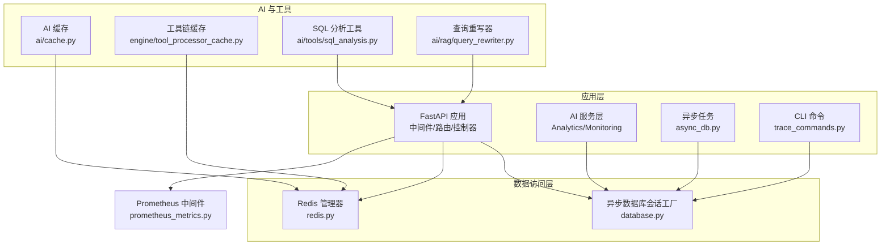
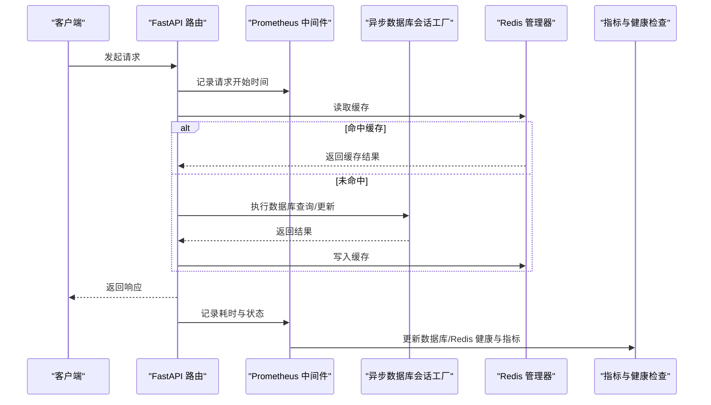
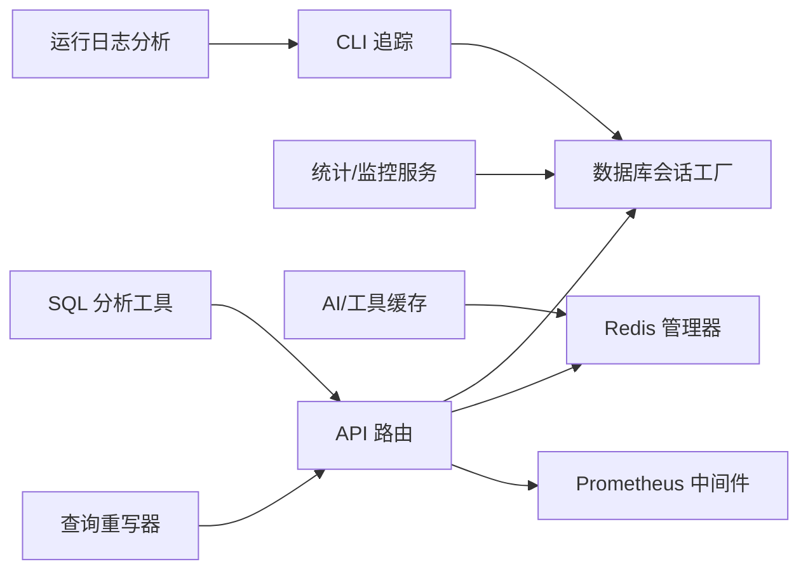

# 性能优化与索引

<cite>
**本文引用的文件**
- [backend/app/core/database.py](file://backend/app/core/database.py)
- [backend/app/core/redis.py](file://backend/app/core/redis.py)
- [backend/app/middleware/prometheus_metrics.py](file://backend/app/middleware/prometheus_metrics.py)
- [backend/app/main.py](file://backend/app/main.py)
- [backend/app/ai/cache.py](file://backend/app/ai/cache.py)
- [backend/app/enums/cache.py](file://backend/app/enums/cache.py)
- [backend/app/schemas/system/cache.py](file://backend/app/schemas/system/cache.py)
- [backend/app/ai/engine/tool_processor_cache.py](file://backend/app/ai/engine/tool_processor_cache.py)
- [backend/app/ai/tools/sql_analysis.py](file://backend/app/ai/tools/sql_analysis.py)
- [backend/app/ai/rag/query_rewriter.py](file://backend/app/ai/rag/query_rewriter.py)
- [backend/app/services/ai/analytics_service.py](file://backend/app/services/ai/analytics_service.py)
- [backend/app/services/ai/monitoring_service.py](file://backend/app/services/ai/monitoring_service.py)
- [backend/tests/services/test_analytics_service.py](file://backend/tests/services/test_analytics_service.py)
- [backend/tests/services/test_monitoring_service.py](file://backend/tests/services/test_monitoring_service.py)
- [backend/app/tasks/async_db.py](file://backend/app/tasks/async_db.py)
- [backend/app/cli_commands/trace_commands.py](file://backend/app/cli_commands/trace_commands.py)
- [backend/docs/storage/RUN_LOG_ANALYSIS.md](file://backend/docs/storage/RUN_LOG_ANALYSIS.md)
</cite>

## 目录
1. [简介](#简介)
2. [项目结构](#项目结构)
3. [核心组件](#核心组件)
4. [架构总览](#架构总览)
5. [详细组件分析](#详细组件分析)
6. [依赖关系分析](#依赖关系分析)
7. [性能考量](#性能考量)
8. [故障排查指南](#故障排查指南)
9. [结论](#结论)
10. [附录](#附录)

## 简介
本文件面向数据库性能优化与索引设计，结合仓库中的实际实现，系统阐述索引设计原则、查询优化策略、缓存机制、连接池与事务管理、并发控制、慢查询分析与性能监控、以及高级优化技术（如数据分区、读写分离）的落地方式，并提供查询计划分析与执行效率评估工具的使用指南。内容兼顾工程实践与可操作性，帮助读者在真实业务场景中提升数据库整体性能。

## 项目结构
后端采用异步 FastAPI 应用，数据库通过异步会话工厂提供连接；Redis 用于缓存与指标采集；中间件负责 Prometheus 指标暴露；AI 引擎与 RAG 组件内置缓存与 SQL 分析工具；服务层提供统计与监控能力；任务模块支持异步数据库任务；CLI 提供追踪与诊断命令；文档提供运行日志分析指引。

图示来源
- [backend/app/core/database.py](file://backend/app/core/database.py)
- [backend/app/core/redis.py](file://backend/app/core/redis.py)
- [backend/app/middleware/prometheus_metrics.py](file://backend/app/middleware/prometheus_metrics.py)
- [backend/app/ai/cache.py](file://backend/app/ai/cache.py)
- [backend/app/ai/engine/tool_processor_cache.py](file://backend/app/ai/engine/tool_processor_cache.py)
- [backend/app/ai/tools/sql_analysis.py](file://backend/app/ai/tools/sql_analysis.py)
- [backend/app/ai/rag/query_rewriter.py](file://backend/app/ai/rag/query_rewriter.py)
- [backend/app/services/ai/analytics_service.py](file://backend/app/services/ai/analytics_service.py)
- [backend/app/tasks/async_db.py](file://backend/app/tasks/async_db.py)
- [backend/app/cli_commands/trace_commands.py](file://backend/app/cli_commands/trace_commands.py)

章节来源
- [backend/app/core/database.py](file://backend/app/core/database.py)
- [backend/app/core/redis.py](file://backend/app/core/redis.py)
- [backend/app/middleware/prometheus_metrics.py](file://backend/app/middleware/prometheus_metrics.py)
- [backend/app/main.py](file://backend/app/main.py)

## 核心组件
- 异步数据库会话工厂：提供统一的异步数据库会话创建与生命周期管理，支撑高并发下的连接复用与资源控制。
- Redis 管理器：提供缓存、会话存储与健康检查，支撑热点数据快速访问与指标采集。
- Prometheus 中间件：暴露数据库与缓存健康状态、请求耗时、调用量等关键指标，便于性能观测与告警。
- AI 缓存与工具链缓存：在 AI 执行与工具处理过程中进行结果缓存，降低重复计算与数据库压力。
- SQL 分析与查询重写：解析 SQL 结构、提取表与聚合函数，辅助优化与改写查询以提升命中率与执行效率。
- 统计与监控服务：提供延迟分布、成功率趋势、供应商性能等指标，支撑性能评估与容量规划。
- 异步任务：封装数据库操作的后台执行，减少主流程阻塞并提升吞吐。
- CLI 追踪：提供查询与执行链路的诊断能力，辅助定位性能瓶颈。

章节来源
- [backend/app/core/database.py](file://backend/app/core/database.py)
- [backend/app/core/redis.py](file://backend/app/core/redis.py)
- [backend/app/middleware/prometheus_metrics.py](file://backend/app/middleware/prometheus_metrics.py)
- [backend/app/ai/cache.py](file://backend/app/ai/cache.py)
- [backend/app/ai/engine/tool_processor_cache.py](file://backend/app/ai/engine/tool_processor_cache.py)
- [backend/app/ai/tools/sql_analysis.py](file://backend/app/ai/tools/sql_analysis.py)
- [backend/app/ai/rag/query_rewriter.py](file://backend/app/ai/rag/query_rewriter.py)
- [backend/app/services/ai/analytics_service.py](file://backend/app/services/ai/analytics_service.py)
- [backend/app/services/ai/monitoring_service.py](file://backend/app/services/ai/monitoring_service.py)
- [backend/app/tasks/async_db.py](file://backend/app/tasks/async_db.py)
- [backend/app/cli_commands/trace_commands.py](file://backend/app/cli_commands/trace_commands.py)

## 架构总览
下图展示从请求到数据库与缓存的关键交互路径，以及指标采集与健康检查的闭环。

图示来源
- [backend/app/middleware/prometheus_metrics.py](file://backend/app/middleware/prometheus_metrics.py)
- [backend/app/core/database.py](file://backend/app/core/database.py)
- [backend/app/core/redis.py](file://backend/app/core/redis.py)
- [backend/app/main.py](file://backend/app/main.py)

## 详细组件分析

### 数据库连接池与会话管理
- 设计要点
  - 使用异步会话工厂统一创建与回收数据库会话，避免连接泄漏。
  - 在中间件与健康检查中定期验证数据库连通性，确保连接池可用。
  - 将数据库健康状态同步至指标系统，便于告警与自动恢复。
- 关键行为
  - 会话工厂在应用启动时初始化，提供 async with 上下文安全使用。
  - 健康检查通过最小代价查询验证数据库可用性，并设置组件健康状态。
- 优化建议
  - 合理设置连接池大小与超时参数，结合峰值 QPS 与平均响应时间进行压测校准。
  - 对长事务与批量写入使用显式事务边界，避免长时间占用连接。
  - 针对只读流量开启只读副本或读写分离，缓解主库压力。

章节来源
- [backend/app/core/database.py](file://backend/app/core/database.py)
- [backend/app/main.py](file://backend/app/main.py)

### Redis 缓存与健康检查
- 设计要点
  - Redis 管理器提供统一的连接、命令执行与健康检查接口。
  - 指标中间件在抓取前主动刷新组件健康，避免仅依赖就绪探针副作用。
- 关键行为
  - 健康检查成功/失败分别设置组件健康状态，并记录日志。
  - 指标刷新周期与超时阈值可配置，防止频繁健康探测影响性能。
- 优化建议
  - 对热点数据设置合理的过期策略与淘汰算法，避免内存膨胀。
  - 使用连接池与管道命令批量写入，降低 RTT 与 CPU 开销。
  - 对大对象采用压缩或分片存储，平衡内存与带宽。

章节来源
- [backend/app/core/redis.py](file://backend/app/core/redis.py)
- [backend/app/middleware/prometheus_metrics.py](file://backend/app/middleware/prometheus_metrics.py)
- [backend/app/main.py](file://backend/app/main.py)

### 查询优化与 SQL 分析
- 设计要点
  - SQL 分析工具可解析 SELECT 列表、表引用与聚合函数，辅助识别潜在优化点。
  - 查询重写器支持多种策略（如多查询改写、HyDE），提升检索质量与命中率。
- 关键行为
  - 表名提取与去重，聚合函数规范化，便于生成报告与建议。
  - 多查询重写器根据策略生成候选查询集合，HyDE 使用假设文档增强召回。
- 优化建议
  - 基于分析结果补充缺失索引或调整现有索引选择性。
  - 对高频聚合查询建立物化视图或汇总表，降低实时计算成本。
  - 使用 EXPLAIN/ANALYZE 获取执行计划，结合 IO 与 CPU 统计定位瓶颈。

章节来源
- [backend/app/ai/tools/sql_analysis.py](file://backend/app/ai/tools/sql_analysis.py)
- [backend/app/ai/rag/query_rewriter.py](file://backend/app/ai/rag/query_rewriter.py)

### 缓存机制与命中策略
- 设计要点
  - AI 缓存与工具链缓存均基于签名（函数名、参数、会话标识）进行命中判断。
  - 成功结果被缓存并携带耗时元数据，命中时直接返回并重置耗时字段。
  - 支持按执行阶段划分缓存种类，避免跨阶段污染。
- 关键行为
  - 只读缓存命中时增加命中计数，便于后续统计与优化。
  - 缓存项具备有效性判定，失败结果不进入缓存。
- 优化建议
  - 对高并发场景引入分布式缓存与一致性哈希，降低热点集中。
  - 设置缓存预热与失效策略，结合业务峰谷动态调整。
  - 对缓存命中率低的查询，优先优化 SQL 与索引，再考虑扩大缓存。

章节来源
- [backend/app/ai/cache.py](file://backend/app/ai/cache.py)
- [backend/app/ai/engine/tool_processor_cache.py](file://backend/app/ai/engine/tool_processor_cache.py)
- [backend/app/enums/cache.py](file://backend/app/enums/cache.py)
- [backend/app/schemas/system/cache.py](file://backend/app/schemas/system/cache.py)

### 统计与监控服务
- 设计要点
  - 统计服务提供延迟分布、成功率趋势、供应商性能等指标，支撑性能评估。
  - 监控服务聚合调用次数、Token 数量、成本与成功/失败计数，形成多维报表。
- 关键行为
  - 测试用例验证统计接口的调用次数与返回结构，确保统计准确性。
  - 监控服务通过多次查询获取聚合结果，覆盖不同维度的统计需求。
- 优化建议
  - 将统计与监控拆分为独立任务，避免阻塞主流程。
  - 对高频统计建立增量更新与落盘策略，降低实时查询压力。
  - 结合业务 SLA 设定阈值与告警规则，及时发现异常波动。

章节来源
- [backend/app/services/ai/analytics_service.py](file://backend/app/services/ai/analytics_service.py)
- [backend/app/services/ai/monitoring_service.py](file://backend/app/services/ai/monitoring_service.py)
- [backend/tests/services/test_analytics_service.py](file://backend/tests/services/test_analytics_service.py)
- [backend/tests/services/test_monitoring_service.py](file://backend/tests/services/test_monitoring_service.py)

### 异步任务与并发控制
- 设计要点
  - 异步任务模块封装数据库操作，支持后台执行与错误重试。
  - 并发控制通过队列与限流策略实现，避免瞬时洪峰导致资源争用。
- 关键行为
  - 任务调度器按优先级与依赖关系安排执行顺序。
  - 错误处理与重试策略结合退避算法，提升稳定性。
- 优化建议
  - 对批量写入使用分批提交与事务合并，减少往返与锁竞争。
  - 对长任务设置超时与断点续传，保障系统弹性。

章节来源
- [backend/app/tasks/async_db.py](file://backend/app/tasks/async_db.py)

### 慢查询分析与性能监控
- 设计要点
  - 指标中间件在请求前后记录耗时与状态，形成时序数据。
  - 健康检查主动刷新数据库与 Redis 的健康状态，保证指标时效性。
  - CLI 提供追踪命令，辅助定位执行链路与瓶颈节点。
  - 文档提供运行日志分析方法，指导问题复盘与根因定位。
- 关键行为
  - 指标刷新周期与超时阈值可配置，避免过度探测。
  - 日志分析文档提供常见问题的分析步骤与关注点。
- 优化建议
  - 将慢查询日志接入集中式日志平台，结合时间序列分析定位趋势。
  - 对关键路径埋点与采样，区分 P95/P99 与极端异常，避免噪声干扰。

章节来源
- [backend/app/middleware/prometheus_metrics.py](file://backend/app/middleware/prometheus_metrics.py)
- [backend/app/main.py](file://backend/app/main.py)
- [backend/app/cli_commands/trace_commands.py](file://backend/app/cli_commands/trace_commands.py)
- [backend/docs/storage/RUN_LOG_ANALYSIS.md](file://backend/docs/storage/RUN_LOG_ANALYSIS.md)

## 依赖关系分析
- 组件耦合
  - API 层依赖数据库与 Redis 管理器，同时通过中间件输出指标。
  - AI 与工具链缓存依赖 Redis，SQL 分析与查询重写服务于查询优化。
  - 统计与监控服务依赖数据库查询与缓存命中信息。
- 外部依赖
  - Prometheus 作为指标采集与告警基础，需与中间件协同配置。
  - CLI 与文档提供运维与诊断支撑，降低线上问题定位成本。

图示来源
- [backend/app/core/database.py](file://backend/app/core/database.py)
- [backend/app/core/redis.py](file://backend/app/core/redis.py)
- [backend/app/middleware/prometheus_metrics.py](file://backend/app/middleware/prometheus_metrics.py)
- [backend/app/ai/cache.py](file://backend/app/ai/cache.py)
- [backend/app/ai/engine/tool_processor_cache.py](file://backend/app/ai/engine/tool_processor_cache.py)
- [backend/app/ai/tools/sql_analysis.py](file://backend/app/ai/tools/sql_analysis.py)
- [backend/app/ai/rag/query_rewriter.py](file://backend/app/ai/rag/query_rewriter.py)
- [backend/app/services/ai/analytics_service.py](file://backend/app/services/ai/analytics_service.py)
- [backend/app/services/ai/monitoring_service.py](file://backend/app/services/ai/monitoring_service.py)
- [backend/app/cli_commands/trace_commands.py](file://backend/app/cli_commands/trace_commands.py)
- [backend/docs/storage/RUN_LOG_ANALYSIS.md](file://backend/docs/storage/RUN_LOG_ANALYSIS.md)

## 性能考量
- 索引设计原则
  - 选择性优先：高选择性的列优先建索引，避免全表扫描。
  - 覆盖查询：尽量让查询走覆盖索引，减少回表开销。
  - 最左前缀：复合索引遵循最左前缀匹配，避免隐式转换与函数包裹。
  - 写多读少场景：权衡写放大与读优化，必要时拆分表或引入物化视图。
- 查询优化策略
  - 单表查询：利用唯一/主键索引快速定位；避免 SELECT *，只取必要列。
  - 关联查询：小表驱动大表，连接列加索引；避免笛卡尔积与重复行。
  - 聚合查询：先过滤再聚合，必要时建立汇总表或物化视图。
- 缓存策略
  - LRU/LFU：热点数据优先缓存，设置合理 TTL 与淘汰策略。
  - 多级缓存：本地缓存 + 分布式缓存，降低跨节点延迟。
  - 预热与失效：业务高峰前预热热点，失效时采用渐进式降级。
- 连接池与事务
  - 连接池：根据并发与 QPS 调整最大连接数与空闲回收策略。
  - 事务：短事务优先，避免长事务锁等待；批量写入合并提交。
- 并发控制
  - 乐观锁：版本号或时间戳，冲突重试；适合读多写少场景。
  - 悲观锁：明确锁粒度与范围，避免全局锁；适合写多强一致场景。
- 高级优化
  - 数据分区：按时间/地域/租户分区，提升扫描与维护效率。
  - 读写分离：主库写入、只读实例分担查询，配合延迟复制。
- 执行效率评估
  - 使用 EXPLAIN/ANALYZE 获取执行计划与统计信息，关注 IO 与 CPU。
  - 结合慢查询日志与指标中间件，定位异常时段与热点 SQL。
- 内存、磁盘 I/O 与网络优化
  - 内存：合理设置缓冲池与共享内存，避免频繁换页。
  - 磁盘 I/O：顺序写优于随机写，SSD 优先；冷热数据分层存储。
  - 网络：连接复用与压缩，减少 RTT 与带宽占用。

## 故障排查指南
- 健康检查失败
  - 现象：数据库/Redis 健康状态为 False，Prometheus 指标异常。
  - 排查：检查连接池配置、网络连通性、权限与超时设置。
  - 处理：缩短超时阈值、增加重试次数、隔离故障节点。
- 缓存命中率低
  - 现象：缓存未命中频繁，数据库压力上升。
  - 排查：确认缓存键生成逻辑、TTL 设置与数据一致性。
  - 处理：优化查询条件以提高命中率，引入预热与降级策略。
- 指标抖动
  - 现象：请求耗时与错误率波动较大。
  - 排查：检查指标刷新频率、采样策略与外部依赖。
  - 处理：平滑指标与告警阈值，区分短期波动与长期趋势。
- 慢查询增多
  - 现象：P95/P99 显著上升，慢查询日志激增。
  - 排查：结合 SQL 分析工具与执行计划，定位索引缺失与扫描范围。
  - 处理：补充索引、改写查询、引入物化视图或读写分离。

章节来源
- [backend/app/main.py](file://backend/app/main.py)
- [backend/app/middleware/prometheus_metrics.py](file://backend/app/middleware/prometheus_metrics.py)
- [backend/app/ai/tools/sql_analysis.py](file://backend/app/ai/tools/sql_analysis.py)
- [backend/app/cli_commands/trace_commands.py](file://backend/app/cli_commands/trace_commands.py)
- [backend/docs/storage/RUN_LOG_ANALYSIS.md](file://backend/docs/storage/RUN_LOG_ANALYSIS.md)

## 结论
通过异步数据库会话工厂、Redis 缓存、Prometheus 指标与健康检查、SQL 分析与查询重写、统计监控服务、异步任务与 CLI 诊断工具的协同，本项目形成了覆盖“查询优化—缓存—监控—诊断”的完整性能优化体系。建议在实际部署中结合业务特征进行压测与调优，持续迭代索引与查询策略，确保系统在高并发与大数据量场景下的稳定与高效。

## 附录
- 性能测试方法
  - 基准测试：使用固定负载与参数，对比不同索引/查询方案的吞吐与延迟。
  - 压力测试：逐步提升并发与数据规模，观察系统拐点与瓶颈。
  - 回归测试：将关键查询纳入回归矩阵，确保变更不影响性能。
- 基准测试结果解读
  - 关注 P50/P95/P99 延迟变化与错误率趋势，识别异常波动。
  - 对比缓存命中率与数据库命中率，评估缓存策略有效性。
  - 结合指标中间件与慢查询日志，定位具体 SQL 与执行阶段。