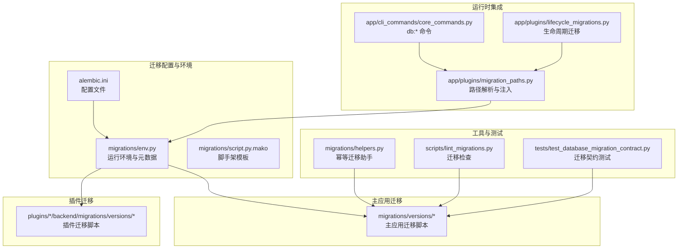
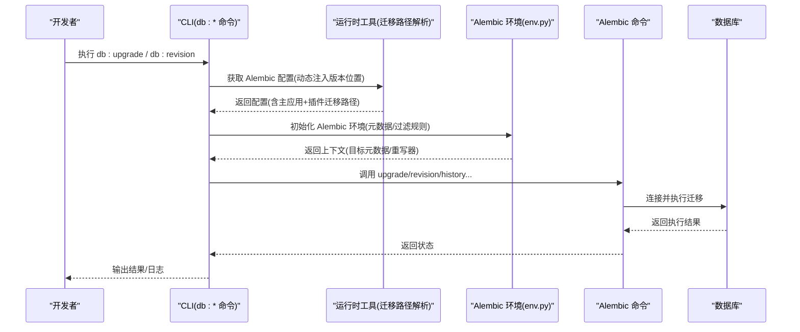
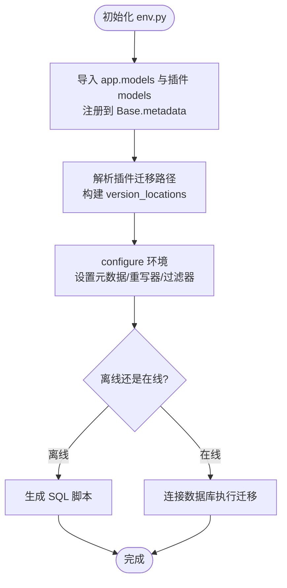
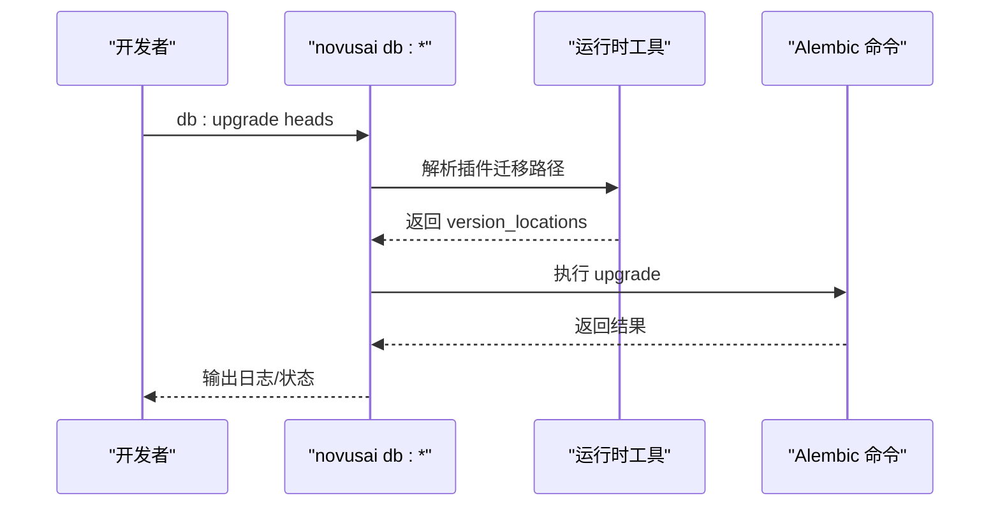
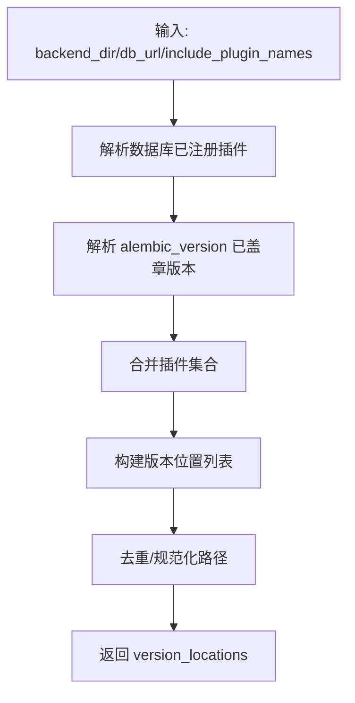
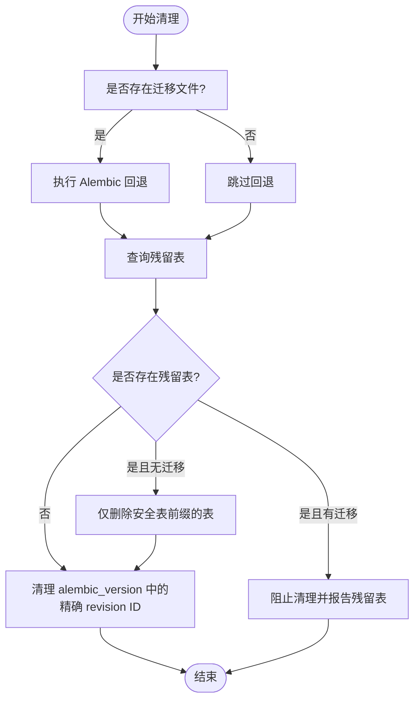
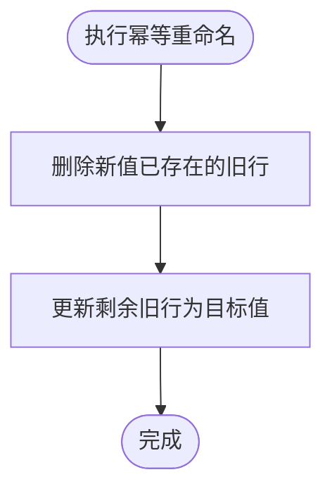
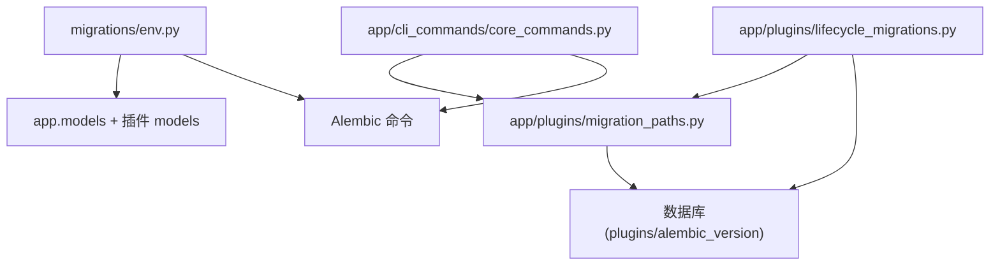

# 数据库迁移

<cite>
**本文引用的文件**
- [backend/migrations/env.py](file://backend/migrations/env.py)
- [backend/alembic.ini](file://backend/alembic.ini)
- [backend/migrations/script.py.mako](file://backend/migrations/script.py.mako)
- [backend/migrations/helpers.py](file://backend/migrations/helpers.py)
- [backend/app/cli_commands/core_commands.py](file://backend/app/cli_commands/core_commands.py)
- [backend/app/plugins/migration_paths.py](file://backend/app/plugins/migration_paths.py)
- [backend/app/plugins/lifecycle_migrations.py](file://backend/app/plugins/lifecycle_migrations.py)
- [backend/scripts/lint_migrations.py](file://backend/scripts/lint_migrations.py)
- [backend/tests/test_database_migration_contract.py](file://backend/tests/test_database_migration_contract.py)
</cite>

## 目录
1. [简介](#简介)
2. [项目结构](#项目结构)
3. [核心组件](#核心组件)
4. [架构总览](#架构总览)
5. [详细组件分析](#详细组件分析)
6. [依赖分析](#依赖分析)
7. [性能考虑](#性能考虑)
8. [故障排除指南](#故障排除指南)
9. [结论](#结论)
10. [附录](#附录)

## 简介
本文件系统性阐述本项目的数据库迁移体系，围绕 Alembic 迁移框架的配置、使用与扩展进行深入说明。内容涵盖迁移脚本的生成、执行与回滚机制，数据模型演进策略与最佳实践（表结构变更、索引优化、数据转换），迁移前准备、风险评估与备份策略，常见迁移场景操作指南（新增字段、删除表、修改约束等），版本控制与团队协作流程，生产环境迁移安全与监控，以及迁移故障排除与恢复方案。

## 项目结构
本项目采用集中式 Alembic 迁移目录与插件感知的多源版本位置（version_locations）相结合的架构：
- 主应用迁移位于 backend/migrations/versions
- 插件迁移位于各插件 backend/plugins/<plugin>/backend/migrations/versions
- Alembic 配置位于 backend/alembic.ini
- 运行环境与元数据由 backend/migrations/env.py 提供
- CLI 命令通过 backend/app/cli_commands/core_commands.py 暴露数据库迁移子命令
- 插件迁移路径解析与动态注入由 backend/app/plugins/migration_paths.py 实现
- 生命周期迁移与数据库清理由 backend/app/plugins/lifecycle_migrations.py 提供
- 迁移脚手架模板由 backend/migrations/script.py.mako 提供
- 辅助工具与幂等操作由 backend/migrations/helpers.py 提供
- 迁移质量保障与测试由 backend/scripts/lint_migrations.py 与 backend/tests/test_database_migration_contract.py 提供

图表来源
- [backend/alembic.ini:1-76](file://backend/alembic.ini#L1-L76)
- [backend/migrations/env.py:1-191](file://backend/migrations/env.py#L1-L191)
- [backend/migrations/script.py.mako:1-29](file://backend/migrations/script.py.mako#L1-L29)
- [backend/app/cli_commands/core_commands.py:244-358](file://backend/app/cli_commands/core_commands.py#L244-L358)
- [backend/app/plugins/migration_paths.py:210-242](file://backend/app/plugins/migration_paths.py#L210-L242)
- [backend/app/plugins/lifecycle_migrations.py:94-150](file://backend/app/plugins/lifecycle_migrations.py#L94-L150)
- [backend/migrations/helpers.py:1-157](file://backend/migrations/helpers.py#L1-L157)
- [backend/scripts/lint_migrations.py](file://backend/scripts/lint_migrations.py)
- [backend/tests/test_database_migration_contract.py](file://backend/tests/test_database_migration_contract.py)

章节来源
- [backend/alembic.ini:1-76](file://backend/alembic.ini#L1-L76)
- [backend/migrations/env.py:1-191](file://backend/migrations/env.py#L1-L191)
- [backend/migrations/script.py.mako:1-29](file://backend/migrations/script.py.mako#L1-L29)
- [backend/app/cli_commands/core_commands.py:244-358](file://backend/app/cli_commands/core_commands.py#L244-L358)
- [backend/app/plugins/migration_paths.py:210-242](file://backend/app/plugins/migration_paths.py#L210-L242)
- [backend/app/plugins/lifecycle_migrations.py:94-150](file://backend/app/plugins/lifecycle_migrations.py#L94-L150)
- [backend/migrations/helpers.py:1-157](file://backend/migrations/helpers.py#L1-L157)
- [backend/scripts/lint_migrations.py](file://backend/scripts/lint_migrations.py)
- [backend/tests/test_database_migration_contract.py](file://backend/tests/test_database_migration_contract.py)

## 核心组件
- Alembic 配置与环境
  - alembic.ini：定义脚本位置、版本位置、编码、日志级别等
  - migrations/env.py：构建 Alembic 运行环境，注册模型元数据，动态注入插件迁移路径，提供离线/在线迁移执行逻辑
- 迁移脚手架与模板
  - migrations/script.py.mako：生成迁移脚本的标准模板，包含升级/降级函数占位
- CLI 迁移命令
  - app/cli_commands/core_commands.py：提供 db:upgrade、db:revision、db:autogenerate、db:history、db:heads、db:current、db:stamp、db:merge 等命令
- 插件迁移路径解析与注入
  - app/plugins/migration_paths.py：解析数据库已注册插件、已盖章版本、仓库插件，构建 version_locations 并支持字节码清理
  - app/plugins/lifecycle_migrations.py：在生命周期中执行插件迁移（升级/回退）、清理残留表与 alembic_version
- 幂等迁移助手
  - migrations/helpers.py：提供幂等的表名/列值重命名等操作，避免唯一约束冲突
- 质量与测试
  - scripts/lint_migrations.py：迁移脚本静态检查
  - tests/test_database_migration_contract.py：迁移契约一致性测试

章节来源
- [backend/alembic.ini:1-76](file://backend/alembic.ini#L1-L76)
- [backend/migrations/env.py:1-191](file://backend/migrations/env.py#L1-L191)
- [backend/migrations/script.py.mako:1-29](file://backend/migrations/script.py.mako#L1-L29)
- [backend/app/cli_commands/core_commands.py:244-358](file://backend/app/cli_commands/core_commands.py#L244-L358)
- [backend/app/plugins/migration_paths.py:210-242](file://backend/app/plugins/migration_paths.py#L210-L242)
- [backend/app/plugins/lifecycle_migrations.py:94-150](file://backend/app/plugins/lifecycle_migrations.py#L94-L150)
- [backend/migrations/helpers.py:1-157](file://backend/migrations/helpers.py#L1-L157)
- [backend/scripts/lint_migrations.py](file://backend/scripts/lint_migrations.py)
- [backend/tests/test_database_migration_contract.py](file://backend/tests/test_database_migration_contract.py)

## 架构总览
下图展示迁移系统的关键交互：CLI 命令通过运行时工具构建 Alembic 配置，动态注入插件迁移路径，随后调用 Alembic 命令完成迁移；env.py 提供元数据与自动生成过滤规则；helpers 提供幂等操作以降低风险。

图表来源
- [backend/app/cli_commands/core_commands.py:257-358](file://backend/app/cli_commands/core_commands.py#L257-L358)
- [backend/app/plugins/migration_paths.py:210-242](file://backend/app/plugins/migration_paths.py#L210-L242)
- [backend/migrations/env.py:138-191](file://backend/migrations/env.py#L138-L191)

## 详细组件分析

### Alembic 配置与环境（env.py）
- 动态模型注册：导入 app.models 与插件 models，确保 Base.metadata 包含所有模型，使自动生成聚焦于已注册表
- 插件迁移路径注入：基于数据库已注册插件与已盖章版本，构建 version_locations，保证跨分支解析
- 自动化重写器：过滤纯注释变更与冗余单列 id 索引，减少噪音
- 类生命周期时间列类型比较忽略：对特定通用时间列的时区差异进行忽略，避免误报
- include_object 过滤：仅对已注册模型表生成差异，避免无关对象进入迁移
- 离线/在线迁移：分别生成 SQL 或直接连接执行，统一处理事务

图表来源
- [backend/migrations/env.py:26-82](file://backend/migrations/env.py#L26-L82)
- [backend/migrations/env.py:65-73](file://backend/migrations/env.py#L65-L73)
- [backend/migrations/env.py:138-191](file://backend/migrations/env.py#L138-L191)

章节来源
- [backend/migrations/env.py:1-191](file://backend/migrations/env.py#L1-L191)

### CLI 迁移命令（core_commands.py）
- db:upgrade：执行迁移至指定版本（默认 heads）
- db:revision：生成新迁移文件（可选择自动从模型生成）
- db:autogenerate：根据模型变更自动生成迁移
- db:history/heads/current/stamp/merge：查看历史、头节点、当前版本、标记版本、合并头节点
- 运行时路径解析：通过运行时工具发现插件迁移路径并注入 Alembic 配置

图表来源
- [backend/app/cli_commands/core_commands.py:262-358](file://backend/app/cli_commands/core_commands.py#L262-L358)
- [backend/app/plugins/migration_paths.py:210-242](file://backend/app/plugins/migration_paths.py#L210-L242)

章节来源
- [backend/app/cli_commands/core_commands.py:244-358](file://backend/app/cli_commands/core_commands.py#L244-L358)

### 插件迁移路径解析与注入（migration_paths.py）
- 解析数据库已注册插件：从 plugins 表读取未删除插件作为迁移参与者
- 解析已盖章版本：从 alembic_version 读取已存在版本，反推所属插件
- 构建 version_locations：主应用 + 已参与迁移的插件迁移目录
- 字节码清理：删除迁移目录缓存字节码，避免旧元数据干扰
- 启动阶段策略：在调试模式下避免清理，防止文件监听重载中断

图表来源
- [backend/app/plugins/migration_paths.py:47-207](file://backend/app/plugins/migration_paths.py#L47-L207)
- [backend/app/plugins/migration_paths.py:210-242](file://backend/app/plugins/migration_paths.py#L210-L242)

章节来源
- [backend/app/plugins/migration_paths.py:1-297](file://backend/app/plugins/migration_paths.py#L1-L297)

### 生命周期迁移与数据库清理（lifecycle_migrations.py）
- 插件迁移升级：通过 Python API 注入版本位置，执行 branch_label@head 升级
- 插件迁移回退：收集插件实际 revision ID，查询 alembic_version，执行 branch_label@base 回退
- 数据库清理：尝试回退后检查残留表，按安全规则删除，清理 alembic_version 中的精确 revision ID
- 安全策略：无迁移插件仅允许按 manifest 声明的前缀清理；迁移残留表阻止清理，避免掩盖迁移契约问题

图表来源
- [backend/app/plugins/lifecycle_migrations.py:248-400](file://backend/app/plugins/lifecycle_migrations.py#L248-L400)

章节来源
- [backend/app/plugins/lifecycle_migrations.py:1-400](file://backend/app/plugins/lifecycle_migrations.py#L1-L400)

### 幂等迁移助手（helpers.py）
- 权限资源重命名：幂等处理权限资源 code/name，避免唯一约束冲突
- 唯一列值重命名：在参与唯一约束的列上进行幂等替换，先删除新值已存在的旧行再更新

图表来源
- [backend/migrations/helpers.py:18-84](file://backend/migrations/helpers.py#L18-L84)
- [backend/migrations/helpers.py:87-157](file://backend/migrations/helpers.py#L87-L157)

章节来源
- [backend/migrations/helpers.py:1-157](file://backend/migrations/helpers.py#L1-L157)

### 脚手架模板（script.py.mako）
- 提供标准迁移模板，包含升级/降级函数占位，便于快速生成迁移脚本

章节来源
- [backend/migrations/script.py.mako:1-29](file://backend/migrations/script.py.mako#L1-L29)

### 质量与测试（lint_migrations.py、test_database_migration_contract.py）
- 迁移检查：对迁移脚本进行静态检查，识别潜在问题
- 迁移契约测试：验证迁移一致性与回归风险

章节来源
- [backend/scripts/lint_migrations.py](file://backend/scripts/lint_migrations.py)
- [backend/tests/test_database_migration_contract.py](file://backend/tests/test_database_migration_contract.py)

## 依赖分析
- 组件耦合
  - env.py 依赖 app.models 与插件 models，确保元数据完整
  - CLI 命令依赖运行时工具解析版本位置，避免硬编码路径
  - lifecycle_migrations 依赖 migration_paths 与数据库查询，确保清理安全
- 外部依赖
  - SQLAlchemy：提供引擎与元数据
  - Alembic：提供迁移命令与运行时环境
  - Postgres：作为目标数据库（从配置与清理脚本可见）

图表来源
- [backend/migrations/env.py:26-82](file://backend/migrations/env.py#L26-L82)
- [backend/app/cli_commands/core_commands.py:257-358](file://backend/app/cli_commands/core_commands.py#L257-L358)
- [backend/app/plugins/migration_paths.py:47-101](file://backend/app/plugins/migration_paths.py#L47-L101)
- [backend/app/plugins/lifecycle_migrations.py:248-400](file://backend/app/plugins/lifecycle_migrations.py#L248-L400)

章节来源
- [backend/migrations/env.py:1-191](file://backend/migrations/env.py#L1-L191)
- [backend/app/cli_commands/core_commands.py:244-358](file://backend/app/cli_commands/core_commands.py#L244-L358)
- [backend/app/plugins/migration_paths.py:1-297](file://backend/app/plugins/migration_paths.py#L1-L297)
- [backend/app/plugins/lifecycle_migrations.py:1-400](file://backend/app/plugins/lifecycle_migrations.py#L1-L400)

## 性能考虑
- 离线生成 SQL：在离线模式下生成 SQL，便于预审与容量规划
- 事务边界：env.py 与 CLI 均在单事务中执行迁移，减少中间状态
- 字节码清理：在非调试启动阶段清理迁移字节码，避免旧元数据影响
- 自动化重写器：过滤冗余差异，减少迁移体积与执行时间

## 故障排除指南
- 迁移无法定位版本
  - 现象：提示无法定位 revision
  - 排查：确认 version_locations 是否包含插件迁移路径；检查 alembic_version 中的版本号是否与脚本一致
  - 参考：[backend/app/plugins/migration_paths.py:210-242](file://backend/app/plugins/migration_paths.py#L210-L242)
- 唯一约束冲突
  - 现象：重命名或更新唯一列值时报错
  - 处理：使用幂等助手进行重命名，先删除新值已存在的旧行再更新
  - 参考：[backend/migrations/helpers.py:18-84](file://backend/migrations/helpers.py#L18-L84)
- 插件迁移残留表
  - 现象：回退后仍有表残留
  - 处理：检查迁移契约是否完整；仅在安全前缀范围内删除残留表；清理 alembic_version 中的精确版本号
  - 参考：[backend/app/plugins/lifecycle_migrations.py:248-400](file://backend/app/plugins/lifecycle_migrations.py#L248-L400)
- 启动阶段中断
  - 现象：DEBUG 模式下字节码清理导致文件监听重载中断
  - 处理：避免在启动阶段清理迁移字节码，仅在生产或显式迁移时清理
  - 参考：[backend/app/plugins/migration_paths.py:281-297](file://backend/app/plugins/migration_paths.py#L281-L297)
- 迁移脚本质量问题
  - 处理：运行迁移检查脚本，修复静态检查问题
  - 参考：[backend/scripts/lint_migrations.py](file://backend/scripts/lint_migrations.py)

章节来源
- [backend/app/plugins/migration_paths.py:210-242](file://backend/app/plugins/migration_paths.py#L210-L242)
- [backend/migrations/helpers.py:18-84](file://backend/migrations/helpers.py#L18-L84)
- [backend/app/plugins/lifecycle_migrations.py:248-400](file://backend/app/plugins/lifecycle_migrations.py#L248-L400)
- [backend/app/plugins/migration_paths.py:281-297](file://backend/app/plugins/migration_paths.py#L281-L297)
- [backend/scripts/lint_migrations.py](file://backend/scripts/lint_migrations.py)

## 结论
本项目通过 env.py 的动态模型注册与路径注入、CLI 的统一命令入口、插件感知的版本位置解析与生命周期迁移管理，构建了可扩展、可审计、可回滚的数据库迁移体系。配合幂等迁移助手与质量检查工具，能够在保证数据安全的前提下高效推进模型演进与功能迭代。

## 附录

### 常见迁移场景操作指南
- 新增字段
  - 使用 db:revision 生成迁移，或 db:autogenerate 自动生成后手动调整
  - 参考：[backend/app/cli_commands/core_commands.py:274-358](file://backend/app/cli_commands/core_commands.py#L274-L358)
- 删除表
  - 在迁移中使用幂等删除策略，确保不会误删非预期表
  - 参考：[backend/migrations/helpers.py:87-157](file://backend/migrations/helpers.py#L87-L157)
- 修改约束
  - 使用幂等助手处理唯一列值重命名，避免冲突
  - 参考：[backend/migrations/helpers.py:87-157](file://backend/migrations/helpers.py#L87-L157)
- 回滚迁移
  - 使用 db:upgrade/downgrade 或 lifecycle_migrations 的回退流程
  - 参考：[backend/app/cli_commands/core_commands.py:262-358](file://backend/app/cli_commands/core_commands.py#L262-L358), [backend/app/plugins/lifecycle_migrations.py:163-247](file://backend/app/plugins/lifecycle_migrations.py#L163-L247)

### 生产环境迁移安全与监控
- 安全措施
  - 离线生成 SQL 并人工审核后再执行
  - 使用事务包裹迁移，失败即回滚
  - 严格使用幂等助手，避免唯一约束冲突
- 监控方法
  - 记录迁移日志与执行结果
  - 对关键迁移进行回归测试与契约检查

### 迁移前准备、风险评估与备份策略
- 准备工作
  - 备份数据库
  - 确认版本位置包含所有插件迁移路径
  - 运行迁移检查脚本
- 风险评估
  - 评估唯一约束变更、索引变更、大表变更的风险
  - 评估插件迁移对主应用的影响
- 备份策略
  - 迁移前全量备份
  - 迁移后验证数据一致性