# 数据模型设计

<cite>

**本文引用的文件**
- [backend/app/models/ai/agent.py](file://backend/app/models/ai/agent.py)
- [backend/app/models/ai/knowledge_base.py](file://backend/app/models/ai/knowledge_base.py)
- [backend/app/models/ai/skill.py](file://backend/app/models/ai/skill.py)
- [backend/app/models/ai/skill_package.py](file://backend/app/models/ai/skill_package.py)
- [backend/app/models/ai/tenant_quota.py](file://backend/app/models/ai/tenant_quota.py)
- [backend/app/models/ai/tenant_rate_limit.py](file://backend/app/models/ai/tenant_rate_limit.py)
- [backend/app/models/system/task_definition.py](file://backend/app/models/system/task_definition.py)
- [backend/app/models/system/plugin.py](file://backend/app/models/system/plugin.py)
- [backend/app/models/system/codegen_config.py](file://backend/app/models/system/codegen_config.py)
- [backend/app/models/system/codegen_config_version.py](file://backend/app/models/system/codegen_config_version.py)
- [backend/app/models/tenant/tenant.py](file://backend/app/models/tenant/tenant.py)
- [backend/app/models/tenant/tenant_user.py](file://backend/app/models/tenant/tenant_user.py)
- [backend/app/models/auth/admin_role.py](file://backend/app/models/auth/admin_role.py)
- [backend/app/models/auth/tenant_user_role.py](file://backend/app/models/auth/tenant_user_role.py)
- [backend/app/models/common/notification.py](file://backend/app/models/common/notification.py)
- [backend/app/models/common/notification_template.py](file://backend/app/models/common/notification_template.py)
- [backend/app/models/common/user_preference.py](file://backend/app/models/common/user_preference.py)
- [backend/migrations/env.py](file://backend/migrations/env.py)
- [backend/migrations/helpers.py](file://backend/migrations/helpers.py)
- [backend/app/core/database.py](file://backend/app/core/database.py)
- [backend/app/core/base_model.py](file://backend/app/core/base_model.py)
- [backend/app/core/base_repository.py](file://backend/app/core/base_repository.py)
- [backend/app/core/query_parser.py](file://backend/app/core/query_parser.py)
- [backend/app/repositories/ai/agent_repository.py](file://backend/app/repositories/ai/agent_repository.py)
- [backend/app/repositories/system/task_definition_repository.py](file://backend/app/repositories/system/task_definition_repository.py)
- [backend/app/services/ai/agent_service.py](file://backend/app/services/ai/agent_service.py)
- [backend/app/services/system/task_definition_service.py](file://backend/app/services/system/task_definition_service.py)
- [backend/app/enums/ai.py](file://backend/app/enums/ai.py)
- [backend/app/enums/task.py](file://backend/app/enums/task.py)
- [backend/app/enums/rbac.py](file://backend/app/enums/rbac.py)
- [backend/app/enums/cache.py](file://backend/app/enums/cache.py)
- [backend/app/cache.py](file://backend/app/cache.py)
- [backend/app/core/redis.py](file://backend/app/core/redis.py)
- [backend/app/middleware/audit_log.py](file://backend/app/middleware/audit_log.py)
- [backend/app/middleware/access_control.py](file://backend/app/middleware/access_control.py)
- [backend/app/middleware/permission.py](file://backend/app/middleware/permission.py)
- [backend/app/middleware/tenant.py](file://backend/app/middleware/tenant.py)
- [backend/app/schemas/ai/agent_schema.py](file://backend/app/schemas/ai/agent_schema.py)
- [backend/app/schemas/system/task_definition_schema.py](file://backend/app/schemas/system/task_definition_schema.py)
- [backend/app/schemas/common/user_preference_schema.py](file://backend/app/schemas/common/user_preference_schema.py)
- [backend/app/schemas/auth/tenant_user_role_schema.py](file://backend/app/schemas/auth/tenant_user_role_schema.py)
- [backend/app/schemas/system/codegen_config_schema.py](file://backend/app/schemas/system/codegen_config_schema.py)
- [backend/app/schemas/system/codegen_config_version_schema.py](file://backend/app/schemas/system/codegen_config_version_schema.py)
- [backend/app/schemas/tenant/tenant_user_schema.py](file://backend/app/schemas/tenant/tenant_user_schema.py)
- [backend/app/schemas/system/plugin_schema.py](file://backend/app/schemas/system/plugin_schema.py)
- [backend/app/schemas/system/plugin_license_schema.py](file://backend/app/schemas/system/plugin_license_schema.py)
- [backend/app/schemas/system/plugin_version_schema.py](file://backend/app/schemas/system/plugin_version_schema.py)
- [backend/app/schemas/system/resource_tenant_assignment_schema.py](file://backend/app/schemas/system/resource_tenant_assignment_schema.py)
- [backend/app/schemas/system/tenant_task_binding_schema.py](file://backend/app/schemas/system/tenant_task_binding_schema.py)
- [backend/app/schemas/ai/skill_schema.py](file://backend/app/schemas/ai/skill_schema.py)
- [backend/app/schemas/ai/skill_package_schema.py](file://backend/app/schemas/ai/skill_package_schema.py)
- [backend/app/schemas/ai/tenant_quota_schema.py](file://backend/app/schemas/ai/tenant_quota_schema.py)
- [backend/app/schemas/ai/tenant_rate_limit_schema.py](file://backend/app/schemas/ai/tenant_rate_limit_schema.py)
- [backend/app/schemas/ai/knowledge_base_schema.py](file://backend/app/schemas/ai/knowledge_base_schema.py)
- [backend/app/schemas/ai/action_log_schema.py](file://backend/app/schemas/ai/action_log_schema.py)
- [backend/app/schemas/ai/call_log_schema.py](file://backend/app/schemas/ai/call_log_schema.py)
- [backend/app/schemas/ai/query_log_schema.py](file://backend/app/schemas/ai/query_log_schema.py)
- [backend/app/schemas/ai/conversation_message_schema.py](file://backend/app/schemas/ai/conversation_message_schema.py)
- [backend/app/schemas/ai/memory_record_schema.py](file://backend/app/schemas/ai/memory_record_schema.py)
- [backend/app/schemas/ai/profile_snapshot_schema.py](file://backend/app/schemas/ai/profile_snapshot_schema.py)
- [backend/app/schemas/ai/execution_decision_schema.py](file://backend/app/schemas/ai/execution_decision_schema.py)
- [backend/app/schemas/ai/execution_trust_policy_schema.py](file://backend/app/schemas/ai/execution_trust_policy_schema.py)
- [backend/app/schemas/ai/skill_call_log_schema.py](file://backend/app/schemas/ai/skill_call_log_schema.py)
- [backend/app/schemas/ai/document_chunk_schema.py](file://backend/app/schemas/ai/document_chunk_schema.py)
- [backend/app/schemas/ai/knowledge_document_schema.py](file://backend/app/schemas/ai/knowledge_document_schema.py)
- [backend/app/schemas/ai/batch_run_schema.py](file://backend/app/schemas/ai/batch_run_schema.py)
- [backend/app/schemas/ai/provider_schema.py](file://backend/app/schemas/ai/provider_schema.py)
- [backend/app/schemas/ai/model_schema.py](file://backend/app/schemas/ai/model_schema.py)
- [backend/app/schemas/ai/api_key_schema.py](file://backend/app/schemas/ai/api_key_schema.py)
- [backend/app/schemas/ai/capability_schema.py](file://backend/app/schemas/ai/capability_schema.py)
- [backend/app/schemas/ai/skill_capability_binding_schema.py](file://backend/app/schemas/ai/skill_capability_binding_schema.py)
- [backend/app/schemas/ai/agent_kb_binding_schema.py](file://backend/app/schemas/ai/agent_kb_binding_schema.py)
- [backend/app/schemas/ai/agent_version_schema.py](file://backend/app/schemas/ai/agent_version_schema.py)
- [backend/app/schemas/ai/agent_access_schema.py](file://backend/app/schemas/ai/agent_access_schema.py)
- [backend/app/schemas/ai/agent_memory_override_schema.py](file://backend/app/schemas/ai/agent_memory_override_schema.py)
- [backend/app/schemas/ai/agent_skill_grant_schema.py](file://backend/app/schemas/ai/agent_skill_grant_schema.py)
- [backend/app/schemas/ai/tenant_agent_platform_kb_suppression_schema.py](file://backend/app/schemas/ai/tenant_agent_platform_kb_suppression_schema.py)
- [backend/app/schemas/ai/tenant_agent_publication_schema.py](file://backend/app/schemas/ai/tenant_agent_publication_schema.py)
</cite>

## 目录
1. [简介](#简介)
2. [项目结构](#项目结构)
3. [核心组件](#核心组件)
4. [架构总览](#架构总览)
5. [详细组件分析](#详细组件分析)
6. [依赖分析](#依赖分析)
7. [性能考虑](#性能考虑)
8. [故障排查指南](#故障排查指南)
9. [结论](#结论)
10. [附录](#附录)

## 简介
本文件面向数据模型设计，系统性梳理后端数据库实体关系、字段定义与数据类型，明确主键/外键、索引与约束，并解释数据验证与业务规则。同时覆盖数据访问模式、缓存策略、性能考量、数据生命周期与归档策略、迁移路径与版本管理、数据安全与隐私、访问控制，以及 ORM 映射与查询优化建议。文档以实际代码文件为依据，辅以 ER 图与流程图帮助理解。

## 项目结构
后端采用分层与按域组织的结构：models 定义数据模型，schemas 提供序列化/反序列化与校验，repositories 实现仓储模式，services 承载业务逻辑，core 提供基础设施（数据库、Redis、查询解析等），migrations 负责数据库演进。AI、系统、租户、认证与通用模块分别在各自子包下组织。

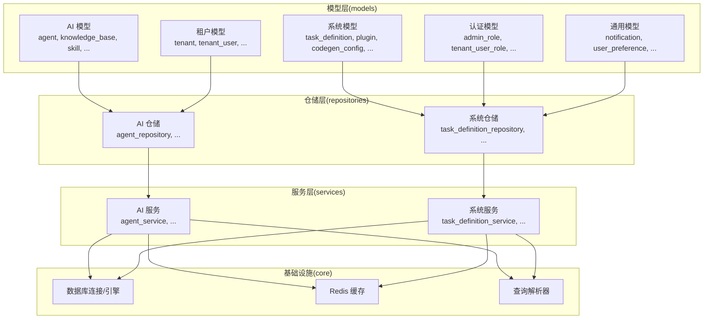

**图表来源**
- [backend/app/models/ai/agent.py](file://backend/app/models/ai/agent.py)
- [backend/app/models/system/task_definition.py](file://backend/app/models/system/task_definition.py)
- [backend/app/repositories/ai/agent_repository.py](file://backend/app/repositories/ai/agent_repository.py)
- [backend/app/repositories/system/task_definition_repository.py](file://backend/app/repositories/system/task_definition_repository.py)
- [backend/app/services/ai/agent_service.py](file://backend/app/services/ai/agent_service.py)
- [backend/app/services/system/task_definition_service.py](file://backend/app/services/system/task_definition_service.py)
- [backend/app/core/database.py](file://backend/app/core/database.py)
- [backend/app/core/redis.py](file://backend/app/core/redis.py)
- [backend/app/core/query_parser.py](file://backend/app/core/query_parser.py)

**章节来源**
- [backend/app/models/ai/agent.py](file://backend/app/models/ai/agent.py)
- [backend/app/models/system/task_definition.py](file://backend/app/models/system/task_definition.py)
- [backend/app/repositories/ai/agent_repository.py](file://backend/app/repositories/ai/agent_repository.py)
- [backend/app/repositories/system/task_definition_repository.py](file://backend/app/repositories/system/task_definition_repository.py)
- [backend/app/services/ai/agent_service.py](file://backend/app/services/ai/agent_service.py)
- [backend/app/services/system/task_definition_service.py](file://backend/app/services/system/task_definition_service.py)
- [backend/app/core/database.py](file://backend/app/core/database.py)
- [backend/app/core/redis.py](file://backend/app/core/redis.py)
- [backend/app/core/query_parser.py](file://backend/app/core/query_parser.py)

## 核心组件
本节聚焦关键数据模型及其职责边界，包括 AI 能力域（Agent、KnowledgeBase、Skill）、系统任务与插件、租户与用户、认证与权限、通用通知与偏好等。

- AI 域
  - Agent：智能体主体，支持版本、访问控制、平台抑制、发布等扩展表
  - KnowledgeBase：知识库，支持可见性、租户访问、路由配置
  - Skill/SkillPackage：技能与技能包，支持能力绑定、资源与脚本
  - 租户配额与限流：TenantQuota/TenantRateLimit
- 系统域
  - TaskDefinition：任务定义，统一任务调度与执行
  - Plugin/PluginVersion/PluginLicense：插件生态与许可
  - CodegenConfig/CodegenConfigVersion：代码生成配置与版本
- 租户与用户
  - Tenant/TenantUser：租户与租户用户
  - TenantUserRole/AdminRole：角色与权限
- 通用
  - Notification/NotificationTemplate/UserPreference：通知与偏好

**章节来源**
- [backend/app/models/ai/agent.py](file://backend/app/models/ai/agent.py)
- [backend/app/models/ai/knowledge_base.py](file://backend/app/models/ai/knowledge_base.py)
- [backend/app/models/ai/skill.py](file://backend/app/models/ai/skill.py)
- [backend/app/models/ai/skill_package.py](file://backend/app/models/ai/skill_package.py)
- [backend/app/models/ai/tenant_quota.py](file://backend/app/models/ai/tenant_quota.py)
- [backend/app/models/ai/tenant_rate_limit.py](file://backend/app/models/ai/tenant_rate_limit.py)
- [backend/app/models/system/task_definition.py](file://backend/app/models/system/task_definition.py)
- [backend/app/models/system/plugin.py](file://backend/app/models/system/plugin.py)
- [backend/app/models/system/codegen_config.py](file://backend/app/models/system/codegen_config.py)
- [backend/app/models/system/codegen_config_version.py](file://backend/app/models/system/codegen_config_version.py)
- [backend/app/models/tenant/tenant.py](file://backend/app/models/tenant/tenant.py)
- [backend/app/models/tenant/tenant_user.py](file://backend/app/models/tenant/tenant_user.py)
- [backend/app/models/auth/admin_role.py](file://backend/app/models/auth/admin_role.py)
- [backend/app/models/auth/tenant_user_role.py](file://backend/app/models/auth/tenant_user_role.py)
- [backend/app/models/common/notification.py](file://backend/app/models/common/notification.py)
- [backend/app/models/common/notification_template.py](file://backend/app/models/common/notification_template.py)
- [backend/app/models/common/user_preference.py](file://backend/app/models/common/user_preference.py)

## 架构总览
下图展示数据模型与仓储/服务层的交互，以及与数据库和缓存的集成。

```mermaid
classDiagram
class BaseModel {
"+id"
"+created_at"
"+updated_at"
"+deleted_at"
}
class Agent {
"+id"
"+name"
"+description"
"+tenant_id"
"+version_id"
}
class KnowledgeBase {
"+id"
"+name"
"+visibility"
"+tenant_access"
}
class Skill {
"+id"
"+name"
"+package_id"
}
class SkillPackage {
"+id"
"+name"
}
class TenantQuota {
"+id"
"+tenant_id"
"+model_type"
"+limit"
}
class TenantRateLimit {
"+id"
"+tenant_id"
"+key"
"+requests"
"+window_seconds"
}
class TaskDefinition {
"+id"
"+name"
"+owner_type"
"+tenant_id"
}
class Plugin {
"+id"
"+name"
"+manifest_hash"
}
class CodegenConfig {
"+id"
"+resource_type"
"+resource_id"
}
class CodegenConfigVersion {
"+id"
"+config_id"
"+version"
"+content"
}
class Tenant {
"+id"
"+name"
}
class TenantUser {
"+id"
"+tenant_id"
"+user_id"
}
class AdminRole {
"+id"
"+name"
}
class TenantUserRole {
"+id"
"+tenant_id"
"+user_id"
"+role_id"
}
class Notification {
"+id"
"+title"
"+content"
"+recipient_id"
}
class NotificationTemplate {
"+id"
"+name"
"+content"
}
class UserPreference {
"+id"
"+user_id"
"+key"
"+value"
}
BaseModel <|-- Agent
BaseModel <|-- KnowledgeBase
BaseModel <|-- Skill
BaseModel <|-- SkillPackage
BaseModel <|-- TenantQuota
BaseModel <|-- TenantRateLimit
BaseModel <|-- TaskDefinition
BaseModel <|-- Plugin
BaseModel <|-- CodegenConfig
BaseModel <|-- CodegenConfigVersion
BaseModel <|-- Tenant
BaseModel <|-- TenantUser
BaseModel <|-- AdminRole
BaseModel <|-- TenantUserRole
BaseModel <|-- Notification
BaseModel <|-- NotificationTemplate
BaseModel <|-- UserPreference
```

**图表来源**
- [backend/app/core/base_model.py](file://backend/app/core/base_model.py)
- [backend/app/models/ai/agent.py](file://backend/app/models/ai/agent.py)
- [backend/app/models/ai/knowledge_base.py](file://backend/app/models/ai/knowledge_base.py)
- [backend/app/models/ai/skill.py](file://backend/app/models/ai/skill.py)
- [backend/app/models/ai/skill_package.py](file://backend/app/models/ai/skill_package.py)
- [backend/app/models/ai/tenant_quota.py](file://backend/app/models/ai/tenant_quota.py)
- [backend/app/models/ai/tenant_rate_limit.py](file://backend/app/models/ai/tenant_rate_limit.py)
- [backend/app/models/system/task_definition.py](file://backend/app/models/system/task_definition.py)
- [backend/app/models/system/plugin.py](file://backend/app/models/system/plugin.py)
- [backend/app/models/system/codegen_config.py](file://backend/app/models/system/codegen_config.py)
- [backend/app/models/system/codegen_config_version.py](file://backend/app/models/system/codegen_config_version.py)
- [backend/app/models/tenant/tenant.py](file://backend/app/models/tenant/tenant.py)
- [backend/app/models/tenant/tenant_user.py](file://backend/app/models/tenant/tenant_user.py)
- [backend/app/models/auth/admin_role.py](file://backend/app/models/auth/admin_role.py)
- [backend/app/models/auth/tenant_user_role.py](file://backend/app/models/auth/tenant_user_role.py)
- [backend/app/models/common/notification.py](file://backend/app/models/common/notification.py)
- [backend/app/models/common/notification_template.py](file://backend/app/models/common/notification_template.py)
- [backend/app/models/common/user_preference.py](file://backend/app/models/common/user_preference.py)

## 详细组件分析

### AI 智能体模型（Agent）
- 关键字段与类型：标识符、名称、描述、租户关联、版本关联等
- 主键/外键：Agent.id 主键；tenant_id 外键指向 Tenant；version_id 外键指向 AgentVersion
- 约束与索引：唯一性约束（如名称+租户组合唯一）、索引（tenant_id、version_id）加速查询
- 业务规则：Agent 的可见性与访问控制由 AgentAccess/AgentVisibility 控制；平台级 KB 抑制通过 TenantAgentPlatformKBSuppression 实现
- 验证规则：名称长度、描述文本、租户存在性、版本一致性
- 生命周期：软删除（deleted_at）支持回收站；版本化变更通过 AgentVersion 管理
- 访问控制：基于 RBAC 的角色与权限映射到 TenantUserRole/AdminRole

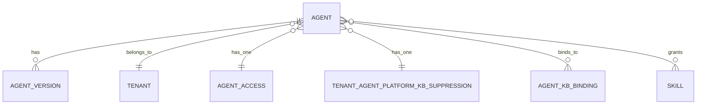

**图表来源**
- [backend/app/models/ai/agent.py](file://backend/app/models/ai/agent.py)
- [backend/app/models/ai/agent_version.py](file://backend/app/models/ai/agent_version.py)
- [backend/app/models/ai/agent_access.py](file://backend/app/models/ai/agent_access.py)
- [backend/app/models/ai/tenant_agent_platform_kb_suppression.py](file://backend/app/models/ai/tenant_agent_platform_kb_suppression.py)
- [backend/app/models/ai/agent_kb_binding.py](file://backend/app/models/ai/agent_kb_binding.py)
- [backend/app/models/ai/agent_skill_grant.py](file://backend/app/models/ai/agent_skill_grant.py)
- [backend/app/models/tenant/tenant.py](file://backend/app/models/tenant/tenant.py)

**章节来源**
- [backend/app/models/ai/agent.py](file://backend/app/models/ai/agent.py)
- [backend/app/models/ai/agent_version.py](file://backend/app/models/ai/agent_version.py)
- [backend/app/models/ai/agent_access.py](file://backend/app/models/ai/agent_access.py)
- [backend/app/models/ai/tenant_agent_platform_kb_suppression.py](file://backend/app/models/ai/tenant_agent_platform_kb_suppression.py)
- [backend/app/models/ai/agent_kb_binding.py](file://backend/app/models/ai/agent_kb_binding.py)
- [backend/app/models/ai/agent_skill_grant.py](file://backend/app/models/ai/agent_skill_grant.py)
- [backend/app/models/tenant/tenant.py](file://backend/app/models/tenant/tenant.py)

### 知识库模型（KnowledgeBase）
- 关键字段：名称、可见性、租户访问范围、路由配置等
- 主键/外键：KB.id 主键；tenant_id 外键指向 Tenant
- 约束与索引：租户作用域内唯一性约束；索引覆盖 tenant_id、visibility、scope
- 业务规则：可见性分为公开/私有；租户访问控制；路由配置影响调用链路
- 验证规则：名称非空且唯一于租户；可见性枚举值；scope 合法性
- 生命周期：软删除；可与 Agent 绑定形成访问矩阵

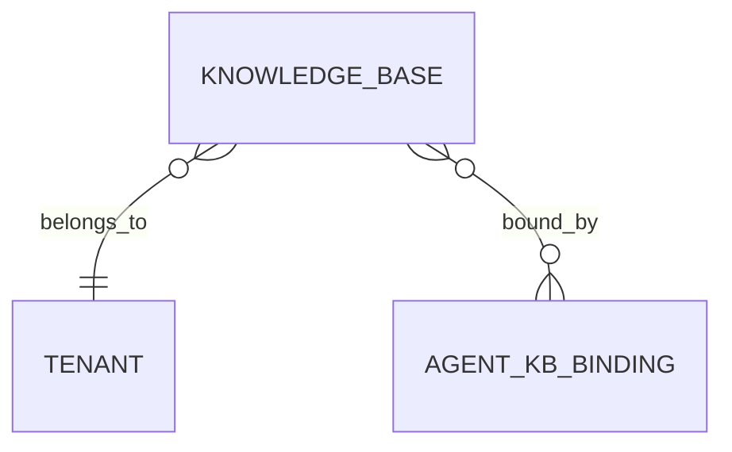

**图表来源**
- [backend/app/models/ai/knowledge_base.py](file://backend/app/models/ai/knowledge_base.py)
- [backend/app/models/ai/agent_kb_binding.py](file://backend/app/models/ai/agent_kb_binding.py)
- [backend/app/models/tenant/tenant.py](file://backend/app/models/tenant/tenant.py)

**章节来源**
- [backend/app/models/ai/knowledge_base.py](file://backend/app/models/ai/knowledge_base.py)
- [backend/app/models/ai/agent_kb_binding.py](file://backend/app/models/ai/agent_kb_binding.py)
- [backend/app/models/tenant/tenant.py](file://backend/app/models/tenant/tenant.py)

### 技能与技能包（Skill/SkillPackage）
- 关键字段：名称、描述、所属技能包、能力绑定、资源与脚本等
- 主键/外键：Skill.package_id 外键指向 SkillPackage；能力绑定通过 SkillCapabilityBinding 关联
- 约束与索引：技能包内唯一性；索引覆盖 package_id、capability_id
- 业务规则：技能与 Agent 的授权通过 AgentSkillGrant；脚本与资源分离管理
- 验证规则：名称唯一；能力绑定合法性；资源存在性
- 生命周期：版本化与变更追踪；与 Agent 版本解耦

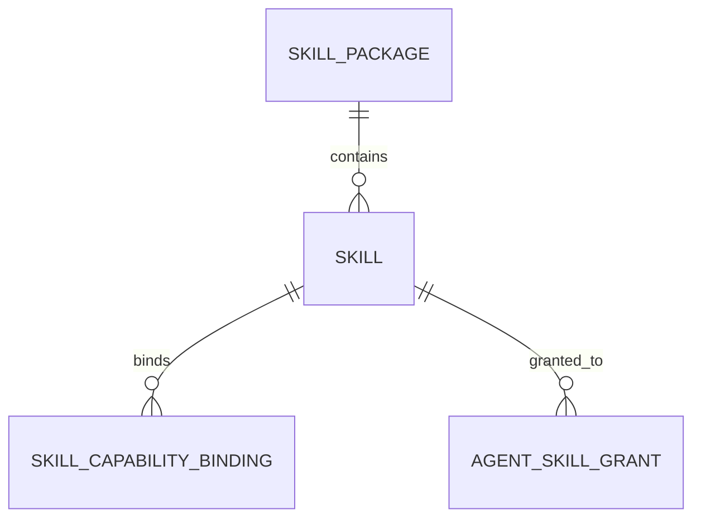

**图表来源**
- [backend/app/models/ai/skill.py](file://backend/app/models/ai/skill.py)
- [backend/app/models/ai/skill_package.py](file://backend/app/models/ai/skill_package.py)
- [backend/app/models/ai/skill_capability_binding.py](file://backend/app/models/ai/skill_capability_binding.py)
- [backend/app/models/ai/agent_skill_grant.py](file://backend/app/models/ai/agent_skill_grant.py)

**章节来源**
- [backend/app/models/ai/skill.py](file://backend/app/models/ai/skill.py)
- [backend/app/models/ai/skill_package.py](file://backend/app/models/ai/skill_package.py)
- [backend/app/models/ai/skill_capability_binding.py](file://backend/app/models/ai/skill_capability_binding.py)
- [backend/app/models/ai/agent_skill_grant.py](file://backend/app/models/ai/agent_skill_grant.py)

### 租户配额与限流（TenantQuota/TenantRateLimit）
- 字段与类型：tenant_id、model_type、limit、requests、window_seconds 等
- 主键/外键：tenant_id 外键指向 Tenant
- 约束与索引：租户+模型类型唯一；索引覆盖 tenant_id、model_type
- 业务规则：配额限制模型使用量；限流控制请求速率
- 验证规则：limit 与 requests 必须为正数；window_seconds 合法范围
- 生命周期：动态更新与审计日志记录

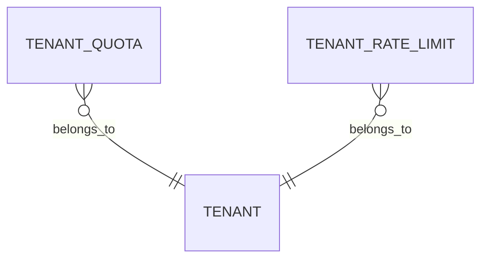

**图表来源**
- [backend/app/models/ai/tenant_quota.py](file://backend/app/models/ai/tenant_quota.py)
- [backend/app/models/ai/tenant_rate_limit.py](file://backend/app/models/ai/tenant_rate_limit.py)
- [backend/app/models/tenant/tenant.py](file://backend/app/models/tenant/tenant.py)

**章节来源**
- [backend/app/models/ai/tenant_quota.py](file://backend/app/models/ai/tenant_quota.py)
- [backend/app/models/ai/tenant_rate_limit.py](file://backend/app/models/ai/tenant_rate_limit.py)
- [backend/app/models/tenant/tenant.py](file://backend/app/models/tenant/tenant.py)

### 系统任务定义（TaskDefinition）
- 字段与类型：名称、所有者类型（租户/全局）、租户 ID、状态、计划等
- 主键/外键：tenant_id 可为空（全局任务）
- 约束与索引：owner_type+tenant_id+name 唯一；索引覆盖 owner_type、tenant_id
- 业务规则：统一任务调度与执行；支持周期性与一次性任务
- 验证规则：名称唯一；owner_type 枚举；计划表达式合法性
- 生命周期：创建、运行、完成/失败、清理

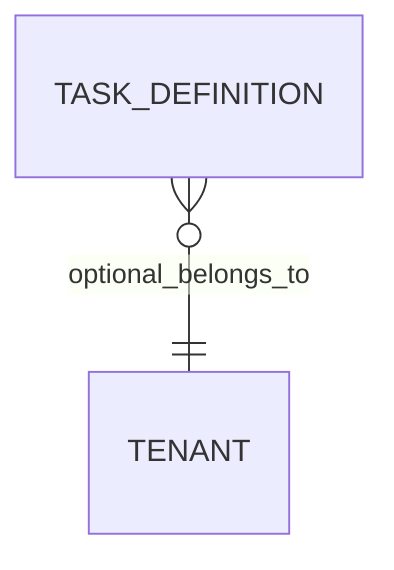

**图表来源**
- [backend/app/models/system/task_definition.py](file://backend/app/models/system/task_definition.py)
- [backend/app/models/tenant/tenant.py](file://backend/app/models/tenant/tenant.py)

**章节来源**
- [backend/app/models/system/task_definition.py](file://backend/app/models/system/task_definition.py)
- [backend/app/models/tenant/tenant.py](file://backend/app/models/tenant/tenant.py)

### 插件生态（Plugin/PluginVersion/PluginLicense）
- 字段与类型：名称、清单哈希、版本号、许可证信息、安装源等
- 主键/外键：PluginVersion.plugin_id 外键指向 Plugin；license_id 外键指向 License
- 约束与索引：版本唯一；索引覆盖 plugin_id、version、license_id
- 业务规则：版本管理与升级；许可证校验与过期控制
- 验证规则：清单完整性；版本号语义化；许可证有效期
- 生命周期：安装、升级、卸载、归档

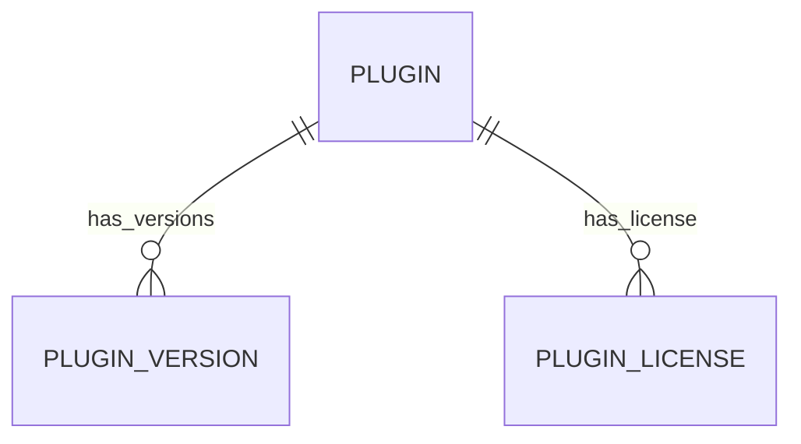

**图表来源**
- [backend/app/models/system/plugin.py](file://backend/app/models/system/plugin.py)
- [backend/app/models/system/plugin_version.py](file://backend/app/models/system/plugin_version.py)
- [backend/app/models/system/plugin_license.py](file://backend/app/models/system/plugin_license.py)

**章节来源**
- [backend/app/models/system/plugin.py](file://backend/app/models/system/plugin.py)
- [backend/app/models/system/plugin_version.py](file://backend/app/models/system/plugin_version.py)
- [backend/app/models/system/plugin_license.py](file://backend/app/models/system/plugin_license.py)

### 代码生成配置（CodegenConfig/CodegenConfigVersion）
- 字段与类型：资源类型与 ID、版本号、内容、摘要等
- 主键/外键：config_id 外键指向 CodegenConfig
- 约束与索引：版本唯一；索引覆盖 resource_type+resource_id
- 业务规则：版本化配置；变更追踪与回滚
- 验证规则：内容合法性；版本号递增
- 生命周期：创建、变更、归档

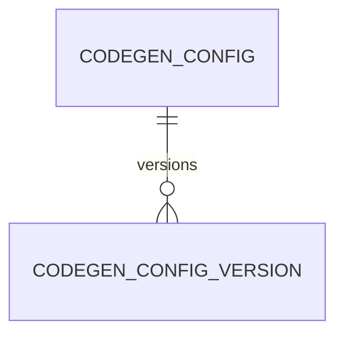

**图表来源**
- [backend/app/models/system/codegen_config.py](file://backend/app/models/system/codegen_config.py)
- [backend/app/models/system/codegen_config_version.py](file://backend/app/models/system/codegen_config_version.py)

**章节来源**
- [backend/app/models/system/codegen_config.py](file://backend/app/models/system/codegen_config.py)
- [backend/app/models/system/codegen_config_version.py](file://backend/app/models/system/codegen_config_version.py)

### 租户与用户（Tenant/TenantUser）
- 字段与类型：租户名称、用户标识、角色映射等
- 主键/外键：TenantUser.tenant_id 外键指向 Tenant；role 映射到 TenantUserRole/AdminRole
- 约束与索引：租户名称唯一；索引覆盖 user_id、tenant_id
- 业务规则：多租户隔离；RBAC 角色继承与权限矩阵
- 验证规则：租户存在性；用户唯一性
- 生命周期：创建、停用、注销

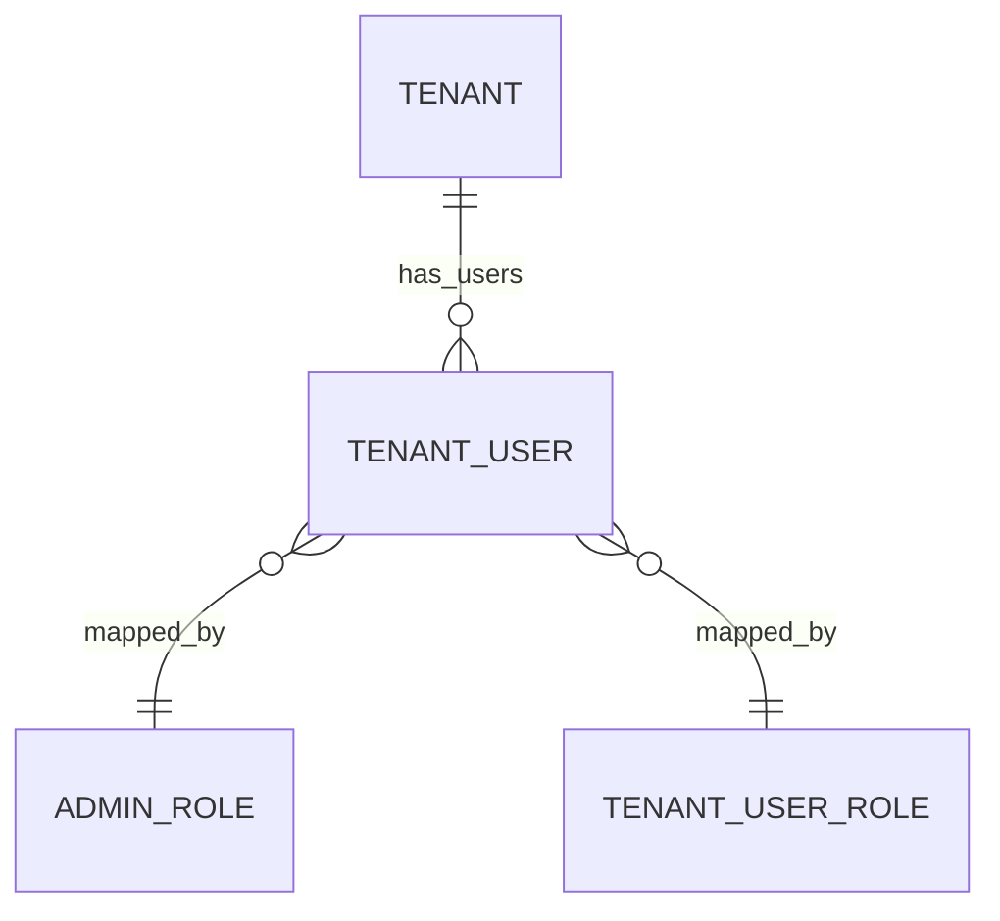

**图表来源**
- [backend/app/models/tenant/tenant.py](file://backend/app/models/tenant/tenant.py)
- [backend/app/models/tenant/tenant_user.py](file://backend/app/models/tenant/tenant_user.py)
- [backend/app/models/auth/admin_role.py](file://backend/app/models/auth/admin_role.py)
- [backend/app/models/auth/tenant_user_role.py](file://backend/app/models/auth/tenant_user_role.py)

**章节来源**
- [backend/app/models/tenant/tenant.py](file://backend/app/models/tenant/tenant.py)
- [backend/app/models/tenant/tenant_user.py](file://backend/app/models/tenant/tenant_user.py)
- [backend/app/models/auth/admin_role.py](file://backend/app/models/auth/admin_role.py)
- [backend/app/models/auth/tenant_user_role.py](file://backend/app/models/auth/tenant_user_role.py)

### 通用通知与偏好（Notification/NotificationTemplate/UserPreference）
- 字段与类型：标题、内容、接收人、模板名、偏好键值等
- 主键/外键：Notification.recipient_id 外键指向 TenantUser；模板与偏好独立管理
- 约束与索引：模板名唯一；索引覆盖 recipient_id、key
- 业务规则：模板化通知；个性化偏好驱动渲染
- 验证规则：内容长度；偏好键唯一
- 生命周期：创建、发送、归档

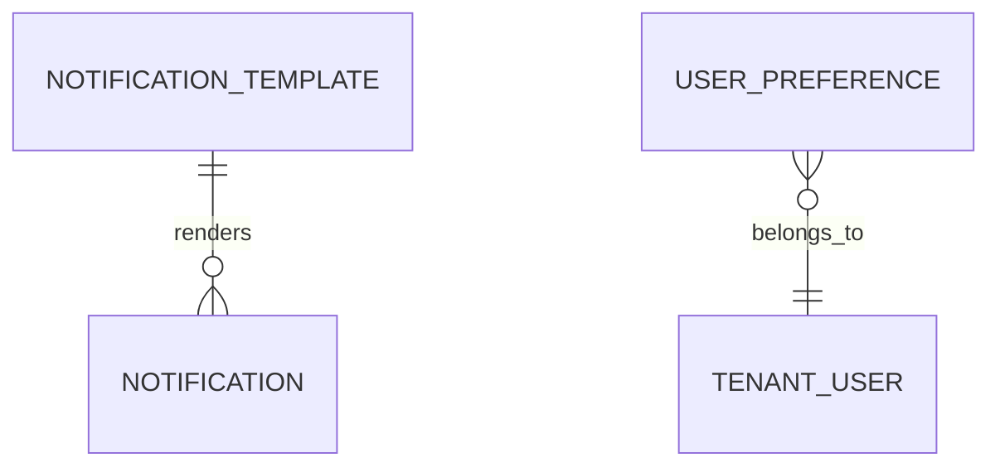

**图表来源**
- [backend/app/models/common/notification.py](file://backend/app/models/common/notification.py)
- [backend/app/models/common/notification_template.py](file://backend/app/models/common/notification_template.py)
- [backend/app/models/common/user_preference.py](file://backend/app/models/common/user_preference.py)
- [backend/app/models/tenant/tenant_user.py](file://backend/app/models/tenant/tenant_user.py)

**章节来源**
- [backend/app/models/common/notification.py](file://backend/app/models/common/notification.py)
- [backend/app/models/common/notification_template.py](file://backend/app/models/common/notification_template.py)
- [backend/app/models/common/user_preference.py](file://backend/app/models/common/user_preference.py)
- [backend/app/models/tenant/tenant_user.py](file://backend/app/models/tenant/tenant_user.py)

## 依赖分析
- 模型依赖：各模型通过外键与软删除字段与 BaseModel 继承体系保持一致；跨域依赖（如 Agent-KnowledgeBase、Skill-Plugin）通过中间表或外键体现
- 仓储与服务：Repository 层封装 CRUD 与复杂查询；Service 层编排业务规则与事务；二者均依赖 Core 的数据库与 Redis
- 查询解析：QueryParser 支持过滤、排序、分页与范围查询，降低重复实现
- 中间件：审计日志、访问控制、权限检查、租户隔离贯穿请求链路

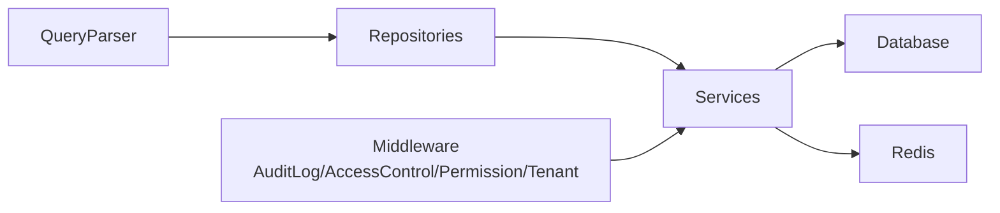

**图表来源**
- [backend/app/core/query_parser.py](file://backend/app/core/query_parser.py)
- [backend/app/core/base_repository.py](file://backend/app/core/base_repository.py)
- [backend/app/services/ai/agent_service.py](file://backend/app/services/ai/agent_service.py)
- [backend/app/services/system/task_definition_service.py](file://backend/app/services/system/task_definition_service.py)
- [backend/app/core/database.py](file://backend/app/core/database.py)
- [backend/app/core/redis.py](file://backend/app/core/redis.py)
- [backend/app/middleware/audit_log.py](file://backend/app/middleware/audit_log.py)
- [backend/app/middleware/access_control.py](file://backend/app/middleware/access_control.py)
- [backend/app/middleware/permission.py](file://backend/app/middleware/permission.py)
- [backend/app/middleware/tenant.py](file://backend/app/middleware/tenant.py)

**章节来源**
- [backend/app/core/query_parser.py](file://backend/app/core/query_parser.py)
- [backend/app/core/base_repository.py](file://backend/app/core/base_repository.py)
- [backend/app/services/ai/agent_service.py](file://backend/app/services/ai/agent_service.py)
- [backend/app/services/system/task_definition_service.py](file://backend/app/services/system/task_definition_service.py)
- [backend/app/core/database.py](file://backend/app/core/database.py)
- [backend/app/core/redis.py](file://backend/app/core/redis.py)
- [backend/app/middleware/audit_log.py](file://backend/app/middleware/audit_log.py)
- [backend/app/middleware/access_control.py](file://backend/app/middleware/access_control.py)
- [backend/app/middleware/permission.py](file://backend/app/middleware/permission.py)
- [backend/app/middleware/tenant.py](file://backend/app/middleware/tenant.py)

## 性能考虑
- 索引策略
  - 在高频过滤字段上建立单列或复合索引（如 tenant_id、owner_type+tenant_id、resource_type+resource_id）
  - 对枚举字段与布尔字段建立选择性良好的索引
- 查询优化
  - 使用 QueryParser 进行参数化过滤与分页，避免 N+1 查询
  - 对大表进行分页扫描时，优先使用基于游标或索引覆盖的查询
- 缓存策略
  - 使用 Redis 缓存热点配置（如 CodegenConfigVersion）、用户偏好（UserPreference）
  - 对只读数据（如插件清单、知识库元数据）设置短 TTL，结合后台刷新
- 写入优化
  - 批量写入与事务合并，减少锁竞争
  - 对软删除表定期归档至历史表，缩小热表大小
- 监控与告警
  - 结合中间件审计日志与 Prometheus 指标，监控慢查询与异常访问

## 故障排查指南
- 数据一致性问题
  - 检查外键约束与唯一性约束是否生效；确认软删除字段未被误删
  - 核对迁移脚本是否完整执行，必要时回滚并重跑
- 查询性能问题
  - 使用 EXPLAIN 分析慢查询；补充缺失索引或调整查询条件
  - 检查 QueryParser 参数是否正确传递
- 缓存命中率低
  - 核对缓存键命名与 TTL 设置；检查缓存失效策略
- 权限与租户隔离异常
  - 检查中间件顺序与租户上下文注入；核对 RBAC 规则与角色映射

**章节来源**
- [backend/app/middleware/audit_log.py](file://backend/app/middleware/audit_log.py)
- [backend/app/middleware/access_control.py](file://backend/app/middleware/access_control.py)
- [backend/app/middleware/permission.py](file://backend/app/middleware/permission.py)
- [backend/app/middleware/tenant.py](file://backend/app/middleware/tenant.py)
- [backend/app/core/query_parser.py](file://backend/app/core/query_parser.py)
- [backend/app/core/redis.py](file://backend/app/core/redis.py)

## 结论
本数据模型设计以清晰的领域划分与严格的约束定义为基础，结合仓储与服务层实现业务编排，并通过中间件保障安全与合规。配合合理的索引、缓存与查询优化策略，可在高并发场景下维持稳定性能。迁移与版本管理确保系统持续演进，同时通过审计与权限控制满足数据安全与隐私要求。

## 附录
- 数据访问模式
  - 仓储模式：Repository 封装 CRUD 与复杂查询，统一处理软删除与租户隔离
  - 服务编排：Service 聚合多个 Repository 调用，保证事务一致性与业务规则
- 数据生命周期与归档
  - 软删除：统一使用 deleted_at 字段；定期归档至历史表
  - 归档策略：基于时间窗口与业务重要性分级归档
- 迁移路径与版本管理
  - 迁移脚本位于 migrations/versions，遵循增量演进；env.py 与 helpers.py 提供环境与工具函数
- 数据安全与隐私
  - 访问控制：基于 RBAC 的角色与权限矩阵；租户隔离中间件
  - 审计日志：记录关键操作与变更轨迹
- ORM 映射与查询优化
  - ORM 映射：基于 SQLAlchemy（从模型与仓储推断）
  - 查询优化：参数化过滤、索引覆盖、分页游标、批量写入

**章节来源**
- [backend/migrations/env.py](file://backend/migrations/env.py)
- [backend/migrations/helpers.py](file://backend/migrations/helpers.py)
- [backend/app/core/database.py](file://backend/app/core/database.py)
- [backend/app/core/base_repository.py](file://backend/app/core/base_repository.py)
- [backend/app/middleware/access_control.py](file://backend/app/middleware/access_control.py)
- [backend/app/middleware/tenant.py](file://backend/app/middleware/tenant.py)
- [backend/app/middleware/audit_log.py](file://backend/app/middleware/audit_log.py)