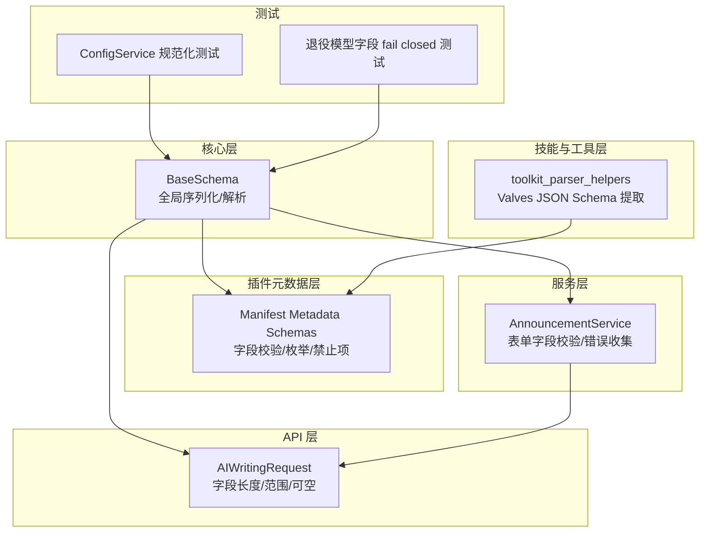
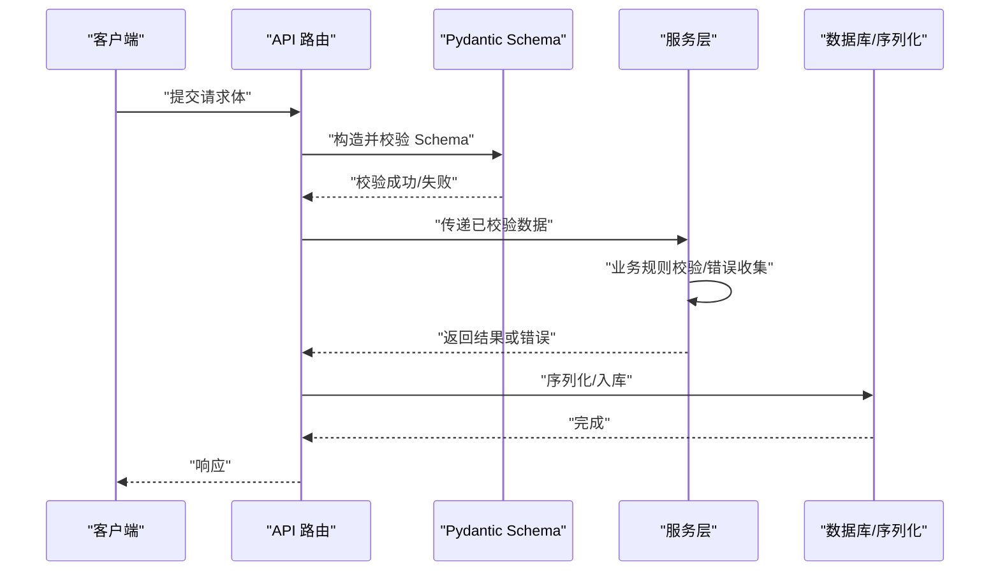
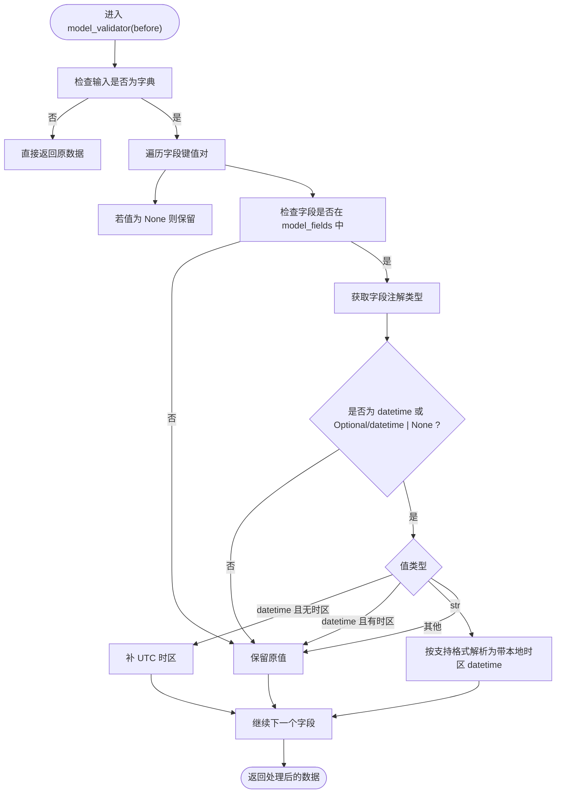
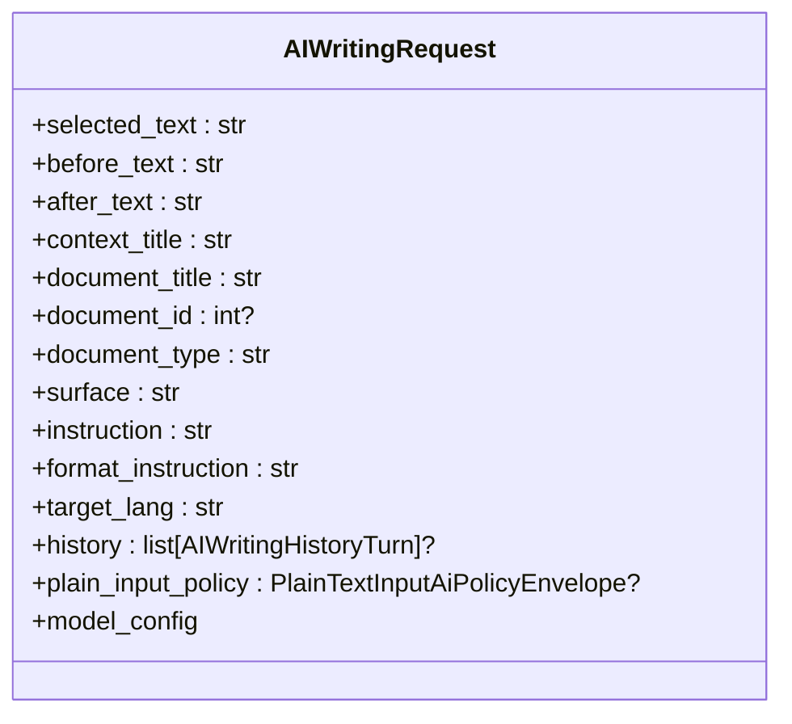
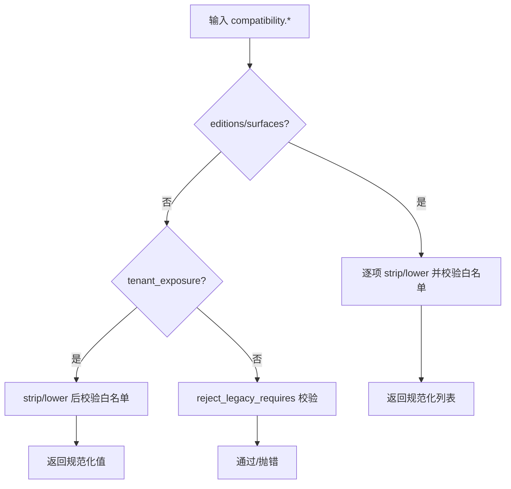
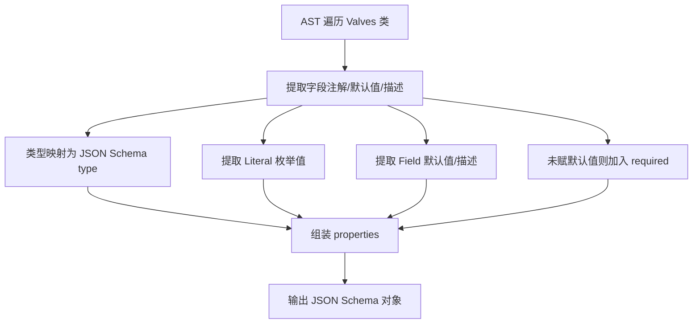
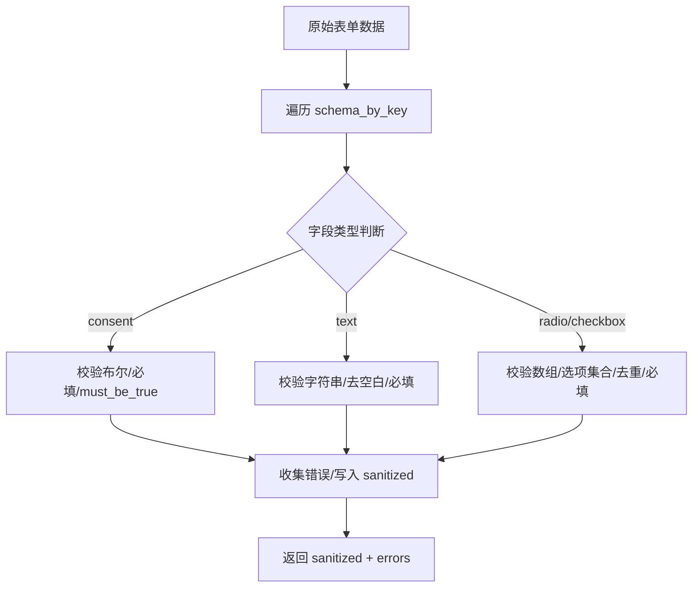
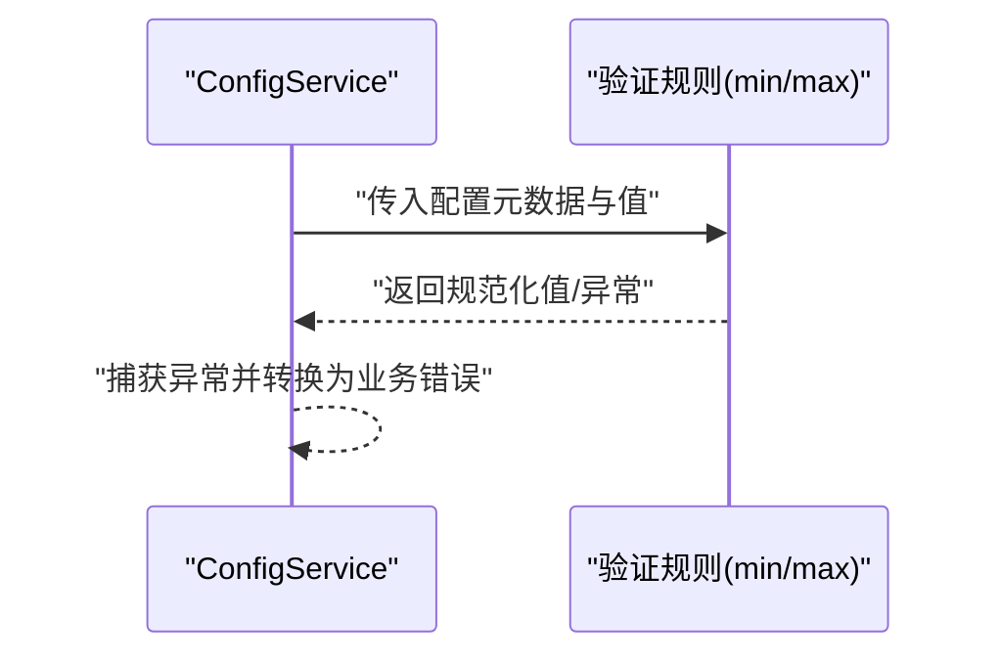
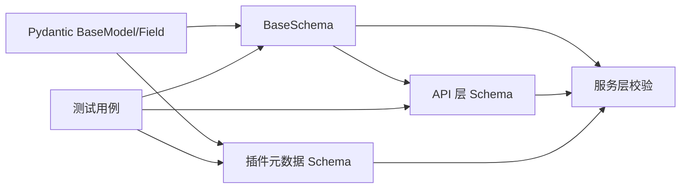

# 数据验证与约束

<cite>
**本文引用的文件**
- [backend/app/core/base_schema.py](file://backend/app/core/base_schema.py)
- [backend/app/api/admin/ai_writing.py](file://backend/app/api/admin/ai_writing.py)
- [backend/app/plugins/manifest_metadata_schemas.py](file://backend/app/plugins/manifest_metadata_schemas.py)
- [backend/app/ai/skills/toolkit_parser_helpers.py](file://backend/app/ai/skills/toolkit_parser_helpers.py)
- [backend/app/services/tenant/announcement_service.py](file://backend/app/services/tenant/announcement_service.py)
- [backend/tests/services/test_config_service.py](file://backend/tests/services/test_config_service.py)
- [backend/tests/test_retired_model_schema_fields.py](file://backend/tests/test_retired_model_schema_fields.py)
</cite>

## 目录
1. [引言](#引言)
2. [项目结构](#项目结构)
3. [核心组件](#核心组件)
4. [架构总览](#架构总览)
5. [详细组件分析](#详细组件分析)
6. [依赖关系分析](#依赖关系分析)
7. [性能考量](#性能考量)
8. [故障排查指南](#故障排查指南)
9. [结论](#结论)
10. [附录](#附录)

## 引言
本文件系统化梳理本仓库中的数据验证与约束实现，覆盖以下主题：
- Pydantic 模型的验证规则、字段约束与数据转换机制
- 输入输出 Schema 的定义、类型检查与默认值处理
- API 层、服务层与数据持久层的验证策略与职责边界
- 约束条件的实现方式（唯一性、范围、格式等）
- 自定义验证器的使用方法与最佳实践
- 错误处理与用户友好错误信息设计
- Schema 版本管理与向后兼容策略

## 项目结构
围绕“数据验证与约束”的关键目录与文件如下：
- 核心基类与全局序列化/解析逻辑：backend/app/core/base_schema.py
- API 层请求/响应 Schema 示例：backend/app/api/admin/ai_writing.py
- 插件清单元数据 Schema 与字段校验：backend/app/plugins/manifest_metadata_schemas.py
- 动态提取 Valves(JSON Schema) 的解析器：backend/app/ai/skills/toolkit_parser_helpers.py
- 业务服务层的输入校验与错误收集：backend/app/services/tenant/announcement_service.py
- 配置值规范化与范围校验测试：backend/tests/services/test_config_service.py
- 退役模型/字段“fail closed”测试：backend/tests/test_retired_model_schema_fields.py

**图表来源**
- [backend/app/core/base_schema.py:25-162](file://backend/app/core/base_schema.py#L25-L162)
- [backend/app/api/admin/ai_writing.py:33-51](file://backend/app/api/admin/ai_writing.py#L33-L51)
- [backend/app/plugins/manifest_metadata_schemas.py:76-127](file://backend/app/plugins/manifest_metadata_schemas.py#L76-L127)
- [backend/app/ai/skills/toolkit_parser_helpers.py:261-313](file://backend/app/ai/skills/toolkit_parser_helpers.py#L261-L313)
- [backend/app/services/tenant/announcement_service.py:407-532](file://backend/app/services/tenant/announcement_service.py#L407-L532)
- [backend/tests/services/test_config_service.py:56-76](file://backend/tests/services/test_config_service.py#L56-L76)
- [backend/tests/test_retired_model_schema_fields.py:1-16](file://backend/tests/test_retired_model_schema_fields.py#L1-L16)

**章节来源**
- [backend/app/core/base_schema.py:1-303](file://backend/app/core/base_schema.py#L1-L303)
- [backend/app/api/admin/ai_writing.py:1-92](file://backend/app/api/admin/ai_writing.py#L1-L92)
- [backend/app/plugins/manifest_metadata_schemas.py:1-291](file://backend/app/plugins/manifest_metadata_schemas.py#L1-L291)
- [backend/app/ai/skills/toolkit_parser_helpers.py:1-421](file://backend/app/ai/skills/toolkit_parser_helpers.py#L1-L421)
- [backend/app/services/tenant/announcement_service.py:407-532](file://backend/app/services/tenant/announcement_service.py#L407-L532)
- [backend/tests/services/test_config_service.py:56-76](file://backend/tests/services/test_config_service.py#L56-L76)
- [backend/tests/test_retired_model_schema_fields.py:1-16](file://backend/tests/test_retired_model_schema_fields.py#L1-L16)

## 核心组件
- BaseSchema 及其派生类
  - 统一配置：from_attributes、populate_by_name、use_enum_values、str_strip_whitespace
  - 全局序列化：将 datetime 字段转为 ISO 8601 UTC 字符串
  - 全局解析器：在验证前将字符串/可选 datetime 字段解析为带时区的 datetime 对象，支持多种输入格式
- API 层 Schema（示例）
  - AIWritingRequest：对字符串字段设置最大长度，对整数字段设置最小值，对可空字段允许 None
- 插件元数据 Schema
  - 使用 field_validator/model_validator 进行字段规范化与禁止项校验
  - 对枚举字段进行白名单校验与大小写/连字符归一化
- 技能/工具层 JSON Schema 提取
  - 从 Valves(BaseModel) 类定义中提取 JSON Schema，支持类型映射、默认值、枚举、必填字段
- 服务层校验与错误收集
  - 表单字段类型/必填/选项合法性/重复值等校验，并以结构化键路径收集错误
- 配置值规范化与范围校验
  - 数字值归一化与上下界强制，违反则抛出业务异常

**章节来源**
- [backend/app/core/base_schema.py:25-162](file://backend/app/core/base_schema.py#L25-L162)
- [backend/app/api/admin/ai_writing.py:33-51](file://backend/app/api/admin/ai_writing.py#L33-L51)
- [backend/app/plugins/manifest_metadata_schemas.py:76-127](file://backend/app/plugins/manifest_metadata_schemas.py#L76-L127)
- [backend/app/ai/skills/toolkit_parser_helpers.py:261-313](file://backend/app/ai/skills/toolkit_parser_helpers.py#L261-L313)
- [backend/app/services/tenant/announcement_service.py:407-532](file://backend/app/services/tenant/announcement_service.py#L407-L532)
- [backend/tests/services/test_config_service.py:56-76](file://backend/tests/services/test_config_service.py#L56-L76)

## 架构总览
数据验证贯穿三层：
- API 层：接收请求，定义字段约束（长度、范围、可空），触发 Pydantic 校验
- 服务层：补充业务规则校验（如表单选项合法性、显示规则翻译），收集错误并反馈
- 持久层：ORM 映射与序列化由 BaseSchema 统一处理，确保入库/出库一致性

**图表来源**
- [backend/app/api/admin/ai_writing.py:53-88](file://backend/app/api/admin/ai_writing.py#L53-L88)
- [backend/app/core/base_schema.py:43-64](file://backend/app/core/base_schema.py#L43-L64)
- [backend/app/services/tenant/announcement_service.py:407-532](file://backend/app/services/tenant/announcement_service.py#L407-L532)

## 详细组件分析

### BaseSchema 全局验证与转换
- 统一配置
  - from_attributes：支持从 ORM 模型转换
  - populate_by_name：支持字段别名
  - use_enum_values：枚举返回值而非对象
  - str_strip_whitespace：自动去除字符串首尾空白
- 全局序列化器
  - 将 datetime 字段统一转为 ISO 8601 UTC 字符串，解决 model_dump() 不触发 json_encoders 的问题
- 全局解析器
  - 在验证前识别 datetime 字段，支持多种输入格式（含日期/日期时间），自动补全时区
  - 对可选 datetime（Optional[datetime]）与 datetime | None 做兼容处理

**图表来源**
- [backend/app/core/base_schema.py:66-162](file://backend/app/core/base_schema.py#L66-L162)

**章节来源**
- [backend/app/core/base_schema.py:25-162](file://backend/app/core/base_schema.py#L25-L162)

### API 层 Schema：AIWritingRequest
- 字段约束示例
  - 字符串字段设置最大长度（max_length）
  - 整数字段设置最小值（ge）
  - 可空字段允许 None
- extra="forbid"：拒绝未显式声明的额外字段，避免脏数据进入后续流程

**图表来源**
- [backend/app/api/admin/ai_writing.py:33-51](file://backend/app/api/admin/ai_writing.py#L33-L51)

**章节来源**
- [backend/app/api/admin/ai_writing.py:33-51](file://backend/app/api/admin/ai_writing.py#L33-L51)

### 插件清单元数据 Schema：兼容性与依赖校验
- 兼容性字段
  - editions、surfaces：通过 field_validator 归一化为小写并去空白，白名单校验
  - tenant_exposure：归一化（连字符转下划线、小写），白名单校验，非法值抛错
  - model_validator 拒绝遗留字段（如 requires）
- 依赖声明
  - python 依赖项校验与去重
  - plugins 依赖项名称与版本校验，合并同名依赖的版本约束

**图表来源**
- [backend/app/plugins/manifest_metadata_schemas.py:76-127](file://backend/app/plugins/manifest_metadata_schemas.py#L76-L127)

**章节来源**
- [backend/app/plugins/manifest_metadata_schemas.py:76-127](file://backend/app/plugins/manifest_metadata_schemas.py#L76-L127)

### 技能/工具层：Valves JSON Schema 提取
- 从 Valves(BaseModel) 类定义中提取 JSON Schema
  - 类型映射：str/int/float/bool/list/dict/Union/Optional 等
  - 默认值与描述：从 Field(...) 提取
  - 枚举值：从 Literal[...] 提取
  - 必填字段：未赋默认值的字段视为必填

**图表来源**
- [backend/app/ai/skills/toolkit_parser_helpers.py:261-313](file://backend/app/ai/skills/toolkit_parser_helpers.py#L261-L313)

**章节来源**
- [backend/app/ai/skills/toolkit_parser_helpers.py:170-211](file://backend/app/ai/skills/toolkit_parser_helpers.py#L170-L211)
- [backend/app/ai/skills/toolkit_parser_helpers.py:261-313](file://backend/app/ai/skills/toolkit_parser_helpers.py#L261-L313)

### 服务层：表单字段校验与错误收集
- 场景：公告/表单配置等
- 校验维度
  - 必填/非空/去空白
  - 类型校验（字符串/布尔/数组）
  - 选项合法性与重复值
  - 结构化错误键路径（如 key.required、key.options.{i}.duplicate）

**图表来源**
- [backend/app/services/tenant/announcement_service.py:470-532](file://backend/app/services/tenant/announcement_service.py#L470-L532)

**章节来源**
- [backend/app/services/tenant/announcement_service.py:407-532](file://backend/app/services/tenant/announcement_service.py#L407-L532)

### 配置值规范化与范围校验
- 行为：数字值归一化、应用 min/max 规则
- 违规处理：抛出业务异常并携带错误码

**图表来源**
- [backend/tests/services/test_config_service.py:56-76](file://backend/tests/services/test_config_service.py#L56-L76)

**章节来源**
- [backend/tests/services/test_config_service.py:56-76](file://backend/tests/services/test_config_service.py#L56-L76)

### 退役模型/字段“fail closed”
- 行为：退役模型与 schema 字段必须 fail closed，不可作为可写兼容入口
- 目的：防止历史字段回流导致数据污染

**章节来源**
- [backend/tests/test_retired_model_schema_fields.py:1-16](file://backend/tests/test_retired_model_schema_fields.py#L1-L16)

## 依赖关系分析
- BaseSchema 为所有 Schema 的共同基类，影响 API 层与服务层的序列化/解析行为
- API 层 Schema 依赖 Pydantic 的 Field 约束与 model_config
- 插件元数据 Schema 依赖 field_validator/model_validator 实现白名单/禁止项校验
- 服务层通过结构化错误键路径与国际化消息提升用户体验
- 测试用例覆盖规范化与 fail closed 行为，保障变更不破坏兼容性

**图表来源**
- [backend/app/core/base_schema.py:25-162](file://backend/app/core/base_schema.py#L25-L162)
- [backend/app/api/admin/ai_writing.py:33-51](file://backend/app/api/admin/ai_writing.py#L33-L51)
- [backend/app/plugins/manifest_metadata_schemas.py:76-127](file://backend/app/plugins/manifest_metadata_schemas.py#L76-L127)
- [backend/tests/services/test_config_service.py:56-76](file://backend/tests/services/test_config_service.py#L56-L76)
- [backend/tests/test_retired_model_schema_fields.py:1-16](file://backend/tests/test_retired_model_schema_fields.py#L1-L16)

**章节来源**
- [backend/app/core/base_schema.py:25-162](file://backend/app/core/base_schema.py#L25-L162)
- [backend/app/api/admin/ai_writing.py:33-51](file://backend/app/api/admin/ai_writing.py#L33-L51)
- [backend/app/plugins/manifest_metadata_schemas.py:76-127](file://backend/app/plugins/manifest_metadata_schemas.py#L76-L127)
- [backend/tests/services/test_config_service.py:56-76](file://backend/tests/services/test_config_service.py#L56-L76)
- [backend/tests/test_retired_model_schema_fields.py:1-16](file://backend/tests/test_retired_model_schema_fields.py#L1-L16)

## 性能考量
- 全局解析器仅对字典输入生效，避免对非字典数据做无谓处理
- 字符串去空白与类型映射在必要时才进行，减少不必要的计算
- JSON Schema 提取基于 AST 遍历，仅在需要动态生成前端表单时调用
- 服务层错误收集采用结构化键路径，便于前端快速定位与提示

[本节为通用指导，无需特定文件来源]

## 故障排查指南
- 常见错误类型
  - 字段类型不符：如期望字符串却传入数组
  - 范围/长度超限：如 max_length、ge、le
  - 选项非法：不在允许集合内或重复
  - 未声明字段：extra="forbid" 模式下拒绝额外字段
- 排查步骤
  - 检查 API 层 Schema 的 Field 约束
  - 核对 BaseSchema 的全局解析/序列化行为
  - 审视插件元数据 Schema 的白名单与禁止项
  - 查看服务层错误键路径，定位具体字段
  - 运行相关测试用例，确认规范化与 fail closed 行为

**章节来源**
- [backend/app/api/admin/ai_writing.py:33-51](file://backend/app/api/admin/ai_writing.py#L33-L51)
- [backend/app/core/base_schema.py:66-162](file://backend/app/core/base_schema.py#L66-L162)
- [backend/app/plugins/manifest_metadata_schemas.py:76-127](file://backend/app/plugins/manifest_metadata_schemas.py#L76-L127)
- [backend/app/services/tenant/announcement_service.py:407-532](file://backend/app/services/tenant/announcement_service.py#L407-L532)
- [backend/tests/services/test_config_service.py:56-76](file://backend/tests/services/test_config_service.py#L56-L76)
- [backend/tests/test_retired_model_schema_fields.py:1-16](file://backend/tests/test_retired_model_schema_fields.py#L1-L16)

## 结论
本仓库通过“基类统一 + 层级分工”的方式实现了稳健的数据验证与约束体系：
- BaseSchema 提供全局解析与序列化保障
- API 层以 Pydantic Field 约束明确输入边界
- 插件元数据层以 validator 保证兼容性与安全
- 服务层补充业务规则与结构化错误反馈
- 测试用例确保规范化与退役字段“fail closed”

该体系兼顾了易用性与安全性，适合在复杂业务场景中持续演进。

[本节为总结，无需特定文件来源]

## 附录

### 自定义验证器最佳实践
- 使用 field_validator 进行字段级校验（如枚举白名单、格式归一化）
- 使用 model_validator 进行跨字段/整体校验（如拒绝遗留字段）
- 在服务层补充业务规则校验，并以结构化键路径收集错误
- 对于动态 Schema（如 Valves），通过 AST 提取 JSON Schema，保持前后端一致

**章节来源**
- [backend/app/plugins/manifest_metadata_schemas.py:76-127](file://backend/app/plugins/manifest_metadata_schemas.py#L76-L127)
- [backend/app/ai/skills/toolkit_parser_helpers.py:261-313](file://backend/app/ai/skills/toolkit_parser_helpers.py#L261-L313)
- [backend/app/services/tenant/announcement_service.py:407-532](file://backend/app/services/tenant/announcement_service.py#L407-L532)

### Schema 版本管理与向后兼容
- 退役模型/字段必须 fail closed，禁止作为可写兼容入口
- 插件兼容性字段通过白名单与规范化确保跨版本稳定
- 配置值规范化与范围校验保证数值型字段的稳定性

**章节来源**
- [backend/tests/test_retired_model_schema_fields.py:1-16](file://backend/tests/test_retired_model_schema_fields.py#L1-L16)
- [backend/app/plugins/manifest_metadata_schemas.py:76-127](file://backend/app/plugins/manifest_metadata_schemas.py#L76-L127)
- [backend/tests/services/test_config_service.py:56-76](file://backend/tests/services/test_config_service.py#L56-L76)