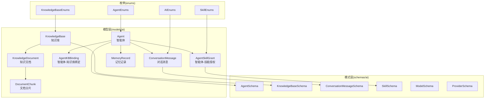
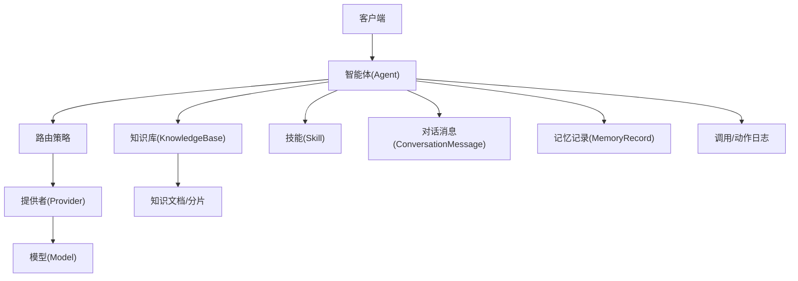
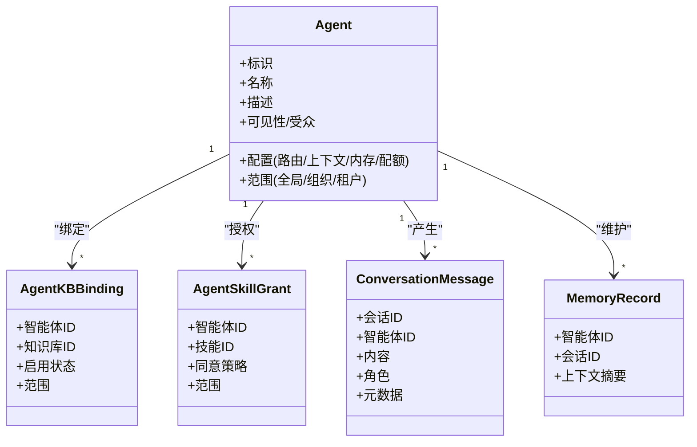
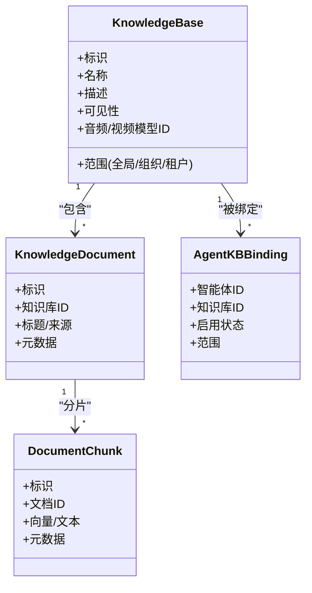
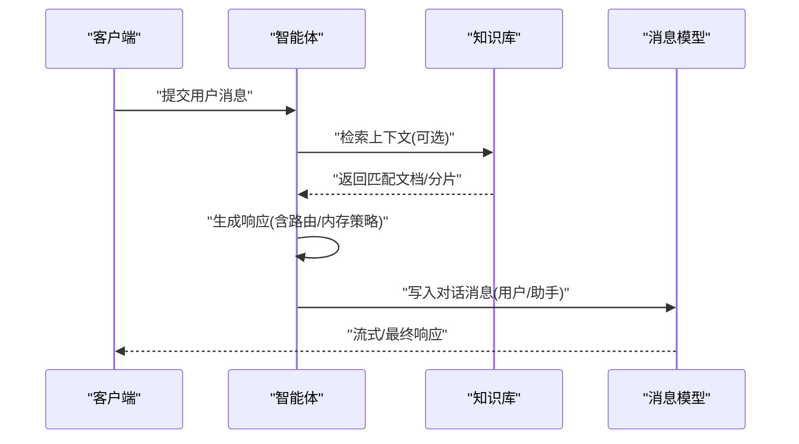
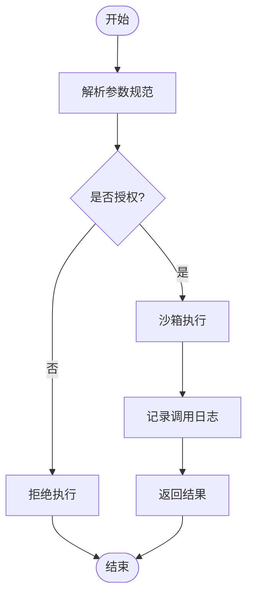
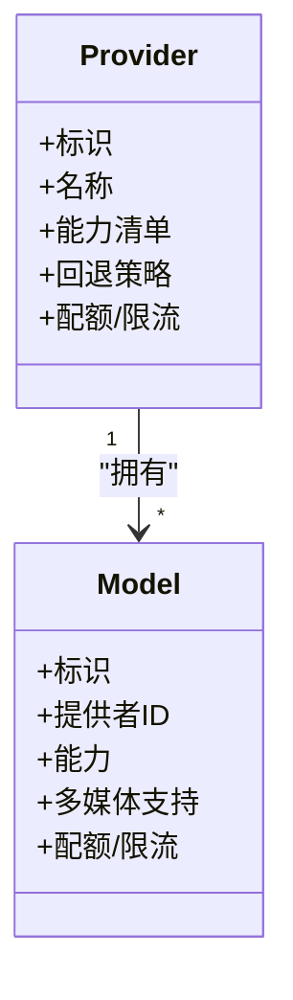
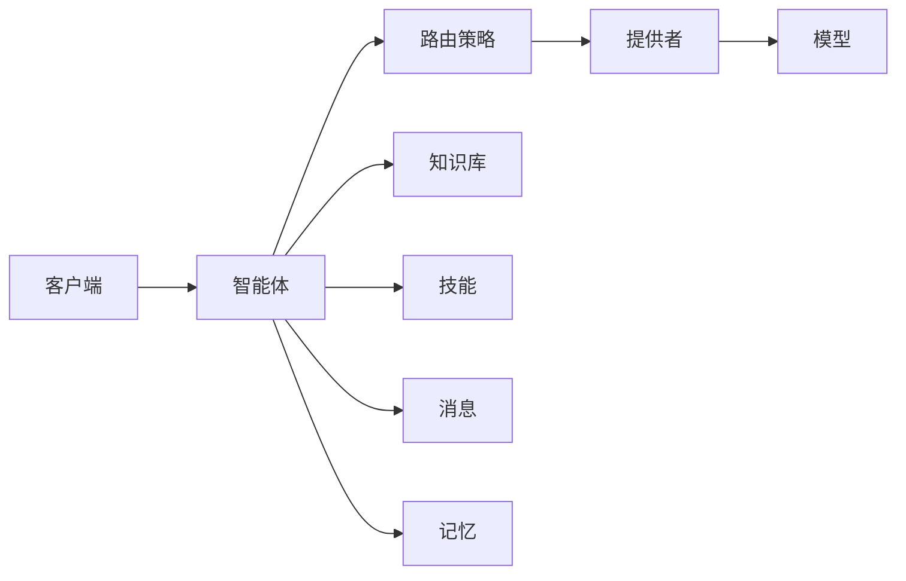
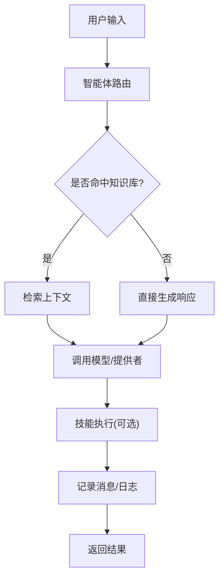

# AI能力模型

<cite>
**本文档引用的文件**
- [agent.py](file://backend/app/models/ai/agent.py)
- [conversation_message.py](file://backend/app/models/ai/conversation_message.py)
- [knowledge_base.py](file://backend/app/models/ai/knowledge_base.py)
- [knowledge_document.py](file://backend/app/models/ai/knowledge_document.py)
- [document_chunk.py](file://backend/app/models/ai/document_chunk.py)
- [agent_kb_binding.py](file://backend/app/models/ai/agent_kb_binding.py)
- [agent_skill_grant.py](file://backend/app/models/ai/agent_skill_grant.py)
- [skill.py](file://backend/app/schemas/ai/skill.py)
- [model.py](file://backend/app/schemas/ai/model.py)
- [provider.py](file://backend/app/schemas/ai/provider.py)
- [agent.py](file://backend/app/schemas/ai/agent.py)
- [conversation_message.py](file://backend/app/schemas/ai/conversation_message.py)
- [knowledge_base.py](file://backend/app/schemas/ai/knowledge_base.py)
- [agent_access.py](file://backend/app/models/ai/agent_access.py)
- [agent_version.py](file://backend/app/models/ai/agent_version.py)
- [capability.py](file://backend/app/models/ai/capability.py)
- [memory_record.py](file://backend/app/models/ai/memory_record.py)
- [execution_decision.py](file://backend/app/models/ai/execution_decision.py)
- [execution_trust_policy.py](file://backend/app/models/ai/execution_trust_policy.py)
- [batch_run.py](file://backend/app/models/ai/batch_run.py)
- [call_log.py](file://backend/app/models/ai/call_log.py)
- [action_log.py](file://backend/app/models/ai/action_log.py)
- [api_key.py](file://backend/app/models/ai/api_key.py)
- [agent_conversation.py](file://backend/app/models/ai/agent_conversation.py)
- [agent_memory_override.py](file://backend/app/models/ai/agent_memory_override.py)
- [enums/agent.py](file://backend/app/enums/agent.py)
- [enums/knowledge_base.py](file://backend/app/enums/knowledge_base.py)
- [enums/skill.py](file://backend/app/enums/skill.py)
- [enums/ai.py](file://backend/app/enums/ai.py)
</cite>

## 目录
1. [简介](#简介)
2. [项目结构](#项目结构)
3. [核心组件](#核心组件)
4. [架构总览](#架构总览)
5. [详细组件分析](#详细组件分析)
6. [依赖关系分析](#依赖关系分析)
7. [性能考虑](#性能考虑)
8. [故障排除指南](#故障排除指南)
9. [结论](#结论)
10. [附录](#附录)

## 简介
本文件系统化梳理AI能力模型的数据结构与运行机制，重点覆盖以下方面：
- 智能体（Agent）模型：配置、路由策略、可见性与访问控制、版本与内存策略等
- 知识库（KnowledgeBase）模型：文档管理、上下文构建、访问控制与多租户范围
- 对话消息（ConversationMessage）模型：消息流转、会话持久化与内存记录
- 技能（Skill）模型：定义、参数规范与授权绑定
- AI模型（Model）与提供者（Provider）模型：配置与路由决策
- 关联关系：智能体与知识库绑定、技能授权等
- 使用示例与业务场景：从配置到调用的端到端流程

## 项目结构
AI能力模型主要分布在后端应用的AI子域中，采用“模型-模式-仓库-服务”的分层设计，并通过枚举统一管理状态与范围。核心目录与职责如下：
- models/ai：实体模型定义，承载表结构与关系
- schemas/ai：序列化模式（Pydantic），用于API输入输出与校验
- repositories/ai：数据访问层，封装查询与事务
- services/ai：业务逻辑层，编排智能体、对话、RAG、技能等流程
- enums：统一的状态、作用域、权限等枚举值

图表来源
- [agent.py](file://backend/app/models/ai/agent.py)
- [knowledge_base.py](file://backend/app/models/ai/knowledge_base.py)
- [knowledge_document.py](file://backend/app/models/ai/knowledge_document.py)
- [document_chunk.py](file://backend/app/models/ai/document_chunk.py)
- [agent_kb_binding.py](file://backend/app/models/ai/agent_kb_binding.py)
- [agent_skill_grant.py](file://backend/app/models/ai/agent_skill_grant.py)
- [conversation_message.py](file://backend/app/models/ai/conversation_message.py)
- [memory_record.py](file://backend/app/models/ai/memory_record.py)
- [agent.py](file://backend/app/schemas/ai/agent.py)
- [knowledge_base.py](file://backend/app/schemas/ai/knowledge_base.py)
- [conversation_message.py](file://backend/app/schemas/ai/conversation_message.py)
- [skill.py](file://backend/app/schemas/ai/skill.py)
- [model.py](file://backend/app/schemas/ai/model.py)
- [provider.py](file://backend/app/schemas/ai/provider.py)
- [enums/agent.py](file://backend/app/enums/agent.py)
- [enums/knowledge_base.py](file://backend/app/enums/knowledge_base.py)
- [enums/skill.py](file://backend/app/enums/skill.py)
- [enums/ai.py](file://backend/app/enums/ai.py)

章节来源
- [agent.py](file://backend/app/models/ai/agent.py)
- [knowledge_base.py](file://backend/app/models/ai/knowledge_base.py)
- [conversation_message.py](file://backend/app/models/ai/conversation_message.py)
- [enums/agent.py](file://backend/app/enums/agent.py)
- [enums/knowledge_base.py](file://backend/app/enums/knowledge_base.py)
- [enums/skill.py](file://backend/app/enums/skill.py)
- [enums/ai.py](file://backend/app/enums/ai.py)

## 核心组件
本节对关键模型进行字段级说明，聚焦数据结构、约束与典型用途。

- 智能体（Agent）
  - 关键字段：标识、名称、描述、配置（含路由策略、可见性、访问控制、内存策略、配额与并发限制等）、版本信息、目标受众与范围
  - 典型用途：作为对话入口与技能编排中心，支持多租户范围与可见性控制
  - 关联对象：知识库绑定、技能授权、对话消息、记忆记录、版本与访问控制

- 知识库（KnowledgeBase）
  - 关键字段：标识、名称、描述、范围（全局/组织/租户）、可见性、访问控制、音频/视频模型ID、文档集合与分片
  - 典型用途：存储与检索文档，支撑RAG上下文构建与检索增强
  - 关联对象：知识文档、文档分片、智能体绑定

- 对话消息（ConversationMessage）
  - 关键字段：会话标识、消息内容、角色（用户/助手/系统）、元数据（时间戳、来源、路由标记）、关联智能体
  - 典型用途：记录对话流转，支持流式输出与持久化，配合记忆策略实现上下文管理

- 技能（Skill）
  - 关键字段：标识、名称、描述、参数规范（输入/输出模式）、授权策略、工具包与脚本
  - 典型用途：封装可复用能力，通过授权绑定到智能体，参与对话与任务执行

- AI模型（Model）与提供者（Provider）
  - 关键字段：模型标识、提供者标识、能力清单、图像/音频/视频支持、配额与限流、回退策略
  - 典型用途：统一管理推理后端，支持路由与容错

章节来源
- [agent.py](file://backend/app/models/ai/agent.py)
- [knowledge_base.py](file://backend/app/models/ai/knowledge_base.py)
- [conversation_message.py](file://backend/app/models/ai/conversation_message.py)
- [skill.py](file://backend/app/schemas/ai/skill.py)
- [model.py](file://backend/app/schemas/ai/model.py)
- [provider.py](file://backend/app/schemas/ai/provider.py)

## 架构总览
AI能力模型围绕“智能体-知识库-技能-模型/提供者”构建，形成如下交互闭环：
- 智能体接收请求，根据路由策略选择模型/提供者
- 结合知识库绑定与文档检索，构建上下文
- 调用已授权技能执行具体动作
- 记录对话消息与调用日志，维护记忆与配额

图表来源
- [agent.py](file://backend/app/models/ai/agent.py)
- [knowledge_base.py](file://backend/app/models/ai/knowledge_base.py)
- [conversation_message.py](file://backend/app/models/ai/conversation_message.py)
- [agent_skill_grant.py](file://backend/app/models/ai/agent_skill_grant.py)
- [agent_kb_binding.py](file://backend/app/models/ai/agent_kb_binding.py)
- [provider.py](file://backend/app/schemas/ai/provider.py)
- [model.py](file://backend/app/schemas/ai/model.py)
- [call_log.py](file://backend/app/models/ai/call_log.py)
- [action_log.py](file://backend/app/models/ai/action_log.py)

## 详细组件分析

### 智能体（Agent）模型
- 数据结构要点
  - 基本信息：标识、名称、描述、系统内置标记
  - 配置：路由配置、输出模式、上下文模板、内存策略、配额与并发限制
  - 可见性与访问：可见性范围、目标受众、访问控制策略
  - 版本与快照：版本管理、变更追踪
  - 范围与作用域：全局/组织/租户维度的资源可见性
- 关联关系
  - 与知识库：通过绑定表建立一对多或多对多关系，支持按租户/组织范围启用
  - 与技能：授权表控制技能可用性与同意策略
  - 与对话：消息模型关联智能体，支持会话持久化
  - 与记忆：记忆记录用于上下文窗口管理
- 处理逻辑
  - 路由策略：根据请求特征与模型能力选择最优提供者/模型
  - 访问控制：基于可见性与目标受众过滤不可见资源
  - 内存策略：结合历史消息与上下文长度限制，裁剪或压缩上下文

图表来源
- [agent.py](file://backend/app/models/ai/agent.py)
- [agent_kb_binding.py](file://backend/app/models/ai/agent_kb_binding.py)
- [agent_skill_grant.py](file://backend/app/models/ai/agent_skill_grant.py)
- [conversation_message.py](file://backend/app/models/ai/conversation_message.py)
- [memory_record.py](file://backend/app/models/ai/memory_record.py)

章节来源
- [agent.py](file://backend/app/models/ai/agent.py)
- [agent_access.py](file://backend/app/models/ai/agent_access.py)
- [agent_version.py](file://backend/app/models/ai/agent_version.py)
- [capability.py](file://backend/app/models/ai/capability.py)
- [enums/agent.py](file://backend/app/enums/agent.py)

### 知识库（KnowledgeBase）模型
- 数据结构要点
  - 基本信息：标识、名称、描述、系统内置标记
  - 范围与可见性：全局/组织/租户范围，可见性与访问控制
  - 多媒体支持：音频/视频模型ID，支持多媒体检索与生成
  - 文档与分片：文档集合与分片索引，支持向量化与检索
- 关联关系
  - 知识文档：一对多，文档可拆分为多个分片
  - 智能体绑定：通过绑定表实现跨租户/组织启用
- 处理逻辑
  - 文档入库：解析、分词、向量化、写入分片
  - 检索增强：基于查询向量匹配，拼接上下文返回给智能体

图表来源
- [knowledge_base.py](file://backend/app/models/ai/knowledge_base.py)
- [knowledge_document.py](file://backend/app/models/ai/knowledge_document.py)
- [document_chunk.py](file://backend/app/models/ai/document_chunk.py)
- [agent_kb_binding.py](file://backend/app/models/ai/agent_kb_binding.py)

章节来源
- [knowledge_base.py](file://backend/app/models/ai/knowledge_base.py)
- [knowledge_document.py](file://backend/app/models/ai/knowledge_document.py)
- [document_chunk.py](file://backend/app/models/ai/document_chunk.py)
- [enums/knowledge_base.py](file://backend/app/enums/knowledge_base.py)

### 对话消息（ConversationMessage）模型
- 数据结构要点
  - 会话标识：区分不同对话轮次
  - 角色：用户、助手、系统
  - 内容：文本/多媒体/结构化数据
  - 元数据：时间戳、来源、路由标记、智能体关联
- 流转机制
  - 接收：客户端提交用户消息
  - 编排：智能体根据路由策略与上下文模板生成响应
  - 持久化：消息写入数据库，支持流式输出与最终落盘
  - 记忆：结合记忆记录与上下文长度限制，动态裁剪

图表来源
- [conversation_message.py](file://backend/app/models/ai/conversation_message.py)
- [agent.py](file://backend/app/models/ai/agent.py)
- [knowledge_base.py](file://backend/app/models/ai/knowledge_base.py)

章节来源
- [conversation_message.py](file://backend/app/models/ai/conversation_message.py)
- [conversation_message.py](file://backend/app/schemas/ai/conversation_message.py)
- [memory_record.py](file://backend/app/models/ai/memory_record.py)

### 技能（Skill）模型
- 数据结构要点
  - 基本信息：标识、名称、描述、系统内置标记
  - 参数规范：输入/输出模式（Pydantic Schema），类型与约束
  - 工具包与脚本：可执行能力封装，支持沙箱与安全策略
  - 授权与同意：通过授权表控制可用性与同意策略
- 执行逻辑
  - 解析：根据参数规范校验输入
  - 授权：检查智能体是否被授权使用该技能
  - 执行：在受控环境中执行，记录调用日志
  - 回传：将结果注入对话或任务上下文

图表来源
- [skill.py](file://backend/app/schemas/ai/skill.py)
- [agent_skill_grant.py](file://backend/app/models/ai/agent_skill_grant.py)
- [action_log.py](file://backend/app/models/ai/action_log.py)

章节来源
- [skill.py](file://backend/app/schemas/ai/skill.py)
- [agent_skill_grant.py](file://backend/app/models/ai/agent_skill_grant.py)
- [enums/skill.py](file://backend/app/enums/skill.py)

### AI模型（Model）与提供者（Provider）模型
- 数据结构要点
  - 提供者：标识、名称、能力清单、回退策略、配额与限流
  - 模型：标识、提供者ID、能力、图像/音频/视频支持、配额与限流
- 配置管理
  - 能力映射：模型能力与技能/路由策略的匹配
  - 回退策略：失败时的备选提供者/模型
  - 配额与限流：按租户/组织维度控制用量

图表来源
- [provider.py](file://backend/app/schemas/ai/provider.py)
- [model.py](file://backend/app/schemas/ai/model.py)

章节来源
- [provider.py](file://backend/app/schemas/ai/provider.py)
- [model.py](file://backend/app/schemas/ai/model.py)

## 依赖关系分析
- 组件耦合
  - 智能体对知识库与技能存在强依赖；对模型/提供者的依赖通过路由策略解耦
  - 消息模型与记忆记录为横切关注点，贯穿对话生命周期
- 外部依赖
  - 存储驱动：知识库文档与分片的向量化存储
  - 计费与配额：用量统计与并发限制
- 关键依赖链
  - 客户端 → 智能体 → 路由策略 → 提供者/模型 → 知识库检索 → 技能执行 → 消息持久化

图表来源
- [agent.py](file://backend/app/models/ai/agent.py)
- [provider.py](file://backend/app/schemas/ai/provider.py)
- [model.py](file://backend/app/schemas/ai/model.py)
- [knowledge_base.py](file://backend/app/models/ai/knowledge_base.py)
- [conversation_message.py](file://backend/app/models/ai/conversation_message.py)
- [memory_record.py](file://backend/app/models/ai/memory_record.py)

## 性能考虑
- 检索效率
  - 向量化索引与分片裁剪，减少检索范围
  - 缓存热点文档/分片，降低重复检索开销
- 上下文管理
  - 动态裁剪与摘要生成，避免上下文超长
  - 内存记录按会话聚合，提升检索命中率
- 并发与配额
  - 按租户/组织维度的并发与用量配额，防止资源争用
  - 回退策略与重试机制，提升可用性

## 故障排除指南
- 常见问题
  - 无可用模型/提供者：检查路由策略与回退配置
  - 知识库不可见：核对范围与可见性设置
  - 技能未授权：确认授权表与同意策略
  - 消息丢失：核查消息持久化与流式写入
- 日志与审计
  - 调用日志与动作日志用于定位异常路径
  - 记忆记录与会话ID便于回溯上下文

章节来源
- [call_log.py](file://backend/app/models/ai/call_log.py)
- [action_log.py](file://backend/app/models/ai/action_log.py)
- [batch_run.py](file://backend/app/models/ai/batch_run.py)
- [execution_decision.py](file://backend/app/models/ai/execution_decision.py)
- [execution_trust_policy.py](file://backend/app/models/ai/execution_trust_policy.py)

## 结论
AI能力模型通过清晰的分层与强约束的枚举体系，实现了从智能体到知识库、技能与模型/提供者的完整闭环。其关键价值在于：
- 结构化的配置与路由策略，确保可控的推理路径
- 多租户范围与可见性控制，满足企业级合规要求
- 可插拔的技能授权与回退策略，兼顾灵活性与稳定性
- 完整的消息与日志体系，支撑可观测性与可追溯性

## 附录

### 模型使用示例与业务场景
- 场景一：智能客服
  - 配置：创建智能体，绑定常用知识库，授予客服类技能
  - 运行：客户提问 → 智能体检索知识库 → 生成回复 → 记录消息
- 场景二：数据分析助手
  - 配置：启用数据分析技能，配置模型/提供者回退
  - 运行：用户查询 → 智能体调用技能 → 返回可视化结果
- 场景三：多租户隔离
  - 配置：为不同租户设置独立知识库与可见性
  - 运行：租户A/B分别检索各自知识库，互不干扰

### 关键流程图（概念性）
