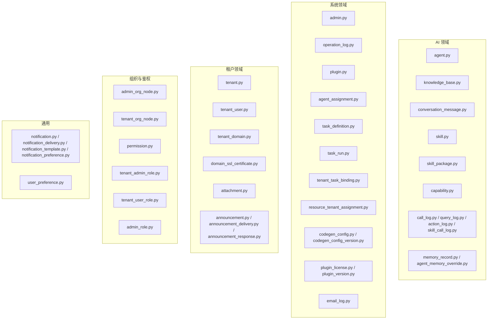
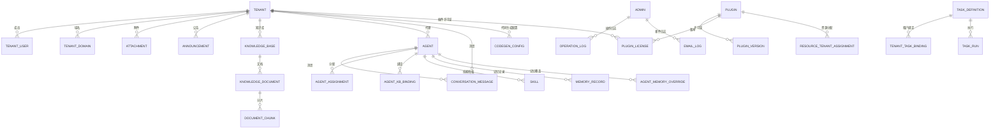
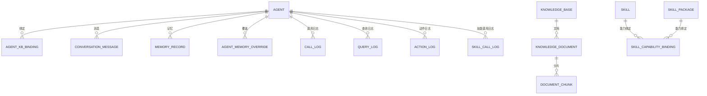
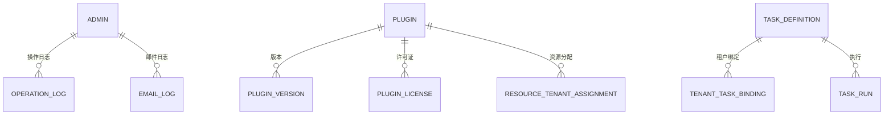
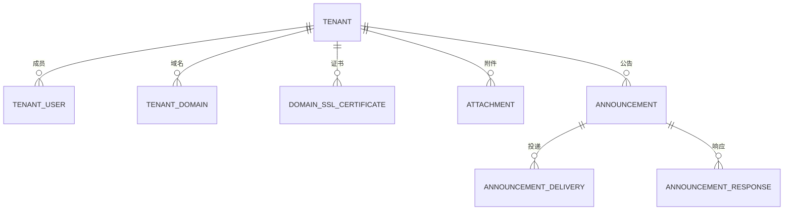
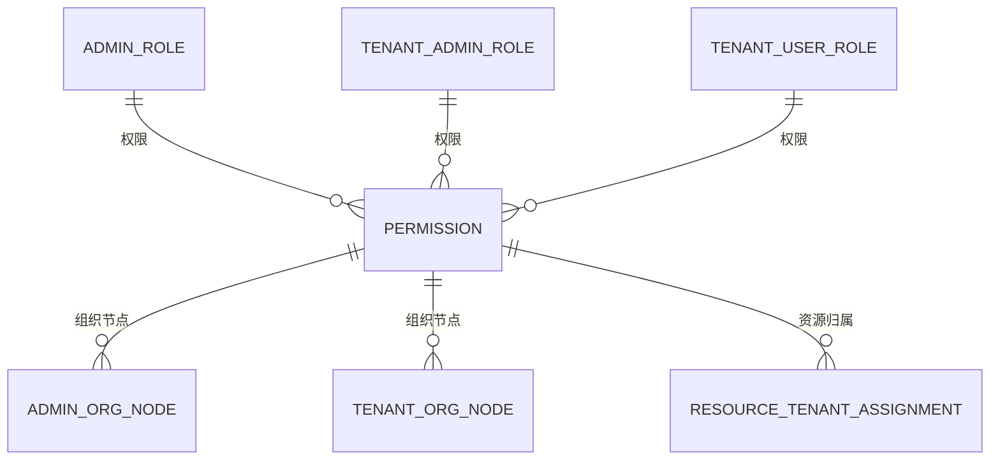
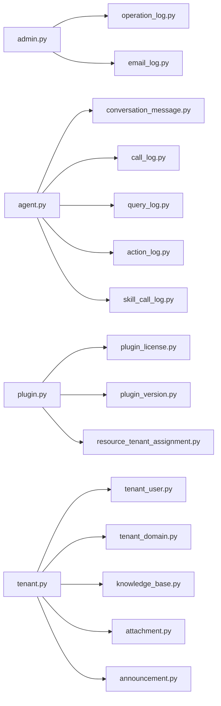

# 核心数据模型

<cite>
**本文引用的文件**
- [agent.py](file://backend/app/models/ai/agent.py)
- [knowledge_base.py](file://backend/app/models/ai/knowledge_base.py)
- [conversation_message.py](file://backend/app/models/ai/conversation_message.py)
- [admin.py](file://backend/app/models/system/admin.py)
- [operation_log.py](file://backend/app/models/system/operation_log.py)
- [plugin.py](file://backend/app/models/system/plugin.py)
- [tenant.py](file://backend/app/models/tenant/tenant.py)
- [tenant_user.py](file://backend/app/models/tenant/tenant_user.py)
- [tenant_domain.py](file://backend/app/models/tenant/tenant_domain.py)
- [agent_assignment.py](file://backend/app/models/system/agent_assignment.py)
- [task_definition.py](file://backend/app/models/system/task_definition.py)
- [task_run.py](file://backend/app/models/system/task_run.py)
- [tenant_task_binding.py](file://backend/app/models/system/tenant_task_binding.py)
- [resource_tenant_assignment.py](file://backend/app/models/system/resource_tenant_assignment.py)
- [email_log.py](file://backend/app/models/system/email_log.py)
- [codegen_config.py](file://backend/app/models/system/codegen_config.py)
- [codegen_config_version.py](file://backend/app/models/system/codegen_config_version.py)
- [plugin_license.py](file://backend/app/models/system/plugin_license.py)
- [plugin_version.py](file://backend/app/models/system/plugin_version.py)
- [domain_ssl_certificate.py](file://backend/app/models/tenant/domain_ssl_certificate.py)
- [attachment.py](file://backend/app/models/tenant/attachment.py)
- [announcement.py](file://backend/app/models/tenant/announcement.py)
- [announcement_delivery.py](file://backend/app/models/tenant/announcement_delivery.py)
- [announcement_response.py](file://backend/app/models/tenant/announcement_response.py)
- [memory_record.py](file://backend/app/models/ai/memory_record.py)
- [agent_memory_override.py](file://backend/app/models/ai/agent_memory_override.py)
- [tenant_quota.py](file://backend/app/models/ai/tenant_quota.py)
- [tenant_rate_limit.py](file://backend/app/models/ai/tenant_rate_limit.py)
- [tenant_agent_platform_kb_suppression.py](file://backend/app/models/ai/tenant_agent_platform_kb_suppression.py)
- [tenant_agent_publication.py](file://backend/app/models/ai/tenant_agent_publication.py)
- [agent_kb_binding.py](file://backend/app/models/ai/agent_kb_binding.py)
- [skill.py](file://backend/app/models/ai/skill.py)
- [skill_package.py](file://backend/app/models/ai/skill_package.py)
- [skill_capability_binding.py](file://backend/app/models/ai/skill_capability_binding.py)
- [capability.py](file://backend/app/models/ai/capability.py)
- [skill_call_log.py](file://backend/app/models/ai/skill_call_log.py)
- [call_log.py](file://backend/app/models/ai/call_log.py)
- [query_log.py](file://backend/app/models/ai/query_log.py)
- [action_log.py](file://backend/app/models/ai/action_log.py)
- [execution_trust_policy.py](file://backend/app/models/ai/execution_trust_policy.py)
- [execution_decision.py](file://backend/app/models/ai/execution_decision.py)
- [profile_snapshot.py](file://backend/app/models/ai/profile_snapshot.py)
- [batch_run.py](file://backend/app/models/ai/batch_run.py)
- [provider.py](file://backend/app/models/ai/provider.py)
- [model.py](file://backend/app/models/ai/model.py)
- [knowledge_document.py](file://backend/app/models/ai/knowledge_document.py)
- [document_chunk.py](file://backend/app/models/ai/document_chunk.py)
- [api_key.py](file://backend/app/models/ai/api_key.py)
- [admin_org_node.py](file://backend/app/models/org/admin_org_node.py)
- [tenant_org_node.py](file://backend/app/models/org/tenant_org_node.py)
- [permission.py](file://backend/app/models/auth/permission.py)
- [tenant_admin_role.py](file://backend/app/models/auth/tenant_admin_role.py)
- [tenant_user_role.py](file://backend/app/models/auth/tenant_user_role.py)
- [admin_role.py](file://backend/app/models/auth/admin_role.py)
- [notification.py](file://backend/app/models/common/notification.py)
- [notification_delivery.py](file://backend/app/models/common/notification_delivery.py)
- [notification_template.py](file://backend/app/models/common/notification_template.py)
- [notification_preference.py](file://backend/app/models/common/notification_preference.py)
- [user_preference.py](file://backend/app/models/common/user_preference.py)
</cite>

## 目录
1. [引言](#引言)
2. [项目结构](#项目结构)
3. [核心组件](#核心组件)
4. [架构总览](#架构总览)
5. [详细组件分析](#详细组件分析)
6. [依赖分析](#依赖分析)
7. [性能考虑](#性能考虑)
8. [故障排除指南](#故障排除指南)
9. [结论](#结论)
10. [附录](#附录)

## 引言
本文件面向后端工程师与数据架构师，系统性梳理核心数据模型，覆盖 AI 模型（agent、knowledge_base、conversation 等）、系统模型（admin、operation_log、plugin 等）、租户模型（tenant、tenant_user、tenant_domain 等）。文档从字段定义、数据类型、约束条件与关系映射入手，结合迁移脚本与业务语义，解释权限控制、租户隔离、多态关系等设计要点，并给出使用示例与最佳实践，以及生命周期管理与数据完整性保障机制。

## 项目结构
后端采用按领域分层的模型组织方式：AI 领域模型、系统领域模型、租户领域模型、组织与鉴权模型、通用通知与偏好模型。各领域内通过清晰的文件命名与目录划分，便于定位与维护。

## 核心组件
本节概述三大类核心模型的关键职责与典型字段（以“字段名: 类型/约束”形式列出），并标注常见索引与外键关系。

- AI 模型
  - agent: 唯一标识、名称、可见性、访问策略、路由配置、版本、上下文与输出模式、配额配置、内存策略等
  - knowledge_base: 名称、描述、范围（全局/租户）、可见性、访问控制、模型与多媒体能力、绑定状态
  - conversation_message: 会话消息内容、角色（用户/助手）、元数据、所属会话与 agent 关联
  - skill/skill_package/capability: 技能包、技能与能力的定义、许可与能力绑定
  - 记录日志: call_log、query_log、action_log、skill_call_log，记录调用、查询、动作与技能调用的审计与追踪
  - 内存: memory_record、agent_memory_override，支持会话记忆与覆盖策略
  - 其他: api_key、provider、model、knowledge_document、document_chunk、batch_run、execution_trust_policy、execution_decision、profile_snapshot 等

- 系统模型
  - admin: 管理员账户信息、登录安全字段
  - operation_log: 操作日志、操作者快照、动作、目标、时间戳、来源与跟踪 ID
  - plugin 及其版本/许可证: 插件注册、版本管理、许可证与安装源
  - 任务体系: task_definition、task_run、tenant_task_binding，支持平台级与租户级任务编排
  - 资源租户分配: resource_tenant_assignment，资源与租户的归属关系
  - 配置与邮件: codegen_config、codegen_config_version、email_log

- 租户模型
  - tenant/tenant_user/tenant_domain: 租户主体、成员与域名
  - domain_ssl_certificate: 域名证书
  - attachment: 附件存储与基础 URL
  - announcement 系列: 公告、投递与响应
  - 权限与配额: tenant_quota、tenant_rate_limit、tenant_agent_platform_kb_suppression、tenant_agent_publication、agent_kb_binding

- 组织与鉴权
  - admin_org_node、tenant_org_node: 组织节点树
  - permission、tenant_admin_role、tenant_user_role、admin_role: 权限与角色体系

- 通用
  - notification、notification_delivery、notification_template、notification_preference、user_preference: 通知与偏好

**章节来源**
- [agent.py](file://backend/app/models/ai/agent.py)
- [knowledge_base.py](file://backend/app/models/ai/knowledge_base.py)
- [conversation_message.py](file://backend/app/models/ai/conversation_message.py)
- [admin.py](file://backend/app/models/system/admin.py)
- [operation_log.py](file://backend/app/models/system/operation_log.py)
- [plugin.py](file://backend/app/models/system/plugin.py)
- [tenant.py](file://backend/app/models/tenant/tenant.py)
- [tenant_user.py](file://backend/app/models/tenant/tenant_user.py)
- [tenant_domain.py](file://backend/app/models/tenant/tenant_domain.py)

## 架构总览
下图展示 AI、系统、租户三类模型之间的关键关系与外键约束，体现租户隔离、权限控制与资源归属。

**图表来源**
- [tenant.py](file://backend/app/models/tenant/tenant.py)
- [tenant_user.py](file://backend/app/models/tenant/tenant_user.py)
- [tenant_domain.py](file://backend/app/models/tenant/tenant_domain.py)
- [attachment.py](file://backend/app/models/tenant/attachment.py)
- [announcement.py](file://backend/app/models/tenant/announcement.py)
- [knowledge_base.py](file://backend/app/models/ai/knowledge_base.py)
- [knowledge_document.py](file://backend/app/models/ai/knowledge_document.py)
- [document_chunk.py](file://backend/app/models/ai/document_chunk.py)
- [agent.py](file://backend/app/models/ai/agent.py)
- [conversation_message.py](file://backend/app/models/ai/conversation_message.py)
- [agent_assignment.py](file://backend/app/models/system/agent_assignment.py)
- [agent_kb_binding.py](file://backend/app/models/ai/agent_kb_binding.py)
- [skill.py](file://backend/app/models/ai/skill.py)
- [memory_record.py](file://backend/app/models/ai/memory_record.py)
- [agent_memory_override.py](file://backend/app/models/ai/agent_memory_override.py)
- [plugin.py](file://backend/app/models/system/plugin.py)
- [plugin_version.py](file://backend/app/models/system/plugin_version.py)
- [plugin_license.py](file://backend/app/models/system/plugin_license.py)
- [resource_tenant_assignment.py](file://backend/app/models/system/resource_tenant_assignment.py)
- [task_definition.py](file://backend/app/models/system/task_definition.py)
- [tenant_task_binding.py](file://backend/app/models/system/tenant_task_binding.py)
- [task_run.py](file://backend/app/models/system/task_run.py)
- [admin.py](file://backend/app/models/system/admin.py)
- [operation_log.py](file://backend/app/models/system/operation_log.py)
- [email_log.py](file://backend/app/models/system/email_log.py)

## 详细组件分析

### AI 模型族
- agent（代理）
  - 字段要点：唯一标识、名称、可见性、访问策略、路由配置、版本、上下文与输出模式、配额配置、内存策略等
  - 约束与关系：与 knowledge_base 通过 agent_kb_binding 进行多对多绑定；与 conversation_message 一对多；与 agent_assignment、tenant_agent_publication、tenant_agent_platform_kb_suppression 等进行租户与平台级控制
  - 生命周期：版本化管理、发布与抑制策略、配额与速率限制联动
  - 最佳实践：为不同场景配置独立的 agent 版本与内存覆盖策略；严格控制可见性与访问范围

- knowledge_base（知识库）
  - 字段要点：名称、描述、范围（全局/租户）、可见性、访问控制、模型与多媒体能力、绑定状态
  - 约束与关系：与 document_chunk 分片存储；与 agent 通过 agent_kb_binding 绑定；与 tenant 进行租户级访问控制
  - 最佳实践：按业务域拆分知识库；启用可见性与访问控制；定期清理未使用分片

- conversation_message（会话消息）
  - 字段要点：消息内容、角色（用户/助手）、元数据、所属会话与 agent 关联
  - 约束与关系：属于 tenant 的同时与 agent 关联；支持按 tenant 与 agent 查询
  - 最佳实践：为消息建立索引；控制消息长度与敏感信息脱敏

- skill/skill_package/capability（技能与能力）
  - 字段要点：技能包、技能与能力的定义、许可与能力绑定
  - 约束与关系：与 agent 的技能授权（grant）与绑定（binding）；与 call_log、skill_call_log 形成审计闭环
  - 最佳实践：统一管理能力与技能包；通过 binding 控制租户级可用性

- 日志与追踪
  - call_log、query_log、action_log、skill_call_log：记录调用、查询、动作与技能调用的审计与追踪
  - 约束与关系：与 agent、skill、tenant 等形成多维关联；支持按租户与时间过滤
  - 最佳实践：异步落库；设置保留周期；区分结构化与非结构化字段

- 内存与会话
  - memory_record、agent_memory_override：支持会话记忆与覆盖策略
  - 约束与关系：与 agent 关联；受 tenant 隔离
  - 最佳实践：按会话维度清理过期记忆；避免跨租户泄露

**图表来源**
- [agent.py](file://backend/app/models/ai/agent.py)
- [knowledge_base.py](file://backend/app/models/ai/knowledge_base.py)
- [conversation_message.py](file://backend/app/models/ai/conversation_message.py)
- [agent_kb_binding.py](file://backend/app/models/ai/agent_kb_binding.py)
- [memory_record.py](file://backend/app/models/ai/memory_record.py)
- [agent_memory_override.py](file://backend/app/models/ai/agent_memory_override.py)
- [call_log.py](file://backend/app/models/ai/call_log.py)
- [query_log.py](file://backend/app/models/ai/query_log.py)
- [action_log.py](file://backend/app/models/ai/action_log.py)
- [skill_call_log.py](file://backend/app/models/ai/skill_call_log.py)
- [knowledge_document.py](file://backend/app/models/ai/knowledge_document.py)
- [document_chunk.py](file://backend/app/models/ai/document_chunk.py)
- [skill.py](file://backend/app/models/ai/skill.py)
- [skill_package.py](file://backend/app/models/ai/skill_package.py)
- [skill_capability_binding.py](file://backend/app/models/ai/skill_capability_binding.py)
- [capability.py](file://backend/app/models/ai/capability.py)

**章节来源**
- [agent.py](file://backend/app/models/ai/agent.py)
- [knowledge_base.py](file://backend/app/models/ai/knowledge_base.py)
- [conversation_message.py](file://backend/app/models/ai/conversation_message.py)
- [memory_record.py](file://backend/app/models/ai/memory_record.py)
- [agent_memory_override.py](file://backend/app/models/ai/agent_memory_override.py)
- [call_log.py](file://backend/app/models/ai/call_log.py)
- [query_log.py](file://backend/app/models/ai/query_log.py)
- [action_log.py](file://backend/app/models/ai/action_log.py)
- [skill_call_log.py](file://backend/app/models/ai/skill_call_log.py)
- [knowledge_document.py](file://backend/app/models/ai/knowledge_document.py)
- [document_chunk.py](file://backend/app/models/ai/document_chunk.py)
- [skill.py](file://backend/app/models/ai/skill.py)
- [skill_package.py](file://backend/app/models/ai/skill_package.py)
- [skill_capability_binding.py](file://backend/app/models/ai/skill_capability_binding.py)
- [capability.py](file://backend/app/models/ai/capability.py)

### 系统模型族
- admin（管理员）
  - 字段要点：账户信息、登录安全字段
  - 约束与关系：与 operation_log、email_log 等产生审计与通信记录
  - 最佳实践：最小权限原则；强口令与二次验证

- operation_log（操作日志）
  - 字段要点：操作者快照、动作、目标、时间戳、来源与跟踪 ID
  - 约束与关系：按 tenant 与 actor 过滤；支持审计追踪
  - 最佳实践：异步写入；设置保留策略；区分敏感与非敏感操作

- plugin 及其版本/许可证
  - 字段要点：插件注册、版本管理、许可证与安装源
  - 约束与关系：与 resource_tenant_assignment 形成资源归属；与 tenant 进行租户级安装与使用控制
  - 最佳实践：版本兼容性校验；许可证到期预警

- 任务体系
  - task_definition、task_run、tenant_task_binding：平台级与租户级任务编排
  - 约束与关系：与 tenant 绑定；支持调度与执行追踪
  - 最佳实践：幂等设计；失败重试与告警

**图表来源**
- [admin.py](file://backend/app/models/system/admin.py)
- [operation_log.py](file://backend/app/models/system/operation_log.py)
- [plugin.py](file://backend/app/models/system/plugin.py)
- [plugin_version.py](file://backend/app/models/system/plugin_version.py)
- [plugin_license.py](file://backend/app/models/system/plugin_license.py)
- [resource_tenant_assignment.py](file://backend/app/models/system/resource_tenant_assignment.py)
- [task_definition.py](file://backend/app/models/system/task_definition.py)
- [tenant_task_binding.py](file://backend/app/models/system/tenant_task_binding.py)
- [task_run.py](file://backend/app/models/system/task_run.py)
- [email_log.py](file://backend/app/models/system/email_log.py)

**章节来源**
- [admin.py](file://backend/app/models/system/admin.py)
- [operation_log.py](file://backend/app/models/system/operation_log.py)
- [plugin.py](file://backend/app/models/system/plugin.py)
- [plugin_version.py](file://backend/app/models/system/plugin_version.py)
- [plugin_license.py](file://backend/app/models/system/plugin_license.py)
- [resource_tenant_assignment.py](file://backend/app/models/system/resource_tenant_assignment.py)
- [task_definition.py](file://backend/app/models/system/task_definition.py)
- [tenant_task_binding.py](file://backend/app/models/system/tenant_task_binding.py)
- [task_run.py](file://backend/app/models/system/task_run.py)
- [email_log.py](file://backend/app/models/system/email_log.py)

### 租户模型族
- tenant/tenant_user/tenant_domain
  - 字段要点：租户主体、成员与域名
  - 约束与关系：tenant_user 与 tenant 多对多；tenant_domain 与 tenant 一对一或一对多
  - 最佳实践：成员角色分离；域名与证书同步

- domain_ssl_certificate/attachment/announcement 系列
  - 字段要点：证书、附件、公告与投递响应
  - 约束与关系：与 tenant 关联；附件可为空租户 ID（公共附件）
  - 最佳实践：证书轮换流程；附件访问鉴权

**图表来源**
- [tenant.py](file://backend/app/models/tenant/tenant.py)
- [tenant_user.py](file://backend/app/models/tenant/tenant_user.py)
- [tenant_domain.py](file://backend/app/models/tenant/tenant_domain.py)
- [domain_ssl_certificate.py](file://backend/app/models/tenant/domain_ssl_certificate.py)
- [attachment.py](file://backend/app/models/tenant/attachment.py)
- [announcement.py](file://backend/app/models/tenant/announcement.py)
- [announcement_delivery.py](file://backend/app/models/tenant/announcement_delivery.py)
- [announcement_response.py](file://backend/app/models/tenant/announcement_response.py)

**章节来源**
- [tenant.py](file://backend/app/models/tenant/tenant.py)
- [tenant_user.py](file://backend/app/models/tenant/tenant_user.py)
- [tenant_domain.py](file://backend/app/models/tenant/tenant_domain.py)
- [domain_ssl_certificate.py](file://backend/app/models/tenant/domain_ssl_certificate.py)
- [attachment.py](file://backend/app/models/tenant/attachment.py)
- [announcement.py](file://backend/app/models/tenant/announcement.py)
- [announcement_delivery.py](file://backend/app/models/tenant/announcement_delivery.py)
- [announcement_response.py](file://backend/app/models/tenant/announcement_response.py)

### 权限控制与租户隔离
- 角色与权限
  - admin_role、tenant_admin_role、tenant_user_role、permission：构建平台与租户两级权限体系
  - 最佳实践：基于角色的最小权限；定期审计权限矩阵

- 组织节点
  - admin_org_node、tenant_org_node：组织树结构，支撑逐级授权与可见性控制

- 资源归属
  - resource_tenant_assignment：资源与租户的归属关系，确保资源隔离

**图表来源**
- [admin_role.py](file://backend/app/models/auth/admin_role.py)
- [tenant_admin_role.py](file://backend/app/models/auth/tenant_admin_role.py)
- [tenant_user_role.py](file://backend/app/models/auth/tenant_user_role.py)
- [permission.py](file://backend/app/models/auth/permission.py)
- [admin_org_node.py](file://backend/app/models/org/admin_org_node.py)
- [tenant_org_node.py](file://backend/app/models/org/tenant_org_node.py)
- [resource_tenant_assignment.py](file://backend/app/models/system/resource_tenant_assignment.py)

**章节来源**
- [admin_role.py](file://backend/app/models/auth/admin_role.py)
- [tenant_admin_role.py](file://backend/app/models/auth/tenant_admin_role.py)
- [tenant_user_role.py](file://backend/app/models/auth/tenant_user_role.py)
- [permission.py](file://backend/app/models/auth/permission.py)
- [admin_org_node.py](file://backend/app/models/org/admin_org_node.py)
- [tenant_org_node.py](file://backend/app/models/org/tenant_org_node.py)
- [resource_tenant_assignment.py](file://backend/app/models/system/resource_tenant_assignment.py)

### 业务逻辑在数据模型中的体现
- 租户隔离
  - 所有与租户相关的实体均带有 tenant_id 或通过中间表与 tenant 关联，确保数据边界清晰
  - 示例：conversation_message、knowledge_base、plugin_license、tenant_quota 等

- 多态关系
  - 资源归属与操作对象可能涉及多态快照或动态目标，通过统一的资源分配与审计日志实现追踪

- 权限控制
  - 通过角色与权限表、组织节点树与资源归属表，实现细粒度的访问控制与可见性管理

- 生命周期管理
  - 通过删除标记、回收站、软删除与版本化（如 agent_version、plugin_version、codegen_config_version）实现生命周期闭环

- 数据完整性
  - 通过唯一性约束（如 tenant-scoped 唯一）、外键约束、触发器与迁移脚本中的约束补齐，保障一致性

**章节来源**
- [tenant_quota.py](file://backend/app/models/ai/tenant_quota.py)
- [tenant_rate_limit.py](file://backend/app/models/ai/tenant_rate_limit.py)
- [tenant_agent_platform_kb_suppression.py](file://backend/app/models/ai/tenant_agent_platform_kb_suppression.py)
- [tenant_agent_publication.py](file://backend/app/models/ai/tenant_agent_publication.py)
- [agent_kb_binding.py](file://backend/app/models/ai/agent_kb_binding.py)
- [resource_tenant_assignment.py](file://backend/app/models/system/resource_tenant_assignment.py)

## 依赖分析
- 组件耦合
  - AI 模型与系统模型存在跨域依赖（如 agent 与 task、plugin、operation_log），但通过中间表与外键保持低耦合
  - 租户模型作为数据隔离基座，被广泛引用，需谨慎变更

- 直接与间接依赖
  - operation_log 与 admin、email_log 等直接依赖；通过 tenant 间接影响所有租户相关实体
  - plugin 与 resource_tenant_assignment 形成资源依赖链

**图表来源**
- [admin.py](file://backend/app/models/system/admin.py)
- [operation_log.py](file://backend/app/models/system/operation_log.py)
- [email_log.py](file://backend/app/models/system/email_log.py)
- [agent.py](file://backend/app/models/ai/agent.py)
- [conversation_message.py](file://backend/app/models/ai/conversation_message.py)
- [call_log.py](file://backend/app/models/ai/call_log.py)
- [query_log.py](file://backend/app/models/ai/query_log.py)
- [action_log.py](file://backend/app/models/ai/action_log.py)
- [skill_call_log.py](file://backend/app/models/ai/skill_call_log.py)
- [plugin.py](file://backend/app/models/system/plugin.py)
- [plugin_license.py](file://backend/app/models/system/plugin_license.py)
- [plugin_version.py](file://backend/app/models/system/plugin_version.py)
- [resource_tenant_assignment.py](file://backend/app/models/system/resource_tenant_assignment.py)
- [tenant.py](file://backend/app/models/tenant/tenant.py)
- [tenant_user.py](file://backend/app/models/tenant/tenant_user.py)
- [tenant_domain.py](file://backend/app/models/tenant/tenant_domain.py)
- [knowledge_base.py](file://backend/app/models/ai/knowledge_base.py)
- [attachment.py](file://backend/app/models/tenant/attachment.py)
- [announcement.py](file://backend/app/models/tenant/announcement.py)

**章节来源**
- 同上

## 性能考虑
- 索引与分区
  - 对 tenant_id、created_at、agent_id、resource_id 等高频过滤字段建立索引
  - 对大表（如日志表）按时间分区，定期归档旧数据

- 查询优化
  - 使用投影查询减少字段加载
  - 对复杂关联查询使用延迟加载或批量预取

- 缓存策略
  - 对只读配置与字典类数据进行缓存
  - 对热点资源（如知识库分片）进行缓存

- 异步处理
  - 审计日志与通知采用异步队列写入，降低主流程阻塞

## 故障排除指南
- 常见问题
  - 外键约束失败：检查关联实体是否存在且 tenant_id 是否匹配
  - 唯一性冲突：确认 tenant-scoped 唯一约束是否被违反
  - 权限不足：核对角色与权限矩阵，检查组织节点继承关系

- 排查步骤
  - 核对迁移脚本中新增的约束与索引
  - 检查 operation_log 与相关审计日志
  - 使用数据库 EXPLAIN 分析慢查询

**章节来源**
- [operation_log.py](file://backend/app/models/system/operation_log.py)

## 结论
本核心数据模型通过清晰的领域划分、严格的租户隔离与完善的权限体系，支撑了 AI 能力的多租户交付与系统运维的可观测性。建议在扩展新功能时遵循现有约束与关系设计，确保数据一致性与可维护性。

## 附录
- 模型使用示例（路径指引）
  - 创建租户并添加成员：参考 tenant 与 tenant_user 的创建流程
  - 绑定知识库到代理：参考 agent_kb_binding 的绑定流程
  - 记录一次调用日志：参考 call_log 的写入流程
  - 查看操作审计：参考 operation_log 的查询流程

- 最佳实践清单
  - 所有租户相关实体必须带 tenant_id 或通过中间表关联
  - 新增字段优先考虑默认值与非空约束
  - 审计日志与通知异步化
  - 定期清理过期数据与无用分片