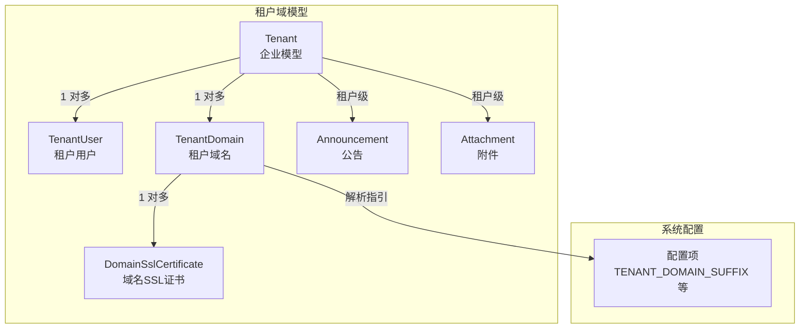
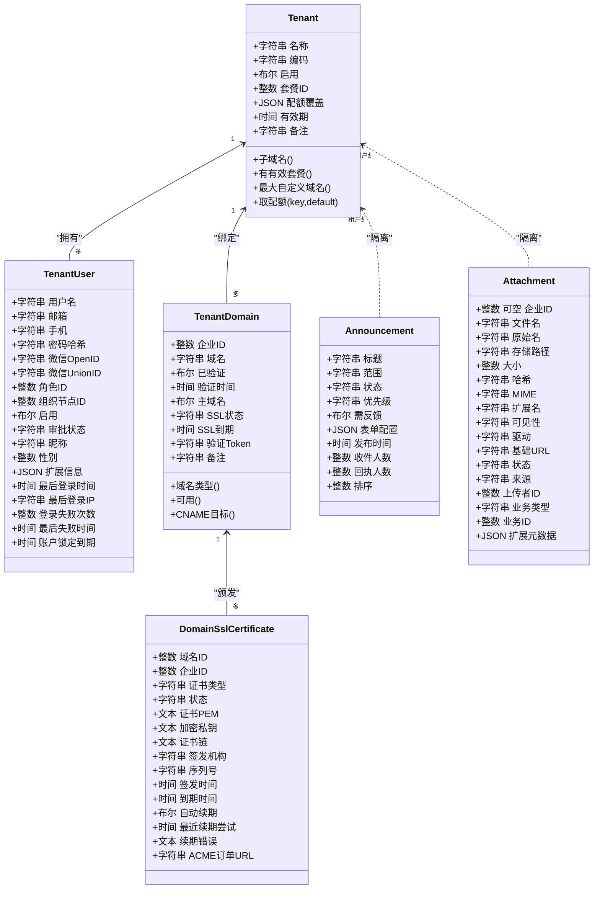
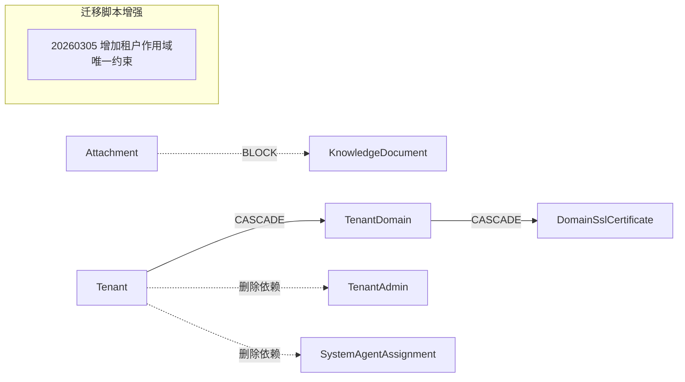

# 租户管理模型

<cite>
**本文引用的文件**
- [backend/app/models/tenant/tenant.py](file://backend/app/models/tenant/tenant.py)
- [backend/app/models/tenant/tenant_user.py](file://backend/app/models/tenant/tenant_user.py)
- [backend/app/models/tenant/tenant_domain.py](file://backend/app/models/tenant/tenant_domain.py)
- [backend/app/models/tenant/domain_ssl_certificate.py](file://backend/app/models/tenant/domain_ssl_certificate.py)
- [backend/app/models/tenant/announcement.py](file://backend/app/models/tenant/announcement.py)
- [backend/app/models/tenant/attachment.py](file://backend/app/models/tenant/attachment.py)
- [backend/migrations/versions/20260112_0002_tenant_domains.py](file://backend/migrations/versions/20260112_0002_tenant_domains.py)
- [backend/migrations/versions/20260220_27044bf9d269_add_domain_ssl_certificates_table.py](file://backend/migrations/versions/20260220_27044bf9d269_add_domain_ssl_certificates_table.py)
- [backend/migrations/versions/20260124_0007_add_attachments_table.py](file://backend/migrations/versions/20260124_0007_add_attachments_table.py)
- [backend/migrations/versions/20260305_add_tenant_scoped_unique_constraints.py](file://backend/migrations/versions/20260305_add_tenant_scoped_unique_constraints.py)
</cite>

## 目录
1. [简介](#简介)
2. [项目结构](#项目结构)
3. [核心组件](#核心组件)
4. [架构总览](#架构总览)
5. [详细组件分析](#详细组件分析)
6. [依赖分析](#依赖分析)
7. [性能考虑](#性能考虑)
8. [故障排查指南](#故障排查指南)
9. [结论](#结论)
10. [附录](#附录)

## 简介
本文件系统化梳理多租户 SaaS 平台中的租户管理模型，围绕以下实体展开：租户（Tenant）、租户用户（TenantUser）、租户域名（TenantDomain）、域名 SSL 证书（DomainSslCertificate）、公告（Announcement）、附件（Attachment）。文档重点阐述：
- 企业信息、配置参数与状态管理
- 用户身份、角色分配与权限体系
- 域名绑定、SSL 证书管理与访问控制
- 公告的消息推送与通知机制
- 附件的文件存储、访问权限与生命周期管理
- 租户级实体的多租户隔离机制与数据安全策略
- 实际应用场景与配置示例

## 项目结构
租户相关模型位于后端应用的租户域目录，配合迁移脚本完成数据库结构演进；同时在系统配置中对租户域后缀等参数进行集中管理。

图表来源
- [backend/app/models/tenant/tenant.py:18-260](file://backend/app/models/tenant/tenant.py#L18-L260)
- [backend/app/models/tenant/tenant_user.py:28-234](file://backend/app/models/tenant/tenant_user.py#L28-L234)
- [backend/app/models/tenant/tenant_domain.py:18-196](file://backend/app/models/tenant/tenant_domain.py#L18-L196)
- [backend/app/models/tenant/domain_ssl_certificate.py:17-206](file://backend/app/models/tenant/domain_ssl_certificate.py#L17-L206)
- [backend/app/models/tenant/announcement.py:28-132](file://backend/app/models/tenant/announcement.py#L28-L132)
- [backend/app/models/tenant/attachment.py:15-160](file://backend/app/models/tenant/attachment.py#L15-L160)

章节来源
- [backend/app/models/tenant/tenant.py:18-260](file://backend/app/models/tenant/tenant.py#L18-L260)
- [backend/app/models/tenant/tenant_user.py:28-234](file://backend/app/models/tenant/tenant_user.py#L28-L234)
- [backend/app/models/tenant/tenant_domain.py:18-196](file://backend/app/models/tenant/tenant_domain.py#L18-L196)
- [backend/app/models/tenant/domain_ssl_certificate.py:17-206](file://backend/app/models/tenant/domain_ssl_certificate.py#L17-L206)
- [backend/app/models/tenant/announcement.py:28-132](file://backend/app/models/tenant/announcement.py#L28-L132)
- [backend/app/models/tenant/attachment.py:15-160](file://backend/app/models/tenant/attachment.py#L15-L160)

## 核心组件
本节概览各模型的关键字段、关系与约束，帮助快速建立整体认知。

- 租户（Tenant）
  - 企业基本信息、联系人、状态开关、套餐外键、配额覆盖、有效期、备注
  - 关系：关联套餐、绑定域名集合
  - 辅助属性：子域名、是否拥有有效套餐、最大自定义域名数、按优先级取配额值
- 租户用户（TenantUser）
  - 用户身份（用户名/邮箱/手机/OpenID/UnionID）、认证与第三方登录、角色与组织节点、状态与审批、个人资料、扩展信息、登录审计与安全
  - 约束：同一租户内用户名/邮箱/手机号唯一
  - 关系：角色、组织节点
- 租户域名（TenantDomain）
  - 企业绑定的自定义域名、验证状态与时间、主域名标记、SSL 状态与到期、DNS TXT 验证令牌、备注
  - 关系：所属企业、SSL 证书集合
  - 约束：全局唯一域名；每企业仅一主域名
- 域名 SSL 证书（DomainSslCertificate）
  - 证书类型（平台/自定义）、状态、PEM 内容、加密私钥、证书链、签发机构与序列号、签发与到期时间、自动续期与错误记录、ACME 订单地址
  - 关系：所属域名与企业
  - 约束：每域名仅一个有效证书；按域+状态、到期时间、企业建立索引
- 公告（Announcement）
  - 标题、范围（平台/租户）、状态、优先级、是否需反馈、表单配置、发布时间、收件人数、回执人数、排序
  - 关系：投递记录、响应记录
  - 索引：范围+状态、租户+范围
- 附件（Attachment）
  - 文件名、原始名、存储路径、大小、哈希、MIME、扩展名、可见性、驱动、基础访问 URL、状态、来源、上传者、业务类型与 ID、扩展元数据
  - 约束：路径唯一；允许租户为空（管理端/全局知识库场景）
  - 删除依赖：被知识文档引用时阻断删除

章节来源
- [backend/app/models/tenant/tenant.py:18-260](file://backend/app/models/tenant/tenant.py#L18-L260)
- [backend/app/models/tenant/tenant_user.py:28-234](file://backend/app/models/tenant/tenant_user.py#L28-L234)
- [backend/app/models/tenant/tenant_domain.py:18-196](file://backend/app/models/tenant/tenant_domain.py#L18-L196)
- [backend/app/models/tenant/domain_ssl_certificate.py:17-206](file://backend/app/models/tenant/domain_ssl_certificate.py#L17-L206)
- [backend/app/models/tenant/announcement.py:28-132](file://backend/app/models/tenant/announcement.py#L28-L132)
- [backend/app/models/tenant/attachment.py:15-160](file://backend/app/models/tenant/attachment.py#L15-L160)

## 架构总览
租户管理模型以“租户”为核心，向下承载用户、域名、公告与附件等子域；域名与 SSL 证书形成闭环，确保 HTTPS 访问安全；附件作为通用资源，支持多业务场景并受租户隔离。

图表来源
- [backend/app/models/tenant/tenant.py:18-260](file://backend/app/models/tenant/tenant.py#L18-L260)
- [backend/app/models/tenant/tenant_user.py:28-234](file://backend/app/models/tenant/tenant_user.py#L28-L234)
- [backend/app/models/tenant/tenant_domain.py:18-196](file://backend/app/models/tenant/tenant_domain.py#L18-L196)
- [backend/app/models/tenant/domain_ssl_certificate.py:17-206](file://backend/app/models/tenant/domain_ssl_certificate.py#L17-L206)
- [backend/app/models/tenant/announcement.py:28-132](file://backend/app/models/tenant/announcement.py#L28-L132)
- [backend/app/models/tenant/attachment.py:15-160](file://backend/app/models/tenant/attachment.py#L15-L160)

## 详细组件分析

### 租户（Tenant）模型
- 企业信息与配置
  - 名称、编码（唯一索引）、联系人信息、启用状态、套餐外键、配额覆盖（JSON）、有效期、备注
  - 退役字段：套餐文本与设置 JSON，写入将被拒绝，应通过 plan_id 或配置服务迁移
- 状态与配额
  - 有效套餐判断：启用且未删除、存在套餐且套餐启用
  - 最大自定义域名数：优先取企业级配额，否则取套餐配额
  - 通用配额查询：优先企业级覆盖，其次套餐默认
- 关系与删除策略
  - 关联套餐：按需加载
  - 域名集合：按需加载，支持软删除级联
  - 管理员存在时阻止删除，系统代理分配级联删除

章节来源
- [backend/app/models/tenant/tenant.py:18-260](file://backend/app/models/tenant/tenant.py#L18-L260)

### 租户用户（TenantUser）模型
- 身份与凭证
  - 用户名、邮箱、手机、密码哈希、微信 OpenID/UnionID
  - 唯一性：同一租户内用户名/邮箱/手机号唯一
- 角色与组织
  - 角色 ID（外键）、组织节点 ID（外键），支持按需加载
- 状态与审批
  - 启用状态、审批状态（待审/已审/已拒）
- 个人资料与登录审计
  - 昵称、头像附件 ID、性别、扩展 JSON
  - 最后登录时间与 IP、登录失败次数与锁定到期时间
- 关系
  - 角色、组织节点

章节来源
- [backend/app/models/tenant/tenant_user.py:28-234](file://backend/app/models/tenant/tenant_user.py#L28-L234)

### 租户域名（TenantDomain）模型
- 基本属性
  - 企业 ID（外键，级联删除）、域名（全局唯一、索引）、验证状态与时间、主域名标记
  - SSL 状态（枚举）、到期时间、DNS TXT 验证 Token、备注
- 关系与约束
  - 关联企业与 SSL 证书集合
  - 复合索引：企业 + 主域名，保证每企业仅一主域名
- 辅助属性
  - 域名类型：基于平台后缀判定默认/自定义
  - 可用状态：已验证且 SSL 状态为有效
  - CNAME 目标：企业子域名（编码 + 平台后缀）

章节来源
- [backend/app/models/tenant/tenant_domain.py:18-196](file://backend/app/models/tenant/tenant_domain.py#L18-L196)

### 域名 SSL 证书（DomainSslCertificate）模型
- 证书类型与状态
  - 类型：平台（ACME 自动签发）/ 自定义（用户上传）
  - 状态：待处理/有效/已过期/已吊销/失败
- 证书内容与元信息
  - PEM 证书、加密私钥、证书链
  - 签发机构、序列号、签发与到期时间
- 续期与 ACME
  - 自动续期开关、最近续期尝试时间、续期错误原因
  - ACME 订单 URL（异步轮询）
- 关系与索引
  - 关联域名与企业
  - 索引：域+状态、到期时间、企业

章节来源
- [backend/app/models/tenant/domain_ssl_certificate.py:17-206](file://backend/app/models/tenant/domain_ssl_certificate.py#L17-L206)

### 公告（Announcement）模型
- 信息与状态
  - 标题、范围（admin/tenant）、状态（草稿/发布等）、优先级、是否需反馈
  - 表单配置（JSONB）、发布时间、收件人数、回执人数、排序
- 关系
  - 投递记录、响应记录（按需加载）
- 索引
  - 范围+状态、租户+范围，优化查询与展示

章节来源
- [backend/app/models/tenant/announcement.py:28-132](file://backend/app/models/tenant/announcement.py#L28-L132)

### 附件（Attachment）模型
- 元数据与访问
  - 文件名、原始名、存储路径（唯一索引）、大小、哈希、MIME、扩展名
  - 可见性（默认私有）、存储驱动、基础访问 URL、状态、来源
  - 上传者、业务类型与 ID、扩展元数据
- 租户隔离
  - 允许租户 ID 为空，用于管理端/全局知识库场景
- 生命周期与依赖
  - 被知识文档引用时阻止删除，避免悬挂资源

章节来源
- [backend/app/models/tenant/attachment.py:15-160](file://backend/app/models/tenant/attachment.py#L15-L160)

## 依赖分析
- 多租户隔离
  - 所有租户域模型均继承租户基类，天然具备租户 ID 字段与查询上下文
  - 迁移脚本新增租户作用域唯一约束，强化隔离
- 删除依赖
  - 租户删除前需清理管理员与域名；域名删除前需清理 SSL 证书
  - 附件删除前需检查是否被知识文档引用
- 外键与索引
  - 域名与证书建立外键约束，保障引用完整性
  - 公告与附件建立复合索引，提升查询效率

图表来源
- [backend/app/models/tenant/tenant.py:28-50](file://backend/app/models/tenant/tenant.py#L28-L50)
- [backend/app/models/tenant/tenant_domain.py:29-37](file://backend/app/models/tenant/tenant_domain.py#L29-L37)
- [backend/app/models/tenant/attachment.py:18-26](file://backend/app/models/tenant/attachment.py#L18-L26)
- [backend/migrations/versions/20260305_add_tenant_scoped_unique_constraints.py](file://backend/migrations/versions/20260305_add_tenant_scoped_unique_constraints.py)

章节来源
- [backend/app/models/tenant/tenant.py:28-50](file://backend/app/models/tenant/tenant.py#L28-L50)
- [backend/app/models/tenant/tenant_domain.py:29-37](file://backend/app/models/tenant/tenant_domain.py#L29-L37)
- [backend/app/models/tenant/attachment.py:18-26](file://backend/app/models/tenant/attachment.py#L18-L26)
- [backend/migrations/versions/20260305_add_tenant_scoped_unique_constraints.py](file://backend/migrations/versions/20260305_add_tenant_scoped_unique_constraints.py)

## 性能考虑
- 查询优化
  - 公告：范围+状态、租户+范围索引，减少扫描
  - 附件：路径唯一索引与租户+哈希组合索引，加速去重与定位
  - 域名：企业+主域名复合索引，快速定位主域名
- 关系加载
  - 使用按需加载策略（selectin/noload）降低 N+1 查询风险
- 数据分页与过滤
  - 模型内置可过滤/可排序字段清单，便于前端分页与筛选

## 故障排查指南
- 域名无法启用
  - 检查验证状态与 SSL 状态是否均为有效
  - 确认 DNS CNAME 指向正确（企业子域名 + 平台后缀）
- SSL 证书问题
  - 平台证书：确认自动续期开关与最近续期尝试时间
  - 自定义证书：确认 PEM 内容与证书链完整
- 附件访问异常
  - 检查可见性与基础 URL 配置
  - 确认存储驱动与路径唯一性
- 删除失败
  - 租户：先清理管理员与域名
  - 域名：先清理 SSL 证书
  - 附件：先解除知识文档引用

章节来源
- [backend/app/models/tenant/tenant_domain.py:163-192](file://backend/app/models/tenant/tenant_domain.py#L163-L192)
- [backend/app/models/tenant/domain_ssl_certificate.py:179-202](file://backend/app/models/tenant/domain_ssl_certificate.py#L179-L202)
- [backend/app/models/tenant/attachment.py:18-26](file://backend/app/models/tenant/attachment.py#L18-L26)

## 结论
该租户管理模型以“租户”为中心，通过清晰的实体边界、严格的外键与索引约束、以及完善的删除依赖策略，实现了强隔离与高可用。域名与 SSL 证书闭环保障了 HTTPS 访问的安全性；公告与附件模块则满足了消息推送与文件管理的多样化需求。配合迁移脚本的租户作用域唯一约束，进一步提升了数据一致性与安全性。

## 附录

### 数据库结构演进要点
- 域名表初始化：创建租户域名表，支持企业绑定自定义域名
- SSL 证书表初始化：创建域名 SSL 证书表，支持平台自动签发与自定义上传
- 附件表初始化：创建附件表，支持多存储驱动与可见性控制
- 租户作用域唯一约束：为多租户场景增加唯一性约束，防止跨租户冲突

章节来源
- [backend/migrations/versions/20260112_0002_tenant_domains.py](file://backend/migrations/versions/20260112_0002_tenant_domains.py)
- [backend/migrations/versions/20260220_27044bf9d269_add_domain_ssl_certificates_table.py](file://backend/migrations/versions/20260220_27044bf9d269_add_domain_ssl_certificates_table.py)
- [backend/migrations/versions/20260124_0007_add_attachments_table.py](file://backend/migrations/versions/20260124_0007_add_attachments_table.py)
- [backend/migrations/versions/20260305_add_tenant_scoped_unique_constraints.py](file://backend/migrations/versions/20260305_add_tenant_scoped_unique_constraints.py)