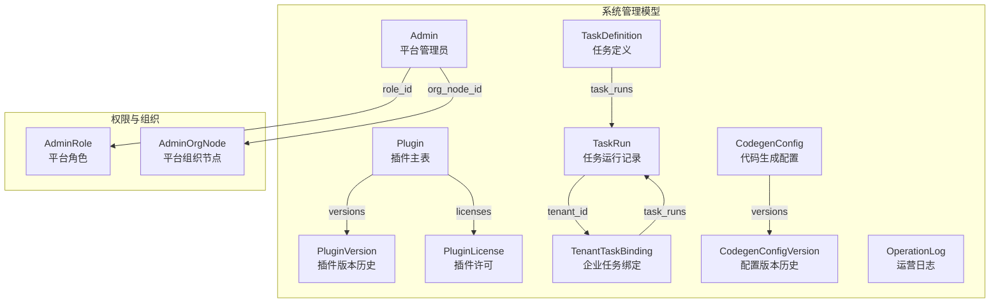
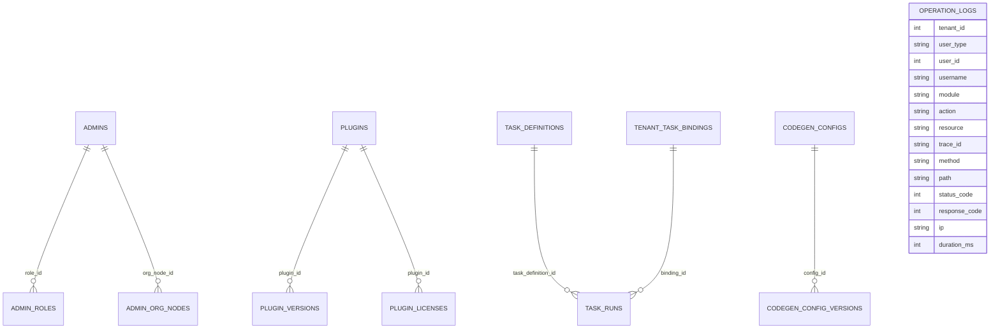
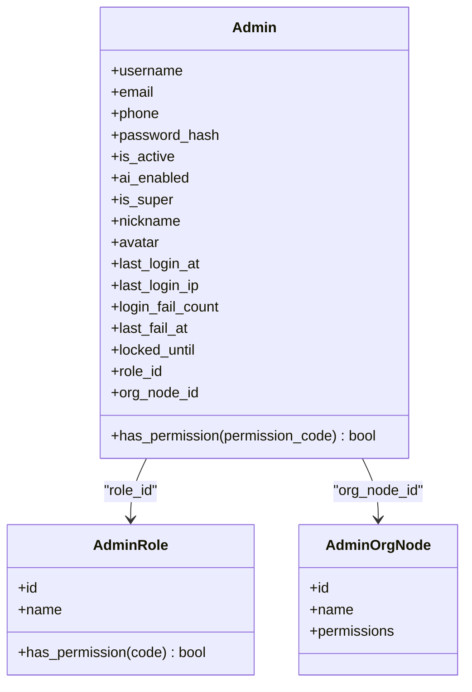
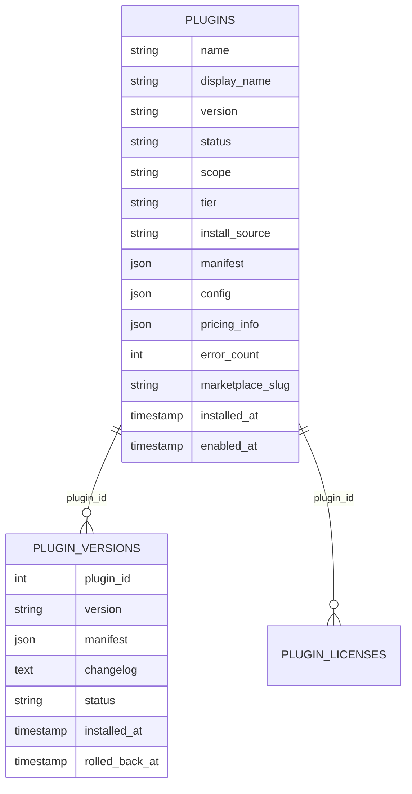
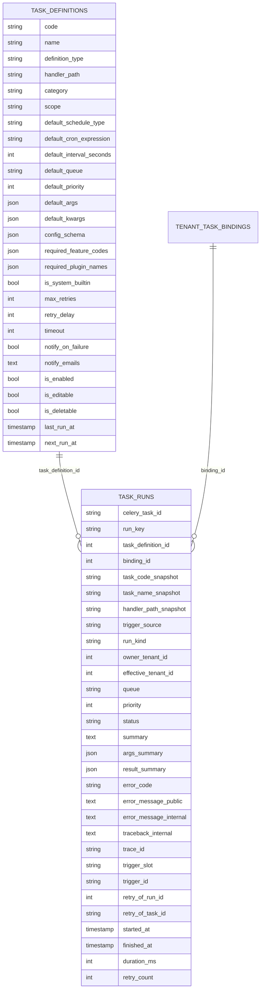
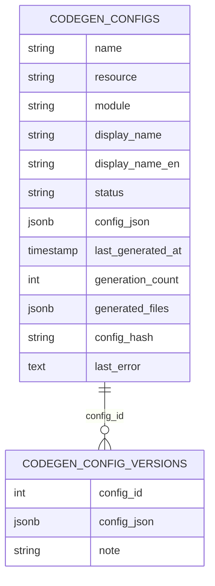
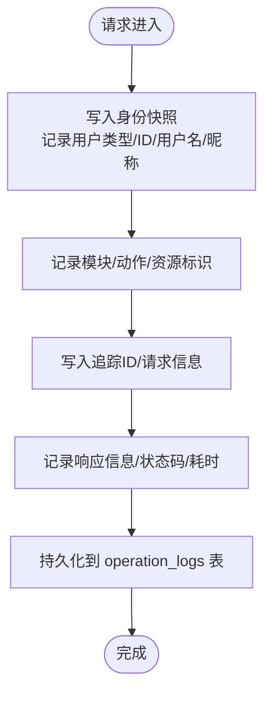
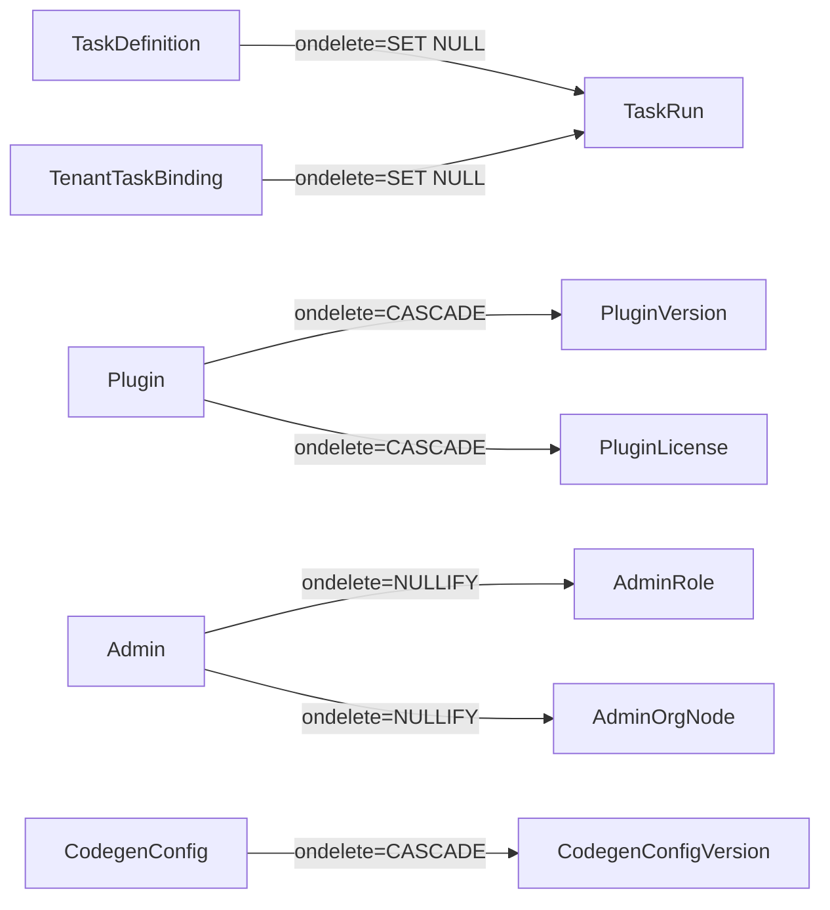

# 系统管理模型

<cite>
**本文引用的文件**
- [backend/app/models/system/admin.py](file://backend/app/models/system/admin.py)
- [backend/app/models/auth/admin_role.py](file://backend/app/models/auth/admin_role.py)
- [backend/app/models/org/admin_org_node.py](file://backend/app/models/org/admin_org_node.py)
- [backend/app/models/system/plugin.py](file://backend/app/models/system/plugin.py)
- [backend/app/models/system/plugin_version.py](file://backend/app/models/system/plugin_version.py)
- [backend/app/models/system/plugin_license.py](file://backend/app/models/system/plugin_license.py)
- [backend/app/models/system/task_definition.py](file://backend/app/models/system/task_definition.py)
- [backend/app/models/system/task_run.py](file://backend/app/models/system/task_run.py)
- [backend/app/models/system/tenant_task_binding.py](file://backend/app/models/system/tenant_task_binding.py)
- [backend/app/models/system/codegen_config.py](file://backend/app/models/system/codegen_config.py)
- [backend/app/models/system/codegen_config_version.py](file://backend/app/models/system/codegen_config_version.py)
- [backend/app/models/system/operation_log.py](file://backend/app/models/system/operation_log.py)
- [backend/app/enums/task.py](file://backend/app/enums/task.py)
- [backend/app/enums/common.py](file://backend/app/enums/common.py)
- [backend/app/enums/codegen.py](file://backend/app/enums/codegen.py)
- [backend/migrations/versions/20260317_0001_add_codegen_config_versions.py](file://backend/migrations/versions/20260317_0001_add_codegen_config_versions.py)
- [backend/migrations/versions/20260317_add_codegen_configs_table.py](file://backend/migrations/versions/20260317_add_codegen_configs_table.py)
- [backend/migrations/versions/20260208_0009_add_task_logs_table.py](file://backend/migrations/versions/20260208_0009_add_task_logs_table.py)
- [backend/migrations/versions/20260208_0010_add_periodic_tasks_table.py](file://backend/migrations/versions/20260208_0010_add_periodic_tasks_table.py)
- [backend/migrations/versions/20260325_0001_ai_action_log_actor_resource_scope.py](file://backend/migrations/versions/20260325_0001_ai_action_log_actor_resource_scope.py)
- [backend/migrations/versions/20260325_0002_task_scheduling_foundation.py](file://backend/migrations/versions/20260325_0002_task_scheduling_foundation.py)
- [backend/migrations/versions/20260325_0003_task_definition_operational_fields.py](file://backend/migrations/versions/20260325_0003_task_definition_operational_fields.py)
- [backend/migrations/versions/20260325_0004_backfill_task_definitions_from_periodic_tasks.py](file://backend/migrations/versions/20260325_0004_backfill_task_definitions_from_periodic_tasks.py)
- [backend/migrations/versions/20260325_0005_drop_legacy_task_tables.py](file://backend/migrations/versions/20260325_0005_drop_legacy_task_tables.py)
- [backend/migrations/versions/20260120_c63b0c9f4a25_add_operation_log_table.py](file://backend/migrations/versions/20260120_c63b0c9f4a25_add_operation_log_table.py)
- [backend/migrations/versions/20260213_add_plugins_tables.py](file://backend/migrations/versions/20260213_add_plugins_tables.py)
- [backend/migrations/versions/20260223_d11f0b4fec39_add_plugin_tables.py](file://backend/migrations/versions/20260223_d11f0b4fec39_add_plugin_tables.py)
- [backend/migrations/versions/20260221_0e818abf253a_add_skill_call_logs_table.py](file://backend/migrations/versions/20260221_0e818abf253a_add_skill_call_logs_table.py)
</cite>

## 目录
1. [简介](#简介)
2. [项目结构](#项目结构)
3. [核心组件](#核心组件)
4. [架构总览](#架构总览)
5. [详细组件分析](#详细组件分析)
6. [依赖分析](#依赖分析)
7. [性能考虑](#性能考虑)
8. [故障排查指南](#故障排查指南)
9. [结论](#结论)
10. [附录](#附录)

## 简介
本文件面向系统管理员与后端开发者，系统性梳理平台级系统管理模型，包括管理员身份与权限、插件元数据与生命周期、任务定义与运行、代码生成配置、以及运营日志与审计。文档通过数据模型、实体关系、约束与索引、以及迁移演进，帮助读者建立对系统管理能力的完整认知，并提供最佳实践与使用示例。

## 项目结构
系统管理相关模型主要位于 backend/app/models/system 与 backend/app/models/auth、backend/app/models/org 下，配合枚举与迁移版本共同构成完整的数据层。

图表来源
- [backend/app/models/system/admin.py:18-196](file://backend/app/models/system/admin.py#L18-L196)
- [backend/app/models/auth/admin_role.py](file://backend/app/models/auth/admin_role.py)
- [backend/app/models/org/admin_org_node.py](file://backend/app/models/org/admin_org_node.py)
- [backend/app/models/system/plugin.py:14-253](file://backend/app/models/system/plugin.py#L14-L253)
- [backend/app/models/system/plugin_version.py:13-69](file://backend/app/models/system/plugin_version.py#L13-L69)
- [backend/app/models/system/plugin_license.py](file://backend/app/models/system/plugin_license.py)
- [backend/app/models/system/task_definition.py:19-250](file://backend/app/models/system/task_definition.py#L19-L250)
- [backend/app/models/system/task_run.py:18-268](file://backend/app/models/system/task_run.py#L18-L268)
- [backend/app/models/system/tenant_task_binding.py](file://backend/app/models/system/tenant_task_binding.py)
- [backend/app/models/system/codegen_config.py:19-132](file://backend/app/models/system/codegen_config.py#L19-L132)
- [backend/app/models/system/codegen_config_version.py:15-55](file://backend/app/models/system/codegen_config_version.py#L15-L55)
- [backend/app/models/system/operation_log.py:14-193](file://backend/app/models/system/operation_log.py#L14-L193)

章节来源
- [backend/app/models/system/admin.py:18-196](file://backend/app/models/system/admin.py#L18-L196)
- [backend/app/models/system/plugin.py:14-253](file://backend/app/models/system/plugin.py#L14-L253)
- [backend/app/models/system/task_definition.py:19-250](file://backend/app/models/system/task_definition.py#L19-L250)
- [backend/app/models/system/task_run.py:18-268](file://backend/app/models/system/task_run.py#L18-L268)
- [backend/app/models/system/codegen_config.py:19-132](file://backend/app/models/system/codegen_config.py#L19-L132)
- [backend/app/models/system/operation_log.py:14-193](file://backend/app/models/system/operation_log.py#L14-L193)

## 核心组件
- 管理员（Admin）：平台级超级管理员实体，独立于租户体系，具备身份、认证、状态、登录审计、角色与组织节点关联，以及权限检查逻辑。
- 插件（Plugin）：插件主表，承载元数据、外观、来源、分类与状态、配置、定价、健康监控、依赖与能力授权、时间戳等；通过版本与许可表进行版本控制与生命周期管理。
- 任务定义（TaskDefinition）：下一代任务调度架构的目录层，描述“是什么任务”，包含默认调度策略、队列与优先级、重试与超时、启用/可编辑/可删除标记、以及计划执行时间等。
- 任务运行（TaskRun）：统一运行中心的事实表，记录单次执行、与定义/绑定/触发来源的关系、状态与摘要、错误信息、链路追踪、重试来源、耗时等。
- 代码生成配置（CodegenConfig）：平台级配置，存储解析后的完整配置 JSON，支持状态管理、生成计数、文件清单、变更检测与版本历史。
- 运营日志（OperationLog）：记录所有 API 调用的审计日志，支持平台与企业端操作区分、用户身份快照、模块与动作、请求/响应信息、性能指标与追踪 ID。

章节来源
- [backend/app/models/system/admin.py:18-196](file://backend/app/models/system/admin.py#L18-L196)
- [backend/app/models/system/plugin.py:14-253](file://backend/app/models/system/plugin.py#L14-L253)
- [backend/app/models/system/task_definition.py:19-250](file://backend/app/models/system/task_definition.py#L19-L250)
- [backend/app/models/system/task_run.py:18-268](file://backend/app/models/system/task_run.py#L18-L268)
- [backend/app/models/system/codegen_config.py:19-132](file://backend/app/models/system/codegen_config.py#L19-L132)
- [backend/app/models/system/operation_log.py:14-193](file://backend/app/models/system/operation_log.py#L14-L193)

## 架构总览
系统管理模型围绕“身份与权限”“插件生态”“任务调度与执行”“配置与版本”“审计与追踪”五大维度构建，通过外键、索引与约束确保跨实体的一致性与可扩展性。

图表来源
- [backend/app/models/system/admin.py:18-196](file://backend/app/models/system/admin.py#L18-L196)
- [backend/app/models/system/plugin.py:14-253](file://backend/app/models/system/plugin.py#L14-L253)
- [backend/app/models/system/plugin_version.py:13-69](file://backend/app/models/system/plugin_version.py#L13-L69)
- [backend/app/models/system/plugin_license.py](file://backend/app/models/system/plugin_license.py)
- [backend/app/models/system/task_definition.py:19-250](file://backend/app/models/system/task_definition.py#L19-L250)
- [backend/app/models/system/task_run.py:18-268](file://backend/app/models/system/task_run.py#L18-L268)
- [backend/app/models/system/tenant_task_binding.py](file://backend/app/models/system/tenant_task_binding.py)
- [backend/app/models/system/codegen_config.py:19-132](file://backend/app/models/system/codegen_config.py#L19-L132)
- [backend/app/models/system/codegen_config_version.py:15-55](file://backend/app/models/system/codegen_config_version.py#L15-L55)
- [backend/app/models/system/operation_log.py:14-193](file://backend/app/models/system/operation_log.py#L14-L193)

## 详细组件分析

### 管理员（Admin）模型
- 身份与认证
  - 唯一标识：用户名、邮箱、手机号（均唯一且带索引），密码哈希存储。
  - 状态标志：是否激活、是否允许 AI 对话、是否超级管理员。
  - 个人资料：昵称、头像附件 ID。
  - 登录审计：最后登录时间与 IP、登录失败计数与锁定时间。
- 角色与组织
  - 平台角色关联（role_id → AdminRole）与组织节点关联（org_node_id → AdminOrgNode），支持按组织节点聚合权限。
- 权限检查
  - 超级管理员拥有全部权限；否则按组织节点权限集合与角色权限逐级判定。
- 删除策略
  - 当删除管理员时，其作为领导者的角色与组织节点领导职位被置空，避免孤立引用。

图表来源
- [backend/app/models/system/admin.py:18-196](file://backend/app/models/system/admin.py#L18-L196)
- [backend/app/models/auth/admin_role.py](file://backend/app/models/auth/admin_role.py)
- [backend/app/models/org/admin_org_node.py](file://backend/app/models/org/admin_org_node.py)

章节来源
- [backend/app/models/system/admin.py:18-196](file://backend/app/models/system/admin.py#L18-L196)

### 插件（Plugin）模型
- 元数据管理
  - 唯一标识与显示名、描述、作者；外观字段（图标、颜色）；来源（主页、仓库、许可证文本、标签）。
- 版本控制与生命周期
  - 主表维护当前版本与状态（installed/active/disabled/deleted 等），通过版本历史表记录清单、变更日志与安装/回退时间。
  - 删除策略：删除插件时级联删除其版本与许可，保障生命周期完整性。
- 配置与能力
  - 清单（manifest）、全局配置（config）、AI 需求；定价类型与详情；健康监控（错误消息与计数）；已安装依赖与管理员授权能力列表。
- 生命周期状态
  - 状态字段与信任等级（tier）、安装来源（本地/市场）、市场标识；时间戳（安装、启用）。

图表来源
- [backend/app/models/system/plugin.py:14-253](file://backend/app/models/system/plugin.py#L14-L253)
- [backend/app/models/system/plugin_version.py:13-69](file://backend/app/models/system/plugin_version.py#L13-L69)
- [backend/app/models/system/plugin_license.py](file://backend/app/models/system/plugin_license.py)

章节来源
- [backend/app/models/system/plugin.py:14-253](file://backend/app/models/system/plugin.py#L14-L253)
- [backend/app/models/system/plugin_version.py:13-69](file://backend/app/models/system/plugin_version.py#L13-L69)

### 任务定义（TaskDefinition）与任务运行（TaskRun）
- 任务定义（TaskDefinition）
  - 描述“是什么任务”，不直接表达企业启停或执行结果。
  - 关键字段：唯一编码（code）、名称、定义类型、处理器路径、分类、描述、资源范围、默认调度类型与表达式/间隔、默认队列与优先级、默认参数、配置 Schema、所需特性与可见插件、系统内置标记、重试与超时、失败通知与邮箱、启用/可编辑/可删除标记、最后/下次执行时间。
  - 约束与索引：默认优先级范围校验、唯一索引（code）、复合索引（scope+type、owner_tenant_id+is_enabled、default_priority）。
- 任务运行（TaskRun）
  - 统一运行中心的事实表，记录单次执行与定义、企业绑定、触发来源的关系。
  - 关键字段：Celery 任务 ID、业务运行幂等键、任务定义快照（编码/名称/处理器）、触发来源与运行类型、资源归属与影响企业、队列与优先级、状态、摘要与错误信息、链路追踪、重试来源、开始/结束时间与耗时、重试次数。
  - 索引：Celery 任务 ID 唯一索引、run_key 唯一索引、定义+状态、影响企业+创建时间、触发来源+类型+创建时间、定义+触发槽位、重试来源运行 ID。

图表来源
- [backend/app/models/system/task_definition.py:19-250](file://backend/app/models/system/task_definition.py#L19-L250)
- [backend/app/models/system/task_run.py:18-268](file://backend/app/models/system/task_run.py#L18-L268)
- [backend/app/models/system/tenant_task_binding.py](file://backend/app/models/system/tenant_task_binding.py)
- [backend/app/enums/task.py](file://backend/app/enums/task.py)
- [backend/app/enums/common.py](file://backend/app/enums/common.py)

章节来源
- [backend/app/models/system/task_definition.py:19-250](file://backend/app/models/system/task_definition.py#L19-L250)
- [backend/app/models/system/task_run.py:18-268](file://backend/app/models/system/task_run.py#L18-L268)

### 代码生成配置（CodegenConfig）模型
- 配置管理
  - 平台级资源，无企业隔离；存储解析后的完整配置 JSON（config_json），支持状态（草稿/生成/应用/回滚）与变更检测（config_hash）。
  - 资源名（snake_case）唯一索引，便于检索与去重。
- 版本控制
  - 每次保存配置时创建版本记录（CodegenConfigVersion），存储 config_json 快照与备注，支持历史回溯与恢复。
- 生成与审计
  - 记录上次生成时间、生成次数、生成文件清单、上次生成错误信息，便于生成流程的可观测性与排障。

图表来源
- [backend/app/models/system/codegen_config.py:19-132](file://backend/app/models/system/codegen_config.py#L19-L132)
- [backend/app/models/system/codegen_config_version.py:15-55](file://backend/app/models/system/codegen_config_version.py#L15-L55)
- [backend/app/enums/codegen.py](file://backend/app/enums/codegen.py)

章节来源
- [backend/app/models/system/codegen_config.py:19-132](file://backend/app/models/system/codegen_config.py#L19-L132)
- [backend/app/models/system/codegen_config_version.py:15-55](file://backend/app/models/system/codegen_config_version.py#L15-L55)

### 运营日志（OperationLog）模型
- 日志记录
  - 支持平台端与企业端操作（tenant_id 为空/非空），记录用户类型与 ID、用户名与昵称、身份快照（避免历史展示漂移）。
- 审计功能
  - 模块与动作（如 create/update/delete/query/login/logout/export/import），资源标识（权限代码），请求/响应信息（方法、路径、查询参数、请求体摘要、状态码、业务响应码、消息）。
- 追踪与性能
  - 请求追踪 ID（trace_id）、客户端 IP 与 User-Agent、请求耗时（毫秒）。
- 索引设计
  - 企业+时间、用户类型+用户 ID、模块+动作，优化查询与统计。

图表来源
- [backend/app/models/system/operation_log.py:14-193](file://backend/app/models/system/operation_log.py#L14-L193)

章节来源
- [backend/app/models/system/operation_log.py:14-193](file://backend/app/models/system/operation_log.py#L14-L193)

## 依赖分析
- 外键与级联
  - 插件删除级联删除版本与许可；管理员删除对其角色与组织节点领导职位置空；任务运行可对定义/绑定/重试来源设置 SET NULL。
- 约束与索引
  - 任务定义默认优先级范围校验；插件名称唯一索引（未删除条件下）；任务运行多维唯一与复合索引；代码生成配置资源名唯一索引。
- 枚举与范围
  - 任务类型、状态、触发来源、运行类型；通用资源范围；代码生成状态；用于约束与查询的标准化值域。

图表来源
- [backend/app/models/system/task_definition.py:19-250](file://backend/app/models/system/task_definition.py#L19-L250)
- [backend/app/models/system/task_run.py:18-268](file://backend/app/models/system/task_run.py#L18-L268)
- [backend/app/models/system/plugin.py:14-253](file://backend/app/models/system/plugin.py#L14-L253)
- [backend/app/models/system/plugin_version.py:13-69](file://backend/app/models/system/plugin_version.py#L13-L69)
- [backend/app/models/system/admin.py:18-196](file://backend/app/models/system/admin.py#L18-L196)
- [backend/app/models/system/codegen_config.py:19-132](file://backend/app/models/system/codegen_config.py#L19-L132)
- [backend/app/models/system/codegen_config_version.py:15-55](file://backend/app/models/system/codegen_config_version.py#L15-L55)

章节来源
- [backend/app/models/system/task_definition.py:19-250](file://backend/app/models/system/task_definition.py#L19-L250)
- [backend/app/models/system/task_run.py:18-268](file://backend/app/models/system/task_run.py#L18-L268)
- [backend/app/models/system/plugin.py:14-253](file://backend/app/models/system/plugin.py#L14-L253)
- [backend/app/models/system/plugin_version.py:13-69](file://backend/app/models/system/plugin_version.py#L13-L69)
- [backend/app/models/system/admin.py:18-196](file://backend/app/models/system/admin.py#L18-L196)
- [backend/app/models/system/codegen_config.py:19-132](file://backend/app/models/system/codegen_config.py#L19-L132)
- [backend/app/models/system/codegen_config_version.py:15-55](file://backend/app/models/system/codegen_config_version.py#L15-L55)

## 性能考虑
- 索引优化
  - 在高频过滤/排序字段上建立索引（如插件名称、任务定义 code、任务运行 celery_task_id/run_key/定义+状态/企业+时间等），降低查询成本。
- 关系加载
  - 使用惰性加载或按需加载（如 noload），减少不必要的 ORM 关联查询，提升批量读取性能。
- 数据类型选择
  - JSON/JSONB 用于灵活配置与清单存储；大文本字段（Text）用于错误堆栈与长描述；时间戳字段统一时区以避免比较开销。
- 批处理与幂等
  - 任务运行的幂等键（run_key）与唯一索引，避免重复执行；合理设置重试延迟与最大重试次数，平衡可靠性与资源占用。

## 故障排查指南
- 管理员登录失败与锁定
  - 检查登录失败计数与最后失败时间、锁定到期时间；确认是否被临时锁定；必要时重置安全计数。
- 插件健康问题
  - 查看错误消息与连续错误计数；核对清单与依赖包；检查安装/启用时间；必要时回退到上一个有效版本。
- 任务执行异常
  - 通过任务运行记录的状态、错误代码/消息、内部堆栈与链路追踪 ID 定位问题；结合任务定义的重试策略与超时设置评估。
- 代码生成失败
  - 查看上次生成错误信息与生成文件清单；比对配置哈希与最新变更；回滚到上一个稳定版本。
- 审计与追踪
  - 使用 trace_id 关联日志、审计与任务；按模块/动作/用户类型/企业维度筛选定位问题。

章节来源
- [backend/app/models/system/admin.py:18-196](file://backend/app/models/system/admin.py#L18-L196)
- [backend/app/models/system/plugin.py:14-253](file://backend/app/models/system/plugin.py#L14-L253)
- [backend/app/models/system/task_run.py:18-268](file://backend/app/models/system/task_run.py#L18-L268)
- [backend/app/models/system/codegen_config.py:19-132](file://backend/app/models/system/codegen_config.py#L19-L132)
- [backend/app/models/system/operation_log.py:14-193](file://backend/app/models/system/operation_log.py#L14-L193)

## 结论
系统管理模型通过清晰的实体边界、强一致的外键与约束、完善的索引与枚举，支撑平台级管理员、插件生态、任务调度、配置版本与审计追踪等核心能力。遵循本文的最佳实践与排障建议，可在保证数据一致性的同时，获得良好的可观测性与可维护性。

## 附录
- 迁移演进要点
  - 代码生成配置表与版本表：新增平台级配置与版本历史，支持变更检测与回滚。
  - 任务调度基础与迁移：引入任务定义与运行表，逐步替换旧的周期任务表，保留迁移脚本与回填逻辑。
  - 插件表：分阶段引入插件主表与版本/许可表，完善插件生命周期管理。
  - 运营日志：新增表结构与索引，支持平台与企业端操作审计。

章节来源
- [backend/migrations/versions/20260317_0001_add_codegen_config_versions.py](file://backend/migrations/versions/20260317_0001_add_codegen_config_versions.py)
- [backend/migrations/versions/20260317_add_codegen_configs_table.py](file://backend/migrations/versions/20260317_add_codegen_configs_table.py)
- [backend/migrations/versions/20260208_0009_add_task_logs_table.py](file://backend/migrations/versions/20260208_0009_add_task_logs_table.py)
- [backend/migrations/versions/20260208_0010_add_periodic_tasks_table.py](file://backend/migrations/versions/20260208_0010_add_periodic_tasks_table.py)
- [backend/migrations/versions/20260325_0002_task_scheduling_foundation.py](file://backend/migrations/versions/20260325_0002_task_scheduling_foundation.py)
- [backend/migrations/versions/20260325_0003_task_definition_operational_fields.py](file://backend/migrations/versions/20260325_0003_task_definition_operational_fields.py)
- [backend/migrations/versions/20260325_0004_backfill_task_definitions_from_periodic_tasks.py](file://backend/migrations/versions/20260325_0004_backfill_task_definitions_from_periodic_tasks.py)
- [backend/migrations/versions/20260325_0005_drop_legacy_task_tables.py](file://backend/migrations/versions/20260325_0005_drop_legacy_task_tables.py)
- [backend/migrations/versions/20260120_c63b0c9f4a25_add_operation_log_table.py](file://backend/migrations/versions/20260120_c63b0c9f4a25_add_operation_log_table.py)
- [backend/migrations/versions/20260213_add_plugins_tables.py](file://backend/migrations/versions/20260213_add_plugins_tables.py)
- [backend/migrations/versions/20260223_d11f0b4fec39_add_plugin_tables.py](file://backend/migrations/versions/20260223_d11f0b4fec39_add_plugin_tables.py)
- [backend/migrations/versions/20260221_0e818abf253a_add_skill_call_logs_table.py](file://backend/migrations/versions/20260221_0e818abf253a_add_skill_call_logs_table.py)