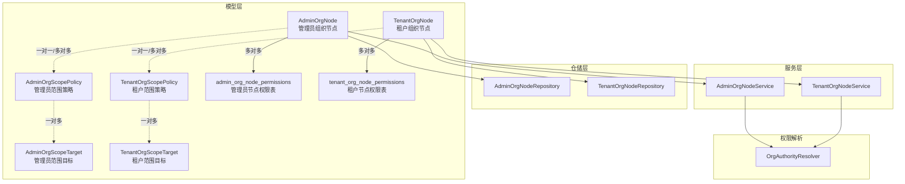
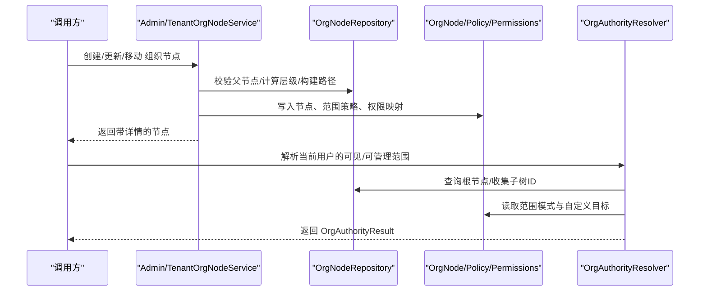
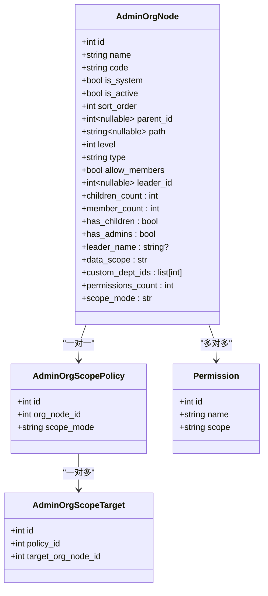
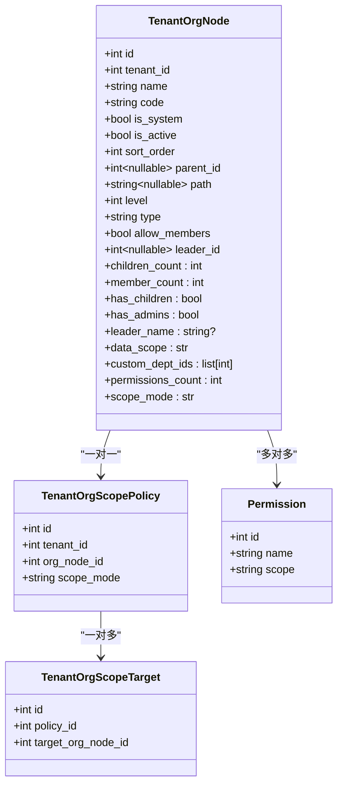
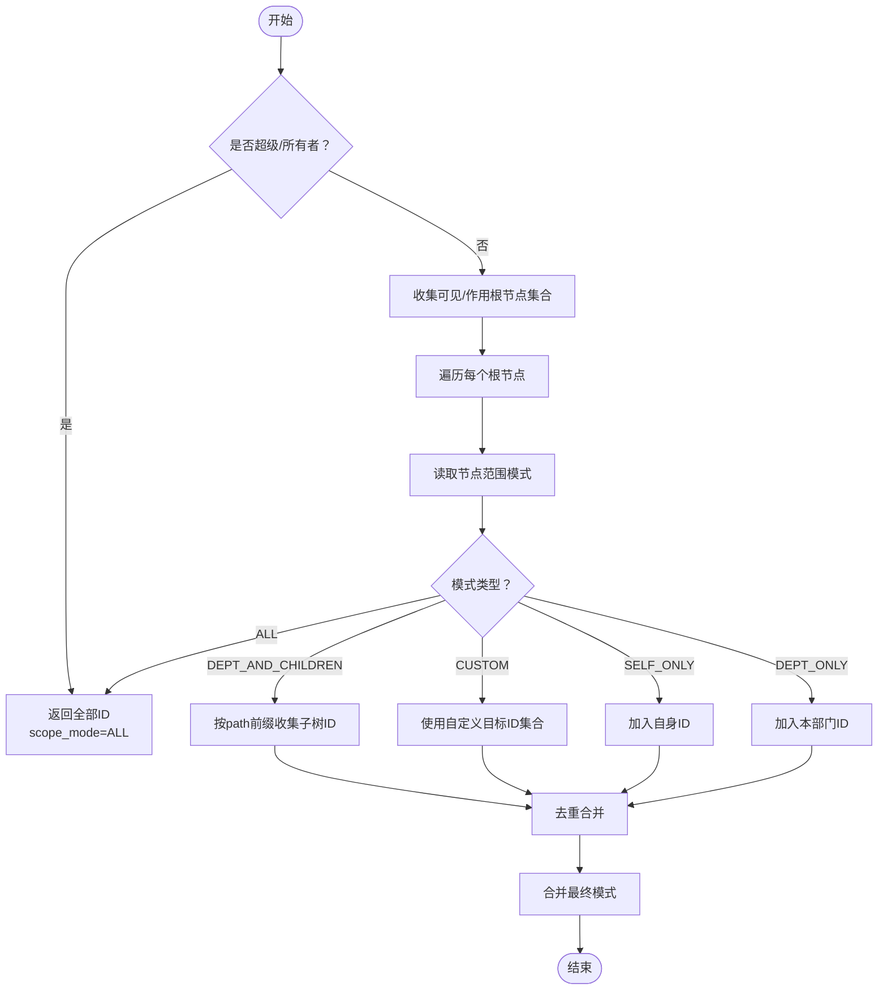
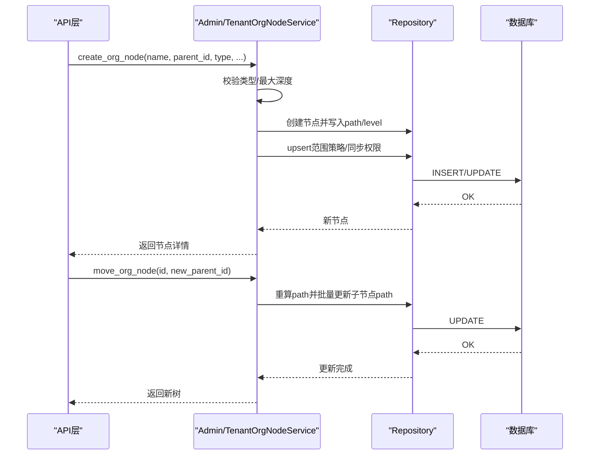
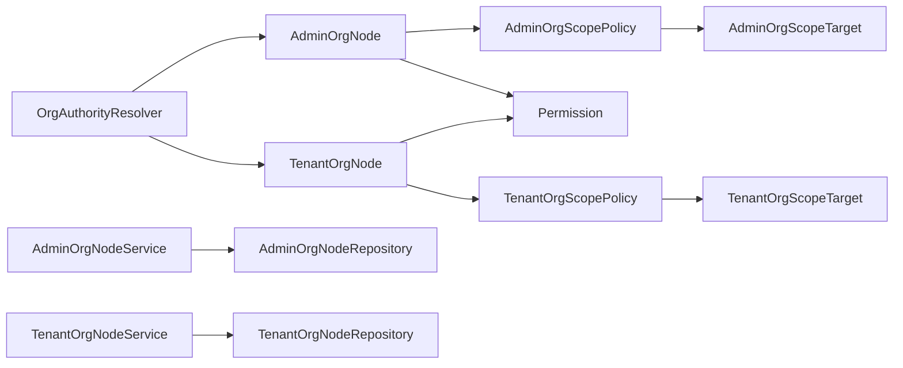

# 组织架构模型

<cite>
**本文引用的文件**
- [backend/app/models/org/admin_org_node.py](file://backend/app/models/org/admin_org_node.py)
- [backend/app/models/org/tenant_org_node.py](file://backend/app/models/org/tenant_org_node.py)
- [backend/app/core/org_authority.py](file://backend/app/core/org_authority.py)
- [backend/app/services/system/admin_org_node_service.py](file://backend/app/services/system/admin_org_node_service.py)
- [backend/app/services/tenant/tenant_org_node_service.py](file://backend/app/services/tenant/tenant_org_node_service.py)
- [backend/app/repositories/system/admin_org_node_repository.py](file://backend/app/repositories/system/admin_org_node_repository.py)
- [backend/app/repositories/tenant/tenant_org_node_repository.py](file://backend/app/repositories/tenant/tenant_org_node_repository.py)
- [backend/migrations/versions/20260325_org_authority_rebuild.py](file://backend/migrations/versions/20260325_org_authority_rebuild.py)
- [backend/migrations/versions/20260325_org_node_perm.py](file://backend/migrations/versions/20260325_org_node_perm.py)
- [backend/migrations/versions/20260404_0016_add_tenant_org_node_permissions.py](file://backend/migrations/versions/20260404_0016_add_tenant_org_node_permissions.py)
</cite>

## 目录
1. [简介](#简介)
2. [项目结构](#项目结构)
3. [核心组件](#核心组件)
4. [架构总览](#架构总览)
5. [详细组件分析](#详细组件分析)
6. [依赖分析](#依赖分析)
7. [性能考虑](#性能考虑)
8. [故障排查指南](#故障排查指南)
9. [结论](#结论)
10. [附录](#附录)

## 简介
本文件系统化梳理平台级“管理员组织节点”（AdminOrgNode）与“租户组织节点”（TenantOrgNode）的模型设计、树形结构、父子关系维护、权限分配与传播机制，并阐述其与权限系统的集成方式、数据一致性保障以及组织变更的审计与历史记录管理。文档同时提供实际应用场景与管理示例，帮助读者快速理解并正确使用组织架构模型。

## 项目结构
组织架构相关代码主要分布在以下层次：
- 模型层：定义 AdminOrgNode/TenantOrgNode 及其范围策略、权限关联表
- 仓储层：提供树查询、祖先/后代检索、成员聚合等数据库访问能力
- 服务层：封装组织节点的创建、移动、成员管理、权限同步等业务逻辑
- 权限解析层：根据用户身份与节点范围策略计算可见/可管理范围
- 迁移层：确保权限与范围策略在数据库层面的演进与约束

图表来源
- [backend/app/models/org/admin_org_node.py:34-326](file://backend/app/models/org/admin_org_node.py#L34-L326)
- [backend/app/models/org/tenant_org_node.py:34-344](file://backend/app/models/org/tenant_org_node.py#L34-L344)
- [backend/app/repositories/system/admin_org_node_repository.py:19-266](file://backend/app/repositories/system/admin_org_node_repository.py#L19-L266)
- [backend/app/repositories/tenant/tenant_org_node_repository.py:15-303](file://backend/app/repositories/tenant/tenant_org_node_repository.py#L15-L303)
- [backend/app/services/system/admin_org_node_service.py:31-601](file://backend/app/services/system/admin_org_node_service.py#L31-L601)
- [backend/app/services/tenant/tenant_org_node_service.py:33-657](file://backend/app/services/tenant/tenant_org_node_service.py#L33-L657)
- [backend/app/core/org_authority.py:30-347](file://backend/app/core/org_authority.py#L30-L347)

章节来源
- [backend/app/models/org/admin_org_node.py:1-326](file://backend/app/models/org/admin_org_node.py#L1-L326)
- [backend/app/models/org/tenant_org_node.py:1-344](file://backend/app/models/org/tenant_org_node.py#L1-L344)
- [backend/app/repositories/system/admin_org_node_repository.py:1-266](file://backend/app/repositories/system/admin_org_node_repository.py#L1-L266)
- [backend/app/repositories/tenant/tenant_org_node_repository.py:1-303](file://backend/app/repositories/tenant/tenant_org_node_repository.py#L1-L303)
- [backend/app/services/system/admin_org_node_service.py:1-601](file://backend/app/services/system/admin_org_node_service.py#L1-L601)
- [backend/app/services/tenant/tenant_org_node_service.py:1-657](file://backend/app/services/tenant/tenant_org_node_service.py#L1-L657)
- [backend/app/core/org_authority.py:1-347](file://backend/app/core/org_authority.py#L1-L347)

## 核心组件
- 管理员组织节点（AdminOrgNode）
  - 支持树形结构字段：parent_id、path、level、sort_order
  - 节点类型：部门（DEPARTMENT）与岗位（POSITION），限制子类型
  - 成员与负责人：admins、leader
  - 范围策略：AdminOrgScopePolicy + AdminOrgScopeTarget
  - 权限：与 Permission 多对多关联
  - 删除策略：阻断式删除，防止破坏组织完整性
- 租户组织节点（TenantOrgNode）
  - 同 AdminOrgNode 的树形结构与类型约束
  - 成员扩展：admins、users；负责人：leader（TenantAdmin）
  - 范围策略：TenantOrgScopePolicy + TenantOrgScopeTarget
  - 权限：与 Permission 多对多关联
  - 删除策略：阻断式删除，且需满足租户隔离
- 权限解析器（OrgAuthorityResolver）
  - 针对管理员、租户管理员、租户普通用户分别解析可见范围与有效作用域
  - 基于节点范围模式（SELF_ONLY、DEPT_ONLY、DEPT_AND_CHILDREN、CUSTOM、ALL）与路径前缀进行集合计算
- 服务层
  - AdminOrgNodeService / TenantOrgNodeService：封装组织节点生命周期、成员管理、权限同步、范围策略更新、树移动与路径重写
  - 提供树查询、祖先/后代检索、成员分页查询等能力
- 仓储层
  - AdminOrgNodeRepository / TenantOrgNodeRepository：基于路径前缀的树查询、成员聚合、详情加载（selectinload）

章节来源
- [backend/app/models/org/admin_org_node.py:34-326](file://backend/app/models/org/admin_org_node.py#L34-L326)
- [backend/app/models/org/tenant_org_node.py:34-344](file://backend/app/models/org/tenant_org_node.py#L34-L344)
- [backend/app/core/org_authority.py:30-347](file://backend/app/core/org_authority.py#L30-L347)
- [backend/app/services/system/admin_org_node_service.py:31-601](file://backend/app/services/system/admin_org_node_service.py#L31-L601)
- [backend/app/services/tenant/tenant_org_node_service.py:33-657](file://backend/app/services/tenant/tenant_org_node_service.py#L33-L657)
- [backend/app/repositories/system/admin_org_node_repository.py:19-266](file://backend/app/repositories/system/admin_org_node_repository.py#L19-L266)
- [backend/app/repositories/tenant/tenant_org_node_repository.py:15-303](file://backend/app/repositories/tenant/tenant_org_node_repository.py#L15-L303)

## 架构总览
组织架构与权限系统通过“模型-仓储-服务-解析器”的分层协作实现：
- 模型层定义树形结构与范围策略，建立权限关联
- 仓储层提供高性能树遍历与成员聚合
- 服务层负责业务规则与一致性（如类型校验、最大深度、路径重写）
- 权限解析器统一输出可见/可管理范围与有效作用域

图表来源
- [backend/app/services/system/admin_org_node_service.py:166-290](file://backend/app/services/system/admin_org_node_service.py#L166-L290)
- [backend/app/services/tenant/tenant_org_node_service.py:197-321](file://backend/app/services/tenant/tenant_org_node_service.py#L197-L321)
- [backend/app/repositories/system/admin_org_node_repository.py:133-176](file://backend/app/repositories/system/admin_org_node_repository.py#L133-L176)
- [backend/app/repositories/tenant/tenant_org_node_repository.py:150-192](file://backend/app/repositories/tenant/tenant_org_node_repository.py#L150-L192)
- [backend/app/core/org_authority.py:36-190](file://backend/app/core/org_authority.py#L36-L190)

## 详细组件分析

### 管理员组织节点（AdminOrgNode）模型
- 树形结构
  - parent_id 指向父节点，支持 SET NULL 删除行为
  - path 为物化路径，用于快速祖先/后代查询
  - level 表示层级深度，配合最大深度限制
  - sort_order 控制同级排序
- 类型与层级约束
  - type 限定为 DEPARTMENT 或 POSITION
  - 子类型仅允许 DEPARTMENT/POSITION（POSITION 不允许子节点）
- 成员与负责人
  - admins 关联管理员
  - leader 指向负责人（Admin）
- 范围策略与权限
  - scope_policy：一对一策略，支持多种范围模式
  - permissions：多对多权限集合
  - custom_org_node_ids：当模式为 CUSTOM 时，指定额外可见节点集合
- 删除策略
  - 对父节点与成员存在阻断式依赖，禁止删除有子节点或成员的节点

图表来源
- [backend/app/models/org/admin_org_node.py:34-326](file://backend/app/models/org/admin_org_node.py#L34-L326)

章节来源
- [backend/app/models/org/admin_org_node.py:34-326](file://backend/app/models/org/admin_org_node.py#L34-L326)

### 租户组织节点（TenantOrgNode）模型
- 结构与管理员节点一致，但具备租户隔离字段 tenant_id
- 成员扩展：admins（TenantAdmin）、users（TenantUser）
- 负责人：leader（TenantAdmin）
- 范围策略与权限：TenantOrgScopePolicy/TenantOrgScopeTarget/permissions
- 删除策略：阻断式删除，且需满足租户隔离

图表来源
- [backend/app/models/org/tenant_org_node.py:34-344](file://backend/app/models/org/tenant_org_node.py#L34-L344)

章节来源
- [backend/app/models/org/tenant_org_node.py:34-344](file://backend/app/models/org/tenant_org_node.py#L34-L344)

### 权限解析与范围传播
- 解析对象
  - 管理员：超级管理员拥有全部范围；否则基于其所在节点与作为负责人的节点集合计算可见/可管理范围
  - 租户管理员：所有者拥有全部范围；否则基于其所在节点与作为负责人的节点集合计算
  - 租户普通用户：仅限自身所在节点
- 范围模式
  - SELF_ONLY：仅自身
  - DEPT_ONLY：仅本部门
  - DEPT_AND_CHILDREN：本部门及所有子孙
  - CUSTOM：自定义可见节点集合
  - ALL：全量（超级/所有者）
- 传播机制
  - 通过节点 path 前缀匹配快速收集子树 ID
  - 自定义模式下合并多个目标节点集合
  - 合并多源模式时采用 CUSTOM 作为兜底

图表来源
- [backend/app/core/org_authority.py:36-190](file://backend/app/core/org_authority.py#L36-L190)
- [backend/app/core/org_authority.py:192-347](file://backend/app/core/org_authority.py#L192-L347)

章节来源
- [backend/app/core/org_authority.py:19-347](file://backend/app/core/org_authority.py#L19-L347)

### 服务层：组织节点生命周期与成员管理
- AdminOrgNodeService
  - 创建/更新/删除/移动节点
  - 校验节点类型与最大深度
  - 更新路径与子节点路径重写
  - 同步范围策略与权限映射
  - 成员管理：创建、更新、重置密码、停启用、迁移组织、移除成员
- TenantOrgNodeService
  - 与 AdminOrgNodeService 类似，但具备租户隔离与计划权限校验
  - 成员管理：创建、更新、重置密码、停启用、迁移组织、移除成员
  - 计划权限归一化：仅允许租户计划授权范围内权限

图表来源
- [backend/app/services/system/admin_org_node_service.py:166-290](file://backend/app/services/system/admin_org_node_service.py#L166-L290)
- [backend/app/services/tenant/tenant_org_node_service.py:197-321](file://backend/app/services/tenant/tenant_org_node_service.py#L197-L321)

章节来源
- [backend/app/services/system/admin_org_node_service.py:31-601](file://backend/app/services/system/admin_org_node_service.py#L31-L601)
- [backend/app/services/tenant/tenant_org_node_service.py:33-657](file://backend/app/services/tenant/tenant_org_node_service.py#L33-L657)

### 仓储层：树查询与成员聚合
- 树查询
  - get_tree/get_children：基于 parent_id 或 path 前缀
  - get_ancestors/get_descendants：基于 path 分段与前缀匹配
- 成员聚合
  - get_members：支持包含/不包含子孙的成员查询，支持分页与搜索
- 详情加载
  - 使用 selectinload 预加载 children、admins、leader、scope_policy.targets、permissions

章节来源
- [backend/app/repositories/system/admin_org_node_repository.py:19-266](file://backend/app/repositories/system/admin_org_node_repository.py#L19-L266)
- [backend/app/repositories/tenant/tenant_org_node_repository.py:15-303](file://backend/app/repositories/tenant/tenant_org_node_repository.py#L15-L303)

## 依赖分析
- 模型依赖
  - AdminOrgNode/TenantOrgNode 依赖各自 ScopePolicy/ScopeTarget 与 Permission 的多对多关系
  - ScopePolicy 与 ScopeTarget 形成“策略-目标”链，支持 CUSTOM 模式的灵活组合
- 服务依赖
  - Admin/TenantOrgNodeService 依赖对应 Repository 与权限归一化服务
  - Admin/TenantOrgNodeService 依赖 RoleTreeMixin（最大深度、路径计算）
- 权限解析依赖
  - OrgAuthorityResolver 依赖模型与仓储以读取节点路径与范围策略
- 数据一致性
  - 删除策略阻断父子与成员依赖
  - 路径前缀保证树遍历与范围传播的正确性
  - 迁移脚本确保权限与范围策略的约束与演进

图表来源
- [backend/app/models/org/admin_org_node.py:34-326](file://backend/app/models/org/admin_org_node.py#L34-L326)
- [backend/app/models/org/tenant_org_node.py:34-344](file://backend/app/models/org/tenant_org_node.py#L34-L344)
- [backend/app/services/system/admin_org_node_service.py:31-601](file://backend/app/services/system/admin_org_node_service.py#L31-L601)
- [backend/app/services/tenant/tenant_org_node_service.py:33-657](file://backend/app/services/tenant/tenant_org_node_service.py#L33-L657)
- [backend/app/core/org_authority.py:30-347](file://backend/app/core/org_authority.py#L30-L347)

章节来源
- [backend/app/models/org/admin_org_node.py:1-326](file://backend/app/models/org/admin_org_node.py#L1-L326)
- [backend/app/models/org/tenant_org_node.py:1-344](file://backend/app/models/org/tenant_org_node.py#L1-L344)
- [backend/app/services/system/admin_org_node_service.py:1-601](file://backend/app/services/system/admin_org_node_service.py#L1-L601)
- [backend/app/services/tenant/tenant_org_node_service.py:1-657](file://backend/app/services/tenant/tenant_org_node_service.py#L1-L657)
- [backend/app/core/org_authority.py:1-347](file://backend/app/core/org_authority.py#L1-L347)

## 性能考虑
- 树查询
  - 使用 path 前缀匹配替代递归查询，避免 N+1 问题
  - 通过 selectinload 预加载常用关系，减少查询次数
- 排序与分页
  - sort_order + id 组合排序，保证稳定顺序
  - 成员查询支持分页与搜索过滤
- 范围计算
  - 合并多源范围时先去重再合并，避免重复扫描
- 最大深度控制
  - 通过 RoleTreeMixin 限制层级，防止过深树导致查询膨胀

## 故障排查指南
- 创建/更新失败
  - 检查节点类型是否符合父子类型约束
  - 检查是否超过最大层级（MAX_ROLE_DEPTH）
  - 检查权限 ID 是否存在且作用域匹配
- 移动节点异常
  - 确认新父节点类型合法
  - 确认移动后不会超过最大层级
  - 确认路径重写是否成功（检查 path 前缀）
- 权限未生效
  - 检查节点范围模式与自定义目标是否正确
  - 检查权限是否在允许的作用域内
- 成员管理异常
  - 确认成员是否在当前节点或子孙节点范围内
  - 确认是否尝试移除超级/所有者
- 删除失败
  - 检查是否存在子节点或成员
  - 确认节点是否为系统节点（不可删除）

章节来源
- [backend/app/services/system/admin_org_node_service.py:166-290](file://backend/app/services/system/admin_org_node_service.py#L166-L290)
- [backend/app/services/tenant/tenant_org_node_service.py:197-321](file://backend/app/services/tenant/tenant_org_node_service.py#L197-L321)
- [backend/app/repositories/system/admin_org_node_repository.py:19-266](file://backend/app/repositories/system/admin_org_node_repository.py#L19-L266)
- [backend/app/repositories/tenant/tenant_org_node_repository.py:15-303](file://backend/app/repositories/tenant/tenant_org_node_repository.py#L15-L303)

## 结论
该组织架构模型通过清晰的树形结构、严格的类型与层级约束、灵活的范围策略与权限映射，实现了管理员与租户双层组织体系的统一建模。结合权限解析器与服务层的业务规则，系统在保证数据一致性的同时提供了高效的树查询与范围传播能力。迁移脚本进一步确保了权限与范围策略在数据库层面的演进与约束，为后续扩展打下坚实基础。

## 附录

### 组织变更的审计与历史记录
- 当前代码库中未发现直接的“操作日志表”或“组织变更审计表”的模型定义与服务实现
- 建议在组织节点创建/更新/移动/删除等关键操作处增加审计记录（如操作人、时间、前后状态快照）
- 审计记录可用于合规追溯与问题定位

章节来源
- [backend/migrations/versions/20260120_001_add_ai_providers.py](file://backend/migrations/versions/20260120_001_add_ai_providers.py)
- [backend/migrations/versions/20260123_0005_add_nickname_to_operation_logs.py](file://backend/migrations/versions/20260123_0005_add_nickname_to_operation_logs.py)
- [backend/migrations/versions/20260207_002_add_ai_usage_stats.py](file://backend/migrations/versions/20260207_002_add_ai_usage_stats.py)
- [backend/migrations/versions/20260208_0009_add_task_logs_table.py](file://backend/migrations/versions/20260208_0009_add_task_logs_table.py)
- [backend/migrations/versions/20260211_ee87f790553e_add_ai_action_logs_table.py](file://backend/migrations/versions/20260211_ee87f790553e_add_ai_action_logs_table.py)
- [backend/migrations/versions/20260212_6f8e790c9a68_add_ai_query_logs_table.py](file://backend/migrations/versions/20260212_6f8e790c9a68_add_ai_query_logs_table.py)
- [backend/migrations/versions/20260212_745cc30a4c44_add_missing_snapshot_fields_to_agent_.py](file://backend/migrations/versions/20260212_745cc30a4c44_add_missing_snapshot_fields_to_agent_.py)
- [backend/migrations/versions/20260212_8d11e316fec0_add_ai_table_policies_and_overrides.py](file://backend/migrations/versions/20260212_8d11e316fec0_add_ai_table_policies_and_overrides.py)
- [backend/migrations/versions/20260213_00db1351b7c6_add_source_plugin_to_skill_packages.py](file://backend/migrations/versions/20260213_00db1351b7c6_add_source_plugin_to_skill_packages.py)
- [backend/migrations/versions/20260213_63eadfe34156_add_skills_and_agent_skill_bindings_.py](file://backend/migrations/versions/20260213_63eadfe34156_add_skills_and_agent_skill_bindings_.py)
- [backend/migrations/versions/20260213_8c70188e6307_add_plugin_marketplace_fields.py](file://backend/migrations/versions/20260213_8c70188e6307_add_plugin_marketplace_fields.py)
- [backend/migrations/versions/20260213_add_plugins_tables.py](file://backend/migrations/versions/20260213_add_plugins_tables.py)
- [backend/migrations/versions/20260213_add_script_skill_fields.py](file://backend/migrations/versions/20260213_add_script_skill_fields.py)
- [backend/migrations/versions/20260213_add_skill_id_to_action_logs.py](file://backend/migrations/versions/20260213_add_skill_id_to_action_logs.py)
- [backend/migrations/versions/20260213_add_skill_packages.py](file://backend/migrations/versions/20260213_add_skill_packages.py)
- [backend/migrations/versions/20260213_data_migrate_tools_to_skills.py](file://backend/migrations/versions/20260213_data_migrate_tools_to_skills.py)
- [backend/migrations/versions/20260213_seed_recycle_bin_cleanup_task.py](file://backend/migrations/versions/20260213_seed_recycle_bin_cleanup_task.py)
- [backend/migrations/versions/20260213_seed_skill_presets.py](file://backend/migrations/versions/20260213_seed_skill_presets.py)
- [backend/migrations/versions/20260214_add_global_scope.py](file://backend/migrations/versions/20260214_add_global_scope.py)
- [backend/migrations/versions/20260214_add_is_system_field.py](file://backend/migrations/versions/20260214_add_is_system_field.py)
- [backend/migrations/versions/20260214_add_skill_scripts_table.py](file://backend/migrations/versions/20260214_add_skill_scripts_table.py)
- [backend/migrations/versions/20260214_add_toolkit_fields_to_skills.py](file://backend/migrations/versions/20260214_add_toolkit_fields_to_skills.py)
- [backend/migrations/versions/20260214_drop_old_skill_fields_and_scripts.py](file://backend/migrations/versions/20260214_drop_old_skill_fields_and_scripts.py)
- [backend/migrations/versions/20260214_drop_scope_from_table_policies.py](file://backend/migrations/versions/20260214_drop_scope_from_table_policies.py)
- [backend/migrations/versions/20260214_migrate_skills_to_toolkit.py](file://backend/migrations/versions/20260214_migrate_skills_to_toolkit.py)
- [backend/migrations/versions/20260214_normalize_scope_admin.py](file://backend/migrations/versions/20260214_normalize_scope_admin.py)
- [backend/migrations/versions/20260214_seed_crud_generator_agent_skill.py](file://backend/migrations/versions/20260214_seed_crud_generator_agent_skill.py)
- [backend/migrations/versions/20260214_seed_system_agents_skills.py](file://backend/migrations/versions/20260214_seed_system_agents_skills.py)
- [backend/migrations/versions/20260214_seed_system_data_intelligence.py](file://backend/migrations/versions/20260214_seed_system_data_intelligence.py)
- [backend/migrations/versions/20260215_add_crud_generation_records.py](file://backend/migrations/versions/20260215_add_crud_generation_records.py)
- [backend/migrations/versions/20260215_add_valves_to_skill_packages.py](file://backend/migrations/versions/20260215_add_valves_to_skill_packages.py)
- [backend/migrations/versions/20260215_drop_batch_project_snapshot.py](file://backend/migrations/versions/20260215_drop_batch_project_snapshot.py)
- [backend/migrations/versions/20260215_drop_tool_definitions_table.py](file://backend/migrations/versions/20260215_drop_tool_definitions_table.py)
- [backend/migrations/versions/20260215_enrich_system_skill_package_desc.py](file://backend/migrations/versions/20260215_enrich_system_skill_package_desc.py)
- [backend/migrations/versions/20260215_fix_crud_generator_agent.py](file://backend/migrations/versions/20260215_fix_crud_generator_agent.py)
- [backend/migrations/versions/20260215_fix_crud_generator_skill_tools.py](file://backend/migrations/versions/20260215_fix_crud_generator_skill_tools.py)
- [backend/migrations/versions/20260215_populate_builtin_skill_tools.py](file://backend/migrations/versions/20260215_populate_builtin_skill_tools.py)
- [backend/migrations/versions/20260215_refactor_agent_bind_package.py](file://backend/migrations/versions/20260215_refactor_agent_bind_package.py)
- [backend/migrations/versions/20260215_rename_agents_and_add_data_agent.py](file://backend/migrations/versions/20260215_rename_agents_and_add_data_agent.py)
- [backend/migrations/versions/20260216_add_consent_mode_to_bindings.py](file://backend/migrations/versions/20260216_add_consent_mode_to_bindings.py)
- [backend/migrations/versions/20260216_add_plugin_migrations_table.py](file://backend/migrations/versions/20260216_add_plugin_migrations_table.py)
- [backend/migrations/versions/20260216_add_system_agent_assignments.py](file://backend/migrations/versions/20260216_add_system_agent_assignments.py)
- [backend/migrations/versions/20260216_add_tenant_id_to_agent_assignments.py](file://backend/migrations/versions/20260216_add_tenant_id_to_agent_assignments.py)
- [backend/migrations/versions/20260216_cleanup_dirty_agent_data.py](file://backend/migrations/versions/20260216_cleanup_dirty_agent_data.py)
- [backend/migrations/versions/20260216_f97fd4fbf845_merge_heads.py](file://backend/migrations/versions/20260216_f97fd4fbf845_merge_heads.py)
- [backend/migrations/versions/20260216_fix_agent_assignment_data.py](file://backend/migrations/versions/20260216_fix_agent_assignment_data.py)
- [backend/migrations/versions/20260216_remove_crud_generator_seed_data.py](file://backend/migrations/versions/20260216_remove_crud_generator_seed_data.py)
- [backend/migrations/versions/20260216_replace_crud_generator_with_toolkit.py](file://backend/migrations/versions/20260216_replace_crud_generator_with_toolkit.py)
- [backend/migrations/versions/20260216_seed_agent_assignments.py](file://backend/migrations/versions/20260216_seed_agent_assignments.py)
- [backend/migrations/versions/20260216_seed_agent_welcome_messages.py](file://backend/migrations/versions/20260216_seed_agent_welcome_messages.py)
- [backend/migrations/versions/20260220_27044bf9d269_add_domain_ssl_certificates_table.py](file://backend/migrations/versions/20260220_27044bf9d269_add_domain_ssl_certificates_table.py)
- [backend/migrations/versions/20260221_0e818abf253a_add_skill_call_logs_table.py](file://backend/migrations/versions/20260221_0e818abf253a_add_skill_call_logs_table.py)
- [backend/migrations/versions/20260221_5c37f4f986ac_add_plugin_scope_and_tenant_assignments.py](file://backend/migrations/versions/20260221_5c37f4f986ac_add_plugin_scope_and_tenant_assignments.py)
- [backend/migrations/versions/20260221_61e838badbfa_add_skill_consent_overrides_to_bindings.py](file://backend/migrations/versions/20260221_61e838badbfa_add_skill_consent_overrides_to_bindings.py)
- [backend/migrations/versions/20260221_6b4fe69b2efc_add_notification_tables.py](file://backend/migrations/versions/20260221_6b4fe69b2efc_add_notification_tables.py)
- [backend/migrations/versions/20260221_a5e1ff4cfca1_merge_img_limits_and_fix_tz.py](file://backend/migrations/versions/20260221_a5e1ff4cfca1_merge_img_limits_and_fix_tz.py)
- [backend/migrations/versions/20260221_add_image_limits_to_ai_models.py](file://backend/migrations/versions/20260221_add_image_limits_to_ai_models.py)
- [backend/migrations/versions/20260221_e97db2eecd63_drop_agent_tool_bindings_column.py](file://backend/migrations/versions/20260221_e97db2eecd63_drop_agent_tool_bindings_column.py)
- [backend/migrations/versions/20260221_fix_domain_datetime_timezone.py](file://backend/migrations/versions/20260221_fix_domain_datetime_timezone.py)
- [backend/migrations/versions/20260221_seed_all_periodic_tasks.py](file://backend/migrations/versions/20260221_seed_all_periodic_tasks.py)
- [backend/migrations/versions/20260221_seed_ssl_renewal_check_task.py](file://backend/migrations/versions/20260221_seed_ssl_renewal_check_task.py)
- [backend/migrations/versions/20260222_31167c90d628_add_plugin_install_source_and_.py](file://backend/migrations/versions/20260222_31167c90d628_add_plugin_install_source_and_.py)
- [backend/migrations/versions/20260222_75773a96dac5_remove_unused_agent_assignment_seed_data.py](file://backend/migrations/versions/20260222_75773a96dac5_remove_unused_agent_assignment_seed_data.py)
- [backend/migrations/versions/20260222_c084bc659728_add_email_log_body_columns.py](file://backend/migrations/versions/20260222_c084bc659728_add_email_log_body_columns.py)
- [backend/migrations/versions/20260222_remove_openai_adapter_plugin.py](file://backend/migrations/versions/20260222_remove_openai_adapter_plugin.py)
- [backend/migrations/versions/20260222_seed_notification_cleanup_task.py](file://backend/migrations/versions/20260222_seed_notification_cleanup_task.py)
- [backend/migrations/versions/20260223_d11f0b4fec39_add_plugin_tables.py](file://backend/migrations/versions/20260223_d11f0b4fec39_add_plugin_tables.py)
- [backend/migrations/versions/20260224_18bd70ad08c1_add_skill_call_logs_table.py](file://backend/migrations/versions/20260224_18bd70ad08c1_add_skill_call_logs_table.py)
- [backend/migrations/versions/20260224_add_kb_visibility_and_tenant_access.py](file://backend/migrations/versions/20260224_add_kb_visibility_and_tenant_access.py)
- [backend/migrations/versions/20260224_allow_null_attachment_tenant_id.py](file://backend/migrations/versions/20260224_allow_null_attachment_tenant_id.py)
- [backend/migrations/versions/20260224_ffa4ebdf6d2e_add_resource_tenant_assignments_table.py](file://backend/migrations/versions/20260224_ffa4ebdf6d2e_add_resource_tenant_assignments_table.py)
- [backend/migrations/versions/20260225_0001_cleanup_orphan_table_and_add_constraints.py](file://backend/migrations/versions/20260225_0001_cleanup_orphan_table_and_add_constraints.py)
- [backend/migrations/versions/20260226_0410_merge_system_skill_packages.py](file://backend/migrations/versions/20260226_0410_merge_system_skill_packages.py)
- [backend/migrations/versions/20260226_4b78906f0bf9_add_expires_at_to_plugin_licenses.py](file://backend/migrations/versions/20260226_4b78906f0bf9_add_expires_at_to_plugin_licenses.py)
- [backend/migrations/versions/20260228_0bc08d7f8260_add_vision_model_id_and_extract_images_.py](file://backend/migrations/versions/20260228_0bc08d7f8260_add_vision_model_id_and_extract_images_.py)
- [backend/migrations/versions/20260228_8ab691fb6d2e_add_tier_column_to_ai_models.py](file://backend/migrations/versions/20260228_8ab691fb6d2e_add_tier_column_to_ai_models.py)
- [backend/migrations/versions/20260301_075fdfee8a70_add_routing_fields_to_ai_call_logs.py](file://backend/migrations/versions/20260301_075fdfee8a70_add_routing_fields_to_ai_call_logs.py)
- [backend/migrations/versions/20260301_f5b3f63a5364_add_routing_config_to_agents.py](file://backend/migrations/versions/20260301_f5b3f63a5364_add_routing_config_to_agents.py)
- [backend/migrations/versions/20260301_seed_plugin_trial_check_task.py](file://backend/migrations/versions/20260301_seed_plugin_trial_check_task.py)
- [backend/migrations/versions/20260302_9f2d1e34c7a1_add_agent_memory_switch_and_override.py](file://backend/migrations/versions/20260302_9f2d1e34c7a1_add_agent_memory_switch_and_override.py)
- [backend/migrations/versions/20260302_seed_session_memory_cleanup_task.py](file://backend/migrations/versions/20260302_seed_session_memory_cleanup_task.py)
- [backend/migrations/versions/20260303_c1a4f0e2b9d3_merge_session_memory_heads.py](file://backend/migrations/versions/20260303_c1a4f0e2b9d3_merge_session_memory_heads.py)
- [backend/migrations/versions/20260305_add_agent_id_to_conversation_messages.py](file://backend/migrations/versions/20260305_add_agent_id_to_conversation_messages.py)
- [backend/migrations/versions/20260305_add_tenant_scoped_unique_constraints.py](file://backend/migrations/versions/20260305_add_tenant_scoped_unique_constraints.py)
- [backend/migrations/versions/20260305_seed_router_agent_and_default_chat.py](file://backend/migrations/versions/20260305_seed_router_agent_and_default_chat.py)
- [backend/migrations/versions/20260306_retired_runtime_seed_a.py](file://backend/migrations/versions/20260306_retired_runtime_seed_a.py)
- [backend/migrations/versions/20260306_retired_runtime_seed_b.py](file://backend/migrations/versions/20260306_retired_runtime_seed_b.py)
- [backend/migrations/versions/20260307_add_approval_status.py](file://backend/migrations/versions/20260307_add_approval_status.py)
- [backend/migrations/versions/20260307_add_tenant_user_roles.py](file://backend/migrations/versions/20260307_add_tenant_user_roles.py)
- [backend/migrations/versions/20260307_backfill_default_user_roles.py](file://backend/migrations/versions/20260307_backfill_default_user_roles.py)
- [backend/migrations/versions/20260307_localize_router_agent_zh.py](file://backend/migrations/versions/20260307_localize_router_agent_zh.py)
- [backend/migrations/versions/20260307_retired_runtime_meta_a.py](file://backend/migrations/versions/20260307_retired_runtime_meta_a.py)
- [backend/migrations/versions/20260307_retired_runtime_meta_b.py](file://backend/migrations/versions/20260307_retired_runtime_meta_b.py)
- [backend/migrations/versions/20260308_05f5370dfb35_merge_three_heads.py](file://backend/migrations/versions/20260308_05f5370dfb35_merge_three_heads.py)
- [backend/migrations/versions/20260308_2200_add_target_audience_and_access_fields.py](file://backend/migrations/versions/20260308_2200_add_target_audience_and_access_fields.py)
- [backend/migrations/versions/20260308_2201_split_system_skill_packages.py](file://backend/migrations/versions/20260308_2201_split_system_skill_packages.py)
- [backend/migrations/versions/20260308_2202_init_agent_target_audience.py](file://backend/migrations/versions/20260308_2202_init_agent_target_audience.py)
- [backend/migrations/versions/20260308_add_agent_kb_bindings.py](file://backend/migrations/versions/20260308_add_agent_kb_bindings.py)
- [backend/migrations/versions/20260309_add_missing_cols_agent_kb_bindings.py](file://backend/migrations/versions/20260309_add_missing_cols_agent_kb_bindings.py)
- [backend/migrations/versions/20260310_drop_deprecated_kb_ids_columns.py](file://backend/migrations/versions/20260310_drop_deprecated_kb_ids_columns.py)
- [backend/migrations/versions/20260311_51e07931504d_remove_skill_packages_scope_column.py](file://backend/migrations/versions/20260311_51e07931504d_remove_skill_packages_scope_column.py)
- [backend/migrations/versions/20260313_retired_runtime_meta.py](file://backend/migrations/versions/20260313_retired_runtime_meta.py)
- [backend/migrations/versions/20260314_0914_add_scope_to_ai_api_keys.py](file://backend/migrations/versions/20260314_0914_add_scope_to_ai_api_keys.py)
- [backend/migrations/versions/20260314_0927_add_user_preferences_table.py](file://backend/migrations/versions/20260314_0927_add_user_preferences_table.py)
- [backend/migrations/versions/20260314_0949_notification_pref_add_global_layer.py](file://backend/migrations/versions/20260314_0949_notification_pref_add_global_layer.py)
- [backend/migrations/versions/20260314_cleanup_unused_notification_templates.py](file://backend/migrations/versions/20260314_cleanup_unused_notification_templates.py)
- [backend/migrations/versions/20260314_migrate_display_images_to_public.py](file://backend/migrations/versions/20260314_migrate_display_images_to_public.py)
- [backend/migrations/versions/20260314_seed_ai_writing_assignment.py](file://backend/migrations/versions/20260314_seed_ai_writing_assignment.py)
- [backend/migrations/versions/20260314_seed_litellm_registry_sync_task.py](file://backend/migrations/versions/20260314_seed_litellm_registry_sync_task.py)
- [backend/migrations/versions/20260315_seed_novusdoc_writer_agent.py](file://backend/migrations/versions/20260315_seed_novusdoc_writer_agent.py)
- [backend/migrations/versions/20260315_update_ai_writing_description.py](file://backend/migrations/versions/20260315_update_ai_writing_description.py)
- [backend/migrations/versions/20260316_novusdoc_writer_scope_admin_and_all.py](file://backend/migrations/versions/20260316_novusdoc_writer_scope_admin_and_all.py)
- [backend/migrations/versions/20260316_retired_runtime_meta.py](file://backend/migrations/versions/20260316_retired_runtime_meta.py)
- [backend/migrations/versions/20260317_0001_add_supports_audio_video_to_ai_models.py](file://backend/migrations/versions/20260317_0001_add_supports_audio_video_to_ai_models.py)
- [backend/migrations/versions/20260317_001_add_codegen_config_versions.py](file://backend/migrations/versions/20260317_001_add_codegen_config_versions.py)
- [backend/migrations/versions/20260317_add_codegen_configs_table.py](file://backend/migrations/versions/20260317_add_codegen_configs_table.py)
- [backend/migrations/versions/20260318_0001_add_audio_video_model_id_to_knowledge_bases.py](file://backend/migrations/versions/20260318_0001_add_audio_video_model_id_to_knowledge_bases.py)
- [backend/migrations/versions/20260318_0002_update_litellm_registry_task_description.py](file://backend/migrations/versions/20260318_0002_update_litellm_registry_task_description.py)
- [backend/migrations/versions/20260318_0003_add_trace_id_to_operation_logs.py](file://backend/migrations/versions/20260318_0003_add_trace_id_to_operation_logs.py)
- [backend/migrations/versions/20260318_0004_add_data_scope_to_roles.py](file://backend/migrations/versions/20260318_0004_add_data_scope_to_roles.py)
- [backend/migrations/versions/20260318_1935_merge_all_heads.py](file://backend/migrations/versions/20260318_1935_merge_all_heads.py)
- [backend/migrations/versions/20260319_add_codegen_config_resource_unique.py](file://backend/migrations/versions/20260319_add_codegen_config_resource_unique.py)
- [backend/migrations/versions/20260319_retired_runtime_meta.py](file://backend/migrations/versions/20260319_retired_runtime_meta.py)
- [backend/migrations/versions/20260320_tenant_agent_platform_kb_suppressions.py](file://backend/migrations/versions/20260320_tenant_agent_platform_kb_suppressions.py)
- [backend/migrations/versions/20260320_unified_resource_and_permission_scope.py](file://backend/migrations/versions/20260320_unified_resource_and_permission_scope.py)
- [backend/migrations/versions/20260320_update_data_mgmt_pkg_desc.py](file://backend/migrations/versions/20260320_update_data_mgmt_pkg_desc.py)
- [backend/migrations/versions/20260321_ai_api_keys_scope_owner_normalize.py](file://backend/migrations/versions/20260321_ai_api_keys_scope_owner_normalize.py)
- [backend/migrations/versions/20260321_ai_call_log_contract.py](file://backend/migrations/versions/20260321_ai_call_log_contract.py)
- [backend/migrations/versions/20260321_retired_runtime_meta.py](file://backend/migrations/versions/20260321_retired_runtime_meta.py)
- [backend/migrations/versions/20260322_ai_billing_ledger_merge.py](file://backend/migrations/versions/20260322_ai_billing_ledger_merge.py)
- [backend/migrations/versions/20260323_rename_ai_call_log_agent_resource_scope.py](file://backend/migrations/versions/20260323_rename_ai_call_log_agent_resource_scope.py)
- [backend/migrations/versions/20260324_add_conversation_owner_type_and_session_task_scope.py](file://backend/migrations/versions/20260324_add_conversation_owner_type_and_session_task_scope.py)
- [backend/migrations/versions/20260324_add_missing_recycle_bin_columns.py](file://backend/migrations/versions/20260324_add_missing_recycle_bin_columns.py)
- [backend/migrations/versions/20260324_drop_skill_package_target_audience.py](file://backend/migrations/versions/20260324_drop_skill_package_target_audience.py)
- [backend/migrations/versions/20260324_periodic_tasks_owner_tenant_id_repair.py](file://backend/migrations/versions/20260324_periodic_tasks_owner_tenant_id_repair.py)
- [backend/migrations/versions/20260324_plugin_license_semantics_cleanup.py](file://backend/migrations/versions/20260324_plugin_license_semantics_cleanup.py)
- [backend/migrations/versions/20260325_0001_skill_architecture_foundation.py](file://backend/migrations/versions/20260325_0001_skill_architecture_foundation.py)
- [backend/migrations/versions/20260325_0002_task_scheduling_foundation.py](file://backend/migrations/versions/20260325_0002_task_scheduling_foundation.py)
- [backend/migrations/versions/20260325_0003_task_definition_operational_fields.py](file://backend/migrations/versions/20260325_0003_task_definition_operational_fields.py)
- [backend/migrations/versions/20260325_0004_backfill_task_definitions_from_periodic_tasks.py](file://backend/migrations/versions/20260325_0004_backfill_task_definitions_from_periodic_tasks.py)
- [backend/migrations/versions/20260325_0005_drop_legacy_task_tables.py](file://backend/migrations/versions/20260325_0005_drop_legacy_task_tables.py)
- [backend/migrations/versions/20260325_org_authority_rebuild.py](file://backend/migrations/versions/20260325_org_authority_rebuild.py)
- [backend/migrations/versions/20260325_org_node_perm.py](file://backend/migrations/versions/20260325_org_node_perm.py)
- [backend/migrations/versions/20260404_0016_add_tenant_org_node_permissions.py](file://backend/migrations/versions/20260404_0016_add_tenant_org_node_permissions.py)

### 实际应用场景与管理示例
- 管理后台组织管理
  - 创建部门/岗位：选择父节点、设置类型（DEPARTMENT/POSITION）、排序、范围模式（默认 DEPT_AND_CHILDREN）
  - 设置负责人：仅部门类型可设负责人
  - 成员管理：批量导入、重置密码、停启用、迁移组织
  - 权限分配：为节点绑定权限，支持 ADMIN/TENANT/BOTH 作用域
- 租户组织管理
  - 与管理后台类似，但需满足租户隔离与计划权限约束
  - 支持 CUSTOM 范围模式，精确控制可见节点集合
- 权限传播
  - 当节点范围为 DEPT_AND_CHILDREN 时，权限自动覆盖整棵子树
  - 当节点范围为 CUSTOM 时，权限仅作用于自定义目标节点集合
- 数据一致性
  - 禁止删除有子节点或成员的节点
  - 禁止移动节点导致层级超限
  - 禁止将 POSITION 类型节点作为父节点

章节来源
- [backend/app/services/system/admin_org_node_service.py:166-290](file://backend/app/services/system/admin_org_node_service.py#L166-L290)
- [backend/app/services/tenant/tenant_org_node_service.py:197-321](file://backend/app/services/tenant/tenant_org_node_service.py#L197-L321)
- [backend/app/core/org_authority.py:192-347](file://backend/app/core/org_authority.py#L192-L347)