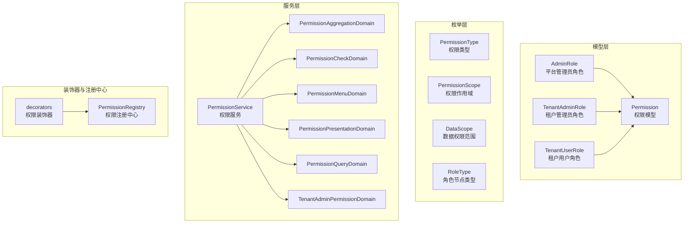
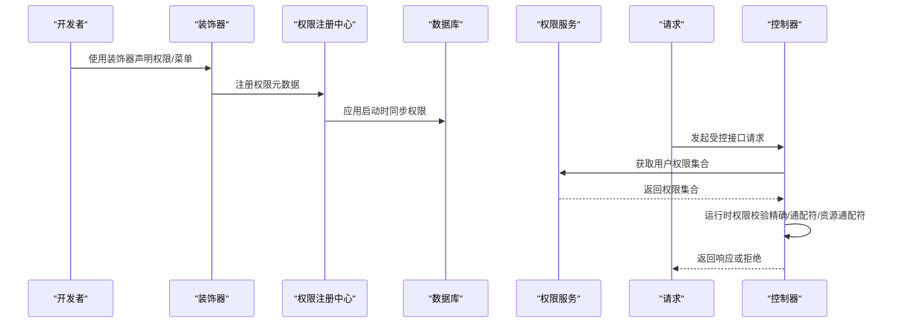
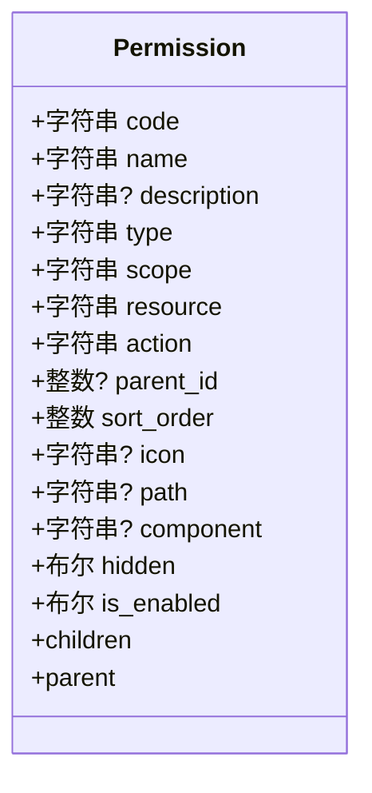
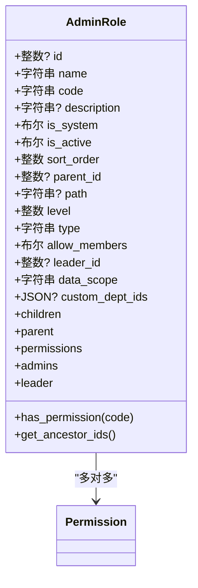
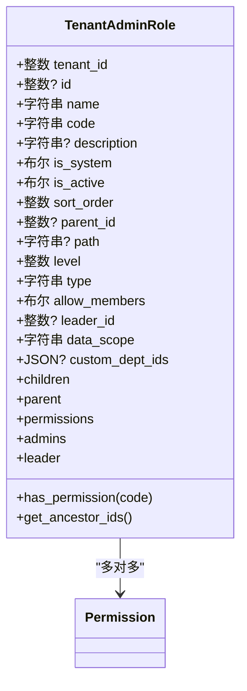
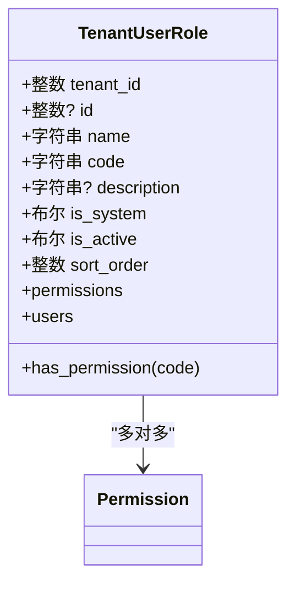
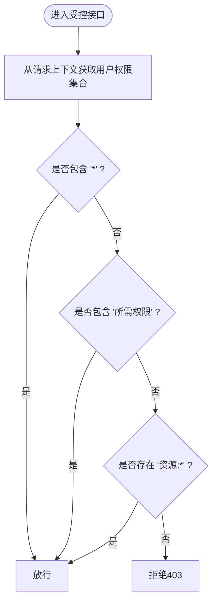
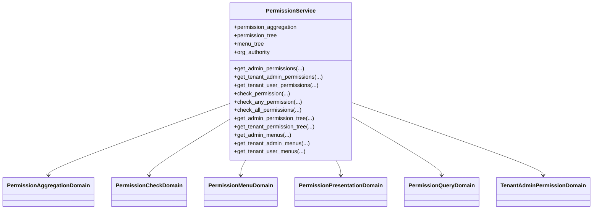
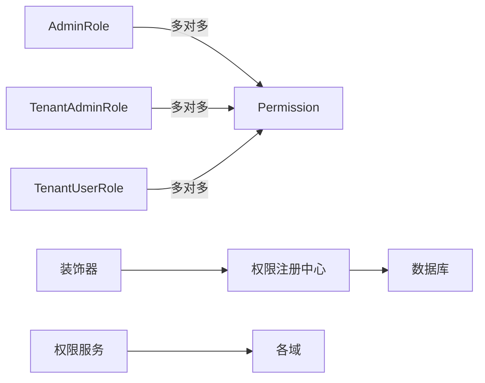

# 认证授权模型

<cite>
**本文档引用的文件**
- [backend/app/models/auth/admin_role.py](file://backend/app/models/auth/admin_role.py)
- [backend/app/models/auth/tenant_admin_role.py](file://backend/app/models/auth/tenant_admin_role.py)
- [backend/app/models/auth/tenant_user_role.py](file://backend/app/models/auth/tenant_user_role.py)
- [backend/app/models/auth/permission.py](file://backend/app/models/auth/permission.py)
- [backend/app/enums/rbac.py](file://backend/app/enums/rbac.py)
- [backend/app/enums/role.py](file://backend/app/enums/role.py)
- [backend/app/rbac/services/permission_service.py](file://backend/app/rbac/services/permission_service.py)
- [backend/app/rbac/decorators.py](file://backend/app/rbac/decorators.py)
- [backend/app/rbac/registry.py](file://backend/app/rbac/registry.py)
</cite>

## 目录
1. [简介](#简介)
2. [项目结构](#项目结构)
3. [核心组件](#核心组件)
4. [架构总览](#架构总览)
5. [详细组件分析](#详细组件分析)
6. [依赖分析](#依赖分析)
7. [性能考虑](#性能考虑)
8. [故障排查指南](#故障排查指南)
9. [结论](#结论)
10. [附录](#附录)

## 简介
本文件面向认证授权模型，聚焦基于角色的访问控制（RBAC）数据模型与权限验证机制。内容涵盖：
- 管理员角色（AdminRole）的角色定义、权限继承与层级关系
- 权限（Permission）模型的权限标识、资源范围与操作类型
- 租户管理员角色（TenantAdminRole）与租户用户角色（TenantUserRole）的权限分配与作用域控制
- RBAC权限系统的数据模型设计与权限验证流程
- 权限继承链、冲突解决与缓存策略
- 权限配置的实际案例与安全最佳实践

## 项目结构
RBAC相关代码主要分布在以下模块：
- 模型层：权限与角色实体定义
- 枚举层：权限类型、作用域与数据权限范围
- 服务层：权限聚合、查询、菜单构建与校验
- 装饰器与注册中心：声明式权限注册与运行时校验

**图表来源**
- [backend/app/models/auth/admin_role.py:36-322](file://backend/app/models/auth/admin_role.py#L36-L322)
- [backend/app/models/auth/tenant_admin_role.py:36-327](file://backend/app/models/auth/tenant_admin_role.py#L36-L327)
- [backend/app/models/auth/tenant_user_role.py:37-177](file://backend/app/models/auth/tenant_user_role.py#L37-L177)
- [backend/app/models/auth/permission.py:15-159](file://backend/app/models/auth/permission.py#L15-L159)
- [backend/app/enums/rbac.py:11-36](file://backend/app/enums/rbac.py#L11-L36)
- [backend/app/enums/role.py:11-46](file://backend/app/enums/role.py#L11-L46)
- [backend/app/rbac/services/permission_service.py:138-390](file://backend/app/rbac/services/permission_service.py#L138-L390)
- [backend/app/rbac/decorators.py:1-551](file://backend/app/rbac/decorators.py#L1-L551)
- [backend/app/rbac/registry.py:15-146](file://backend/app/rbac/registry.py#L15-L146)

**章节来源**
- [backend/app/models/auth/admin_role.py:36-322](file://backend/app/models/auth/admin_role.py#L36-L322)
- [backend/app/models/auth/tenant_admin_role.py:36-327](file://backend/app/models/auth/tenant_admin_role.py#L36-L327)
- [backend/app/models/auth/tenant_user_role.py:37-177](file://backend/app/models/auth/tenant_user_role.py#L37-L177)
- [backend/app/models/auth/permission.py:15-159](file://backend/app/models/auth/permission.py#L15-L159)
- [backend/app/enums/rbac.py:11-36](file://backend/app/enums/rbac.py#L11-L36)
- [backend/app/enums/role.py:11-46](file://backend/app/enums/role.py#L11-L46)
- [backend/app/rbac/services/permission_service.py:138-390](file://backend/app/rbac/services/permission_service.py#L138-L390)
- [backend/app/rbac/decorators.py:1-551](file://backend/app/rbac/decorators.py#L1-L551)
- [backend/app/rbac/registry.py:15-146](file://backend/app/rbac/registry.py#L15-L146)

## 核心组件
- 权限（Permission）：系统权限点的统一抽象，包含权限代码、名称、类型、作用域、资源、操作、菜单字段与启用状态等。通过装饰器自动注册并同步至数据库，支持菜单与操作两类权限。
- 管理员角色（AdminRole）：平台级角色，支持多级层级结构（父子关系），子角色自动继承父角色权限；具备数据权限范围与自定义部门列表能力。
- 租户管理员角色（TenantAdminRole）：企业级角色，支持多级层级结构，不同企业可同名；具备数据权限范围与自定义部门列表能力。
- 租户用户角色（TenantUserRole）：企业级用户角色，扁平结构，不支持层级；用于业务用户的权限分配。

**章节来源**
- [backend/app/models/auth/permission.py:15-159](file://backend/app/models/auth/permission.py#L15-L159)
- [backend/app/models/auth/admin_role.py:36-322](file://backend/app/models/auth/admin_role.py#L36-L322)
- [backend/app/models/auth/tenant_admin_role.py:36-327](file://backend/app/models/auth/tenant_admin_role.py#L36-L327)
- [backend/app/models/auth/tenant_user_role.py:37-177](file://backend/app/models/auth/tenant_user_role.py#L37-L177)

## 架构总览
RBAC系统采用“声明式注册 + 运行时校验”的模式：
- 开发者通过装饰器在控制器上声明权限与菜单，系统启动时扫描并注册到注册中心，随后同步到数据库。
- 请求到达时，中间件或装饰器从请求上下文中获取用户权限集合，进行权限校验（精确匹配、通配符、资源通配符）。
- 服务层提供权限聚合、查询、菜单树构建与展示逻辑，支持平台与租户端的差异化处理。

**图表来源**
- [backend/app/rbac/decorators.py:153-337](file://backend/app/rbac/decorators.py#L153-L337)
- [backend/app/rbac/registry.py:15-146](file://backend/app/rbac/registry.py#L15-L146)
- [backend/app/rbac/services/permission_service.py:138-390](file://backend/app/rbac/services/permission_service.py#L138-L390)

## 详细组件分析

### 权限（Permission）模型
- 字段要点
  - 权限代码（code）+ 作用域（scope）联合唯一，确保跨端隔离
  - 类型（type）：菜单（menu）或操作（operation）
  - 作用域（scope）：admin、tenant、user、both，指示权限归属端别
  - 资源（resource）与操作（action）：形成“资源:动作”权限标识
  - 菜单专用字段：图标、路由、组件、隐藏标志等
  - 启用状态与层级父子关系，支持菜单树
- 设计意义
  - 将“权限点”与“菜单”解耦，便于灵活组合
  - 通过作用域实现平台端与租户端权限的物理隔离

**图表来源**
- [backend/app/models/auth/permission.py:15-159](file://backend/app/models/auth/permission.py#L15-L159)

**章节来源**
- [backend/app/models/auth/permission.py:15-159](file://backend/app/models/auth/permission.py#L15-L159)
- [backend/app/enums/rbac.py:11-36](file://backend/app/enums/rbac.py#L11-L36)

### 管理员角色（AdminRole）模型
- 角色特性
  - 多级层级结构：父角色、子角色、物化路径（path）、层级深度（level）
  - 权限继承：子角色自动继承父角色权限
  - 数据权限范围：支持全部、本部门及下级、仅本部门、仅自己、自定义部门列表
  - 组织节点类型：部门、岗位、职能角色
- 关键方法
  - has_permission：检查角色自身是否拥有某权限（不含继承）
  - get_ancestor_ids：从物化路径解析祖先角色ID列表

**图表来源**
- [backend/app/models/auth/admin_role.py:36-322](file://backend/app/models/auth/admin_role.py#L36-L322)

**章节来源**
- [backend/app/models/auth/admin_role.py:36-322](file://backend/app/models/auth/admin_role.py#L36-L322)
- [backend/app/enums/role.py:11-46](file://backend/app/enums/role.py#L11-L46)

### 租户管理员角色（TenantAdminRole）模型
- 角色特性
  - 企业级角色，支持多级层级结构
  - 不同企业可存在同名角色
  - 数据权限范围与自定义部门列表
- 关键方法
  - has_permission：检查角色自身是否拥有某权限（不含继承）
  - get_ancestor_ids：从物化路径解析祖先角色ID列表

**图表来源**
- [backend/app/models/auth/tenant_admin_role.py:36-327](file://backend/app/models/auth/tenant_admin_role.py#L36-L327)

**章节来源**
- [backend/app/models/auth/tenant_admin_role.py:36-327](file://backend/app/models/auth/tenant_admin_role.py#L36-L327)
- [backend/app/enums/role.py:11-46](file://backend/app/enums/role.py#L11-L46)

### 租户用户角色（TenantUserRole）模型
- 角色特性
  - 企业级用户角色，扁平结构，不支持层级
  - 不同企业可存在同名角色
- 关键方法
  - has_permission：检查角色是否拥有某权限

**图表来源**
- [backend/app/models/auth/tenant_user_role.py:37-177](file://backend/app/models/auth/tenant_user_role.py#L37-L177)

**章节来源**
- [backend/app/models/auth/tenant_user_role.py:37-177](file://backend/app/models/auth/tenant_user_role.py#L37-L177)

### 权限验证机制与装饰器
- 装饰器能力
  - 声明式定义资源权限与操作权限，自动注册并同步
  - 运行时自动校验：支持精确匹配、通配符“*”、资源通配符“资源:*”
- 校验算法
  - 若用户权限集合包含“*”，直接放行
  - 精确匹配 required ∈ user_permissions
  - 资源通配符：若“资源:*”存在则放行
- 快捷装饰器
  - 提供 action_read、action_create、action_update、action_delete、action_export、action_import 等快捷声明

**图表来源**
- [backend/app/rbac/decorators.py:340-358](file://backend/app/rbac/decorators.py#L340-L358)

**章节来源**
- [backend/app/rbac/decorators.py:153-337](file://backend/app/rbac/decorators.py#L153-L337)
- [backend/app/rbac/decorators.py:340-358](file://backend/app/rbac/decorators.py#L340-L358)

### 权限聚合与服务层
- 权限服务（PermissionService）职责
  - 聚合平台/租户管理员与租户用户的有效权限
  - 提供权限树、菜单树构建与查询
  - 提供权限校验工具方法（任一满足、全部满足）
- 关键域
  - 权限聚合域：整合角色、组织节点与计划权限
  - 权限校验域：执行精确/通配符/资源通配符校验
  - 菜单域：根据权限生成菜单树
  - 查询域：按平台/租户维度查询权限树与列表
  - 租户管理员权限域：处理租户管理员的特殊权限合并逻辑

**图表来源**
- [backend/app/rbac/services/permission_service.py:138-390](file://backend/app/rbac/services/permission_service.py#L138-L390)

**章节来源**
- [backend/app/rbac/services/permission_service.py:138-390](file://backend/app/rbac/services/permission_service.py#L138-L390)

### 权限继承链、冲突解决与缓存策略
- 继承链
  - 管理员角色与租户管理员角色支持多级层级结构，子角色自动继承父角色权限
  - 物化路径（path）与层级深度（level）用于快速解析祖先角色ID
- 冲突解决
  - 当角色与组织节点同时赋予相同权限时，通常以“并集”方式合并，具体合并策略由服务层的聚合域实现
- 缓存策略
  - 权限集合在请求生命周期内复用，避免重复查询
  - 菜单树与权限树在服务层进行构建与缓存，减少重复计算

**章节来源**
- [backend/app/models/auth/admin_role.py:301-314](file://backend/app/models/auth/admin_role.py#L301-L314)
- [backend/app/models/auth/tenant_admin_role.py:306-318](file://backend/app/models/auth/tenant_admin_role.py#L306-L318)
- [backend/app/rbac/services/permission_service.py:138-390](file://backend/app/rbac/services/permission_service.py#L138-L390)

### 权限配置实际案例与安全最佳实践
- 配置案例
  - 资源权限装饰器：在控制器类上声明资源与菜单，自动注册菜单权限与操作权限
  - 操作权限装饰器：在方法上声明具体操作，自动派生权限码并注册
  - 快捷装饰器：使用 action_read、action_create 等快速声明 CRUD 权限
- 安全最佳实践
  - 严格区分平台端与租户端权限，避免跨端越权
  - 使用数据权限范围（DataScope）限制行级数据可见性
  - 优先使用资源通配符“资源:*”而非全局通配符“*”，遵循最小权限原则
  - 定期审计权限树与角色继承链，清理无效权限与冗余角色

**章节来源**
- [backend/app/rbac/decorators.py:153-337](file://backend/app/rbac/decorators.py#L153-L337)
- [backend/app/enums/role.py:11-46](file://backend/app/enums/role.py#L11-L46)

## 依赖分析
- 模型间依赖
  - AdminRole ↔ Permission：多对多
  - TenantAdminRole ↔ Permission：多对多
  - TenantUserRole ↔ Permission：多对多
- 服务层依赖
  - PermissionService 依赖多个内部域（聚合、校验、菜单、查询、展示、租户管理员）
- 装饰器与注册中心
  - 装饰器将权限元数据注册到注册中心，应用启动时同步至数据库

**图表来源**
- [backend/app/models/auth/admin_role.py:227-232](file://backend/app/models/auth/admin_role.py#L227-L232)
- [backend/app/models/auth/tenant_admin_role.py:232-237](file://backend/app/models/auth/tenant_admin_role.py#L232-L237)
- [backend/app/models/auth/tenant_user_role.py:130-135](file://backend/app/models/auth/tenant_user_role.py#L130-L135)
- [backend/app/rbac/decorators.py:153-337](file://backend/app/rbac/decorators.py#L153-L337)
- [backend/app/rbac/registry.py:15-146](file://backend/app/rbac/registry.py#L15-L146)
- [backend/app/rbac/services/permission_service.py:138-390](file://backend/app/rbac/services/permission_service.py#L138-L390)

**章节来源**
- [backend/app/models/auth/admin_role.py:227-232](file://backend/app/models/auth/admin_role.py#L227-L232)
- [backend/app/models/auth/tenant_admin_role.py:232-237](file://backend/app/models/auth/tenant_admin_role.py#L232-L237)
- [backend/app/models/auth/tenant_user_role.py:130-135](file://backend/app/models/auth/tenant_user_role.py#L130-L135)
- [backend/app/rbac/decorators.py:153-337](file://backend/app/rbac/decorators.py#L153-L337)
- [backend/app/rbac/registry.py:15-146](file://backend/app/rbac/registry.py#L15-L146)
- [backend/app/rbac/services/permission_service.py:138-390](file://backend/app/rbac/services/permission_service.py#L138-L390)

## 性能考虑
- 数据模型层面
  - 使用物化路径（path）与层级深度（level）加速祖先解析
  - 权限与角色多对多关系配合索引，提升查询效率
- 服务层层面
  - 权限集合在请求生命周期内缓存，避免重复聚合
  - 菜单树与权限树构建结果缓存，降低重复计算
- 装饰器层面
  - 启动时一次性扫描并注册，运行时仅做轻量校验

## 故障排查指南
- 权限未生效
  - 检查权限是否正确注册到注册中心并在数据库中存在
  - 确认权限作用域（scope）与调用端一致
- 菜单不显示
  - 检查菜单权限是否启用（is_enabled）
  - 检查菜单隐藏标志（hidden）与前端路由配置
- 越权访问
  - 检查数据权限范围（DataScope）与自定义部门列表（custom_dept_ids）
  - 确认角色继承链是否导致意外权限授予

**章节来源**
- [backend/app/rbac/registry.py:15-146](file://backend/app/rbac/registry.py#L15-L146)
- [backend/app/models/auth/permission.py:133-139](file://backend/app/models/auth/permission.py#L133-L139)
- [backend/app/enums/role.py:11-46](file://backend/app/enums/role.py#L11-L46)

## 结论
本RBAC模型通过清晰的数据结构与服务分层，实现了平台与租户双端权限的统一管理。权限声明式注册与运行时校验相结合，既保证了开发效率，又确保了权限控制的灵活性与安全性。建议在实际落地中结合数据权限范围与最小权限原则，持续优化权限树与角色继承链，提升系统的可维护性与安全性。

## 附录
- 枚举说明
  - 权限类型（PermissionType）：菜单与操作
  - 权限作用域（PermissionScope）：平台、租户、用户、两端
  - 数据权限范围（DataScope）：全部、本部门及下级、仅本部门、仅自己、自定义
  - 角色节点类型（RoleType）：部门、岗位、职能角色

**章节来源**
- [backend/app/enums/rbac.py:11-36](file://backend/app/enums/rbac.py#L11-L36)
- [backend/app/enums/role.py:11-46](file://backend/app/enums/role.py#L11-L46)