# 通用业务模型

<cite>
**本文引用的文件**
- [backend/app/models/common/notification.py](file://backend/app/models/common/notification.py)
- [backend/app/models/common/notification_delivery.py](file://backend/app/models/common/notification_delivery.py)
- [backend/app/models/common/notification_preference.py](file://backend/app/models/common/notification_preference.py)
- [backend/app/models/common/notification_template.py](file://backend/app/models/common/notification_template.py)
- [backend/app/models/common/user_preference.py](file://backend/app/models/common/user_preference.py)
- [backend/app/services/common/notification_service.py](file://backend/app/services/common/notification_service.py)
- [backend/app/services/common/notification_preference_service.py](file://backend/app/services/common/notification_preference_service.py)
- [backend/app/services/common/user_preference_service.py](file://backend/app/services/common/user_preference_service.py)
- [backend/app/tasks/notification.py](file://backend/app/tasks/notification.py)
- [backend/migrations/versions/20260221_6b4fe69b2efc_add_notification_tables.py](file://backend/migrations/versions/20260221_6b4fe69b2efc_add_notification_tables.py)
- [backend/migrations/versions/20260314_0927_add_user_preferences_table.py](file://backend/migrations/versions/20260314_0927_add_user_preferences_table.py)
- [backend/migrations/versions/20260314_0949_notification_pref_add_global_layer.py](file://backend/migrations/versions/20260314_0949_notification_pref_add_global_layer.py)
</cite>

## 目录
1. [简介](#简介)
2. [项目结构](#项目结构)
3. [核心组件](#核心组件)
4. [架构总览](#架构总览)
5. [详细组件分析](#详细组件分析)
6. [依赖关系分析](#依赖关系分析)
7. [性能考量](#性能考量)
8. [故障排查指南](#故障排查指南)
9. [结论](#结论)
10. [附录](#附录)

## 简介
本文件系统性地梳理并文档化通用业务模型中的通知相关数据结构与服务，涵盖以下关键模型与能力：
- 通知（Notification）：持久化收件箱、消息体、接收者、分类、优先级、已读状态与过期控制。
- 通知投递（NotificationDelivery）：按渠道记录投递状态、重试计数、失败原因与审计追踪。
- 通知偏好（NotificationPreference）：分层偏好体系（全局默认 → 个人覆盖），支持多用户类型与分类维度。
- 通知模板（NotificationTemplate）：模板管理、分类、渠道、优先级、作用域与覆盖机制。
- 用户偏好（UserPreference）：分层偏好体系（系统默认 → 全局 → 个人），支持键过滤与版本化。
- 通知服务（NotificationService）：统一投递入口、模板解析、偏好查询、渠道分发、收件箱上限控制。
- 通知任务（Celery）：邮件发送任务、重试策略、失败处理与投递状态更新。

## 项目结构
通用业务模型围绕“通知”这一核心领域，采用分层设计：
- 数据模型层：基于 SQLAlchemy ORM 定义实体与索引，确保查询效率与可维护性。
- 服务层：封装业务逻辑，包括模板解析、偏好合并、投递状态管理与收件箱上限控制。
- 任务层：基于 Celery 的异步任务队列，负责邮件发送与状态回写。
- 迁移层：版本化数据库结构演进，确保模板、偏好与用户偏好的演进兼容。

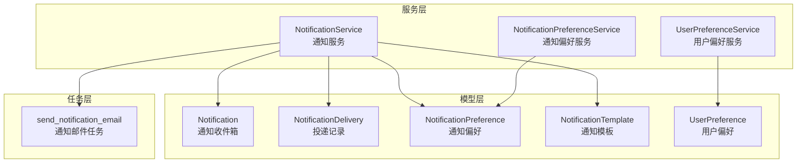

图表来源
- [backend/app/models/common/notification.py:17-118](file://backend/app/models/common/notification.py#L17-L118)
- [backend/app/models/common/notification_delivery.py:16-122](file://backend/app/models/common/notification_delivery.py#L16-L122)
- [backend/app/models/common/notification_preference.py:16-88](file://backend/app/models/common/notification_preference.py#L16-L88)
- [backend/app/models/common/notification_template.py:15-186](file://backend/app/models/common/notification_template.py#L15-L186)
- [backend/app/models/common/user_preference.py:15-78](file://backend/app/models/common/user_preference.py#L15-L78)
- [backend/app/services/common/notification_service.py:28-800](file://backend/app/services/common/notification_service.py#L28-L800)
- [backend/app/services/common/notification_preference_service.py:38-287](file://backend/app/services/common/notification_preference_service.py#L38-L287)
- [backend/app/services/common/user_preference_service.py:133-414](file://backend/app/services/common/user_preference_service.py#L133-L414)
- [backend/app/tasks/notification.py:18-242](file://backend/app/tasks/notification.py#L18-L242)

章节来源
- [backend/app/models/common/notification.py:17-118](file://backend/app/models/common/notification.py#L17-L118)
- [backend/app/models/common/notification_delivery.py:16-122](file://backend/app/models/common/notification_delivery.py#L16-L122)
- [backend/app/models/common/notification_preference.py:16-88](file://backend/app/models/common/notification_preference.py#L16-L88)
- [backend/app/models/common/notification_template.py:15-186](file://backend/app/models/common/notification_template.py#L15-L186)
- [backend/app/models/common/user_preference.py:15-78](file://backend/app/models/common/user_preference.py#L15-L78)
- [backend/app/services/common/notification_service.py:28-800](file://backend/app/services/common/notification_service.py#L28-L800)
- [backend/app/services/common/notification_preference_service.py:38-287](file://backend/app/services/common/notification_preference_service.py#L38-L287)
- [backend/app/services/common/user_preference_service.py:133-414](file://backend/app/services/common/user_preference_service.py#L133-L414)
- [backend/app/tasks/notification.py:18-242](file://backend/app/tasks/notification.py#L18-L242)

## 核心组件
- 通知（Notification）
  - 存储收件箱消息，支持按接收者类型与ID、已读状态、分类与租户范围查询。
  - 字段要点：接收者类型与ID、模板编码、分类、标题/正文、业务数据、链接、优先级、已读状态与时间、过期时间。
  - 索引优化：接收者组合索引、租户+时间索引，提升查询与清理效率。
- 通知投递（NotificationDelivery）
  - 记录每个渠道的投递状态与审计轨迹，支持 pending/queued/sent/failed/skipped 状态机。
  - 字段要点：通知ID、模板ID/编码、渠道（ws/inbox/email/webhook）、接收者类型与ID、租户ID、状态、尝试次数、任务ID、错误信息、完成时间。
  - 索引优化：通知ID、模板编码+渠道、接收者+租户、状态+时间等，便于统计与重试。
- 通知偏好（NotificationPreference）
  - 分层偏好：platform_global/tenant_global → admin/tenant_admin 个人覆盖。
  - 字段要点：用户类型、租户ID、用户ID、分类、各渠道开关（WS/邮件/收件箱）。
  - 唯一约束：用户类型+租户+用户+分类，保证每分类唯一偏好。
- 通知模板（NotificationTemplate）
  - 模板管理：标题/正文模板、渠道列表、优先级、作用域（platform/tenant/plugin/source）、来源、插件名、启用状态、系统内置标志、租户ID、覆盖模板ID、锁定字段。
  - 唯一性约束：按作用域与租户维度的唯一索引，确保模板编码在各自范围内唯一。
- 用户偏好（UserPreference）
  - 分层偏好：系统默认 → 全局 → 个人，键过滤与版本化。
  - 字段要点：作用域、租户ID、用户ID、偏好JSON、版本号。
  - 唯一约束：作用域+租户+用户，保证每条记录唯一。
- 通知服务（NotificationService）
  - 统一投递入口：查询模板、渲染内容、合并偏好、按渠道分发、记录投递状态、收件箱上限控制。
  - 提供通知查询、已读、删除等管理能力。
- 通知偏好服务（NotificationPreferenceService）
  - 全局偏好 CRUD：批量更新、精确清除受影响的个人覆盖。
  - 个人偏好 CRUD：合并全局与个人偏好、重置覆盖。
- 用户偏好服务（UserPreferenceService）
  - 生效偏好合并：系统默认 + 全局 + 个人，支持键过滤与版本化。
  - 全局变更时精确清除个人覆盖中已变更的键。
- 通知任务（Celery）
  - 邮件发送任务：带重试、失败分类（配置问题不重试）、状态回写与日志记录。

章节来源
- [backend/app/models/common/notification.py:17-118](file://backend/app/models/common/notification.py#L17-L118)
- [backend/app/models/common/notification_delivery.py:16-122](file://backend/app/models/common/notification_delivery.py#L16-L122)
- [backend/app/models/common/notification_preference.py:16-88](file://backend/app/models/common/notification_preference.py#L16-L88)
- [backend/app/models/common/notification_template.py:15-186](file://backend/app/models/common/notification_template.py#L15-L186)
- [backend/app/models/common/user_preference.py:15-78](file://backend/app/models/common/user_preference.py#L15-L78)
- [backend/app/services/common/notification_service.py:28-800](file://backend/app/services/common/notification_service.py#L28-L800)
- [backend/app/services/common/notification_preference_service.py:38-287](file://backend/app/services/common/notification_preference_service.py#L38-L287)
- [backend/app/services/common/user_preference_service.py:133-414](file://backend/app/services/common/user_preference_service.py#L133-L414)
- [backend/app/tasks/notification.py:18-242](file://backend/app/tasks/notification.py#L18-L242)

## 架构总览
通知系统采用“服务驱动 + 渠道分发 + 任务异步”的架构模式：
- 服务层负责模板解析、偏好合并与渠道分发。
- 渠道通过统一接口（通道）实现，包括 WS、收件箱、邮件、Webhook。
- 邮件发送通过 Celery 任务异步执行，并更新投递记录状态。
- 收件箱上限控制与过期清理由服务层在投递后执行。

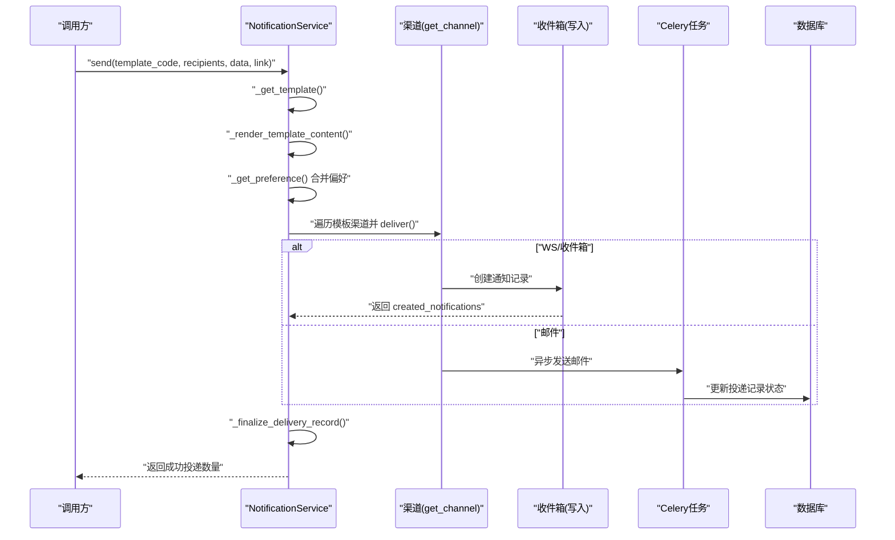

图表来源
- [backend/app/services/common/notification_service.py:48-210](file://backend/app/services/common/notification_service.py#L48-L210)
- [backend/app/tasks/notification.py:18-158](file://backend/app/tasks/notification.py#L18-L158)

章节来源
- [backend/app/services/common/notification_service.py:28-800](file://backend/app/services/common/notification_service.py#L28-L800)
- [backend/app/tasks/notification.py:18-242](file://backend/app/tasks/notification.py#L18-L242)

## 详细组件分析

### 通知（Notification）模型
- 数据结构要点
  - 接收者标识：recipient_type + recipient_id，支持 admin/tenant_admin/tenant_user。
  - 模板关联：template_code，便于渲染与审计。
  - 分类与优先级：category + priority，支持系统/AI/任务/业务/审计分类与优先级排序。
  - 已读与过期：is_read + read_at + expired_at，支持过期清理与已读追踪。
  - 业务数据：data（JSONB），支持任意结构化数据。
- 查询与管理
  - 支持按接收者、分类、已读状态、租户范围查询。
  - 提供标记已读、全部已读、删除（软删）等操作。
- 性能与扩展
  - 多维索引优化查询路径。
  - 可扩展字段（如 link、data）满足不同业务场景。

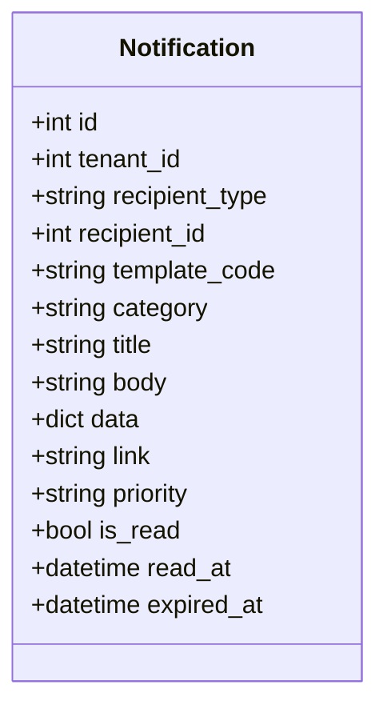

图表来源
- [backend/app/models/common/notification.py:17-118](file://backend/app/models/common/notification.py#L17-L118)

章节来源
- [backend/app/models/common/notification.py:17-118](file://backend/app/models/common/notification.py#L17-L118)
- [backend/app/services/common/notification_service.py:266-397](file://backend/app/services/common/notification_service.py#L266-L397)

### 通知投递（NotificationDelivery）模型
- 数据结构要点
  - 关联字段：notification_id、template_id、template_code。
  - 渠道与接收者：channel、recipient_type、recipient_id、tenant_id。
  - 状态机：pending/queued/sent/failed/skipped，配合 attempt 与 last_error。
  - 任务追踪：task_id、delivered_at。
- 重试与失败处理
  - 通过 attempt 记录重试次数。
  - 失败原因记录在 last_error，便于诊断。
  - 邮件任务通过 Celery 完成，失败时根据错误类型决定是否重试。
- 审计与统计
  - 多维索引支持按状态、时间、接收者等维度统计与查询。

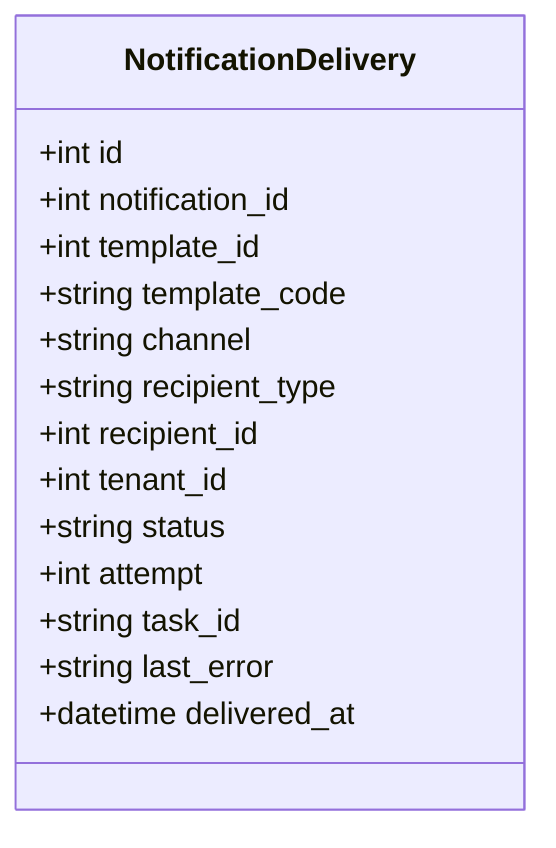

图表来源
- [backend/app/models/common/notification_delivery.py:16-122](file://backend/app/models/common/notification_delivery.py#L16-L122)

章节来源
- [backend/app/models/common/notification_delivery.py:16-122](file://backend/app/models/common/notification_delivery.py#L16-L122)
- [backend/app/tasks/notification.py:18-158](file://backend/app/tasks/notification.py#L18-L158)

### 通知偏好（NotificationPreference）模型
- 分层偏好
  - 个人偏好优先于全局默认；全局默认优先于硬编码默认。
  - 支持用户类型：platform_global、tenant_global、admin、tenant_admin。
- 字段与行为
  - 每个分类（system/ai/task/biz/audit）独立开关 WS、邮件、收件箱。
  - 唯一约束保证每分类每用户仅一条偏好记录。
- 服务层合并逻辑
  - 先查个人，再查对应全局（admin→platform_global，tenant_admin→tenant_global），最后回退到默认。

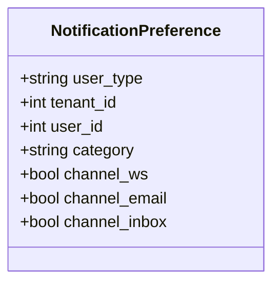

图表来源
- [backend/app/models/common/notification_preference.py:16-88](file://backend/app/models/common/notification_preference.py#L16-L88)

章节来源
- [backend/app/models/common/notification_preference.py:16-88](file://backend/app/models/common/notification_preference.py#L16-L88)
- [backend/app/services/common/notification_service.py:514-558](file://backend/app/services/common/notification_service.py#L514-L558)
- [backend/app/services/common/notification_preference_service.py:38-287](file://backend/app/services/common/notification_preference_service.py#L38-L287)

### 通知模板（NotificationTemplate）模型
- 模板管理
  - 标题/正文模板（支持占位符渲染）、渠道列表、优先级。
  - 作用域：platform/tenant/plugin/source，来源：core/plugin/import 等。
  - 覆盖机制：override_of 指向被覆盖模板，locked_fields 禁止覆盖字段。
- 唯一性约束
  - 平台级：code 在 tenant_id 为空且 scope='platform' 下唯一。
  - 企业级：code 在 scope='tenant' 且 tenant_id 非空下唯一。
  - 插件级：code 在 scope='plugin' 下唯一。
  - 来源级：source+code 在 scope='source' 且 source 非空下唯一。
- 解析与渲染
  - 服务层按租户覆盖 → 插件/来源 → 平台默认解析有效模板。
  - 标题/正文通过占位符渲染，异常时回退原始模板。

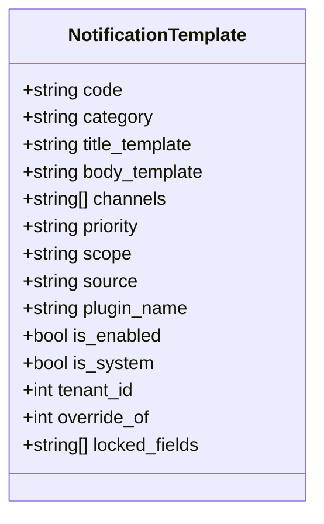

图表来源
- [backend/app/models/common/notification_template.py:15-186](file://backend/app/models/common/notification_template.py#L15-L186)

章节来源
- [backend/app/models/common/notification_template.py:15-186](file://backend/app/models/common/notification_template.py#L15-L186)
- [backend/app/services/common/notification_service.py:402-414](file://backend/app/services/common/notification_service.py#L402-L414)

### 用户偏好（UserPreference）模型
- 分层偏好
  - 系统默认（大量界面/交互偏好）→ 全局（平台/企业）→ 个人（覆盖）。
  - 作用域：platform_global、tenant_global、admin、tenant_admin。
- 键过滤与版本化
  - 仅允许有效键，全局专属键（如水印）不参与个人覆盖。
  - 全局变更时，精确清除个人记录中已变更的键，保持一致性。
- 服务层合并
  - 返回系统默认 + 全局 + 个人的最终生效偏好。

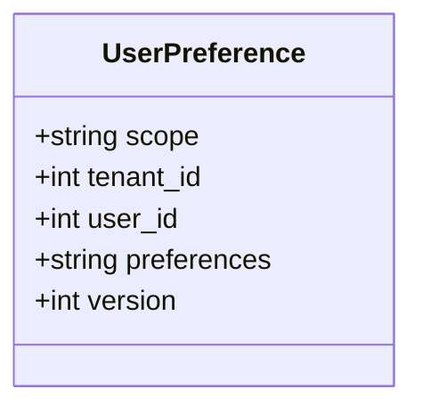

图表来源
- [backend/app/models/common/user_preference.py:15-78](file://backend/app/models/common/user_preference.py#L15-L78)

章节来源
- [backend/app/models/common/user_preference.py:15-78](file://backend/app/models/common/user_preference.py#L15-L78)
- [backend/app/services/common/user_preference_service.py:133-414](file://backend/app/services/common/user_preference_service.py#L133-L414)

### 通知服务（NotificationService）流程
- 统一投递入口
  - 检查系统总开关 → 查询模板 → 渲染标题/正文 → 合并用户偏好 → 遍历模板渠道 → 创建投递记录 → 调用渠道 deliver → 最终化投递记录。
- 收件箱上限控制
  - 投递完成后对每个接收者执行上限检查，超出时优先清理最早已读通知。
- 查询与管理
  - 支持分页查询、未读计数、标记已读/全部已读、删除（软删）。

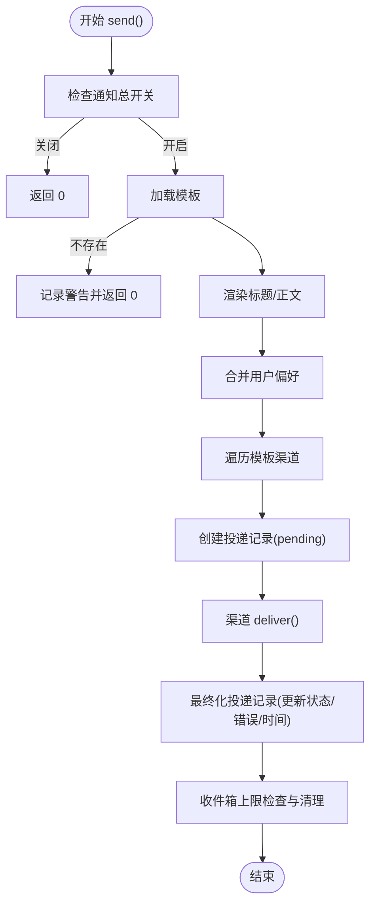

图表来源
- [backend/app/services/common/notification_service.py:48-210](file://backend/app/services/common/notification_service.py#L48-L210)
- [backend/app/services/common/notification_service.py:559-620](file://backend/app/services/common/notification_service.py#L559-L620)

章节来源
- [backend/app/services/common/notification_service.py:28-800](file://backend/app/services/common/notification_service.py#L28-L800)

### 通知偏好服务（NotificationPreferenceService）流程
- 全局偏好
  - 获取：缺失分类用硬编码默认补齐。
  - 更新：批量更新后，对受影响分类精确清除个人覆盖。
- 个人偏好
  - 获取：个人 → 全局 → 默认，返回是否自定义标记。
  - 保存：批量 upsert，支持分类维度。
  - 重置：清除个人记录，恢复为全局默认。

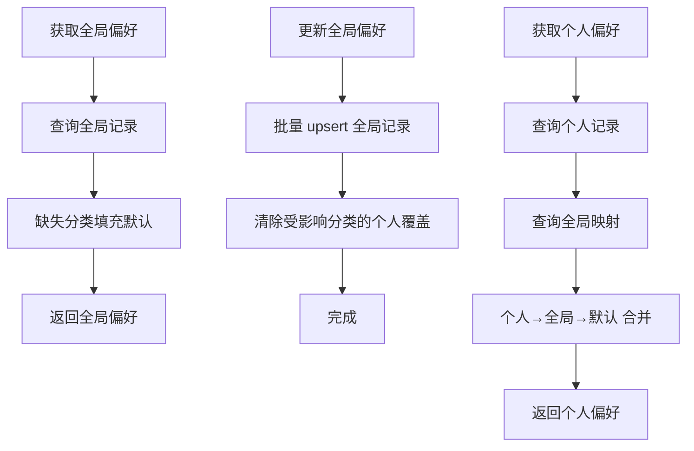

图表来源
- [backend/app/services/common/notification_preference_service.py:48-83](file://backend/app/services/common/notification_preference_service.py#L48-L83)
- [backend/app/services/common/notification_preference_service.py:84-163](file://backend/app/services/common/notification_preference_service.py#L84-L163)
- [backend/app/services/common/notification_preference_service.py:168-225](file://backend/app/services/common/notification_preference_service.py#L168-L225)
- [backend/app/services/common/notification_preference_service.py:227-283](file://backend/app/services/common/notification_preference_service.py#L227-L283)

章节来源
- [backend/app/services/common/notification_preference_service.py:38-287](file://backend/app/services/common/notification_preference_service.py#L38-L287)

### 用户偏好服务（UserPreferenceService）流程
- 获取生效偏好
  - 系统默认 + 全局 + 个人三层合并。
- 全局更新
  - 过滤有效键 → 计算变更键 → 更新全局记录 → 精确清除个人记录中变更键。
- 个人更新
  - 过滤有效键（排除全局专属） → upsert 个人记录 → 返回生效偏好。
- 重置个人
  - 清空个人记录 → 返回全局默认合并结果。

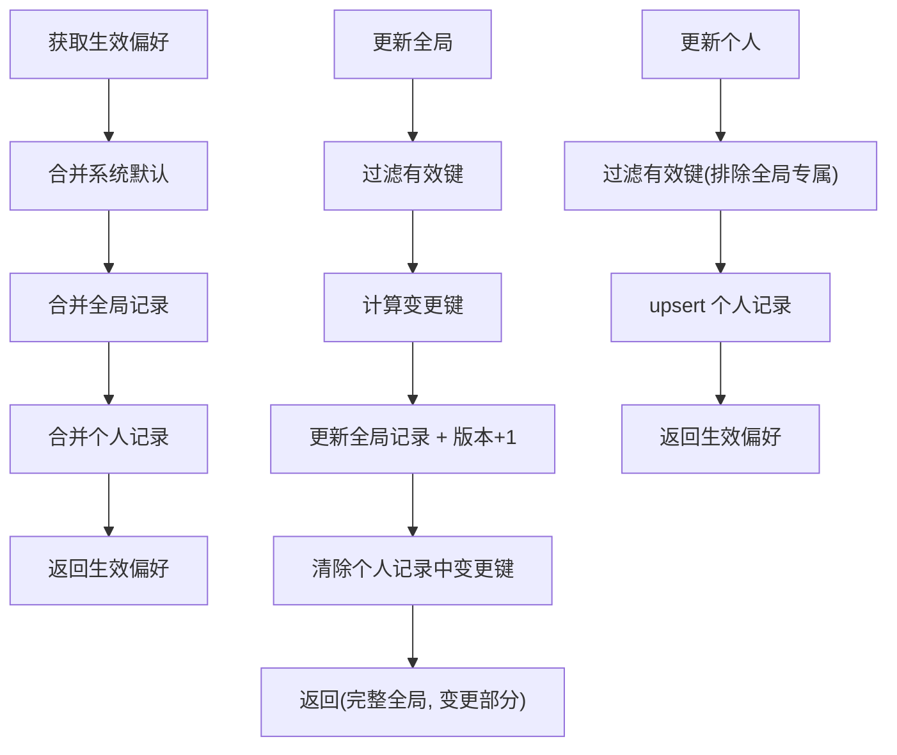

图表来源
- [backend/app/services/common/user_preference_service.py:143-166](file://backend/app/services/common/user_preference_service.py#L143-L166)
- [backend/app/services/common/user_preference_service.py:209-257](file://backend/app/services/common/user_preference_service.py#L209-L257)
- [backend/app/services/common/user_preference_service.py:258-288](file://backend/app/services/common/user_preference_service.py#L258-L288)
- [backend/app/services/common/user_preference_service.py:290-312](file://backend/app/services/common/user_preference_service.py#L290-L312)

章节来源
- [backend/app/services/common/user_preference_service.py:133-414](file://backend/app/services/common/user_preference_service.py#L133-L414)

### 通知任务（Celery）流程
- 邮件发送
  - 调用邮件服务发送，记录邮件日志。
  - 成功：更新投递记录为 sent，记录任务ID与尝试次数。
  - 配置问题（不重试）：更新为 skipped。
  - SMTP 错误：更新为 failed 并抛出异常触发重试。
- 状态回写
  - 通过同步会话更新投递记录状态、任务ID、尝试次数与错误信息。

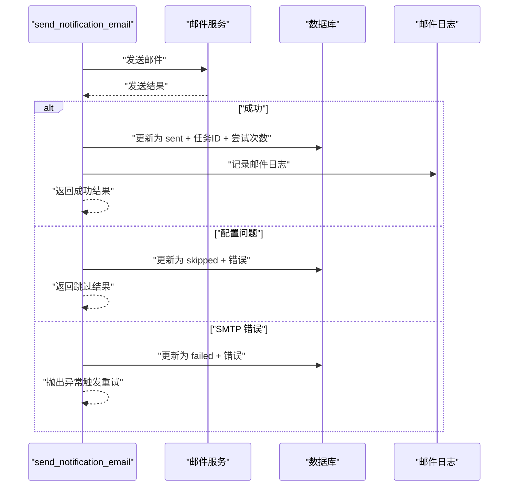

图表来源
- [backend/app/tasks/notification.py:24-158](file://backend/app/tasks/notification.py#L24-L158)
- [backend/app/tasks/notification.py:160-239](file://backend/app/tasks/notification.py#L160-L239)

章节来源
- [backend/app/tasks/notification.py:18-242](file://backend/app/tasks/notification.py#L18-L242)

## 依赖关系分析
- 模型间依赖
  - Notification 与 NotificationDelivery：一对多关联（通过 notification_id）。
  - NotificationTemplate 与 NotificationDelivery：一对一关联（template_id）。
  - NotificationPreference 与 Notification：偏好影响投递渠道选择。
  - UserPreference 与系统其他偏好消费点（非本文件范围）。
- 服务间依赖
  - NotificationService 依赖 NotificationTemplateRepository 解析模板、偏好服务进行合并、渠道接口进行投递、Celery 任务进行邮件发送。
  - NotificationPreferenceService 与 UserPreferenceService 独立运作，分别管理两类偏好。
- 任务依赖
  - 通知邮件任务依赖邮件服务与数据库会话工厂，确保状态回写与日志记录。

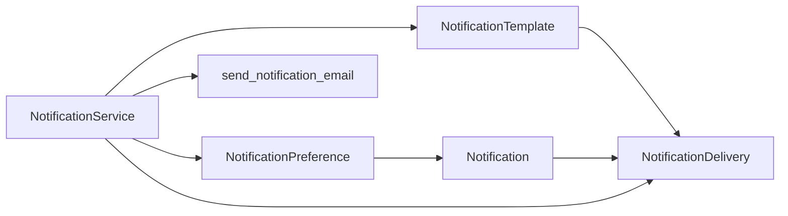

图表来源
- [backend/app/models/common/notification.py:17-118](file://backend/app/models/common/notification.py#L17-L118)
- [backend/app/models/common/notification_delivery.py:16-122](file://backend/app/models/common/notification_delivery.py#L16-L122)
- [backend/app/models/common/notification_preference.py:16-88](file://backend/app/models/common/notification_preference.py#L16-L88)
- [backend/app/models/common/notification_template.py:15-186](file://backend/app/models/common/notification_template.py#L15-L186)
- [backend/app/services/common/notification_service.py:28-800](file://backend/app/services/common/notification_service.py#L28-L800)
- [backend/app/tasks/notification.py:18-242](file://backend/app/tasks/notification.py#L18-L242)

章节来源
- [backend/app/models/common/notification.py:17-118](file://backend/app/models/common/notification.py#L17-L118)
- [backend/app/models/common/notification_delivery.py:16-122](file://backend/app/models/common/notification_delivery.py#L16-L122)
- [backend/app/models/common/notification_preference.py:16-88](file://backend/app/models/common/notification_preference.py#L16-L88)
- [backend/app/models/common/notification_template.py:15-186](file://backend/app/models/common/notification_template.py#L15-L186)
- [backend/app/services/common/notification_service.py:28-800](file://backend/app/services/common/notification_service.py#L28-L800)
- [backend/app/tasks/notification.py:18-242](file://backend/app/tasks/notification.py#L18-L242)

## 性能考量
- 查询优化
  - 通知与投递模型均建立多维索引，覆盖接收者、租户、状态、时间等高频查询条件。
  - 通知模板按作用域与租户维度建立唯一索引，减少冲突与提升查找效率。
- 写入与事务
  - 通知服务在收件箱写入后不自动提交，调用方需在合适时机提交，避免长事务。
  - 投递记录创建与最终化采用 flush 保障状态一致性。
- 限流与清理
  - 收件箱上限控制：超出时优先清理最早已读通知，防止无限增长。
  - 过期时间字段支持后续清理任务或查询过滤。
- 异步与重试
  - 邮件发送通过 Celery 异步执行，失败时按指数退避重试，避免阻塞主流程。

## 故障排查指南
- 通知未送达
  - 检查系统总开关与模板启用状态。
  - 查看投递记录状态与错误信息，定位渠道禁用或配置问题。
  - 对于邮件，确认邮件服务配置与日志记录。
- 偏好未生效
  - 确认用户类型与租户ID匹配，检查全局与个人记录的合并顺序。
  - 全局变更后，确认受影响分类的个人覆盖已被清除。
- 收件箱过多
  - 检查上限配置与清理逻辑，确认是否触发了最早已读通知清理。
- 邮件发送失败
  - 区分配置问题（不重试）与 SMTP 错误（重试）。
  - 查看任务日志与投递记录的 attempt 与 last_error。

章节来源
- [backend/app/services/common/notification_service.py:502-513](file://backend/app/services/common/notification_service.py#L502-L513)
- [backend/app/services/common/notification_service.py:559-620](file://backend/app/services/common/notification_service.py#L559-L620)
- [backend/app/tasks/notification.py:91-157](file://backend/app/tasks/notification.py#L91-L157)

## 结论
通用业务模型通过清晰的分层设计与完善的偏好与模板机制，实现了高可扩展、可维护的通知系统。模型层面的索引与唯一约束、服务层面的偏好合并与上限控制、任务层面的异步与重试策略共同构成了稳定可靠的投递体系。迁移层的版本化演进确保了模板与偏好的平滑升级。

## 附录
- 设计原则
  - 分层与解耦：模型、服务、任务职责分离，降低耦合度。
  - 可扩展性：模板与渠道抽象，支持新渠道接入与模板覆盖。
  - 可观测性：投递记录状态机与审计字段，便于追踪与排障。
  - 一致性：全局变更精确清除个人覆盖，偏好合并明确优先级。
- 扩展机制
  - 新增渠道：实现渠道接口并通过注册中心接入，不影响现有流程。
  - 新增模板：按作用域与来源规范创建，遵循唯一性约束。
  - 新增偏好键：纳入系统默认与有效键集合，确保全局一致性。
- 使用示例（步骤说明）
  - 发送通知
    - 准备模板编码与接收者列表。
    - 调用通知服务的统一入口，传入业务数据与可选链接。
    - 等待收件箱写入与渠道投递，必要时提交数据库事务。
  - 配置通知偏好
    - 管理员先更新全局偏好（缺失分类自动补齐）。
    - 个人用户可在客户端或后台更新个人偏好。
    - 全局变更后，受影响分类的个人覆盖将被精确清除。
  - 配置用户偏好
    - 获取系统默认与生效偏好，进行全局或个人更新。
    - 全局更新时，仅变更的键会被清除个人覆盖，其余保持不变。
  - 邮件发送
    - 通过通知服务触发邮件任务，任务内部处理重试与状态回写。
    - 查看邮件日志与投递记录，确认发送结果。

章节来源
- [backend/app/services/common/notification_service.py:48-210](file://backend/app/services/common/notification_service.py#L48-L210)
- [backend/app/services/common/notification_preference_service.py:84-163](file://backend/app/services/common/notification_preference_service.py#L84-L163)
- [backend/app/services/common/user_preference_service.py:209-257](file://backend/app/services/common/user_preference_service.py#L209-L257)
- [backend/app/tasks/notification.py:24-158](file://backend/app/tasks/notification.py#L24-L158)