# API模块组织结构

<cite>
**本文档引用的文件**
- [backend/app/api/__init__.py](file://backend/app/api/__init__.py)
- [backend/app/api/admin/__init__.py](file://backend/app/api/admin/__init__.py)
- [backend/app/api/tenant/__init__.py](file://backend/app/api/tenant/__init__.py)
- [backend/app/api/user/__init__.py](file://backend/app/api/user/__init__.py)
- [backend/app/api/public/__init__.py](file://backend/app/api/public/__init__.py)
- [backend/app/api/common/__init__.py](file://backend/app/api/common/__init__.py)
- [backend/app/api/shared/__init__.py](file://backend/app/api/shared/__init__.py)
- [backend/app/api/admin/agents.py](file://backend/app/api/admin/agents.py)
- [backend/app/api/admin/users.py](file://backend/app/api/admin/users.py)
- [backend/app/api/admin/tenants.py](file://backend/app/api/admin/tenants.py)
- [backend/app/api/admin/plugins.py](file://backend/app/api/admin/plugins.py)
- [backend/app/api/tenant/agents.py](file://backend/app/api/tenant/agents.py)
- [backend/app/api/tenant/users.py](file://backend/app/api/tenant/users.py)
- [backend/app/api/tenant/analytics.py](file://backend/app/api/tenant/analytics.py)
- [backend/app/api/user/agent_chat.py](file://backend/app/api/user/agent_chat.py)
- [backend/app/api/public/platform.py](file://backend/app/api/public/platform.py)
- [backend/app/api/public/tenant.py](file://backend/app/api/public/tenant.py)
- [backend/app/api/public/captcha.py](file://backend/app/api/public/captcha.py)
- [backend/app/api/common/identity.py](file://backend/app/api/common/identity.py)
- [backend/app/api/shared/_agent_helpers.py](file://backend/app/api/shared/_agent_helpers.py)
- [backend/app/api/shared/_attachment_helpers.py](file://backend/app/api/shared/_attachment_helpers.py)
- [backend/app/api/shared/_plugin_slot_filter.py](file://backend/app/api/shared/_plugin_slot_filter.py)
- [backend/app/api/shared/rich_text_ai_schemas.py](file://backend/app/api/shared/rich_text_ai_schemas.py)
</cite>

## 目录
1. [简介](#简介)
2. [项目结构](#项目结构)
3. [核心组件](#核心组件)
4. [架构概览](#架构概览)
5. [详细组件分析](#详细组件分析)
6. [依赖分析](#依赖分析)
7. [性能考虑](#性能考虑)
8. [故障排除指南](#故障排除指南)
9. [结论](#结论)
10. [附录](#附录)

## 简介

本文件详细阐述了NovusAI SaaS平台的API模块组织结构。该系统采用基于角色和功能的模块化设计，将API分为四个主要类别：管理员(admin)、租户(tenant)、用户(user)和公共(public)模块，以及一个共享(shared)层。这种架构设计确保了清晰的职责分离、良好的可维护性和可扩展性。

## 项目结构

API模块采用分层目录结构，每个角色都有独立的模块空间：

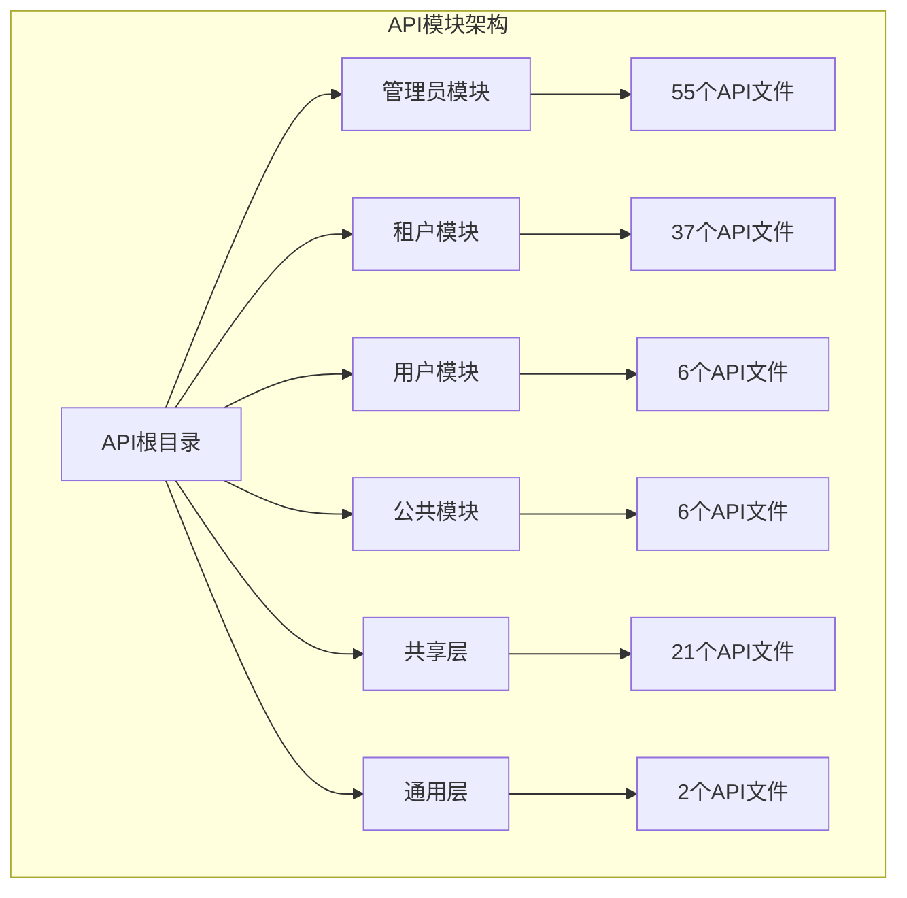

**图表来源**
- [backend/app/api/__init__.py](file://backend/app/api/__init__.py)
- [backend/app/api/admin/__init__.py](file://backend/app/api/admin/__init__.py)
- [backend/app/api/tenant/__init__.py](file://backend/app/api/tenant/__init__.py)
- [backend/app/api/user/__init__.py](file://backend/app/api/user/__init__.py)
- [backend/app/api/public/__init__.py](file://backend/app/api/public/__init__.py)
- [backend/app/api/shared/__init__.py](file://backend/app/api/shared/__init__.py)
- [backend/app/api/common/__init__.py](file://backend/app/api/common/__init__.py)

### 模块层次结构

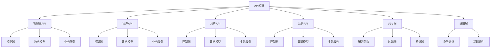

**章节来源**
- [backend/app/api/__init__.py](file://backend/app/api/__init__.py)
- [backend/app/api/admin/__init__.py](file://backend/app/api/admin/__init__.py)
- [backend/app/api/tenant/__init__.py](file://backend/app/api/tenant/__init__.py)
- [backend/app/api/user/__init__.py](file://backend/app/api/user/__init__.py)
- [backend/app/api/public/__init__.py](file://backend/app/api/public/__init__.py)
- [backend/app/api/shared/__init__.py](file://backend/app/api/shared/__init__.py)
- [backend/app/api/common/__init__.py](file://backend/app/api/common/__init__.py)

## 核心组件

### 角色驱动的API架构

系统采用基于角色的API设计模式，每个角色都有明确的权限边界和功能范围：

| 角色 | 权限范围 | 主要功能 | 安全级别 |
|------|----------|----------|----------|
| 管理员 | 系统级管理 | 用户管理、插件管理、系统配置、数据分析 | 最高 |
| 租户 | 租户级管理 | 租户内资源管理、用户权限、配置管理 | 高 |
| 用户 | 个人使用 | 聊天交互、个人设置、基本操作 | 中 |
| 公共 | 只读访问 | 健康检查、平台信息、公开数据 | 最低 |

### 模块职责边界

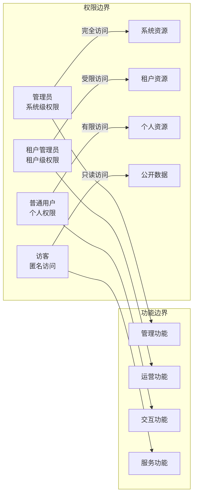

**章节来源**
- [backend/app/api/admin/agents.py](file://backend/app/api/admin/agents.py)
- [backend/app/api/tenant/agents.py](file://backend/app/api/tenant/agents.py)
- [backend/app/api/user/agent_chat.py](file://backend/app/api/user/agent_chat.py)
- [backend/app/api/public/platform.py](file://backend/app/api/public/platform.py)

## 架构概览

### 整体架构设计

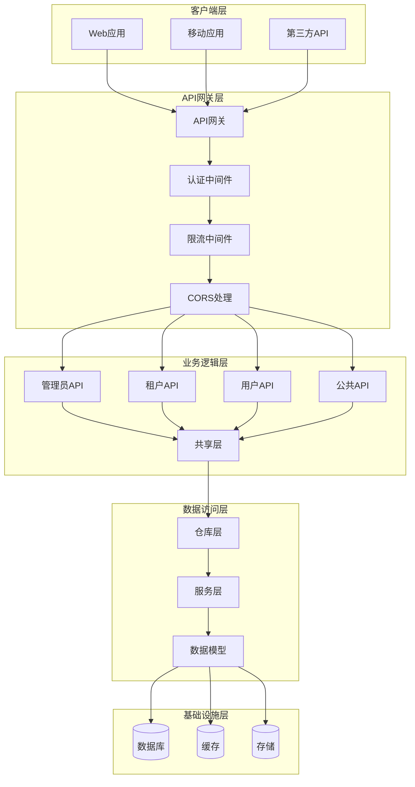

**图表来源**
- [backend/app/api/__init__.py](file://backend/app/api/__init__.py)
- [backend/app/api/admin/__init__.py](file://backend/app/api/admin/__init__.py)
- [backend/app/api/tenant/__init__.py](file://backend/app/api/tenant/__init__.py)
- [backend/app/api/user/__init__.py](file://backend/app/api/user/__init__.py)
- [backend/app/api/public/__init__.py](file://backend/app/api/public/__init__.py)
- [backend/app/api/shared/__init__.py](file://backend/app/api/shared/__init__.py)
- [backend/app/api/common/__init__.py](file://backend/app/api/common/__init__.py)

### 数据流架构

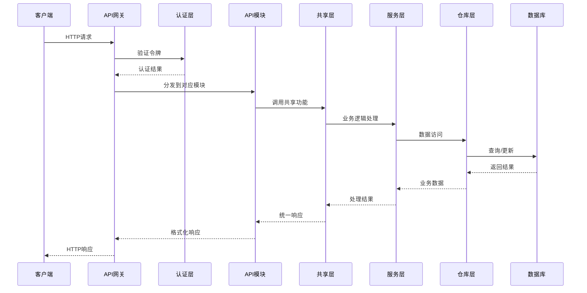

**图表来源**
- [backend/app/api/admin/agents.py](file://backend/app/api/admin/agents.py)
- [backend/app/api/tenant/agents.py](file://backend/app/api/tenant/agents.py)
- [backend/app/api/shared/_agent_helpers.py](file://backend/app/api/shared/_agent_helpers.py)

## 详细组件分析

### 管理员模块分析

管理员模块是系统的最高权限层，负责整个平台的管理和控制。

#### 核心功能模块

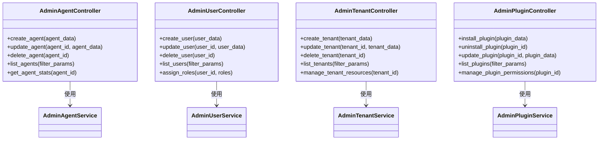

**图表来源**
- [backend/app/api/admin/agents.py](file://backend/app/api/admin/agents.py)
- [backend/app/api/admin/users.py](file://backend/app/api/admin/users.py)
- [backend/app/api/admin/tenants.py](file://backend/app/api/admin/tenants.py)
- [backend/app/api/admin/plugins.py](file://backend/app/api/admin/plugins.py)

#### 管理员模块职责

管理员模块包含以下核心职责：

1. **用户管理**: 创建、更新、删除系统用户，分配全局角色
2. **租户管理**: 管理所有租户的生命周期和资源配置
3. **插件管理**: 插件的安装、卸载、更新和权限控制
4. **系统监控**: 平台健康状态监控和数据分析
5. **配置管理**: 全局系统配置和策略设置

**章节来源**
- [backend/app/api/admin/agents.py](file://backend/app/api/admin/agents.py)
- [backend/app/api/admin/users.py](file://backend/app/api/admin/users.py)
- [backend/app/api/admin/tenants.py](file://backend/app/api/admin/tenants.py)
- [backend/app/api/admin/plugins.py](file://backend/app/api/admin/plugins.py)

### 租户模块分析

租户模块为每个租户提供独立的管理界面和功能。

#### 租户功能架构

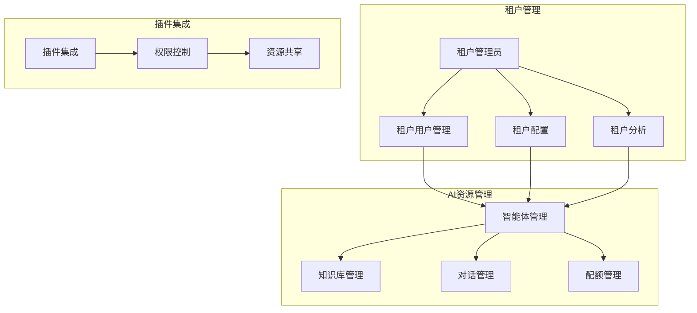

**图表来源**
- [backend/app/api/tenant/agents.py](file://backend/app/api/tenant/agents.py)
- [backend/app/api/tenant/users.py](file://backend/app/api/tenant/users.py)
- [backend/app/api/tenant/analytics.py](file://backend/app/api/tenant/analytics.py)

#### 租户模块特性

租户模块具有以下特点：

1. **隔离性**: 每个租户的数据和配置完全隔离
2. **可扩展性**: 支持动态扩展现有功能
3. **自定义性**: 允许租户自定义工作流程和规则
4. **监控性**: 提供详细的使用统计和分析报告

**章节来源**
- [backend/app/api/tenant/agents.py](file://backend/app/api/tenant/agents.py)
- [backend/app/api/tenant/users.py](file://backend/app/api/tenant/users.py)
- [backend/app/api/tenant/analytics.py](file://backend/app/api/tenant/analytics.py)

### 用户模块分析

用户模块专注于为最终用户提供核心功能体验。

#### 用户交互流程

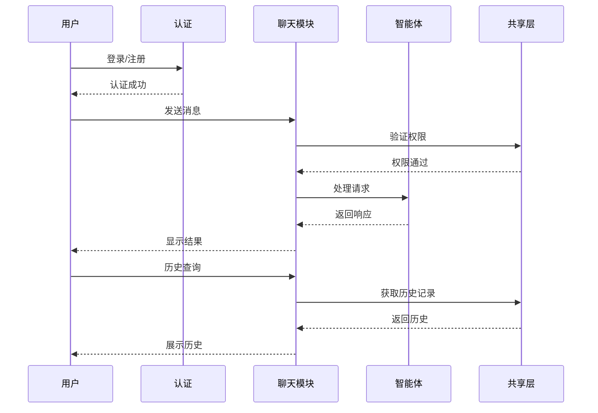

**图表来源**
- [backend/app/api/user/agent_chat.py](file://backend/app/api/user/agent_chat.py)
- [backend/app/api/shared/_agent_chat_helpers.py](file://backend/app/api/shared/_agent_chat_helpers.py)

#### 用户模块功能

用户模块提供以下核心功能：

1. **智能体聊天**: 与AI智能体进行自然语言对话
2. **历史记录**: 查看和管理之前的对话历史
3. **个性化设置**: 用户偏好和配置管理
4. **权限验证**: 基于角色的访问控制

**章节来源**
- [backend/app/api/user/agent_chat.py](file://backend/app/api/user/agent_chat.py)
- [backend/app/api/user/permissions.py](file://backend/app/api/user/permissions.py)

### 公共模块分析

公共模块提供系统对外的只读接口和服务。

#### 公共接口设计

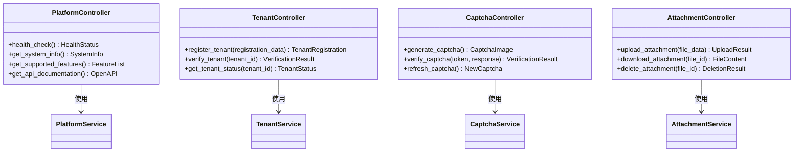

**图表来源**
- [backend/app/api/public/platform.py](file://backend/app/api/public/platform.py)
- [backend/app/api/public/tenant.py](file://backend/app/api/public/tenant.py)
- [backend/app/api/public/captcha.py](file://backend/app/api/public/captcha.py)

#### 公共模块特性

公共模块具有以下特性：

1. **只读访问**: 仅提供查询和获取数据的功能
2. **开放性**: 对外部系统和第三方集成友好
3. **稳定性**: 接口变更最小化，保证向后兼容
4. **安全性**: 包含必要的安全防护措施

**章节来源**
- [backend/app/api/public/platform.py](file://backend/app/api/public/platform.py)
- [backend/app/api/public/tenant.py](file://backend/app/api/public/tenant.py)
- [backend/app/api/public/captcha.py](file://backend/app/api/public/captcha.py)

### 共享层分析

共享层是所有API模块的通用功能集合，提供跨模块的复用能力。

#### 共享功能架构

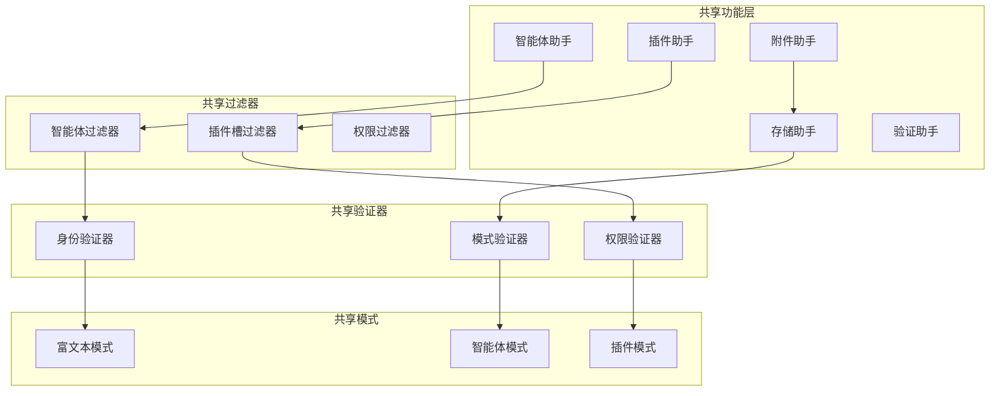

**图表来源**
- [backend/app/api/shared/_agent_helpers.py](file://backend/app/api/shared/_agent_helpers.py)
- [backend/app/api/shared/_attachment_helpers.py](file://backend/app/api/shared/_attachment_helpers.py)
- [backend/app/api/shared/_plugin_slot_filter.py](file://backend/app/api/shared/_plugin_slot_filter.py)
- [backend/app/api/shared/rich_text_ai_schemas.py](file://backend/app/api/shared/rich_text_ai_schemas.py)

#### 共享层职责

共享层承担以下职责：

1. **功能复用**: 提供跨模块的通用功能实现
2. **规则统一**: 确保各模块遵循一致的业务规则
3. **数据标准化**: 统一数据格式和验证标准
4. **性能优化**: 通过共享实现计算和存储优化

**章节来源**
- [backend/app/api/shared/_agent_helpers.py](file://backend/app/api/shared/_agent_helpers.py)
- [backend/app/api/shared/_attachment_helpers.py](file://backend/app/api/shared/_attachment_helpers.py)
- [backend/app/api/shared/_plugin_slot_filter.py](file://backend/app/api/shared/_plugin_slot_filter.py)
- [backend/app/api/shared/rich_text_ai_schemas.py](file://backend/app/api/shared/rich_text_ai_schemas.py)

## 依赖分析

### 模块间依赖关系

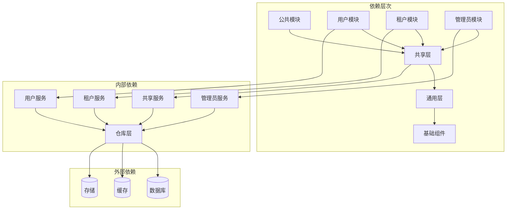

**图表来源**
- [backend/app/api/admin/__init__.py](file://backend/app/api/admin/__init__.py)
- [backend/app/api/tenant/__init__.py](file://backend/app/api/tenant/__init__.py)
- [backend/app/api/user/__init__.py](file://backend/app/api/user/__init__.py)
- [backend/app/api/public/__init__.py](file://backend/app/api/public/__init__.py)
- [backend/app/api/shared/__init__.py](file://backend/app/api/shared/__init__.py)
- [backend/app/api/common/__init__.py](file://backend/app/api/common/__init__.py)

### 导入导出机制

系统采用清晰的导入导出策略：

#### 导入策略

1. **模块导入**: 各模块通过`__init__.py`文件统一导出
2. **相对导入**: 在模块内部使用相对导入避免循环依赖
3. **延迟导入**: 对于重型依赖采用延迟导入优化启动时间

#### 导出策略

1. **接口暴露**: 通过`__all__`列表明确暴露公共接口
2. **版本兼容**: 保持向后兼容的API设计
3. **文档同步**: 自动化生成API文档

**章节来源**
- [backend/app/api/__init__.py](file://backend/app/api/__init__.py)
- [backend/app/api/admin/__init__.py](file://backend/app/api/admin/__init__.py)
- [backend/app/api/tenant/__init__.py](file://backend/app/api/tenant/__init__.py)
- [backend/app/api/user/__init__.py](file://backend/app/api/user/__init__.py)
- [backend/app/api/public/__init__.py](file://backend/app/api/public/__init__.py)
- [backend/app/api/shared/__init__.py](file://backend/app/api/shared/__init__.py)
- [backend/app/api/common/__init__.py](file://backend/app/api/common/__init__.py)

## 性能考虑

### 性能优化策略

1. **缓存策略**: 共享层实现多级缓存减少数据库查询
2. **批量操作**: 支持批量API调用提高效率
3. **异步处理**: 重要但非关键的操作采用异步执行
4. **连接池**: 数据库连接和HTTP连接池优化

### 扩展性设计

1. **微服务架构**: 模块间松耦合支持独立扩展
2. **插件系统**: 动态加载机制支持功能扩展
3. **配置驱动**: 通过配置文件调整行为而非代码修改
4. **水平扩展**: 支持多实例部署和负载均衡

## 故障排除指南

### 常见问题诊断

1. **权限相关错误**: 检查用户角色和权限配置
2. **模块导入失败**: 验证`__init__.py`文件和相对导入路径
3. **共享功能异常**: 确认共享层依赖和初始化顺序
4. **数据库连接问题**: 检查连接池配置和超时设置

### 调试技巧

1. **日志分析**: 启用详细日志追踪请求流程
2. **性能监控**: 使用指标监控各模块性能表现
3. **单元测试**: 编写针对特定模块的测试用例
4. **集成测试**: 验证模块间交互的正确性

**章节来源**
- [backend/app/api/common/identity.py](file://backend/app/api/common/identity.py)
- [backend/app/api/shared/_agent_helpers.py](file://backend/app/api/shared/_agent_helpers.py)

## 结论

该API模块组织结构体现了现代SaaS平台的最佳实践，通过基于角色的模块化设计实现了：

1. **清晰的职责分离**: 每个模块都有明确的功能边界
2. **良好的可维护性**: 模块间依赖关系清晰，便于维护
3. **强大的扩展性**: 支持新功能的快速集成和现有功能的演进
4. **优秀的性能表现**: 通过共享层和优化策略确保高效运行

这种架构为未来的功能扩展和技术演进奠定了坚实的基础。

## 附录

### 新模块添加流程

1. **需求分析**: 确定模块功能和权限要求
2. **架构设计**: 设计模块接口和依赖关系
3. **代码实现**: 遵循现有编码规范和模式
4. **测试验证**: 编写单元测试和集成测试
5. **文档更新**: 更新API文档和用户指南
6. **部署上线**: 通过CI/CD流程部署到生产环境

### 模块测试策略

1. **单元测试**: 每个函数和方法都应有对应的测试用例
2. **集成测试**: 测试模块间交互和数据流
3. **性能测试**: 验证在高负载下的表现
4. **安全测试**: 确保权限控制和数据保护有效
5. **回归测试**: 保证新功能不影响现有功能

### 命名规范

1. **模块命名**: 使用小写字母和下划线，如`admin_user_management`
2. **文件命名**: 采用模块名作为前缀，如`admin_user.py`
3. **类命名**: 使用帕斯卡命名法，如`AdminUserManager`
4. **函数命名**: 使用下划线命名法，如`validate_user_permission`
5. **变量命名**: 使用描述性名称，避免缩写