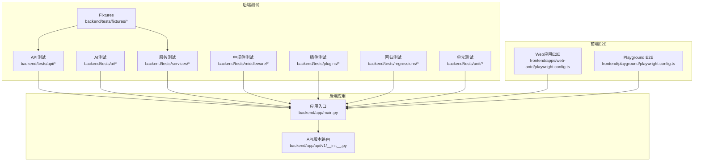
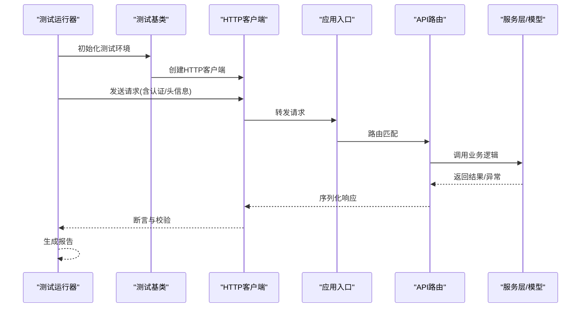
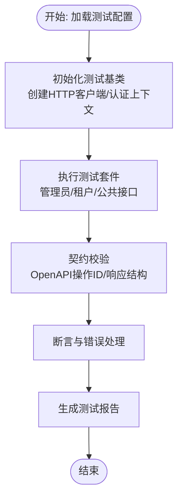
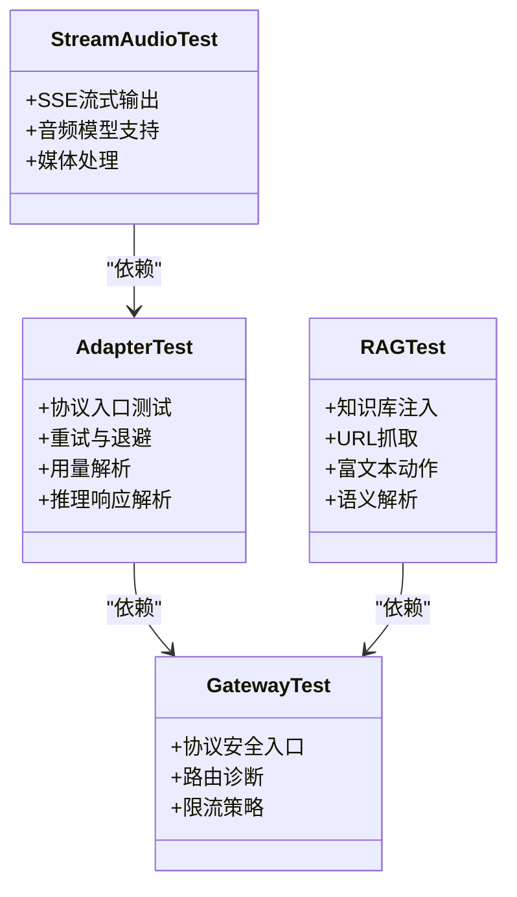
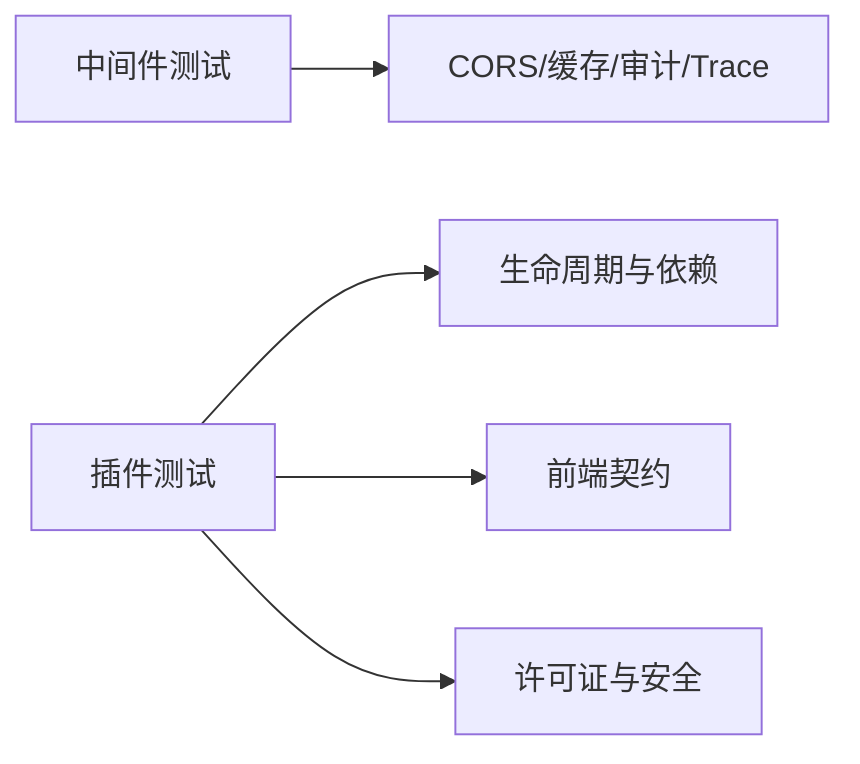
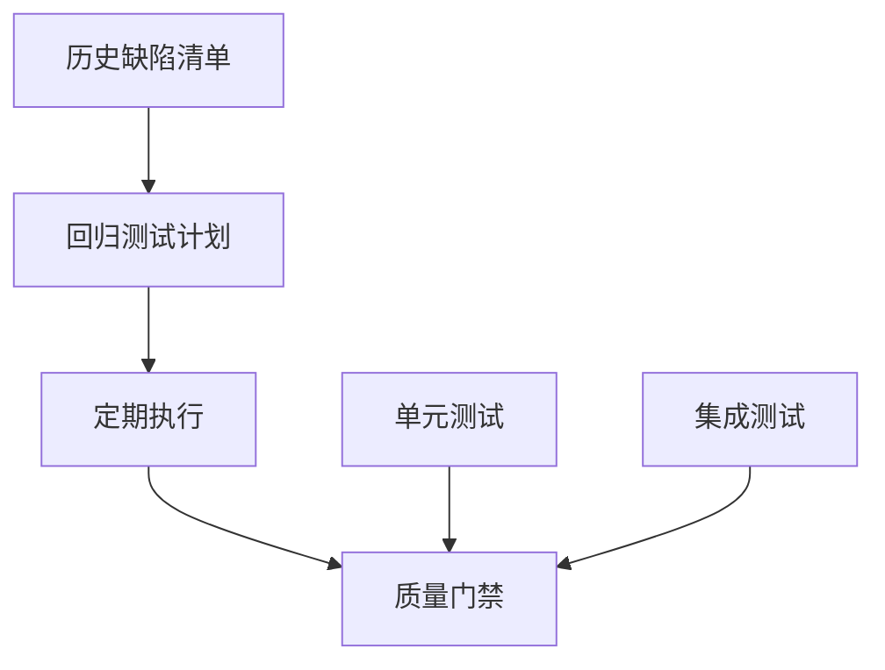
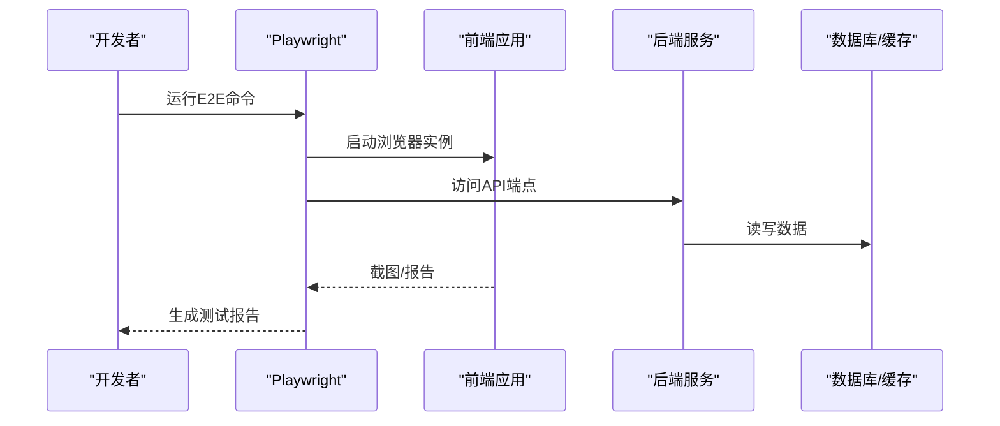
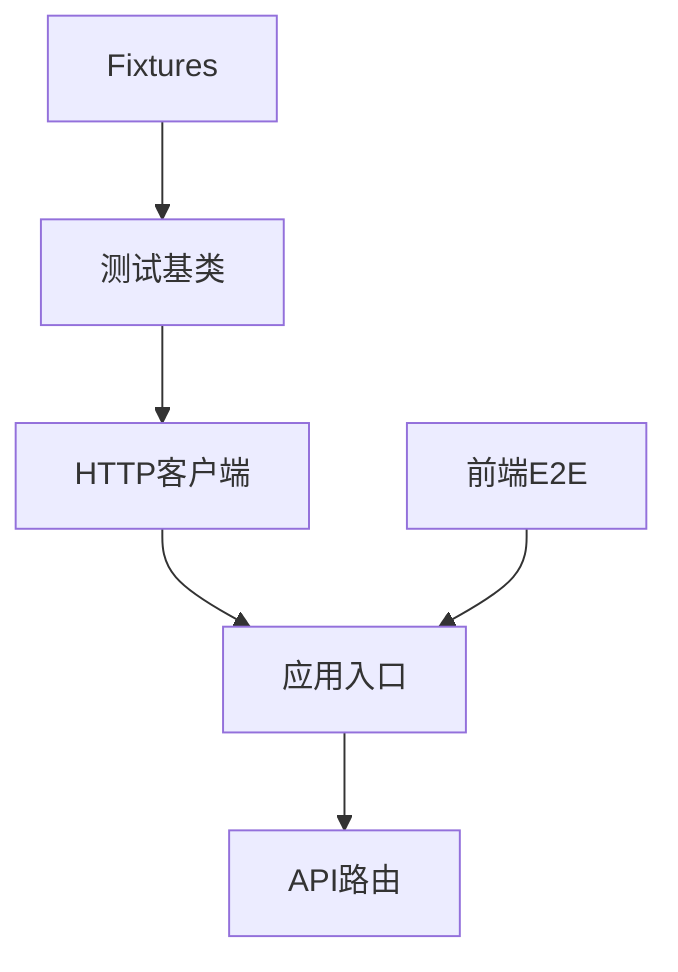

# API测试与调试

<cite>
**本文引用的文件**
- [backend/tests/api/base.py](file://backend/tests/api/base.py)
- [backend/tests/api/config.py](file://backend/tests/api/config.py)
- [backend/tests/api/run_all.py](file://backend/tests/api/run_all.py)
- [backend/tests/fixtures/](file://backend/tests/fixtures/)
- [backend/tests/regressions/](file://backend/tests/regressions/)
- [backend/tests/unit/](file://backend/tests/unit/)
- [backend/tests/services/](file://backend/tests/services/)
- [backend/tests/ai/](file://backend/tests/ai/)
- [backend/tests/middleware/](file://backend/tests/middleware/)
- [backend/tests/plugins/](file://backend/tests/plugins/)
- [backend/tests/integration/ai/](file://backend/tests/integration/ai/)
- [backend/app/main.py](file://backend/app/main.py)
- [backend/app/api/v1/__init__.py](file://backend/app/api/v1/__init__.py)
- [backend/pyproject.toml](file://backend/pyproject.toml)
- [backend/docker-compose.dev.yml](file://backend/docker-compose.dev.yml)
- [backend/docker-compose.prod.yml](file://backend/docker-compose.prod.yml)
- [frontend/apps/web-antd/playwright.config.ts](file://frontend/apps/web-antd/playwright.config.ts)
- [frontend/apps/web-antd/package.json](file://frontend/apps/web-antd/package.json)
- [frontend/playground/playwright.config.ts](file://frontend/playground/playwright.config.ts)
- [backend/alembic.ini](file://backend/alembic.ini)
- [backend/README.md](file://backend/README.md)
</cite>

## 目录
1. [引言](#引言)
2. [项目结构](#项目结构)
3. [核心组件](#核心组件)
4. [架构总览](#架构总览)
5. [详细组件分析](#详细组件分析)
6. [依赖关系分析](#依赖关系分析)
7. [性能考虑](#性能考虑)
8. [故障排查指南](#故障排查指南)
9. [结论](#结论)
10. [附录](#附录)

## 引言
本文件面向API测试与调试，系统性梳理后端Python应用的测试组织方式与实践规范，覆盖单元测试、集成测试、端到端测试（E2E）与回归测试策略；明确Mock数据配置、测试环境隔离与自动化流程；提供网络请求监控、响应数据验证与性能分析方法；并给出测试覆盖率要求、持续集成配置与测试报告生成建议。内容基于仓库中现有的测试目录与配置文件进行归纳总结，确保可操作与可落地。

## 项目结构
后端采用分层测试组织：按功能域划分（API、AI、服务、中间件、插件等），并提供统一的测试基类与配置入口。前端提供Playwright E2E测试配置，支持Web应用端到端验证。

**图表来源**
- [backend/tests/api/base.py](file://backend/tests/api/base.py)
- [backend/tests/api/config.py](file://backend/tests/api/config.py)
- [backend/tests/api/run_all.py](file://backend/tests/api/run_all.py)
- [backend/app/main.py](file://backend/app/main.py)
- [backend/app/api/v1/__init__.py](file://backend/app/api/v1/__init__.py)
- [frontend/apps/web-antd/playwright.config.ts](file://frontend/apps/web-antd/playwright.config.ts)
- [frontend/playground/playwright.config.ts](file://frontend/playground/playwright.config.ts)

**章节来源**
- [backend/tests/api/base.py](file://backend/tests/api/base.py)
- [backend/tests/api/config.py](file://backend/tests/api/config.py)
- [backend/tests/api/run_all.py](file://backend/tests/api/run_all.py)
- [backend/app/main.py](file://backend/app/main.py)
- [backend/app/api/v1/__init__.py](file://backend/app/api/v1/__init__.py)
- [frontend/apps/web-antd/playwright.config.ts](file://frontend/apps/web-antd/playwright.config.ts)
- [frontend/playground/playwright.config.ts](file://frontend/playground/playwright.config.ts)

## 核心组件
- 测试基类与客户端封装：通过统一的测试基类提供HTTP客户端、认证上下文、数据库清理与事务回滚等能力，便于在不同模块复用。
- API测试套件：覆盖管理员、租户、公共接口等多维度路由，确保OpenAPI契约一致性与业务逻辑正确性。
- 服务与AI测试：针对AI网关协议、适配器、RAG注入器、流式响应解析等进行协议级与行为级测试。
- 中间件与插件测试：验证跨域、审计日志、权限控制、插件生命周期与安全策略。
- 回归测试：对历史缺陷与关键路径进行长期回归，防止回归问题重现。
- 单元测试与集成测试：分别聚焦小范围逻辑验证与跨模块协作验证。
- Fixtures与Mock数据：集中管理测试数据与外部依赖Mock，保证测试稳定性与可重复性。
- 前端E2E：基于Playwright的端到端测试，覆盖用户交互流程与关键业务路径。

**章节来源**
- [backend/tests/api/base.py](file://backend/tests/api/base.py)
- [backend/tests/api/](file://backend/tests/api/)
- [backend/tests/services/](file://backend/tests/services/)
- [backend/tests/ai/](file://backend/tests/ai/)
- [backend/tests/middleware/](file://backend/tests/middleware/)
- [backend/tests/plugins/](file://backend/tests/plugins/)
- [backend/tests/regressions/](file://backend/tests/regressions/)
- [backend/tests/unit/](file://backend/tests/unit/)
- [backend/tests/fixtures/](file://backend/tests/fixtures/)

## 架构总览
下图展示测试执行的总体流程：测试框架加载配置与Fixtures，构造HTTP客户端，调用后端API或服务层，断言响应与副作用，并输出测试报告。

**图表来源**
- [backend/tests/api/base.py](file://backend/tests/api/base.py)
- [backend/app/main.py](file://backend/app/main.py)
- [backend/app/api/v1/__init__.py](file://backend/app/api/v1/__init__.py)

## 详细组件分析

### API测试组织与契约验证
- 统一基类：提供客户端初始化、认证上下文、数据库事务回滚、清理资源等通用能力，减少重复代码。
- 契约测试：通过OpenAPI操作ID一致性检查、路由返回结构校验等方式，确保API契约稳定。
- 管理员与租户接口：覆盖权限、领域模型与工作流的关键路径，确保RBAC与作用域约束生效。
- 公共接口：验证公开端点的可用性与兼容性，避免对外暴露面回归。

**图表来源**
- [backend/tests/api/base.py](file://backend/tests/api/base.py)
- [backend/tests/api/config.py](file://backend/tests/api/config.py)
- [backend/tests/api/run_all.py](file://backend/tests/api/run_all.py)

**章节来源**
- [backend/tests/api/base.py](file://backend/tests/api/base.py)
- [backend/tests/api/config.py](file://backend/tests/api/config.py)
- [backend/tests/api/run_all.py](file://backend/tests/api/run_all.py)

### 服务层与AI测试策略
- 协议适配器：验证OpenAI协议兼容性、重试机制、用量解析与推理响应解析。
- RAG与上下文：验证知识库注入、URL抓取、富文本动作契约与语义解析。
- 网关与路由：验证模型网关协议安全入口、路由诊断与限流策略。
- 流式与音频：验证SSE流式输出、音频模型支持与媒体处理。

**图表来源**
- [backend/tests/ai/adapters/](file://backend/tests/ai/adapters/)
- [backend/tests/ai/context/](file://backend/tests/ai/context/)
- [backend/tests/ai/engine/](file://backend/tests/ai/engine/)

**章节来源**
- [backend/tests/ai/adapters/](file://backend/tests/ai/adapters/)
- [backend/tests/ai/context/](file://backend/tests/ai/context/)
- [backend/tests/ai/engine/](file://backend/tests/ai/engine/)

### 中间件与插件测试
- 中间件：跨域、审计日志、权限控制、Trace链路传播等。
- 插件：生命周期、依赖运行时、前端契约、许可证与安全策略。

**图表来源**
- [backend/tests/middleware/](file://backend/tests/middleware/)
- [backend/tests/plugins/](file://backend/tests/plugins/)

**章节来源**
- [backend/tests/middleware/](file://backend/tests/middleware/)
- [backend/tests/plugins/](file://backend/tests/plugins/)

### 回归测试与单测策略
- 回归测试：对历史缺陷与关键路径进行长期回归，防止回归问题重现。
- 单元测试：聚焦小范围逻辑验证，配合Fixtures与Mock提升稳定性。
- 集成测试：验证跨模块协作与外部依赖行为。

**图表来源**
- [backend/tests/regressions/](file://backend/tests/regressions/)
- [backend/tests/unit/](file://backend/tests/unit/)
- [backend/tests/](file://backend/tests/)

**章节来源**
- [backend/tests/regressions/](file://backend/tests/regressions/)
- [backend/tests/unit/](file://backend/tests/unit/)
- [backend/tests/](file://backend/tests/)

### 端到端测试（E2E）
- Playwright配置：Web应用与Playground均提供独立的Playwright配置，支持浏览器驱动、超时与截图等参数。
- 自动化流程：结合后端Docker Compose开发/生产环境，启动测试前置服务（数据库、Redis、消息队列等），执行E2E脚本并收集报告。
- 场景覆盖：登录、租户管理、AI对话、插件市场等关键业务路径。

**图表来源**
- [frontend/apps/web-antd/playwright.config.ts](file://frontend/apps/web-antd/playwright.config.ts)
- [frontend/playground/playwright.config.ts](file://frontend/playground/playwright.config.ts)
- [backend/docker-compose.dev.yml](file://backend/docker-compose.dev.yml)
- [backend/docker-compose.prod.yml](file://backend/docker-compose.prod.yml)

**章节来源**
- [frontend/apps/web-antd/playwright.config.ts](file://frontend/apps/web-antd/playwright.config.ts)
- [frontend/playground/playwright.config.ts](file://frontend/playground/playwright.config.ts)
- [backend/docker-compose.dev.yml](file://backend/docker-compose.dev.yml)
- [backend/docker-compose.prod.yml](file://backend/docker-compose.prod.yml)

## 依赖关系分析
- 测试依赖于应用入口与API路由，确保端到端路径完整。
- Fixtures为API与服务测试提供稳定的Mock数据与外部依赖。
- 前端E2E依赖后端容器编排，实现环境隔离与可重复性。

**图表来源**
- [backend/tests/api/base.py](file://backend/tests/api/base.py)
- [backend/app/main.py](file://backend/app/main.py)
- [backend/app/api/v1/__init__.py](file://backend/app/api/v1/__init__.py)
- [backend/tests/fixtures/](file://backend/tests/fixtures/)
- [frontend/apps/web-antd/playwright.config.ts](file://frontend/apps/web-antd/playwright.config.ts)

**章节来源**
- [backend/tests/api/base.py](file://backend/tests/api/base.py)
- [backend/app/main.py](file://backend/app/main.py)
- [backend/app/api/v1/__init__.py](file://backend/app/api/v1/__init__.py)
- [backend/tests/fixtures/](file://backend/tests/fixtures/)
- [frontend/apps/web-antd/playwright.config.ts](file://frontend/apps/web-antd/playwright.config.ts)

## 性能考虑
- 测试并发与超时：合理设置HTTP客户端超时与并发数，避免测试抖动。
- Mock外部依赖：通过Fixtures与Mock减少真实外部服务调用，提升稳定性与速度。
- 数据库事务：在测试中使用事务回滚，避免脏数据影响后续用例。
- E2E资源：前端E2E应限制并发浏览器实例数量，避免资源争用。

## 故障排查指南
- 请求监控：通过中间件审计日志与Trace链路，定位请求耗时与异常。
- 响应验证：使用契约测试与断言组合，快速识别响应结构与状态码异常。
- 性能分析：结合Prometheus指标与应用日志，分析慢查询与瓶颈。
- 回归定位：利用回归测试与历史缺陷清单，快速定位回归根因。

**章节来源**
- [backend/tests/middleware/](file://backend/tests/middleware/)
- [backend/tests/api/base.py](file://backend/tests/api/base.py)

## 结论
本项目已形成较为完善的测试体系：以统一基类与配置为支撑，覆盖API、服务、AI、中间件、插件与回归测试；前端E2E通过Playwright与容器编排实现环境隔离与自动化。建议在现有基础上进一步完善覆盖率目标、CI流水线与报告聚合，持续提升测试质量与交付效率。

## 附录
- 测试覆盖率要求：建议后端达到关键路径与分支覆盖率门槛，前端E2E覆盖核心业务路径。
- 持续集成配置：在CI中集成后端pytest、前端Playwright与容器编排，统一输出测试报告。
- 测试报告生成：统一格式与存储位置，便于团队共享与审计。