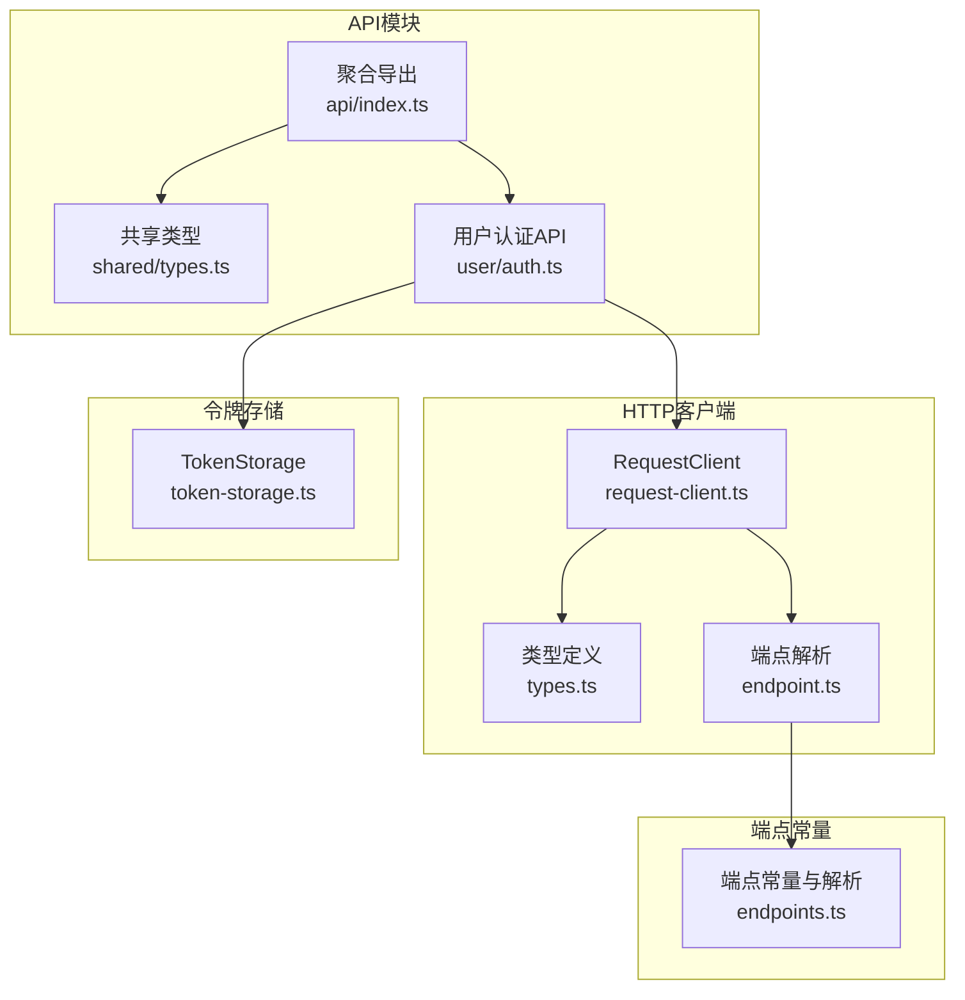
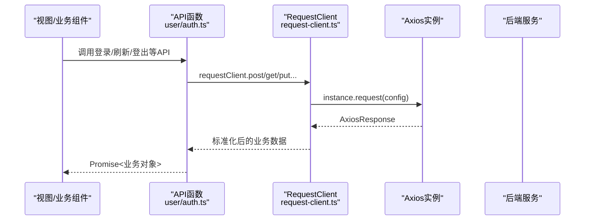
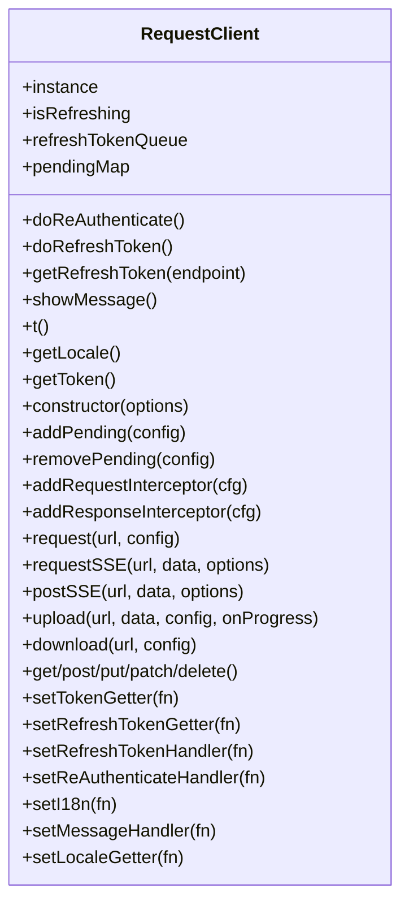
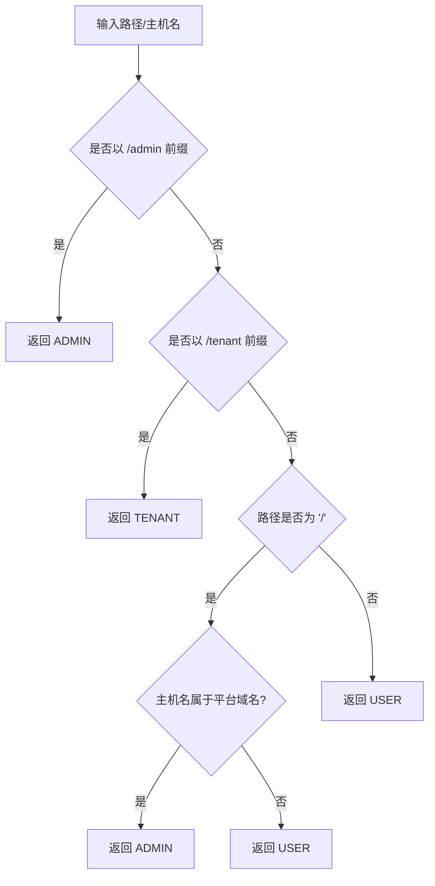
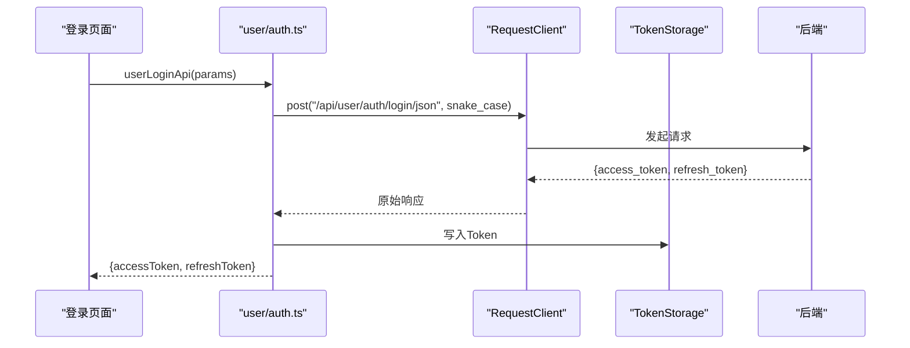
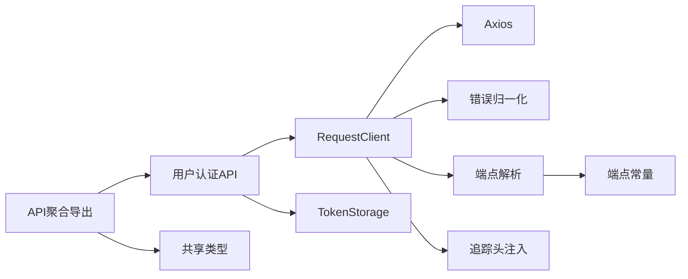

# API集成

<cite>
**本文引用的文件**
- [request-client.ts](file://frontend/apps/web-antd/src/utils/request/request-client.ts)
- [types.ts](file://frontend/apps/web-antd/src/utils/request/types.ts)
- [endpoint.ts](file://frontend/apps/web-antd/src/utils/request/endpoint.ts)
- [endpoints.ts](file://frontend/apps/web-antd/src/constants/endpoints.ts)
- [api/index.ts](file://frontend/apps/web-antd/src/api/index.ts)
- [shared/types.ts](file://frontend/apps/web-antd/src/api/shared/types.ts)
- [user/auth.ts](file://frontend/apps/web-antd/src/api/user/auth.ts)
- [token-storage.ts](file://frontend/apps/web-antd/src/store/shared/token-storage.ts)
- [request-client.test.ts](file://frontend/apps/web-antd/src/utils/request/__tests__/request-client.test.ts)
- [request-client.test.ts](file://frontend/packages/effects/request/src/request-client/request-client.test.ts)
</cite>

## 目录
1. [简介](#简介)
2. [项目结构](#项目结构)
3. [核心组件](#核心组件)
4. [架构总览](#架构总览)
5. [详细组件分析](#详细组件分析)
6. [依赖关系分析](#依赖关系分析)
7. [性能考量](#性能考量)
8. [故障排查指南](#故障排查指南)
9. [结论](#结论)
10. [附录](#附录)

## 简介
本文件面向NovusAI SaaS的前端团队与集成开发者，系统化梳理HTTP客户端架构、API模块组织、认证令牌管理、错误处理与重试机制、版本与端点管理、Mock与联调支持、请求缓存与并发控制、超时处理以及开发规范与性能监控方案。目标是帮助不同技术背景的读者快速理解并正确使用API集成层。

## 项目结构
前端API集成主要集中在以下位置：
- HTTP客户端与类型定义：frontend/apps/web-antd/src/utils/request
- 端点常量与解析：frontend/apps/web-antd/src/constants/endpoints.ts
- API模块聚合导出：frontend/apps/web-antd/src/api/index.ts
- 共享类型与工具：frontend/apps/web-antd/src/api/shared
- 用户端认证API：frontend/apps/web-antd/src/api/user/auth.ts
- 令牌存储：frontend/apps/web-antd/src/store/shared/token-storage.ts
- 单元测试：frontend/apps/web-antd/src/utils/request/__tests__/request-client.test.ts 与 packages/effects/request/src/request-client/request-client.test.ts



**图表来源**
- [request-client.ts:118-699](file://frontend/apps/web-antd/src/utils/request/request-client.ts#L118-L699)
- [types.ts:1-297](file://frontend/apps/web-antd/src/utils/request/types.ts#L1-L297)
- [endpoint.ts:1-16](file://frontend/apps/web-antd/src/utils/request/endpoint.ts#L1-L16)
- [endpoints.ts:1-321](file://frontend/apps/web-antd/src/constants/endpoints.ts#L1-L321)
- [api/index.ts:1-15](file://frontend/apps/web-antd/src/api/index.ts#L1-L15)
- [shared/types.ts:1-191](file://frontend/apps/web-antd/src/api/shared/types.ts#L1-L191)
- [user/auth.ts:1-476](file://frontend/apps/web-antd/src/api/user/auth.ts#L1-L476)
- [token-storage.ts](file://frontend/apps/web-antd/src/store/shared/token-storage.ts)

**章节来源**
- [api/index.ts:1-15](file://frontend/apps/web-antd/src/api/index.ts#L1-L15)
- [endpoints.ts:1-321](file://frontend/apps/web-antd/src/constants/endpoints.ts#L1-L321)

## 核心组件
- RequestClient类：基于Axios封装，提供统一的请求方法、拦截器、重复请求取消、加载态管理、业务错误处理、Token自动刷新、文件上传/下载、SSE流式请求等能力。
- 端点常量与解析：集中管理各端（平台管理、企业管理、用户）的路由/API前缀、登录与首页路径，并根据路径与主机名解析端类型。
- API模块：按端划分的API集合，通过聚合导出统一访问；共享类型定义跨端复用。
- 认证与令牌：用户端认证API负责登录、验证码发送/登录、刷新Token、登出、个人信息查询与更新；令牌存储负责持久化与读取。
- 类型系统：RequestOptions、ResponseReturn、ParamsSerializer、SseRequestOptions、UploadFileData等，确保请求行为与响应格式的一致性。

**章节来源**
- [request-client.ts:118-699](file://frontend/apps/web-antd/src/utils/request/request-client.ts#L118-L699)
- [types.ts:1-297](file://frontend/apps/web-antd/src/utils/request/types.ts#L1-L297)
- [endpoints.ts:1-321](file://frontend/apps/web-antd/src/constants/endpoints.ts#L1-L321)
- [shared/types.ts:1-191](file://frontend/apps/web-antd/src/api/shared/types.ts#L1-L191)
- [user/auth.ts:1-476](file://frontend/apps/web-antd/src/api/user/auth.ts#L1-L476)

## 架构总览
整体架构围绕“多端点、统一HTTP客户端、模块化API”的思路设计：
- RequestClient作为核心，统一处理请求/响应、拦截器、并发与重复请求、SSE、上传/下载、错误与国际化消息展示。
- 端点常量与解析模块负责将URL映射到端类型，从而决定Token获取、前缀拼接与国际化等行为。
- API模块按端拆分，内部通过RequestClient发起请求，对外暴露语义化的API函数。
- 认证API与令牌存储配合，实现登录、刷新、登出与Token持久化。



**图表来源**
- [user/auth.ts:30-154](file://frontend/apps/web-antd/src/api/user/auth.ts#L30-L154)
- [request-client.ts:356-381](file://frontend/apps/web-antd/src/utils/request/request-client.ts#L356-L381)

## 详细组件分析

### HTTP客户端：RequestClient
- 设计要点
  - 基于Axios创建实例，统一设置baseURL、timeout、默认Content-Type与参数序列化策略。
  - 提供addRequestInterceptor/addResponseInterceptor扩展拦截器链路。
  - 支持重复请求取消：通过请求键值（URL、方法、params、data、Authorization）去重，使用AbortController中断旧请求。
  - 加载态管理：通过拦截器统一处理loading状态（由上层业务控制）。
  - 业务错误处理：对标准响应格式进行解构，按code区分业务错误与HTTP错误，支持i18n消息与友好提示。
  - Token自动刷新：内置刷新队列与并发保护，支持401场景下的自动重试与重新认证。
  - 文件上传/下载：上传使用FormData，下载Blob时兼容后端返回JSON错误体。
  - SSE流式请求：独立的requestSSE实现，支持Authorization、Accept-Language、AbortController与消息分片处理。
- 关键方法与职责
  - request/requestSSE/upload/download：通用请求、SSE、上传、下载。
  - addPending/removePending：重复请求管理。
  - setTokenGetter/setRefreshTokenGetter/setRefreshTokenHandler/setReAuthenticateHandler：令牌与刷新链路注入。
  - setI18n/setMessageHandler/setLocaleGetter：国际化与消息展示注入。
- 错误处理与国际化
  - 通过normalizeHttpError/normalizeSseTransportError统一错误归一化，结合t函数与formatAppErrorMessage输出用户可读提示。
- 并发与重复请求
  - pendingMap + AbortController实现同构请求去重；刷新队列避免并发刷新导致的重复请求。



**图表来源**
- [request-client.ts:118-699](file://frontend/apps/web-antd/src/utils/request/request-client.ts#L118-L699)

**章节来源**
- [request-client.ts:118-699](file://frontend/apps/web-antd/src/utils/request/request-client.ts#L118-L699)
- [types.ts:1-297](file://frontend/apps/web-antd/src/utils/request/types.ts#L1-L297)

### 端点常量与解析：多端点架构
- 端点类型与前缀
  - 平台管理端（ADMIN）、企业管理端（TENANT）、用户端（USER），分别对应路由前缀与API前缀。
- 路径解析
  - 根据路径前缀判断端类型；根路径“/”根据主机名判定归属（平台域名走ADMIN，否则USER）。
  - 提供登录路径、首页路径解析与导航规范化，防止跨端跳转。
- 端点配置
  - ENDPOINT_CONFIGS集中维护端的名称、描述、前缀、登录与首页路径等。



**图表来源**
- [endpoints.ts:185-201](file://frontend/apps/web-antd/src/constants/endpoints.ts#L185-L201)

**章节来源**
- [endpoints.ts:1-321](file://frontend/apps/web-antd/src/constants/endpoints.ts#L1-L321)
- [endpoint.ts:1-16](file://frontend/apps/web-antd/src/utils/request/endpoint.ts#L1-L16)

### API模块组织与端点常量管理
- 聚合导出
  - api/index.ts统一导出adminApi、publicApi、shared、tenantApi、userApi，便于上层按需引入。
- 共享类型
  - shared/types.ts定义登录、刷新、用户信息、下拉选择等跨端通用类型，减少重复定义。
- 端点常量
  - constants/endpoints.ts提供端前缀、登录/首页路径、端配置与解析函数，贯穿请求构建与导航逻辑。

**章节来源**
- [api/index.ts:1-15](file://frontend/apps/web-antd/src/api/index.ts#L1-L15)
- [shared/types.ts:1-191](file://frontend/apps/web-antd/src/api/shared/types.ts#L1-L191)
- [endpoints.ts:1-321](file://frontend/apps/web-antd/src/constants/endpoints.ts#L1-L321)

### 认证令牌管理与API
- 认证API（用户端）
  - user/auth.ts提供登录（账号/验证码）、发送验证码、刷新Token、登出、获取/更新用户信息等。
  - 登录/验证码登录返回后端snake_case字段，转换为前端camelCase；刷新Token使用baseRequestClient避免401循环。
  - 登出使用baseRequestClient并带上当前Token头，失败不阻断主流程。
- 令牌存储
  - token-storage.ts负责Token的读取、写入与清理，配合RequestClient的setTokenGetter/setRefreshTokenGetter/setRefreshTokenHandler注入令牌链路。
- 请求参数标准化
  - API函数内部将前端参数转换为后端期望的snake_case字段，保证前后端契约一致。



**图表来源**
- [user/auth.ts:30-65](file://frontend/apps/web-antd/src/api/user/auth.ts#L30-L65)
- [token-storage.ts](file://frontend/apps/web-antd/src/store/shared/token-storage.ts)

**章节来源**
- [user/auth.ts:1-476](file://frontend/apps/web-antd/src/api/user/auth.ts#L1-L476)
- [token-storage.ts](file://frontend/apps/web-antd/src/store/shared/token-storage.ts)

### 错误处理策略与重试机制
- 错误归一化
  - HTTP错误与SSE传输错误通过normalizeHttpError/normalizeSseTransportError统一处理，结合国际化函数t输出用户提示。
- 业务错误与HTTP错误分离
  - 标准响应格式包含code/message/trace_id等，RequestClient按code判断业务错误，按HTTP状态判断网络/超时错误。
- 401自动刷新与重试
  - requestSSE在401时尝试刷新Token，若处于刷新中则排队等待，刷新成功后重试；若无法刷新则触发重新认证。
- 取消与兜底
  - 重复请求取消与AbortController中断；下载失败友好提示；登出异常静默处理。

```mermaid
flowchart TD
Start(["请求开始"]) --> Req["Axios请求"]
Req --> Resp{"响应状态"}
Resp --> |HTTP错误| NetErr["归一化网络错误"]
Resp --> |业务错误(code!=0)| BizErr["归一化业务错误"]
Resp --> |成功| Ok["返回业务数据"]
Resp --> |401(SSE)| CheckAuth{"是否认证错误码且可刷新?"}
CheckAuth --> |是| Refresh["刷新Token队列/并发保护"]
Refresh --> Retry["重试请求"]
CheckAuth --> |否| ReAuth["重新认证"]
Retry --> Ok
ReAuth --> NetErr
```

**图表来源**
- [request-client.ts:507-581](file://frontend/apps/web-antd/src/utils/request/request-client.ts#L507-L581)

**章节来源**
- [request-client.ts:200-216](file://frontend/apps/web-antd/src/utils/request/request-client.ts#L200-L216)
- [request-client.ts:327-501](file://frontend/apps/web-antd/src/utils/request/request-client.ts#L327-L501)

### 版本管理、Mock数据与联调环境
- 版本管理
  - 通过端点前缀（/api/user、/api/tenant、/api/admin）实现API版本隔离与路由分发。
- Mock与联调
  - packages/effects/request提供独立的RequestClient实现与测试用例，便于在联调阶段替换或扩展。
  - 建议在本地开发环境通过代理或Mock服务对接后端，保持与生产一致的请求形态。

**章节来源**
- [endpoints.ts:55-62](file://frontend/apps/web-antd/src/constants/endpoints.ts#L55-L62)
- [request-client.test.ts](file://frontend/packages/effects/request/src/request-client/request-client.test.ts)

### 请求缓存策略、并发控制与超时处理
- 缓存策略
  - 当前未见通用请求缓存实现；建议在业务层按GET请求参数构建缓存键，结合内存缓存或IndexedDB实现轻量缓存。
- 并发控制
  - 重复请求取消：pendingMap + AbortController，避免竞态与资源浪费。
  - 刷新队列：isRefreshing + refreshTokenQueue，串行化Token刷新，避免并发刷新风暴。
- 超时处理
  - Axios实例默认timeout可配置；SSE场景通过AbortController与信号中断实现可控取消。

**章节来源**
- [request-client.ts:158-179](file://frontend/apps/web-antd/src/utils/request/request-client.ts#L158-L179)
- [request-client.ts:182-194](file://frontend/apps/web-antd/src/utils/request/request-client.ts#L182-L194)
- [request-client.ts:556-574](file://frontend/apps/web-antd/src/utils/request/request-client.ts#L556-L574)

## 依赖关系分析
- RequestClient依赖Axios与自定义错误归一化、端点解析、追踪头注入等工具。
- API模块依赖RequestClient与共享类型；认证API依赖令牌存储。
- 端点解析依赖常量与运行时主机名/路径信息。



**图表来源**
- [request-client.ts:44-56](file://frontend/apps/web-antd/src/utils/request/request-client.ts#L44-L56)
- [user/auth.ts:19-20](file://frontend/apps/web-antd/src/api/user/auth.ts#L19-L20)
- [api/index.ts:1-15](file://frontend/apps/web-antd/src/api/index.ts#L1-L15)
- [shared/types.ts:1-191](file://frontend/apps/web-antd/src/api/shared/types.ts#L1-L191)
- [endpoint.ts:1-16](file://frontend/apps/web-antd/src/utils/request/endpoint.ts#L1-L16)
- [endpoints.ts:1-321](file://frontend/apps/web-antd/src/constants/endpoints.ts#L1-L321)

**章节来源**
- [request-client.ts:1-699](file://frontend/apps/web-antd/src/utils/request/request-client.ts#L1-L699)
- [user/auth.ts:1-476](file://frontend/apps/web-antd/src/api/user/auth.ts#L1-L476)
- [api/index.ts:1-15](file://frontend/apps/web-antd/src/api/index.ts#L1-L15)

## 性能考量
- 请求去重与并发控制：利用重复请求取消与刷新队列降低无效请求与并发风暴。
- 参数序列化：统一数组参数序列化策略，减少后端解析差异带来的性能损耗。
- SSE流式处理：按块解码与逐帧回调，避免一次性缓冲大文本。
- 超时与中断：合理设置timeout与AbortController，避免长时间挂起占用资源。
- 缓存建议：对高频只读接口（如字典、配置）实施轻量缓存，结合失效策略与手动刷新。

## 故障排查指南
- 常见问题定位
  - 401未刷新：确认doRefreshToken与getRefreshToken已注入，检查刷新队列是否被阻塞。
  - 重复请求堆积：检查cancelDuplicateRequest与pendingMap清理逻辑。
  - 下载失败：确认下载请求的raw模式与Blob/JSON错误体识别。
  - SSE中断：检查AbortController与onError回调，关注网络波动与后端断连。
- 日志与追踪
  - 使用ensureTraceIdHeader确保每条请求具备trace_id，便于后端与前端串联日志。
- 单元测试
  - 参考request-client.test.ts与packages/effects/request的测试用例，覆盖请求/响应拦截、SSE、上传/下载、错误归一化等场景。

**章节来源**
- [request-client.ts:230-285](file://frontend/apps/web-antd/src/utils/request/request-client.ts#L230-L285)
- [request-client.ts:327-501](file://frontend/apps/web-antd/src/utils/request/request-client.ts#L327-L501)
- [request-client.test.ts](file://frontend/apps/web-antd/src/utils/request/__tests__/request-client.test.ts)
- [request-client.test.ts](file://frontend/packages/effects/request/src/request-client/request-client.test.ts)

## 结论
该API集成层以RequestClient为核心，结合多端点常量与解析、模块化API与共享类型，形成了高内聚、低耦合的前端HTTP抽象。通过拦截器、重复请求取消、Token刷新与SSE流式处理，满足了复杂业务场景下的可靠性与用户体验需求。建议在现有基础上补充通用缓存策略、完善Mock与联调工具链，并持续优化错误归一化与性能监控指标。

## 附录
- 开发规范
  - 请求参数：统一使用camelCase前端字段，内部转换为snake_case；必要时提供ApiRequestOptions控制loading、消息与超时。
  - 响应处理：遵循HttpResponse标准格式，业务错误与HTTP错误分离处理；SSE场景提供onMessage/onEnd/onError回调。
  - 端点前缀：严格使用constants/endpoints.ts提供的API前缀，避免硬编码路径。
- 接口测试
  - 基于request-client.test.ts与packages/effects/request测试用例，补充SSE、上传/下载、401重试等场景。
- 性能监控
  - 建议埋点记录请求耗时、失败率、SSE断连次数、Token刷新耗时与重复请求取消次数，结合trace_id进行端到端追踪。