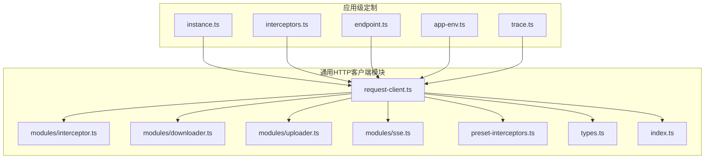
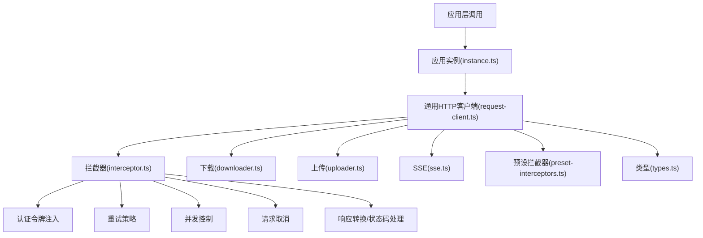
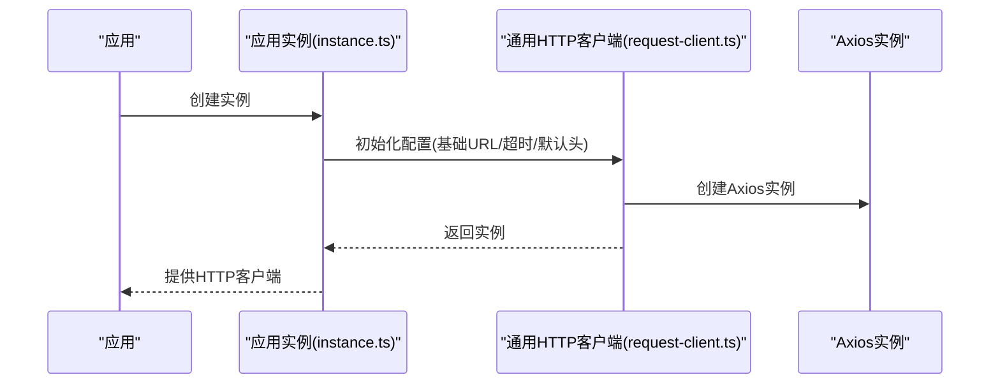
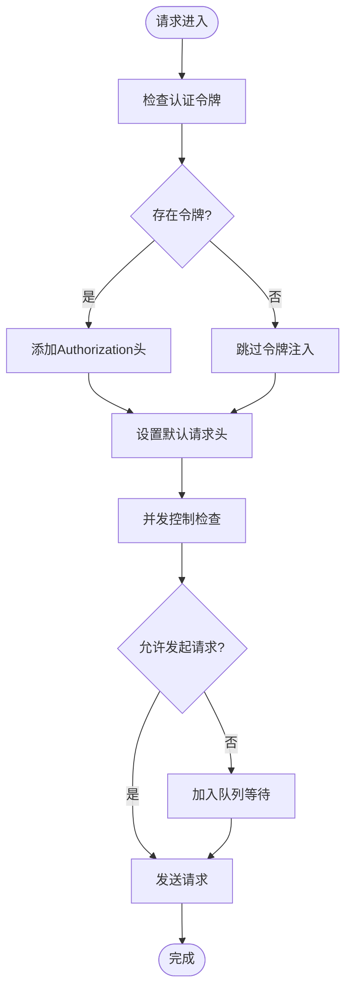
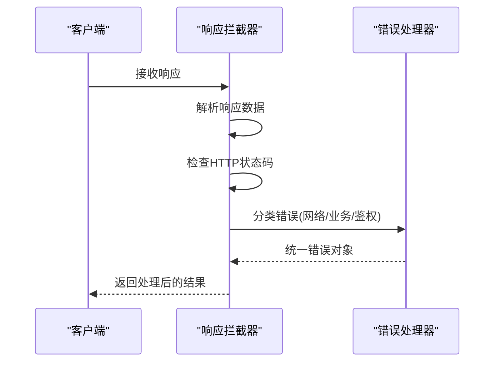
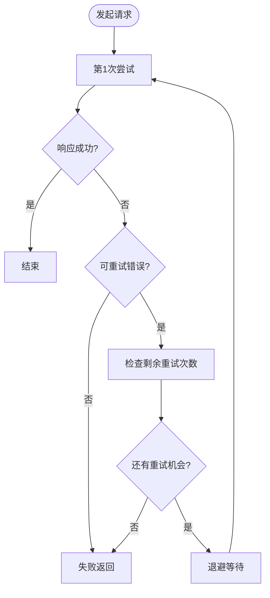
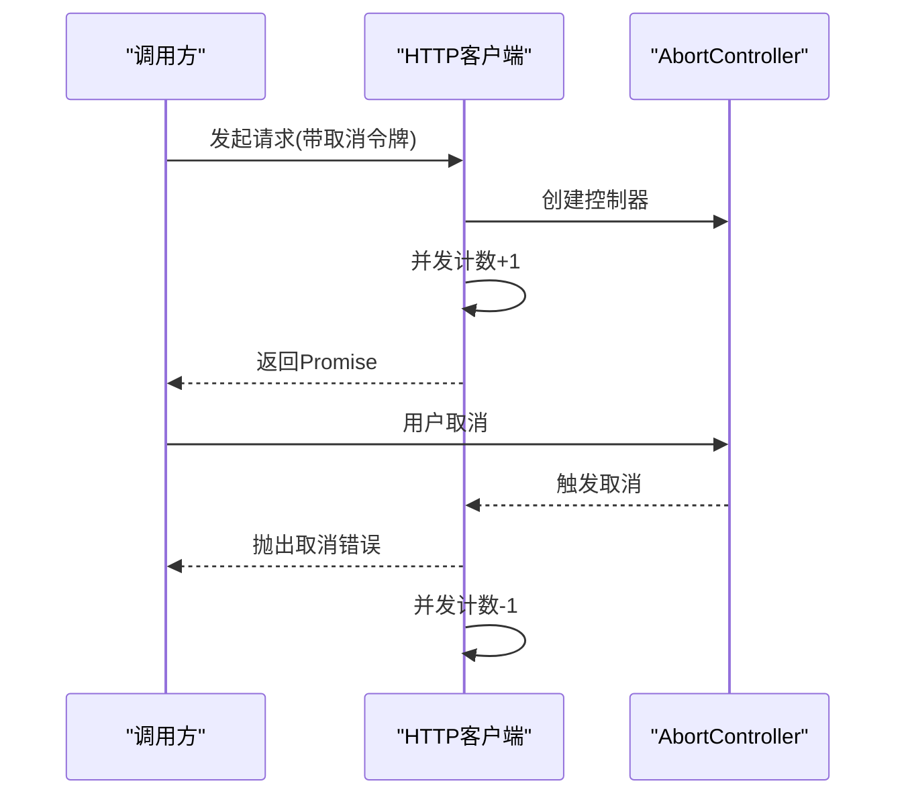
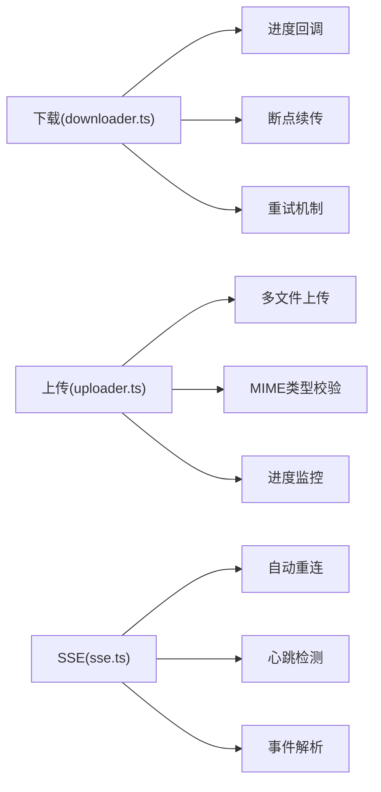
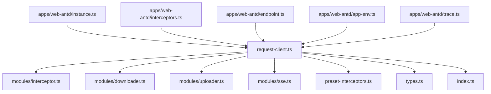

# HTTP客户端配置

<cite>
**本文档引用的文件**
- [request-client.ts](file://frontend/packages/effects/request/src/request-client/request-client.ts)
- [interceptor.ts](file://frontend/packages/effects/request/src/request-client/modules/interceptor.ts)
- [downloader.ts](file://frontend/packages/effects/request/src/request-client/modules/downloader.ts)
- [uploader.ts](file://frontend/packages/effects/request/src/request-client/modules/uploader.ts)
- [sse.ts](file://frontend/packages/effects/request/src/request-client/modules/sse.ts)
- [preset-interceptors.ts](file://frontend/packages/effects/request/src/request-client/preset-interceptors.ts)
- [types.ts](file://frontend/packages/effects/request/src/request-client/types.ts)
- [index.ts](file://frontend/packages/effects/request/src/request-client/index.ts)
- [instance.ts](file://frontend/apps/web-antd/src/utils/request/instance.ts)
- [interceptors.ts](file://frontend/apps/web-antd/src/utils/request/interceptors.ts)
- [endpoint.ts](file://frontend/apps/web-antd/src/utils/request/endpoint.ts)
- [app-env.ts](file://frontend/apps/web-antd/src/utils/request/app-env.ts)
- [trace.ts](file://frontend/apps/web-antd/src/utils/request/trace.ts)
- [request-client.test.ts](file://frontend/packages/effects/request/src/request-client/request-client.test.ts)
- [request-client.test.ts](file://frontend/apps/web-antd/src/utils/request/__tests__/request-client.test.ts)
</cite>

## 目录
1. [简介](#简介)
2. [项目结构](#项目结构)
3. [核心组件](#核心组件)
4. [架构概览](#架构概览)
5. [详细组件分析](#详细组件分析)
6. [依赖关系分析](#依赖关系分析)
7. [性能考量](#性能考量)
8. [故障排查指南](#故障排查指南)
9. [结论](#结论)

## 简介
本文件系统性地文档化了前端HTTP客户端的配置与实现，重点覆盖以下方面：
- Axios实例的创建与配置：基础URL、超时、请求头管理与默认选项
- 请求拦截器：认证令牌注入、请求预处理与请求头添加机制
- 响应拦截器：响应数据转换、错误处理与状态码处理
- 请求重试机制、并发控制与请求取消
- 安全考虑、性能优化与调试工具集成

该HTTP客户端采用模块化设计，既提供通用能力（位于effects包），也提供应用级定制（位于web-antd应用内）。

## 项目结构
HTTP客户端相关代码主要分布在两个位置：
- 通用模块：`frontend/packages/effects/request/src/request-client/`
- 应用定制：`frontend/apps/web-antd/src/utils/request/`

图表来源
- [request-client.ts:1-200](file://frontend/packages/effects/request/src/request-client/request-client.ts#L1-L200)
- [interceptor.ts:1-150](file://frontend/packages/effects/request/src/request-client/modules/interceptor.ts#L1-L150)
- [downloader.ts:1-120](file://frontend/packages/effects/request/src/request-client/modules/downloader.ts#L1-L120)
- [uploader.ts:1-120](file://frontend/packages/effects/request/src/request-client/modules/uploader.ts#L1-L120)
- [sse.ts:1-120](file://frontend/packages/effects/request/src/request-client/modules/sse.ts#L1-L120)
- [preset-interceptors.ts:1-100](file://frontend/packages/effects/request/src/request-client/preset-interceptors.ts#L1-L100)
- [types.ts:1-120](file://frontend/packages/effects/request/src/request-client/types.ts#L1-L120)
- [index.ts:1-80](file://frontend/packages/effects/request/src/request-client/index.ts#L1-L80)
- [instance.ts:1-120](file://frontend/apps/web-antd/src/utils/request/instance.ts#L1-L120)
- [interceptors.ts:1-200](file://frontend/apps/web-antd/src/utils/request/interceptors.ts#L1-L200)
- [endpoint.ts:1-100](file://frontend/apps/web-antd/src/utils/request/endpoint.ts#L1-L100)
- [app-env.ts:1-80](file://frontend/apps/web-antd/src/utils/request/app-env.ts#L1-L80)
- [trace.ts:1-100](file://frontend/apps/web-antd/src/utils/request/trace.ts#L1-L100)

章节来源
- [request-client.ts:1-200](file://frontend/packages/effects/request/src/request-client/request-client.ts#L1-L200)
- [instance.ts:1-120](file://frontend/apps/web-antd/src/utils/request/instance.ts#L1-L120)

## 核心组件
- 通用HTTP客户端：封装Axios实例、拦截器注册、下载/上传/SSE支持、类型定义与导出入口
- 应用级实例：在应用中创建Axios实例，注入环境变量、端点配置与拦截器
- 拦截器模块：统一处理请求/响应拦截逻辑，支持认证令牌、重试、并发控制等
- 下载/上传/SSE模块：提供文件下载、上传与服务端事件流的专用能力
- 预设拦截器：提供可复用的拦截器模板（如认证、重试、日志）

章节来源
- [request-client.ts:1-200](file://frontend/packages/effects/request/src/request-client/request-client.ts#L1-L200)
- [interceptor.ts:1-150](file://frontend/packages/effects/request/src/request-client/modules/interceptor.ts#L1-L150)
- [downloader.ts:1-120](file://frontend/packages/effects/request/src/request-client/modules/downloader.ts#L1-L120)
- [uploader.ts:1-120](file://frontend/packages/effects/request/src/request-client/modules/uploader.ts#L1-L120)
- [sse.ts:1-120](file://frontend/packages/effects/request/src/request-client/modules/sse.ts#L1-L120)
- [preset-interceptors.ts:1-100](file://frontend/packages/effects/request/src/request-client/preset-interceptors.ts#L1-L100)
- [types.ts:1-120](file://frontend/packages/effects/request/src/request-client/types.ts#L1-L120)
- [index.ts:1-80](file://frontend/packages/effects/request/src/request-client/index.ts#L1-L80)
- [instance.ts:1-120](file://frontend/apps/web-antd/src/utils/request/instance.ts#L1-L120)
- [interceptors.ts:1-200](file://frontend/apps/web-antd/src/utils/request/interceptors.ts#L1-L200)

## 架构概览
HTTP客户端采用“通用模块 + 应用定制”的分层架构：
- 通用模块提供Axios实例、拦截器与功能模块
- 应用定制通过instance.ts创建具体实例，注入端点、环境与拦截器
- 拦截器模块负责认证令牌注入、请求预处理、响应转换与错误处理
- 下载/上传/SSE模块提供专项能力，确保复杂场景下的稳定性与性能

图表来源
- [request-client.ts:1-200](file://frontend/packages/effects/request/src/request-client/request-client.ts#L1-L200)
- [interceptor.ts:1-150](file://frontend/packages/effects/request/src/request-client/modules/interceptor.ts#L1-L150)
- [downloader.ts:1-120](file://frontend/packages/effects/request/src/request-client/modules/downloader.ts#L1-L120)
- [uploader.ts:1-120](file://frontend/packages/effects/request/src/request-client/modules/uploader.ts#L1-L120)
- [sse.ts:1-120](file://frontend/packages/effects/request/src/request-client/modules/sse.ts#L1-L120)
- [preset-interceptors.ts:1-100](file://frontend/packages/effects/request/src/request-client/preset-interceptors.ts#L1-L100)
- [types.ts:1-120](file://frontend/packages/effects/request/src/request-client/types.ts#L1-L120)
- [instance.ts:1-120](file://frontend/apps/web-antd/src/utils/request/instance.ts#L1-L120)

## 详细组件分析

### Axios实例创建与配置
- 基础URL：通过应用环境配置与端点管理，动态决定API基础地址
- 超时配置：统一设置请求超时时间，避免长时间阻塞
- 请求头管理：集中设置Content-Type、Accept等默认头，并支持按需扩展
- 默认选项：统一的默认参数（如withCredentials、timeout等）

图表来源
- [instance.ts:1-120](file://frontend/apps/web-antd/src/utils/request/instance.ts#L1-L120)
- [request-client.ts:1-200](file://frontend/packages/effects/request/src/request-client/request-client.ts#L1-L200)

章节来源
- [instance.ts:1-120](file://frontend/apps/web-antd/src/utils/request/instance.ts#L1-L120)
- [app-env.ts:1-80](file://frontend/apps/web-antd/src/utils/request/app-env.ts#L1-L80)
- [endpoint.ts:1-100](file://frontend/apps/web-antd/src/utils/request/endpoint.ts#L1-L100)

### 请求拦截器实现
- 认证令牌注入：从安全存储获取令牌并注入到Authorization头
- 请求预处理：统一设置Content-Type、Accept、Tenant等头部信息
- 请求头添加机制：支持动态头（如Trace ID）与静态头组合
- 并发控制：限制同时请求数量，避免资源争用
- 请求取消：基于AbortController实现请求取消

图表来源
- [interceptor.ts:1-150](file://frontend/packages/effects/request/src/request-client/modules/interceptor.ts#L1-L150)
- [interceptors.ts:1-200](file://frontend/apps/web-antd/src/utils/request/interceptors.ts#L1-L200)

章节来源
- [interceptor.ts:1-150](file://frontend/packages/effects/request/src/request-client/modules/interceptor.ts#L1-L150)
- [interceptors.ts:1-200](file://frontend/apps/web-antd/src/utils/request/interceptors.ts#L1-L200)

### 响应拦截器设计
- 响应数据转换：统一解析响应体，处理JSON/文本/二进制等格式
- 错误处理：捕获网络异常、HTTP状态码错误并进行分类处理
- 状态码处理：对4xx/5xx等状态码进行统一映射与提示
- 日志记录：记录请求/响应关键信息，便于调试与审计

图表来源
- [interceptor.ts:1-150](file://frontend/packages/effects/request/src/request-client/modules/interceptor.ts#L1-L150)
- [interceptors.ts:1-200](file://frontend/apps/web-antd/src/utils/request/interceptors.ts#L1-L200)

章节来源
- [interceptor.ts:1-150](file://frontend/packages/effects/request/src/request-client/modules/interceptor.ts#L1-L150)
- [interceptors.ts:1-200](file://frontend/apps/web-antd/src/utils/request/interceptors.ts#L1-L200)

### 请求重试机制
- 触发条件：针对网络异常、超时或特定HTTP状态码触发重试
- 退避策略：指数退避或固定间隔，避免雪崩效应
- 最大重试次数：防止无限重试导致资源浪费
- 重试上下文：携带原始请求参数与元数据，确保一致性

图表来源
- [interceptor.ts:1-150](file://frontend/packages/effects/request/src/request-client/modules/interceptor.ts#L1-L150)
- [preset-interceptors.ts:1-100](file://frontend/packages/effects/request/src/request-client/preset-interceptors.ts#L1-L100)

章节来源
- [interceptor.ts:1-150](file://frontend/packages/effects/request/src/request-client/modules/interceptor.ts#L1-L150)
- [preset-interceptors.ts:1-100](file://frontend/packages/effects/request/src/request-client/preset-interceptors.ts#L1-L100)

### 并发控制与请求取消
- 并发控制：通过信号量或队列限制同时请求数量，保障系统稳定
- 请求取消：使用AbortController在组件卸载或用户取消时及时释放资源
- 取消传播：确保取消信号能正确传递到底层网络栈

图表来源
- [interceptor.ts:1-150](file://frontend/packages/effects/request/src/request-client/modules/interceptor.ts#L1-L150)
- [request-client.ts:1-200](file://frontend/packages/effects/request/src/request-client/request-client.ts#L1-L200)

章节来源
- [interceptor.ts:1-150](file://frontend/packages/effects/request/src/request-client/modules/interceptor.ts#L1-L150)
- [request-client.ts:1-200](file://frontend/packages/effects/request/src/request-client/request-client.ts#L1-L200)

### 下载/上传/SSE专项能力
- 下载：支持断点续传、进度回调、错误重试与取消
- 上传：支持多文件、进度监控、MIME类型校验与错误处理
- SSE：自动重连、事件解析、心跳检测与连接关闭

图表来源
- [downloader.ts:1-120](file://frontend/packages/effects/request/src/request-client/modules/downloader.ts#L1-L120)
- [uploader.ts:1-120](file://frontend/packages/effects/request/src/request-client/modules/uploader.ts#L1-L120)
- [sse.ts:1-120](file://frontend/packages/effects/request/src/request-client/modules/sse.ts#L1-L120)

章节来源
- [downloader.ts:1-120](file://frontend/packages/effects/request/src/request-client/modules/downloader.ts#L1-L120)
- [uploader.ts:1-120](file://frontend/packages/effects/request/src/request-client/modules/uploader.ts#L1-L120)
- [sse.ts:1-120](file://frontend/packages/effects/request/src/request-client/modules/sse.ts#L1-L120)

## 依赖关系分析
- 通用模块依赖关系清晰，内部模块解耦，便于测试与维护
- 应用定制通过instance.ts聚合通用能力，形成最终可用的HTTP客户端
- 类型定义集中在types.ts，确保跨模块一致的数据契约

图表来源
- [request-client.ts:1-200](file://frontend/packages/effects/request/src/request-client/request-client.ts#L1-L200)
- [index.ts:1-80](file://frontend/packages/effects/request/src/request-client/index.ts#L1-L80)
- [instance.ts:1-120](file://frontend/apps/web-antd/src/utils/request/instance.ts#L1-L120)
- [interceptors.ts:1-200](file://frontend/apps/web-antd/src/utils/request/interceptors.ts#L1-L200)
- [endpoint.ts:1-100](file://frontend/apps/web-antd/src/utils/request/endpoint.ts#L1-L100)
- [app-env.ts:1-80](file://frontend/apps/web-antd/src/utils/request/app-env.ts#L1-L80)
- [trace.ts:1-100](file://frontend/apps/web-antd/src/utils/request/trace.ts#L1-L100)

章节来源
- [index.ts:1-80](file://frontend/packages/effects/request/src/request-client/index.ts#L1-L80)
- [types.ts:1-120](file://frontend/packages/effects/request/src/request-client/types.ts#L1-L120)

## 性能考量
- 超时与重试：合理设置超时与重试策略，避免资源浪费与雪崩效应
- 并发控制：限制并发数量，结合队列策略平滑流量
- 请求取消：及时取消无用请求，减少内存占用与网络开销
- 缓存与压缩：根据业务场景启用缓存与Gzip压缩，降低带宽消耗
- 连接复用：利用Keep-Alive与连接池提升长连接场景性能

## 故障排查指南
- 调试工具集成：通过trace.ts输出请求/响应关键信息，辅助定位问题
- 错误分类：区分网络错误、业务错误与鉴权错误，采用不同处理策略
- 日志记录：在interceptors.ts中统一记录错误日志，便于审计与回溯
- 单元测试：request-client.test.ts与应用级测试覆盖核心流程，建议新增或完善测试用例

章节来源
- [trace.ts:1-100](file://frontend/apps/web-antd/src/utils/request/trace.ts#L1-L100)
- [interceptors.ts:1-200](file://frontend/apps/web-antd/src/utils/request/interceptors.ts#L1-L200)
- [request-client.test.ts:1-120](file://frontend/packages/effects/request/src/request-client/request-client.test.ts#L1-L120)
- [request-client.test.ts:1-120](file://frontend/apps/web-antd/src/utils/request/__tests__/request-client.test.ts#L1-L120)

## 结论
该HTTP客户端通过模块化设计实现了高内聚、低耦合的架构，既能满足通用场景需求，又能在应用层灵活定制。通过完善的拦截器体系、重试与并发控制机制以及下载/上传/SSE专项能力，能够有效提升系统的稳定性与用户体验。建议在生产环境中结合实际业务进一步细化超时与重试策略，并持续完善测试与监控体系。