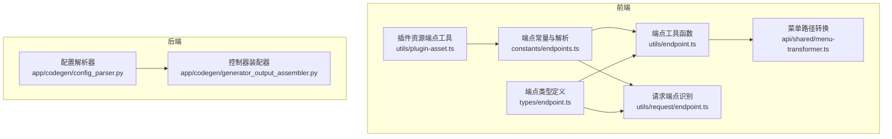
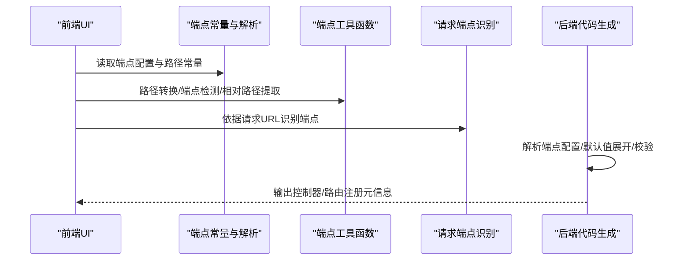
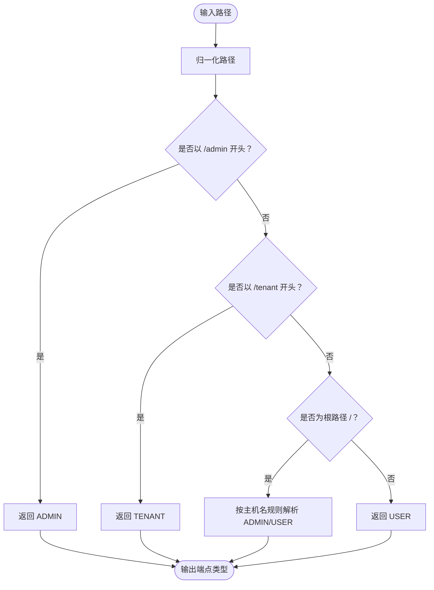
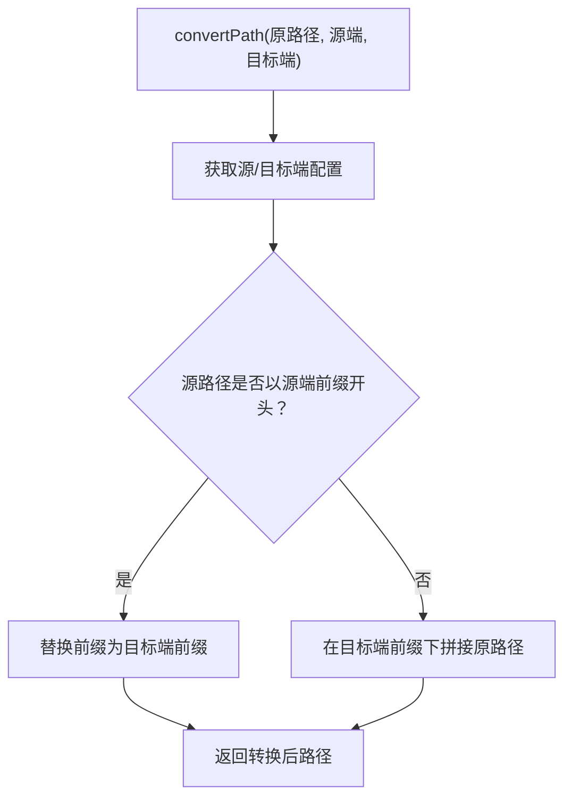
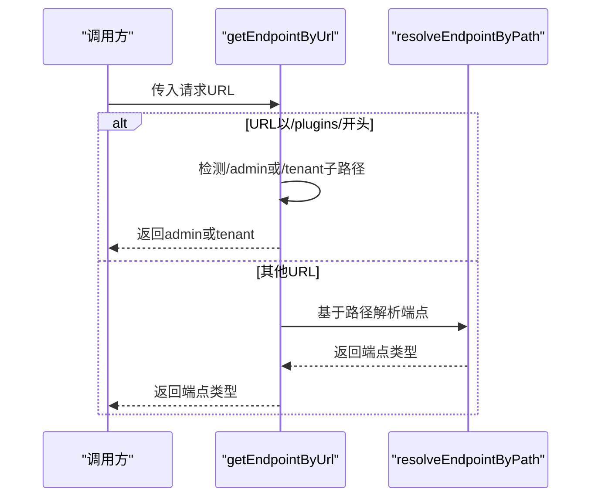
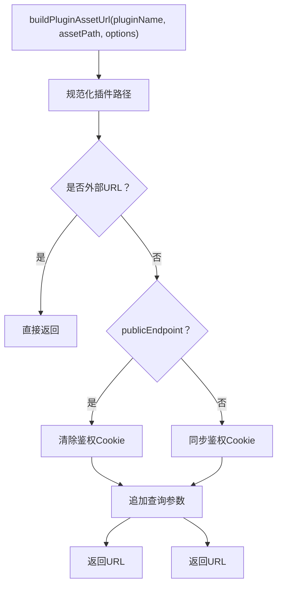
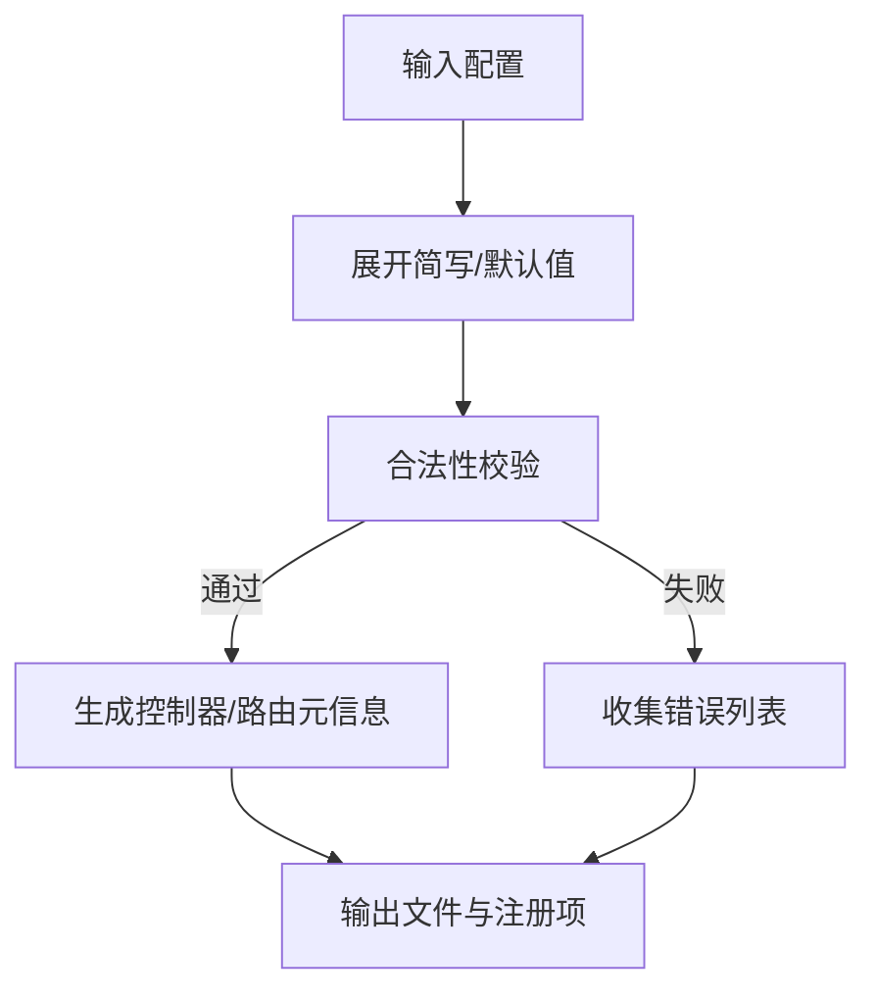
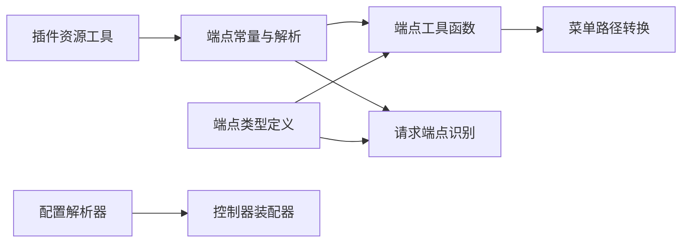

# 端点管理

<cite>
**本文引用的文件**
- [前端/端点常量与解析器](file://frontend/apps/web-antd/src/constants/endpoints.ts)
- [前端/端点工具函数](file://frontend/apps/web-antd/src/utils/endpoint.ts)
- [前端/请求端点识别](file://frontend/apps/web-antd/src/utils/request/endpoint.ts)
- [前端/端点类型定义](file://frontend/apps/web-antd/src/types/endpoint.ts)
- [前端/插件资源端点工具](file://frontend/apps/web-antd/src/utils/plugin-asset.ts)
- [后端/代码生成配置解析器](file://backend/app/codegen/config_parser.py)
- [后端/代码生成控制器装配器](file://backend/app/codegen/generator_output_assembler.py)
- [前端/菜单路径转换](file://frontend/apps/web-antd/src/api/shared/menu-transformer.ts)
</cite>

## 目录
1. [简介](#简介)
2. [项目结构](#项目结构)
3. [核心组件](#核心组件)
4. [架构总览](#架构总览)
5. [详细组件分析](#详细组件分析)
6. [依赖关系分析](#依赖关系分析)
7. [性能考量](#性能考量)
8. [故障排查指南](#故障排查指南)
9. [结论](#结论)
10. [附录](#附录)

## 简介
本文件系统性地梳理了多端架构下的“端点管理”体系，覆盖前端端点常量与解析、工具函数、请求端点识别，以及后端代码生成对端点的规范化处理。文档重点说明：
- 端点常量的定义与管理策略：URL 模板、查询参数与路径参数的标准化处理
- 端点工具函数：URL 构建、参数序列化与动态端点生成
- 端点版本管理、环境配置与代理设置
- 端点缓存策略、批量操作与端点验证机制
- 端点测试方法、联调环境配置与性能监控方案

## 项目结构
端点管理涉及前后端协同：
- 前端负责端点常量、路径解析、导航与请求端点识别
- 后端通过代码生成器对端点进行规范化、默认值展开与校验

图表来源
- [前端/端点常量与解析器:1-321](file://frontend/apps/web-antd/src/constants/endpoints.ts#L1-L321)
- [前端/端点工具函数:1-205](file://frontend/apps/web-antd/src/utils/endpoint.ts#L1-L205)
- [前端/请求端点识别:1-16](file://frontend/apps/web-antd/src/utils/request/endpoint.ts#L1-L16)
- [前端/端点类型定义:1-85](file://frontend/apps/web-antd/src/types/endpoint.ts#L1-L85)
- [前端/插件资源端点工具:274-345](file://frontend/apps/web-antd/src/utils/plugin-asset.ts#L274-L345)
- [后端/代码生成配置解析器:1-709](file://backend/app/codegen/config_parser.py#L1-L709)
- [后端/代码生成控制器装配器:269-305](file://backend/app/codegen/generator_output_assembler.py#L269-L305)

章节来源
- [前端/端点常量与解析器:1-321](file://frontend/apps/web-antd/src/constants/endpoints.ts#L1-L321)
- [前端/端点工具函数:1-205](file://frontend/apps/web-antd/src/utils/endpoint.ts#L1-L205)
- [前端/请求端点识别:1-16](file://frontend/apps/web-antd/src/utils/request/endpoint.ts#L1-L16)
- [前端/端点类型定义:1-85](file://frontend/apps/web-antd/src/types/endpoint.ts#L1-L85)
- [前端/插件资源端点工具:274-345](file://frontend/apps/web-antd/src/utils/plugin-asset.ts#L274-L345)
- [后端/代码生成配置解析器:1-709](file://backend/app/codegen/config_parser.py#L1-L709)
- [后端/代码生成控制器装配器:269-305](file://backend/app/codegen/generator_output_assembler.py#L269-L305)

## 核心组件
- 端点常量与解析器：集中管理路由前缀、登录页、首页、API 前缀，并提供基于路径与主机名的端点解析能力
- 端点工具函数：提供端点检测、路径转换、相对路径提取、端点迭代等工具
- 请求端点识别：根据请求 URL 动态判定端点类型，支持插件资源场景
- 端点类型定义：统一端点类型、配置接口与元数据结构
- 插件资源端点工具：面向插件资产的 URL 构建与鉴权头注入，支持跨端访问控制
- 代码生成配置解析器：对端点配置进行默认值展开、合法性校验与前端配置规范化

章节来源
- [前端/端点常量与解析器:1-321](file://frontend/apps/web-antd/src/constants/endpoints.ts#L1-L321)
- [前端/端点工具函数:1-205](file://frontend/apps/web-antd/src/utils/endpoint.ts#L1-L205)
- [前端/请求端点识别:1-16](file://frontend/apps/web-antd/src/utils/request/endpoint.ts#L1-L16)
- [前端/端点类型定义:1-85](file://frontend/apps/web-antd/src/types/endpoint.ts#L1-L85)
- [前端/插件资源端点工具:274-345](file://frontend/apps/web-antd/src/utils/plugin-asset.ts#L274-L345)
- [后端/代码生成配置解析器:1-709](file://backend/app/codegen/config_parser.py#L1-L709)

## 架构总览
多端架构的关键在于“端点常量 + 路径解析 + 工具函数”的协同：
- 常量层：统一管理各端的路由前缀、登录页、首页与 API 前缀
- 解析层：根据路径与主机名解析端点归属，支持根路径域名感知
- 工具层：提供路径转换、端点检测、端点遍历等实用函数
- 请求层：根据 URL 动态识别端点，确保请求路由正确
- 生成层：后端代码生成器对端点配置进行默认值展开与校验，保障一致性

图表来源
- [前端/端点常量与解析器:185-222](file://frontend/apps/web-antd/src/constants/endpoints.ts#L185-L222)
- [前端/端点工具函数:130-165](file://frontend/apps/web-antd/src/utils/endpoint.ts#L130-L165)
- [前端/请求端点识别:9-15](file://frontend/apps/web-antd/src/utils/request/endpoint.ts#L9-L15)
- [后端/代码生成配置解析器:208-239](file://backend/app/codegen/config_parser.py#L208-L239)

## 详细组件分析

### 前端：端点常量与解析器
- 路由前缀与路径映射：分别维护 ADMIN/TENANT/USER 的路由前缀、登录路径、首页路径与 API 前缀
- 域名感知解析：支持本地回环与平台域名白名单，根路径“/”按主机名归属 ADMIN 或 USER
- 路径解析与规范化：提供路径归一化、后缀分离、登录/首页路径解析与导航目标规范化

图表来源
- [前端/端点常量与解析器:185-201](file://frontend/apps/web-antd/src/constants/endpoints.ts#L185-L201)

章节来源
- [前端/端点常量与解析器:16-94](file://frontend/apps/web-antd/src/constants/endpoints.ts#L16-L94)
- [前端/端点常量与解析器:172-222](file://frontend/apps/web-antd/src/constants/endpoints.ts#L172-L222)

### 前端：端点工具函数
- 端点检测：根据路径判断是否属于 ADMIN/TENANT/USER
- 路径转换：在不同端之间转换路径（如 /admin → /tenant），支持无前缀路径自动补全
- 相对路径提取：去除端前缀，得到相对路径
- 端点遍历：对所有端执行回调或映射

图表来源
- [前端/端点工具函数:130-143](file://frontend/apps/web-antd/src/utils/endpoint.ts#L130-L143)

章节来源
- [前端/端点工具函数:31-77](file://frontend/apps/web-antd/src/utils/endpoint.ts#L31-L77)
- [前端/端点工具函数:130-165](file://frontend/apps/web-antd/src/utils/endpoint.ts#L130-L165)
- [前端/端点工具函数:177-197](file://frontend/apps/web-antd/src/utils/endpoint.ts#L177-L197)

### 前端：请求端点识别
- 通用解析：优先按路径前缀解析端点
- 插件资源特例：当 URL 以“/plugins/”开头时，依据子路径进一步判断 ADMIN/TENANT

图表来源
- [前端/请求端点识别:9-15](file://frontend/apps/web-antd/src/utils/request/endpoint.ts#L9-L15)
- [前端/端点常量与解析器:185-201](file://frontend/apps/web-antd/src/constants/endpoints.ts#L185-L201)

章节来源
- [前端/请求端点识别:1-16](file://frontend/apps/web-antd/src/utils/request/endpoint.ts#L1-L16)

### 前端：插件资源端点工具
- 插件资产 URL 构建：规范化插件资源路径，支持公共端点与私有端点模式
- 认证头注入：同步 Cookie、注入 Bearer Token、追加追踪 ID 头
- 缓存破坏参数：可选附加时间戳参数避免缓存

图表来源
- [前端/插件资源端点工具:307-330](file://frontend/apps/web-antd/src/utils/plugin-asset.ts#L307-L330)
- [前端/插件资源端点工具:281-305](file://frontend/apps/web-antd/src/utils/plugin-asset.ts#L281-L305)

章节来源
- [前端/插件资源端点工具:274-345](file://frontend/apps/web-antd/src/utils/plugin-asset.ts#L274-L345)

### 前端：菜单路径转换
- 将后端资源路径转换为带端前缀的前端路由路径，保证 ADMIN/TENANT 的前缀注入与 USER 端不加前缀

章节来源
- [前端/菜单路径转换:124-149](file://frontend/apps/web-antd/src/api/shared/menu-transformer.ts#L124-L149)

### 后端：代码生成配置解析与端点管理
- 默认值展开：为 endpoints 自动设置 scope、data_mode、route_prefix 等默认值，并规范化前端配置
- 合法性校验：对 scope、data_mode、base_class、前端配置等进行严格校验
- 控制器装配：根据端点 scope 生成对应域的控制器与路由注册元信息

图表来源
- [后端/代码生成配置解析器:208-239](file://backend/app/codegen/config_parser.py#L208-L239)
- [后端/代码生成配置解析器:393-445](file://backend/app/codegen/config_parser.py#L393-L445)
- [后端/代码生成控制器装配器:269-305](file://backend/app/codegen/generator_output_assembler.py#L269-L305)

章节来源
- [后端/代码生成配置解析器:208-239](file://backend/app/codegen/config_parser.py#L208-L239)
- [后端/代码生成配置解析器:393-445](file://backend/app/codegen/config_parser.py#L393-L445)
- [后端/代码生成控制器装配器:269-305](file://backend/app/codegen/generator_output_assembler.py#L269-L305)

## 依赖关系分析
- 前端端点工具函数依赖端点常量与解析器提供的配置与解析函数
- 请求端点识别依赖路径解析器
- 插件资源工具依赖当前端点状态与鉴权存储
- 后端代码生成器依赖端点配置的默认值与校验规则

图表来源
- [前端/端点常量与解析器:1-321](file://frontend/apps/web-antd/src/constants/endpoints.ts#L1-L321)
- [前端/端点工具函数:1-205](file://frontend/apps/web-antd/src/utils/endpoint.ts#L1-L205)
- [前端/请求端点识别:1-16](file://frontend/apps/web-antd/src/utils/request/endpoint.ts#L1-L16)
- [前端/端点类型定义:1-85](file://frontend/apps/web-antd/src/types/endpoint.ts#L1-L85)
- [前端/插件资源端点工具:274-345](file://frontend/apps/web-antd/src/utils/plugin-asset.ts#L274-L345)
- [后端/代码生成配置解析器:1-709](file://backend/app/codegen/config_parser.py#L1-L709)
- [后端/代码生成控制器装配器:269-305](file://backend/app/codegen/generator_output_assembler.py#L269-L305)

章节来源
- [前端/端点常量与解析器:1-321](file://frontend/apps/web-antd/src/constants/endpoints.ts#L1-L321)
- [前端/端点工具函数:1-205](file://frontend/apps/web-antd/src/utils/endpoint.ts#L1-L205)
- [前端/请求端点识别:1-16](file://frontend/apps/web-antd/src/utils/request/endpoint.ts#L1-L16)
- [前端/端点类型定义:1-85](file://frontend/apps/web-antd/src/types/endpoint.ts#L1-L85)
- [前端/插件资源端点工具:274-345](file://frontend/apps/web-antd/src/utils/plugin-asset.ts#L274-L345)
- [后端/代码生成配置解析器:1-709](file://backend/app/codegen/config_parser.py#L1-L709)
- [后端/代码生成控制器装配器:269-305](file://backend/app/codegen/generator_output_assembler.py#L269-L305)

## 性能考量
- 路径解析与正则匹配：路径解析与正则匹配为 O(n) 操作，建议在高频调用处缓存解析结果
- URL 构建与参数序列化：插件资源 URL 构建与查询参数追加为轻量级操作，建议在批量构建时合并参数减少重复计算
- 端点遍历与映射：端点遍历为 O(1)（固定 3 个端），成本极低
- 代码生成阶段：后端配置解析与校验在生成阶段一次性完成，运行时无需重复校验

## 故障排查指南
- 路径解析异常
  - 症状：根路径“/”被错误解析为 USER
  - 排查：检查平台域名环境变量与本地回环主机名配置
  - 参考
    - [前端/端点常量与解析器:109-116](file://frontend/apps/web-antd/src/constants/endpoints.ts#L109-L116)
    - [前端/端点常量与解析器:172-179](file://frontend/apps/web-antd/src/constants/endpoints.ts#L172-L179)
- 路径转换错误
  - 症状：跨端转换后路径缺失前缀
  - 排查：确认源端前缀与目标端前缀配置一致
  - 参考
    - [前端/端点工具函数:130-143](file://frontend/apps/web-antd/src/utils/endpoint.ts#L130-L143)
- 插件资源鉴权失败
  - 症状：返回 401/403
  - 排查：确认 Cookie 同步、Token 注入与追踪 ID 头
  - 参考
    - [前端/插件资源端点工具:281-305](file://frontend/apps/web-antd/src/utils/plugin-asset.ts#L281-L305)
- 代码生成失败
  - 症状：scope/data_mode/base_class 校验错误
  - 排查：核对端点配置合法值与 BaseModel 使用限制
  - 参考
    - [后端/代码生成配置解析器:393-445](file://backend/app/codegen/config_parser.py#L393-L445)

章节来源
- [前端/端点常量与解析器:109-116](file://frontend/apps/web-antd/src/constants/endpoints.ts#L109-L116)
- [前端/端点常量与解析器:172-179](file://frontend/apps/web-antd/src/constants/endpoints.ts#L172-L179)
- [前端/端点工具函数:130-143](file://frontend/apps/web-antd/src/utils/endpoint.ts#L130-L143)
- [前端/插件资源端点工具:281-305](file://frontend/apps/web-antd/src/utils/plugin-asset.ts#L281-L305)
- [后端/代码生成配置解析器:393-445](file://backend/app/codegen/config_parser.py#L393-L445)

## 结论
多端架构下的端点管理通过“常量 + 解析 + 工具 + 生成”的闭环实现：
- 前端以常量与解析器为核心，提供稳定的端点识别与路径转换能力
- 工具函数与请求识别保障跨端导航与请求路由正确性
- 插件资源工具实现跨端访问控制与鉴权头注入
- 后端代码生成器确保端点配置的规范性与一致性
整体方案具备良好的扩展性与可维护性，适合在复杂多租户场景下稳定演进。

## 附录

### 端点常量与配置清单
- 路由前缀：ADMIN/TENANT/USER
- 登录路径：ADMIN/TENANT/USER
- 首页路径：ADMIN/TENANT/USER
- API 前缀：ADMIN/TENANT/USER
- 主机名规则：本地回环与平台域名白名单
- 导航目标规范化：防止跨端错跳

章节来源
- [前端/端点常量与解析器:16-94](file://frontend/apps/web-antd/src/constants/endpoints.ts#L16-L94)
- [前端/端点常量与解析器:172-222](file://frontend/apps/web-antd/src/constants/endpoints.ts#L172-L222)

### 端点版本管理与环境配置
- 版本管理：通过端点前缀与路径映射实现版本隔离与平滑迁移
- 环境配置：平台域名白名单通过环境变量注入，支持本地开发与生产差异化
- 代理设置：插件资源工具支持外部 URL 直连与公共端点模式，便于代理与 CDN 场景

章节来源
- [前端/端点常量与解析器:109-116](file://frontend/apps/web-antd/src/constants/endpoints.ts#L109-L116)
- [前端/插件资源端点工具:318-325](file://frontend/apps/web-antd/src/utils/plugin-asset.ts#L318-L325)

### 端点缓存策略、批量操作与验证机制
- 缓存策略：插件资源 URL 支持缓存破坏参数，避免浏览器缓存导致的资源不更新
- 批量操作：后端代码生成器对端点配置进行默认值展开与前端配置规范化，减少手写错误
- 验证机制：后端对 scope、data_mode、base_class 进行严格校验，生成阶段暴露问题

章节来源
- [前端/插件资源端点工具:274-278](file://frontend/apps/web-antd/src/utils/plugin-asset.ts#L274-L278)
- [后端/代码生成配置解析器:208-239](file://backend/app/codegen/config_parser.py#L208-L239)
- [后端/代码生成配置解析器:393-445](file://backend/app/codegen/config_parser.py#L393-L445)

### 端点测试方法、联调环境配置与性能监控
- 测试方法：针对路径解析、路径转换、请求端点识别与插件资源 URL 构建编写单元测试
- 联调环境：通过平台域名白名单与本地回环主机名模拟 ADMIN/USER 归属，验证导航与登录流程
- 性能监控：记录端点解析耗时与 URL 构建次数，定位热点路径与优化点

[本节为通用实践建议，不直接分析具体文件]