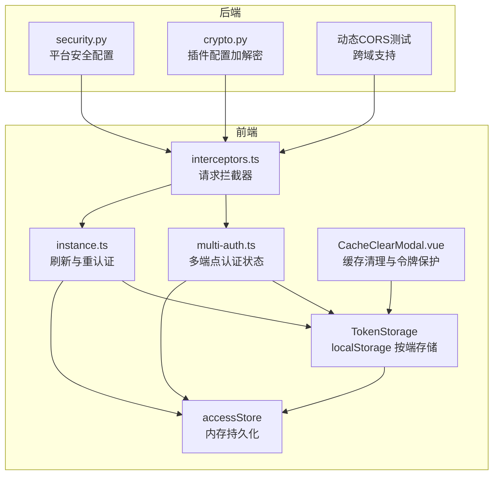
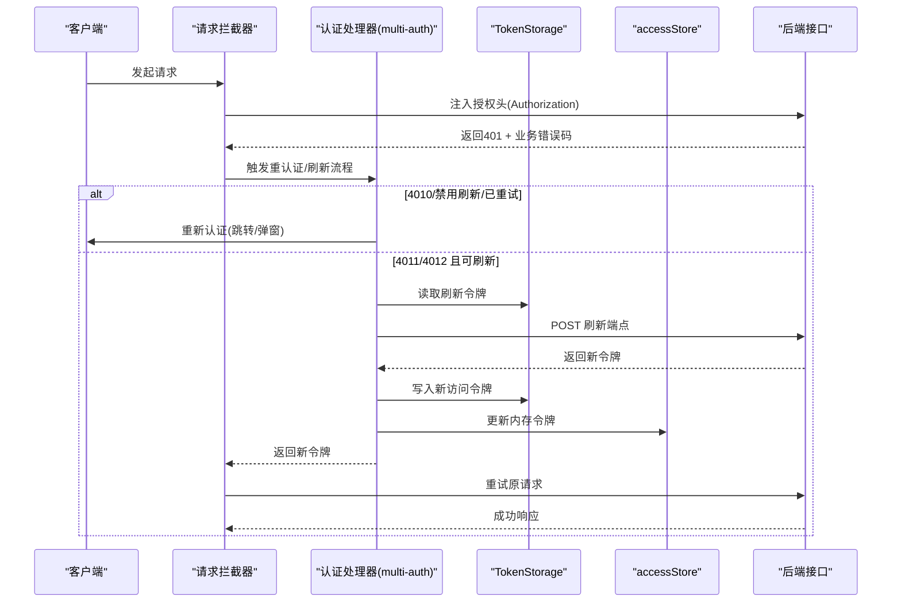
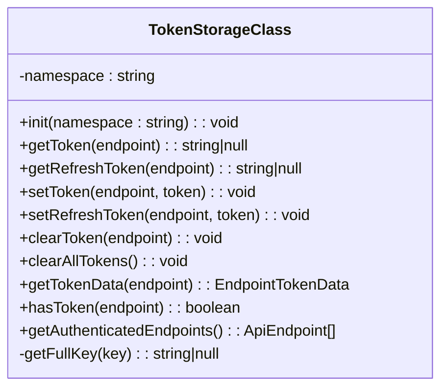
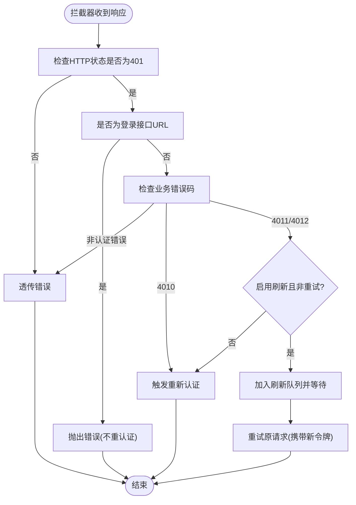
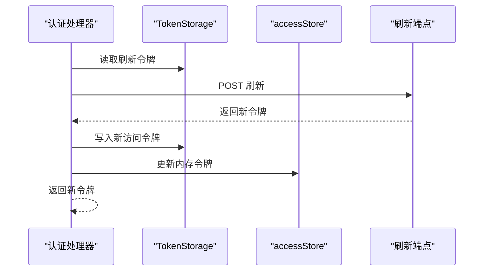
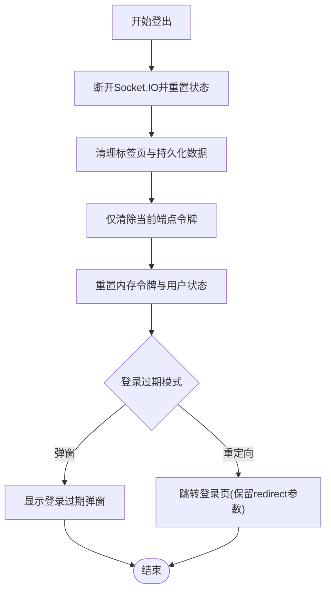
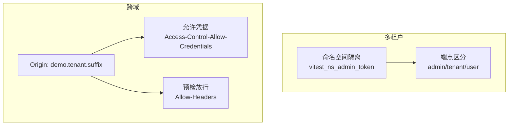
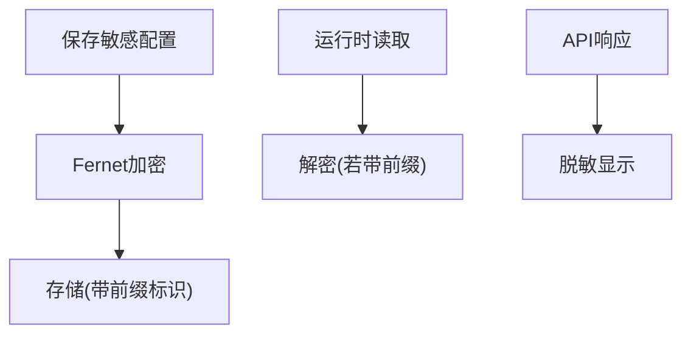
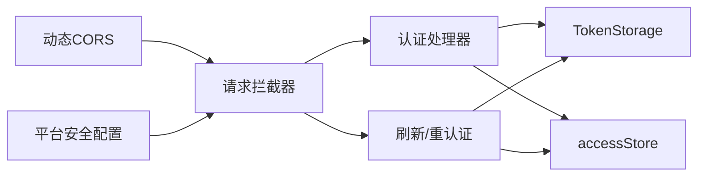

# 认证令牌管理

<cite>
**本文档引用的文件**
- [token-storage.ts](file://frontend/apps/web-antd/src/store/shared/token-storage.ts)
- [multi-auth.ts](file://frontend/apps/web-antd/src/store/shared/multi-auth.ts)
- [interceptors.ts](file://frontend/apps/web-antd/src/utils/request/interceptors.ts)
- [instance.ts](file://frontend/apps/web-antd/src/utils/request/instance.ts)
- [access.ts](file://frontend/packages/stores/src/modules/access.ts)
- [token-storage.test.ts](file://frontend/apps/web-antd/src/store/shared/__tests__/token-storage.test.ts)
- [CacheClearModal.vue](file://frontend/apps/web-antd/src/components/business/cache-clear-modal/CacheClearModal.vue)
- [security.py](file://backend/app/configs/definitions/platform/security.py)
- [crypto.py](file://backend/app/plugins/crypto.py)
- [test_dynamic_cors.py](file://backend/tests/middleware/test_dynamic_cors.py)
</cite>

## 目录
1. [简介](#简介)
2. [项目结构](#项目结构)
3. [核心组件](#核心组件)
4. [架构总览](#架构总览)
5. [详细组件分析](#详细组件分析)
6. [依赖关系分析](#依赖关系分析)
7. [性能考量](#性能考量)
8. [故障排查指南](#故障排查指南)
9. [结论](#结论)
10. [附录](#附录)

## 简介
本文件系统性地文档化前端认证令牌管理机制，涵盖以下方面：
- JWT 令牌的获取、存储与刷新流程
- localStorage 与内存存储的选择策略与边界
- 请求拦截器中的令牌注入、有效期检查与自动刷新
- 登出流程、令牌清理与安全过期处理
- 多租户环境下令牌管理差异、跨域认证与会话同步
- 令牌安全存储、加密策略与防篡改措施

## 项目结构
前端采用“按端分离”的状态管理模式，结合统一的请求客户端与拦截器体系，实现跨端点的认证令牌管理。

**图表来源**
- [token-storage.ts:81-229](file://frontend/apps/web-antd/src/store/shared/token-storage.ts#L81-L229)
- [access.ts:112-129](file://frontend/packages/stores/src/modules/access.ts#L112-L129)
- [multi-auth.ts:508-567](file://frontend/apps/web-antd/src/store/shared/multi-auth.ts#L508-L567)
- [interceptors.ts:333-375](file://frontend/apps/web-antd/src/utils/request/interceptors.ts#L333-L375)
- [instance.ts:115-160](file://frontend/apps/web-antd/src/utils/request/instance.ts#L115-L160)
- [CacheClearModal.vue:41-48](file://frontend/apps/web-antd/src/components/business/cache-clear-modal/CacheClearModal.vue#L41-L48)
- [security.py:1-290](file://backend/app/configs/definitions/platform/security.py#L1-L290)
- [crypto.py:1-110](file://backend/app/plugins/crypto.py#L1-L110)
- [test_dynamic_cors.py:57-122](file://backend/tests/middleware/test_dynamic_cors.py#L57-L122)

**章节来源**
- [token-storage.ts:81-229](file://frontend/apps/web-antd/src/store/shared/token-storage.ts#L81-L229)
- [access.ts:112-129](file://frontend/packages/stores/src/modules/access.ts#L112-L129)
- [multi-auth.ts:508-567](file://frontend/apps/web-antd/src/store/shared/multi-auth.ts#L508-L567)
- [interceptors.ts:333-375](file://frontend/apps/web-antd/src/utils/request/interceptors.ts#L333-L375)
- [instance.ts:115-160](file://frontend/apps/web-antd/src/utils/request/instance.ts#L115-L160)
- [CacheClearModal.vue:41-48](file://frontend/apps/web-antd/src/components/business/cache-clear-modal/CacheClearModal.vue#L41-L48)
- [security.py:1-290](file://backend/app/configs/definitions/platform/security.py#L1-L290)
- [crypto.py:1-110](file://backend/app/plugins/crypto.py#L1-L110)
- [test_dynamic_cors.py:57-122](file://backend/tests/middleware/test_dynamic_cors.py#L57-L122)

## 核心组件
- TokenStorage：基于 localStorage 的按端点令牌存储工具类，提供命名空间隔离与端点级读写。
- accessStore：内存状态管理，持久化保存访问令牌与刷新令牌，支持锁屏与登录过期标志。
- multi-auth：多端点认证状态与操作入口，负责登录、刷新、登出与状态查询。
- 请求拦截器：统一处理 401 与业务错误码，驱动自动重认证或令牌刷新。
- 刷新与重认证：通过刷新端点获取新令牌，并更新内存与本地存储。
- 缓存清理保护：在清理前端缓存时保留令牌相关键，避免误删导致的重复登录。

**章节来源**
- [token-storage.ts:81-229](file://frontend/apps/web-antd/src/store/shared/token-storage.ts#L81-L229)
- [access.ts:112-129](file://frontend/packages/stores/src/modules/access.ts#L112-L129)
- [multi-auth.ts:508-567](file://frontend/apps/web-antd/src/store/shared/multi-auth.ts#L508-L567)
- [interceptors.ts:333-375](file://frontend/apps/web-antd/src/utils/request/interceptors.ts#L333-L375)
- [instance.ts:115-160](file://frontend/apps/web-antd/src/utils/request/instance.ts#L115-L160)
- [CacheClearModal.vue:41-48](file://frontend/apps/web-antd/src/components/business/cache-clear-modal/CacheClearModal.vue#L41-L48)

## 架构总览
下图展示从请求发起到令牌刷新与登出的整体流程：

**图表来源**
- [interceptors.ts:333-375](file://frontend/apps/web-antd/src/utils/request/interceptors.ts#L333-L375)
- [instance.ts:115-160](file://frontend/apps/web-antd/src/utils/request/instance.ts#L115-L160)
- [multi-auth.ts:508-567](file://frontend/apps/web-antd/src/store/shared/multi-auth.ts#L508-L567)
- [token-storage.ts:81-229](file://frontend/apps/web-antd/src/store/shared/token-storage.ts#L81-L229)
- [access.ts:112-129](file://frontend/packages/stores/src/modules/access.ts#L112-L129)

## 详细组件分析

### 组件A：TokenStorage（按端点令牌存储）
- 设计要点
  - 使用命名空间前缀隔离不同租户/会话，避免键冲突。
  - 按端点(admin/tenant/user)分别存储访问令牌与刷新令牌。
  - 在未初始化命名空间时拒绝读写，保证安全边界。
- 关键行为
  - 初始化：在应用启动时调用初始化方法设置命名空间。
  - 读写：通过带命名空间的完整键进行读写。
  - 清理：支持按端点清理或全量清理。
- 安全与边界
  - 未初始化命名空间时输出警告并拒绝操作，防止误用。
  - 测试覆盖：验证命名空间前后的行为差异。

**图表来源**
- [token-storage.ts:81-229](file://frontend/apps/web-antd/src/store/shared/token-storage.ts#L81-L229)

**章节来源**
- [token-storage.ts:81-229](file://frontend/apps/web-antd/src/store/shared/token-storage.ts#L81-L229)
- [token-storage.test.ts:1-51](file://frontend/apps/web-antd/src/store/shared/__tests__/token-storage.test.ts#L1-L51)

### 组件B：请求拦截器与令牌注入
- 认证错误识别
  - HTTP 401 + 业务错误码 4010/4011/4012。
  - 登录接口的 401 不触发重认证，避免循环。
- 自动刷新流程
  - 若启用刷新且非重试请求：串行化刷新队列，等待刷新完成后再重试。
  - 若未启用刷新或已处于重试：直接触发重新认证。
- 令牌注入
  - 刷新成功后，将新令牌注入到请求头并重试原请求。

**图表来源**
- [interceptors.ts:333-375](file://frontend/apps/web-antd/src/utils/request/interceptors.ts#L333-L375)

**章节来源**
- [interceptors.ts:333-375](file://frontend/apps/web-antd/src/utils/request/interceptors.ts#L333-L375)

### 组件C：令牌刷新与重认证
- 刷新流程
  - 从 TokenStorage 读取对应端点的刷新令牌。
  - 调用后端刷新端点，接收新的访问令牌与可选刷新令牌。
  - 更新 TokenStorage 与 accessStore。
- 重认证流程
  - 当无刷新令牌或刷新失败时，根据配置选择弹窗或重定向至登录页。
  - 清理当前端点令牌与内存状态，重置用户信息与权限。

**图表来源**
- [instance.ts:115-160](file://frontend/apps/web-antd/src/utils/request/instance.ts#L115-L160)
- [multi-auth.ts:508-567](file://frontend/apps/web-antd/src/store/shared/multi-auth.ts#L508-L567)

**章节来源**
- [instance.ts:115-160](file://frontend/apps/web-antd/src/utils/request/instance.ts#L115-L160)
- [multi-auth.ts:508-567](file://frontend/apps/web-antd/src/store/shared/multi-auth.ts#L508-L567)

### 组件D：登出流程与令牌清理
- 登出步骤
  - 优先断开 Socket.IO 连接并重置相关状态。
  - 清理当前端点的令牌与内存状态。
  - 重置用户信息、权限与标签页缓存。
- 安全过期
  - 根据配置决定弹窗提示还是重定向登录。
  - 在公共根路径时不执行重定向，避免死循环。

**图表来源**
- [multi-auth.ts:373-410](file://frontend/apps/web-antd/src/store/shared/multi-auth.ts#L373-L410)
- [instance.ts:84-109](file://frontend/apps/web-antd/src/utils/request/instance.ts#L84-L109)

**章节来源**
- [multi-auth.ts:373-410](file://frontend/apps/web-antd/src/store/shared/multi-auth.ts#L373-L410)
- [instance.ts:84-109](file://frontend/apps/web-antd/src/utils/request/instance.ts#L84-L109)

### 组件E：多租户与跨域认证
- 多租户差异
  - TokenStorage 使用命名空间前缀区分不同租户的令牌键。
  - 登录路径与重定向根据端点类型自动选择。
- 跨域认证
  - 后端动态 CORS 支持租户子域名与自定义域名，确保凭据传递与预检放行。
  - 前端拦截器在跨域场景下保持 Authorization 头注入与刷新队列串行化。

**图表来源**
- [token-storage.ts:217-225](file://frontend/apps/web-antd/src/store/shared/token-storage.ts#L217-L225)
- [test_dynamic_cors.py:73-122](file://backend/tests/middleware/test_dynamic_cors.py#L73-L122)

**章节来源**
- [token-storage.ts:217-225](file://frontend/apps/web-antd/src/store/shared/token-storage.ts#L217-L225)
- [test_dynamic_cors.py:73-122](file://backend/tests/middleware/test_dynamic_cors.py#L73-L122)

### 组件F：令牌安全存储与防篡改
- 前端存储
  - 令牌以命名空间键形式存储于 localStorage，避免裸键污染。
  - 缓存清理对话框明确列出需保留的令牌键后缀，防止误删。
- 后端加密
  - 插件敏感配置采用 Fernet 对称加密，存储时加密、运行时解密、API 响应脱敏。
  - 平台安全配置包含会话超时、最大设备数等会话层面的安全策略。

**图表来源**
- [crypto.py:1-110](file://backend/app/plugins/crypto.py#L1-L110)
- [security.py:1-290](file://backend/app/configs/definitions/platform/security.py#L1-L290)

**章节来源**
- [CacheClearModal.vue:41-48](file://frontend/apps/web-antd/src/components/business/cache-clear-modal/CacheClearModal.vue#L41-L48)
- [crypto.py:1-110](file://backend/app/plugins/crypto.py#L1-L110)
- [security.py:1-290](file://backend/app/configs/definitions/platform/security.py#L1-L290)

## 依赖关系分析
- 组件耦合
  - TokenStorage 与 accessStore 双向协作：前者负责持久化，后者负责内存状态与持久化 pick。
  - 请求拦截器依赖认证处理器与 TokenStorage，形成刷新与重认证闭环。
- 外部依赖
  - 后端动态 CORS 保障跨域场景下的凭据传递。
  - 平台安全配置影响会话生命周期与并发策略。

**图表来源**
- [interceptors.ts:333-375](file://frontend/apps/web-antd/src/utils/request/interceptors.ts#L333-L375)
- [instance.ts:115-160](file://frontend/apps/web-antd/src/utils/request/instance.ts#L115-L160)
- [access.ts:112-129](file://frontend/packages/stores/src/modules/access.ts#L112-L129)
- [security.py:1-290](file://backend/app/configs/definitions/platform/security.py#L1-L290)
- [test_dynamic_cors.py:57-122](file://backend/tests/middleware/test_dynamic_cors.py#L57-L122)

**章节来源**
- [interceptors.ts:333-375](file://frontend/apps/web-antd/src/utils/request/interceptors.ts#L333-L375)
- [instance.ts:115-160](file://frontend/apps/web-antd/src/utils/request/instance.ts#L115-L160)
- [access.ts:112-129](file://frontend/packages/stores/src/modules/access.ts#L112-L129)
- [security.py:1-290](file://backend/app/configs/definitions/platform/security.py#L1-L290)
- [test_dynamic_cors.py:57-122](file://backend/tests/middleware/test_dynamic_cors.py#L57-L122)

## 性能考量
- 刷新串行化：在令牌刷新期间将后续请求排队，避免并发刷新带来的重复网络请求与竞态。
- 内存与持久化：accessStore 仅持久化必要字段，减少序列化开销；TokenStorage 仅在命名空间初始化后进行读写。
- 跨域优化：后端动态 CORS 预先放行常见头部，降低预检次数。

## 故障排查指南
- 症状：未初始化命名空间导致令牌读写失败
  - 现象：控制台警告并返回空值；localStorage 中裸键未被覆盖。
  - 处理：确保在应用启动时调用 TokenStorage.init(namespace)。
- 症状：刷新队列阻塞导致请求长时间挂起
  - 现象：多个 401 响应堆积，刷新完成后才逐一重试。
  - 处理：确认刷新端点可用，避免刷新失败导致队列停滞。
- 症状：登出后仍可访问受保护资源
  - 现象：内存令牌未清空或 Socket.IO 未断开。
  - 处理：遵循登出流程，先断开 Socket.IO 再清理令牌与内存状态。
- 症状：缓存清理导致重复登录
  - 现象：localStorage 被清空，丢失令牌键。
  - 处理：使用内置清理对话框，保留令牌相关键后缀。

**章节来源**
- [token-storage.test.ts:1-51](file://frontend/apps/web-antd/src/store/shared/__tests__/token-storage.test.ts#L1-L51)
- [multi-auth.ts:373-410](file://frontend/apps/web-antd/src/store/shared/multi-auth.ts#L373-L410)
- [CacheClearModal.vue:41-48](file://frontend/apps/web-antd/src/components/business/cache-clear-modal/CacheClearModal.vue#L41-L48)

## 结论
该认证令牌管理体系通过命名空间隔离与按端点存储，结合请求拦截器的自动刷新与重认证机制，在多租户与跨域场景下提供了稳健的会话管理能力。前端与后端的安全配置协同，进一步强化了令牌与会话的安全性与可控性。建议在生产环境中：
- 始终初始化命名空间并严格遵循令牌清理策略。
- 启用刷新机制并监控刷新端点可用性。
- 结合平台安全配置合理设置会话超时与并发策略。
- 在清理前端缓存时保留令牌相关键，避免误删。

## 附录
- 术语
  - 端点：admin/tenant/user 三类业务端点。
  - 命名空间：用于隔离不同租户/会话的键前缀。
  - 业务错误码：4010/4011/4012 分别表示未认证、令牌过期、令牌无效。
- 参考实现路径
  - 令牌存储与命名空间：[token-storage.ts:81-229](file://frontend/apps/web-antd/src/store/shared/token-storage.ts#L81-L229)
  - 请求拦截器与自动刷新：[interceptors.ts:333-375](file://frontend/apps/web-antd/src/utils/request/interceptors.ts#L333-L375)
  - 刷新与重认证：[instance.ts:115-160](file://frontend/apps/web-antd/src/utils/request/instance.ts#L115-L160)
  - 登出流程：[multi-auth.ts:373-410](file://frontend/apps/web-antd/src/store/shared/multi-auth.ts#L373-L410)
  - 内存持久化：[access.ts:112-129](file://frontend/packages/stores/src/modules/access.ts#L112-L129)
  - 跨域支持：[test_dynamic_cors.py:73-122](file://backend/tests/middleware/test_dynamic_cors.py#L73-L122)
  - 后端加密：[crypto.py:1-110](file://backend/app/plugins/crypto.py#L1-L110)
  - 平台安全配置：[security.py:1-290](file://backend/app/configs/definitions/platform/security.py#L1-L290)