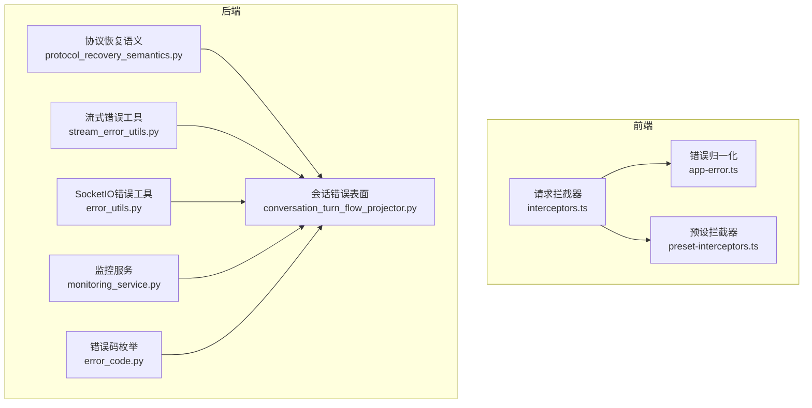
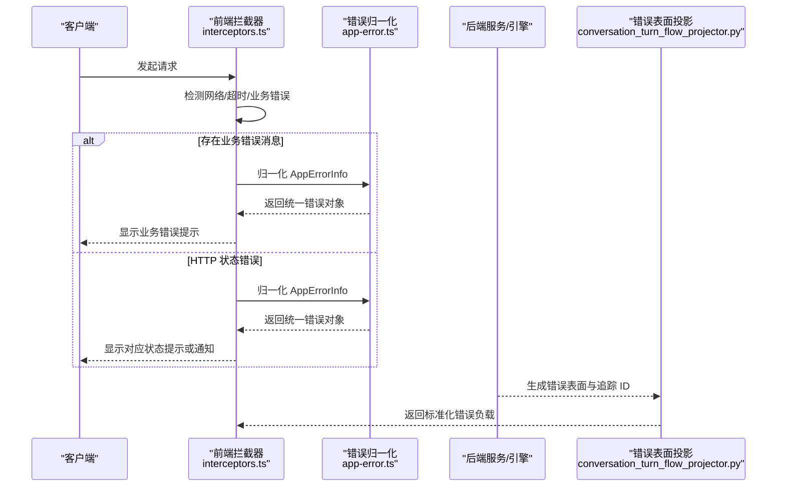
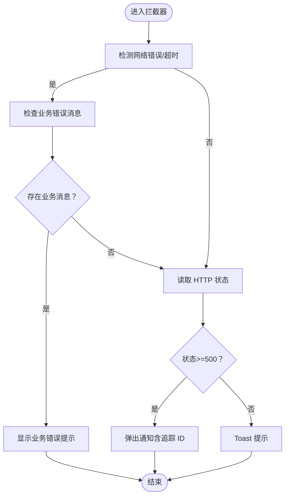
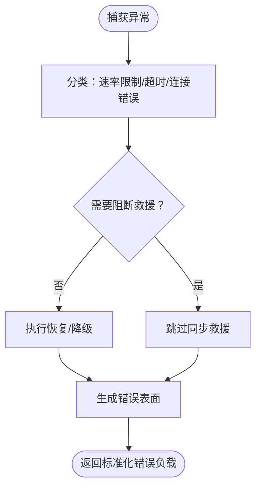
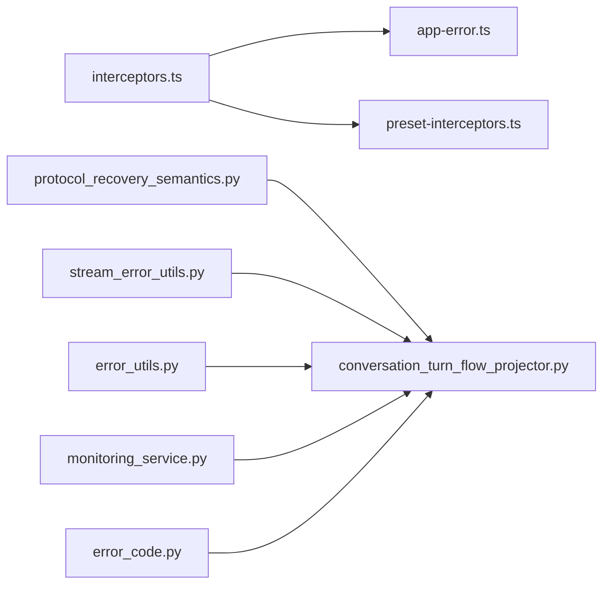

# 错误处理策略

<cite>
**本文引用的文件**
- [interceptors.ts](file://frontend/apps/web-antd/src/utils/request/interceptors.ts)
- [app-error.ts](file://frontend/apps/web-antd/src/utils/request/app-error.ts)
- [preset-interceptors.ts](file://frontend/packages/effects/request/src/request-client/preset-interceptors.ts)
- [stream_error_utils.py](file://backend/app/ai/engine/stream_error_utils.py)
- [protocol_recovery_semantics.py](file://backend/app/ai/runtime/protocol_recovery_semantics.py)
- [conversation_turn_flow_projector.py](file://backend/app/services/ai/conversation_turn_flow_projector.py)
- [error_code.py](file://backend/app/enums/error_code.py)
- [agent_chat_error_surface.py](file://backend/app/services/ai/agent_chat_error_surface.py)
- [error_utils.py](file://backend/app/sio/error_utils.py)
- [monitoring_service.py](file://backend/app/services/ai/monitoring_service.py)
- [test_stream_error_utils.py](file://backend/tests/ai/engine/test_stream_error_utils.py)
- [test_agent_chat_stream_error.py](file://backend/tests/services/test_agent_chat_stream_error.py)
- [test_trace_cli.py](file://backend/tests/test_trace_cli.py)
</cite>

## 目录
1. [引言](#引言)
2. [项目结构](#项目结构)
3. [核心组件](#核心组件)
4. [架构总览](#架构总览)
5. [详细组件分析](#详细组件分析)
6. [依赖关系分析](#依赖关系分析)
7. [性能考量](#性能考量)
8. [故障排查指南](#故障排查指南)
9. [结论](#结论)
10. [附录](#附录)

## 引言
本文件系统性梳理并文档化本项目的错误处理策略，涵盖前端请求拦截器、后端运行时与服务层错误分类与恢复、统一错误模型与消息格式、错误重试与降级策略、用户体验优化以及日志与调试信息采集。目标是帮助开发者在不同层级快速定位问题、正确区分网络错误、服务器错误与业务逻辑错误，并采用一致的错误上报与用户提示机制。

## 项目结构
本项目前后端均具备完善的错误处理能力：
- 前端通过请求拦截器统一捕获网络错误、超时、HTTP状态码错误与业务错误，形成统一的 AppErrorInfo 结构，并按来源与状态进行差异化提示与上报。
- 后端在 AI 引擎、会话流式处理、SocketIO、监控与追踪等模块中实现错误分类、降级与恢复语义，并提供标准化的错误表面（error surface）输出，便于前端展示与审计。

图表来源
- [interceptors.ts](file://frontend/apps/web-antd/src/utils/request/interceptors.ts)
- [app-error.ts](file://frontend/apps/web-antd/src/utils/request/app-error.ts)
- [preset-interceptors.ts](file://frontend/packages/effects/request/src/request-client/preset-interceptors.ts)
- [protocol_recovery_semantics.py](file://backend/app/ai/runtime/protocol_recovery_semantics.py)
- [stream_error_utils.py](file://backend/app/ai/engine/stream_error_utils.py)
- [conversation_turn_flow_projector.py](file://backend/app/services/ai/conversation_turn_flow_projector.py)
- [error_utils.py](file://backend/app/sio/error_utils.py)
- [monitoring_service.py](file://backend/app/services/ai/monitoring_service.py)
- [error_code.py](file://backend/app/enums/error_code.py)

章节来源
- [interceptors.ts:441-521](file://frontend/apps/web-antd/src/utils/request/interceptors.ts#L441-L521)
- [app-error.ts:81-216](file://frontend/apps/web-antd/src/utils/request/app-error.ts#L81-L216)
- [preset-interceptors.ts:133-165](file://frontend/packages/effects/request/src/request-client/preset-interceptors.ts#L133-L165)
- [protocol_recovery_semantics.py:43-79](file://backend/app/ai/runtime/protocol_recovery_semantics.py#L43-L79)
- [stream_error_utils.py](file://backend/app/ai/engine/stream_error_utils.py)
- [conversation_turn_flow_projector.py:148-174](file://backend/app/services/ai/conversation_turn_flow_projector.py#L148-L174)
- [error_utils.py](file://backend/app/sio/error_utils.py)
- [monitoring_service.py:52-90](file://backend/app/services/ai/monitoring_service.py#L52-L90)
- [error_code.py](file://backend/app/enums/error_code.py)

## 核心组件
- 前端统一错误模型与归一化
  - AppErrorInfo：统一承载错误消息、状态码、来源、追踪 ID、调试信息等字段，支持多语言回退与开发态细节暴露。
  - normalizeHttpError：根据响应体、头信息与错误字符串判断来源（网络、超时、HTTP、业务），并提取 message、traceId、debugMessage。
  - formatAppErrorMessage：根据来源与状态决定是否展示调试信息与追踪 ID，保证用户可读与工程师可观测性平衡。
- 前端请求拦截器
  - 拦截网络错误与超时，优先使用业务侧错误消息；否则按 HTTP 状态映射国际化文案并提示。
  - 对 5xx 错误弹出通知（含追踪 ID 与复制按钮），对 4xx 错误以 Toast 提示。
- 后端错误分类与恢复
  - 协议恢复语义：基于异常类名与状态码推断“速率限制/超时/连接错误”等块级原因，指导是否跳过同步救援。
  - 流式错误工具：在引擎层对流式调用失败进行诊断与降级。
  - 会话错误表面：从元数据派生对外可见的错误表面，确保消息与追踪 ID 的一致性。
  - SocketIO 错误工具：在实时通道中提供一致的错误封装与上报。
  - 监控服务：从请求元数据抽取调用诊断信息，辅助性能与错误分析。
  - 错误码枚举：统一错误码语义，便于前后端约定与自动化处理。

章节来源
- [app-error.ts:5-26](file://frontend/apps/web-antd/src/utils/request/app-error.ts#L5-L26)
- [app-error.ts:81-216](file://frontend/apps/web-antd/src/utils/request/app-error.ts#L81-L216)
- [interceptors.ts:441-521](file://frontend/apps/web-antd/src/utils/request/interceptors.ts#L441-L521)
- [protocol_recovery_semantics.py:43-79](file://backend/app/ai/runtime/protocol_recovery_semantics.py#L43-L79)
- [stream_error_utils.py](file://backend/app/ai/engine/stream_error_utils.py)
- [conversation_turn_flow_projector.py:148-174](file://backend/app/services/ai/conversation_turn_flow_projector.py#L148-L174)
- [error_utils.py](file://backend/app/sio/error_utils.py)
- [monitoring_service.py:89-90](file://backend/app/services/ai/monitoring_service.py#L89-L90)
- [error_code.py](file://backend/app/enums/error_code.py)

## 架构总览
下图展示了从前端请求到后端服务与引擎的错误处理路径，以及错误表面与追踪 ID 的贯穿：

图表来源
- [interceptors.ts:441-521](file://frontend/apps/web-antd/src/utils/request/interceptors.ts#L441-L521)
- [app-error.ts:81-216](file://frontend/apps/web-antd/src/utils/request/app-error.ts#L81-L216)
- [conversation_turn_flow_projector.py:148-174](file://backend/app/services/ai/conversation_turn_flow_projector.py#L148-L174)

## 详细组件分析

### 前端错误拦截器与归一化
- 分类与处理
  - 网络错误与超时：优先提示用户并携带追踪 ID；避免重复 HTTP 状态提示。
  - 业务错误：若响应体包含 message/error/msg，则优先使用业务侧消息；5xx 时弹出通知并允许复制追踪 ID。
  - HTTP 状态回退：无业务消息时按状态映射国际化文案，4xx 使用 Toast，5xx 使用通知。
- 用户体验
  - 开发态可显示调试信息；生产态隐藏细节，仅展示 message 与可选追踪 ID。
  - 5xx 通知包含复制追踪 ID 的交互，便于快速反馈与定位。

图表来源
- [interceptors.ts:441-521](file://frontend/apps/web-antd/src/utils/request/interceptors.ts#L441-L521)
- [app-error.ts:188-202](file://frontend/apps/web-antd/src/utils/request/app-error.ts#L188-L202)

章节来源
- [interceptors.ts:441-521](file://frontend/apps/web-antd/src/utils/request/interceptors.ts#L441-L521)
- [app-error.ts:81-216](file://frontend/apps/web-antd/src/utils/request/app-error.ts#L81-L216)

### 统一错误模型与消息格式
- AppErrorInfo 字段
  - code/status/source/message/traceId/debugMessage/debugData/raw：覆盖业务、HTTP、网络、超时、SSE、未知来源。
  - 归一化流程：从响应体与头信息提取 traceId；根据来源与状态选择 message；必要时回退到国际化文案。
- 消息格式
  - formatAppErrorMessage：在开发态且为 5xx 或 SSE 时显示调试信息；否则仅显示 message 与追踪 ID。

章节来源
- [app-error.ts:5-26](file://frontend/apps/web-antd/src/utils/request/app-error.ts#L5-L26)
- [app-error.ts:81-216](file://frontend/apps/web-antd/src/utils/request/app-error.ts#L81-L216)
- [app-error.ts:188-202](file://frontend/apps/web-antd/src/utils/request/app-error.ts#L188-L202)

### 后端错误分类与恢复语义
- 协议恢复语义
  - 依据异常类名与状态码推断“速率限制/超时/连接错误”，并决定是否跳过同步救援，避免重复重试与资源浪费。
- 流式错误工具
  - 在引擎层对流式调用失败进行诊断，结合上下文进行降级与恢复。
- 会话错误表面
  - 从元数据派生对外可见的错误表面，确保 message、error_type、trace_id、debug_message 的一致性与最小化暴露。

图表来源
- [protocol_recovery_semantics.py:43-79](file://backend/app/ai/runtime/protocol_recovery_semantics.py#L43-L79)
- [stream_error_utils.py](file://backend/app/ai/engine/stream_error_utils.py)
- [conversation_turn_flow_projector.py:148-174](file://backend/app/services/ai/conversation_turn_flow_projector.py#L148-L174)

章节来源
- [protocol_recovery_semantics.py:43-79](file://backend/app/ai/runtime/protocol_recovery_semantics.py#L43-L79)
- [stream_error_utils.py](file://backend/app/ai/engine/stream_error_utils.py)
- [conversation_turn_flow_projector.py:148-174](file://backend/app/services/ai/conversation_turn_flow_projector.py#L148-L174)

### SocketIO 与监控中的错误处理
- SocketIO 错误工具：在实时通道中提供一致的错误封装，便于前端与后端协同诊断。
- 监控服务：从请求元数据抽取调用诊断信息，辅助性能与错误分析。

章节来源
- [error_utils.py](file://backend/app/sio/error_utils.py)
- [monitoring_service.py:89-90](file://backend/app/services/ai/monitoring_service.py#L89-L90)

### 特定 API 的错误处理模式与自定义错误类型
- 错误码枚举：统一错误码语义，便于前后端约定与自动化处理。
- 会话错误表面：从元数据派生对外可见的错误表面，确保 message、error_type、trace_id、debug_message 的一致性与最小化暴露。
- 测试验证：通过单元测试确保流式错误与会话错误场景下的错误表面与恢复行为符合预期。

章节来源
- [error_code.py](file://backend/app/enums/error_code.py)
- [conversation_turn_flow_projector.py:148-174](file://backend/app/services/ai/conversation_turn_flow_projector.py#L148-L174)
- [test_stream_error_utils.py](file://backend/tests/ai/engine/test_stream_error_utils.py)
- [test_agent_chat_stream_error.py](file://backend/tests/services/test_agent_chat_stream_error.py)

## 依赖关系分析
- 前端拦截器依赖错误归一化模块，后者再依赖国际化与环境配置，最终形成统一的错误对象。
- 后端服务层通过协议恢复语义与流式错误工具实现错误分类与恢复，再经由错误表面投影到前端。
- 监控服务与追踪 CLI 测试用于验证错误日志与调试信息的可检索性与一致性。

图表来源
- [interceptors.ts:441-521](file://frontend/apps/web-antd/src/utils/request/interceptors.ts#L441-L521)
- [app-error.ts:81-216](file://frontend/apps/web-antd/src/utils/request/app-error.ts#L81-L216)
- [preset-interceptors.ts:133-165](file://frontend/packages/effects/request/src/request-client/preset-interceptors.ts#L133-L165)
- [protocol_recovery_semantics.py:43-79](file://backend/app/ai/runtime/protocol_recovery_semantics.py#L43-L79)
- [stream_error_utils.py](file://backend/app/ai/engine/stream_error_utils.py)
- [conversation_turn_flow_projector.py:148-174](file://backend/app/services/ai/conversation_turn_flow_projector.py#L148-L174)
- [error_utils.py](file://backend/app/sio/error_utils.py)
- [monitoring_service.py:52-90](file://backend/app/services/ai/monitoring_service.py#L52-L90)
- [error_code.py](file://backend/app/enums/error_code.py)

章节来源
- [interceptors.ts:441-521](file://frontend/apps/web-antd/src/utils/request/interceptors.ts#L441-L521)
- [app-error.ts:81-216](file://frontend/apps/web-antd/src/utils/request/app-error.ts#L81-L216)
- [preset-interceptors.ts:133-165](file://frontend/packages/effects/request/src/request-client/preset-interceptors.ts#L133-L165)
- [protocol_recovery_semantics.py:43-79](file://backend/app/ai/runtime/protocol_recovery_semantics.py#L43-L79)
- [stream_error_utils.py](file://backend/app/ai/engine/stream_error_utils.py)
- [conversation_turn_flow_projector.py:148-174](file://backend/app/services/ai/conversation_turn_flow_projector.py#L148-L174)
- [error_utils.py](file://backend/app/sio/error_utils.py)
- [monitoring_service.py:52-90](file://backend/app/services/ai/monitoring_service.py#L52-L90)
- [error_code.py](file://backend/app/enums/error_code.py)

## 性能考量
- 错误重试与降级
  - 基于异常类名与状态码识别速率限制、超时与连接错误，避免无效重试与资源浪费。
  - 在流式调用失败时进行降级与恢复，减少对主流程的影响。
- 日志与追踪
  - 统一追踪 ID 注入与提取，便于跨服务链路定位问题。
  - 监控服务从请求元数据抽取诊断信息，辅助性能分析与错误趋势观察。
- 用户体验
  - 区分 4xx 与 5xx 的提示方式，避免过度打扰；5xx 提供可复制的追踪 ID，提升问题反馈效率。

章节来源
- [protocol_recovery_semantics.py:43-79](file://backend/app/ai/runtime/protocol_recovery_semantics.py#L43-L79)
- [monitoring_service.py:89-90](file://backend/app/services/ai/monitoring_service.py#L89-L90)
- [interceptors.ts:502-516](file://frontend/apps/web-antd/src/utils/request/interceptors.ts#L502-L516)

## 故障排查指南
- 常见问题定位步骤
  - 查看前端拦截器是否显示业务错误消息；若无，确认后端是否返回了 message/error/msg。
  - 若为 5xx，检查通知中是否包含追踪 ID；在后端通过追踪 CLI 或日志服务查询具体错误与上下文。
  - 对流式调用失败，检查协议恢复语义是否阻断了同步救援，以及会话错误表面是否正确生成。
- 调试信息收集
  - 开发态可查看调试消息与追踪 ID；生产态保留 message 与追踪 ID，避免泄露敏感信息。
  - 监控服务抽取的调用诊断信息可用于性能与错误分析。
- 测试验证
  - 通过单元测试验证流式错误与会话错误场景下的错误表面与恢复行为。

章节来源
- [interceptors.ts:464-479](file://frontend/apps/web-antd/src/utils/request/interceptors.ts#L464-L479)
- [test_trace_cli.py:85-129](file://backend/tests/test_trace_cli.py#L85-L129)
- [test_stream_error_utils.py](file://backend/tests/ai/engine/test_stream_error_utils.py)
- [test_agent_chat_stream_error.py](file://backend/tests/services/test_agent_chat_stream_error.py)

## 结论
本项目在前后端实现了统一的错误处理策略：前端通过拦截器与归一化模块形成稳定的 AppErrorInfo，后端在引擎与服务层进行错误分类、降级与恢复，并通过错误表面与追踪 ID 实现可观测性与可修复性。该策略在保障用户体验的同时，提升了问题定位与恢复效率，建议在新增 API 与功能模块时遵循统一的错误模型与处理流程。

## 附录
- 关键实现参考路径
  - 前端错误拦截与归一化：[interceptors.ts](file://frontend/apps/web-antd/src/utils/request/interceptors.ts)，[app-error.ts](file://frontend/apps/web-antd/src/utils/request/app-error.ts)
  - 后端错误分类与恢复：[protocol_recovery_semantics.py](file://backend/app/ai/runtime/protocol_recovery_semantics.py)，[stream_error_utils.py](file://backend/app/ai/engine/stream_error_utils.py)
  - 错误表面与监控：[conversation_turn_flow_projector.py](file://backend/app/services/ai/conversation_turn_flow_projector.py)，[monitoring_service.py](file://backend/app/services/ai/monitoring_service.py)
  - SocketIO 与错误码：[error_utils.py](file://backend/app/sio/error_utils.py)，[error_code.py](file://backend/app/enums/error_code.py)
  - 测试验证：[test_stream_error_utils.py](file://backend/tests/ai/engine/test_stream_error_utils.py)，[test_agent_chat_stream_error.py](file://backend/tests/services/test_agent_chat_stream_error.py)，[test_trace_cli.py](file://backend/tests/test_trace_cli.py)