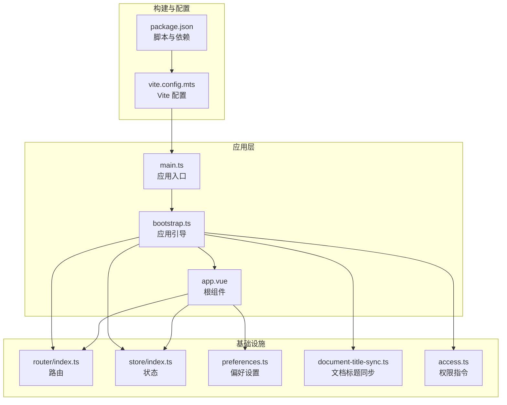
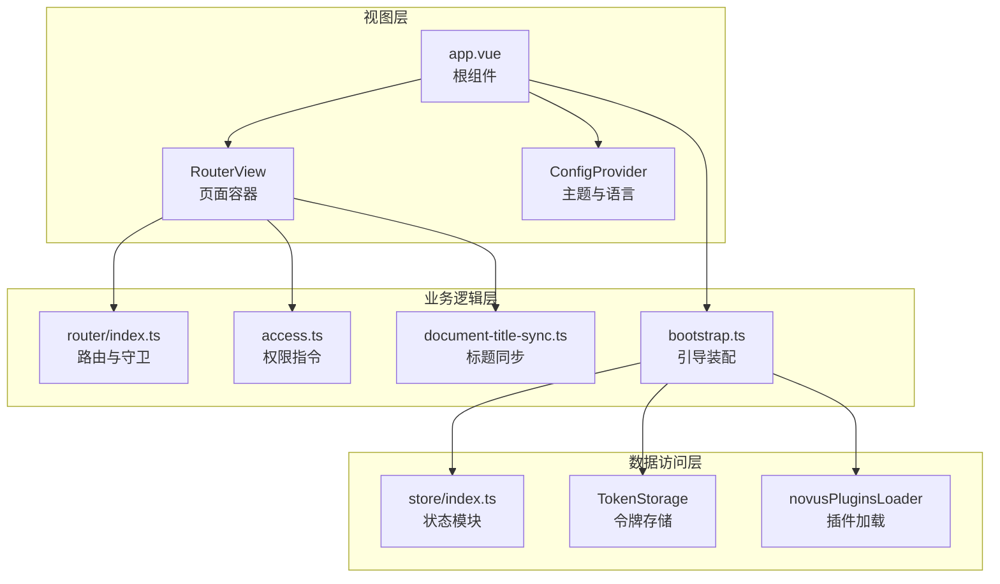
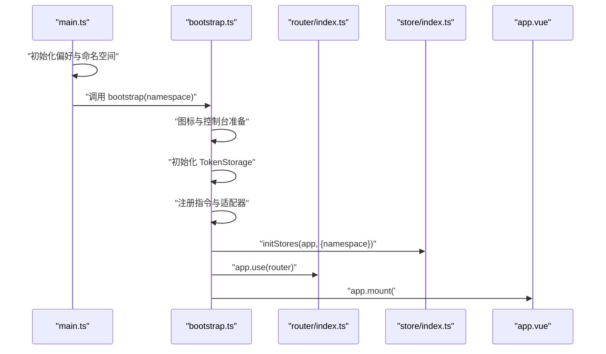
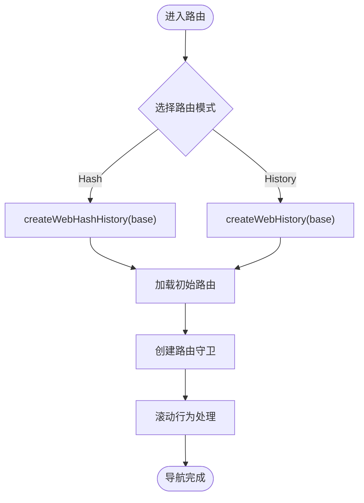
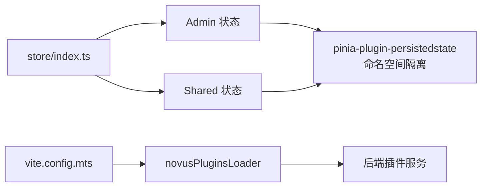
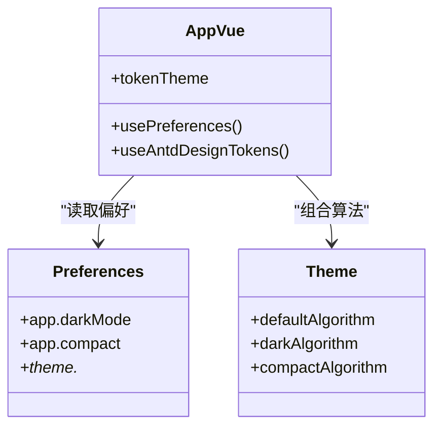
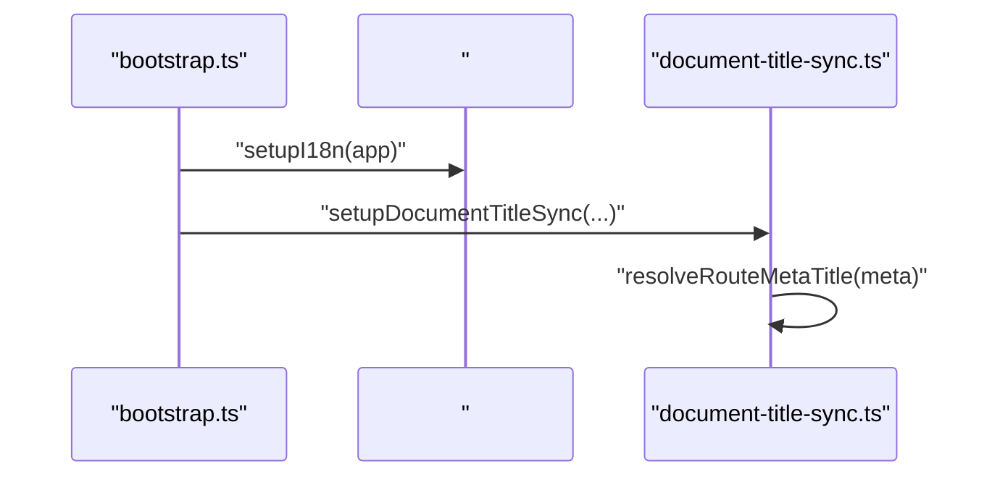
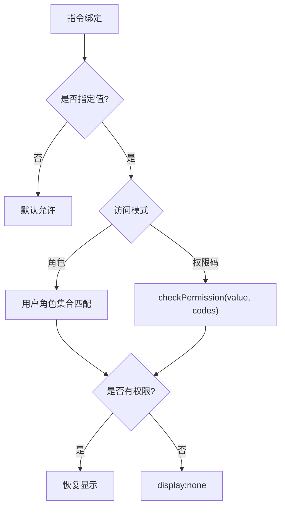
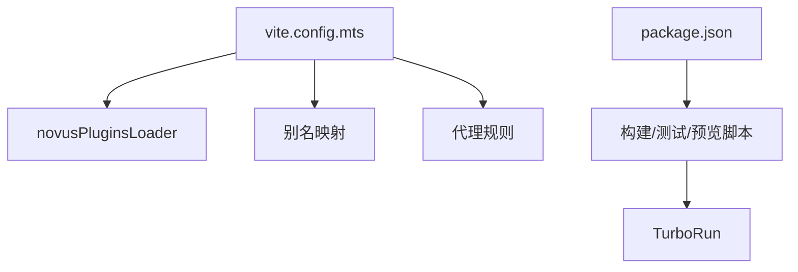
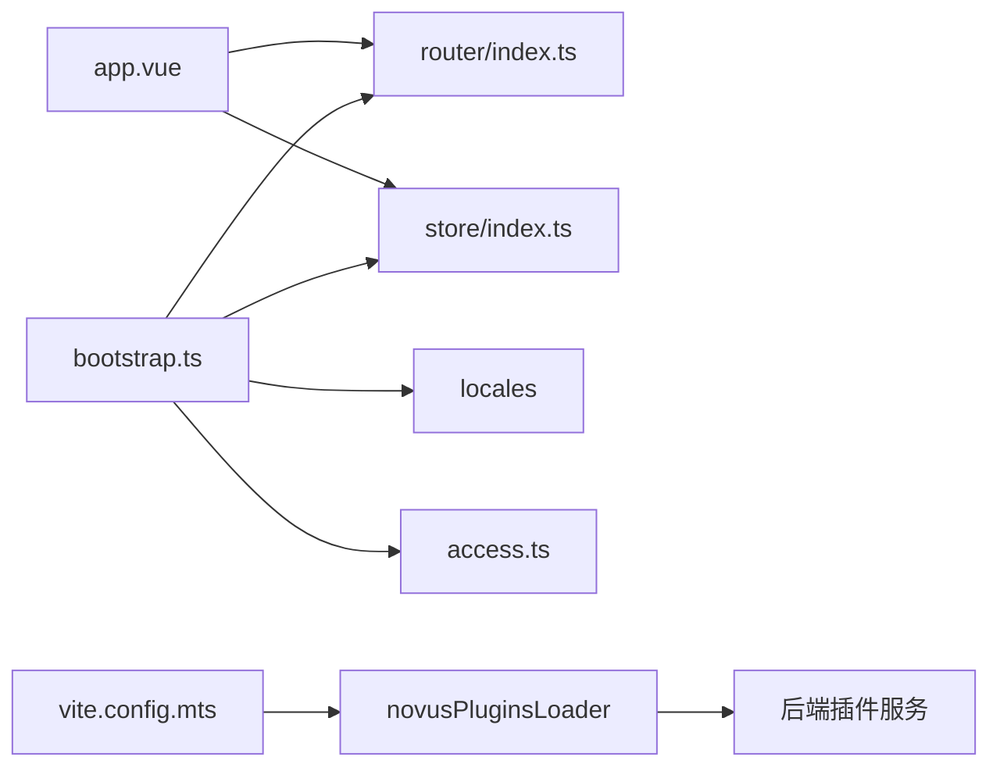

# 前端架构设计

<cite>
**本文档引用的文件**
- [frontend/package.json](file://frontend/package.json)
- [apps/web-antd/vite.config.mts](file://frontend/apps/web-antd/vite.config.mts)
- [apps/web-antd/src/main.ts](file://frontend/apps/web-antd/src/main.ts)
- [apps/web-antd/src/bootstrap.ts](file://frontend/apps/web-antd/src/bootstrap.ts)
- [apps/web-antd/src/router/index.ts](file://frontend/apps/web-antd/src/router/index.ts)
- [apps/web-antd/src/store/index.ts](file://frontend/apps/web-antd/src/store/index.ts)
- [apps/web-antd/src/app.vue](file://frontend/apps/web-antd/src/app.vue)
- [apps/web-antd/src/preferences.ts](file://frontend/apps/web-antd/src/preferences.ts)
- [apps/web-antd/src/layouts/document-title-sync.ts](file://frontend/apps/web-antd/src/layouts/document-title-sync.ts)
- [apps/web-antd/src/directives/access.ts](file://frontend/apps/web-antd/src/directives/access.ts)
</cite>

## 目录
1. [引言](#引言)
2. [项目结构](#项目结构)
3. [核心组件](#核心组件)
4. [架构总览](#架构总览)
5. [详细组件分析](#详细组件分析)
6. [依赖关系分析](#依赖关系分析)
7. [性能考量](#性能考量)
8. [故障排查指南](#故障排查指南)
9. [结论](#结论)
10. [附录](#附录)

## 引言
本文件面向 NovusAI SaaS 的前端团队与相关利益方，系统性阐述基于 Vue.js 3.x 的前端架构设计。内容涵盖单页应用（SPA）架构、组件化设计、状态管理模式、分层架构（视图层/业务逻辑层/数据访问层）、路由系统、状态管理、样式架构、国际化与主题系统、响应式设计、构建配置与打包优化、性能优化策略，以及开发规范与最佳实践。

## 项目结构
前端采用 Monorepo 架构，核心应用位于 apps/web-antd，配套工具与库位于 packages、internal、playground 等目录。根级 package.json 通过脚本统一管理构建、测试、类型检查等任务；各子包通过 pnpm workspace 进行依赖与版本管理。

- 核心应用入口与引导流程
  - 应用入口：apps/web-antd/src/main.ts
  - 应用引导：apps/web-antd/src/bootstrap.ts
  - 根组件：apps/web-antd/src/app.vue
  - 路由：apps/web-antd/src/router/index.ts
  - 状态：apps/web-antd/src/store/index.ts
  - 配置与偏好：apps/web-antd/src/preferences.ts
  - 文档标题同步：apps/web-antd/src/layouts/document-title-sync.ts
  - 权限指令：apps/web-antd/src/directives/access.ts

- 构建与开发
  - 应用级构建配置：apps/web-antd/vite.config.mts
  - 顶层构建脚本与工作区：frontend/package.json

图表来源
- [apps/web-antd/src/main.ts:1-35](file://frontend/apps/web-antd/src/main.ts#L1-L35)
- [apps/web-antd/src/bootstrap.ts:1-117](file://frontend/apps/web-antd/src/bootstrap.ts#L1-L117)
- [apps/web-antd/src/app.vue:1-45](file://frontend/apps/web-antd/src/app.vue#L1-L45)
- [apps/web-antd/src/router/index.ts:1-39](file://frontend/apps/web-antd/src/router/index.ts#L1-L39)
- [apps/web-antd/src/store/index.ts:1-11](file://frontend/apps/web-antd/src/store/index.ts#L1-L11)
- [apps/web-antd/src/preferences.ts:1-91](file://frontend/apps/web-antd/src/preferences.ts#L1-L91)
- [apps/web-antd/src/layouts/document-title-sync.ts:1-72](file://frontend/apps/web-antd/src/layouts/document-title-sync.ts#L1-L72)
- [apps/web-antd/src/directives/access.ts:1-90](file://frontend/apps/web-antd/src/directives/access.ts#L1-L90)
- [apps/web-antd/vite.config.mts:1-114](file://frontend/apps/web-antd/vite.config.mts#L1-L114)
- [frontend/package.json:1-127](file://frontend/package.json#L1-L127)

章节来源
- [frontend/package.json:1-127](file://frontend/package.json#L1-L127)
- [apps/web-antd/vite.config.mts:1-114](file://frontend/apps/web-antd/vite.config.mts#L1-L114)
- [apps/web-antd/src/main.ts:1-35](file://frontend/apps/web-antd/src/main.ts#L1-L35)
- [apps/web-antd/src/bootstrap.ts:1-117](file://frontend/apps/web-antd/src/bootstrap.ts#L1-L117)
- [apps/web-antd/src/router/index.ts:1-39](file://frontend/apps/web-antd/src/router/index.ts#L1-L39)
- [apps/web-antd/src/store/index.ts:1-11](file://frontend/apps/web-antd/src/store/index.ts#L1-L11)
- [apps/web-antd/src/app.vue:1-45](file://frontend/apps/web-antd/src/app.vue#L1-L45)
- [apps/web-antd/src/preferences.ts:1-91](file://frontend/apps/web-antd/src/preferences.ts#L1-L91)
- [apps/web-antd/src/layouts/document-title-sync.ts:1-72](file://frontend/apps/web-antd/src/layouts/document-title-sync.ts#L1-L72)
- [apps/web-antd/src/directives/access.ts:1-90](file://frontend/apps/web-antd/src/directives/access.ts#L1-L90)

## 核心组件
- 应用入口与引导
  - main.ts：延迟渲染、偏好初始化、命名空间隔离、启动引导与全局 Loading 销毁。
  - bootstrap.ts：图标子集预加载、TokenStorage 初始化、控制台过滤、组件适配器、表单与表格适配、Pinia 状态、权限指令、路由安装、Motion 插件、文档标题同步、挂载应用。
- 根组件与主题系统
  - app.vue：Ant Design Vue ConfigProvider 包裹，动态主题算法与 Design Token 注入，错误边界与全局抽屉。
- 路由系统
  - router/index.ts：基于环境变量选择 Hash 或 History 模式，滚动行为与路由守卫创建。
- 状态管理
  - store/index.ts：按端分离导出 Admin 与 Shared 状态模块。
- 偏好与主题
  - preferences.ts：覆盖默认偏好，含布局、导航、侧边栏、标签页、主题、过渡动画、快捷键与小部件等。
- 文档标题同步
  - document-title-sync.ts：根据路由元信息与本地化键动态生成页面标题。
- 权限指令
  - access.ts：扩展 v-access 指令，支持角色模式与权限码模式，超级管理员通配符“*”。

章节来源
- [apps/web-antd/src/main.ts:1-35](file://frontend/apps/web-antd/src/main.ts#L1-L35)
- [apps/web-antd/src/bootstrap.ts:1-117](file://frontend/apps/web-antd/src/bootstrap.ts#L1-L117)
- [apps/web-antd/src/app.vue:1-45](file://frontend/apps/web-antd/src/app.vue#L1-L45)
- [apps/web-antd/src/router/index.ts:1-39](file://frontend/apps/web-antd/src/router/index.ts#L1-L39)
- [apps/web-antd/src/store/index.ts:1-11](file://frontend/apps/web-antd/src/store/index.ts#L1-L11)
- [apps/web-antd/src/preferences.ts:1-91](file://frontend/apps/web-antd/src/preferences.ts#L1-L91)
- [apps/web-antd/src/layouts/document-title-sync.ts:1-72](file://frontend/apps/web-antd/src/layouts/document-title-sync.ts#L1-L72)
- [apps/web-antd/src/directives/access.ts:1-90](file://frontend/apps/web-antd/src/directives/access.ts#L1-L90)

## 架构总览
前端采用典型的三层分层架构：
- 视图层（View Layer）：Vue 组件树、Ant Design Vue 主题与 ConfigProvider、国际化语言包。
- 业务逻辑层（Business Logic Layer）：路由守卫、权限指令、文档标题同步、插件共享暴露、Motion 动效。
- 数据访问层（Data Access Layer）：Pinia Store（Admin/Shared）、TokenStorage、持久化状态插件、插件资产代理。

图表来源
- [apps/web-antd/src/app.vue:1-45](file://frontend/apps/web-antd/src/app.vue#L1-L45)
- [apps/web-antd/src/router/index.ts:1-39](file://frontend/apps/web-antd/src/router/index.ts#L1-L39)
- [apps/web-antd/src/directives/access.ts:1-90](file://frontend/apps/web-antd/src/directives/access.ts#L1-L90)
- [apps/web-antd/src/layouts/document-title-sync.ts:1-72](file://frontend/apps/web-antd/src/layouts/document-title-sync.ts#L1-L72)
- [apps/web-antd/src/bootstrap.ts:1-117](file://frontend/apps/web-antd/src/bootstrap.ts#L1-L117)
- [apps/web-antd/src/store/index.ts:1-11](file://frontend/apps/web-antd/src/store/index.ts#L1-L11)

## 详细组件分析

### 应用引导与生命周期
- 关键流程
  - 图标子集预加载与在线请求禁用
  - TokenStorage 初始化（命名空间隔离）
  - 控制台噪声过滤与 ARIA 警告修复
  - 组件/表单/VXE 表格适配器初始化
  - Pinia Store 初始化与命名空间注入
  - 权限指令注册
  - Motion 插件安装
  - 文档标题同步
  - Ant Design Vue 全局安装
  - 插件共享依赖暴露
  - 路由安装与挂载

图表来源
- [apps/web-antd/src/main.ts:1-35](file://frontend/apps/web-antd/src/main.ts#L1-L35)
- [apps/web-antd/src/bootstrap.ts:1-117](file://frontend/apps/web-antd/src/bootstrap.ts#L1-L117)
- [apps/web-antd/src/router/index.ts:1-39](file://frontend/apps/web-antd/src/router/index.ts#L1-L39)
- [apps/web-antd/src/store/index.ts:1-11](file://frontend/apps/web-antd/src/store/index.ts#L1-L11)
- [apps/web-antd/src/app.vue:1-45](file://frontend/apps/web-antd/src/app.vue#L1-L45)

章节来源
- [apps/web-antd/src/main.ts:1-35](file://frontend/apps/web-antd/src/main.ts#L1-L35)
- [apps/web-antd/src/bootstrap.ts:1-117](file://frontend/apps/web-antd/src/bootstrap.ts#L1-L117)

### 路由系统与导航守卫
- 路由模式
  - 支持 Hash 与 History 两种模式，由环境变量决定基础路径与历史记录行为。
- 滚动行为
  - 支持保存位置与锚点平滑滚动。
- 导航守卫
  - 通过 createRouterGuard 创建全局守卫，结合 resetStaticRoutes 重置静态路由。

图表来源
- [apps/web-antd/src/router/index.ts:1-39](file://frontend/apps/web-antd/src/router/index.ts#L1-L39)

章节来源
- [apps/web-antd/src/router/index.ts:1-39](file://frontend/apps/web-antd/src/router/index.ts#L1-L39)

### 状态管理与持久化
- 状态模块
  - 按端分离导出 Admin 与 Shared 状态，便于跨页面共享与端内隔离。
- 持久化策略
  - 通过别名指向 pinia-plugin-persistedstate，结合命名空间实现多端独立持久化。
- 插件加载
  - novusPluginsLoader 动态加载后端插件资源，代理至后端服务。

图表来源
- [apps/web-antd/src/store/index.ts:1-11](file://frontend/apps/web-antd/src/store/index.ts#L1-L11)
- [apps/web-antd/vite.config.mts:1-114](file://frontend/apps/web-antd/vite.config.mts#L1-L114)

章节来源
- [apps/web-antd/src/store/index.ts:1-11](file://frontend/apps/web-antd/src/store/index.ts#L1-L11)
- [apps/web-antd/vite.config.mts:1-114](file://frontend/apps/web-antd/vite.config.mts#L1-L114)

### 主题系统与样式架构
- 主题算法
  - 基于偏好与暗色模式动态选择算法数组，支持紧凑模式。
- Design Token
  - 从 hooks 注入 Design Token，统一颜色与尺寸变量。
- Ant Design Vue
  - 全局注册，确保模板中可直接使用组件标签。

图表来源
- [apps/web-antd/src/app.vue:1-45](file://frontend/apps/web-antd/src/app.vue#L1-L45)
- [apps/web-antd/src/preferences.ts:1-91](file://frontend/apps/web-antd/src/preferences.ts#L1-L91)

章节来源
- [apps/web-antd/src/app.vue:1-45](file://frontend/apps/web-antd/src/app.vue#L1-L45)
- [apps/web-antd/src/preferences.ts:1-91](file://frontend/apps/web-antd/src/preferences.ts#L1-L91)

### 国际化与运行时语言
- i18n 初始化
  - 在引导阶段设置语言包与运行时语言解析。
- 文档标题本地化
  - 根据路由元信息与本地化键生成标题，支持多语言切换。

图表来源
- [apps/web-antd/src/bootstrap.ts:1-117](file://frontend/apps/web-antd/src/bootstrap.ts#L1-L117)
- [apps/web-antd/src/layouts/document-title-sync.ts:1-72](file://frontend/apps/web-antd/src/layouts/document-title-sync.ts#L1-L72)

章节来源
- [apps/web-antd/src/bootstrap.ts:1-117](file://frontend/apps/web-antd/src/bootstrap.ts#L1-L117)
- [apps/web-antd/src/layouts/document-title-sync.ts:1-72](file://frontend/apps/web-antd/src/layouts/document-title-sync.ts#L1-L72)

### 权限控制与指令
- 指令扩展
  - 支持角色模式与权限码模式，超级管理员“*”通配符。
- 可见性控制
  - 使用 display:none 而非移除节点，便于权限变更后重新评估。

图表来源
- [apps/web-antd/src/directives/access.ts:1-90](file://frontend/apps/web-antd/src/directives/access.ts#L1-L90)

章节来源
- [apps/web-antd/src/directives/access.ts:1-90](file://frontend/apps/web-antd/src/directives/access.ts#L1-L90)

### 构建配置与打包优化
- Vite 配置
  - 应用级配置通过 @vben/vite-config 统一，启用 novusPluginsLoader 插件。
  - 别名映射共享源码与持久化插件入口，减少重复依赖。
  - 代理配置将插件资产请求转发至后端目标。
- 开发与生产
  - 顶层 package.json 提供统一脚本，支持并行构建、类型检查、测试与预览。
  - TurboRun 与 pnpm workspace 协同，提升构建效率。

图表来源
- [apps/web-antd/vite.config.mts:1-114](file://frontend/apps/web-antd/vite.config.mts#L1-L114)
- [frontend/package.json:1-127](file://frontend/package.json#L1-L127)

章节来源
- [apps/web-antd/vite.config.mts:1-114](file://frontend/apps/web-antd/vite.config.mts#L1-L114)
- [frontend/package.json:1-127](file://frontend/package.json#L1-L127)

## 依赖关系分析
- 组件耦合
  - app.vue 作为根组件，依赖 ConfigProvider、主题与语言包；通过 RouterView 渲染页面。
  - bootstrap.ts 作为装配中心，集中初始化与注册，降低组件间耦合。
- 外部依赖
  - Vue Router、Ant Design Vue、Pinia、i18n、Motion 插件、图标子集与持久化插件。
- 代理与插件
  - 通过 novusPluginsLoader 与代理规则，将插件资产请求转发至后端，实现前后端一体化开发体验。

图表来源
- [apps/web-antd/src/app.vue:1-45](file://frontend/apps/web-antd/src/app.vue#L1-L45)
- [apps/web-antd/src/router/index.ts:1-39](file://frontend/apps/web-antd/src/router/index.ts#L1-L39)
- [apps/web-antd/src/store/index.ts:1-11](file://frontend/apps/web-antd/src/store/index.ts#L1-L11)
- [apps/web-antd/src/bootstrap.ts:1-117](file://frontend/apps/web-antd/src/bootstrap.ts#L1-L117)
- [apps/web-antd/src/directives/access.ts:1-90](file://frontend/apps/web-antd/src/directives/access.ts#L1-L90)
- [apps/web-antd/vite.config.mts:1-114](file://frontend/apps/web-antd/vite.config.mts#L1-L114)

章节来源
- [apps/web-antd/src/app.vue:1-45](file://frontend/apps/web-antd/src/app.vue#L1-L45)
- [apps/web-antd/src/bootstrap.ts:1-117](file://frontend/apps/web-antd/src/bootstrap.ts#L1-L117)
- [apps/web-antd/vite.config.mts:1-114](file://frontend/apps/web-antd/vite.config.mts#L1-L114)

## 性能考量
- 构建与打包
  - 使用 TurboRun 与 pnpm workspace 并行执行，缩短构建时间。
  - 通过别名与持久化插件入口减少重复依赖，降低包体大小。
- 运行时优化
  - 图标子集预加载与禁用在线请求，减少首屏网络开销。
  - 控制台噪声过滤与 ARIA 警告修复，降低无效重渲染与调试成本。
  - 文档标题同步仅在必要时更新，避免频繁 DOM 操作。
- 状态与缓存
  - 命名空间隔离的持久化状态，避免跨端冲突与冗余存储。
  - TokenStorage 初始化在引导阶段完成，减少后续 IO。

## 故障排查指南
- 路由问题
  - 检查路由模式与基础路径配置，确认 Hash/History 与 base 是否一致。
  - 若出现滚动异常，检查 scrollBehavior 配置与锚点是否存在。
- 权限失效
  - 确认权限指令参数与访问模式，检查用户角色或权限码是否正确传入。
  - 若元素始终隐藏，检查 display:none 是否被外部样式覆盖。
- 主题异常
  - 检查偏好中的暗色模式与紧凑模式开关，确认 Design Token 注入是否成功。
- 插件加载失败
  - 检查 novusPluginsLoader 与代理规则，确认后端服务可达且返回正确资源。
- 构建失败
  - 查看顶层脚本与日志，确认 TurboRun、类型检查与测试是否报错。

章节来源
- [apps/web-antd/src/router/index.ts:1-39](file://frontend/apps/web-antd/src/router/index.ts#L1-L39)
- [apps/web-antd/src/directives/access.ts:1-90](file://frontend/apps/web-antd/src/directives/access.ts#L1-L90)
- [apps/web-antd/src/app.vue:1-45](file://frontend/apps/web-antd/src/app.vue#L1-L45)
- [apps/web-antd/vite.config.mts:1-114](file://frontend/apps/web-antd/vite.config.mts#L1-L114)
- [frontend/package.json:1-127](file://frontend/package.json#L1-L127)

## 结论
本架构以 Vue 3.x 为核心，结合 Ant Design Vue、Pinia、Vue Router 与 Vite，形成清晰的分层与模块化设计。通过命名空间隔离、持久化状态、插件化加载与完善的引导流程，实现了高可维护性与可扩展性。建议在后续迭代中持续完善路由守卫策略、国际化覆盖与性能监控体系，以支撑 SaaS 场景下的复杂业务需求。

## 附录
- 开发规范与最佳实践
  - 组件命名与目录结构遵循 Feature-Based 或 Layer-Based 混合模式，保持高内聚低耦合。
  - 状态管理按端分离，避免跨端状态污染；对敏感状态使用命名空间隔离。
  - 路由元信息标准化，统一标题、权限与面包屑配置。
  - 国际化键值采用层级命名，避免硬编码文本。
  - 主题与样式通过 Design Token 管理，统一颜色与间距。
  - 构建脚本与工作流通过 TurboRun 与 pnpm workspace 统一管理，确保一致性与可重复性。
- 响应式设计
  - 基于 Ant Design Vue 的响应式断点与紧凑模式，结合偏好设置实现自适应布局。
- 安全与权限
  - 前后端双重校验，权限指令与后端接口共同保障访问安全。