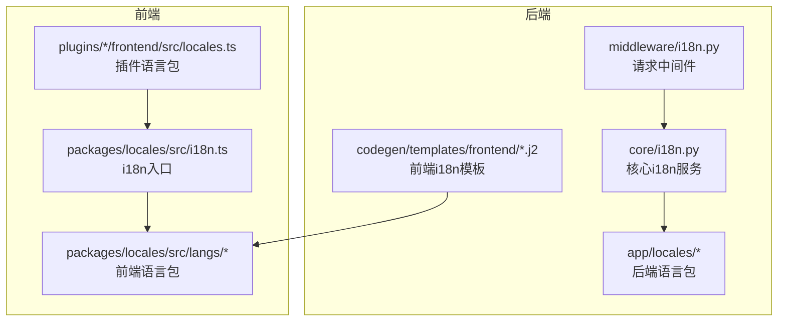
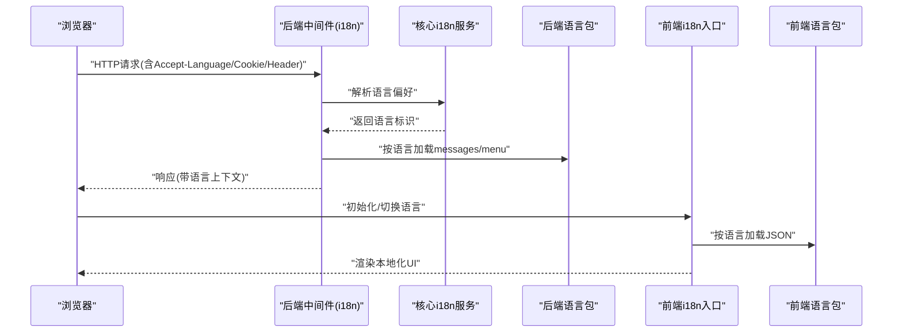
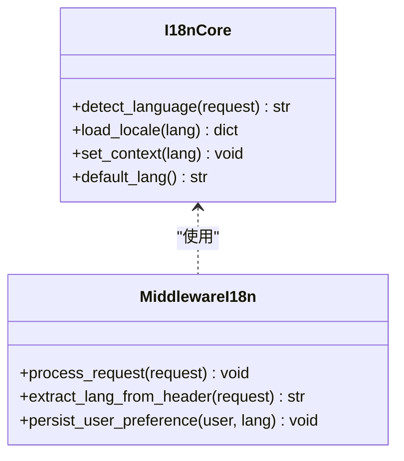
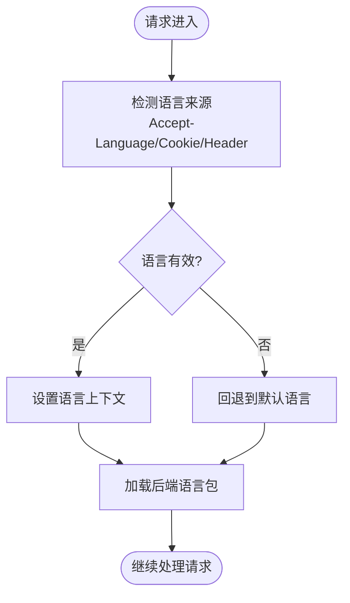
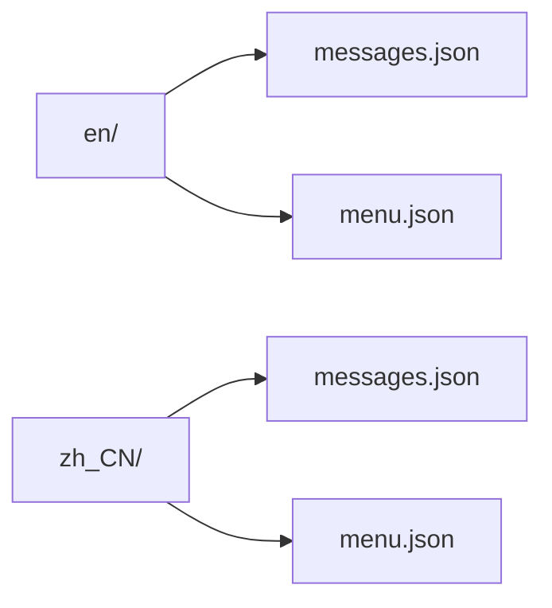
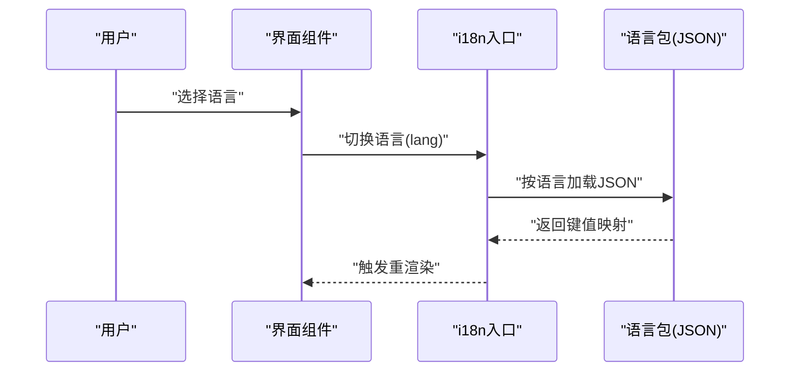
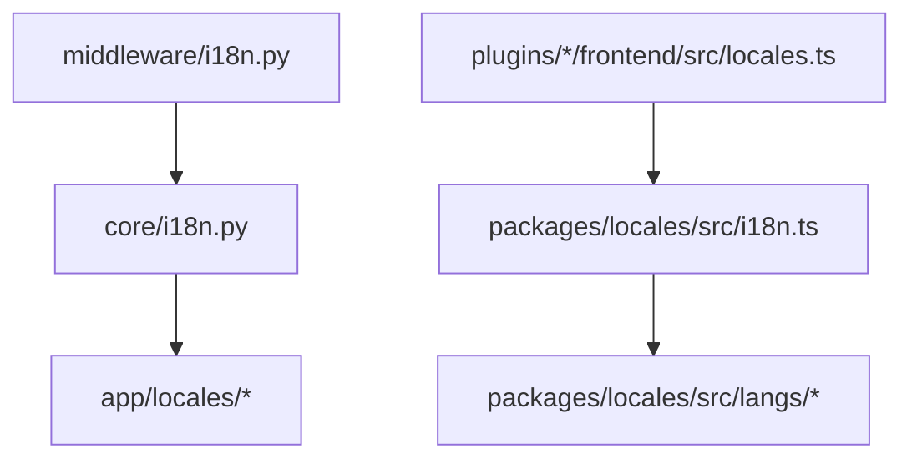

# 国际化系统

<cite>
**本文档引用的文件**
- [backend/app/core/i18n.py](file://backend/app/core/i18n.py)
- [backend/app/middleware/i18n.py](file://backend/app/middleware/i18n.py)
- [backend/app/locales/en/messages.json](file://backend/app/locales/en/messages.json)
- [backend/app/locales/zh_CN/messages.json](file://backend/app/locales/zh_CN/messages.json)
- [backend/app/locales/en/menu.json](file://backend/app/locales/en/menu.json)
- [backend/app/locales/zh_CN/menu.json](file://backend/app/locales/zh_CN/menu.json)
- [frontend/packages/locales/src/i18n.ts](file://frontend/packages/locales/src/i18n.ts)
- [frontend/packages/locales/src/index.ts](file://frontend/packages/locales/src/index.ts)
- [frontend/packages/locales/src/typing.ts](file://frontend/packages/locales/src/typing.ts)
- [frontend/packages/locales/src/langs/en-US/authentication.json](file://frontend/packages/locales/src/langs/en-US/authentication.json)
- [frontend/packages/locales/src/langs/en-US/common.json](file://frontend/packages/locales/src/langs/en-US/common.json)
- [frontend/packages/locales/src/langs/en-US/preferences.json](file://frontend/packages/locales/src/langs/en-US/preferences.json)
- [frontend/packages/locales/src/langs/en-US/ui.json](file://frontend/packages/locales/src/langs/en-US/ui.json)
- [frontend/packages/locales/src/langs/zh-CN/authentication.json](file://frontend/packages/locales/src/langs/zh-CN/authentication.json)
- [frontend/packages/locales/src/langs/zh-CN/common.json](file://frontend/packages/locales/src/langs/zh-CN/common.json)
- [frontend/packages/locales/src/langs/zh-CN/preferences.json](file://frontend/packages/locales/src/langs/zh-CN/preferences.json)
- [frontend/packages/locales/src/langs/zh-CN/ui.json](file://frontend/packages/locales/src/langs/zh-CN/ui.json)
- [backend/plugins/novusdoc/frontend/src/locales.ts](file://backend/plugins/novusdoc/frontend/src/locales.ts)
- [backend/plugins/slider-captcha/frontend/src/locales.ts](file://backend/plugins/slider-captcha/frontend/src/locales.ts)
- [backend/plugins/storage-billing/frontend/src/locales.ts](file://backend/plugins/storage-billing/frontend/src/locales.ts)
- [backend/plugins/storage-migration/frontend/src/locales.ts](file://backend/plugins/storage-migration/frontend/src/locales.ts)
- [backend/plugins/weather-widget/frontend/src/locales.ts](file://backend/plugins/weather-widget/frontend/src/locales.ts)
- [backend/app/codegen/templates/frontend/i18n_en.json.j2](file://backend/app/codegen/templates/frontend/i18n_en.json.j2)
- [backend/app/codegen/templates/frontend/i18n_zh.json.j2](file://backend/app/codegen/templates/frontend/i18n_zh.json.j2)
- [backend/tests/test_plugin_preview_i18n.py](file://backend/tests/test_plugin_preview_i18n.py)
</cite>

## 目录
1. [简介](#简介)
2. [项目结构](#项目结构)
3. [核心组件](#核心组件)
4. [架构总览](#架构总览)
5. [详细组件分析](#详细组件分析)
6. [依赖关系分析](#依赖关系分析)
7. [性能考虑](#性能考虑)
8. [故障排除指南](#故障排除指南)
9. [结论](#结论)
10. [附录](#附录)

## 简介
本文件面向NovusAI SaaS的国际化系统，系统性梳理后端与前端的多语言资源管理、动态语言切换与本地化策略，覆盖语言包组织结构、命名空间管理、翻译键值设计、运行时语言切换、浏览器语言检测与用户偏好保存机制，以及日期、数字、货币等本地化格式处理。同时提供翻译文件热更新、增量更新与版本管理建议，并给出国际化开发规范、翻译质量保证与多语言测试策略。

## 项目结构
国际化系统由前后端协同构成：
- 后端：核心i18n模块负责语言检测与上下文注入；中间件在请求生命周期中解析语言；应用级语言包位于`backend/app/locales`；代码生成模板用于前端i18n文件生成。
- 前端：统一的语言包目录`frontend/packages/locales/src/langs`按语言分层组织；公共入口导出i18n实例；插件前端也提供各自的语言包与注册。

**图表来源**
- [backend/app/core/i18n.py](file://backend/app/core/i18n.py)
- [backend/app/middleware/i18n.py](file://backend/app/middleware/i18n.py)
- [backend/app/locales/en/messages.json](file://backend/app/locales/en/messages.json)
- [backend/app/locales/zh_CN/messages.json](file://backend/app/locales/zh_CN/messages.json)
- [frontend/packages/locales/src/i18n.ts](file://frontend/packages/locales/src/i18n.ts)
- [frontend/packages/locales/src/langs/en-US/authentication.json](file://frontend/packages/locales/src/langs/en-US/authentication.json)
- [frontend/packages/locales/src/langs/zh-CN/authentication.json](file://frontend/packages/locales/src/langs/zh-CN/authentication.json)
- [backend/app/codegen/templates/frontend/i18n_en.json.j2](file://backend/app/codegen/templates/frontend/i18n_en.json.j2)

**章节来源**
- [backend/app/core/i18n.py](file://backend/app/core/i18n.py)
- [backend/app/middleware/i18n.py](file://backend/app/middleware/i18n.py)
- [backend/app/locales/en/messages.json](file://backend/app/locales/en/messages.json)
- [backend/app/locales/zh_CN/messages.json](file://backend/app/locales/zh_CN/messages.json)
- [frontend/packages/locales/src/i18n.ts](file://frontend/packages/locales/src/i18n.ts)
- [frontend/packages/locales/src/langs/en-US/authentication.json](file://frontend/packages/locales/src/langs/en-US/authentication.json)
- [frontend/packages/locales/src/langs/zh-CN/authentication.json](file://frontend/packages/locales/src/langs/zh-CN/authentication.json)
- [backend/app/codegen/templates/frontend/i18n_en.json.j2](file://backend/app/codegen/templates/frontend/i18n_en.json.j2)

## 核心组件
- 后端核心i18n服务：提供语言检测、区域设置、上下文注入与默认语言配置。
- 请求中间件：在请求进入时解析Accept-Language、Cookie或Header中的语言偏好，设置当前语言并注入到请求上下文。
- 应用语言包：后端messages.json与menu.json分别承载业务消息与菜单文案，支持en与zh_CN两套语言。
- 前端i18n入口：统一导出i18n实例，按需加载语言包，支持动态切换。
- 插件语言包：各插件前端提供locales.ts注册自身语言包，参与全局i18n体系。
- 代码生成模板：通过Jinja2模板生成前端i18n文件，确保前后端语言包一致性。

**章节来源**
- [backend/app/core/i18n.py](file://backend/app/core/i18n.py)
- [backend/app/middleware/i18n.py](file://backend/app/middleware/i18n.py)
- [backend/app/locales/en/messages.json](file://backend/app/locales/en/messages.json)
- [backend/app/locales/zh_CN/messages.json](file://backend/app/locales/zh_CN/messages.json)
- [frontend/packages/locales/src/i18n.ts](file://frontend/packages/locales/src/i18n.ts)
- [backend/plugins/novusdoc/frontend/src/locales.ts](file://backend/plugins/novusdoc/frontend/src/locales.ts)
- [backend/app/codegen/templates/frontend/i18n_en.json.j2](file://backend/app/codegen/templates/frontend/i18n_en.json.j2)

## 架构总览
整体架构遵循“后端语言检测+前端动态切换”的双层策略。后端中间件负责语言选择与上下文注入，前端根据用户偏好与浏览器语言进行切换，并持久化用户偏好。

**图表来源**
- [backend/app/middleware/i18n.py](file://backend/app/middleware/i18n.py)
- [backend/app/core/i18n.py](file://backend/app/core/i18n.py)
- [backend/app/locales/en/messages.json](file://backend/app/locales/en/messages.json)
- [frontend/packages/locales/src/i18n.ts](file://frontend/packages/locales/src/i18n.ts)
- [frontend/packages/locales/src/langs/en-US/authentication.json](file://frontend/packages/locales/src/langs/en-US/authentication.json)

## 详细组件分析

### 后端i18n核心服务
- 职责：定义语言检测策略、默认语言、区域设置与上下文注入接口。
- 关键点：支持从请求头、Cookie或自定义Header中提取语言；提供语言可用性校验与回退逻辑。
- 复杂度：O(1)语言解析，O(n)语言包加载（n为键数量）。

**图表来源**
- [backend/app/core/i18n.py](file://backend/app/core/i18n.py)
- [backend/app/middleware/i18n.py](file://backend/app/middleware/i18n.py)

**章节来源**
- [backend/app/core/i18n.py](file://backend/app/core/i18n.py)
- [backend/app/middleware/i18n.py](file://backend/app/middleware/i18n.py)

### 请求中间件流程
- 浏览器语言检测：优先读取Accept-Language，其次Cookie或自定义Header。
- 用户偏好保存：若用户已登录，可将语言偏好写入用户配置并作为后续默认值。
- 上下文注入：将语言信息注入到请求上下文，供后续业务逻辑使用。

**图表来源**
- [backend/app/middleware/i18n.py](file://backend/app/middleware/i18n.py)
- [backend/app/core/i18n.py](file://backend/app/core/i18n.py)

**章节来源**
- [backend/app/middleware/i18n.py](file://backend/app/middleware/i18n.py)
- [backend/app/core/i18n.py](file://backend/app/core/i18n.py)

### 后端语言包组织
- 结构：每种语言一个目录，包含messages.json与menu.json两类资源。
- 设计：messages.json承载通用业务文案，menu.json承载导航菜单文案，便于按需加载。
- 扩展：新增语言只需复制现有目录结构并填充对应JSON文件。

**图表来源**
- [backend/app/locales/en/messages.json](file://backend/app/locales/en/messages.json)
- [backend/app/locales/zh_CN/messages.json](file://backend/app/locales/zh_CN/messages.json)
- [backend/app/locales/en/menu.json](file://backend/app/locales/en/menu.json)
- [backend/app/locales/zh_CN/menu.json](file://backend/app/locales/zh_CN/menu.json)

**章节来源**
- [backend/app/locales/en/messages.json](file://backend/app/locales/en/messages.json)
- [backend/app/locales/zh_CN/messages.json](file://backend/app/locales/zh_CN/messages.json)
- [backend/app/locales/en/menu.json](file://backend/app/locales/en/menu.json)
- [backend/app/locales/zh_CN/menu.json](file://backend/app/locales/zh_CN/menu.json)

### 前端i18n入口与动态切换
- 入口导出：统一的i18n实例，封装加载、切换与查询方法。
- 动态切换：根据用户选择或浏览器语言动态加载对应语言包，更新UI。
- 命名空间：按功能域划分JSON文件（authentication、common、preferences、ui），便于维护与增量更新。
- 插件集成：插件通过locales.ts注册自身语言包，参与全局切换。

**图表来源**
- [frontend/packages/locales/src/i18n.ts](file://frontend/packages/locales/src/i18n.ts)
- [frontend/packages/locales/src/langs/en-US/authentication.json](file://frontend/packages/locales/src/langs/en-US/authentication.json)
- [frontend/packages/locales/src/langs/zh-CN/authentication.json](file://frontend/packages/locales/src/langs/zh-CN/authentication.json)
- [backend/plugins/novusdoc/frontend/src/locales.ts](file://backend/plugins/novusdoc/frontend/src/locales.ts)

**章节来源**
- [frontend/packages/locales/src/i18n.ts](file://frontend/packages/locales/src/i18n.ts)
- [frontend/packages/locales/src/index.ts](file://frontend/packages/locales/src/index.ts)
- [frontend/packages/locales/src/typing.ts](file://frontend/packages/locales/src/typing.ts)
- [frontend/packages/locales/src/langs/en-US/authentication.json](file://frontend/packages/locales/src/langs/en-US/authentication.json)
- [frontend/packages/locales/src/langs/zh-CN/authentication.json](file://frontend/packages/locales/src/langs/zh-CN/authentication.json)
- [backend/plugins/novusdoc/frontend/src/locales.ts](file://backend/plugins/novusdoc/frontend/src/locales.ts)

### 插件前端语言包
- 注册方式：每个插件前端提供locales.ts，向全局i18n系统注册语言包。
- 作用：使插件功能文案支持多语言，保持与主应用一致的切换体验。

**章节来源**
- [backend/plugins/novusdoc/frontend/src/locales.ts](file://backend/plugins/novusdoc/frontend/src/locales.ts)
- [backend/plugins/slider-captcha/frontend/src/locales.ts](file://backend/plugins/slider-captcha/frontend/src/locales.ts)
- [backend/plugins/storage-billing/frontend/src/locales.ts](file://backend/plugins/storage-billing/frontend/src/locales.ts)
- [backend/plugins/storage-migration/frontend/src/locales.ts](file://backend/plugins/storage-migration/frontend/src/locales.ts)
- [backend/plugins/weather-widget/frontend/src/locales.ts](file://backend/plugins/weather-widget/frontend/src/locales.ts)

### 代码生成与前端i18n同步
- 模板驱动：通过Jinja2模板生成前端i18n文件，确保前后端语言包键值一致。
- 适用场景：新功能或后端文案变更时，批量生成前端语言包，减少手工维护成本。

**章节来源**
- [backend/app/codegen/templates/frontend/i18n_en.json.j2](file://backend/app/codegen/templates/frontend/i18n_en.json.j2)
- [backend/app/codegen/templates/frontend/i18n_zh.json.j2](file://backend/app/codegen/templates/frontend/i18n_zh.json.j2)

## 依赖关系分析
- 后端中间件依赖核心i18n服务进行语言解析与上下文设置。
- 核心i18n服务依赖后端语言包进行文案加载。
- 前端i18n入口依赖语言包JSON进行渲染。
- 插件语言包通过注册机制与前端i18n入口耦合。

**图表来源**
- [backend/app/middleware/i18n.py](file://backend/app/middleware/i18n.py)
- [backend/app/core/i18n.py](file://backend/app/core/i18n.py)
- [backend/app/locales/en/messages.json](file://backend/app/locales/en/messages.json)
- [frontend/packages/locales/src/i18n.ts](file://frontend/packages/locales/src/i18n.ts)
- [frontend/packages/locales/src/langs/en-US/authentication.json](file://frontend/packages/locales/src/langs/en-US/authentication.json)
- [backend/plugins/novusdoc/frontend/src/locales.ts](file://backend/plugins/novusdoc/frontend/src/locales.ts)

**章节来源**
- [backend/app/middleware/i18n.py](file://backend/app/middleware/i18n.py)
- [backend/app/core/i18n.py](file://backend/app/core/i18n.py)
- [frontend/packages/locales/src/i18n.ts](file://frontend/packages/locales/src/i18n.ts)
- [backend/plugins/novusdoc/frontend/src/locales.ts](file://backend/plugins/novusdoc/frontend/src/locales.ts)

## 性能考虑
- 语言包加载优化：采用按需加载与缓存策略，避免重复请求同一语言包。
- 切换延迟控制：前端切换语言时应提供骨架屏或占位符，减少白屏时间。
- 后端缓存：对常用键值进行内存缓存，降低频繁解析成本。
- CDN分发：前端语言包可通过CDN加速，缩短首屏加载时间。

## 故障排除指南
- 语言包缺失：检查目标语言目录是否存在，JSON格式是否正确。
- 中间件未生效：确认请求头Accept-Language或Cookie/Header是否正确传递。
- 插件语言不显示：检查插件locales.ts注册是否成功，命名空间是否匹配。
- 测试验证：参考插件预览i18n测试用例，确保语言切换与键值解析正常。

**章节来源**
- [backend/tests/test_plugin_preview_i18n.py](file://backend/tests/test_plugin_preview_i18n.py)

## 结论
本系统通过后端中间件与前端i18n入口的协作，实现了从浏览器语言检测到用户偏好的完整链路。语言包采用清晰的目录与命名规范，配合插件化扩展与代码生成模板，满足了多语言需求与可维护性要求。建议在生产环境中进一步完善热更新、增量更新与版本管理策略，以提升用户体验与开发效率。

## 附录

### 语言包组织与命名空间管理
- 后端：按语言目录组织，messages.json与menu.json分离职责。
- 前端：按功能域拆分JSON文件，便于团队协作与独立维护。
- 插件：通过locales.ts注册，统一纳入全局i18n体系。

**章节来源**
- [backend/app/locales/en/messages.json](file://backend/app/locales/en/messages.json)
- [backend/app/locales/zh_CN/messages.json](file://backend/app/locales/zh_CN/messages.json)
- [frontend/packages/locales/src/langs/en-US/authentication.json](file://frontend/packages/locales/src/langs/en-US/authentication.json)
- [frontend/packages/locales/src/langs/zh-CN/authentication.json](file://frontend/packages/locales/src/langs/zh-CN/authentication.json)
- [backend/plugins/novusdoc/frontend/src/locales.ts](file://backend/plugins/novusdoc/frontend/src/locales.ts)

### 运行时语言切换与用户偏好保存
- 切换机制：前端根据用户选择或浏览器语言动态加载语言包并更新上下文。
- 偏好持久化：登录用户偏好可保存至用户配置，作为下次访问的默认语言。
- 回退策略：当用户偏好或浏览器语言不可用时，回退到系统默认语言。

**章节来源**
- [frontend/packages/locales/src/i18n.ts](file://frontend/packages/locales/src/i18n.ts)
- [backend/app/middleware/i18n.py](file://backend/app/middleware/i18n.py)

### 日期、数字、货币本地化处理
- 日期格式：根据语言环境选择合适的日期格式与本地化名称。
- 数字格式：千分位分隔符与小数点符号按地区规则显示。
- 货币显示：结合语言与地区选择货币符号与格式，必要时进行汇率转换。

[本节为通用指导，无需特定文件引用]

### 翻译文件热更新、增量更新与版本管理
- 热更新：前端监听语言包变化，支持动态替换键值映射，减少刷新开销。
- 增量更新：仅更新变更的键值，避免全量替换，降低传输与解析成本。
- 版本管理：为语言包添加版本号，后端与前端在启动时校验版本一致性，防止错配。

[本节为通用指导，无需特定文件引用]

### 国际化开发规范
- 键值设计：采用层级命名空间（如ui.button.submit），避免歧义。
- 文案编写：保持简洁、上下文明确，避免嵌入HTML标签。
- 插件规范：插件语言包需与主应用命名空间隔离，避免冲突。

[本节为通用指导，无需特定文件引用]

### 翻译质量保证与多语言测试策略
- 质量检查：建立键值完整性检查与占位符一致性校验。
- 自动化测试：编写单元测试与端到端测试，覆盖语言切换与关键页面渲染。
- 回归测试：每次语言包更新后执行回归测试，确保无遗漏与错误。

**章节来源**
- [backend/tests/test_plugin_preview_i18n.py](file://backend/tests/test_plugin_preview_i18n.py)