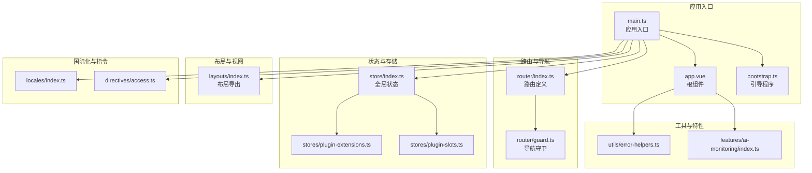
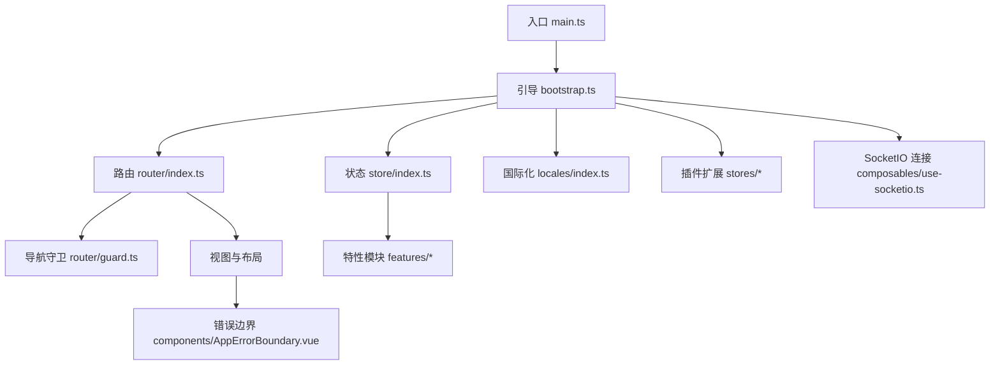
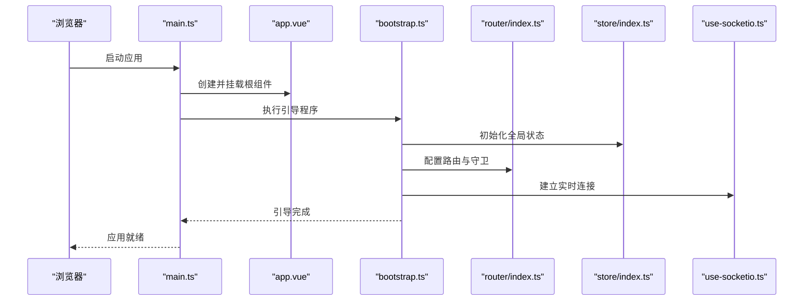
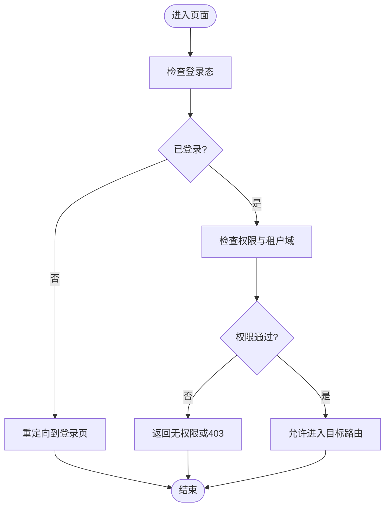
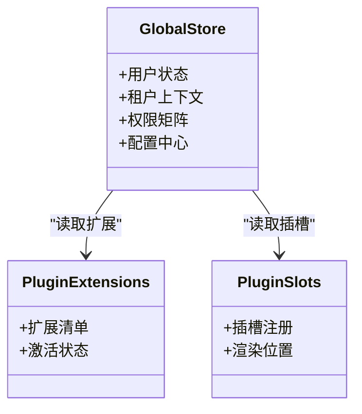
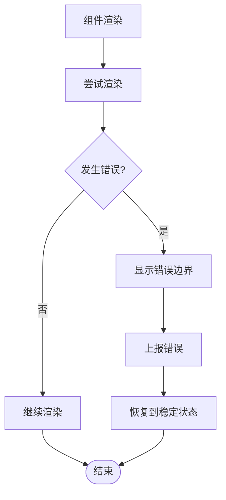
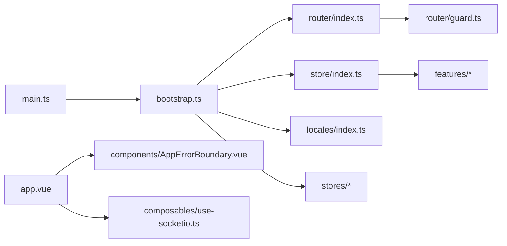

# 应用架构

<cite>
**本文引用的文件**
- [main.ts](file://frontend/apps/web-antd/src/main.ts)
- [app.vue](file://frontend/apps/web-antd/src/app.vue)
- [bootstrap.ts](file://frontend/apps/web-antd/src/bootstrap.ts)
- [router/index.ts](file://frontend/apps/web-antd/src/router/index.ts)
- [router/guard.ts](file://frontend/apps/web-antd/src/router/guard.ts)
- [store/index.ts](file://frontend/apps/web-antd/src/store/index.ts)
- [layouts/index.ts](file://frontend/apps/web-antd/src/layouts/index.ts)
- [components/AppErrorBoundary.vue](file://frontend/apps/web-antd/src/components/AppErrorBoundary.vue)
- [vite.config.mts](file://frontend/apps/web-antd/vite.config.mts)
- [package.json](file://frontend/apps/web-antd/package.json)
- [index.html](file://frontend/apps/web-antd/index.html)
- [loading.html](file://frontend/apps/web-antd/loading.html)
- [locales/index.ts](file://frontend/apps/web-antd/src/locales/index.ts)
- [directives/access.ts](file://frontend/apps/web-antd/src/directives/access.ts)
- [constants/endpoints.ts](file://frontend/apps/web-antd/src/constants/endpoints.ts)
- [utils/error-helpers.ts](file://frontend/apps/web-antd/src/utils/error-helpers.ts)
- [composables/use-socketio.ts](file://frontend/apps/web-antd/src/composables/use-socketio.ts)
- [features/ai-monitoring/index.ts](file://frontend/apps/web-antd/src/features/ai-monitoring/index.ts)
- [stores/plugin-extensions.ts](file://frontend/apps/web-antd/src/stores/plugin-extensions.ts)
- [stores/plugin-slots.ts](file://frontend/apps/web-antd/src/stores/plugin-slots.ts)
</cite>

## 目录
1. [引言](#引言)
2. [项目结构](#项目结构)
3. [核心组件](#核心组件)
4. [架构总览](#架构总览)
5. [详细组件分析](#详细组件分析)
6. [依赖关系分析](#依赖关系分析)
7. [性能考虑](#性能考虑)
8. [故障排查指南](#故障排查指南)
9. [结论](#结论)
10. [附录](#附录)

## 引言
本文件面向NovusAI SaaS前端应用，系统性阐述基于Vue.js 3.x的单页应用（SPA）整体架构设计。内容涵盖应用初始化流程、引导程序设计、主组件结构、启动过程、依赖注入机制、全局配置管理、生命周期管理、错误边界处理、性能监控集成、开发与生产环境差异化配置、构建优化与代码分割策略、安全策略（含CSP与XSS防护）、以及最佳实践与扩展指南。文档旨在帮助开发者快速理解并高效扩展该前端应用。

## 项目结构
前端采用多包工作区组织，核心应用位于apps/web-antd，采用Vite作为构建工具，TypeScript提供类型保障。项目遵循“功能域+分层”的组织方式：路由、布局、状态、国际化、指令、工具函数、API封装、特性模块等按职责划分，便于维护与扩展。

**图表来源**
- [main.ts:1-200](file://frontend/apps/web-antd/src/main.ts#L1-L200)
- [app.vue:1-200](file://frontend/apps/web-antd/src/app.vue#L1-L200)
- [bootstrap.ts:1-200](file://frontend/apps/web-antd/src/bootstrap.ts#L1-L200)
- [router/index.ts:1-200](file://frontend/apps/web-antd/src/router/index.ts#L1-L200)
- [router/guard.ts:1-200](file://frontend/apps/web-antd/src/router/guard.ts#L1-L200)
- [store/index.ts:1-200](file://frontend/apps/web-antd/src/store/index.ts#L1-L200)
- [layouts/index.ts:1-200](file://frontend/apps/web-antd/src/layouts/index.ts#L1-L200)
- [locales/index.ts:1-200](file://frontend/apps/web-antd/src/locales/index.ts#L1-L200)
- [directives/access.ts:1-200](file://frontend/apps/web-antd/src/directives/access.ts#L1-L200)
- [utils/error-helpers.ts:1-200](file://frontend/apps/web-antd/src/utils/error-helpers.ts#L1-L200)
- [features/ai-monitoring/index.ts:1-200](file://frontend/apps/web-antd/src/features/ai-monitoring/index.ts#L1-L200)
- [stores/plugin-extensions.ts:1-200](file://frontend/apps/web-antd/src/stores/plugin-extensions.ts#L1-L200)
- [stores/plugin-slots.ts:1-200](file://frontend/apps/web-antd/src/stores/plugin-slots.ts#L1-L200)

**章节来源**
- [main.ts:1-200](file://frontend/apps/web-antd/src/main.ts#L1-L200)
- [app.vue:1-200](file://frontend/apps/web-antd/src/app.vue#L1-L200)
- [bootstrap.ts:1-200](file://frontend/apps/web-antd/src/bootstrap.ts#L1-L200)
- [router/index.ts:1-200](file://frontend/apps/web-antd/src/router/index.ts#L1-L200)
- [store/index.ts:1-200](file://frontend/apps/web-antd/src/store/index.ts#L1-L200)
- [layouts/index.ts:1-200](file://frontend/apps/web-antd/src/layouts/index.ts#L1-L200)
- [locales/index.ts:1-200](file://frontend/apps/web-antd/src/locales/index.ts#L1-L200)
- [directives/access.ts:1-200](file://frontend/apps/web-antd/src/directives/access.ts#L1-L200)
- [utils/error-helpers.ts:1-200](file://frontend/apps/web-antd/src/utils/error-helpers.ts#L1-L200)
- [features/ai-monitoring/index.ts:1-200](file://frontend/apps/web-antd/src/features/ai-monitoring/index.ts#L1-L200)
- [stores/plugin-extensions.ts:1-200](file://frontend/apps/web-antd/src/stores/plugin-extensions.ts#L1-L200)
- [stores/plugin-slots.ts:1-200](file://frontend/apps/web-antd/src/stores/plugin-slots.ts#L1-L200)

## 核心组件
- 应用入口与引导程序
  - 入口文件负责创建Vue应用实例、挂载根组件、注册插件与全局配置，并触发引导流程。
  - 引导程序负责初始化全局状态、国际化、权限与租户上下文、SocketIO连接、插件扩展加载等关键步骤。
- 路由与导航守卫
  - 路由集中定义页面级视图与动态路由；导航守卫统一处理鉴权、权限、租户域与访问控制。
- 状态与存储
  - 全局状态通过Vuex风格的模块化Store管理；插件扩展与插槽通过独立Store进行解耦。
- 布局与视图
  - 布局系统支持多场景（认证、用户、管理员、租户），配合视图目录实现按角色与域的页面组织。
- 国际化与指令
  - 国际化模块集中管理语言包与运行时切换；自定义指令用于细粒度权限控制。
- 错误边界与工具
  - 错误边界组件捕获渲染异常；错误辅助工具提供统一错误处理与上报。

**章节来源**
- [main.ts:1-200](file://frontend/apps/web-antd/src/main.ts#L1-L200)
- [bootstrap.ts:1-200](file://frontend/apps/web-antd/src/bootstrap.ts#L1-L200)
- [router/guard.ts:1-200](file://frontend/apps/web-antd/src/router/guard.ts#L1-L200)
- [store/index.ts:1-200](file://frontend/apps/web-antd/src/store/index.ts#L1-L200)
- [stores/plugin-extensions.ts:1-200](file://frontend/apps/web-antd/src/stores/plugin-extensions.ts#L1-L200)
- [stores/plugin-slots.ts:1-200](file://frontend/apps/web-antd/src/stores/plugin-slots.ts#L1-L200)
- [layouts/index.ts:1-200](file://frontend/apps/web-antd/src/layouts/index.ts#L1-L200)
- [locales/index.ts:1-200](file://frontend/apps/web-antd/src/locales/index.ts#L1-L200)
- [directives/access.ts:1-200](file://frontend/apps/web-antd/src/directives/access.ts#L1-L200)
- [components/AppErrorBoundary.vue:1-200](file://frontend/apps/web-antd/src/components/AppErrorBoundary.vue#L1-L200)
- [utils/error-helpers.ts:1-200](file://frontend/apps/web-antd/src/utils/error-helpers.ts#L1-L200)

## 架构总览
应用采用“入口-引导-路由-状态-布局-特性”的分层架构。入口负责应用生命周期的起点；引导程序完成全局初始化；路由与守卫确保访问安全与正确性；状态与存储支撑业务数据与插件生态；布局与视图承载UI体验；特性模块（如AI监控）在不侵入核心的前提下扩展能力。

**图表来源**
- [main.ts:1-200](file://frontend/apps/web-antd/src/main.ts#L1-L200)
- [bootstrap.ts:1-200](file://frontend/apps/web-antd/src/bootstrap.ts#L1-L200)
- [router/index.ts:1-200](file://frontend/apps/web-antd/src/router/index.ts#L1-L200)
- [router/guard.ts:1-200](file://frontend/apps/web-antd/src/router/guard.ts#L1-L200)
- [store/index.ts:1-200](file://frontend/apps/web-antd/src/store/index.ts#L1-L200)
- [locales/index.ts:1-200](file://frontend/apps/web-antd/src/locales/index.ts#L1-L200)
- [stores/plugin-extensions.ts:1-200](file://frontend/apps/web-antd/src/stores/plugin-extensions.ts#L1-L200)
- [stores/plugin-slots.ts:1-200](file://frontend/apps/web-antd/src/stores/plugin-slots.ts#L1-L200)
- [components/AppErrorBoundary.vue:1-200](file://frontend/apps/web-antd/src/components/AppErrorBoundary.vue#L1-L200)
- [composables/use-socketio.ts:1-200](file://frontend/apps/web-antd/src/composables/use-socketio.ts#L1-L200)

## 详细组件分析

### 应用初始化与引导流程
- 初始化阶段
  - 创建Vue应用实例，挂载根组件app.vue。
  - 注册全局插件（如路由、状态、国际化、指令等）。
  - 触发引导程序，执行全局初始化任务。
- 引导阶段
  - 初始化全局状态与持久化策略。
  - 加载并应用国际化资源。
  - 解析租户与权限上下文，建立访问控制基础。
  - 建立SocketIO连接以支持实时通信。
  - 加载插件扩展与插槽，注入特性能力。
- 生命周期
  - 在beforeMount阶段完成关键初始化，在mounted后进入正常运行态。
  - 提供卸载钩子以清理定时器、事件监听与SocketIO连接。

**图表来源**
- [main.ts:1-200](file://frontend/apps/web-antd/src/main.ts#L1-L200)
- [app.vue:1-200](file://frontend/apps/web-antd/src/app.vue#L1-L200)
- [bootstrap.ts:1-200](file://frontend/apps/web-antd/src/bootstrap.ts#L1-L200)
- [router/index.ts:1-200](file://frontend/apps/web-antd/src/router/index.ts#L1-L200)
- [store/index.ts:1-200](file://frontend/apps/web-antd/src/store/index.ts#L1-L200)
- [composables/use-socketio.ts:1-200](file://frontend/apps/web-antd/src/composables/use-socketio.ts#L1-L200)

**章节来源**
- [main.ts:1-200](file://frontend/apps/web-antd/src/main.ts#L1-L200)
- [app.vue:1-200](file://frontend/apps/web-antd/src/app.vue#L1-L200)
- [bootstrap.ts:1-200](file://frontend/apps/web-antd/src/bootstrap.ts#L1-L200)

### 路由与导航守卫
- 路由定义
  - 采用模块化路由组织，按域（公共、租户、用户、管理员）拆分路由表，支持动态路由与懒加载。
- 导航守卫
  - 统一处理登录态校验、权限校验、租户域校验、访问控制策略与跳转逻辑。
  - 支持白名单与黑名单策略，避免未授权访问。

**图表来源**
- [router/guard.ts:1-200](file://frontend/apps/web-antd/src/router/guard.ts#L1-L200)
- [router/index.ts:1-200](file://frontend/apps/web-antd/src/router/index.ts#L1-L200)

**章节来源**
- [router/index.ts:1-200](file://frontend/apps/web-antd/src/router/index.ts#L1-L200)
- [router/guard.ts:1-200](file://frontend/apps/web-antd/src/router/guard.ts#L1-L200)

### 状态与存储管理
- 全局状态
  - 通过模块化Store管理用户、租户、权限、配置等全局数据，支持持久化与响应式更新。
- 插件生态
  - 插件扩展与插槽通过独立Store解耦，便于第三方能力注入与管理。

**图表来源**
- [store/index.ts:1-200](file://frontend/apps/web-antd/src/store/index.ts#L1-L200)
- [stores/plugin-extensions.ts:1-200](file://frontend/apps/web-antd/src/stores/plugin-extensions.ts#L1-L200)
- [stores/plugin-slots.ts:1-200](file://frontend/apps/web-antd/src/stores/plugin-slots.ts#L1-L200)

**章节来源**
- [store/index.ts:1-200](file://frontend/apps/web-antd/src/store/index.ts#L1-L200)
- [stores/plugin-extensions.ts:1-200](file://frontend/apps/web-antd/src/stores/plugin-extensions.ts#L1-L200)
- [stores/plugin-slots.ts:1-200](file://frontend/apps/web-antd/src/stores/plugin-slots.ts#L1-L200)

### 错误边界与异常处理
- 渲染期错误捕获
  - 使用错误边界组件捕获子树渲染异常，防止应用崩溃并提供降级UI。
- 运行时错误处理
  - 错误辅助工具提供统一错误格式化、上报与提示策略，结合日志与监控系统。

**图表来源**
- [components/AppErrorBoundary.vue:1-200](file://frontend/apps/web-antd/src/components/AppErrorBoundary.vue#L1-L200)
- [utils/error-helpers.ts:1-200](file://frontend/apps/web-antd/src/utils/error-helpers.ts#L1-L200)

**章节来源**
- [components/AppErrorBoundary.vue:1-200](file://frontend/apps/web-antd/src/components/AppErrorBoundary.vue#L1-L200)
- [utils/error-helpers.ts:1-200](file://frontend/apps/web-antd/src/utils/error-helpers.ts#L1-L200)

### 国际化与指令
- 国际化
  - 语言包集中管理，支持运行时切换与回退策略，确保界面与文案一致性。
- 权限指令
  - 自定义指令用于DOM级权限控制，减少重复判断与条件渲染。

**章节来源**
- [locales/index.ts:1-200](file://frontend/apps/web-antd/src/locales/index.ts#L1-L200)
- [directives/access.ts:1-200](file://frontend/apps/web-antd/src/directives/access.ts#L1-L200)

### 特性模块与实时通信
- AI监控
  - 特性模块提供AI调用监控与诊断能力，支持性能指标采集与告警联动。
- SocketIO
  - 实时通信通过SocketIO连接，支持消息推送、状态同步与事件通知。

**章节来源**
- [features/ai-monitoring/index.ts:1-200](file://frontend/apps/web-antd/src/features/ai-monitoring/index.ts#L1-L200)
- [composables/use-socketio.ts:1-200](file://frontend/apps/web-antd/src/composables/use-socketio.ts#L1-L200)

## 依赖关系分析
- 模块内聚与解耦
  - 路由、状态、布局、国际化等模块相对独立，通过入口与引导程序耦合，降低交叉依赖风险。
- 外部依赖
  - Vue 3.x、Vue Router、Pinia/Vuex风格状态管理、SocketIO客户端、i18n库、Vite构建链路等。
- 插件生态
  - 插件扩展与插槽Store与核心模块弱耦合，通过约定接口与事件总线交互。

**图表来源**
- [main.ts:1-200](file://frontend/apps/web-antd/src/main.ts#L1-L200)
- [bootstrap.ts:1-200](file://frontend/apps/web-antd/src/bootstrap.ts#L1-L200)
- [router/index.ts:1-200](file://frontend/apps/web-antd/src/router/index.ts#L1-L200)
- [router/guard.ts:1-200](file://frontend/apps/web-antd/src/router/guard.ts#L1-L200)
- [store/index.ts:1-200](file://frontend/apps/web-antd/src/store/index.ts#L1-L200)
- [locales/index.ts:1-200](file://frontend/apps/web-antd/src/locales/index.ts#L1-L200)
- [stores/plugin-extensions.ts:1-200](file://frontend/apps/web-antd/src/stores/plugin-extensions.ts#L1-L200)
- [stores/plugin-slots.ts:1-200](file://frontend/apps/web-antd/src/stores/plugin-slots.ts#L1-L200)
- [components/AppErrorBoundary.vue:1-200](file://frontend/apps/web-antd/src/components/AppErrorBoundary.vue#L1-L200)
- [composables/use-socketio.ts:1-200](file://frontend/apps/web-antd/src/composables/use-socketio.ts#L1-L200)

**章节来源**
- [main.ts:1-200](file://frontend/apps/web-antd/src/main.ts#L1-L200)
- [bootstrap.ts:1-200](file://frontend/apps/web-antd/src/bootstrap.ts#L1-L200)
- [router/index.ts:1-200](file://frontend/apps/web-antd/src/router/index.ts#L1-L200)
- [router/guard.ts:1-200](file://frontend/apps/web-antd/src/router/guard.ts#L1-L200)
- [store/index.ts:1-200](file://frontend/apps/web-antd/src/store/index.ts#L1-L200)
- [locales/index.ts:1-200](file://frontend/apps/web-antd/src/locales/index.ts#L1-L200)
- [stores/plugin-extensions.ts:1-200](file://frontend/apps/web-antd/src/stores/plugin-extensions.ts#L1-L200)
- [stores/plugin-slots.ts:1-200](file://frontend/apps/web-antd/src/stores/plugin-slots.ts#L1-L200)
- [components/AppErrorBoundary.vue:1-200](file://frontend/apps/web-antd/src/components/AppErrorBoundary.vue#L1-L200)
- [composables/use-socketio.ts:1-200](file://frontend/apps/web-antd/src/composables/use-socketio.ts#L1-L200)

## 性能考虑
- 代码分割与懒加载
  - 路由级懒加载与按需导入组件，减少首屏体积与初次渲染时间。
- 构建优化
  - Vite默认启用Tree Shaking、模块热替换与压缩策略；生产构建开启作用域提升与最小化。
- 缓存与CDN
  - 静态资源版本化与缓存头配置，结合CDN加速静态资产分发。
- 实时通信优化
  - SocketIO连接池与重连策略，避免频繁握手与内存泄漏。
- 监控与诊断
  - 集成AI监控特性，采集关键指标并支持告警联动，辅助性能优化决策。

[本节为通用性能建议，无需特定文件引用]

## 故障排查指南
- 启动失败
  - 检查入口文件与引导程序是否正确注册插件与依赖；确认全局状态初始化顺序。
- 路由跳转异常
  - 排查导航守卫逻辑与权限配置；核对路由表与动态参数。
- 权限与租户问题
  - 校验权限指令与租户上下文解析；确认后端返回的权限矩阵与前端一致。
- 实时通信断连
  - 查看SocketIO连接状态与重连日志；检查网络与服务端心跳配置。
- 错误边界未生效
  - 确认错误边界包裹范围与抛错位置；检查错误辅助工具的上报链路。

**章节来源**
- [router/guard.ts:1-200](file://frontend/apps/web-antd/src/router/guard.ts#L1-L200)
- [utils/error-helpers.ts:1-200](file://frontend/apps/web-antd/src/utils/error-helpers.ts#L1-L200)
- [components/AppErrorBoundary.vue:1-200](file://frontend/apps/web-antd/src/components/AppErrorBoundary.vue#L1-L200)
- [composables/use-socketio.ts:1-200](file://frontend/apps/web-antd/src/composables/use-socketio.ts#L1-L200)

## 结论
该Vue.js 3.x SPA通过清晰的分层架构与模块化设计，实现了从入口到引导、从路由到状态、从布局到特性的完整闭环。借助插件生态与实时通信能力，应用具备良好的可扩展性与可维护性。结合构建优化与监控体系，可在保证用户体验的同时持续提升性能与稳定性。

[本节为总结性内容，无需特定文件引用]

## 附录

### 开发与生产环境差异化配置
- 环境变量
  - 通过Vite环境变量区分开发与生产，设置API基地址、调试开关与特性开关。
- 构建配置
  - 生产构建启用压缩、作用域提升与资源优化；开发构建启用SourceMap与HMR。
- 安全策略
  - CSP策略在生产环境严格限制脚本与资源来源；XSS防护通过模板编译与输入净化实现。

**章节来源**
- [vite.config.mts:1-200](file://frontend/apps/web-antd/vite.config.mts#L1-L200)
- [package.json:1-200](file://frontend/apps/web-antd/package.json#L1-L200)
- [index.html:1-200](file://frontend/apps/web-antd/index.html#L1-L200)
- [loading.html:1-200](file://frontend/apps/web-antd/loading.html#L1-L200)

### API与端点管理
- 端点常量
  - 将所有API端点集中管理，便于维护与变更追踪。
- 请求封装
  - 统一封装请求拦截、重试、超时与错误处理，提升稳定性与一致性。

**章节来源**
- [constants/endpoints.ts:1-200](file://frontend/apps/web-antd/src/constants/endpoints.ts#L1-L200)
- [utils/request/index.ts:1-200](file://frontend/apps/web-antd/src/utils/request/index.ts#L1-L200)

### 安全策略与合规
- CSP配置
  - 严格限制内联脚本与外链资源，仅允许可信来源；对动态脚本进行哈希校验。
- XSS防护
  - 对用户输入与富文本输出进行净化；模板中避免直接拼接HTML。
- 访问控制
  - 基于指令与守卫的双重控制，确保最小权限原则与租户隔离。

**章节来源**
- [directives/access.ts:1-200](file://frontend/apps/web-antd/src/directives/access.ts#L1-L200)
- [router/guard.ts:1-200](file://frontend/apps/web-antd/src/router/guard.ts#L1-L200)
- [utils/public-branding.ts:1-200](file://frontend/apps/web-antd/src/utils/public-branding.ts#L1-L200)

### 最佳实践与扩展指南
- 组件设计
  - 单一职责、可复用性强；优先使用组合式API与可组合函数。
- 状态管理
  - 将跨域数据放入全局Store，局部状态尽量组件内化；避免过度共享导致耦合。
- 路由组织
  - 按域与角色拆分路由，配合懒加载与命名路由，提升可维护性。
- 插件扩展
  - 通过插件扩展与插槽Store注入能力，保持核心模块纯净。
- 监控与可观测性
  - 集成性能指标与错误上报，定期回顾与优化。

[本节为通用指导，无需特定文件引用]