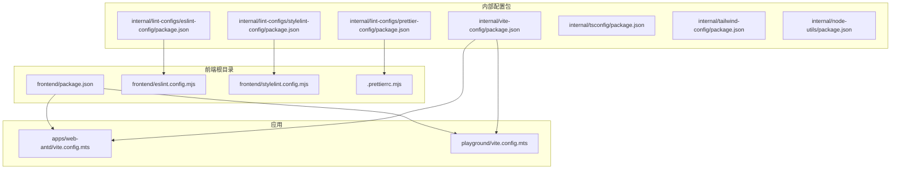
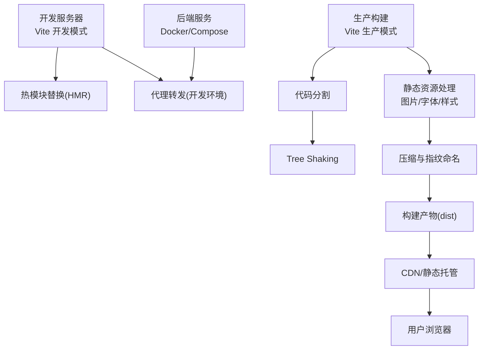
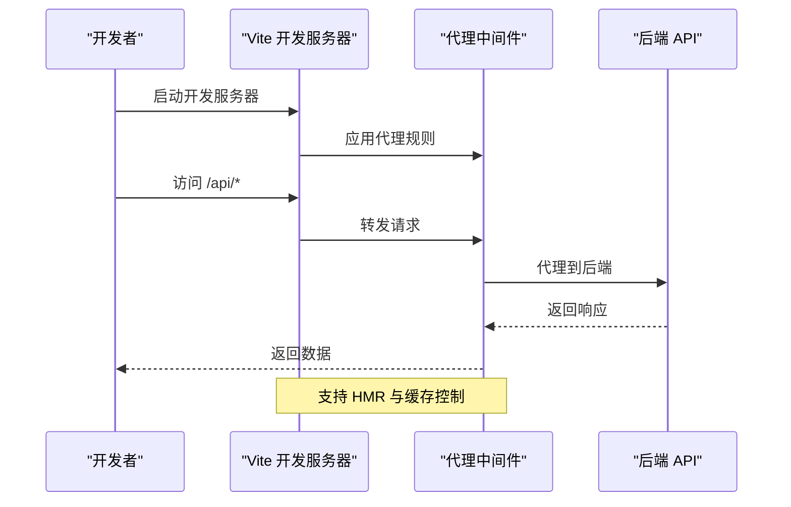
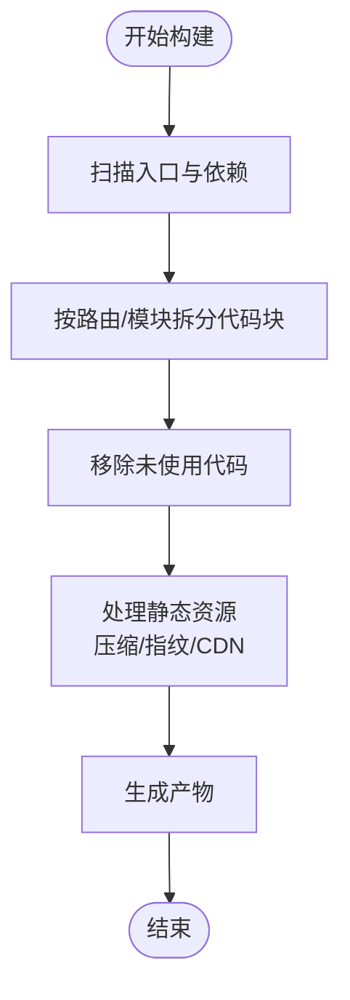
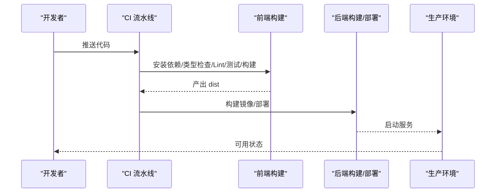
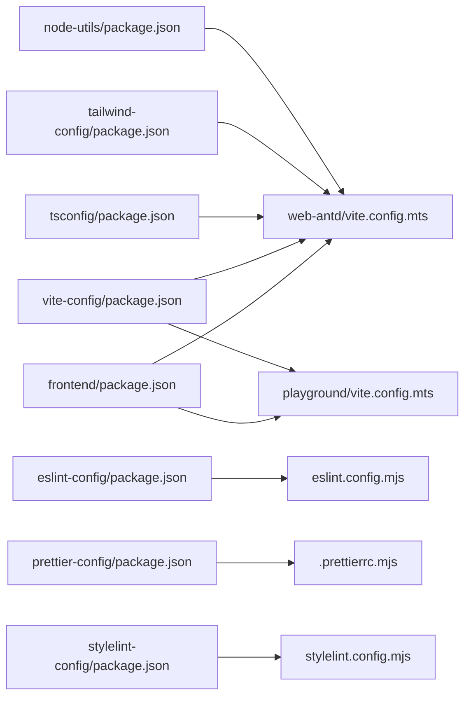

# 构建配置

<cite>
**本文引用的文件**
- [frontend/apps/web-antd/vite.config.mts](file://frontend/apps/web-antd/vite.config.mts)
- [frontend/eslint.config.mjs](file://frontend/eslint.config.mjs)
- [frontend/stylelint.config.mjs](file://frontend/stylelint.config.mjs)
- [frontend/.prettierrc.mjs](file://frontend/.prettierrc.mjs)
- [frontend/package.json](file://frontend/package.json)
- [frontend/apps/web-antd/tsconfig.json](file://frontend/apps/web-antd/tsconfig.json)
- [frontend/apps/web-antd/tsconfig.node.json](file://frontend/apps/web-antd/tsconfig.node.json)
- [frontend/playground/vite.config.mts](file://frontend/playground/vite.config.mts)
- [frontend/internal/vite-config/package.json](file://frontend/internal/vite-config/package.json)
- [frontend/internal/lint-configs/eslint-config/package.json](file://frontend/internal/lint-configs/eslint-config/package.json)
- [frontend/internal/lint-configs/prettier-config/package.json](file://frontend/internal/lint-configs/prettier-config/package.json)
- [frontend/internal/lint-configs/stylelint-config/package.json](file://frontend/internal/lint-configs/stylelint-config/package.json)
- [frontend/internal/tsconfig/package.json](file://frontend/internal/tsconfig/package.json)
- [frontend/internal/tailwind-config/package.json](file://frontend/internal/tailwind-config/package.json)
- [frontend/internal/node-utils/package.json](file://frontend/internal/node-utils/package.json)
- [frontend/scripts/deploy/](file://frontend/scripts/deploy/)
- [docker-compose.dev.yml](file://docker-compose.dev.yml)
- [docker-compose.prod.yml](file://docker-compose.prod.yml)
- [backend/Dockerfile](file://backend/Dockerfile)
- [backend/alembic.ini](file://backend/alembic.ini)
- [backend/pyproject.toml](file://backend/pyproject.toml)
- [backend/migrations/env.py](file://backend/migrations/env.py)
</cite>

## 目录
1. [引言](#引言)
2. [项目结构](#项目结构)
3. [核心组件](#核心组件)
4. [架构总览](#架构总览)
5. [详细组件分析](#详细组件分析)
6. [依赖关系分析](#依赖关系分析)
7. [性能考量](#性能考量)
8. [故障排查指南](#故障排查指南)
9. [结论](#结论)
10. [附录](#附录)

## 引言
本文件面向 NovusAI SaaS 的前端与全栈构建配置，系统性梳理 Vite 开发服务器与生产构建、TypeScript 编译、ESLint/Stylelint/Prettier 规则与格式化、环境变量与条件编译、静态资源与代码分割、Tree Shaking、Bundle 分析与优化、以及 CI/CD 集成与部署最佳实践。内容以仓库中实际配置文件为依据，避免臆测，确保可操作与可追溯。

## 项目结构
前端采用多应用与多包的组织方式：apps/web-antd 为主应用，playground 为演示应用；internal 下提供可复用的配置包（vite-config、lint-configs、tsconfig、tailwind-config、node-utils）。根级 frontend 目录包含统一的 Lint 与格式化配置，以及工作区与包管理配置。

图示来源
- [frontend/package.json](file://frontend/package.json)
- [frontend/eslint.config.mjs](file://frontend/eslint.config.mjs)
- [frontend/stylelint.config.mjs](file://frontend/stylelint.config.mjs)
- [frontend/.prettierrc.mjs](file://frontend/.prettierrc.mjs)
- [frontend/apps/web-antd/vite.config.mts](file://frontend/apps/web-antd/vite.config.mts)
- [frontend/playground/vite.config.mts](file://frontend/playground/vite.config.mts)
- [frontend/internal/vite-config/package.json](file://frontend/internal/vite-config/package.json)
- [frontend/internal/lint-configs/eslint-config/package.json](file://frontend/internal/lint-configs/eslint-config/package.json)
- [frontend/internal/lint-configs/prettier-config/package.json](file://frontend/internal/lint-configs/prettier-config/package.json)
- [frontend/internal/lint-configs/stylelint-config/package.json](file://frontend/internal/lint-configs/stylelint-config/package.json)
- [frontend/internal/tsconfig/package.json](file://frontend/internal/tsconfig/package.json)
- [frontend/internal/tailwind-config/package.json](file://frontend/internal/tailwind-config/package.json)
- [frontend/internal/node-utils/package.json](file://frontend/internal/node-utils/package.json)

章节来源
- [frontend/package.json](file://frontend/package.json)
- [frontend/apps/web-antd/vite.config.mts](file://frontend/apps/web-antd/vite.config.mts)
- [frontend/playground/vite.config.mts](file://frontend/playground/vite.config.mts)

## 核心组件
- Vite 构建与开发服务器：主应用与演示应用均通过各自 vite.config.* 进行配置，结合内部 vite-config 包实现统一能力。
- TypeScript 编译：应用层 tsconfig 与 node 层 tsconfig 分离，配合内部 tsconfig 包提供共享基础。
- Lint 与格式化：ESLint、Stylelint、Prettier 统一在根级配置，内部 lint-configs 提供可复用包。
- 环境变量与条件编译：通过 Vite 环境变量机制与构建时常量注入实现。
- 静态资源与代码分割：基于 Vite 默认策略与插件扩展，结合 Tree Shaking。
- 性能分析与 Bundle 优化：通过可视化分析工具与构建参数优化。
- CI/CD 与部署：结合 Docker Compose 与后端 Dockerfile 实现前后端一体化部署。

章节来源
- [frontend/apps/web-antd/vite.config.mts](file://frontend/apps/web-antd/vite.config.mts)
- [frontend/eslint.config.mjs](file://frontend/eslint.config.mjs)
- [frontend/stylelint.config.mjs](file://frontend/stylelint.config.mjs)
- [frontend/.prettierrc.mjs](file://frontend/.prettierrc.mjs)
- [frontend/apps/web-antd/tsconfig.json](file://frontend/apps/web-antd/tsconfig.json)
- [frontend/apps/web-antd/tsconfig.node.json](file://frontend/apps/web-antd/tsconfig.node.json)

## 架构总览
下图展示前端构建从源码到产物的关键流程：开发模式下的热更新与代理，生产模式下的打包、代码分割与资源处理，以及与后端服务的协作。

图示来源
- [frontend/apps/web-antd/vite.config.mts](file://frontend/apps/web-antd/vite.config.mts)
- [docker-compose.dev.yml](file://docker-compose.dev.yml)
- [docker-compose.prod.yml](file://docker-compose.prod.yml)
- [backend/Dockerfile](file://backend/Dockerfile)

## 详细组件分析

### Vite 配置与开发服务器
- 主应用与演示应用分别维护独立的 vite.config.*，便于隔离开发与演示场景。
- 建议在内部 vite-config 包中沉淀通用插件、别名、代理、构建选项等，通过 package.json 暴露给各应用复用。
- 开发服务器建议启用 HTTPS、代理后端接口、跨域头与缓存控制，以贴近生产环境。

图示来源
- [frontend/apps/web-antd/vite.config.mts](file://frontend/apps/web-antd/vite.config.mts)
- [docker-compose.dev.yml](file://docker-compose.dev.yml)

章节来源
- [frontend/apps/web-antd/vite.config.mts](file://frontend/apps/web-antd/vite.config.mts)
- [frontend/playground/vite.config.mts](file://frontend/playground/vite.config.mts)
- [frontend/internal/vite-config/package.json](file://frontend/internal/vite-config/package.json)

### TypeScript 编译配置
- 应用层 tsconfig 与 node 层 tsconfig 分离，分别用于浏览器端与 Node 工具链。
- 内部 tsconfig 包提供共享的基础编译选项，减少重复配置。
- 建议统一 target、module、jsx、strict 等关键项，确保跨包一致性。

章节来源
- [frontend/apps/web-antd/tsconfig.json](file://frontend/apps/web-antd/tsconfig.json)
- [frontend/apps/web-antd/tsconfig.node.json](file://frontend/apps/web-antd/tsconfig.node.json)
- [frontend/internal/tsconfig/package.json](file://frontend/internal/tsconfig/package.json)

### ESLint、Stylelint 与 Prettier
- 根级配置文件定义统一规则集，内部 lint-configs 提供可发布包，便于团队复用。
- 建议在 CI 中强制执行，结合编辑器钩子在提交前自动修复。

章节来源
- [frontend/eslint.config.mjs](file://frontend/eslint.config.mjs)
- [frontend/stylelint.config.mjs](file://frontend/stylelint.config.mjs)
- [frontend/.prettierrc.mjs](file://frontend/.prettierrc.mjs)
- [frontend/internal/lint-configs/eslint-config/package.json](file://frontend/internal/lint-configs/eslint-config/package.json)
- [frontend/internal/lint-configs/prettier-config/package.json](file://frontend/internal/lint-configs/prettier-config/package.json)
- [frontend/internal/lint-configs/stylelint-config/package.json](file://frontend/internal/lint-configs/stylelint-config/package.json)

### 环境变量管理与条件编译
- 使用 Vite 环境变量机制区分开发/测试/生产，建议将敏感信息置于受控环境并进行最小暴露。
- 条件编译可通过构建时常量注入实现，避免将调试开关带入生产包。

章节来源
- [frontend/apps/web-antd/vite.config.mts](file://frontend/apps/web-antd/vite.config.mts)

### 静态资源处理、代码分割与 Tree Shaking
- 静态资源由 Vite 默认处理，建议对大体积资源启用懒加载与 CDN。
- 代码分割通过动态导入与路由分块实现，Tree Shaking 在 ESM 模式下默认生效，需避免副作用模块与未使用导出。

图示来源
- [frontend/apps/web-antd/vite.config.mts](file://frontend/apps/web-antd/vite.config.mts)

章节来源
- [frontend/apps/web-antd/vite.config.mts](file://frontend/apps/web-antd/vite.config.mts)

### 性能分析与 Bundle 优化
- 建议引入可视化分析工具，识别大体积依赖与重复模块，针对性优化第三方库与 polyfill。
- 优化策略包括：按需引入、替换更小替代品、合并小模块、禁用不必要的 sourcemap。

章节来源
- [frontend/apps/web-antd/vite.config.mts](file://frontend/apps/web-antd/vite.config.mts)

### CI/CD 集成与部署最佳实践
- 开发环境：通过 docker-compose.dev.yml 启动前端与后端，前端使用开发服务器与代理。
- 生产环境：后端 Dockerfile 提供容器化运行；前端构建产物可部署至静态托管或反向代理。
- 建议在 CI 中执行：安装依赖、类型检查、Lint、单元测试、构建与产物校验。

图示来源
- [docker-compose.dev.yml](file://docker-compose.dev.yml)
- [docker-compose.prod.yml](file://docker-compose.prod.yml)
- [backend/Dockerfile](file://backend/Dockerfile)
- [frontend/package.json](file://frontend/package.json)

章节来源
- [docker-compose.dev.yml](file://docker-compose.dev.yml)
- [docker-compose.prod.yml](file://docker-compose.prod.yml)
- [backend/Dockerfile](file://backend/Dockerfile)
- [frontend/package.json](file://frontend/package.json)

## 依赖关系分析
- 应用依赖内部配置包：vite-config、lint-configs、tsconfig、tailwind-config、node-utils。
- 根级 frontend/package.json 管理工作区与脚本，统一版本与依赖范围。
- 后端提供数据库迁移与运行环境，与前端部署形成互补。

图示来源
- [frontend/package.json](file://frontend/package.json)
- [frontend/eslint.config.mjs](file://frontend/eslint.config.mjs)
- [frontend/stylelint.config.mjs](file://frontend/stylelint.config.mjs)
- [frontend/.prettierrc.mjs](file://frontend/.prettierrc.mjs)
- [frontend/apps/web-antd/vite.config.mts](file://frontend/apps/web-antd/vite.config.mts)
- [frontend/playground/vite.config.mts](file://frontend/playground/vite.config.mts)
- [frontend/internal/vite-config/package.json](file://frontend/internal/vite-config/package.json)
- [frontend/internal/lint-configs/eslint-config/package.json](file://frontend/internal/lint-configs/eslint-config/package.json)
- [frontend/internal/lint-configs/prettier-config/package.json](file://frontend/internal/lint-configs/prettier-config/package.json)
- [frontend/internal/lint-configs/stylelint-config/package.json](file://frontend/internal/lint-configs/stylelint-config/package.json)
- [frontend/internal/tsconfig/package.json](file://frontend/internal/tsconfig/package.json)
- [frontend/internal/tailwind-config/package.json](file://frontend/internal/tailwind-config/package.json)
- [frontend/internal/node-utils/package.json](file://frontend/internal/node-utils/package.json)

章节来源
- [frontend/package.json](file://frontend/package.json)
- [frontend/internal/vite-config/package.json](file://frontend/internal/vite-config/package.json)
- [frontend/internal/lint-configs/eslint-config/package.json](file://frontend/internal/lint-configs/eslint-config/package.json)
- [frontend/internal/lint-configs/prettier-config/package.json](file://frontend/internal/lint-configs/prettier-config/package.json)
- [frontend/internal/lint-configs/stylelint-config/package.json](file://frontend/internal/lint-configs/stylelint-config/package.json)
- [frontend/internal/tsconfig/package.json](file://frontend/internal/tsconfig/package.json)
- [frontend/internal/tailwind-config/package.json](file://frontend/internal/tailwind-config/package.json)
- [frontend/internal/node-utils/package.json](file://frontend/internal/node-utils/package.json)

## 性能考量
- 代码分割：优先按路由与功能模块拆分，避免单体入口。
- Tree Shaking：保持 ESM 导入导出，避免副作用与未使用导出。
- 资源优化：图片与字体启用压缩与指纹命名，必要时接入 CDN。
- 构建分析：定期使用可视化分析工具定位瓶颈，持续迭代优化。

## 故障排查指南
- 开发服务器无法访问后端接口：检查代理配置与 CORS 设置，确认端口与域名一致。
- 类型检查失败：核对 tsconfig 与内部 tsconfig 包版本，确保严格模式一致性。
- Lint 报错：在本地执行修复命令，或在编辑器中启用保存时自动修复。
- 构建体积过大：使用分析工具定位大依赖，评估按需引入与替代方案。
- CI 失败：逐项检查安装、类型检查、Lint、测试与构建步骤，确保流水线顺序正确。

章节来源
- [frontend/eslint.config.mjs](file://frontend/eslint.config.mjs)
- [frontend/stylelint.config.mjs](file://frontend/stylelint.config.mjs)
- [frontend/.prettierrc.mjs](file://frontend/.prettierrc.mjs)
- [frontend/apps/web-antd/vite.config.mts](file://frontend/apps/web-antd/vite.config.mts)
- [frontend/apps/web-antd/tsconfig.json](file://frontend/apps/web-antd/tsconfig.json)

## 结论
本项目通过内部配置包实现了前端构建的标准化与可复用性，结合 Vite 的高效开发体验与严格的 Lint/格式化规范，能够稳定支撑多环境部署与持续交付。建议在现有基础上进一步完善可视化分析与自动化优化策略，并在 CI 中强化质量门禁。

## 附录
- 部署脚本与流程：参考 scripts/deploy 目录与 docker-compose 配置，确保前后端协同部署。
- 数据库迁移：后端 alembic.ini 与 migrations/env.py 提供迁移支持，建议在部署前执行迁移脚本。

章节来源
- [frontend/scripts/deploy/](file://frontend/scripts/deploy/)
- [docker-compose.dev.yml](file://docker-compose.dev.yml)
- [docker-compose.prod.yml](file://docker-compose.prod.yml)
- [backend/alembic.ini](file://backend/alembic.ini)
- [backend/migrations/env.py](file://backend/migrations/env.py)