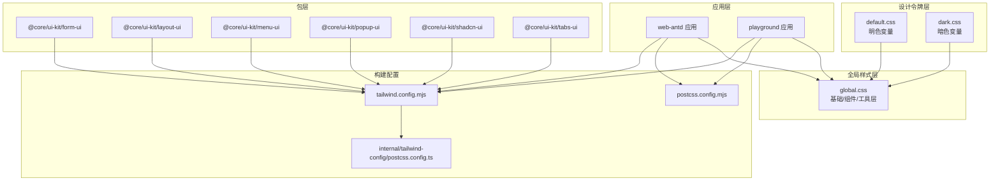
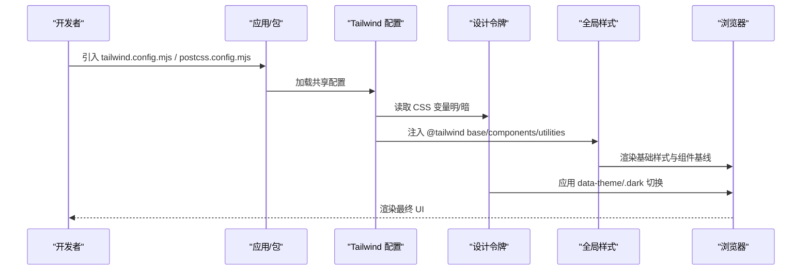
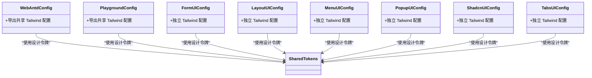
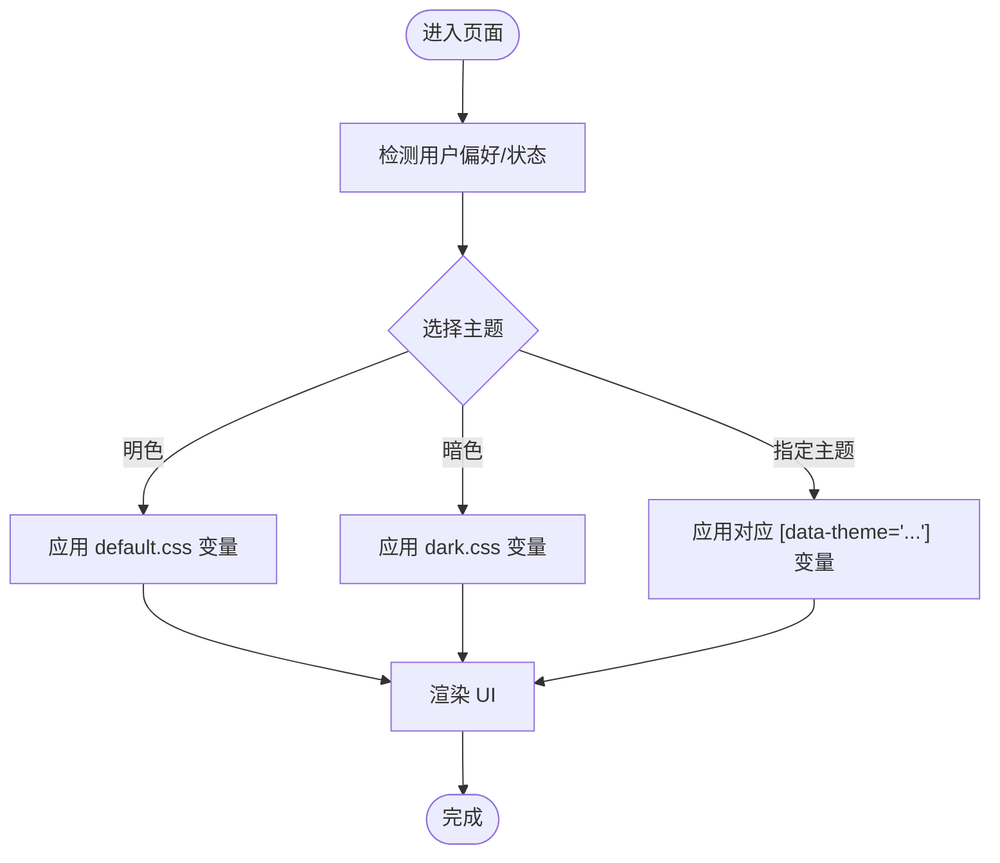
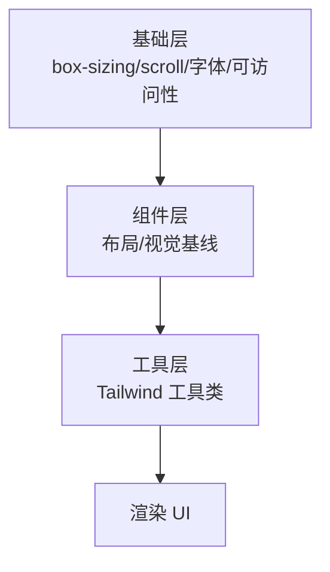
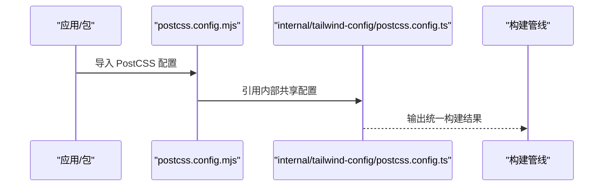
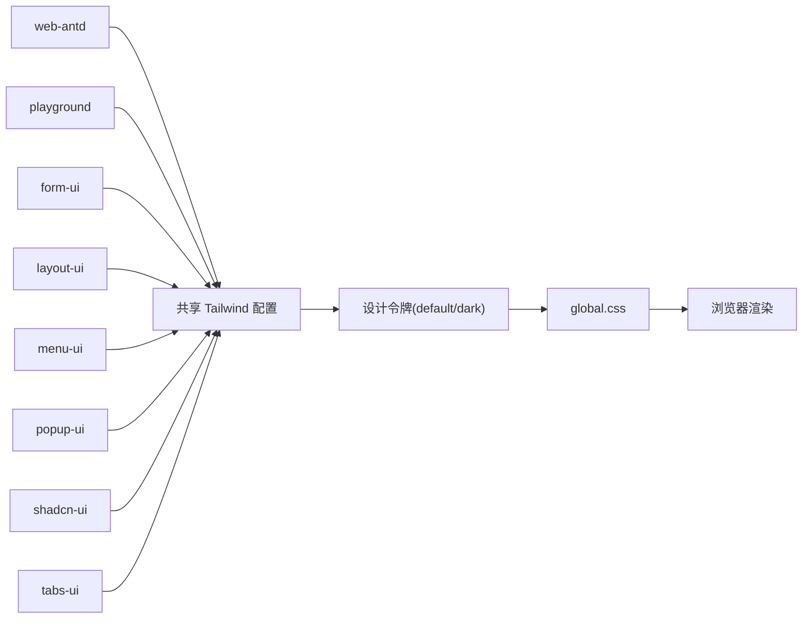

# 样式架构

<cite>
**本文引用的文件**
- [apps/web-antd/tailwind.config.mjs](file://frontend/apps/web-antd/tailwind.config.mjs)
- [apps/web-antd/postcss.config.mjs](file://frontend/apps/web-antd/postcss.config.mjs)
- [packages/@core/base/design/src/design-tokens/default.css](file://frontend/packages/@core/base/design/src/design-tokens/default.css)
- [packages/@core/base/design/src/design-tokens/dark.css](file://frontend/packages/@core/base/design/src/design-tokens/dark.css)
- [packages/@core/base/design/src/css/global.css](file://frontend/packages/@core/base/design/src/css/global.css)
- [packages/@core/ui-kit/form-ui/tailwind.config.mjs](file://frontend/packages/@core/ui-kit/form-ui/tailwind.config.mjs)
- [packages/@core/ui-kit/layout-ui/tailwind.config.mjs](file://frontend/packages/@core/ui-kit/layout-ui/tailwind.config.mjs)
- [packages/@core/ui-kit/menu-ui/tailwind.config.mjs](file://frontend/packages/@core/ui-kit/menu-ui/tailwind.config.mjs)
- [packages/@core/ui-kit/popup-ui/tailwind.config.mjs](file://frontend/packages/@core/ui-kit/popup-ui/tailwind.config.mjs)
- [packages/@core/ui-kit/shadcn-ui/tailwind.config.mjs](file://frontend/packages/@core/ui-kit/shadcn-ui/tailwind.config.mjs)
- [packages/@core/ui-kit/tabs-ui/tailwind.config.mjs](file://frontend/packages/@core/ui-kit/tabs-ui/tailwind.config.mjs)
- [playground/tailwind.config.mjs](file://frontend/playground/tailwind.config.mjs)
- [internal/tailwind-config/src/postcss.config.ts](file://frontend/internal/tailwind-config/src/postcss.config.ts)
</cite>

## 目录
1. [简介](#简介)
2. [项目结构](#项目结构)
3. [核心组件](#核心组件)
4. [架构总览](#架构总览)
5. [详细组件分析](#详细组件分析)
6. [依赖关系分析](#依赖关系分析)
7. [性能考量](#性能考量)
8. [故障排查指南](#故障排查指南)
9. [结论](#结论)
10. [附录](#附录)

## 简介
本文件面向 NovusAI SaaS 的前端样式架构，系统化梳理 CSS 架构设计与落地实践，涵盖 Tailwind CSS 配置、自定义样式与主题系统、样式组织结构、组件样式隔离与全局样式管理策略；同时文档化 CSS 变量系统、暗色模式支持与响应式设计实现，阐述 PostCSS 插件配置、CSS 预处理器使用与样式优化技术，并提供样式性能优化、关键 CSS 提取与缓存策略，以及样式开发规范、设计系统集成与跨浏览器兼容性处理建议。

## 项目结构
样式体系采用“多应用/包共享 + 设计令牌驱动”的分层组织方式：
- 应用层：web-antd 应用通过引入统一的 Tailwind 与 PostCSS 配置，确保全站风格一致。
- 包层：@core/ui-kit 各子包（form-ui、layout-ui、menu-ui、popup-ui、shadcn-ui、tabs-ui）各自维护独立的 Tailwind 配置，便于按功能域隔离与复用。
- 设计令牌层：design-tokens 定义全局 CSS 变量（含明/暗两套），作为设计系统的核心数据源。
- 全局样式层：global.css 统一注入基础层、组件层与工具层，定义通用排版、交互与可访问性基线。

图表来源
- [apps/web-antd/tailwind.config.mjs:1-2](file://frontend/apps/web-antd/tailwind.config.mjs#L1-L2)
- [apps/web-antd/postcss.config.mjs:1-2](file://frontend/apps/web-antd/postcss.config.mjs#L1-L2)
- [packages/@core/base/design/src/css/global.css:1-154](file://frontend/packages/@core/base/design/src/css/global.css#L1-L154)
- [packages/@core/base/design/src/design-tokens/default.css:1-384](file://frontend/packages/@core/base/design/src/design-tokens/default.css#L1-L384)
- [packages/@core/base/design/src/design-tokens/dark.css:1-447](file://frontend/packages/@core/base/design/src/design-tokens/dark.css#L1-L447)
- [internal/tailwind-config/src/postcss.config.ts](file://frontend/internal/tailwind-config/src/postcss.config.ts)

章节来源
- [apps/web-antd/tailwind.config.mjs:1-2](file://frontend/apps/web-antd/tailwind.config.mjs#L1-L2)
- [apps/web-antd/postcss.config.mjs:1-2](file://frontend/apps/web-antd/postcss.config.mjs#L1-L2)
- [packages/@core/base/design/src/css/global.css:1-154](file://frontend/packages/@core/base/design/src/css/global.css#L1-L154)
- [packages/@core/base/design/src/design-tokens/default.css:1-384](file://frontend/packages/@core/base/design/src/design-tokens/default.css#L1-L384)
- [packages/@core/base/design/src/design-tokens/dark.css:1-447](file://frontend/packages/@core/base/design/src/design-tokens/dark.css#L1-L447)

## 核心组件
- Tailwind 配置集中化：应用与各 UI 包均通过导出内部共享配置，避免重复维护，保证设计令牌与工具类的一致性。
- 设计令牌双态：default.css 与 dark.css 以 CSS 自定义属性形式提供明/暗两套变量，配合 data-theme 与 .dark 类名切换。
- 全局样式注入：global.css 使用 @tailwind 指令注入基础、组件、工具三层，统一排版、交互与可访问性基线。
- 组件样式隔离：UI 包各自维护 tailwind.config.mjs，限定工具类作用域，避免跨包污染。

章节来源
- [apps/web-antd/tailwind.config.mjs:1-2](file://frontend/apps/web-antd/tailwind.config.mjs#L1-L2)
- [packages/@core/base/design/src/design-tokens/default.css:1-384](file://frontend/packages/@core/base/design/src/design-tokens/default.css#L1-L384)
- [packages/@core/base/design/src/design-tokens/dark.css:1-447](file://frontend/packages/@core/base/design/src/design-tokens/dark.css#L1-L447)
- [packages/@core/base/design/src/css/global.css:1-154](file://frontend/packages/@core/base/design/src/css/global.css#L1-L154)

## 架构总览
样式架构围绕“设计令牌 → 全局样式 → 组件配置”的链路展开，构建流程如下：

图表来源
- [apps/web-antd/tailwind.config.mjs:1-2](file://frontend/apps/web-antd/tailwind.config.mjs#L1-L2)
- [apps/web-antd/postcss.config.mjs:1-2](file://frontend/apps/web-antd/postcss.config.mjs#L1-L2)
- [packages/@core/base/design/src/design-tokens/default.css:1-384](file://frontend/packages/@core/base/design/src/design-tokens/default.css#L1-L384)
- [packages/@core/base/design/src/design-tokens/dark.css:1-447](file://frontend/packages/@core/base/design/src/design-tokens/dark.css#L1-L447)
- [packages/@core/base/design/src/css/global.css:1-154](file://frontend/packages/@core/base/design/src/css/global.css#L1-L154)

## 详细组件分析

### Tailwind 配置与主题系统
- 应用级配置：web-antd 与 playground 通过导出内部共享配置，确保工具类与设计令牌一致。
- UI 包级配置：各 UI 包（form-ui、layout-ui、menu-ui、popup-ui、shadcn-ui、tabs-ui）各自维护 tailwind.config.mjs，限定工具类范围，提升样式隔离度。
- 主题系统：通过 data-theme 属性与 .dark 类名组合，实现主题切换与暗色模式渲染。

图表来源
- [apps/web-antd/tailwind.config.mjs:1-2](file://frontend/apps/web-antd/tailwind.config.mjs#L1-L2)
- [playground/tailwind.config.mjs](file://frontend/playground/tailwind.config.mjs)
- [packages/@core/ui-kit/form-ui/tailwind.config.mjs](file://frontend/packages/@core/ui-kit/form-ui/tailwind.config.mjs)
- [packages/@core/ui-kit/layout-ui/tailwind.config.mjs](file://frontend/packages/@core/ui-kit/layout-ui/tailwind.config.mjs)
- [packages/@core/ui-kit/menu-ui/tailwind.config.mjs](file://frontend/packages/@core/ui-kit/menu-ui/tailwind.config.mjs)
- [packages/@core/ui-kit/popup-ui/tailwind.config.mjs](file://frontend/packages/@core/ui-kit/popup-ui/tailwind.config.mjs)
- [packages/@core/ui-kit/shadcn-ui/tailwind.config.mjs](file://frontend/packages/@core/ui-kit/shadcn-ui/tailwind.config.mjs)
- [packages/@core/ui-kit/tabs-ui/tailwind.config.mjs](file://frontend/packages/@core/ui-kit/tabs-ui/tailwind.config.mjs)

章节来源
- [apps/web-antd/tailwind.config.mjs:1-2](file://frontend/apps/web-antd/tailwind.config.mjs#L1-L2)
- [playground/tailwind.config.mjs](file://frontend/playground/tailwind.config.mjs)
- [packages/@core/ui-kit/form-ui/tailwind.config.mjs](file://frontend/packages/@core/ui-kit/form-ui/tailwind.config.mjs)
- [packages/@core/ui-kit/layout-ui/tailwind.config.mjs](file://frontend/packages/@core/ui-kit/layout-ui/tailwind.config.mjs)
- [packages/@core/ui-kit/menu-ui/tailwind.config.mjs](file://frontend/packages/@core/ui-kit/menu-ui/tailwind.config.mjs)
- [packages/@core/ui-kit/popup-ui/tailwind.config.mjs](file://frontend/packages/@core/ui-kit/popup-ui/tailwind.config.mjs)
- [packages/@core/ui-kit/shadcn-ui/tailwind.config.mjs](file://frontend/packages/@core/ui-kit/shadcn-ui/tailwind.config.mjs)
- [packages/@core/ui-kit/tabs-ui/tailwind.config.mjs](file://frontend/packages/@core/ui-kit/tabs-ui/tailwind.config.mjs)

### CSS 变量系统与主题切换
- 明/暗变量：default.css 与 dark.css 以 CSS 自定义属性定义语义化变量，覆盖背景、前景、卡片、弹出层、输入、强调色等。
- 主题扩展：支持多种主题（如 violet、pink、rose、sky-blue、deep-blue、green、deep-green、orange、yellow、zinc、neutral、slate、gray），通过 [data-theme='...'] 进行切换。
- 切换机制：结合 .dark 类名与 data-theme 属性，实现用户偏好的持久化与运行时切换。

图表来源
- [packages/@core/base/design/src/design-tokens/default.css:1-384](file://frontend/packages/@core/base/design/src/design-tokens/default.css#L1-L384)
- [packages/@core/base/design/src/design-tokens/dark.css:1-447](file://frontend/packages/@core/base/design/src/design-tokens/dark.css#L1-L447)

章节来源
- [packages/@core/base/design/src/design-tokens/default.css:1-384](file://frontend/packages/@core/base/design/src/design-tokens/default.css#L1-L384)
- [packages/@core/base/design/src/design-tokens/dark.css:1-447](file://frontend/packages/@core/base/design/src/design-tokens/dark.css#L1-L447)

### 全局样式与组件基线
- 基础层：统一盒模型、滚动行为、字体与可访问性基线，设置根元素与容器尺寸。
- 组件层：提供常用布局与视觉基线（如居中、描边卡片、链接样式等），减少重复定义。
- 工具层：Tailwind 工具类由全局样式注入，确保按需生成与最小体积。

图表来源
- [packages/@core/base/design/src/css/global.css:1-154](file://frontend/packages/@core/base/design/src/css/global.css#L1-L154)

章节来源
- [packages/@core/base/design/src/css/global.css:1-154](file://frontend/packages/@core/base/design/src/css/global.css#L1-L154)

### PostCSS 插件与构建配置
- 应用层：web-antd 与 playground 通过导出内部共享 PostCSS 配置，统一构建管线。
- 内部配置：internal/tailwind-config 提供统一的 PostCSS 配置入口，确保各包与应用一致。

图表来源
- [apps/web-antd/postcss.config.mjs:1-2](file://frontend/apps/web-antd/postcss.config.mjs#L1-L2)
- [internal/tailwind-config/src/postcss.config.ts](file://frontend/internal/tailwind-config/src/postcss.config.ts)

章节来源
- [apps/web-antd/postcss.config.mjs:1-2](file://frontend/apps/web-antd/postcss.config.mjs#L1-L2)
- [internal/tailwind-config/src/postcss.config.ts](file://frontend/internal/tailwind-config/src/postcss.config.ts)

### 响应式设计与交互基线
- 响应式：通过 Tailwind 断点与语义化变量控制字体、间距与布局在不同设备下的表现。
- 交互基线：全局样式统一链接无下划线、视图过渡层级、滚动条样式等，提升一致性与可访问性。

章节来源
- [packages/@core/base/design/src/css/global.css:16-115](file://frontend/packages/@core/base/design/src/css/global.css#L16-L115)

## 依赖关系分析
样式依赖呈现“应用/包 → 共享配置 → 设计令牌 → 全局样式”的单向依赖，确保变更可控且可追踪。

图表来源
- [apps/web-antd/tailwind.config.mjs:1-2](file://frontend/apps/web-antd/tailwind.config.mjs#L1-L2)
- [packages/@core/base/design/src/design-tokens/default.css:1-384](file://frontend/packages/@core/base/design/src/design-tokens/default.css#L1-L384)
- [packages/@core/base/design/src/design-tokens/dark.css:1-447](file://frontend/packages/@core/base/design/src/design-tokens/dark.css#L1-L447)
- [packages/@core/base/design/src/css/global.css:1-154](file://frontend/packages/@core/base/design/src/css/global.css#L1-L154)

章节来源
- [apps/web-antd/tailwind.config.mjs:1-2](file://frontend/apps/web-antd/tailwind.config.mjs#L1-L2)
- [packages/@core/base/design/src/design-tokens/default.css:1-384](file://frontend/packages/@core/base/design/src/design-tokens/default.css#L1-L384)
- [packages/@core/base/design/src/design-tokens/dark.css:1-447](file://frontend/packages/@core/base/design/src/design-tokens/dark.css#L1-L447)
- [packages/@core/base/design/src/css/global.css:1-154](file://frontend/packages/@core/base/design/src/css/global.css#L1-L154)

## 性能考量
- 关键 CSS 提取：优先内联 global.css 中的基础层与首屏关键组件层，减少阻塞渲染的样式体积。
- 工具类按需：Tailwind 在生产环境仅生成实际使用的工具类，降低 CSS 体积。
- 变量复用：通过 CSS 变量集中管理色彩与间距，减少重复定义与打包体积。
- 缓存策略：对构建产物启用长期缓存（如 content-hash 文件名），结合 CDN 与 HTTP 缓存头，提升二次加载性能。
- 资源优化：禁用不必要的滚动条与阴影，减少重绘与合成开销；在暗色模式下保持对比度与可读性平衡。

## 故障排查指南
- 主题不生效
  - 检查是否正确设置 data-theme 或 .dark 类名。
  - 确认设计令牌文件已正确导入且未被覆盖。
- 工具类无效
  - 确认 tailwind.config.mjs 是否指向共享配置。
  - 检查是否在 @layer 中正确定义或使用了工具类。
- 样式冲突
  - 检查组件样式是否在 UI 包内隔离，避免跨包污染。
  - 确保全局样式未被局部样式覆盖优先级过高。
- 暗色模式闪烁
  - 在服务端或客户端初始化阶段预先设置 .dark 或 data-theme，避免 FOUC。

章节来源
- [packages/@core/base/design/src/design-tokens/default.css:1-384](file://frontend/packages/@core/base/design/src/design-tokens/default.css#L1-L384)
- [packages/@core/base/design/src/design-tokens/dark.css:1-447](file://frontend/packages/@core/base/design/src/design-tokens/dark.css#L1-L447)
- [packages/@core/base/design/src/css/global.css:1-154](file://frontend/packages/@core/base/design/src/css/global.css#L1-L154)
- [apps/web-antd/tailwind.config.mjs:1-2](file://frontend/apps/web-antd/tailwind.config.mjs#L1-L2)

## 结论
本样式架构以设计令牌为核心，通过共享 Tailwind 与 PostCSS 配置实现跨应用/包的一致性；以全局样式注入与组件基线保障可维护性与可访问性；以主题系统与暗色模式支持满足多样化用户体验。配合关键 CSS 提取与缓存策略，可在保证开发效率的同时获得良好的性能表现。

## 附录
- 开发规范建议
  - 使用语义化 CSS 变量命名，避免硬编码颜色与尺寸。
  - 在 UI 包内限定工具类范围，避免跨包污染。
  - 优先使用 Tailwind 工具类，必要时在组件层补充局部样式。
- 设计系统集成
  - 将设计令牌与组件库解耦，通过变量驱动组件外观。
  - 支持多主题扩展，提供一键切换能力。
- 跨浏览器兼容性
  - 使用 PostCSS 与 Autoprefixer 保证前缀与语法兼容。
  - 对关键交互（滚动条、视图过渡）提供降级方案。