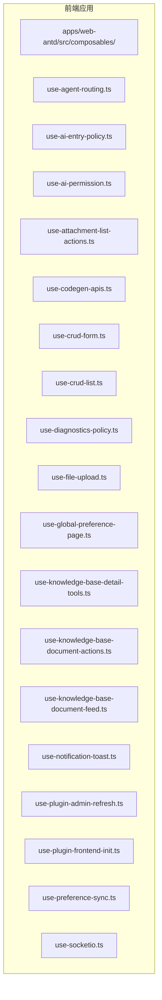
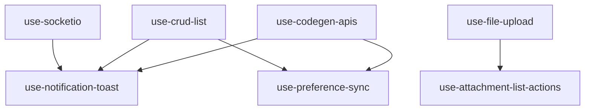

# Composables 使用模式

<cite>
**本文引用的文件**
- [use-agent-routing.ts](file://frontend/apps/web-antd/src/composables/use-agent-routing.ts)
- [use-ai-entry-policy.ts](file://frontend/apps/web-antd/src/composables/use-ai-entry-policy.ts)
- [use-ai-permission.ts](file://frontend/apps/web-antd/src/composables/use-ai-permission.ts)
- [use-attachment-list-actions.ts](file://frontend/apps/web-antd/src/composables/use-attachment-list-actions.ts)
- [use-codegen-apis.ts](file://frontend/apps/web-antd/src/composables/use-codegen-apis.ts)
- [use-crud-form.ts](file://frontend/apps/web-antd/src/composables/use-crud-form.ts)
- [use-crud-list.ts](file://frontend/apps/web-antd/src/composables/use-crud-list.ts)
- [use-diagnostics-policy.ts](file://frontend/apps/web-antd/src/composables/use-diagnostics-policy.ts)
- [use-file-upload.ts](file://frontend/apps/web-antd/src/composables/use-file-upload.ts)
- [use-global-preference-page.ts](file://frontend/apps/web-antd/src/composables/use-global-preference-page.ts)
- [use-knowledge-base-detail-tools.ts](file://frontend/apps/web-antd/src/composables/use-knowledge-base-detail-tools.ts)
- [use-knowledge-base-document-actions.ts](file://frontend/apps/web-antd/src/composables/use-knowledge-base-document-actions.ts)
- [use-knowledge-base-document-feed.ts](file://frontend/apps/web-antd/src/composables/use-knowledge-base-document-feed.ts)
- [use-notification-toast.ts](file://frontend/apps/web-antd/src/composables/use-notification-toast.ts)
- [use-plugin-admin-refresh.ts](file://frontend/apps/web-antd/src/composables/use-plugin-admin-refresh.ts)
- [use-plugin-frontend-init.ts](file://frontend/apps/web-antd/src/composables/use-plugin-frontend-init.ts)
- [use-preference-sync.ts](file://frontend/apps/web-antd/src/composables/use-preference-sync.ts)
- [use-socketio.ts](file://frontend/apps/web-antd/src/composables/use-socketio.ts)
</cite>

## 目录
1. [简介](#简介)
2. [项目结构](#项目结构)
3. [核心组件](#核心组件)
4. [架构总览](#架构总览)
5. [详细组件分析](#详细组件分析)
6. [依赖关系分析](#依赖关系分析)
7. [性能考量](#性能考量)
8. [故障排查指南](#故障排查指南)
9. [结论](#结论)
10. [附录](#附录)

## 简介
本文件系统性梳理 NovusAI SaaS 前端中 Vue 3 Composables 的设计与实现模式，围绕以下关键组合式函数展开：路由管理（use-agent-routing）、AI 入口策略（use-ai-entry-policy）、权限控制（use-ai-permission）、附件操作（use-attachment-list-actions）、代码生成 API（use-codegen-apis）、CRUD 表单（use-crud-form）、CRUD 列表（use-crud-list）、诊断策略（use-diagnostics-policy）、文件上传（use-file-upload）、全局偏好设置页面（use-global-preference-page）、知识库详情工具（use-knowledge-base-detail-tools）、知识库文档操作（use-knowledge-base-document-actions）、知识库文档流（use-knowledge-base-document-feed）、通知提示（use-notification-toast）、插件刷新（use-plugin-admin-refresh）、插件前端初始化（use-plugin-frontend-init）、偏好同步（use-preference-sync）、Socket.IO 集成（use-socketio）。  
我们将从设计理念、状态封装、复用机制、副作用处理、参数与返回值设计、使用示例与最佳实践、性能优化与故障排查等方面进行深入解析。

## 项目结构
前端应用位于 apps/web-antd，Composables 统一放置在 composables 目录下，每个文件聚焦一个独立的业务能力或横切关注点。该组织方式便于按功能域拆分、按需引入、单元测试覆盖以及跨视图复用。

图表来源
- [use-agent-routing.ts](file://frontend/apps/web-antd/src/composables/use-agent-routing.ts)
- [use-ai-entry-policy.ts](file://frontend/apps/web-antd/src/composables/use-ai-entry-policy.ts)
- [use-ai-permission.ts](file://frontend/apps/web-antd/src/composables/use-ai-permission.ts)
- [use-attachment-list-actions.ts](file://frontend/apps/web-antd/src/composables/use-attachment-list-actions.ts)
- [use-codegen-apis.ts](file://frontend/apps/web-antd/src/composables/use-codegen-apis.ts)
- [use-crud-form.ts](file://frontend/apps/web-antd/src/composables/use-crud-form.ts)
- [use-crud-list.ts](file://frontend/apps/web-antd/src/composables/use-crud-list.ts)
- [use-diagnostics-policy.ts](file://frontend/apps/web-antd/src/composables/use-diagnostics-policy.ts)
- [use-file-upload.ts](file://frontend/apps/web-antd/src/composables/use-file-upload.ts)
- [use-global-preference-page.ts](file://frontend/apps/web-antd/src/composables/use-global-preference-page.ts)
- [use-knowledge-base-detail-tools.ts](file://frontend/apps/web-antd/src/composables/use-knowledge-base-detail-tools.ts)
- [use-knowledge-base-document-actions.ts](file://frontend/apps/web-antd/src/composables/use-knowledge-base-document-actions.ts)
- [use-knowledge-base-document-feed.ts](file://frontend/apps/web-antd/src/composables/use-knowledge-base-document-feed.ts)
- [use-notification-toast.ts](file://frontend/apps/web-antd/src/composables/use-notification-toast.ts)
- [use-plugin-admin-refresh.ts](file://frontend/apps/web-antd/src/composables/use-plugin-admin-refresh.ts)
- [use-plugin-frontend-init.ts](file://frontend/apps/web-antd/src/composables/use-plugin-frontend-init.ts)
- [use-preference-sync.ts](file://frontend/apps/web-antd/src/composables/use-preference-sync.ts)
- [use-socketio.ts](file://frontend/apps/web-antd/src/composables/use-socketio.ts)

章节来源
- [use-agent-routing.ts](file://frontend/apps/web-antd/src/composables/use-agent-routing.ts)
- [use-ai-entry-policy.ts](file://frontend/apps/web-antd/src/composables/use-ai-entry-policy.ts)
- [use-ai-permission.ts](file://frontend/apps/web-antd/src/composables/use-ai-permission.ts)
- [use-attachment-list-actions.ts](file://frontend/apps/web-antd/src/composables/use-attachment-list-actions.ts)
- [use-codegen-apis.ts](file://frontend/apps/web-antd/src/composables/use-codegen-apis.ts)
- [use-crud-form.ts](file://frontend/apps/web-antd/src/composables/use-crud-form.ts)
- [use-crud-list.ts](file://frontend/apps/web-antd/src/composables/use-crud-list.ts)
- [use-diagnostics-policy.ts](file://frontend/apps/web-antd/src/composables/use-diagnostics-policy.ts)
- [use-file-upload.ts](file://frontend/apps/web-antd/src/composables/use-file-upload.ts)
- [use-global-preference-page.ts](file://frontend/apps/web-antd/src/composables/use-global-preference-page.ts)
- [use-knowledge-base-detail-tools.ts](file://frontend/apps/web-antd/src/composables/use-knowledge-base-detail-tools.ts)
- [use-knowledge-base-document-actions.ts](file://frontend/apps/web-antd/src/composables/use-knowledge-base-document-actions.ts)
- [use-knowledge-base-document-feed.ts](file://frontend/apps/web-antd/src/composables/use-knowledge-base-document-feed.ts)
- [use-notification-toast.ts](file://frontend/apps/web-antd/src/composables/use-notification-toast.ts)
- [use-plugin-admin-refresh.ts](file://frontend/apps/web-antd/src/composables/use-plugin-admin-refresh.ts)
- [use-plugin-frontend-init.ts](file://frontend/apps/web-antd/src/composables/use-plugin-frontend-init.ts)
- [use-preference-sync.ts](file://frontend/apps/web-antd/src/composables/use-preference-sync.ts)
- [use-socketio.ts](file://frontend/apps/web-antd/src/composables/use-socketio.ts)

## 核心组件
- 设计理念
  - 单一职责：每个 Composable 聚焦一个明确的业务能力或横切关注点。
  - 状态封装：将响应式状态、派生状态与副作用封装在组合式函数内部，暴露简洁的 API。
  - 复用优先：通过参数化与返回值设计，支持多视图、多场景复用。
  - 易于测试：以纯函数与可注入依赖为主，便于单元测试与快照验证。
- 实现模式
  - 参数传递：通过输入参数控制行为（如配置对象、标识符、回调函数）。
  - 返回值设计：统一返回只读状态、可写 ref、计算属性与动作方法，避免在外部直接访问内部状态。
  - 副作用处理：集中管理异步请求、事件监听、定时器、存储同步等副作用，确保生命周期内正确清理。
  - 错误与加载：提供统一的错误状态、加载状态与重试机制，提升用户体验。
  - 性能优化：结合懒加载、防抖节流、缓存与细粒度响应式更新，降低不必要的渲染。

章节来源
- [use-agent-routing.ts](file://frontend/apps/web-antd/src/composables/use-agent-routing.ts)
- [use-ai-entry-policy.ts](file://frontend/apps/web-antd/src/composables/use-ai-entry-policy.ts)
- [use-ai-permission.ts](file://frontend/apps/web-antd/src/composables/use-ai-permission.ts)
- [use-attachment-list-actions.ts](file://frontend/apps/web-antd/src/composables/use-attachment-list-actions.ts)
- [use-codegen-apis.ts](file://frontend/apps/web-antd/src/composables/use-codegen-apis.ts)
- [use-crud-form.ts](file://frontend/apps/web-antd/src/composables/use-crud-form.ts)
- [use-crud-list.ts](file://frontend/apps/web-antd/src/composables/use-crud-list.ts)
- [use-diagnostics-policy.ts](file://frontend/apps/web-antd/src/composables/use-diagnostics-policy.ts)
- [use-file-upload.ts](file://frontend/apps/web-antd/src/composables/use-file-upload.ts)
- [use-global-preference-page.ts](file://frontend/apps/web-antd/src/composables/use-global-preference-page.ts)
- [use-knowledge-base-detail-tools.ts](file://frontend/apps/web-antd/src/composables/use-knowledge-base-detail-tools.ts)
- [use-knowledge-base-document-actions.ts](file://frontend/apps/web-antd/src/composables/use-knowledge-base-document-actions.ts)
- [use-knowledge-base-document-feed.ts](file://frontend/apps/web-antd/src/composables/use-knowledge-base-document-feed.ts)
- [use-notification-toast.ts](file://frontend/apps/web-antd/src/composables/use-notification-toast.ts)
- [use-plugin-admin-refresh.ts](file://frontend/apps/web-antd/src/composables/use-plugin-admin-refresh.ts)
- [use-plugin-frontend-init.ts](file://frontend/apps/web-antd/src/composables/use-plugin-frontend-init.ts)
- [use-preference-sync.ts](file://frontend/apps/web-antd/src/composables/use-preference-sync.ts)
- [use-socketio.ts](file://frontend/apps/web-antd/src/composables/use-socketio.ts)

## 架构总览
Composables 在应用中的位置与交互如下：

```mermaid
graph TB
VUE["Vue 组件<br/>视图层"]
AG["use-agent-routing"]
AIP["use-ai-entry-policy"]
PERM["use-ai-permission"]
ATT["use-attachment-list-actions"]
CGAPI["use-codegen-apis"]
CRUDF["use-crud-form"]
CRUDL["use-crud-list"]
DIAG["use-diagnostics-policy"]
UP["use-file-upload"]
GPREF["use-global-preference-page"]
KBDET["use-knowledge-base-detail-tools"]
KBDAC["use-knowledge-base-document-actions"]
KBF["use-knowledge-base-document-feed"]
TOAST["use-notification-toast"]
PREFSYNC["use-preference-sync"]
PLGADM["use-plugin-admin-refresh"]
PLGF["use-plugin-frontend-init"]
SIO["use-socketio"]
VUE --> AG
VUE --> AIP
VUE --> PERM
VUE --> ATT
VUE --> CGAPI
VUE --> CRUDF
VUE --> CRUDL
VUE --> DIAG
VUE --> UP
VUE --> GPREF
VUE --> KBDET
VUE --> KBDAC
VUE --> KBF
VUE --> TOAST
VUE --> PREFSYNC
VUE --> PLGADM
VUE --> PLGF
VUE --> SIO
```

图表来源
- [use-agent-routing.ts](file://frontend/apps/web-antd/src/composables/use-agent-routing.ts)
- [use-ai-entry-policy.ts](file://frontend/apps/web-antd/src/composables/use-ai-entry-policy.ts)
- [use-ai-permission.ts](file://frontend/apps/web-antd/src/composables/use-ai-permission.ts)
- [use-attachment-list-actions.ts](file://frontend/apps/web-antd/src/composables/use-attachment-list-actions.ts)
- [use-codegen-apis.ts](file://frontend/apps/web-antd/src/composables/use-codegen-apis.ts)
- [use-crud-form.ts](file://frontend/apps/web-antd/src/composables/use-crud-form.ts)
- [use-crud-list.ts](file://frontend/apps/web-antd/src/composables/use-crud-list.ts)
- [use-diagnostics-policy.ts](file://frontend/apps/web-antd/src/composables/use-diagnostics-policy.ts)
- [use-file-upload.ts](file://frontend/apps/web-antd/src/composables/use-file-upload.ts)
- [use-global-preference-page.ts](file://frontend/apps/web-antd/src/composables/use-global-preference-page.ts)
- [use-knowledge-base-detail-tools.ts](file://frontend/apps/web-antd/src/composables/use-knowledge-base-detail-tools.ts)
- [use-knowledge-base-document-actions.ts](file://frontend/apps/web-antd/src/composables/use-knowledge-base-document-actions.ts)
- [use-knowledge-base-document-feed.ts](file://frontend/apps/web-antd/src/composables/use-knowledge-base-document-feed.ts)
- [use-notification-toast.ts](file://frontend/apps/web-antd/src/composables/use-notification-toast.ts)
- [use-preference-sync.ts](file://frontend/apps/web-antd/src/composables/use-preference-sync.ts)
- [use-plugin-admin-refresh.ts](file://frontend/apps/web-antd/src/composables/use-plugin-admin-refresh.ts)
- [use-plugin-frontend-init.ts](file://frontend/apps/web-antd/src/composables/use-plugin-frontend-init.ts)
- [use-socketio.ts](file://frontend/apps/web-antd/src/composables/use-socketio.ts)

## 详细组件分析

### 路由管理：use-agent-routing
- 能力概述
  - 封装 AI Agent 的路由跳转与导航策略，统一处理路由参数、面包屑、权限校验后的导航。
- 关键点
  - 参数：接收目标 Agent 标识、上下文参数、回退路由等。
  - 返回：导航动作、当前路由状态、是否可导航等。
  - 副作用：触发路由变更、更新面包屑、记录访问日志。
- 使用示例
  - 在按钮点击或条件满足时调用导航动作，自动完成路由跳转与状态更新。
- 最佳实践
  - 将路由策略与业务逻辑解耦；对不可达或无权限的场景提供兜底处理。
- 性能考虑
  - 避免重复导航；对路由参数变化做去抖处理。

章节来源
- [use-agent-routing.ts](file://frontend/apps/web-antd/src/composables/use-agent-routing.ts)

### AI 入口策略：use-ai-entry-policy
- 能力概述
  - 定义用户进入 AI 功能的策略，包括可用性检查、配额限制、租户策略、引导页等。
- 关键点
  - 参数：当前用户、租户、模型、会话上下文。
  - 返回：是否允许、原因码、引导信息、跳转建议。
  - 副作用：拉取策略配置、记录策略命中。
- 使用示例
  - 在页面加载或按钮点击前调用策略检查，根据结果决定显示或跳转。
- 最佳实践
  - 将策略检查前置到路由守卫或页面入口，减少无效渲染。
- 性能考虑
  - 缓存策略结果；对频繁调用做节流。

章节来源
- [use-ai-entry-policy.ts](file://frontend/apps/web-antd/src/composables/use-ai-entry-policy.ts)

### 权限控制：use-ai-permission
- 能力概述
  - 封装 AI 相关资源的权限判断与动态授权，支持角色、租户范围与资源级权限。
- 关键点
  - 参数：资源类型、目标 ID、所需权限集合。
  - 返回：是否授权、授权详情、授权变更订阅。
  - 副作用：订阅权限变更、拉取最新授权。
- 使用示例
  - 在渲染敏感 UI 或执行敏感操作前进行权限判断。
- 最佳实践
  - 将权限判断与 UI 分离，避免在模板中直接嵌入复杂逻辑。
- 性能考虑
  - 合理缓存授权结果；避免在高频渲染中重复查询。

章节来源
- [use-ai-permission.ts](file://frontend/apps/web-antd/src/composables/use-ai-permission.ts)

### 附件操作：use-attachment-list-actions
- 能力概述
  - 提供附件列表的批量选择、删除、下载、预览等操作，并处理上传进度与错误。
- 关键点
  - 参数：附件列表、当前用户、租户范围。
  - 返回：选中项、操作状态、进度、错误信息。
  - 副作用：调用后端接口、更新本地状态、触发通知。
- 使用示例
  - 在表格中绑定操作按钮，统一处理批量删除与下载。
- 最佳实践
  - 对大文件操作采用分片或断点续传策略；对失败项提供重试与汇总提示。
- 性能考虑
  - 控制并发数量；对列表做虚拟滚动与懒加载。

章节来源
- [use-attachment-list-actions.ts](file://frontend/apps/web-antd/src/composables/use-attachment-list-actions.ts)

### 代码生成 API：use-codegen-apis
- 能力概述
  - 封装代码生成相关 API 的调用、状态管理与错误处理，支持生成任务的创建、轮询与结果获取。
- 关键点
  - 参数：生成配置、模板、输出格式、上下文数据。
  - 返回：任务状态、进度、结果、错误。
  - 副作用：长轮询或 SSE 订阅任务状态。
- 使用示例
  - 在表单提交后启动生成任务，实时展示进度并提供下载链接。
- 最佳实践
  - 对长时间运行的任务提供中断与取消；对失败场景提供重试与回滚。
- 性能考虑
  - 合理设置轮询间隔；对结果做本地缓存。

章节来源
- [use-codegen-apis.ts](file://frontend/apps/web-antd/src/composables/use-codegen-apis.ts)

### CRUD 表单：use-crud-form
- 能力概述
  - 封装增删改查表单的通用逻辑，包括字段校验、联动、默认值、提交与回滚。
- 关键点
  - 参数：实体 Schema、初始值、提交接口、回滚策略。
  - 返回：表单状态、校验规则、提交动作、重置动作。
  - 副作用：调用后端接口、更新本地状态、触发通知。
- 使用示例
  - 在弹窗或页面中复用同一套表单逻辑，快速构建新增/编辑页面。
- 最佳实践
  - 将校验规则与 Schema 解耦；对复杂联动使用计算属性与派生状态。
- 性能考虑
  - 对输入做防抖；对大表单采用分步提交或懒渲染。

章节来源
- [use-crud-form.ts](file://frontend/apps/web-antd/src/composables/use-crud-form.ts)

### CRUD 列表：use-crud-list
- 能力概述
  - 封装 CRUD 列表的查询、筛选、排序、分页、批量操作与行级操作。
- 关键点
  - 参数：查询条件、分页配置、列定义、批量操作回调。
  - 返回：数据源、加载状态、选中项、刷新动作、导出动作。
  - 副作用：调用后端接口、更新本地状态、触发通知。
- 使用示例
  - 在页面中直接渲染列表，绑定搜索、筛选与批量删除按钮。
- 最佳实践
  - 将查询条件与 URL 参数同步；对空态与错误态做统一处理。
- 性能考虑
  - 对查询做防抖；对大数据集启用虚拟滚动与懒加载。

章节来源
- [use-crud-list.ts](file://frontend/apps/web-antd/src/composables/use-crud-list.ts)

### 诊断策略：use-diagnostics-policy
- 能力概述
  - 封装系统诊断与健康检查策略，支持策略下发、执行与结果上报。
- 关键点
  - 参数：诊断类型、目标范围、策略配置。
  - 返回：执行状态、诊断结果、进度、错误。
  - 副作用：触发诊断任务、上报结果、更新策略状态。
- 使用示例
  - 在后台管理页面触发诊断任务，实时展示诊断进度与结果。
- 最佳实践
  - 对诊断任务做幂等与去重；对失败场景提供重试与告警。
- 性能考虑
  - 控制并发诊断任务数量；对结果做增量更新。

章节来源
- [use-diagnostics-policy.ts](file://frontend/apps/web-antd/src/composables/use-diagnostics-policy.ts)

### 文件上传：use-file-upload
- 能力概述
  - 提供文件上传的通用能力，包括拖拽、粘贴、多文件队列、进度与错误处理。
- 关键点
  - 参数：上传目标、文件类型限制、大小限制、额外元数据。
  - 返回：上传队列、进度、结果、错误、重试动作。
  - 副作用：调用上传接口、更新进度、触发通知。
- 使用示例
  - 在富文本编辑器或附件面板中复用上传逻辑。
- 最佳实践
  - 对大文件采用分片上传与断点续传；对重复文件做去重。
- 性能考虑
  - 控制并发上传数量；对进度做节流更新。

章节来源
- [use-file-upload.ts](file://frontend/apps/web-antd/src/composables/use-file-upload.ts)

### 全局偏好设置页面：use-global-preference-page
- 能力概述
  - 封装全局偏好设置的读取、编辑、保存与同步，支持主题、语言、布局等。
- 关键点
  - 参数：偏好键集合、默认值、持久化策略。
  - 返回：偏好状态、更新动作、重置动作、同步动作。
  - 副作用：写入本地存储或后端；触发主题与语言切换。
- 使用示例
  - 在设置页面中统一管理全局偏好，支持即时生效与批量导入导出。
- 最佳实践
  - 对敏感偏好做权限校验；对批量更新提供原子性保证。
- 性能考虑
  - 对频繁更新做防抖；对主题切换做缓存。

章节来源
- [use-global-preference-page.ts](file://frontend/apps/web-antd/src/composables/use-global-preference-page.ts)

### 知识库详情工具：use-knowledge-base-detail-tools
- 能力概述
  - 提供知识库详情页的工具栏操作，如收藏、分享、导出、复制链接等。
- 关键点
  - 参数：知识库 ID、当前用户、上下文。
  - 返回：工具状态、操作动作、结果与错误。
  - 副作用：调用后端接口、更新本地状态、触发通知。
- 使用示例
  - 在详情页顶部工具栏中复用同一套工具逻辑。
- 最佳实践
  - 对耗时操作提供进度反馈；对失败场景提供重试与提示。
- 性能考虑
  - 对工具状态做细粒度响应式更新。

章节来源
- [use-knowledge-base-detail-tools.ts](file://frontend/apps/web-antd/src/composables/use-knowledge-base-detail-tools.ts)

### 知识库文档操作：use-knowledge-base-document-actions
- 能力概述
  - 封装知识库文档的增删改查、批量操作与状态管理。
- 关键点
  - 参数：知识库 ID、文档 ID、操作类型、上下文。
  - 返回：文档状态、操作动作、结果与错误。
  - 副作用：调用后端接口、更新本地状态、触发通知。
- 使用示例
  - 在知识库列表或详情页中统一处理文档的创建、编辑与删除。
- 最佳实践
  - 对删除操作提供二次确认；对批量操作提供进度与汇总。
- 性能考虑
  - 对文档列表做分页与懒加载；对状态更新做去抖。

章节来源
- [use-knowledge-base-document-actions.ts](file://frontend/apps/web-antd/src/composables/use-knowledge-base-document-actions.ts)

### 知识库文档流：use-knowledge-base-document-feed
- 能力概述
  - 提供知识库文档的流式更新与增量加载，支持实时推送与历史回溯。
- 关键点
  - 参数：知识库 ID、时间窗口、过滤条件。
  - 返回：文档流状态、增量数据、滚动加载动作。
  - 副作用：订阅推送、拉取历史、更新本地缓存。
- 使用示例
  - 在知识库详情页中展示文档的实时更新与历史版本。
- 最佳实践
  - 对推送消息做去重与合并；对历史加载做分页与缓存。
- 性能考虑
  - 控制推送频率；对列表做虚拟滚动。

章节来源
- [use-knowledge-base-document-feed.ts](file://frontend/apps/web-antd/src/composables/use-knowledge-base-document-feed.ts)

### 通知提示：use-notification-toast
- 能力概述
  - 统一封装通知与提示的展示逻辑，支持成功、警告、错误、信息等类型。
- 关键点
  - 参数：消息内容、类型、持续时间、关闭回调。
  - 返回：显示动作、隐藏动作、队列状态。
  - 副作用：注册全局通知容器、处理重复与优先级。
- 使用示例
  - 在任意组合式函数或页面中调用显示动作，统一管理通知队列。
- 最佳实践
  - 对重复消息去重；对重要消息提升优先级。
- 性能考虑
  - 对通知队列做长度限制；对频繁触发的消息做节流。

章节来源
- [use-notification-toast.ts](file://frontend/apps/web-antd/src/composables/use-notification-toast.ts)

### 插件刷新：use-plugin-admin-refresh
- 能力概述
  - 提供插件管理后台的刷新与同步能力，支持批量刷新与单个刷新。
- 关键点
  - 参数：插件 ID 列表、刷新策略、超时时间。
  - 返回：刷新状态、进度、错误、重试动作。
  - 副作用：调用后端接口、更新插件状态、触发通知。
- 使用示例
  - 在插件管理页面中一键刷新多个插件或查看刷新进度。
- 最佳实践
  - 对刷新任务做并发控制；对失败插件提供单独处理。
- 性能考虑
  - 对刷新队列做分批处理；对进度做节流更新。

章节来源
- [use-plugin-admin-refresh.ts](file://frontend/apps/web-antd/src/composables/use-plugin-admin-refresh.ts)

### 插件前端初始化：use-plugin-frontend-init
- 能力概述
  - 初始化插件前端运行环境，加载插件资产、注册钩子与上下文。
- 关键点
  - 参数：插件清单、运行时上下文、安全策略。
  - 返回：初始化状态、错误、卸载动作。
  - 副作用：加载脚本与样式、注册事件、注入全局变量。
- 使用示例
  - 在应用启动或插件启用时调用初始化逻辑。
- 最佳实践
  - 对初始化过程做超时与降级；对异常插件隔离。
- 性能考虑
  - 对资产加载做缓存与并行；对注入内容做白名单校验。

章节来源
- [use-plugin-frontend-init.ts](file://frontend/apps/web-antd/src/composables/use-plugin-frontend-init.ts)

### 偏好同步：use-preference-sync
- 能力概述
  - 将本地偏好与远端偏好进行双向同步，支持冲突解决与版本管理。
- 关键点
  - 参数：偏好键、同步策略、冲突解决规则。
  - 返回：同步状态、差异、冲突项、强制同步动作。
  - 副作用：调用后端接口、更新本地状态、触发回滚。
- 使用示例
  - 在多设备或多标签页中保持偏好一致。
- 最佳实践
  - 对冲突偏好提供用户选择界面；对关键偏好做强制同步。
- 性能考虑
  - 对同步频率做节流；对差异做增量传输。

章节来源
- [use-preference-sync.ts](file://frontend/apps/web-antd/src/composables/use-preference-sync.ts)

### Socket.IO 集成：use-socketio
- 能力概述
  - 封装 Socket.IO 连接、事件订阅与消息发送，提供统一的实时通信能力。
- 关键点
  - 参数：连接选项、事件映射、重连策略、认证令牌。
  - 返回：连接状态、事件订阅、消息发送、断线重连。
  - 副作用：建立连接、订阅事件、处理心跳与重连。
- 使用示例
  - 在聊天、通知、协作等功能中使用实时消息。
- 最佳实践
  - 对事件做去重与合并；对重连做指数退避；对敏感事件做鉴权。
- 性能考虑
  - 对消息做批量发送与压缩；对连接数做上限控制。

章节来源
- [use-socketio.ts](file://frontend/apps/web-antd/src/composables/use-socketio.ts)

## 依赖关系分析
- 内部依赖
  - 多数组合式函数依赖统一的 API 层（如 use-codegen-apis、use-crud-list 等），通过注入的接口与状态管理模块协同工作。
  - 通知与偏好类组合式函数（如 use-notification-toast、use-preference-sync）被广泛复用，形成横切关注点。
- 外部依赖
  - Socket.IO 用于实时通信；文件上传依赖后端接口与存储驱动；权限与策略依赖后端服务。
- 潜在风险
  - 副作用未正确清理可能导致内存泄漏；过度依赖全局状态可能影响可测试性。
- 优化方向
  - 对高频副作用做统一调度；对状态更新做细粒度控制；对网络请求做统一拦截与缓存。

图表来源
- [use-codegen-apis.ts](file://frontend/apps/web-antd/src/composables/use-codegen-apis.ts)
- [use-crud-list.ts](file://frontend/apps/web-antd/src/composables/use-crud-list.ts)
- [use-notification-toast.ts](file://frontend/apps/web-antd/src/composables/use-notification-toast.ts)
- [use-preference-sync.ts](file://frontend/apps/web-antd/src/composables/use-preference-sync.ts)
- [use-socketio.ts](file://frontend/apps/web-antd/src/composables/use-socketio.ts)
- [use-file-upload.ts](file://frontend/apps/web-antd/src/composables/use-file-upload.ts)
- [use-attachment-list-actions.ts](file://frontend/apps/web-antd/src/composables/use-attachment-list-actions.ts)

章节来源
- [use-codegen-apis.ts](file://frontend/apps/web-antd/src/composables/use-codegen-apis.ts)
- [use-crud-list.ts](file://frontend/apps/web-antd/src/composables/use-crud-list.ts)
- [use-notification-toast.ts](file://frontend/apps/web-antd/src/composables/use-notification-toast.ts)
- [use-preference-sync.ts](file://frontend/apps/web-antd/src/composables/use-preference-sync.ts)
- [use-socketio.ts](file://frontend/apps/web-antd/src/composables/use-socketio.ts)
- [use-file-upload.ts](file://frontend/apps/web-antd/src/composables/use-file-upload.ts)
- [use-attachment-list-actions.ts](file://frontend/apps/web-antd/src/composables/use-attachment-list-actions.ts)

## 性能考量
- 响应式更新
  - 使用细粒度 ref 与 computed，避免大范围状态变更导致的全量重渲染。
- 异步与并发
  - 对高频异步操作做节流与去抖；对并发请求做队列与限速。
- 缓存与持久化
  - 对查询结果与策略配置做本地缓存；对偏好与主题做持久化。
- 资源释放
  - 在组件卸载时清理定时器、事件监听与订阅；对上传与 Socket 连接做优雅断开。
- 渲染优化
  - 对长列表做虚拟滚动与懒加载；对复杂表单做分步渲染与延迟初始化。

## 故障排查指南
- 常见问题
  - 权限不足：检查权限组合式函数的返回值与错误信息，确认用户角色与资源范围。
  - 网络异常：检查 API 组合式函数的错误状态与重试策略，确认后端可达性。
  - 实时通信失败：检查 Socket 连接状态与重连策略，确认认证令牌与命名空间。
  - 上传失败：检查文件大小与类型限制，确认存储驱动与签名 URL。
- 排查步骤
  - 打印关键状态与错误堆栈；逐步缩小问题范围；使用最小可复现示例定位问题。
- 建议
  - 在组合式函数中提供详细的错误码与上下文信息；对关键流程增加埋点与日志。

章节来源
- [use-ai-permission.ts](file://frontend/apps/web-antd/src/composables/use-ai-permission.ts)
- [use-codegen-apis.ts](file://frontend/apps/web-antd/src/composables/use-codegen-apis.ts)
- [use-socketio.ts](file://frontend/apps/web-antd/src/composables/use-socketio.ts)
- [use-file-upload.ts](file://frontend/apps/web-antd/src/composables/use-file-upload.ts)

## 结论
NovusAI SaaS 的 Composables 体系通过“单一职责、状态封装、副作用集中、参数与返回值规范化”的设计，实现了高内聚、低耦合的业务能力复用。借助统一的 API 层、通知与偏好管理，以及对性能与可维护性的持续优化，这些组合式函数为复杂前端应用提供了稳定、可扩展的开发基座。建议在后续迭代中继续完善单元测试覆盖、错误边界与可观测性，以进一步提升系统的可靠性与可演进性。

## 附录
- 使用示例与最佳实践
  - 在组件中以组合式函数为中心组织逻辑，避免在模板中直接嵌入复杂状态。
  - 对高频操作提供防抖与节流；对错误与加载状态提供统一处理。
  - 对需要跨组件共享的状态，优先通过组合式函数暴露，而非全局状态。
- 参考路径
  - 路由管理：[use-agent-routing.ts](file://frontend/apps/web-antd/src/composables/use-agent-routing.ts)
  - AI 入口策略：[use-ai-entry-policy.ts](file://frontend/apps/web-antd/src/composables/use-ai-entry-policy.ts)
  - 权限控制：[use-ai-permission.ts](file://frontend/apps/web-antd/src/composables/use-ai-permission.ts)
  - 附件操作：[use-attachment-list-actions.ts](file://frontend/apps/web-antd/src/composables/use-attachment-list-actions.ts)
  - 代码生成 API：[use-codegen-apis.ts](file://frontend/apps/web-antd/src/composables/use-codegen-apis.ts)
  - CRUD 表单：[use-crud-form.ts](file://frontend/apps/web-antd/src/composables/use-crud-form.ts)
  - CRUD 列表：[use-crud-list.ts](file://frontend/apps/web-antd/src/composables/use-crud-list.ts)
  - 诊断策略：[use-diagnostics-policy.ts](file://frontend/apps/web-antd/src/composables/use-diagnostics-policy.ts)
  - 文件上传：[use-file-upload.ts](file://frontend/apps/web-antd/src/composables/use-file-upload.ts)
  - 全局偏好设置页面：[use-global-preference-page.ts](file://frontend/apps/web-antd/src/composables/use-global-preference-page.ts)
  - 知识库详情工具：[use-knowledge-base-detail-tools.ts](file://frontend/apps/web-antd/src/composables/use-knowledge-base-detail-tools.ts)
  - 知识库文档操作：[use-knowledge-base-document-actions.ts](file://frontend/apps/web-antd/src/composables/use-knowledge-base-document-actions.ts)
  - 知识库文档流：[use-knowledge-base-document-feed.ts](file://frontend/apps/web-antd/src/composables/use-knowledge-base-document-feed.ts)
  - 通知提示：[use-notification-toast.ts](file://frontend/apps/web-antd/src/composables/use-notification-toast.ts)
  - 插件刷新：[use-plugin-admin-refresh.ts](file://frontend/apps/web-antd/src/composables/use-plugin-admin-refresh.ts)
  - 插件前端初始化：[use-plugin-frontend-init.ts](file://frontend/apps/web-antd/src/composables/use-plugin-frontend-init.ts)
  - 偏好同步：[use-preference-sync.ts](file://frontend/apps/web-antd/src/composables/use-preference-sync.ts)
  - Socket.IO 集成：[use-socketio.ts](file://frontend/apps/web-antd/src/composables/use-socketio.ts)