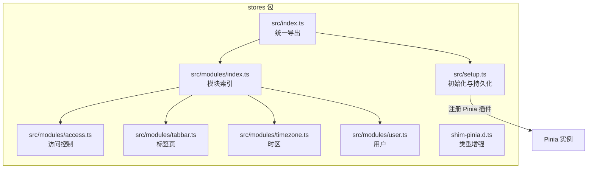
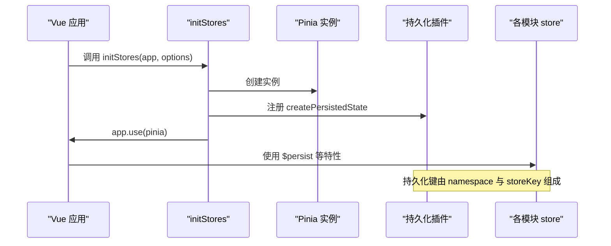
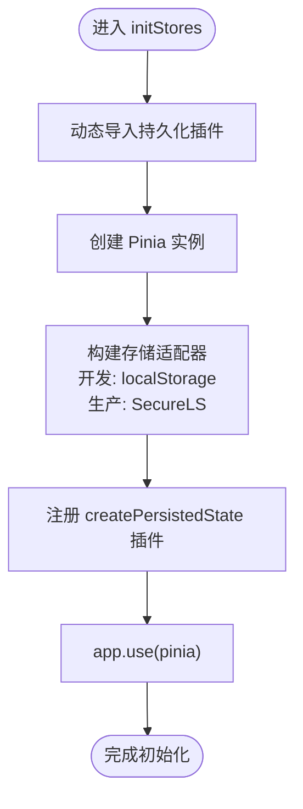
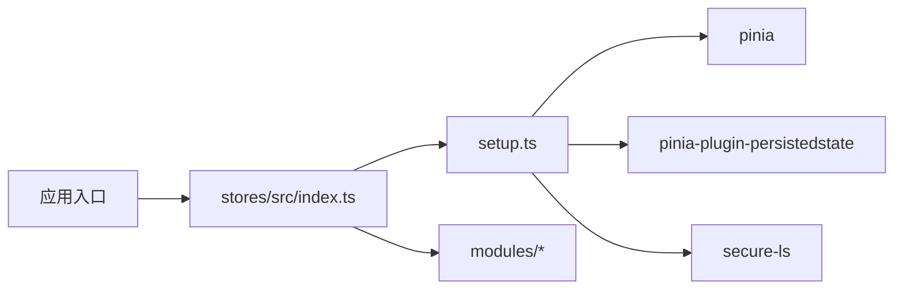

# Pinia Store 架构

<cite>
**本文引用的文件**
- [frontend/packages/stores/src/index.ts](file://frontend/packages/stores/src/index.ts)
- [frontend/packages/stores/src/setup.ts](file://frontend/packages/stores/src/setup.ts)
- [frontend/packages/stores/src/modules/index.ts](file://frontend/packages/stores/src/modules/index.ts)
- [frontend/packages/stores/src/modules/access.ts](file://frontend/packages/stores/src/modules/access.ts)
- [frontend/packages/stores/src/modules/tabbar.ts](file://frontend/packages/stores/src/modules/tabbar.ts)
- [frontend/packages/stores/src/modules/timezone.ts](file://frontend/packages/stores/src/modules/timezone.ts)
- [frontend/packages/stores/src/modules/user.ts](file://frontend/packages/stores/src/modules/user.ts)
- [frontend/packages/stores/shim-pinia.d.ts](file://frontend/packages/stores/shim-pinia.d.ts)
- [frontend/packages/stores/package.json](file://frontend/packages/stores/package.json)
</cite>

## 目录
1. [简介](#简介)
2. [项目结构](#项目结构)
3. [核心组件](#核心组件)
4. [架构总览](#架构总览)
5. [详细组件分析](#详细组件分析)
6. [依赖分析](#依赖分析)
7. [性能考虑](#性能考虑)
8. [故障排查指南](#故障排查指南)
9. [结论](#结论)
10. [附录](#附录)

## 简介
本文件系统性梳理 NovusAI SaaS 前端的 Pinia Store 架构，覆盖模块化组织、store 间依赖与数据流、初始化流程、插件配置与持久化策略、命名规范与导入导出机制，并给出类型定义、接口设计与最佳实践建议。重点阐释共享（shared）与管理后台（admin）两类 store 的设计原则与职责边界，帮助开发者高效扩展与维护状态层。

## 项目结构
- 核心包：frontend/packages/stores
- 入口导出：统一从模块索引导出 store 定义与工具函数
- 模块化组织：按功能域拆分模块（用户、访问控制、标签页、时区等）
- 初始化与持久化：通过 setup.ts 配置 Pinia 实例与持久化插件
- 类型增强：通过 shim-pinia.d.ts 提供 HMR 更新支持

图表来源
- [frontend/packages/stores/src/index.ts:1-3](file://frontend/packages/stores/src/index.ts#L1-L3)
- [frontend/packages/stores/src/setup.ts:1-59](file://frontend/packages/stores/src/setup.ts#L1-L59)
- [frontend/packages/stores/src/modules/index.ts](file://frontend/packages/stores/src/modules/index.ts)
- [frontend/packages/stores/src/modules/access.ts](file://frontend/packages/stores/src/modules/access.ts)
- [frontend/packages/stores/src/modules/tabbar.ts](file://frontend/packages/stores/src/modules/tabbar.ts)
- [frontend/packages/stores/src/modules/timezone.ts](file://frontend/packages/stores/src/modules/timezone.ts)
- [frontend/packages/stores/src/modules/user.ts](file://frontend/packages/stores/src/modules/user.ts)
- [frontend/packages/stores/shim-pinia.d.ts:1-9](file://frontend/packages/stores/shim-pinia.d.ts#L1-L9)

章节来源
- [frontend/packages/stores/src/index.ts:1-3](file://frontend/packages/stores/src/index.ts#L1-L3)
- [frontend/packages/stores/src/setup.ts:1-59](file://frontend/packages/stores/src/setup.ts#L1-L59)
- [frontend/packages/stores/src/modules/index.ts](file://frontend/packages/stores/src/modules/index.ts)
- [frontend/packages/stores/shim-pinia.d.ts:1-9](file://frontend/packages/stores/shim-pinia.d.ts#L1-L9)

## 核心组件
- 统一导出入口：集中导出模块与工具函数，便于上层应用按需引入
- 初始化器：负责创建 Pinia 实例、注入持久化插件、挂载到 Vue 应用
- 模块集合：按领域拆分的独立 store，彼此解耦，通过共享状态或服务层交互
- 类型增强：为 HMR 提供 acceptHMRUpdate 支持，提升开发体验

章节来源
- [frontend/packages/stores/src/index.ts:1-3](file://frontend/packages/stores/src/index.ts#L1-L3)
- [frontend/packages/stores/src/setup.ts:1-59](file://frontend/packages/stores/src/setup.ts#L1-L59)
- [frontend/packages/stores/shim-pinia.d.ts:1-9](file://frontend/packages/stores/shim-pinia.d.ts#L1-L9)

## 架构总览
Pinia Store 采用“模块化 + 插件化”的架构：
- 模块化：每个 store 聚焦单一职责，避免状态耦合
- 插件化：持久化插件通过 createPersistedState 实现跨会话状态恢复
- 初始化：在应用启动阶段完成 Pinia 注册与插件装配
- 数据流：单向更新，通过 actions 修改 state，computed 与 getters 派生视图

图表来源
- [frontend/packages/stores/src/setup.ts:20-47](file://frontend/packages/stores/src/setup.ts#L20-L47)

## 详细组件分析

### 初始化与持久化策略
- 初始化流程
  - 接收应用实例与命名空间选项
  - 动态导入持久化插件以减少主包体积
  - 基于环境选择存储介质（开发使用 localStorage，生产使用加密存储）
  - 将 Pinia 实例挂载至应用
- 持久化键规则
  - 键格式为 “namespace-storeId”，避免多应用冲突
  - 生产环境使用 SecureLS 进行加密存储，包含元信息键
- 重置策略
  - 提供 resetAllStores，遍历所有 store 并调用 $reset

图表来源
- [frontend/packages/stores/src/setup.ts:20-47](file://frontend/packages/stores/src/setup.ts#L20-L47)

章节来源
- [frontend/packages/stores/src/setup.ts:1-59](file://frontend/packages/stores/src/setup.ts#L1-L59)

### 模块索引与命名规范
- 模块索引：通过 modules/index.ts 汇总导出，便于集中管理与 IDE 自动补全
- 命名规范
  - 文件名：小驼峰，如 access.ts、tabbar.ts、timezone.ts、user.ts
  - storeId：与文件名一致或与其语义对应，确保键名稳定
  - 导出：默认导出 store 工厂函数，必要时提供类型别名
- 导入导出机制
  - 上层应用从 src/index.ts 导入，避免直接引用内部模块路径
  - 模块间通信通过共享服务或事件总线，避免直接互相依赖

章节来源
- [frontend/packages/stores/src/modules/index.ts](file://frontend/packages/stores/src/modules/index.ts)
- [frontend/packages/stores/src/index.ts:1-3](file://frontend/packages/stores/src/index.ts#L1-L3)

### 访问控制模块（access）
- 设计原则
  - 聚焦权限与能力判断，不承载业务数据
  - 通过 actions 维护当前用户权限集合与可用能力
  - 与用户模块解耦，权限变更触发视图更新
- 典型职责
  - 权限校验（路由守卫、按钮级控制）
  - 能力开关（功能启用/禁用）
  - 角色与资源授权映射

章节来源
- [frontend/packages/stores/src/modules/access.ts](file://frontend/packages/stores/src/modules/access.ts)

### 标签页模块（tabbar）
- 设计原则
  - 独立维护标签页状态（打开、激活、缓存策略）
  - 与路由联动，新增/关闭标签页时同步更新
- 典型职责
  - 当前激活标签页标识
  - 可关闭/不可关闭标签页区分
  - 标签页缓存与销毁策略

章节来源
- [frontend/packages/stores/src/modules/tabbar.ts](file://frontend/packages/stores/src/modules/tabbar.ts)

### 时区模块（timezone）
- 设计原则
  - 作为共享配置，避免重复计算与跨组件传递
  - 提供本地化显示与 UTC 转换辅助
- 典型职责
  - 用户时区设置
  - 时间格式化与显示策略
  - 与国际化模块协同

章节来源
- [frontend/packages/stores/src/modules/timezone.ts](file://frontend/packages/stores/src/modules/timezone.ts)

### 用户模块（user）
- 设计原则
  - 单一职责：用户基本信息、登录态、偏好设置
  - 与认证服务解耦，仅持有轻量状态
- 典型职责
  - 登录/登出状态
  - 用户资料与角色信息
  - 偏好设置（语言、主题、布局等）

章节来源
- [frontend/packages/stores/src/modules/user.ts](file://frontend/packages/stores/src/modules/user.ts)

### 类型增强与 HMR 支持
- 类型增强
  - 通过 shim-pinia.d.ts 为 Pinia 提供 acceptHMRUpdate 类型声明
- HMR 流程
  - 在开发环境下，store 更新后自动热替换，无需刷新页面

章节来源
- [frontend/packages/stores/shim-pinia.d.ts:1-9](file://frontend/packages/stores/shim-pinia.d.ts#L1-L9)

## 依赖分析
- 外部依赖
  - pinia：核心状态库
  - pinia-plugin-persistedstate：持久化插件（运行时动态导入）
  - secure-ls：生产环境加密存储
- 内部依赖
  - 模块之间无直接相互依赖，通过共享服务或事件总线交互
  - 上层应用通过统一入口导入，降低耦合度

图表来源
- [frontend/packages/stores/src/index.ts:1-3](file://frontend/packages/stores/src/index.ts#L1-L3)
- [frontend/packages/stores/src/setup.ts:1-59](file://frontend/packages/stores/src/setup.ts#L1-L59)
- [frontend/packages/stores/package.json](file://frontend/packages/stores/package.json)

章节来源
- [frontend/packages/stores/src/index.ts:1-3](file://frontend/packages/stores/src/index.ts#L1-L3)
- [frontend/packages/stores/src/setup.ts:1-59](file://frontend/packages/stores/src/setup.ts#L1-L59)
- [frontend/packages/stores/package.json](file://frontend/packages/stores/package.json)

## 性能考虑
- 持久化键粒度
  - 使用 namespace-storeId，避免不必要的全量恢复
- 存储介质选择
  - 开发环境使用 localStorage，减少加密开销；生产环境使用 SecureLS，兼顾安全与性能
- 动态导入插件
  - 仅在初始化时加载持久化插件，减小首屏体积
- 状态拆分
  - 将大对象拆分为细粒度 store，降低序列化与反序列化成本
- 避免过度响应
  - 对高频更新的字段使用局部订阅，减少无关渲染

## 故障排查指南
- Pinia 未安装
  - 现象：调用 resetAllStores 报错
  - 处理：确认 initStores 是否已执行并挂载至应用
- 持久化异常
  - 现象：生产环境读写失败或数据丢失
  - 处理：检查加密密钥、存储介质配置与 SecureLS 初始化参数
- 键冲突
  - 现象：多应用共享同一存储导致状态错乱
  - 处理：为不同应用设置唯一 namespace
- HMR 不生效
  - 现象：修改 store 后页面未热更新
  - 处理：确认 shim-pinia.d.ts 已正确声明 acceptHMRUpdate

章节来源
- [frontend/packages/stores/src/setup.ts:50-59](file://frontend/packages/stores/src/setup.ts#L50-L59)
- [frontend/packages/stores/shim-pinia.d.ts:1-9](file://frontend/packages/stores/shim-pinia.d.ts#L1-L9)

## 结论
该 Pinia Store 架构以模块化为核心，结合持久化插件与命名空间策略，实现了清晰的职责划分与良好的可维护性。通过统一入口与类型增强，提升了开发效率与一致性。建议在扩展新模块时遵循现有命名与导入导出规范，并优先考虑将状态拆分为细粒度 store，以获得更佳的性能与可测试性。

## 附录
- 最佳实践清单
  - 新增 store 时，先在 modules 下创建文件，再在 modules/index.ts 汇总导出
  - 使用 $persist 仅对必要字段持久化，避免大对象频繁序列化
  - 为多应用场景配置唯一 namespace，防止键冲突
  - 通过 actions 修改 state，避免直接赋值导致的不可追踪更新
  - 在开发环境启用 HMR，提高迭代效率