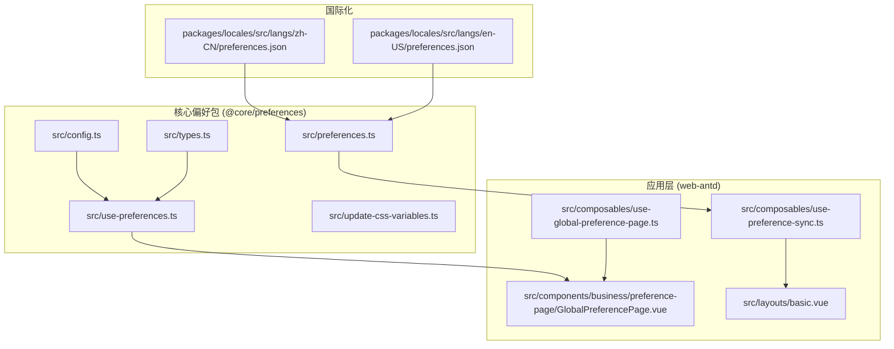
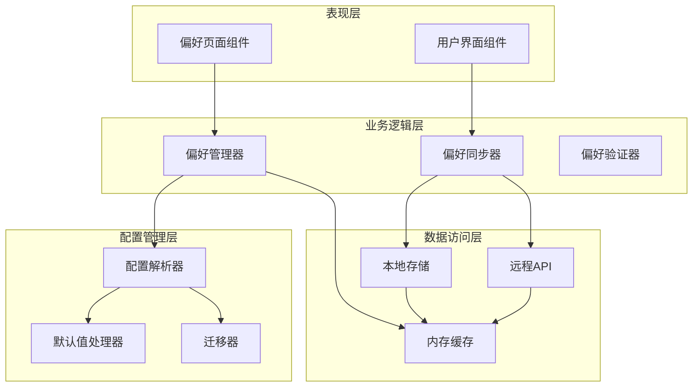
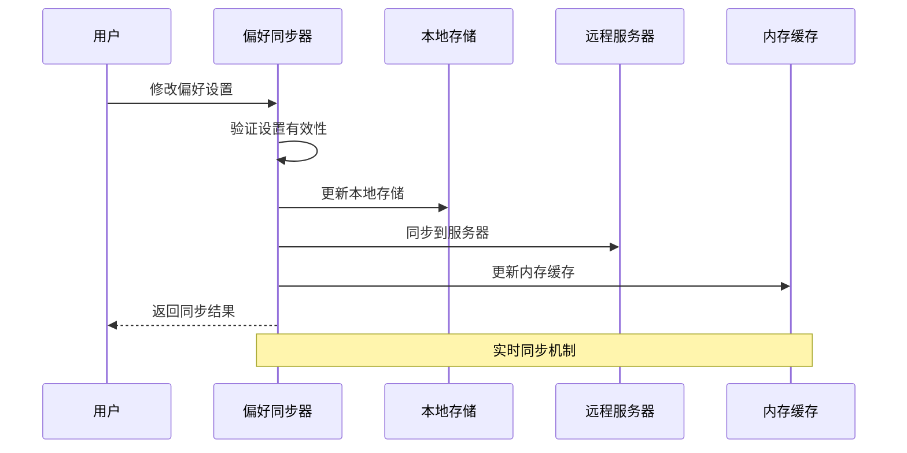
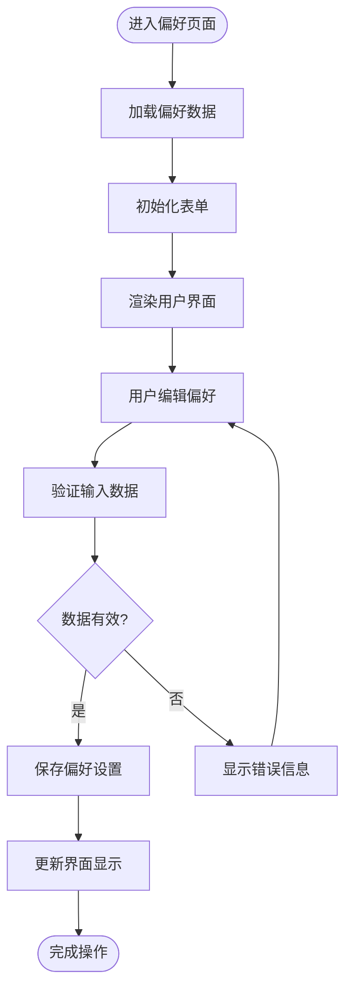
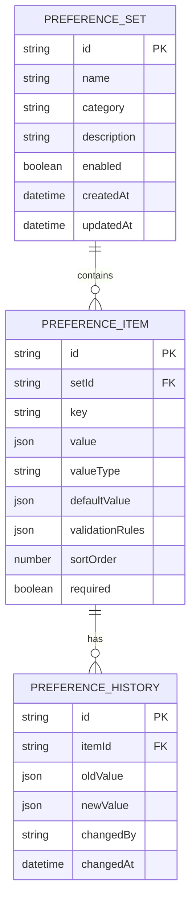

# 偏好设置系统

<cite>
**本文档引用的文件**
- [preferences.ts](file://frontend/packages/@core/preferences/src/preferences.ts)
- [config.ts](file://frontend/packages/@core/preferences/src/config.ts)
- [types.ts](file://frontend/packages/@core/preferences/src/types.ts)
- [use-preferences.ts](file://frontend/packages/@core/preferences/src/use-preferences.ts)
- [update-css-variables.ts](file://frontend/packages/@core/preferences/src/update-css-variables.ts)
- [use-preference-sync.ts](file://frontend/apps/web-antd/src/composables/use-preference-sync.ts)
- [use-global-preference-page.ts](file://frontend/apps/web-antd/src/composables/use-global-preference-page.ts)
- [GlobalPreferencePage.vue](file://frontend/apps/web-antd/src/components/business/preference-page/GlobalPreferencePage.vue)
- [basic.vue](file://frontend/apps/web-antd/src/layouts/basic.vue)
- [preferences.json](file://frontend/packages/locales/src/langs/zh-CN/preferences.json)
- [preferences.json](file://frontend/packages/locales/src/langs/en-US/preferences.json)
</cite>

## 目录
1. [简介](#简介)
2. [项目结构](#项目结构)
3. [核心组件](#核心组件)
4. [架构概览](#架构概览)
5. [详细组件分析](#详细组件分析)
6. [依赖关系分析](#依赖关系分析)
7. [性能考虑](#性能考虑)
8. [故障排除指南](#故障排除指南)
9. [结论](#结论)
10. [附录](#附录)

## 简介

NovusAI SaaS 的偏好设置系统是一个完整的前端偏好管理解决方案，提供了全局偏好配置、偏好同步机制和全局偏好页面管理功能。该系统支持用户偏好设置的分类管理、默认值处理、用户覆盖机制、持久化存储和跨会话保持等功能。

系统采用模块化设计，通过 TypeScript 类型定义确保类型安全，通过组合式函数提供灵活的偏好管理能力，并通过国际化支持多语言环境。

## 项目结构

偏好设置系统主要分布在以下目录中：



**图表来源**
- [preferences.ts:1-200](file://frontend/packages/@core/preferences/src/preferences.ts#L1-L200)
- [use-preference-sync.ts:1-100](file://frontend/apps/web-antd/src/composables/use-preference-sync.ts#L1-L100)
- [use-global-preference-page.ts:1-100](file://frontend/apps/web-antd/src/composables/use-global-preference-page.ts#L1-L100)

**章节来源**
- [preferences.ts:1-200](file://frontend/packages/@core/preferences/src/preferences.ts#L1-L200)
- [config.ts:1-150](file://frontend/packages/@core/preferences/src/config.ts#L1-L150)
- [types.ts:1-120](file://frontend/packages/@core/preferences/src/types.ts#L1-L120)

## 核心组件

### 全局偏好配置 (preferences.ts)

全局偏好配置是整个系统的入口点，负责定义所有可用的偏好设置项及其配置。该文件包含了偏好设置的完整定义，包括：

- **偏好设置分类**：按功能模块对偏好设置进行分组管理
- **默认值定义**：为每个偏好设置提供合理的默认值
- **验证规则**：定义偏好设置的有效性检查规则
- **类型定义**：通过 TypeScript 确保类型安全

### 配置管理 (config.ts)

配置管理模块负责处理偏好设置的配置信息，包括：

- **配置加载**：从不同来源加载偏好设置配置
- **配置合并**：合并多个配置源的设置
- **配置验证**：验证配置的完整性和有效性
- **配置缓存**：提供配置的内存缓存机制

### 类型定义 (types.ts)

类型定义模块提供了完整的 TypeScript 类型声明，确保：

- **强类型检查**：编译时发现类型错误
- **智能提示**：开发工具提供准确的代码提示
- **接口契约**：明确定义组件间的交互接口

**章节来源**
- [preferences.ts:1-200](file://frontend/packages/@core/preferences/src/preferences.ts#L1-L200)
- [config.ts:1-150](file://frontend/packages/@core/preferences/src/config.ts#L1-L150)
- [types.ts:1-120](file://frontend/packages/@core/preferences/src/types.ts#L1-L120)

## 架构概览

偏好设置系统采用分层架构设计，确保各组件职责清晰、耦合度低：



**图表来源**
- [use-preference-sync.ts:1-100](file://frontend/apps/web-antd/src/composables/use-preference-sync.ts#L1-L100)
- [use-global-preference-page.ts:1-100](file://frontend/apps/web-antd/src/composables/use-global-preference-page.ts#L1-L100)
- [preferences.ts:1-200](file://frontend/packages/@core/preferences/src/preferences.ts#L1-L200)

## 详细组件分析

### 偏好同步机制 (use-preference-sync)

偏好同步机制是系统的核心组件，负责处理偏好设置的实时同步和持久化存储：



**图表来源**
- [use-preference-sync.ts:51-120](file://frontend/apps/web-antd/src/composables/use-preference-sync.ts#L51-L120)

#### 核心功能特性

- **双向同步**：支持本地修改与服务器同步的双向数据流
- **冲突解决**：处理并发修改时的冲突检测和解决
- **离线支持**：在网络不可用时提供本地缓存和延迟同步
- **增量更新**：只同步发生变化的偏好设置项

### 全局偏好页面 (use-global-preference-page)

全局偏好页面提供了统一的偏好设置管理界面：



**图表来源**
- [use-global-preference-page.ts:23-80](file://frontend/apps/web-antd/src/composables/use-global-preference-page.ts#L23-L80)

#### 页面管理特性

- **表单状态管理**：跟踪表单的脏状态和验证状态
- **异步加载**：支持异步数据加载和错误处理
- **批量保存**：提供批量保存和撤销功能
- **实时预览**：支持修改后的实时效果预览

### 偏好设置数据结构

系统采用层次化的数据结构来组织偏好设置：



**图表来源**
- [preferences.ts:1-200](file://frontend/packages/@core/preferences/src/preferences.ts#L1-L200)
- [types.ts:1-120](file://frontend/packages/@core/preferences/src/types.ts#L1-L120)

**章节来源**
- [use-preference-sync.ts:1-100](file://frontend/apps/web-antd/src/composables/use-preference-sync.ts#L1-L100)
- [use-global-preference-page.ts:1-100](file://frontend/apps/web-antd/src/composables/use-global-preference-page.ts#L1-L100)

## 依赖关系分析

偏好设置系统的依赖关系呈现清晰的分层结构：

```mermaid
graph LR
subgraph "外部依赖"
Vue[Vue 3 Composition API]
Pinia[Pinia 状态管理]
Axios[Axios HTTP客户端]
Zod[Zod 数据验证]
end
subgraph "内部模块"
CorePrefs[@core/preferences]
WebAntd[web-antd 应用层]
Effects[effects 组件库]
end
subgraph "核心偏好包"
PrefsTS[preferences.ts]
ConfigTS[config.ts]
TypesTS[types.ts]
UsePrefsTS[use-preferences.ts]
end
subgraph "应用层"
SyncTS[use-preference-sync.ts]
GlobalPageTS[use-global-preference-page.ts]
BasicVue[layouts/basic.vue]
GlobalPageVue[components/business/preference-page/GlobalPreferencePage.vue]
end
Vue --> CorePrefs
Pinia --> CorePrefs
Axios --> WebAntd
Zod --> CorePrefs
CorePrefs --> WebAntd
WebAntd --> Effects
PrefsTS --> SyncTS
ConfigTS --> UsePrefsTS
TypesTS --> UsePrefsTS
UsePrefsTS --> GlobalPageTS
SyncTS --> BasicVue
GlobalPageTS --> GlobalPageVue
```

**图表来源**
- [preferences.ts:1-200](file://frontend/packages/@core/preferences/src/preferences.ts#L1-L200)
- [use-preference-sync.ts:1-100](file://frontend/apps/web-antd/src/composables/use-preference-sync.ts#L1-L100)
- [use-global-preference-page.ts:1-100](file://frontend/apps/web-antd/src/composables/use-global-preference-page.ts#L1-L100)

**章节来源**
- [preferences.ts:1-200](file://frontend/packages/@core/preferences/src/preferences.ts#L1-L200)
- [config.ts:1-150](file://frontend/packages/@core/preferences/src/config.ts#L1-L150)
- [types.ts:1-120](file://frontend/packages/@core/preferences/src/types.ts#L1-L120)

## 性能考虑

### 存储策略优化

系统采用了多层次的存储策略来确保性能和可靠性：

- **内存缓存**：高频访问的偏好设置项存储在内存中
- **本地存储**：使用浏览器本地存储实现持久化
- **增量同步**：只同步发生变化的数据，减少网络传输
- **批量操作**：支持批量更新以提高效率

### 同步机制优化

- **防抖处理**：对频繁的偏好修改进行防抖处理
- **并发控制**：限制同时进行的同步请求数量
- **错误重试**：实现智能的失败重试机制
- **离线队列**：在网络恢复时自动重试失败的同步

### 渲染性能优化

- **虚拟滚动**：对于大量偏好设置项使用虚拟滚动
- **懒加载**：按需加载偏好设置页面内容
- **组件缓存**：缓存已渲染的偏好设置组件
- **响应式更新**：只更新发生变化的部分界面

## 故障排除指南

### 常见问题及解决方案

#### 偏好设置无法保存

**症状**：用户修改偏好设置后无法保存或保存后立即恢复

**可能原因**：
- 网络连接问题导致同步失败
- 权限不足无法写入服务器
- 数据验证规则阻止了保存操作

**解决步骤**：
1. 检查网络连接状态
2. 验证用户权限是否足够
3. 查看控制台错误日志
4. 确认数据格式符合验证规则

#### 偏好设置丢失

**症状**：刷新页面后偏好设置消失

**可能原因**：
- 本地存储损坏
- 浏览器隐私模式限制存储
- 缓存清理导致数据丢失

**解决步骤**：
1. 检查浏览器存储权限
2. 尝试清除浏览器缓存
3. 在其他浏览器中测试
4. 检查是否有备份数据

#### 同步冲突

**症状**：多个设备上的偏好设置出现不一致

**可能原因**：
- 并发修改未正确处理
- 离线模式下的数据冲突
- 网络延迟导致的时序问题

**解决步骤**：
1. 检查同步日志
2. 分析冲突发生的时间点
3. 实施适当的冲突解决策略
4. 考虑增加版本控制机制

**章节来源**
- [use-preference-sync.ts:1-100](file://frontend/apps/web-antd/src/composables/use-preference-sync.ts#L1-L100)
- [preferences.json:1-50](file://frontend/packages/locales/src/langs/zh-CN/preferences.json#L1-L50)
- [preferences.json:1-50](file://frontend/packages/locales/src/langs/en-US/preferences.json#L1-L50)

## 结论

NovusAI SaaS 的偏好设置系统通过模块化设计和分层架构实现了功能完整、性能优异的偏好管理解决方案。系统的主要优势包括：

- **类型安全**：完整的 TypeScript 支持确保编译时类型检查
- **模块化设计**：清晰的组件分离便于维护和扩展
- **性能优化**：多层次的缓存和同步机制提升用户体验
- **国际化支持**：完善的多语言支持满足全球化需求
- **错误处理**：健壮的错误处理和恢复机制

该系统为 NovusAI SaaS 提供了可靠的偏好设置管理基础，支持用户个性化配置的同时保证了系统的稳定性和可扩展性。

## 附录

### 扩展方法和最佳实践

#### 添加新的偏好设置项

1. **定义类型**：在类型定义文件中添加新的类型声明
2. **配置设置**：在偏好配置中添加新的设置项
3. **默认值**：提供合理的默认值和验证规则
4. **UI集成**：在相关界面中添加对应的输入控件
5. **国际化**：添加必要的翻译文本

#### 数据迁移策略

系统支持平滑的数据迁移，包括：
- **向后兼容**：新版本向旧版本的兼容性保证
- **字段升级**：支持新增字段的渐进式升级
- **数据转换**：自动转换旧格式的数据到新格式
- **回滚机制**：提供失败时的回滚能力

#### 性能监控指标

建议监控的关键指标：
- **同步成功率**：衡量数据同步的可靠性
- **加载时间**：偏好设置页面的响应时间
- **内存使用**：系统资源消耗情况
- **错误率**：各种异常的发生频率