# 共享Store模块

<cite>
**本文档引用的文件**
- [frontend/apps/web-antd/src/store/shared/index.ts](file://frontend/apps/web-antd/src/store/shared/index.ts)
- [frontend/apps/web-antd/src/store/shared/ai-panel.ts](file://frontend/apps/web-antd/src/store/shared/ai-panel.ts)
- [frontend/apps/web-antd/src/store/shared/announcement.ts](file://frontend/apps/web-antd/src/store/shared/announcement.ts)
- [frontend/apps/web-antd/src/store/shared/multi-auth.ts](file://frontend/apps/web-antd/src/store/shared/multi-auth.ts)
- [frontend/apps/web-antd/src/store/shared/notification.ts](file://frontend/apps/web-antd/src/store/shared/notification.ts)
- [frontend/apps/web-antd/src/store/shared/presence.ts](file://frontend/apps/web-antd/src/store/shared/presence.ts)
- [frontend/apps/web-antd/src/store/shared/public-config.ts](file://frontend/apps/web-antd/src/store/shared/public-config.ts)
- [frontend/apps/web-antd/src/store/shared/socketio.ts](file://frontend/apps/web-antd/src/store/shared/socketio.ts)
- [frontend/apps/web-antd/src/store/shared/token-storage.ts](file://frontend/apps/web-antd/src/store/shared/token-storage.ts)
- [frontend/apps/web-antd/src/store/shared/user-preference.ts](file://frontend/apps/web-antd/src/store/shared/user-preference.ts)
</cite>

## 目录
1. [简介](#简介)
2. [项目结构](#项目结构)
3. [核心组件](#核心组件)
4. [架构概览](#架构概览)
5. [详细组件分析](#详细组件分析)
6. [依赖关系分析](#依赖关系分析)
7. [性能考虑](#性能考虑)
8. [故障排除指南](#故障排除指南)
9. [结论](#结论)

## 简介

NovusAI SaaS的共享Store模块是前端状态管理系统的核心组件，负责管理跨组件和跨页面的状态共享。该模块实现了统一的状态管理，确保AI面板、公告系统、多认证状态、通知管理、在线状态、公共配置、实时通信、令牌管理和用户偏好设置等关键功能的一致性和可靠性。

共享Store模块采用模块化设计，每个store都是独立的功能单元，通过统一的导出接口进行管理。这种设计模式确保了代码的可维护性、可测试性和可扩展性。

## 项目结构

共享Store模块位于前端应用的store目录下，采用清晰的模块化组织结构：

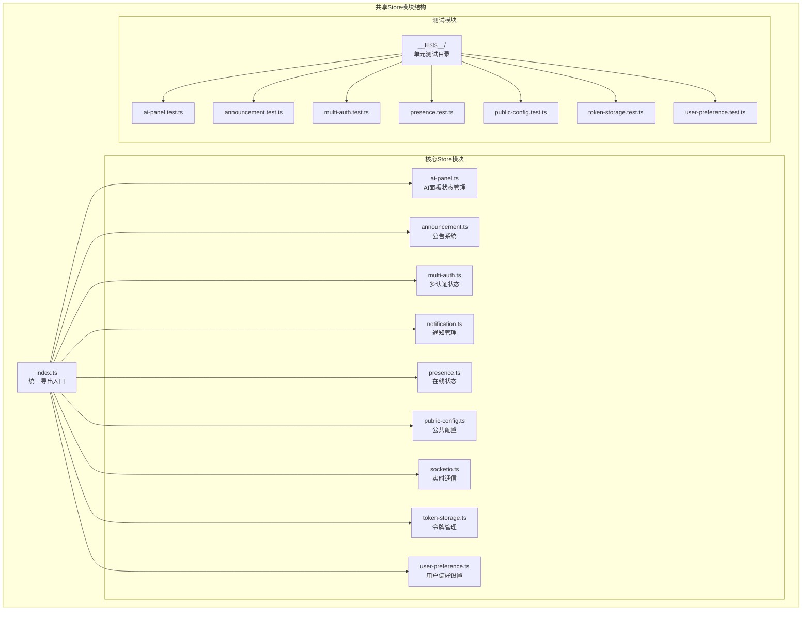

**图表来源**
- [frontend/apps/web-antd/src/store/shared/index.ts:1-14](file://frontend/apps/web-antd/src/store/shared/index.ts#L1-L14)

**章节来源**
- [frontend/apps/web-antd/src/store/shared/index.ts:1-14](file://frontend/apps/web-antd/src/store/shared/index.ts#L1-L14)

## 核心组件

共享Store模块包含九个核心store组件，每个都负责特定的功能领域：

### 统一导出机制
模块通过index.ts文件提供统一的导出接口，简化了外部导入过程并保持了API的一致性。

### 模块化设计原则
- **单一职责**: 每个store专注于特定的功能领域
- **独立性**: 各store之间保持低耦合
- **可测试性**: 每个store都有对应的单元测试
- **可扩展性**: 支持未来功能的添加和修改

**章节来源**
- [frontend/apps/web-antd/src/store/shared/index.ts:6-14](file://frontend/apps/web-antd/src/store/shared/index.ts#L6-L14)

## 架构概览

共享Store模块采用分层架构设计，确保状态管理的高效性和可靠性：

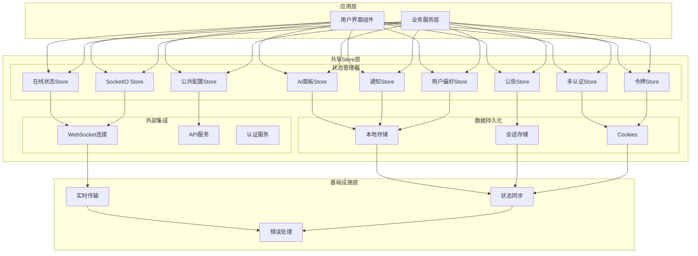

**图表来源**
- [frontend/apps/web-antd/src/store/shared/ai-panel.ts](file://frontend/apps/web-antd/src/store/shared/ai-panel.ts)
- [frontend/apps/web-antd/src/store/shared/socketio.ts](file://frontend/apps/web-antd/src/store/shared/socketio.ts)

## 详细组件分析

### AI面板状态管理 (ai-panel)

AI面板store负责管理AI交互界面的状态，包括模型选择、对话历史、输入状态等关键信息。

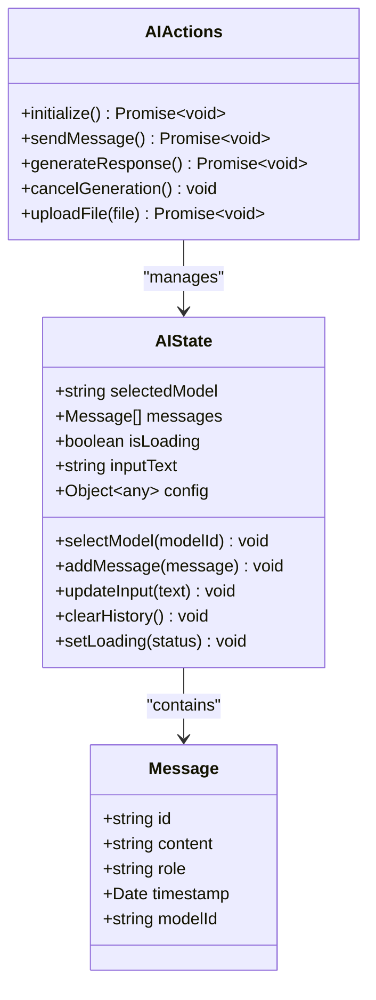

**图表来源**
- [frontend/apps/web-antd/src/store/shared/ai-panel.ts](file://frontend/apps/web-antd/src/store/shared/ai-panel.ts)

**状态管理特性**:
- 实时消息流处理
- 多模型支持
- 输入验证和格式化
- 错误恢复机制

### 公告系统 (announcement)

公告store管理平台公告的显示、状态跟踪和用户交互。

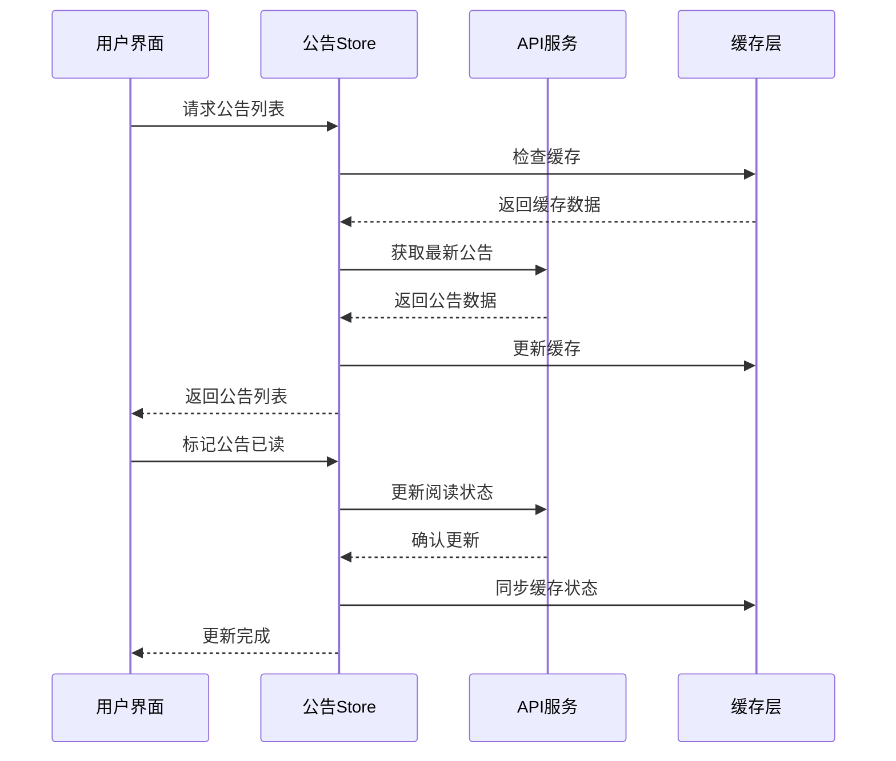

**图表来源**
- [frontend/apps/web-antd/src/store/shared/announcement.ts](file://frontend/apps/web-antd/src/store/shared/announcement.ts)

**核心功能**:
- 公告内容管理
- 阅读状态跟踪
- 分类和优先级排序
- 自动刷新机制

### 多认证状态 (multi-auth)

多认证store处理复杂的认证场景，支持多种认证方式和状态切换。

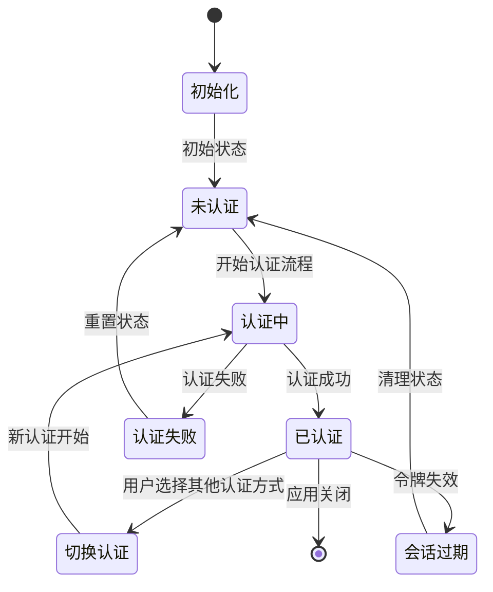

**图表来源**
- [frontend/apps/web-antd/src/store/shared/multi-auth.ts](file://frontend/apps/web-antd/src/store/shared/multi-auth.ts)

**认证流程**:
- 多种认证方式支持
- 自动令牌刷新
- 并发认证请求处理
- 状态持久化

### 通知管理 (notification)

通知store负责系统通知的收集、分类和展示管理。

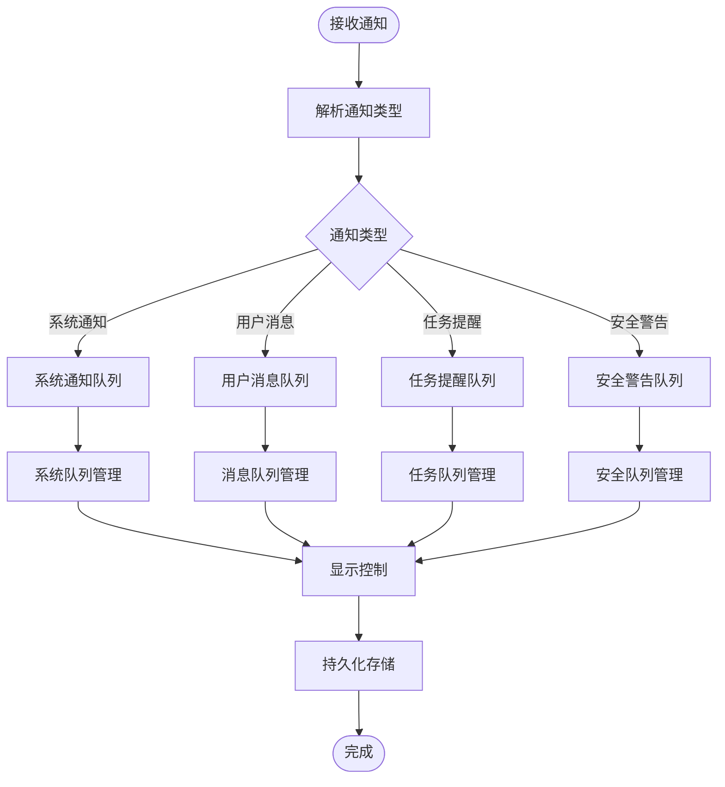

**图表来源**
- [frontend/apps/web-antd/src/store/shared/notification.ts](file://frontend/apps/web-antd/src/store/shared/notification.ts)

**通知特性**:
- 多类型通知支持
- 优先级排序
- 批量操作
- 静默模式

### 在线状态 (presence)

在线状态store管理用户和联系人的在线状态同步。

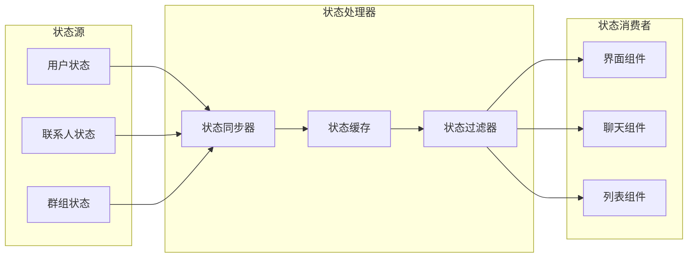

**图表来源**
- [frontend/apps/web-antd/src/store/shared/presence.ts](file://frontend/apps/web-antd/src/store/shared/presence.ts)

**状态同步机制**:
- 实时状态更新
- 离线状态缓存
- 心跳检测
- 状态合并算法

### 公共配置 (public-config)

公共配置store管理平台的全局配置信息。

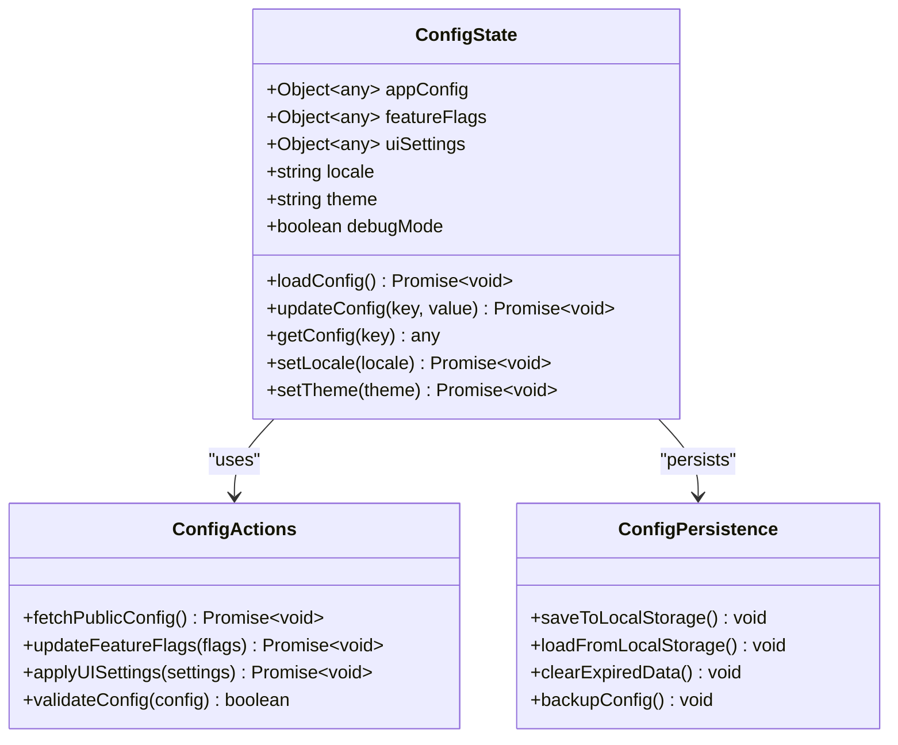

**图表来源**
- [frontend/apps/web-antd/src/store/shared/public-config.ts](file://frontend/apps/web-antd/src/store/shared/public-config.ts)

**配置管理**:
- 动态配置加载
- 配置验证
- 环境变量支持
- 热更新机制

### SocketIO 实时通信 (socketio)

SocketIO store处理实时通信连接和事件管理。

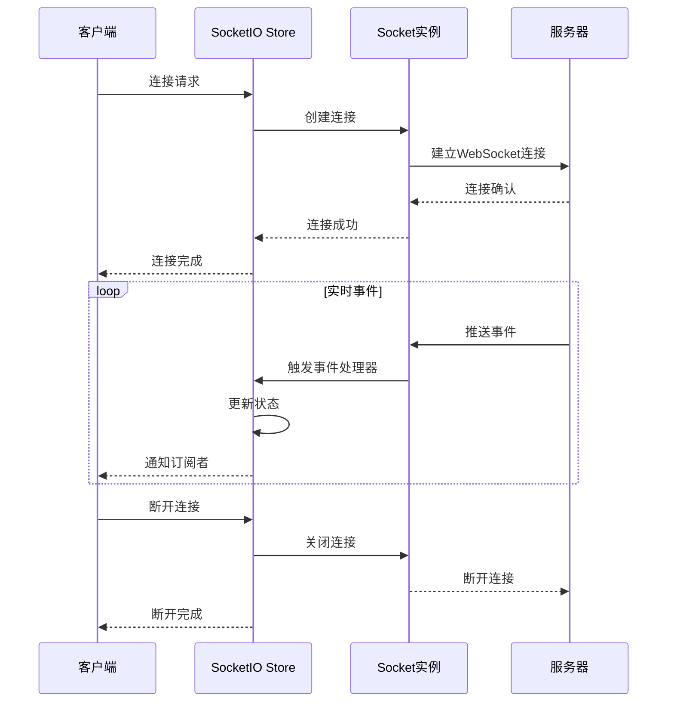

**图表来源**
- [frontend/apps/web-antd/src/store/shared/socketio.ts](file://frontend/apps/web-antd/src/store/shared/socketio.ts)

**实时通信特性**:
- 自动重连机制
- 事件监听管理
- 连接状态监控
- 错误处理和恢复

### 令牌管理 (token-storage)

令牌store负责安全令牌的存储、刷新和管理。

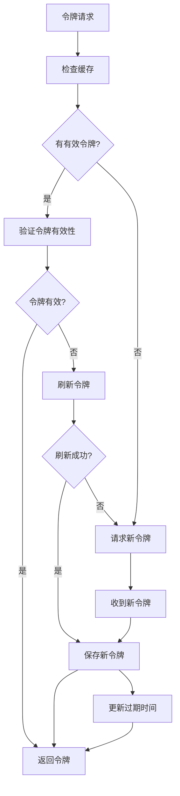

**图表来源**
- [frontend/apps/web-antd/src/store/shared/token-storage.ts](file://frontend/apps/web-antd/src/store/shared/token-storage.ts)

**令牌管理**:
- 自动令牌刷新
- 多存储后端支持
- 安全存储策略
- 过期处理机制

### 用户偏好设置 (user-preference)

用户偏好store管理用户的个性化设置。

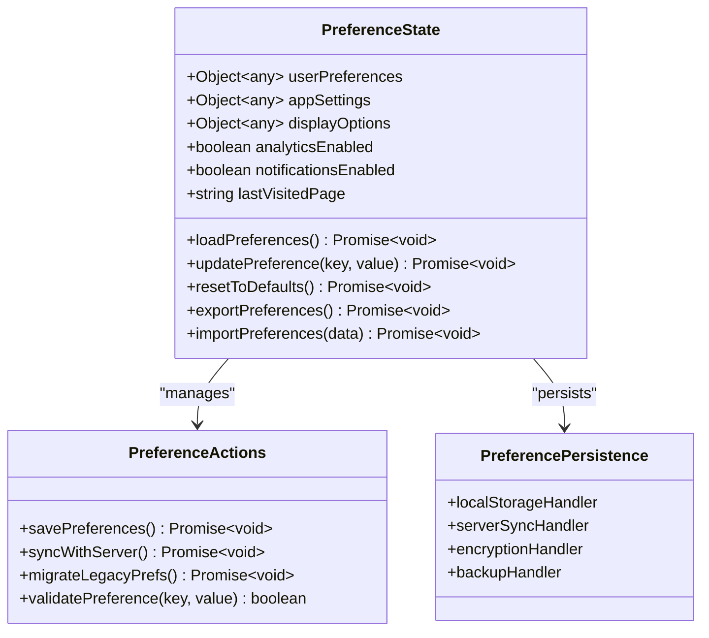

**图表来源**
- [frontend/apps/web-antd/src/store/shared/user-preference.ts](file://frontend/apps/web-antd/src/store/shared/user-preference.ts)

**偏好管理**:
- 个性化设置存储
- 跨设备同步
- 设置迁移
- 数据备份和恢复

## 依赖关系分析

共享Store模块内部的依赖关系和交互模式：

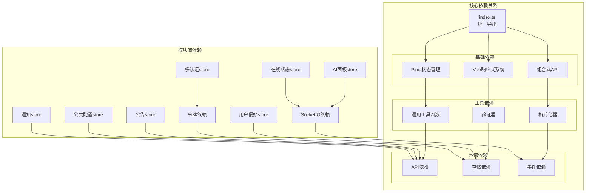

**图表来源**
- [frontend/apps/web-antd/src/store/shared/index.ts](file://frontend/apps/web-antd/src/store/shared/index.ts)

**依赖管理策略**:
- 明确的依赖注入
- 松耦合设计
- 可替换的依赖实现
- 循环依赖避免

## 性能考虑

共享Store模块在设计时充分考虑了性能优化：

### 状态更新优化
- **批量更新**: 使用事务性更新减少不必要的重新渲染
- **深度监听**: 智能的响应式监听，避免深层对象的过度监听
- **计算属性**: 使用派生状态减少重复计算

### 内存管理
- **自动清理**: 组件卸载时自动清理相关状态
- **垃圾回收**: 及时释放不再使用的引用
- **内存泄漏防护**: 监控和防止常见的内存泄漏模式

### 缓存策略
- **多层缓存**: L1缓存(内存) + L2缓存(持久化存储)
- **智能过期**: 基于时间戳和访问频率的智能过期机制
- **缓存预热**: 应用启动时预加载常用数据

### 异步处理
- **并发控制**: 限制同时进行的异步操作数量
- **请求去重**: 避免重复的相同请求
- **超时处理**: 合理的超时和重试机制

## 故障排除指南

### 常见问题诊断

**状态不同步问题**
- 检查store实例的唯一性
- 验证状态更新的原子性
- 确认响应式系统的正确使用

**内存泄漏排查**
- 使用浏览器开发者工具监控内存使用
- 检查事件监听器的正确移除
- 验证定时器和WebSocket连接的清理

**性能问题定位**
- 分析组件重新渲染次数
- 检查大型对象的深拷贝操作
- 优化计算属性的依赖关系

### 错误恢复机制

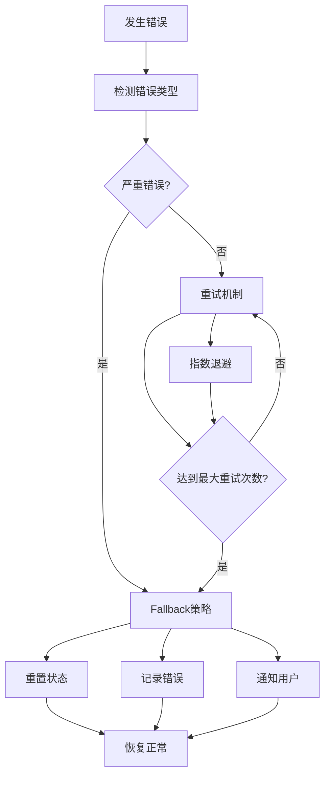

**图表来源**
- [frontend/apps/web-antd/src/store/shared/token-storage.ts](file://frontend/apps/web-antd/src/store/shared/token-storage.ts)

### 调试工具和技巧
- **Vue DevTools**: 使用Vue官方调试工具检查状态变化
- **日志记录**: 实现详细的错误日志和状态变更日志
- **断点调试**: 在关键状态更新点设置断点
- **性能分析**: 使用浏览器性能面板分析渲染性能

## 结论

NovusAI SaaS的共享Store模块通过精心设计的架构和实现，为整个应用提供了强大而可靠的状态管理能力。该模块不仅满足了当前的功能需求，还为未来的扩展和维护奠定了坚实的基础。

### 主要优势
- **模块化设计**: 清晰的功能分离和独立的测试覆盖
- **性能优化**: 多层次的缓存策略和内存管理
- **可靠性**: 完善的错误处理和恢复机制
- **可维护性**: 标准化的代码结构和文档

### 技术亮点
- 统一的状态管理模式
- 实时通信的优雅降级
- 安全的令牌管理机制
- 个性化的用户体验

该共享Store模块为NovusAI SaaS平台提供了稳定、高效、可扩展的状态管理解决方案，是整个应用架构的重要基石。