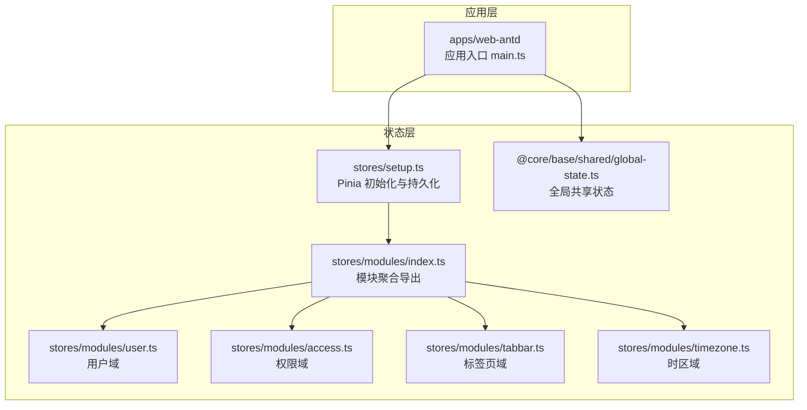
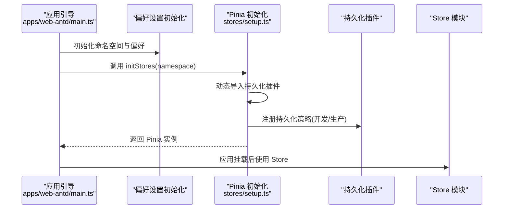
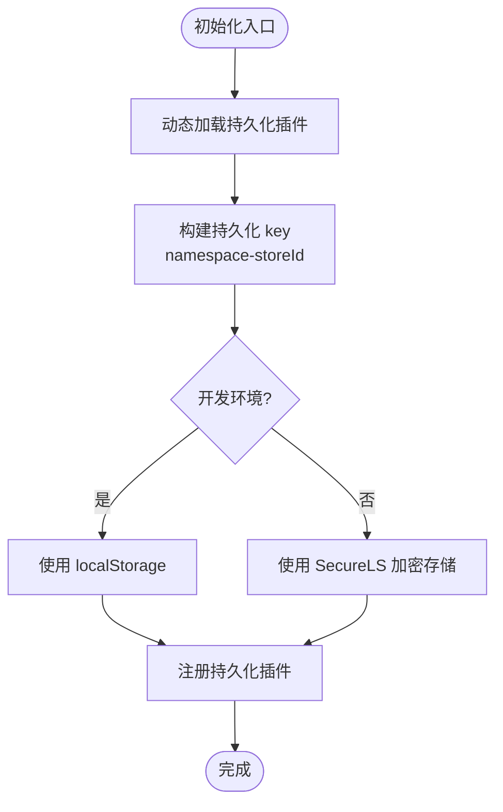
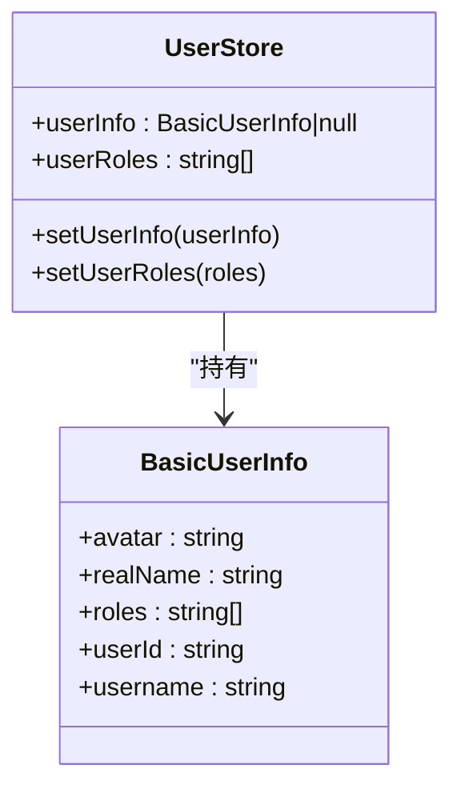
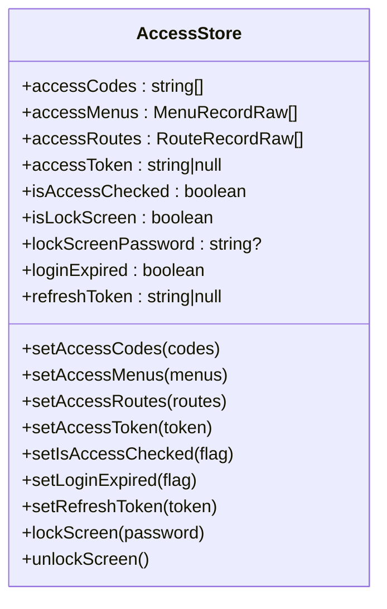
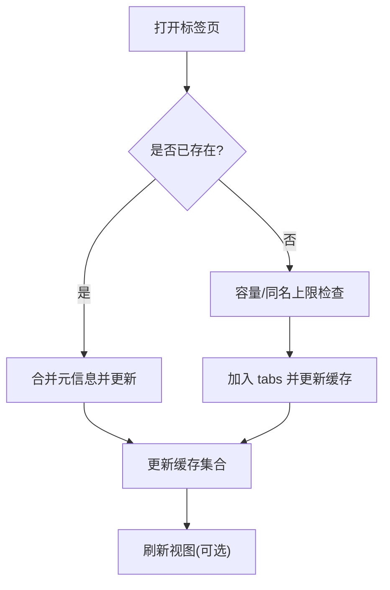
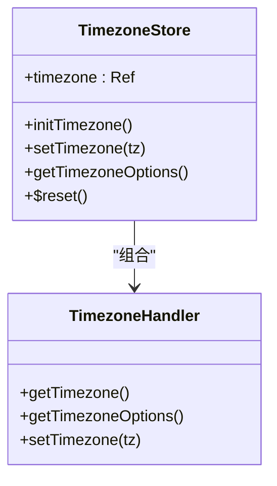
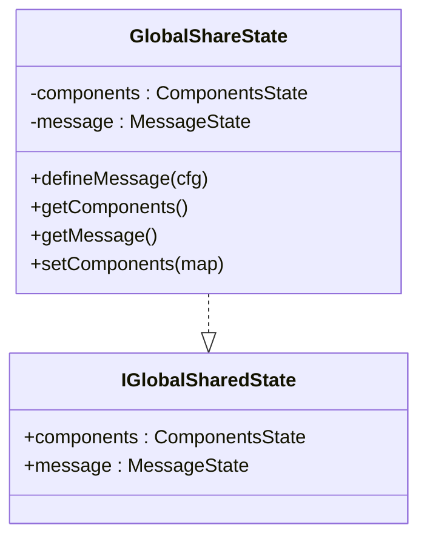
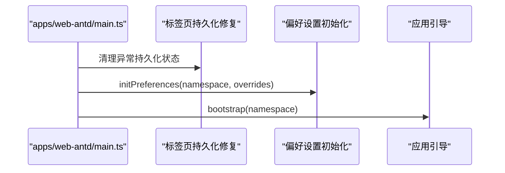
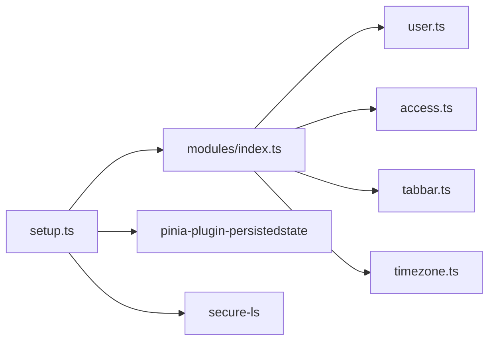

# 状态管理

<cite>
**本文引用的文件**
- [frontend/packages/stores/src/setup.ts](file://frontend/packages/stores/src/setup.ts)
- [frontend/packages/stores/src/index.ts](file://frontend/packages/stores/src/index.ts)
- [frontend/packages/stores/src/modules/index.ts](file://frontend/packages/stores/src/modules/index.ts)
- [frontend/packages/stores/src/modules/user.ts](file://frontend/packages/stores/src/modules/user.ts)
- [frontend/packages/stores/src/modules/access.ts](file://frontend/packages/stores/src/modules/access.ts)
- [frontend/packages/stores/src/modules/tabbar.ts](file://frontend/packages/stores/src/modules/tabbar.ts)
- [frontend/packages/stores/src/modules/timezone.ts](file://frontend/packages/stores/src/modules/timezone.ts)
- [frontend/apps/web-antd/src/main.ts](file://frontend/apps/web-antd/src/main.ts)
- [frontend/packages/@core/base/shared/src/global-state.ts](file://frontend/packages/@core/base/shared/src/global-state.ts)
- [frontend/packages/@core/base/shared/src/store.ts](file://frontend/packages/@core/base/shared/src/store.ts)
</cite>

## 目录
1. [简介](#简介)
2. [项目结构](#项目结构)
3. [核心组件](#核心组件)
4. [架构总览](#架构总览)
5. [详细组件分析](#详细组件分析)
6. [依赖关系分析](#依赖关系分析)
7. [性能考量](#性能考量)
8. [故障排查指南](#故障排查指南)
9. [结论](#结论)
10. [附录](#附录)

## 简介
本文件系统性梳理 NovusAI SaaS 前端的状态管理架构，围绕 Pinia 的模块化设计、持久化策略、响应式数据与副作用处理、全局/局部状态划分、数据流控制、序列化与跨页面共享、调试与性能监控集成，以及最佳实践与一致性保障展开。文档同时给出关键流程图与时序图，帮助读者快速理解并落地实施。

## 项目结构
NovusAI 前端采用“包化”组织方式，状态管理位于独立包中，便于多应用复用与隔离。核心结构如下：
- stores 包：集中存放 Pinia Store 的初始化、模块化导出与各业务域 Store 实现
- apps/web-antd：应用入口，负责初始化偏好设置、命名空间与引导启动
- @core/base/shared：提供全局共享状态与底层状态库封装

图表来源
- [frontend/packages/stores/src/setup.ts:1-60](file://frontend/packages/stores/src/setup.ts#L1-L60)
- [frontend/packages/stores/src/modules/index.ts:1-5](file://frontend/packages/stores/src/modules/index.ts#L1-L5)
- [frontend/packages/stores/src/modules/user.ts:1-65](file://frontend/packages/stores/src/modules/user.ts#L1-L65)
- [frontend/packages/stores/src/modules/access.ts:1-130](file://frontend/packages/stores/src/modules/access.ts#L1-L130)
- [frontend/packages/stores/src/modules/tabbar.ts:1-662](file://frontend/packages/stores/src/modules/tabbar.ts#L1-L662)
- [frontend/packages/stores/src/modules/timezone.ts:1-133](file://frontend/packages/stores/src/modules/timezone.ts#L1-L133)
- [frontend/apps/web-antd/src/main.ts:1-35](file://frontend/apps/web-antd/src/main.ts#L1-L35)
- [frontend/packages/@core/base/shared/src/global-state.ts:1-46](file://frontend/packages/@core/base/shared/src/global-state.ts#L1-L46)

章节来源
- [frontend/packages/stores/src/setup.ts:1-60](file://frontend/packages/stores/src/setup.ts#L1-L60)
- [frontend/packages/stores/src/index.ts:1-4](file://frontend/packages/stores/src/index.ts#L1-L4)
- [frontend/packages/stores/src/modules/index.ts:1-5](file://frontend/packages/stores/src/modules/index.ts#L1-L5)
- [frontend/apps/web-antd/src/main.ts:1-35](file://frontend/apps/web-antd/src/main.ts#L1-L35)

## 核心组件
- Pinia 初始化与持久化
  - 通过异步加载持久化插件，按开发/生产环境选择存储介质，并以命名空间前缀隔离不同应用的缓存键
  - 使用安全加密存储在生产环境，本地存储在开发环境
- Store 模块化
  - 用户域：维护用户基本信息与角色集合
  - 权限域：维护访问令牌、菜单/路由授权、锁屏状态与登录过期标记
  - 标签页域：维护标签页列表、缓存集合、右键菜单、刷新控制与拖拽排序
  - 时区域：维护当前时区、时区选项与默认时区处理器
- 全局共享状态
  - 提供组件与消息提示的全局共享容器，确保不受请求影响

章节来源
- [frontend/packages/stores/src/setup.ts:17-48](file://frontend/packages/stores/src/setup.ts#L17-L48)
- [frontend/packages/stores/src/modules/user.ts:38-58](file://frontend/packages/stores/src/modules/user.ts#L38-L58)
- [frontend/packages/stores/src/modules/access.ts:48-123](file://frontend/packages/stores/src/modules/access.ts#L48-L123)
- [frontend/packages/stores/src/modules/tabbar.ts:52-556](file://frontend/packages/stores/src/modules/tabbar.ts#L52-L556)
- [frontend/packages/stores/src/modules/timezone.ts:62-124](file://frontend/packages/stores/src/modules/timezone.ts#L62-L124)
- [frontend/packages/@core/base/shared/src/global-state.ts:14-46](file://frontend/packages/@core/base/shared/src/global-state.ts#L14-L46)

## 架构总览
下图展示应用启动到 Pinia 初始化、模块注册与持久化生效的关键路径，以及与全局共享状态的关系。

图表来源
- [frontend/apps/web-antd/src/main.ts:11-32](file://frontend/apps/web-antd/src/main.ts#L11-L32)
- [frontend/packages/stores/src/setup.ts:20-47](file://frontend/packages/stores/src/setup.ts#L20-L47)

## 详细组件分析

### Pinia 初始化与持久化策略
- 命名空间隔离
  - 通过应用名、版本号与环境组合生成命名空间，作为持久化 key 前缀，避免多应用间冲突
- 存储介质选择
  - 开发环境：localStorage
  - 生产环境：SecureLS 加密存储，结合 metaKey 与加密密钥，提升敏感数据安全性
- 持久化粒度
  - 不同 Store 可自定义 pick 字段，仅持久化必要字段；部分 Store 使用 sessionStorage 或自定义 pick 策略
- 重置能力
  - 提供统一重置所有 Store 的方法，便于登出或切换租户后的状态清理

图表来源
- [frontend/packages/stores/src/setup.ts:20-47](file://frontend/packages/stores/src/setup.ts#L20-L47)

章节来源
- [frontend/packages/stores/src/setup.ts:10-15](file://frontend/packages/stores/src/setup.ts#L10-L15)
- [frontend/packages/stores/src/setup.ts:24-44](file://frontend/packages/stores/src/setup.ts#L24-L44)
- [frontend/packages/stores/src/setup.ts:50-59](file://frontend/packages/stores/src/setup.ts#L50-L59)

### 用户域 Store（useUserStore）
- 职责
  - 维护用户基本信息与角色集合
  - 提供设置用户信息与角色的原子动作
- 数据结构
  - userInfo：BasicUserInfo 类型，包含头像、昵称、角色、userId、username
  - userRoles：字符串数组
- 响应式与副作用
  - 通过 Pinia actions 更新状态，保持响应式更新
- HMR 支持
  - 在开发环境下启用热更新接受

图表来源
- [frontend/packages/stores/src/modules/user.ts:3-25](file://frontend/packages/stores/src/modules/user.ts#L3-L25)
- [frontend/packages/stores/src/modules/user.ts:41-58](file://frontend/packages/stores/src/modules/user.ts#L41-L58)

章节来源
- [frontend/packages/stores/src/modules/user.ts:38-58](file://frontend/packages/stores/src/modules/user.ts#L38-L58)
- [frontend/packages/stores/src/modules/user.ts:60-65](file://frontend/packages/stores/src/modules/user.ts#L60-L65)

### 权限域 Store（useAccessStore）
- 职责
  - 维护访问令牌、刷新令牌、权限码、菜单与路由授权、锁屏状态、登录过期标记
- 持久化策略
  - 通过 persist.pick 指定需要持久化的字段，减少存储体积与安全风险
- 功能点
  - 菜单查找、锁屏/解锁、设置各类令牌与状态标记
- HMR 支持
  - 开启热更新接受

图表来源
- [frontend/packages/stores/src/modules/access.ts:9-46](file://frontend/packages/stores/src/modules/access.ts#L9-L46)
- [frontend/packages/stores/src/modules/access.ts:51-123](file://frontend/packages/stores/src/modules/access.ts#L51-L123)

章节来源
- [frontend/packages/stores/src/modules/access.ts:102-111](file://frontend/packages/stores/src/modules/access.ts#L102-L111)
- [frontend/packages/stores/src/modules/access.ts:125-130](file://frontend/packages/stores/src/modules/access.ts#L125-L130)

### 标签页域 Store（useTabbarStore）
- 职责
  - 维护标签页列表、缓存集合、右键菜单、刷新控制、拖拽排序与固定标签页
- 持久化策略
  - 使用 sessionStorage 保存 tabs，避免与用户态持久化混用
- 功能点
  - 打开/关闭标签页、批量关闭、左右侧关闭、刷新、固定/取消固定、标题动态更新、缓存集合更新
- 性能优化
  - 通过 excludeCachedTabs 与 cachedTabs 控制 KeepAlive 缓存，避免不必要的渲染
- HMR 支持
  - 开启热更新接受

图表来源
- [frontend/packages/stores/src/modules/tabbar.ts:109-170](file://frontend/packages/stores/src/modules/tabbar.ts#L109-L170)
- [frontend/packages/stores/src/modules/tabbar.ts:485-504](file://frontend/packages/stores/src/modules/tabbar.ts#L485-L504)

章节来源
- [frontend/packages/stores/src/modules/tabbar.ts:530-536](file://frontend/packages/stores/src/modules/tabbar.ts#L530-L536)
- [frontend/packages/stores/src/modules/tabbar.ts:558-562](file://frontend/packages/stores/src/modules/tabbar.ts#L558-L562)

### 时区域 Store（useTimezoneStore）
- 职责
  - 维护当前时区、提供时区选项与设置接口，支持默认与自定义处理器
- 持久化策略
  - 通过 persist.pick 仅持久化 timezone 字段
- 初始化
  - 应用启动时尝试从处理器获取时区并设置默认时区

图表来源
- [frontend/packages/stores/src/modules/timezone.ts:62-124](file://frontend/packages/stores/src/modules/timezone.ts#L62-L124)

章节来源
- [frontend/packages/stores/src/modules/timezone.ts:118-123](file://frontend/packages/stores/src/modules/timezone.ts#L118-L123)
- [frontend/packages/stores/src/modules/timezone.ts:128-133](file://frontend/packages/stores/src/modules/timezone.ts#L128-L133)

### 全局共享状态（globalShareState）
- 职责
  - 提供组件与消息提示的全局共享容器，采用单例模式，确保不受请求影响
- 使用建议
  - 仅放置与请求无关的全局状态，避免 SSR/多租户场景下的状态污染

图表来源
- [frontend/packages/@core/base/shared/src/global-state.ts:19-45](file://frontend/packages/@core/base/shared/src/global-state.ts#L19-L45)

章节来源
- [frontend/packages/@core/base/shared/src/global-state.ts:14-46](file://frontend/packages/@core/base/shared/src/global-state.ts#L14-L46)

### 应用入口与引导流程
- 应用入口负责：
  - 修复标签页持久化异常状态
  - 初始化偏好设置（含命名空间）
  - 引导启动应用并挂载
- 与状态管理的关系：
  - 命名空间贯穿偏好设置与 Pinia 初始化，确保持久化键隔离
  - 标签页持久化修复在引导阶段执行，避免首屏卡顿

图表来源
- [frontend/apps/web-antd/src/main.ts:11-32](file://frontend/apps/web-antd/src/main.ts#L11-L32)

章节来源
- [frontend/apps/web-antd/src/main.ts:11-32](file://frontend/apps/web-antd/src/main.ts#L11-L32)

## 依赖关系分析
- 模块聚合
  - modules/index.ts 将各域 Store 聚合导出，便于统一引入
- 外部依赖
  - Pinia：核心状态容器
  - pinia-plugin-persistedstate：持久化插件
  - secure-ls：生产环境加密存储
  - @vben-core/*：类型与工具（菜单、路由、偏好等）

图表来源
- [frontend/packages/stores/src/modules/index.ts:1-5](file://frontend/packages/stores/src/modules/index.ts#L1-L5)
- [frontend/packages/stores/src/setup.ts:20-47](file://frontend/packages/stores/src/setup.ts#L20-L47)

章节来源
- [frontend/packages/stores/src/modules/index.ts:1-5](file://frontend/packages/stores/src/modules/index.ts#L1-L5)
- [frontend/packages/stores/src/setup.ts:20-47](file://frontend/packages/stores/src/setup.ts#L20-L47)

## 性能考量
- 持久化粒度控制
  - 仅持久化必要字段，降低存储体积与序列化开销
  - 对大列表（如标签页）使用 sessionStorage，避免污染用户态持久化
- KeepAlive 缓存优化
  - 通过 cachedTabs 与 excludeCachedTabs 精准控制缓存集合，减少无效渲染
- 开发/生产差异化
  - 开发环境使用 localStorage，生产环境使用加密存储，兼顾易调试与安全性
- 初始化顺序
  - 在应用引导阶段完成持久化修复与偏好初始化，避免首屏阻塞

章节来源
- [frontend/packages/stores/src/modules/tabbar.ts:530-536](file://frontend/packages/stores/src/modules/tabbar.ts#L530-L536)
- [frontend/packages/stores/src/modules/access.ts:102-111](file://frontend/packages/stores/src/modules/access.ts#L102-L111)
- [frontend/packages/stores/src/setup.ts:34-44](file://frontend/packages/stores/src/setup.ts#L34-L44)

## 故障排查指南
- 持久化异常
  - 症状：刷新后状态异常或卡顿
  - 排查：确认命名空间是否正确、加密密钥是否配置、storage 选择是否符合预期
  - 处理：在引导阶段执行持久化修复逻辑，清理异常状态
- 登出/切换租户后状态未清空
  - 排查：调用统一重置方法，确认所有 Store 已被重置
- 标签页缓存错乱
  - 排查：检查 cachedTabs 与 excludeCachedTabs 的更新时机，确保在标签页变更后及时更新
- 时区初始化失败
  - 排查：检查自定义时区处理器是否返回有效值，确认默认处理器可用

章节来源
- [frontend/packages/stores/src/setup.ts:50-59](file://frontend/packages/stores/src/setup.ts#L50-L59)
- [frontend/packages/stores/src/modules/tabbar.ts:485-504](file://frontend/packages/stores/src/modules/tabbar.ts#L485-L504)
- [frontend/packages/stores/src/modules/timezone.ts:103-105](file://frontend/packages/stores/src/modules/timezone.ts#L103-L105)
- [frontend/apps/web-antd/src/main.ts:17-18](file://frontend/apps/web-antd/src/main.ts#L17-L18)

## 结论
本状态管理方案以 Pinia 为核心，结合模块化设计与精细化持久化策略，在多应用隔离、性能优化与开发体验之间取得平衡。通过明确的全局/局部状态划分、严格的序列化与跨页面共享控制，以及完善的故障排查与最佳实践，能够支撑 NovusAI SaaS 的复杂业务场景。

## 附录
- 最佳实践
  - 明确划分全局与局部状态，避免全局状态膨胀
  - 优先使用 sessionStorage 存放大列表，减少用户态持久化压力
  - 严格控制持久化字段，定期审计 pick 配置
  - 在应用引导阶段完成持久化修复与偏好初始化
  - 为关键 Store 提供 $reset 方法，便于登出/切换租户
- 错误处理与一致性
  - 对时区初始化等异步操作增加兜底日志
  - 对持久化读写失败进行降级处理，保证应用可用
- 调试与性能监控
  - 开发环境启用 Pinia Devtools，结合 HMR 快速定位问题
  - 生产环境记录关键状态变更事件，配合埋点与链路追踪