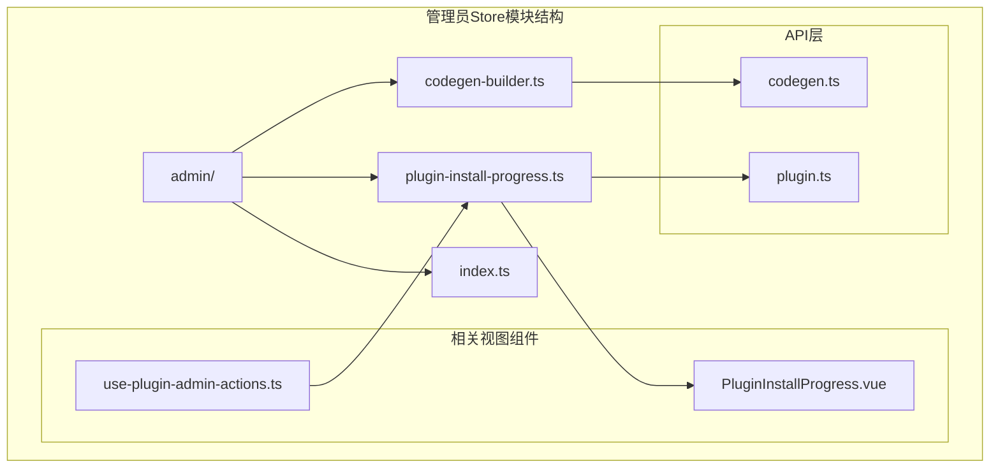
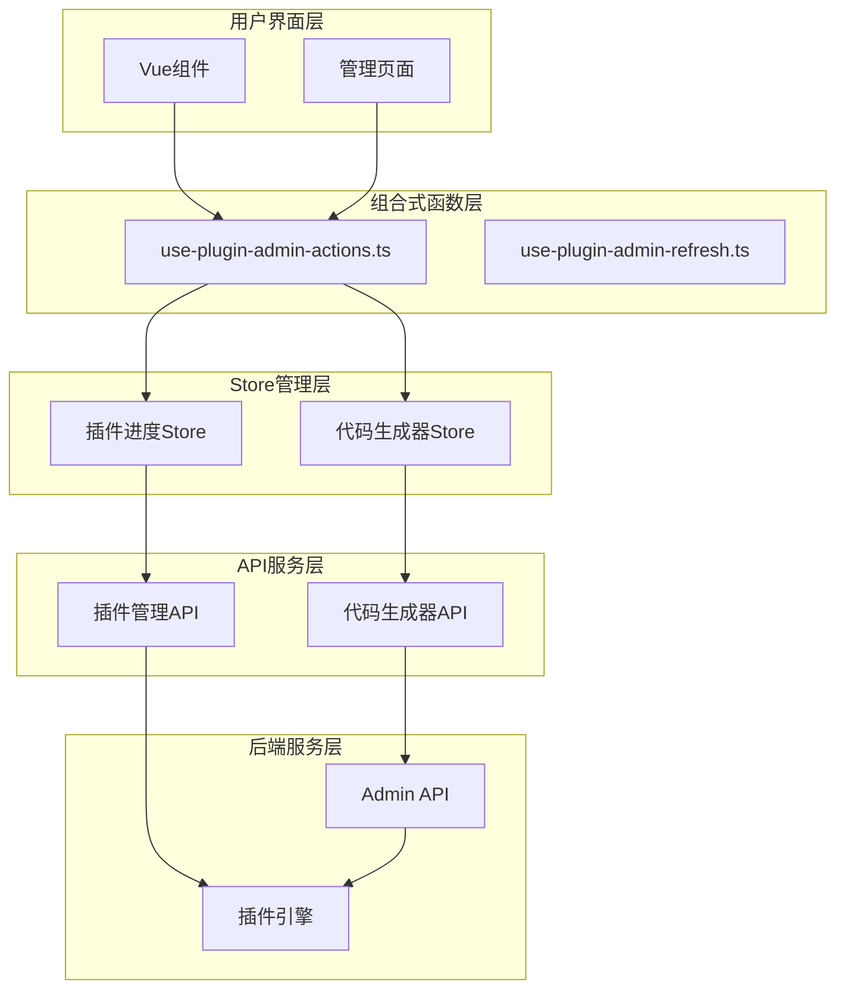
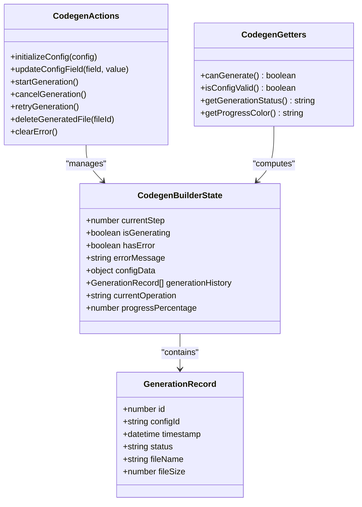
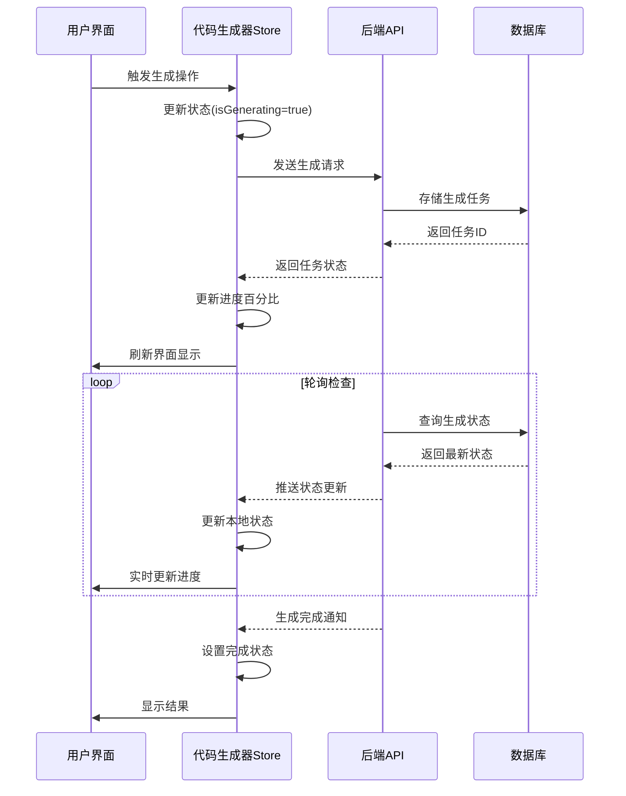
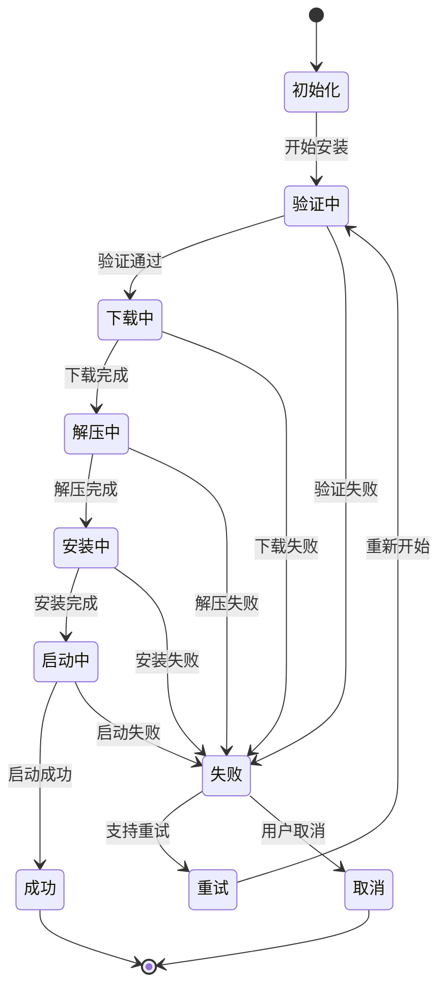
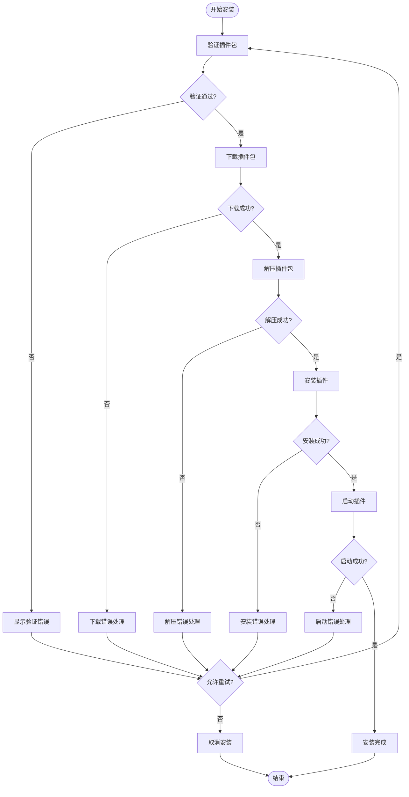
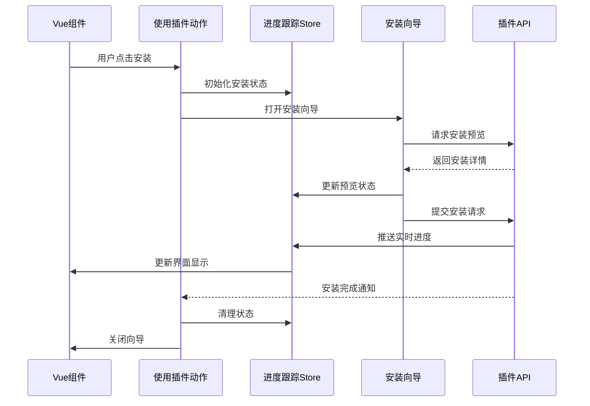
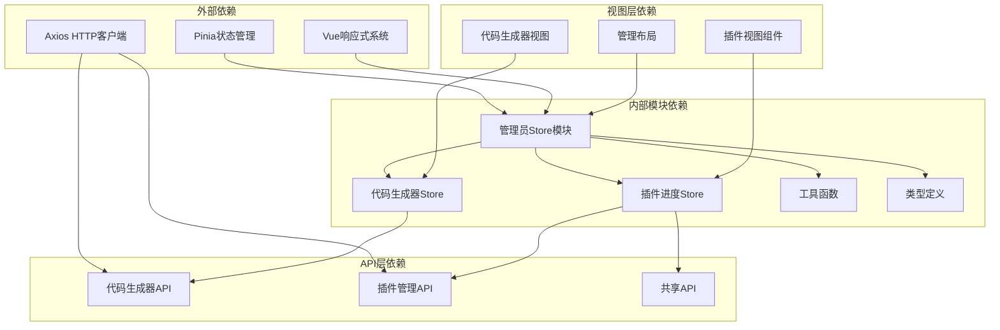

# 管理员Store模块

<cite>
**本文档引用的文件**
- [frontend/apps/web-antd/src/store/admin/index.ts](file://frontend/apps/web-antd/src/store/admin/index.ts)
- [frontend/apps/web-antd/src/store/admin/codegen-builder.ts](file://frontend/apps/web-antd/src/store/admin/codegen-builder.ts)
- [frontend/apps/web-antd/src/store/admin/plugin-install-progress.ts](file://frontend/apps/web-antd/src/store/admin/plugin-install-progress.ts)
- [frontend/apps/web-antd/src/views/admin/plugins/modules/PluginInstallProgress.vue](file://frontend/apps/web-antd/src/views/admin/plugins/modules/PluginInstallProgress.vue)
- [frontend/apps/web-antd/src/views/admin/plugins/use-plugin-admin-actions.ts](file://frontend/apps/web-antd/src/views/admin/plugins/use-plugin-admin-actions.ts)
- [frontend/apps/web-antd/src/api/admin/codegen.ts](file://frontend/apps/web-antd/src/api/admin/codegen.ts)
- [frontend/apps/web-antd/src/api/admin/plugin.ts](file://frontend/apps/web-antd/src/api/admin/plugin.ts)
- [frontend/apps/web-antd/src/composables/use-plugin-admin-refresh.ts](file://frontend/apps/web-antd/src/composables/use-plugin-admin-refresh.ts)
</cite>

## 目录
1. [简介](#简介)
2. [项目结构](#项目结构)
3. [核心组件](#核心组件)
4. [架构概览](#架构概览)
5. [详细组件分析](#详细组件分析)
6. [依赖关系分析](#依赖关系分析)
7. [性能考虑](#性能考虑)
8. [故障排除指南](#故障排除指南)
9. [结论](#结论)

## 简介

管理员Store模块是NovusAI SaaS平台中负责管理后台功能的核心状态管理系统。该模块主要处理两大关键业务场景：代码生成器状态管理和插件安装进度跟踪。通过精心设计的状态管理模式，确保管理员能够高效地管理平台的各种配置和扩展功能。

本模块采用Pinia状态管理库，实现了响应式状态管理、动作分发和计算属性等现代前端状态管理模式。每个store都遵循单一职责原则，专注于特定的业务领域，同时通过清晰的接口与其他模块进行交互。

## 项目结构

管理员Store模块位于前端应用的store系统中，采用模块化的组织方式：

**图表来源**
- [frontend/apps/web-antd/src/store/admin/index.ts:1-6](file://frontend/apps/web-antd/src/store/admin/index.ts#L1-L6)
- [frontend/apps/web-antd/src/store/admin/codegen-builder.ts](file://frontend/apps/web-antd/src/store/admin/codegen-builder.ts)
- [frontend/apps/web-antd/src/store/admin/plugin-install-progress.ts](file://frontend/apps/web-antd/src/store/admin/plugin-install-progress.ts)

**章节来源**
- [frontend/apps/web-antd/src/store/admin/index.ts:1-6](file://frontend/apps/web-antd/src/store/admin/index.ts#L1-L6)

## 核心组件

管理员Store模块包含两个核心store组件，每个都针对特定的管理员业务场景进行了优化设计：

### 代码生成器状态管理器 (CodegenBuilder)

代码生成器状态管理器专门负责管理CRUD代码生成器的配置和状态。它提供了完整的生命周期管理，从配置创建到最终生成的全过程跟踪。

### 插件安装进度跟踪器 (PluginInstallProgress)

插件安装进度跟踪器专注于监控和管理插件的安装过程。它提供了实时的进度反馈、错误处理和状态同步机制。

**章节来源**
- [frontend/apps/web-antd/src/store/admin/codegen-builder.ts](file://frontend/apps/web-antd/src/store/admin/codegen-builder.ts)
- [frontend/apps/web-antd/src/store/admin/plugin-install-progress.ts](file://frontend/apps/web-antd/src/store/admin/plugin-install-progress.ts)

## 架构概览

管理员Store模块采用了分层架构设计，确保了良好的关注点分离和可维护性：

**图表来源**
- [frontend/apps/web-antd/src/views/admin/plugins/use-plugin-admin-actions.ts:1-50](file://frontend/apps/web-antd/src/views/admin/plugins/use-plugin-admin-actions.ts#L1-L50)
- [frontend/apps/web-antd/src/composables/use-plugin-admin-refresh.ts:1-50](file://frontend/apps/web-antd/src/composables/use-plugin-admin-refresh.ts#L1-L50)

## 详细组件分析

### 代码生成器状态管理器

代码生成器状态管理器是一个专门设计用于管理代码生成配置的store。它实现了完整的状态管理模式，包括状态定义、动作处理和计算属性。

#### 状态结构设计

**图表来源**
- [frontend/apps/web-antd/src/store/admin/codegen-builder.ts](file://frontend/apps/web-antd/src/store/admin/codegen-builder.ts)

#### 状态更新触发机制

代码生成器状态管理器通过多种事件源触发状态更新：

1. **用户交互事件**：表单输入、按钮点击、配置变更
2. **API响应事件**：生成请求完成、错误返回、进度更新
3. **定时器事件**：轮询检查、超时处理、自动重试
4. **系统事件**：网络状态变化、存储空间不足、权限变更

#### 数据同步机制

**图表来源**
- [frontend/apps/web-antd/src/store/admin/codegen-builder.ts](file://frontend/apps/web-antd/src/store/admin/codegen-builder.ts)

**章节来源**
- [frontend/apps/web-antd/src/store/admin/codegen-builder.ts](file://frontend/apps/web-antd/src/store/admin/codegen-builder.ts)

### 插件安装进度跟踪器

插件安装进度跟踪器是管理员Store模块中最复杂的组件，负责管理整个插件生命周期的状态跟踪。

#### 进度跟踪状态模型

**图表来源**
- [frontend/apps/web-antd/src/store/admin/plugin-install-progress.ts](file://frontend/apps/web-antd/src/store/admin/plugin-install-progress.ts)

#### 进度跟踪机制

插件安装进度跟踪器实现了多层次的进度监控机制：

1. **多阶段进度跟踪**：从验证、下载、解压到安装的完整流程监控
2. **实时状态更新**：通过WebSocket或轮询机制获取最新的安装状态
3. **错误恢复机制**：支持部分失败后的断点续传和重试
4. **并发控制**：管理多个插件的并行安装状态

#### 错误处理策略

**图表来源**
- [frontend/apps/web-antd/src/store/admin/plugin-install-progress.ts](file://frontend/apps/web-antd/src/store/admin/plugin-install-progress.ts)

**章节来源**
- [frontend/apps/web-antd/src/store/admin/plugin-install-progress.ts](file://frontend/apps/web-antd/src/store/admin/plugin-install-progress.ts)

### 组件间交互流程

管理员Store模块中的组件通过清晰的接口进行交互，确保了良好的松耦合设计：

**图表来源**
- [frontend/apps/web-antd/src/views/admin/plugins/use-plugin-admin-actions.ts:1-50](file://frontend/apps/web-antd/src/views/admin/plugins/use-plugin-admin-actions.ts#L1-L50)
- [frontend/apps/web-antd/src/views/admin/plugins/modules/PluginInstallProgress.vue](file://frontend/apps/web-antd/src/views/admin/plugins/modules/PluginInstallProgress.vue)

**章节来源**
- [frontend/apps/web-antd/src/views/admin/plugins/use-plugin-admin-actions.ts:1-50](file://frontend/apps/web-antd/src/views/admin/plugins/use-plugin-admin-actions.ts#L1-L50)
- [frontend/apps/web-antd/src/views/admin/plugins/modules/PluginInstallProgress.vue](file://frontend/apps/web-antd/src/views/admin/plugins/modules/PluginInstallProgress.vue)

## 依赖关系分析

管理员Store模块的依赖关系体现了清晰的分层架构设计：

**图表来源**
- [frontend/apps/web-antd/src/store/admin/index.ts:1-6](file://frontend/apps/web-antd/src/store/admin/index.ts#L1-L6)
- [frontend/apps/web-antd/src/store/admin/codegen-builder.ts](file://frontend/apps/web-antd/src/store/admin/codegen-builder.ts)
- [frontend/apps/web-antd/src/store/admin/plugin-install-progress.ts](file://frontend/apps/web-antd/src/store/admin/plugin-install-progress.ts)

**章节来源**
- [frontend/apps/web-antd/src/store/admin/index.ts:1-6](file://frontend/apps/web-antd/src/store/admin/index.ts#L1-L6)

## 性能考虑

管理员Store模块在设计时充分考虑了性能优化，采用了多种策略来确保系统的高效运行：

### 状态更新优化

1. **批量更新**：通过合并多个状态变更来减少不必要的重新渲染
2. **防抖机制**：对频繁的状态更新进行防抖处理，避免过度的API调用
3. **懒加载**：按需加载大型数据集，减少初始加载时间

### 内存管理

1. **状态清理**：及时清理已完成操作的历史记录和临时数据
2. **引用优化**：使用不可变数据结构避免意外的状态污染
3. **垃圾回收**：定期清理未使用的计算属性缓存

### 缓存策略

1. **智能缓存**：对频繁访问的数据进行缓存，减少重复的API调用
2. **失效策略**：设置合理的缓存失效时间，确保数据的新鲜度
3. **增量更新**：只更新发生变化的部分，而不是整个状态树

## 故障排除指南

管理员Store模块提供了完善的错误处理和故障排除机制：

### 常见问题诊断

#### 代码生成器问题

1. **生成失败**：检查配置参数的有效性和数据库连接状态
2. **进度停滞**：验证网络连接和后端服务的可用性
3. **内存泄漏**：监控长时间运行的生成任务的内存使用情况

#### 插件安装问题

1. **安装中断**：检查磁盘空间和网络连接稳定性
2. **权限错误**：验证插件安装目录的写入权限
3. **版本冲突**：检查现有插件版本与新版本的兼容性

### 调试工具

管理员Store模块提供了多种调试工具来帮助开发者诊断问题：

1. **状态快照**：可以捕获任意时刻的状态快照进行分析
2. **操作日志**：记录所有状态变更的操作历史
3. **性能监控**：监控状态更新的性能指标和瓶颈

**章节来源**
- [frontend/apps/web-antd/src/store/admin/plugin-install-progress.ts](file://frontend/apps/web-antd/src/store/admin/plugin-install-progress.ts)

## 结论

管理员Store模块通过精心设计的状态管理模式，为NovusAI SaaS平台提供了强大而灵活的管理功能。该模块不仅实现了代码生成器和插件安装进度的核心业务逻辑，还通过清晰的架构设计和完善的错误处理机制，确保了系统的稳定性和可维护性。

模块的主要优势包括：

1. **模块化设计**：清晰的职责分离使得每个组件都专注于特定的业务领域
2. **响应式更新**：基于Vue响应式系统的实时状态更新机制
3. **错误恢复**：完善的错误处理和自动重试机制
4. **性能优化**：多种性能优化策略确保系统的高效运行
5. **可扩展性**：模块化的架构设计便于功能扩展和维护

通过合理使用这些store组件，管理员可以高效地管理平台的各种配置和扩展功能，为用户提供更好的管理体验。