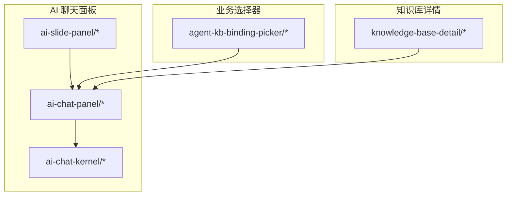
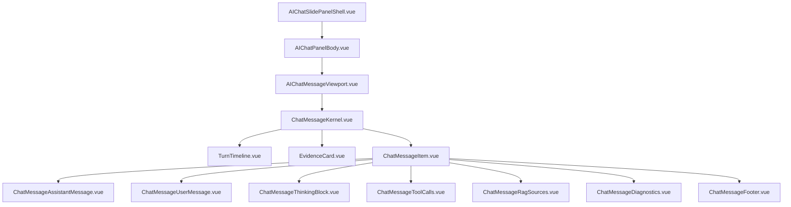
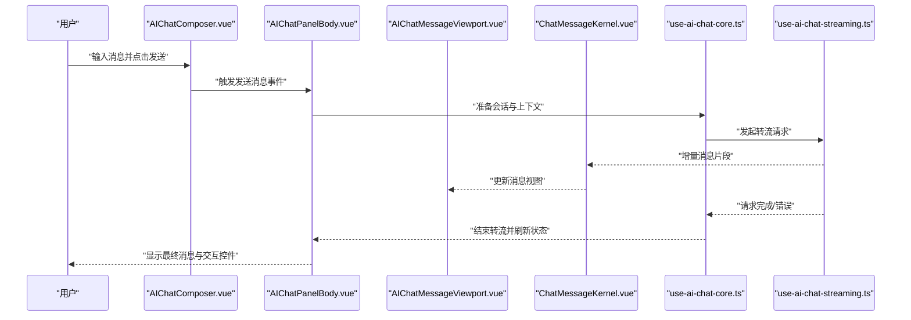
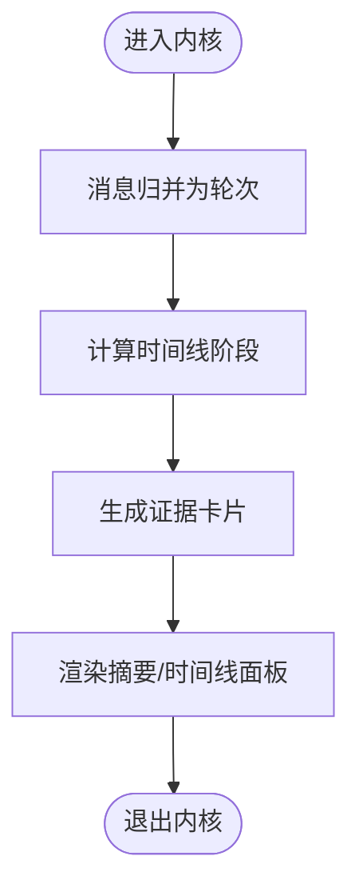
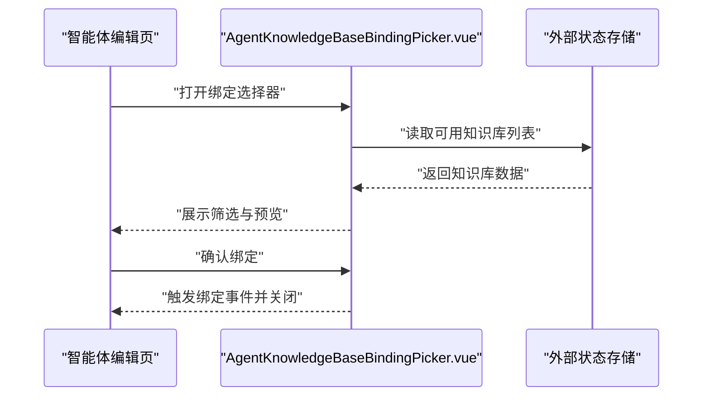
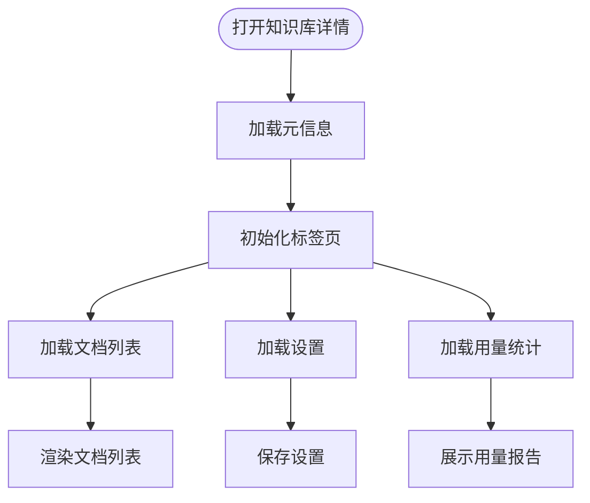
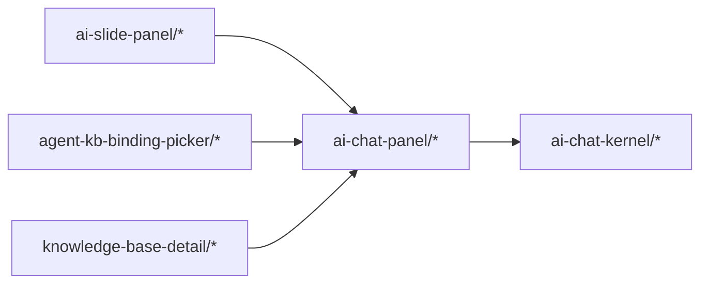

# 业务组件

<cite>
**本文引用的文件**
- [AgentKnowledgeBaseBindingPicker.vue](file://frontend/apps/web-antd/src/components/business/agent-kb-binding-picker/AgentKnowledgeBaseBindingPicker.vue)
- [types.ts](file://frontend/apps/web-antd/src/components/business/agent-kb-binding-picker/types.ts)
- [index.ts](file://frontend/apps/web-antd/src/components/business/agent-kb-binding-picker/index.ts)
- [knowledge-base-detail/KnowledgeBaseDetail.vue](file://frontend/apps/web-antd/src/components/business/knowledge-base-detail/KnowledgeBaseDetail.vue)
- [knowledge-base-detail/KnowledgeBaseDetailHeader.vue](file://frontend/apps/web-antd/src/components/business/knowledge-base-detail/KnowledgeBaseDetailHeader.vue)
- [knowledge-base-detail/KnowledgeBaseDetailTabs.vue](file://frontend/apps/web-antd/srccomponents/business/knowledge-base-detail/KnowledgeBaseDetailTabs.vue)
- [knowledge-base-detail/KnowledgeBaseDetailTabContent.vue](file://frontend/apps/web-antd/src/components/business/knowledge-base-detail/KnowledgeBaseDetailTabContent.vue)
- [knowledge-base-detail/KnowledgeBaseDetailTabDocuments.vue](file://frontend/apps/web-antd/src/components/business/knowledge-base-detail/KnowledgeBaseDetailTabDocuments.vue)
- [knowledge-base-detail/KnowledgeBaseDetailTabSettings.vue](file://frontend/apps/web-antd/src/components/business/knowledge-base-detail/KnowledgeBaseDetailTabSettings.vue)
- [knowledge-base-detail/KnowledgeBaseDetailTabUsage.vue](file://frontend/apps/web-antd/src/components/business/knowledge-base-detail/KnowledgeBaseDetailTabUsage.vue)
- [knowledge-base-detail/types.ts](file://frontend/apps/web-antd/src/components/business/knowledge-base-detail/types.ts)
- [ai-chat-panel/ChatMessageItem.vue](file://frontend/apps/web-antd/src/components/business/ai-chat-panel/ChatMessageItem.vue)
- [ai-chat-panel/ChatMessageAssistantMessage.vue](file://frontend/apps/web-antd/src/components/business/ai-chat-panel/ChatMessageAssistantMessage.vue)
- [ai-chat-panel/ChatMessageUserMessage.vue](file://frontend/apps/web-antd/src/components/business/ai-chat-panel/ChatMessageUserMessage.vue)
- [ai-chat-panel/ChatMessageThinkingBlock.vue](file://frontend/apps/web-antd/src/components/business/ai-chat-panel/ChatMessageThinkingBlock.vue)
- [ai-chat-panel/ChatMessageToolCalls.vue](file://frontend/apps/web-antd/src/components/business/ai-chat-panel/ChatMessageToolCalls.vue)
- [ai-chat-panel/ChatMessageRagSources.vue](file://frontend/apps/web-antd/src/components/business/ai-chat-panel/ChatMessageRagSources.vue)
- [ai-chat-panel/ChatMessageDiagnostics.vue](file://frontend/apps/web-antd/src/components/business/ai-chat-panel/ChatMessageDiagnostics.vue)
- [ai-chat-panel/ChatMessageFooter.vue](file://frontend/apps/web-antd/src/components/business/ai-chat-panel/ChatMessageFooter.vue)
- [ai-chat-panel/use-ai-chat-core.ts](file://frontend/apps/web-antd/src/components/business/ai-chat-panel/use-ai-chat-core.ts)
- [ai-chat-panel/use-ai-chat-streaming.ts](file://frontend/apps/web-antd/src/components/business/ai-chat-panel/use-ai-chat-streaming.ts)
- [ai-chat-panel/use-ai-chat-turn-flow.ts](file://frontend/apps/web-antd/src/components/business/ai-chat-panel/use-ai-chat-turn-flow.ts)
- [ai-chat-panel/use-ai-chat-message-normalizers.ts](file://frontend/apps/web-antd/src/components/business/ai-chat-panel/use-ai-chat-message-normalizers.ts)
- [ai-chat-panel/chat-message-turn-flow.ts](file://frontend/apps/web-antd/src/components/business/ai-chat-panel/chat-message-turn-flow.ts)
- [ai-chat-panel/chat-message-turn-flow-display-helpers.ts](file://frontend/apps/web-antd/src/components/business/ai-chat-panel/chat-message-turn-flow-display-helpers.ts)
- [ai-chat-panel/display-formatters.ts](file://frontend/apps/web-antd/src/components/business/ai-chat-panel/display-formatters.ts)
- [ai-chat-panel/conversation-binding.ts](file://frontend/apps/web-antd/src/components/business/ai-chat-panel/conversation-binding.ts)
- [ai-chat-panel/types.ts](file://frontend/apps/web-antd/src/components/business/ai-chat-panel/types.ts)
- [ai-chat-kernel/ChatMessageKernel.vue](file://frontend/apps/web-antd/src/components/business/ai-chat-kernel/ChatMessageKernel.vue)
- [ai-chat-kernel/TurnTimeline.vue](file://frontend/apps/web-antd/src/components/business/ai-chat-kernel/TurnTimeline.vue)
- [ai-chat-kernel/EvidenceCard.vue](file://frontend/apps/web-antd/src/components/business/ai-chat-kernel/EvidenceCard.vue)
- [ai-chat-kernel/TurnFlowState.ts](file://frontend/apps/web-antd/src/components/business/ai-chat-kernel/TurnFlowState.ts)
- [ai-chat-kernel/turn-stage-presentation.ts](file://frontend/apps/web-antd/src/components/business/ai-chat-kernel/turn-stage-presentation.ts)
- [ai-slide-panel/AIChatSlidePanelShell.vue](file://frontend/apps/web-antd/src/components/business/ai-slide-panel/AIChatSlidePanelShell.vue)
- [ai-slide-panel/AIChatPanelBody.vue](file://frontend/apps/web-antd/src/components/business/ai-slide-panel/AIChatPanelBody.vue)
- [ai-slide-panel/AIChatMessageViewport.vue](file://frontend/apps/web-antd/src/components/business/ai-slide-panel/AIChatMessageViewport.vue)
- [ai-slide-panel/AIChatComposer.vue](file://frontend/apps/web-antd/src/components/business/ai-slide-panel/AIChatComposer.vue)
- [ai-slide-panel/use-ai-chat-slide-panel-shell.ts](file://frontend/apps/web-antd/src/components/business/ai-slide-panel/use-ai-chat-slide-panel-shell.ts)
- [ai-slide-panel/use-panel-shell-context.ts](file://frontend/apps/web-antd/src/components/business/ai-slide-panel/use-panel-shell-context.ts)
- [ai-slide-panel/use-panel-shell-header-context.ts](file://frontend/apps/web-antd/src/components/business/ai-slide-panel/use-panel-shell-header-context.ts)
- [ai-slide-panel/use-panel-send-message.ts](file://frontend/apps/web-antd/src/components/business/ai-slide-panel/use-panel-send-message.ts)
- [ai-slide-panel/use-panel-history.ts](file://frontend/apps/web-antd/src/components/business/ai-slide-panel/use-panel-history.ts)
- [ai-slide-panel/use-panel-composer.ts](file://frontend/apps/web-antd/src/components/business/ai-slide-panel/use-panel-composer.ts)
- [ai-slide-panel/use-panel-link-preview.ts](file://frontend/apps/web-antd/src/components/business/ai-slide-panel/use-panel-link-preview.ts)
- [ai-slide-panel/use-agent-router.ts](file://frontend/apps/web-antd/src/components/business/ai-slide-panel/use-agent-router.ts)
- [ai-slide-panel/use-panel-shell-header-bindings.ts](file://frontend/apps/web-antd/src/components/business/ai-slide-panel/use-panel-shell-header-bindings.ts)
- [ai-slide-panel/use-panel-shell-body-bindings.ts](file://frontend/apps/web-antd/src/components/business/ai-slide-panel/use-panel-shell-body-bindings.ts)
- [ai-slide-panel/use-panel-shell-actions.ts](file://frontend/apps/web-antd/src/components/business/ai-slide-panel/use-panel-shell-actions.ts)
- [ai-slide-panel/use-panel-context-bridge.ts](file://frontend/apps/web-antd/src/components/business/ai-slide-panel/use-panel-context-bridge.ts)
- [ai-slide-panel/use-ai-chat-slide-panel-shell-bindings.ts](file://frontend/apps/web-antd/src/components/business/ai-slide-panel/use-ai-chat-slide-panel-shell-bindings.ts)
- [ai-slide-panel/use-ai-chat-slide-panel-shell-bindings-contract.ts](file://frontend/apps/web-antd/src/components/business/ai-slide-panel/use-ai-chat-slide-panel-shell-bindings-contract.ts)
- [ai-slide-panel/index.ts](file://frontend/apps/web-antd/src/components/business/ai-slide-panel/index.ts)
- [ai-slide-panel/ai-chat-slide-panel-shell.css](file://frontend/apps/web-antd/src/components/business/ai-slide-panel/ai-chat-slide-panel-shell.css)
</cite>

## 目录
1. [简介](#简介)
2. [项目结构](#项目结构)
3. [核心组件](#核心组件)
4. [架构总览](#架构总览)
5. [详细组件分析](#详细组件分析)
6. [依赖关系分析](#依赖关系分析)
7. [性能考量](#性能考量)
8. [故障排查指南](#故障排查指南)
9. [结论](#结论)
10. [附录](#附录)

## 简介
本文件面向 NovusAI SaaS 的前端业务组件，聚焦三大核心业务组件：AI 聊天面板、智能体知识库绑定选择器、知识库详情页。文档从设计模式与实现细节入手，系统阐述职责边界、数据流与状态管理，说明组件间通信机制、事件传递与回调处理，并给出配置项、扩展点与定制化方案。同时提供测试策略与性能优化建议，帮助开发者在保证可维护性的同时提升用户体验。

## 项目结构
业务组件主要位于前端应用目录下，采用按功能域划分的组织方式：
- 业务域组件：ai-chat-panel（聊天消息与交互）、ai-chat-kernel（内核与时间线）、ai-slide-panel（侧栏面板与壳层）、agent-kb-binding-picker（智能体-知识库绑定选择器）、knowledge-base-detail（知识库详情）等。
- 组件内部通过组合式函数（composables）进行状态与逻辑抽取，形成高内聚低耦合的模块化结构。

## 核心组件
本节对三大核心业务组件进行概览性说明，后续章节将深入到具体实现与交互流程。

- AI 聊天面板（ai-chat-panel）
  - 负责单条消息渲染、消息类型（用户/助手/工具调用/RAG 来源/诊断/思考块）展示、消息合并与归并、消息格式化与显示辅助、对话上下文绑定等。
  - 关键能力：消息归并流水线、消息归一化器、转流请求生命周期、时间线与证据卡片支持。

- 智能体知识库绑定选择器（agent-kb-binding-picker）
  - 提供智能体与知识库之间的绑定选择界面，支持筛选、预览、确认与提交。
  - 关键能力：选择器 UI、类型定义、对外导出入口。

- 知识库详情（knowledge-base-detail）
  - 展示知识库元信息、文档列表、设置、用量统计等多标签页内容。
  - 关键能力：标签页路由与内容分发、头部与设置区、文档列表与用量统计。

**章节来源**
- [ai-chat-panel/ChatMessageItem.vue:1-200](file://frontend/apps/web-antd/src/components/business/ai-chat-panel/ChatMessageItem.vue#L1-L200)
- [ai-chat-panel/use-ai-chat-core.ts:1-200](file://frontend/apps/web-antd/src/components/business/ai-chat-panel/use-ai-chat-core.ts#L1-L200)
- [ai-chat-panel/use-ai-chat-streaming.ts:1-200](file://frontend/apps/web-antd/src/components/business/ai-chat-panel/use-ai-chat-streaming.ts#L1-L200)
- [ai-chat-panel/use-ai-chat-turn-flow.ts:1-200](file://frontend/apps/web-antd/src/components/business/ai-chat-panel/use-ai-chat-turn-flow.ts#L1-L200)
- [ai-chat-panel/use-ai-chat-message-normalizers.ts:1-200](file://frontend/apps/web-antd/src/components/business/ai-chat-panel/use-ai-chat-message-normalizers.ts#L1-L200)
- [ai-chat-kernel/ChatMessageKernel.vue:1-200](file://frontend/apps/web-antd/src/components/business/ai-chat-kernel/ChatMessageKernel.vue#L1-L200)
- [ai-chat-kernel/TurnTimeline.vue:1-200](file://frontend/apps/web-antd/src/components/business/ai-chat-kernel/TurnTimeline.vue#L1-L200)
- [ai-chat-kernel/EvidenceCard.vue:1-200](file://frontend/apps/web-antd/src/components/business/ai-chat-kernel/EvidenceCard.vue#L1-L200)
- [ai-slide-panel/AIChatSlidePanelShell.vue:1-200](file://frontend/apps/web-antd/src/components/business/ai-slide-panel/AIChatSlidePanelShell.vue#L1-L200)
- [ai-slide-panel/AIChatPanelBody.vue:1-200](file://frontend/apps/web-antd/src/components/business/ai-slide-panel/AIChatPanelBody.vue#L1-L200)
- [ai-slide-panel/AIChatMessageViewport.vue:1-200](file://frontend/apps/web-antd/src/components/business/ai-slide-panel/AIChatMessageViewport.vue#L1-L200)
- [ai-slide-panel/AIChatComposer.vue:1-200](file://frontend/apps/web-antd/src/components/business/ai-slide-panel/AIChatComposer.vue#L1-L200)
- [agent-kb-binding-picker/AgentKnowledgeBaseBindingPicker.vue:1-200](file://frontend/apps/web-antd/src/components/business/agent-kb-binding-picker/AgentKnowledgeBaseBindingPicker.vue#L1-L200)
- [knowledge-base-detail/KnowledgeBaseDetail.vue:1-200](file://frontend/apps/web-antd/src/components/business/knowledge-base-detail/KnowledgeBaseDetail.vue#L1-L200)

## 架构总览
整体采用“侧栏壳层 + 面板主体 + 内核渲染”的三层结构：
- 侧栏壳层（AIChatSlidePanelShell）负责布局、尺寸与可见性控制。
- 面板主体（AIChatPanelBody）承载历史、输入、工具栏、覆盖层等。
- 内核（ChatMessageKernel）负责消息归并、时间线与证据卡片渲染。
- 顶部消息项（ChatMessageItem 及其子组件）负责具体消息类型的展示与交互。

**图表来源**
- [ai-slide-panel/AIChatSlidePanelShell.vue:1-200](file://frontend/apps/web-antd/src/components/business/ai-slide-panel/AIChatSlidePanelShell.vue#L1-L200)
- [ai-slide-panel/AIChatPanelBody.vue:1-200](file://frontend/apps/web-antd/src/components/business/ai-slide-panel/AIChatPanelBody.vue#L1-L200)
- [ai-slide-panel/AIChatMessageViewport.vue:1-200](file://frontend/apps/web-antd/src/components/business/ai-slide-panel/AIChatMessageViewport.vue#L1-L200)
- [ai-chat-kernel/ChatMessageKernel.vue:1-200](file://frontend/apps/web-antd/src/components/business/ai-chat-kernel/ChatMessageKernel.vue#L1-L200)
- [ai-chat-kernel/TurnTimeline.vue:1-200](file://frontend/apps/web-antd/src/components/business/ai-chat-kernel/TurnTimeline.vue#L1-L200)
- [ai-chat-kernel/EvidenceCard.vue:1-200](file://frontend/apps/web-antd/src/components/business/ai-chat-kernel/EvidenceCard.vue#L1-L200)
- [ai-chat-panel/ChatMessageItem.vue:1-200](file://frontend/apps/web-antd/src/components/business/ai-chat-panel/ChatMessageItem.vue#L1-L200)
- [ai-chat-panel/ChatMessageAssistantMessage.vue:1-200](file://frontend/apps/web-antd/src/components/business/ai-chat-panel/ChatMessageAssistantMessage.vue#L1-L200)
- [ai-chat-panel/ChatMessageUserMessage.vue:1-200](file://frontend/apps/web-antd/src/components/business/ai-chat-panel/ChatMessageUserMessage.vue#L1-L200)
- [ai-chat-panel/ChatMessageThinkingBlock.vue:1-200](file://frontend/apps/web-antd/src/components/business/ai-chat-panel/ChatMessageThinkingBlock.vue#L1-L200)
- [ai-chat-panel/ChatMessageToolCalls.vue:1-200](file://frontend/apps/web-antd/src/components/business/ai-chat-panel/ChatMessageToolCalls.vue#L1-L200)
- [ai-chat-panel/ChatMessageRagSources.vue:1-200](file://frontend/apps/web-antd/src/components/business/ai-chat-panel/ChatMessageRagSources.vue#L1-L200)
- [ai-chat-panel/ChatMessageDiagnostics.vue:1-200](file://frontend/apps/web-antd/src/components/business/ai-chat-panel/ChatMessageDiagnostics.vue#L1-L200)
- [ai-chat-panel/ChatMessageFooter.vue:1-200](file://frontend/apps/web-antd/src/components/business/ai-chat-panel/ChatMessageFooter.vue#L1-L200)

## 详细组件分析

### AI 聊天面板（ai-chat-panel）
- 职责边界
  - 单条消息渲染与类型判定（用户、助手、工具调用、RAG 来源、诊断、思考块）。
  - 消息归并与转流请求生命周期管理（开始、增量、完成、错误）。
  - 显示辅助与格式化（时长、来源名称等）。
  - 对话上下文绑定与变量注入。
- 数据流设计
  - 输入：消息集合、当前会话上下文、转流事件。
  - 处理：消息归并流水线、显示归一化、时间线阶段计算。
  - 输出：渲染结果、交互事件（复制、展开、打开诊断等）。
- 状态管理
  - 使用组合式函数抽取状态与副作用，避免在组件中直接持有复杂状态。
  - 通过上下文桥接（context bridge）在面板壳层与消息视口之间共享状态。
- 通信机制
  - 通过 props 向子组件传递数据；通过 emits 向父级抛出事件。
  - 通过 composables 在同层级或跨层级共享逻辑。
- 扩展点与定制化
  - 可通过自定义消息类型与归一化器扩展消息渲染。
  - 可通过格式化器扩展显示文案与单位。
- 典型使用场景
  - 实时对话：发送消息后接收增量响应并滚动到底部。
  - 工具调用与 RAG：在消息中展示工具调用链与来源卡片。
  - 诊断与耗时：在消息底部展示耗时与诊断信息。

**图表来源**
- [ai-slide-panel/AIChatComposer.vue:1-200](file://frontend/apps/web-antd/src/components/business/ai-slide-panel/AIChatComposer.vue#L1-L200)
- [ai-slide-panel/AIChatPanelBody.vue:1-200](file://frontend/apps/web-antd/src/components/business/ai-slide-panel/AIChatPanelBody.vue#L1-L200)
- [ai-slide-panel/AIChatMessageViewport.vue:1-200](file://frontend/apps/web-antd/src/components/business/ai-slide-panel/AIChatMessageViewport.vue#L1-L200)
- [ai-chat-kernel/ChatMessageKernel.vue:1-200](file://frontend/apps/web-antd/src/components/business/ai-chat-kernel/ChatMessageKernel.vue#L1-L200)
- [ai-chat-panel/use-ai-chat-core.ts:1-200](file://frontend/apps/web-antd/src/components/business/ai-chat-panel/use-ai-chat-core.ts#L1-L200)
- [ai-chat-panel/use-ai-chat-streaming.ts:1-200](file://frontend/apps/web-antd/src/components/business/ai-chat-panel/use-ai-chat-streaming.ts#L1-L200)

**章节来源**
- [ai-chat-panel/ChatMessageItem.vue:1-200](file://frontend/apps/web-antd/src/components/business/ai-chat-panel/ChatMessageItem.vue#L1-L200)
- [ai-chat-panel/ChatMessageAssistantMessage.vue:1-200](file://frontend/apps/web-antd/src/components/business/ai-chat-panel/ChatMessageAssistantMessage.vue#L1-L200)
- [ai-chat-panel/ChatMessageUserMessage.vue:1-200](file://frontend/apps/web-antd/src/components/business/ai-chat-panel/ChatMessageUserMessage.vue#L1-L200)
- [ai-chat-panel/ChatMessageThinkingBlock.vue:1-200](file://frontend/apps/web-antd/src/components/business/ai-chat-panel/ChatMessageThinkingBlock.vue#L1-L200)
- [ai-chat-panel/ChatMessageToolCalls.vue:1-200](file://frontend/apps/web-antd/src/components/business/ai-chat-panel/ChatMessageToolCalls.vue#L1-L200)
- [ai-chat-panel/ChatMessageRagSources.vue:1-200](file://frontend/apps/web-antd/src/components/business/ai-chat-panel/ChatMessageRagSources.vue#L1-L200)
- [ai-chat-panel/ChatMessageDiagnostics.vue:1-200](file://frontend/apps/web-antd/src/components/business/ai-chat-panel/ChatMessageDiagnostics.vue#L1-L200)
- [ai-chat-panel/ChatMessageFooter.vue:1-200](file://frontend/apps/web-antd/src/components/business/ai-chat-panel/ChatMessageFooter.vue#L1-L200)
- [ai-chat-panel/use-ai-chat-core.ts:1-200](file://frontend/apps/web-antd/src/components/business/ai-chat-panel/use-ai-chat-core.ts#L1-L200)
- [ai-chat-panel/use-ai-chat-streaming.ts:1-200](file://frontend/apps/web-antd/src/components/business/ai-chat-panel/use-ai-chat-streaming.ts#L1-L200)
- [ai-chat-panel/use-ai-chat-turn-flow.ts:1-200](file://frontend/apps/web-antd/src/components/business/ai-chat-panel/use-ai-chat-turn-flow.ts#L1-L200)
- [ai-chat-panel/use-ai-chat-message-normalizers.ts:1-200](file://frontend/apps/web-antd/src/components/business/ai-chat-panel/use-ai-chat-message-normalizers.ts#L1-L200)
- [ai-chat-panel/chat-message-turn-flow.ts:1-200](file://frontend/apps/web-antd/src/components/business/ai-chat-panel/chat-message-turn-flow.ts#L1-L200)
- [ai-chat-panel/chat-message-turn-flow-display-helpers.ts:1-200](file://frontend/apps/web-antd/src/components/business/ai-chat-panel/chat-message-turn-flow-display-helpers.ts#L1-L200)
- [ai-chat-panel/display-formatters.ts:1-200](file://frontend/apps/web-antd/src/components/business/ai-chat-panel/display-formatters.ts#L1-L200)
- [ai-chat-panel/conversation-binding.ts:1-200](file://frontend/apps/web-antd/src/components/business/ai-chat-panel/conversation-binding.ts#L1-L200)
- [ai-chat-panel/types.ts:1-200](file://frontend/apps/web-antd/src/components/business/ai-chat-panel/types.ts#L1-L200)

### AI 聊天内核（ai-chat-kernel）
- 职责边界
  - 将消息归并为“轮次”（turn），并生成时间线阶段与证据卡片。
  - 支持摘要面板与时间线面板切换。
- 数据流设计
  - 输入：归并后的消息集合。
  - 处理：计算时间线阶段、证据来源、呈现样式。
  - 输出：时间线节点、证据卡片、摘要/时间线面板。
- 状态管理
  - 使用 TurnFlowState 管理轮次状态，避免重复计算。
  - 通过呈现辅助函数统一阶段与卡片的展示逻辑。
- 通信机制
  - 子组件通过 props 接收阶段与证据数据；通过 emits 触发交互（如展开、复制）。
- 典型使用场景
  - 在消息视图中以时间线形式展示推理过程与证据来源。
  - 切换摘要与时间线面板以适应不同阅读偏好。

**图表来源**
- [ai-chat-kernel/ChatMessageKernel.vue:1-200](file://frontend/apps/web-antd/src/components/business/ai-chat-kernel/ChatMessageKernel.vue#L1-L200)
- [ai-chat-kernel/TurnTimeline.vue:1-200](file://frontend/apps/web-antd/src/components/business/ai-chat-kernel/TurnTimeline.vue#L1-L200)
- [ai-chat-kernel/EvidenceCard.vue:1-200](file://frontend/apps/web-antd/src/components/business/ai-chat-kernel/EvidenceCard.vue#L1-L200)
- [ai-chat-kernel/TurnFlowState.ts:1-200](file://frontend/apps/web-antd/src/components/business/ai-chat-kernel/TurnFlowState.ts#L1-L200)
- [ai-chat-kernel/turn-stage-presentation.ts:1-200](file://frontend/apps/web-antd/src/components/business/ai-chat-kernel/turn-stage-presentation.ts#L1-L200)

**章节来源**
- [ai-chat-kernel/ChatMessageKernel.vue:1-200](file://frontend/apps/web-antd/src/components/business/ai-chat-kernel/ChatMessageKernel.vue#L1-L200)
- [ai-chat-kernel/TurnTimeline.vue:1-200](file://frontend/apps/web-antd/src/components/business/ai-chat-kernel/TurnTimeline.vue#L1-L200)
- [ai-chat-kernel/EvidenceCard.vue:1-200](file://frontend/apps/web-antd/src/components/business/ai-chat-kernel/EvidenceCard.vue#L1-L200)
- [ai-chat-kernel/TurnFlowState.ts:1-200](file://frontend/apps/web-antd/src/components/business/ai-chat-kernel/TurnFlowState.ts#L1-L200)
- [ai-chat-kernel/turn-stage-presentation.ts:1-200](file://frontend/apps/web-antd/src/components/business/ai-chat-kernel/turn-stage-presentation.ts#L1-L200)

### 智能体知识库绑定选择器（agent-kb-binding-picker）
- 职责边界
  - 提供智能体与知识库绑定的选择界面，支持筛选、预览、确认与提交。
- 数据流设计
  - 输入：可用知识库列表、当前绑定状态。
  - 处理：过滤与排序、预览选中项、校验绑定合法性。
  - 输出：绑定变更事件与提交结果。
- 状态管理
  - 通过 props 接收外部状态；通过 emits 抛出变更事件。
- 通信机制
  - 与上层智能体编辑页面通过事件通信，实现双向绑定。
- 典型使用场景
  - 在智能体配置页中为选定智能体绑定多个知识库，支持批量与单个绑定。

**图表来源**
- [agent-kb-binding-picker/AgentKnowledgeBaseBindingPicker.vue:1-200](file://frontend/apps/web-antd/src/components/business/agent-kb-binding-picker/AgentKnowledgeBaseBindingPicker.vue#L1-L200)
- [agent-kb-binding-picker/types.ts:1-200](file://frontend/apps/web-antd/src/components/business/agent-kb-binding-picker/types.ts#L1-L200)
- [agent-kb-binding-picker/index.ts:1-200](file://frontend/apps/web-antd/src/components/business/agent-kb-binding-picker/index.ts#L1-L200)

**章节来源**
- [agent-kb-binding-picker/AgentKnowledgeBaseBindingPicker.vue:1-200](file://frontend/apps/web-antd/src/components/business/agent-kb-binding-picker/AgentKnowledgeBaseBindingPicker.vue#L1-L200)
- [agent-kb-binding-picker/types.ts:1-200](file://frontend/apps/web-antd/src/components/business/agent-kb-binding-picker/types.ts#L1-L200)
- [agent-kb-binding-picker/index.ts:1-200](file://frontend/apps/web-antd/src/components/business/agent-kb-binding-picker/index.ts#L1-L200)

### 知识库详情（knowledge-base-detail）
- 职责边界
  - 展示知识库元信息、文档列表、设置、用量统计等多标签页内容。
- 数据流设计
  - 输入：知识库 ID、权限与配置。
  - 处理：标签页路由与内容分发、文档列表加载、用量统计计算。
  - 输出：标签页切换事件、设置变更事件。
- 状态管理
  - 通过标签页组件与内容组件解耦，使用路由参数驱动标签页切换。
- 通信机制
  - 通过 props 传递数据；通过 emits 触发设置保存、刷新等事件。
- 典型使用场景
  - 查看知识库文档清单、调整可见性与访问策略、查看用量与调用统计。

**图表来源**
- [knowledge-base-detail/KnowledgeBaseDetail.vue:1-200](file://frontend/apps/web-antd/src/components/business/knowledge-base-detail/KnowledgeBaseDetail.vue#L1-L200)
- [knowledge-base-detail/KnowledgeBaseDetailHeader.vue:1-200](file://frontend/apps/web-antd/src/components/business/knowledge-base-detail/KnowledgeBaseDetailHeader.vue#L1-L200)
- [knowledge-base-detail/KnowledgeBaseDetailTabs.vue:1-200](file://frontend/apps/web-antd/src/components/business/knowledge-base-detail/KnowledgeBaseDetailTabs.vue#L1-L200)
- [knowledge-base-detail/KnowledgeBaseDetailTabContent.vue:1-200](file://frontend/apps/web-antd/src/components/business/knowledge-base-detail/KnowledgeBaseDetailTabContent.vue#L1-L200)
- [knowledge-base-detail/KnowledgeBaseDetailTabDocuments.vue:1-200](file://frontend/apps/web-antd/src/components/business/knowledge-base-detail/KnowledgeBaseDetailTabDocuments.vue#L1-L200)
- [knowledge-base-detail/KnowledgeBaseDetailTabSettings.vue:1-200](file://frontend/apps/web-antd/src/components/business/knowledge-base-detail/KnowledgeBaseDetailTabSettings.vue#L1-L200)
- [knowledge-base-detail/KnowledgeBaseDetailTabUsage.vue:1-200](file://frontend/apps/web-antd/src/components/business/knowledge-base-detail/KnowledgeBaseDetailTabUsage.vue#L1-L200)
- [knowledge-base-detail/types.ts:1-200](file://frontend/apps/web-antd/src/components/business/knowledge-base-detail/types.ts#L1-L200)

**章节来源**
- [knowledge-base-detail/KnowledgeBaseDetail.vue:1-200](file://frontend/apps/web-antd/src/components/business/knowledge-base-detail/KnowledgeBaseDetail.vue#L1-L200)
- [knowledge-base-detail/KnowledgeBaseDetailHeader.vue:1-200](file://frontend/apps/web-antd/src/components/business/knowledge-base-detail/KnowledgeBaseDetailHeader.vue#L1-L200)
- [knowledge-base-detail/KnowledgeBaseDetailTabs.vue:1-200](file://frontend/apps/web-antd/src/components/business/knowledge-base-detail/KnowledgeBaseDetailTabs.vue#L1-L200)
- [knowledge-base-detail/KnowledgeBaseDetailTabContent.vue:1-200](file://frontend/apps/web-antd/src/components/business/knowledge-base-detail/KnowledgeBaseDetailTabContent.vue#L1-L200)
- [knowledge-base-detail/KnowledgeBaseDetailTabDocuments.vue:1-200](file://frontend/apps/web-antd/src/components/business/knowledge-base-detail/KnowledgeBaseDetailTabDocuments.vue#L1-L200)
- [knowledge-base-detail/KnowledgeBaseDetailTabSettings.vue:1-200](file://frontend/apps/web-antd/src/components/business/knowledge-base-detail/KnowledgeBaseDetailTabSettings.vue#L1-L200)
- [knowledge-base-detail/KnowledgeBaseDetailTabUsage.vue:1-200](file://frontend/apps/web-antd/src/components/business/knowledge-base-detail/KnowledgeBaseDetailTabUsage.vue#L1-L200)
- [knowledge-base-detail/types.ts:1-200](file://frontend/apps/web-antd/src/components/business/knowledge-base-detail/types.ts#L1-L200)

## 依赖关系分析
- 组件内聚与耦合
  - ai-chat-panel 与 ai-chat-kernel 通过消息归并与时间线阶段紧密耦合，但通过 props 与 emits 解耦具体实现。
  - ai-slide-panel 作为壳层，通过上下文桥接与消息视口共享状态，降低跨层级耦合。
  - 选择器与详情组件与面板组件通过事件通信，保持低耦合。
- 外部依赖
  - 组合式函数（composables）承担状态与副作用，减少对第三方库的直接依赖。
  - 类型定义集中于 types.ts，确保跨组件一致性。

**图表来源**
- [ai-slide-panel/index.ts:1-200](file://frontend/apps/web-antd/src/components/business/ai-slide-panel/index.ts#L1-L200)
- [ai-chat-panel/types.ts:1-200](file://frontend/apps/web-antd/src/components/business/ai-chat-panel/types.ts#L1-L200)
- [agent-kb-binding-picker/index.ts:1-200](file://frontend/apps/web-antd/src/components/business/agent-kb-binding-picker/index.ts#L1-L200)
- [knowledge-base-detail/types.ts:1-200](file://frontend/apps/web-antd/src/components/business/knowledge-base-detail/types.ts#L1-L200)

**章节来源**
- [ai-slide-panel/index.ts:1-200](file://frontend/apps/web-antd/src/components/business/ai-slide-panel/index.ts#L1-L200)
- [ai-chat-panel/types.ts:1-200](file://frontend/apps/web-antd/src/components/business/ai-chat-panel/types.ts#L1-L200)
- [agent-kb-binding-picker/index.ts:1-200](file://frontend/apps/web-antd/src/components/business/agent-kb-binding-picker/index.ts#L1-L200)
- [knowledge-base-detail/types.ts:1-200](file://frontend/apps/web-antd/src/components/business/knowledge-base-detail/types.ts#L1-L200)

## 性能考量
- 渲染优化
  - 使用虚拟滚动与懒加载展示长列表（消息与文档列表）。
  - 将昂贵的格式化与阶段计算放入计算属性或组合式函数中，避免重复计算。
- 网络与转流
  - 控制转流请求并发数，避免 UI 卡顿。
  - 在错误与重试场景中提供快速反馈与恢复提示。
- 内存管理
  - 及时清理过期消息与时间线缓存，防止内存泄漏。
  - 对大对象（如工具调用详情、证据卡片）采用浅拷贝与惰性渲染策略。

## 故障排查指南
- 常见问题
  - 消息不显示或显示异常：检查消息归并流水线与归一化器是否正确执行。
  - 时间线不更新：确认轮次状态与阶段计算是否被正确触发。
  - 绑定选择器无响应：检查事件发射与接收链路，确保 props 与 emits 正确传递。
  - 知识库详情标签页不切换：检查路由参数与标签页组件的联动逻辑。
- 定位方法
  - 使用浏览器开发者工具断点调试组合式函数中的状态变化。
  - 在关键节点添加日志输出，记录消息归并与阶段计算的中间结果。
- 回滚与恢复
  - 对于转流错误，提供“重试”按钮与自动恢复策略。
  - 对于设置变更失败，提供“撤销”与“重置”操作。

**章节来源**
- [ai-chat-panel/use-ai-chat-streaming.ts:1-200](file://frontend/apps/web-antd/src/components/business/ai-chat-panel/use-ai-chat-streaming.ts#L1-L200)
- [ai-chat-panel/use-ai-chat-message-normalizers.ts:1-200](file://frontend/apps/web-antd/src/components/business/ai-chat-panel/use-ai-chat-message-normalizers.ts#L1-L200)
- [ai-chat-kernel/TurnFlowState.ts:1-200](file://frontend/apps/web-antd/src/components/business/ai-chat-kernel/TurnFlowState.ts#L1-L200)
- [agent-kb-binding-picker/AgentKnowledgeBaseBindingPicker.vue:1-200](file://frontend/apps/web-antd/src/components/business/agent-kb-binding-picker/AgentKnowledgeBaseBindingPicker.vue#L1-L200)
- [knowledge-base-detail/KnowledgeBaseDetailTabs.vue:1-200](file://frontend/apps/web-antd/src/components/business/knowledge-base-detail/KnowledgeBaseDetailTabs.vue#L1-L200)

## 结论
本文档系统梳理了 NovusAI SaaS 的三大核心业务组件：AI 聊天面板、智能体知识库绑定选择器与知识库详情页。通过对职责边界、数据流与状态管理的深入分析，明确了组件间的通信机制与扩展点。结合测试策略与性能优化建议，可帮助团队在保证可维护性的同时，持续提升用户体验与系统稳定性。

## 附录
- 测试策略
  - 单元测试：针对组合式函数与工具函数进行独立测试，覆盖边界条件与异常分支。
  - 集成测试：模拟消息归并、时间线阶段计算与转流请求的完整流程。
  - E2E 测试：覆盖端到端交互，如发送消息、查看时间线、绑定知识库、切换标签页等。
- 最佳实践
  - 将状态与副作用抽取至组合式函数，保持组件简洁。
  - 使用类型定义约束接口，确保跨组件一致性。
  - 在关键路径加入防抖与节流，避免频繁重渲染。
  - 对外暴露清晰的事件与回调，便于上层集成。