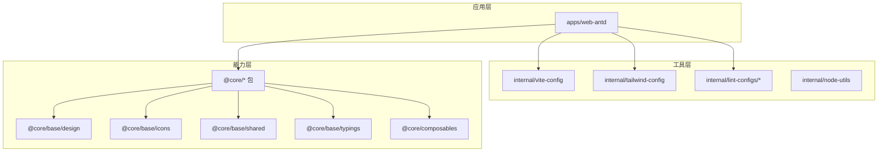
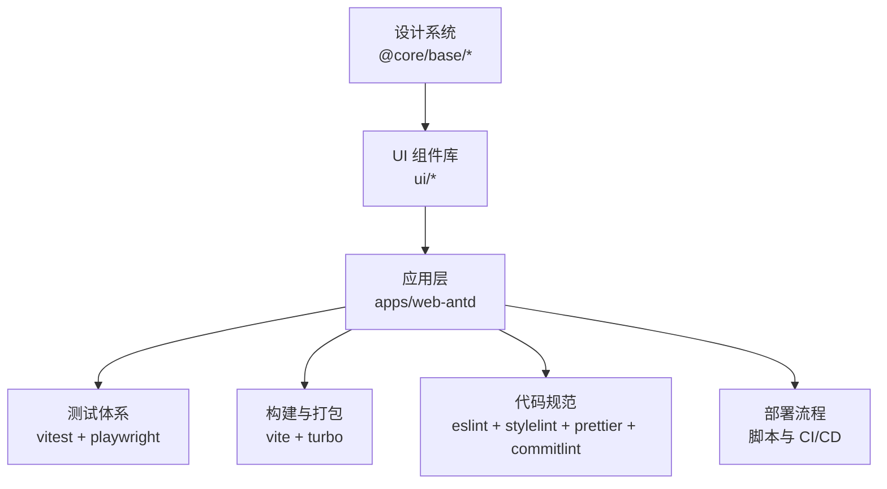
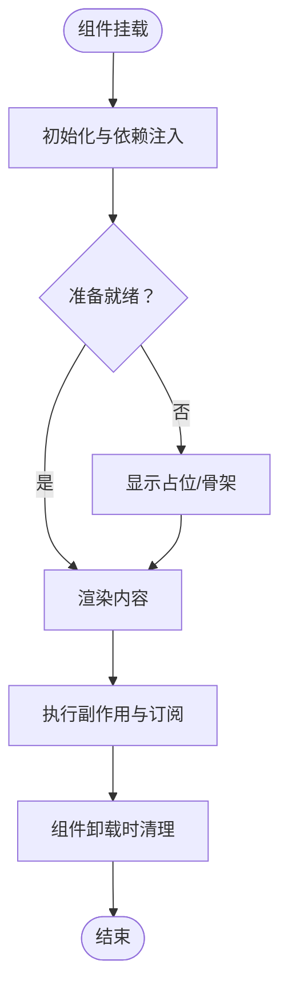
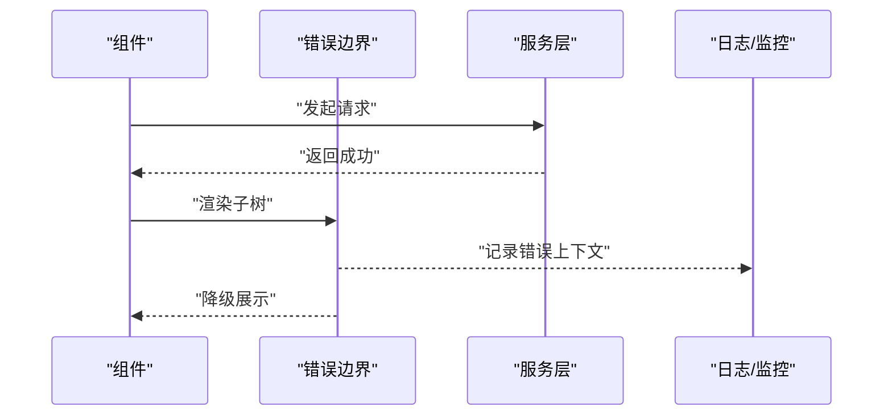
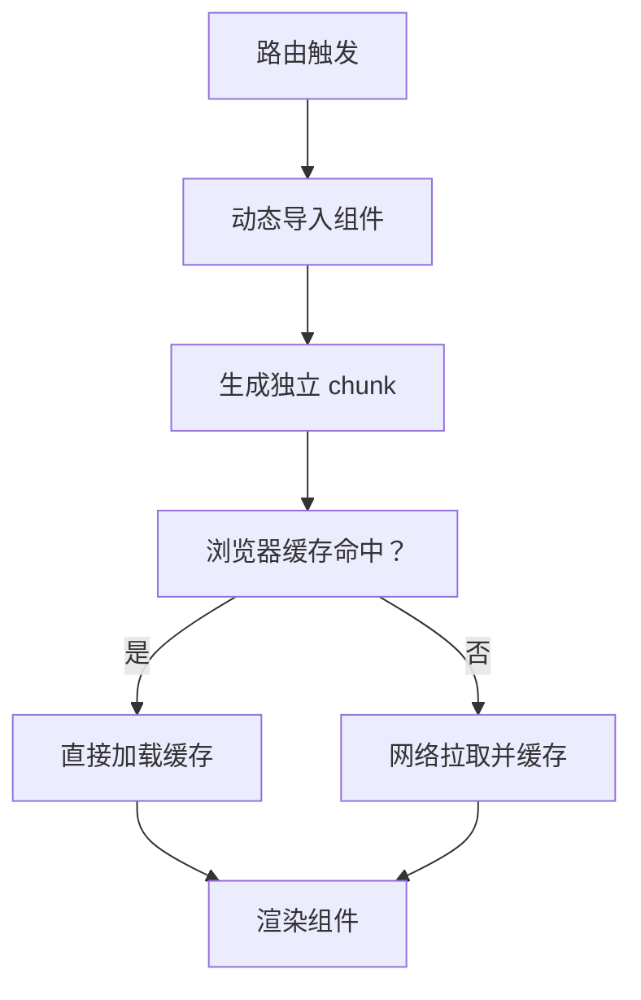
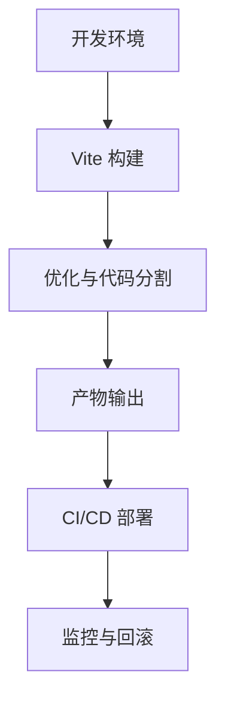
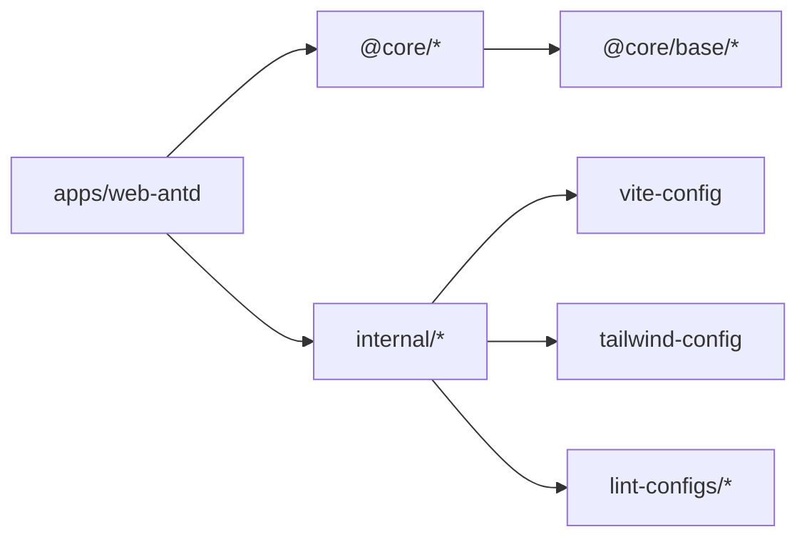

# 组件开发规范

<cite>

**本文引用的文件**
- [package.json](file://frontend/package.json)
- [vitest.config.ts](file://frontend/vitest.config.ts)
- [turbo.json](file://frontend/turbo.json)
- [eslint.config.mjs](file://frontend/eslint.config.mjs)
- [stylelint.config.mjs](file://frontend/stylelint.config.mjs)
- [vite.config.mts](file://frontend/apps/web-antd/vite.config.mts)
- [tailwind.config.mjs](file://frontend/apps/web-antd/tailwind.config.mjs)
- [postcss.config.mjs](file://frontend/apps/web-antd/postcss.config.mjs)
- [playwright.config.ts](file://frontend/apps/web-antd/playwright.config.ts)
- [tsconfig.json](file://frontend/apps/web-antd/tsconfig.json)
- [tsconfig.node.json](file://frontend/apps/web-antd/tsconfig.node.json)
- [vite.config.mts](file://frontend/internal/vite-config/vite.config.mts)
- [tailwind.config.mjs](file://frontend/internal/tailwind-config/tailwind.config.mjs)
- [package.json](file://frontend/internal/vite-config/package.json)
- [package.json](file://frontend/internal/tailwind-config/package.json)
- [package.json](file://frontend/internal/lint-configs/eslint-config/package.json)
- [package.json](file://frontend/internal/lint-configs/stylelint-config/package.json)
- [package.json](file://frontend/internal/lint-configs/prettier-config/package.json)
- [package.json](file://frontend/internal/lint-configs/commitlint-config/package.json)
- [package.json](file://frontend/packages/@core/base/design/package.json)
- [package.json](file://frontend/packages/@core/base/icons/package.json)
- [package.json](file://frontend/packages/@core/base/shared/package.json)
- [package.json](file://frontend/packages/@core/base/typings/package.json)
- [package.json](file://frontend/packages/@core/composables/package.json)
- [package.json](file://frontend/packages/@core/ui/package.json)
- [package.json](file://frontend/packages/@core/utils/package.json)
- [package.json](file://frontend/packages/@core/stores/package.json)
- [package.json](file://frontend/packages/@core/types/package.json)
- [package.json](file://frontend/packages/@core/constants/package.json)
- [package.json](file://frontend/packages/@core/locales/package.json)
- [package.json](file://frontend/packages/@core/styles/package.json)
- [package.json](file://frontend/packages/@core/preferences/package.json)
- [package.json](file://frontend/packages/@core/effects/package.json)
- [package.json](file://frontend/packages/@core/icons/package.json)
</cite>

## 目录
1. [引言](#引言)
2. [项目结构](#项目结构)
3. [核心组件](#核心组件)
4. [架构总览](#架构总览)
5. [详细组件分析](#详细组件分析)
6. [依赖分析](#依赖分析)
7. [性能考虑](#性能考虑)
8. [故障排查指南](#故障排查指南)
9. [结论](#结论)
10. [附录](#附录)

## 引言
本规范面向 NovusAI SaaS 前端团队，定义了组件开发的标准流程与最佳实践，涵盖命名规范、文件组织、导入导出机制、生命周期管理、错误边界与异常捕获、测试策略（单元与集成）、性能优化（懒加载与代码分割）、工具链与构建配置以及部署流程与质量保证检查清单。目标是统一开发体验、提升可维护性与可扩展性，并确保高质量交付。

## 项目结构
前端采用多包工作区（monorepo）结构，以 pnpm + Turbo 为核心进行包管理和任务编排。核心应用位于 apps/web-antd，内部工具与共享能力分布在 internal 与 packages 下，形成“应用层 + 工具层 + 能力层”的分层架构。

图表来源
- [package.json](file://frontend/package.json)
- [turbo.json](file://frontend/turbo.json)
- [vite.config.mts](file://frontend/apps/web-antd/vite.config.mts)
- [tailwind.config.mjs](file://frontend/apps/web-antd/tailwind.config.mjs)

章节来源
- [package.json](file://frontend/package.json)
- [turbo.json](file://frontend/turbo.json)

## 核心组件
- 组件命名规范
  - 文件命名：采用 kebab-case 或 PascalCase，推荐按功能域分目录，如 features/user-profile、ui/button 等。
  - 组件导出：默认导出组件本身，同时提供类型导出；避免在组件内直接引入外部样式或主题变量，通过设计系统统一注入。
  - 类型与常量：类型定义集中于 @core/types，常量集中于 @core/constants，避免散落全局污染。
- 文件组织结构
  - 页面级组件：features/*，包含页面容器、路由守卫、权限控制等。
  - 可复用 UI 组件：ui/*，遵循单一职责，支持组合式与渲染属性模式。
  - 工具与 Hooks：@core/composables、@core/utils，提供状态、副作用、数据流封装。
  - 样式与主题：@core/styles、@core/base/design、tailwind 配置，统一色板、字体、间距、断点。
  - 国际化：@core/locales，按模块拆分语言包，避免大文件。
- 导入导出机制
  - 使用绝对路径别名（如 @core/*、@app/*），减少相对路径层级。
  - 按需导出：组件仅暴露必要 API，避免污染命名空间。
  - 类型与运行时分离：types 与 runtime 分离，避免打包时引入不必要的类型信息。

章节来源
- [package.json](file://frontend/packages/@core/base/design/package.json)
- [package.json](file://frontend/packages/@core/base/icons/package.json)
- [package.json](file://frontend/packages/@core/base/shared/package.json)
- [package.json](file://frontend/packages/@core/base/typings/package.json)
- [package.json](file://frontend/packages/@core/composables/package.json)

## 架构总览
组件开发围绕“设计系统 + 应用层 + 工具链”三层协作展开。设计系统提供一致的视觉与交互基线；应用层聚焦业务场景；工具链保障质量与效率。

图表来源
- [vite.config.mts](file://frontend/apps/web-antd/vite.config.mts)
- [vitest.config.ts](file://frontend/vitest.config.ts)
- [eslint.config.mjs](file://frontend/eslint.config.mjs)
- [stylelint.config.mjs](file://frontend/stylelint.config.mjs)

## 详细组件分析

### 组件生命周期管理
- 初始化阶段
  - 在组件构造或 setup 中完成最小化初始化，避免阻塞首屏。
  - 使用 Suspense 与异步组件实现懒加载，结合骨架屏提升感知性能。
- 运行阶段
  - 通过 composable 封装副作用，确保在组件卸载时正确清理（取消订阅、清除定时器、释放资源）。
  - 对外暴露受控 props 与事件，保持单向数据流。
- 销毁阶段
  - 在 beforeUnmount 或自定义 hook 的清理函数中回收资源，防止内存泄漏。
  - 对于第三方 SDK，确保显式销毁实例。

### 错误边界与异常捕获
- 全局错误边界
  - 在应用入口设置错误边界组件，捕获子树渲染错误并降级展示。
  - 记录错误上下文（组件栈、props、用户操作轨迹），上报至监控系统。
- 局部错误处理
  - 对网络请求、文件上传、第三方服务调用等异步操作，统一包装错误处理逻辑。
  - 提供用户友好的错误提示与重试机制，避免白屏。
- 异常恢复
  - 对可恢复错误（如临时网络波动）自动重试；对不可恢复错误引导用户采取下一步动作。

### 测试策略
- 单元测试
  - 使用 Vitest 进行组件与工具函数的单元测试，覆盖正常分支与边界条件。
  - 对异步逻辑使用 fake timers 与 mock 依赖，确保测试稳定与可重复。
- 集成测试
  - 使用 Playwright 进行端到端测试，覆盖关键用户路径与跨页面交互。
  - 对第三方登录、支付等外部集成，使用沙箱环境或模拟服务。
- 测试覆盖率
  - 为关键模块设定覆盖率阈值，持续改进测试质量。

图表来源
- [vitest.config.ts](file://frontend/vitest.config.ts)
- [playwright.config.ts](file://frontend/apps/web-antd/playwright.config.ts)

章节来源
- [vitest.config.ts](file://frontend/vitest.config.ts)
- [playwright.config.ts](file://frontend/apps/web-antd/playwright.config.ts)

### 性能优化、懒加载与代码分割
- 懒加载
  - 使用动态 import 实现路由级与组件级懒加载，减少首屏体积。
  - 对大型第三方库按需加载，避免捆绑到主包。
- 代码分割
  - 基于路由与页面拆分 chunks，利用浏览器缓存与并行下载。
  - 对公共依赖进行 vendor 抽离，提升二次加载速度。
- 运行时优化
  - 合理使用虚拟列表、滚动节流与防抖，降低主线程压力。
  - 图片与媒体资源使用现代格式与懒加载策略。

图表来源
- [vite.config.mts](file://frontend/apps/web-antd/vite.config.mts)
- [vite.config.mts](file://frontend/internal/vite-config/vite.config.mts)

### 工具链、构建配置与部署流程
- 工具链
  - 代码规范：ESLint、Stylelint、Prettier、Commitlint，统一风格与提交规范。
  - 类型检查：TypeScript 配置与严格模式，确保类型安全。
  - 构建工具：Vite 提供快速开发与高效打包；Turbo 管理 monorepo 任务。
- 构建配置
  - 开发：启用热更新、Source Map、调试工具；按需开启严格模式。
  - 生产：启用压缩、Tree Shaking、资源内联阈值优化、HTTP/2 多路复用友好。
- 部署流程
  - 本地构建产物后，通过 CI/CD 自动化部署至预发布与生产环境。
  - 部署前执行静态扫描、安全检查与性能基准对比。

图表来源
- [vite.config.mts](file://frontend/apps/web-antd/vite.config.mts)
- [eslint.config.mjs](file://frontend/eslint.config.mjs)
- [stylelint.config.mjs](file://frontend/stylelint.config.mjs)
- [turbo.json](file://frontend/turbo.json)

章节来源
- [vite.config.mts](file://frontend/apps/web-antd/vite.config.mts)
- [tsconfig.json](file://frontend/apps/web-antd/tsconfig.json)
- [tsconfig.node.json](file://frontend/apps/web-antd/tsconfig.node.json)
- [eslint.config.mjs](file://frontend/eslint.config.mjs)
- [stylelint.config.mjs](file://frontend/stylelint.config.mjs)
- [turbo.json](file://frontend/turbo.json)

## 依赖分析
- 包依赖关系
  - 应用层依赖 @core 能力包与内部工具包；@core 内部再依赖基础设计与共享模块。
  - 工具链包（vite-config、tailwind-config、lint-configs）被应用层统一引用，确保一致性。
- 版本与锁定
  - 使用 pnpm workspace 与锁定文件，确保依赖版本一致与可重现构建。
- 循环依赖规避
  - 通过清晰的分层与接口抽象，避免包间循环依赖；必要时使用工厂或依赖注入。

图表来源
- [package.json](file://frontend/package.json)
- [package.json](file://frontend/internal/vite-config/package.json)
- [package.json](file://frontend/internal/tailwind-config/package.json)
- [package.json](file://frontend/internal/lint-configs/eslint-config/package.json)

章节来源
- [package.json](file://frontend/package.json)

## 性能考虑
- 首屏性能
  - 控制初始包大小，优先加载关键路径资源；非关键功能延迟加载。
  - 使用骨架屏与渐进增强，改善感知性能。
- 交互性能
  - 避免长任务阻塞主线程；使用 Web Workers 处理计算密集型任务。
  - 合理使用虚拟化与分页，减少 DOM 节点数量。
- 缓存与网络
  - 利用 HTTP 缓存与 CDN；对静态资源启用长期缓存策略。
  - 对 API 请求进行去重与合并，减少无效请求。

## 故障排查指南
- 常见问题定位
  - 构建失败：检查 TypeScript 报错、ESLint 规则冲突、Vite 插件配置。
  - 运行时错误：查看错误边界日志、浏览器控制台堆栈、网络面板。
  - 性能瓶颈：使用性能分析工具定位慢查询、内存泄漏与重绘重排。
- 回滚与修复
  - 部署失败时启用蓝绿/金丝雀发布策略，快速回滚至上一稳定版本。
  - 对于已知缺陷，先在预发布验证修复，再灰度到生产。

章节来源
- [vitest.config.ts](file://frontend/vitest.config.ts)
- [playwright.config.ts](file://frontend/apps/web-antd/playwright.config.ts)

## 结论
通过统一的组件开发规范与完善的工具链，NovusAI SaaS 前端能够实现高一致性、高可维护性与高性能的交付。建议在团队内定期回顾与更新规范，结合实际业务演进持续优化流程与工具。

## 附录
- 组件开发检查清单
  - 命名与组织：是否符合命名规范与目录结构？
  - 导入导出：是否使用别名与按需导出？
  - 生命周期：是否正确初始化与清理资源？
  - 错误处理：是否覆盖异常路径并提供用户反馈？
  - 测试：是否具备单元与集成测试覆盖？
  - 性能：是否采用懒加载与代码分割？
  - 工具链：是否通过 ESLint、Stylelint、Prettier、Commitlint？
  - 构建与部署：是否通过本地构建与 CI/CD 流程？