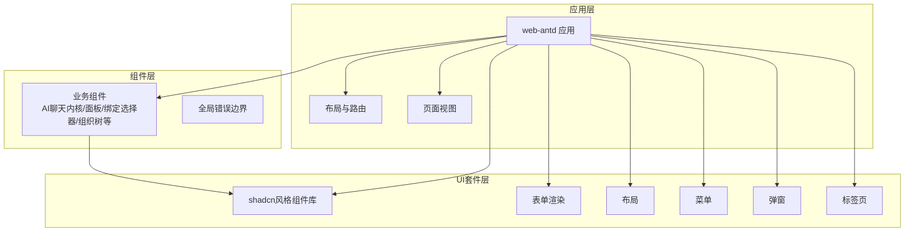
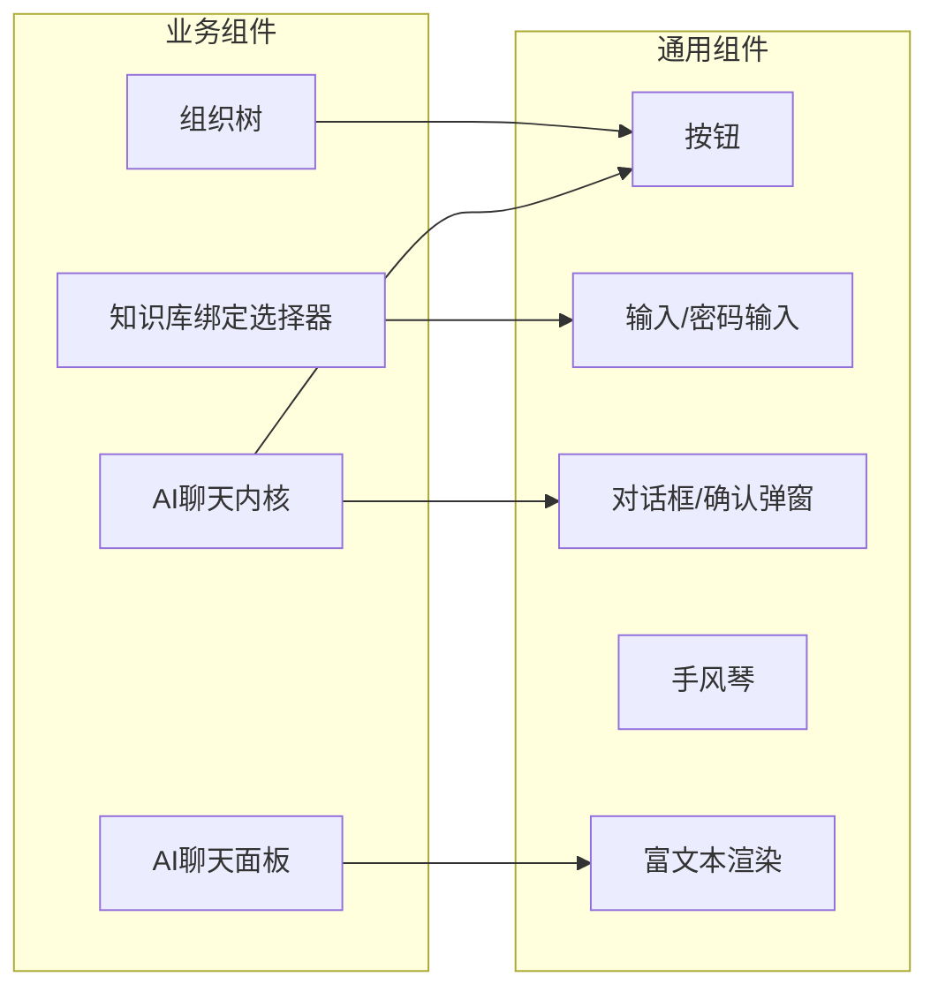
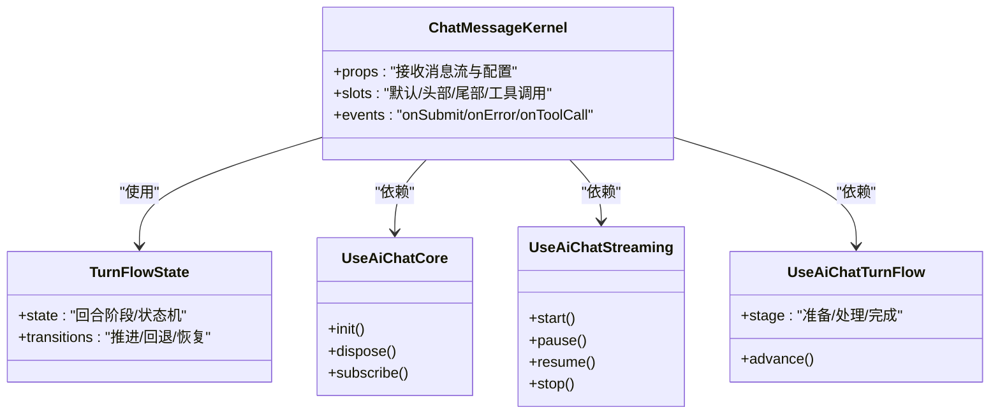
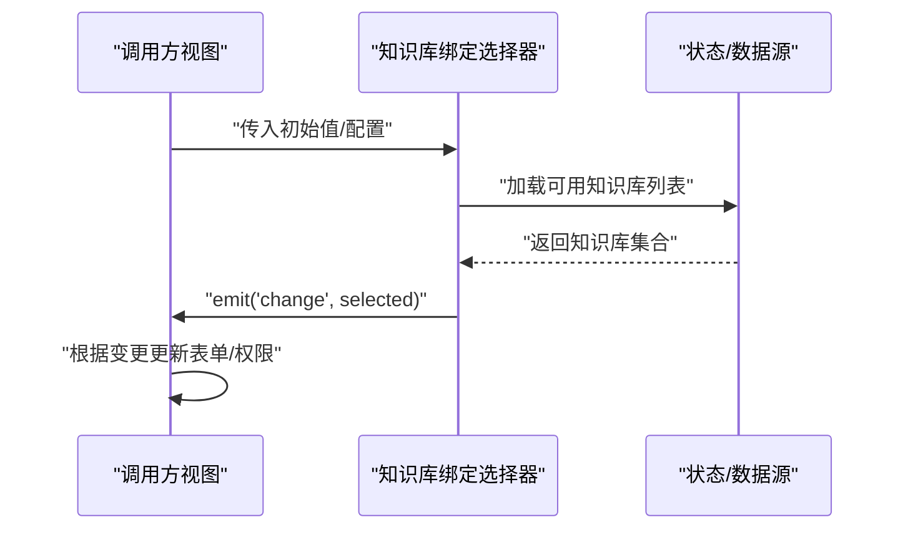
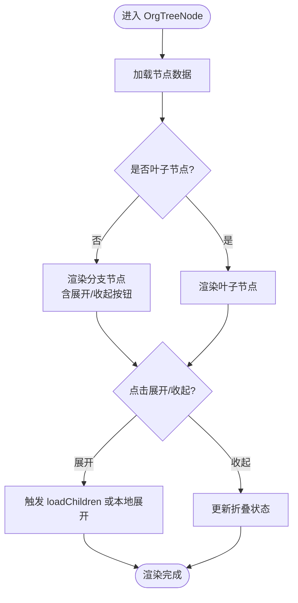
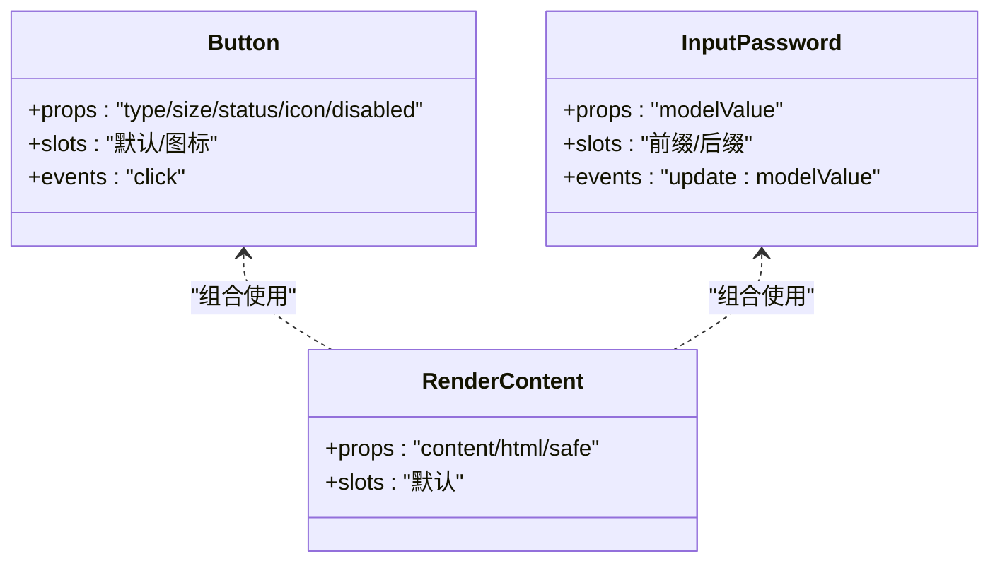
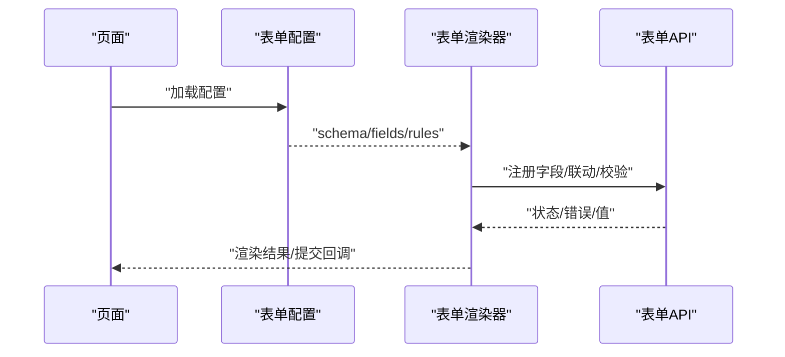
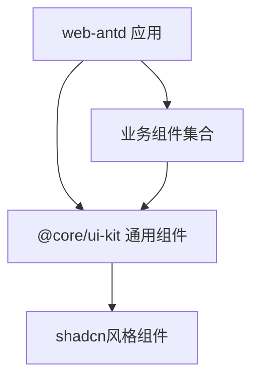

# 组件系统

<cite>
**本文引用的文件**
- [AppErrorBoundary.vue](file://frontend/apps/web-antd/src/components/AppErrorBoundary.vue)
- [AgentKnowledgeBaseBindingPicker.vue](file://frontend/apps/web-antd/src/components/business/agent-kb-binding-picker/AgentKnowledgeBaseBindingPicker.vue)
- [AgentProfilePopover.vue](file://frontend/apps/web-antd/src/components/business/agent-profile-popover/AgentProfilePopover.vue)
- [AgentRoutingTab.vue](file://frontend/apps/web-antd/src/components/business/agent-routing-tab/AgentRoutingTab.vue)
- [AgentSkillBindingPicker.vue](file://frontend/apps/web-antd/src/components/business/agent-skill-binding-picker/AgentSkillBindingPicker.vue)
- [ChatMessageKernel.vue](file://frontend/apps/web-antd/src/components/business/ai-chat-kernel/ChatMessageKernel.vue)
- [TurnFlowState.ts](file://frontend/apps/web-antd/src/components/business/ai-chat-kernel/TurnFlowState.ts)
- [turn-stage-presentation.ts](file://frontend/apps/web-antd/src/components/business/ai-chat-kernel/turn-stage-presentation.ts)
- [index.ts](file://frontend/apps/web-antd/src/components/business/ai-chat-kernel/index.ts)
- [use-ai-chat-core.ts](file://frontend/apps/web-antd/src/components/business/ai-chat-kernel/use-ai-chat-core.ts)
- [use-ai-chat-streaming.ts](file://frontend/apps/web-antd/src/components/business/ai-chat-kernel/use-ai-chat-streaming.ts)
- [use-ai-chat-turn-flow.ts](file://frontend/apps/web-antd/src/components/business/ai-chat-kernel/use-ai-chat-turn-flow.ts)
- [chat-message-turn-flow.ts](file://frontend/apps/web-antd/src/components/business/ai-chat-panel/chat-message-turn-flow.ts)
- [use-ai-chat-conversations.ts](file://frontend/apps/web-antd/src/components/business/ai-chat-panel/use-ai-chat-conversations.ts)
- [use-ai-chat-core-actions.ts](file://frontend/apps/web-antd/src/components/business/ai-chat-panel/use-ai-chat-core-actions.ts)
- [use-ai-chat-streaming-request.ts](file://frontend/apps/web-antd/src/components/business/ai-chat-panel/use-ai-chat-streaming-request.ts)
- [use-ai-chat-streaming.ts](file://frontend/apps/web-antd/src/components/business/ai-chat-panel/use-ai-chat-streaming.ts)
- [use-ai-chat-variables.ts](file://frontend/apps/web-antd/src/components/business/ai-chat-panel/use-ai-chat-variables.ts)
- [types.ts](file://frontend/apps/web-antd/src/components/business/ai-chat-panel/types.ts)
- [index.ts](file://frontend/apps/web-antd/src/components/business/ai-chat-panel/index.ts)
- [OrgTreeNode.vue](file://frontend/apps/web-antd/src/components/business/org-tree/OrgTreeNode.vue)
- [avatar.vue](file://frontend/packages/@core/ui-kit/shadcn-ui/src/components/avatar/avatar.vue)
- [button.vue](file://frontend/packages/@core/ui-kit/shadcn-ui/src/components/button/button.vue)
- [input-password.vue](file://frontend/packages/@core/ui-kit/shadcn-ui/src/components/input-password/input-password.vue)
- [render-content.vue](file://frontend/packages/@core/ui-kit/shadcn-ui/src/components/render-content/render-content.vue)
- [Accordion.vue](file://frontend/packages/@core/ui-kit/shadcn-ui/src/ui/accordion/Accordion.vue)
- [AlertDialog.vue](file://frontend/packages/@core/ui-kit/shadcn-ui/src/ui/alert-dialog/AlertDialog.vue)
- [index.ts](file://frontend/packages/@core/ui-kit/shadcn-ui/src/index.ts)
- [index.ts](file://frontend/apps/web-antd/src/components/index.ts)
- [main.ts](file://frontend/apps/web-antd/src/main.ts)
- [app.vue](file://frontend/apps/web-antd/src/app.vue)
- [vite.config.mts](file://frontend/apps/web-antd/src/vite.config.mts)
- [tailwind.config.mjs](file://frontend/apps/web-antd/src/tailwind.config.mjs)
- [postcss.config.mjs](file://frontend/apps/web-antd/src/postcss.config.mjs)
- [package.json](file://frontend/apps/web-antd/src/package.json)
- [index.ts](file://frontend/packages/@core/ui-kit/form-ui/src/index.ts)
- [form-render/index.ts](file://frontend/packages/@core/ui-kit/form-ui/src/form-render/index.ts)
- [form-api.ts](file://frontend/packages/@core/ui-kit/form-ui/src/form-api.ts)
- [config.ts](file://frontend/packages/@core/ui-kit/form-ui/src/config.ts)
- [layout-ui/index.ts](file://frontend/packages/@core/ui-kit/layout-ui/src/index.ts)
- [menu-ui/index.ts](file://frontend/packages/@core/ui-kit/menu-ui/src/index.ts)
- [popup-ui/index.ts](file://frontend/packages/@core/ui-kit/popup-ui/src/index.ts)
- [tabs-ui/index.ts](file://frontend/packages/@core/ui-kit/tabs-ui/src/index.ts)
- [README.md](file://frontend/packages/@core/ui-kit/README.md)
- [README.md](file://frontend/packages/@core/README.md)
</cite>

## 目录
1. [引言](#引言)
2. [项目结构](#项目结构)
3. [核心组件](#核心组件)
4. [架构总览](#架构总览)
5. [详细组件分析](#详细组件分析)
6. [依赖分析](#依赖分析)
7. [性能考虑](#性能考虑)
8. [故障排查指南](#故障排查指南)
9. [结论](#结论)
10. [附录](#附录)

## 引言
本文件面向 NovusAI SaaS 的前端 Vue.js 组件系统，系统性梳理业务组件、通用组件与适配器组件的分类体系，阐明命名规范、文件组织结构与导入导出机制；总结属性传递、事件处理与插槽使用模式；阐述复用策略、继承关系与组合模式；并给出 Ant Design Vue 封装方案、自定义组件设计原则与样式定制方法，以及开发规范、测试策略与性能优化建议。

## 项目结构
前端采用多包（monorepo）与应用分层相结合的组织方式：
- 应用层：apps/web-antd 提供 Web 端主应用，包含页面视图、布局、路由、状态管理等。
- 组件层：apps/web-antd/src/components 下按领域划分业务组件（如 AI 聊天内核与面板、组织树等），并提供全局错误边界组件。
- UI 套件层：packages/@core/ui-kit 提供基于 shadcn/ui 风格的通用 UI 组件库，覆盖基础控件、表单渲染、布局、菜单、弹窗、标签页等。
- 核心能力层：packages/@core/base、composables、preferences 等提供设计系统、图标、共享工具与偏好设置等基础设施。

图表来源
- [main.ts](file://frontend/apps/web-antd/src/main.ts)
- [app.vue](file://frontend/apps/web-antd/src/app.vue)
- [index.ts](file://frontend/apps/web-antd/src/components/index.ts)
- [index.ts](file://frontend/packages/@core/ui-kit/shadcn-ui/src/index.ts)
- [README.md](file://frontend/packages/@core/ui-kit/README.md)

章节来源
- [main.ts](file://frontend/apps/web-antd/src/main.ts)
- [app.vue](file://frontend/apps/web-antd/src/app.vue)
- [index.ts](file://frontend/apps/web-antd/src/components/index.ts)
- [index.ts](file://frontend/packages/@core/ui-kit/shadcn-ui/src/index.ts)

## 核心组件
本节聚焦三类组件的职责与协作：
- 业务组件：围绕具体业务域构建，如 AI 聊天内核与面板、知识库绑定选择器、组织树等。
- 通用组件：跨业务可复用的基础 UI 组件，来自 shadcn 风格 UI 套件。
- 适配器组件：对第三方 UI 框架或库进行封装，统一接口与风格，便于替换与迁移。

通用组件示例（来自 shadcn 风格 UI 套件）：
- 基础控件：按钮、输入、密码输入、头像、滚动条、分割段、下拉菜单、上下文菜单、气泡卡片、提示、全屏、返回顶部、计数动画、面包屑等。
- 复合组件：对话框、确认弹窗、手风琴、卡片、徽章、数字字段、分页、针叶输入、标签页、切换开关、可调整大小区域、滚动区域、选择器、分隔符、表格等。

章节来源
- [avatar.vue](file://frontend/packages/@core/ui-kit/shadcn-ui/src/components/avatar/avatar.vue)
- [button.vue](file://frontend/packages/@core/ui-kit/shadcn-ui/src/components/button/button.vue)
- [input-password.vue](file://frontend/packages/@core/ui-kit/shadcn-ui/src/components/input-password/input-password.vue)
- [render-content.vue](file://frontend/packages/@core/ui-kit/shadcn-ui/src/components/render-content/render-content.vue)
- [Accordion.vue](file://frontend/packages/@core/ui-kit/shadcn-ui/src/ui/accordion/Accordion.vue)
- [AlertDialog.vue](file://frontend/packages/@core/ui-kit/shadcn-ui/src/ui/alert-dialog/AlertDialog.vue)
- [README.md](file://frontend/packages/@core/ui-kit/README.md)

## 架构总览
组件系统遵循“业务组件 + 通用组件 + 适配器”的分层架构：
- 业务组件通过组合通用组件实现一致的交互与视觉体验。
- 通用组件以细粒度、高内聚的方式提供能力，支持主题与样式定制。
- 适配器组件负责对接外部框架（如对 Ant Design Vue 的封装），屏蔽差异，保持上层调用一致性。

图表来源
- [ChatMessageKernel.vue](file://frontend/apps/web-antd/src/components/business/ai-chat-kernel/ChatMessageKernel.vue)
- [AgentKnowledgeBaseBindingPicker.vue](file://frontend/apps/web-antd/src/components/business/agent-kb-binding-picker/AgentKnowledgeBaseBindingPicker.vue)
- [OrgTreeNode.vue](file://frontend/apps/web-antd/src/components/business/org-tree/OrgTreeNode.vue)
- [button.vue](file://frontend/packages/@core/ui-kit/shadcn-ui/src/components/button/button.vue)
- [input-password.vue](file://frontend/packages/@core/ui-kit/shadcn-ui/src/components/input-password/input-password.vue)
- [render-content.vue](file://frontend/packages/@core/ui-kit/shadcn-ui/src/components/render-content/render-content.vue)
- [Accordion.vue](file://frontend/packages/@core/ui-kit/shadcn-ui/src/ui/accordion/Accordion.vue)
- [AlertDialog.vue](file://frontend/packages/@core/ui-kit/shadcn-ui/src/ui/alert-dialog/AlertDialog.vue)

## 详细组件分析

### 业务组件：AI 聊天内核与面板
AI 聊天内核与面板是核心业务组件，承担消息流转、工具调用、证据展示、转场控制等职责。其内部通过多个 composable 进行状态与行为分离，形成清晰的职责边界与可测试性。

图表来源
- [ChatMessageKernel.vue](file://frontend/apps/web-antd/src/components/business/ai-chat-kernel/ChatMessageKernel.vue)
- [TurnFlowState.ts](file://frontend/apps/web-antd/src/components/business/ai-chat-kernel/TurnFlowState.ts)
- [use-ai-chat-core.ts](file://frontend/apps/web-antd/src/components/business/ai-chat-kernel/use-ai-chat-core.ts)
- [use-ai-chat-streaming.ts](file://frontend/apps/web-antd/src/components/business/ai-chat-kernel/use-ai-chat-streaming.ts)
- [use-ai-chat-turn-flow.ts](file://frontend/apps/web-antd/src/components/business/ai-chat-kernel/use-ai-chat-turn-flow.ts)

章节来源
- [ChatMessageKernel.vue](file://frontend/apps/web-antd/src/components/business/ai-chat-kernel/ChatMessageKernel.vue)
- [TurnFlowState.ts](file://frontend/apps/web-antd/src/components/business/ai-chat-kernel/TurnFlowState.ts)
- [index.ts](file://frontend/apps/web-antd/src/components/business/ai-chat-kernel/index.ts)
- [use-ai-chat-core.ts](file://frontend/apps/web-antd/src/components/business/ai-chat-kernel/use-ai-chat-core.ts)
- [use-ai-chat-streaming.ts](file://frontend/apps/web-antd/src/components/business/ai-chat-kernel/use-ai-chat-streaming.ts)
- [use-ai-chat-turn-flow.ts](file://frontend/apps/web-antd/src/components/business/ai-chat-kernel/use-ai-chat-turn-flow.ts)

### 业务组件：知识库绑定选择器
该组件用于在智能体与知识库之间建立绑定关系，提供选择、预览与校验能力。其设计强调可组合性与可扩展性，便于在不同页面复用。

图表来源
- [AgentKnowledgeBaseBindingPicker.vue](file://frontend/apps/web-antd/src/components/business/agent-kb-binding-picker/AgentKnowledgeBaseBindingPicker.vue)

章节来源
- [AgentKnowledgeBaseBindingPicker.vue](file://frontend/apps/web-antd/src/components/business/agent-kb-binding-picker/AgentKnowledgeBaseBindingPicker.vue)

### 业务组件：组织树节点
组织树节点组件负责渲染树形结构、展开/收起、选中态与操作入口。通过 props 传递数据模型，通过事件向上反馈用户操作。

图表来源
- [OrgTreeNode.vue](file://frontend/apps/web-antd/src/components/business/org-tree/OrgTreeNode.vue)

章节来源
- [OrgTreeNode.vue](file://frontend/apps/web-antd/src/components/business/org-tree/OrgTreeNode.vue)

### 通用组件：按钮与输入类
通用组件以细粒度、可组合的方式提供一致的交互体验。按钮组件支持多种尺寸、状态与图标变体；密码输入组件提供强度指示与可见性切换；富文本渲染组件支持安全的 HTML 渲染与扩展。

图表来源
- [button.vue](file://frontend/packages/@core/ui-kit/shadcn-ui/src/components/button/button.vue)
- [input-password.vue](file://frontend/packages/@core/ui-kit/shadcn-ui/src/components/input-password/input-password.vue)
- [render-content.vue](file://frontend/packages/@core/ui-kit/shadcn-ui/src/components/render-content/render-content.vue)

章节来源
- [button.vue](file://frontend/packages/@core/ui-kit/shadcn-ui/src/components/button/button.vue)
- [input-password.vue](file://frontend/packages/@core/ui-kit/shadcn-ui/src/components/input-password/input-password.vue)
- [render-content.vue](file://frontend/packages/@core/ui-kit/shadcn-ui/src/components/render-content/render-content.vue)

### 适配器组件：表单渲染与配置
表单渲染组件将配置驱动的表单项映射为实际 UI，支持复杂布局与联动逻辑。通过配置中心与表单 API 实现声明式表单构建。

图表来源
- [index.ts](file://frontend/packages/@core/ui-kit/form-ui/src/form-render/index.ts)
- [form-api.ts](file://frontend/packages/@core/ui-kit/form-ui/src/form-api.ts)
- [config.ts](file://frontend/packages/@core/ui-kit/form-ui/src/config.ts)

章节来源
- [index.ts](file://frontend/packages/@core/ui-kit/form-ui/src/index.ts)
- [index.ts](file://frontend/packages/@core/ui-kit/form-ui/src/form-render/index.ts)
- [form-api.ts](file://frontend/packages/@core/ui-kit/form-ui/src/form-api.ts)
- [config.ts](file://frontend/packages/@core/ui-kit/form-ui/src/config.ts)

## 依赖分析
组件系统的依赖关系呈现“应用 -> 业务组件 -> 通用组件”的单向依赖，避免循环依赖，提升可维护性与可测试性。

图表来源
- [main.ts](file://frontend/apps/web-antd/src/main.ts)
- [index.ts](file://frontend/apps/web-antd/src/components/index.ts)
- [index.ts](file://frontend/packages/@core/ui-kit/shadcn-ui/src/index.ts)

章节来源
- [main.ts](file://frontend/apps/web-antd/src/main.ts)
- [index.ts](file://frontend/apps/web-antd/src/components/index.ts)
- [index.ts](file://frontend/packages/@core/ui-kit/shadcn-ui/src/index.ts)

## 性能考虑
- 组件拆分与懒加载：将大型业务组件按功能拆分为更小单元，结合路由级懒加载减少首屏体积。
- 渲染优化：利用虚拟滚动、分页与增量渲染处理大量列表；对富文本渲染组件启用白名单与最小化 DOM 更新。
- 状态管理：将长生命周期状态下沉至 composable，避免重复订阅与内存泄漏；合理使用缓存与去抖。
- 样式与资源：统一使用 Tailwind 与 PostCSS，按需引入组件样式，避免全局污染；图片与媒体资源采用懒加载与压缩。
- 打包与构建：Vite 构建时开启代码分割与 Tree Shaking；生产环境启用压缩与资源指纹。

## 故障排查指南
- 全局错误边界：应用层提供全局错误边界组件，捕获并上报未处理异常，避免整页崩溃。
- 业务组件调试：AI 聊天内核与面板通过 composable 分离状态与副作用，便于单元测试与问题定位。
- 通用组件验证：按钮、输入、密码输入等通用组件提供明确的 props 与事件契约，便于快速定位调用方问题。
- 适配器组件：表单渲染与配置组件通过配置中心与 API 解耦，优先检查配置与联动规则。

章节来源
- [AppErrorBoundary.vue](file://frontend/apps/web-antd/src/components/AppErrorBoundary.vue)

## 结论
NovusAI SaaS 的组件系统以“业务组件 + 通用组件 + 适配器”为核心架构，通过细粒度拆分、配置驱动与组合模式实现了高内聚、低耦合与强复用。配合统一的设计系统与样式体系，确保了跨业务的一致性与可维护性。建议持续完善测试策略与性能监控，保障在复杂业务场景下的稳定性与用户体验。

## 附录

### 命名规范与文件组织
- 文件命名：组件文件采用 PascalCase，模块导出文件使用 index.ts，类型定义文件使用 types.ts。
- 目录组织：业务组件按领域划分（如 ai-chat-kernel、ai-chat-panel、agent-kb-binding-picker、org-tree），通用组件位于 @core/ui-kit 下的 components 与 ui 子目录。
- 导入导出：各模块通过 index.ts 暴露统一入口，便于按需引入与 Tree Shaking。

章节来源
- [AgentKnowledgeBaseBindingPicker.vue](file://frontend/apps/web-antd/src/components/business/agent-kb-binding-picker/AgentKnowledgeBaseBindingPicker.vue)
- [AgentProfilePopover.vue](file://frontend/apps/web-antd/src/components/business/agent-profile-popover/AgentProfilePopover.vue)
- [AgentRoutingTab.vue](file://frontend/apps/web-antd/src/components/business/agent-routing-tab/AgentRoutingTab.vue)
- [AgentSkillBindingPicker.vue](file://frontend/apps/web-antd/src/components/business/agent-skill-binding-picker/AgentSkillBindingPicker.vue)
- [index.ts](file://frontend/apps/web-antd/src/components/business/ai-chat-kernel/index.ts)
- [index.ts](file://frontend/apps/web-antd/src/components/business/ai-chat-panel/index.ts)
- [index.ts](file://frontend/packages/@core/ui-kit/shadcn-ui/src/index.ts)

### 属性传递、事件处理与插槽使用
- 属性传递：组件通过 props 接收数据与配置，尽量使用只读与受控模式，避免隐式状态。
- 事件处理：通过 emit 触发上层回调，约定事件命名与载荷格式，保证一致性。
- 插槽使用：提供具名插槽与作用域插槽，满足灵活定制需求，同时保持默认渲染。

章节来源
- [ChatMessageKernel.vue](file://frontend/apps/web-antd/src/components/business/ai-chat-kernel/ChatMessageKernel.vue)
- [OrgTreeNode.vue](file://frontend/apps/web-antd/src/components/business/org-tree/OrgTreeNode.vue)

### 复用策略、继承关系与组合模式
- 复用策略：将通用能力抽象为 composable 与通用组件，业务组件通过组合实现差异化。
- 继承关系：Vue 组件间通过 props/emit/composition API 组合，避免深层继承链。
- 组合模式：以“容器 + 表达式”的方式组织复杂界面，提高可测试性与可维护性。

章节来源
- [use-ai-chat-core.ts](file://frontend/apps/web-antd/src/components/business/ai-chat-kernel/use-ai-chat-core.ts)
- [use-ai-chat-streaming.ts](file://frontend/apps/web-antd/src/components/business/ai-chat-kernel/use-ai-chat-streaming.ts)
- [use-ai-chat-turn-flow.ts](file://frontend/apps/web-antd/src/components/business/ai-chat-kernel/use-ai-chat-turn-flow.ts)

### Ant Design Vue 封装方案
- 封装目标：统一 API、事件与插槽命名，对齐现有组件契约；提供主题变量与样式覆盖。
- 设计原则：最小侵入、可替换、可降级；保留原生能力的同时提供增强。
- 样式定制：通过 CSS 变量与 Tailwind 自定义类名实现主题化；避免深度选择器污染。

章节来源
- [README.md](file://frontend/packages/@core/ui-kit/README.md)
- [README.md](file://frontend/packages/@core/README.md)

### 开发规范与测试策略
- 开发规范：遵循组件命名、文件组织与导入导出规范；统一使用 TypeScript；严格约束 props 与事件。
- 测试策略：为业务组件与通用组件编写单元测试与快照测试；对关键流程（如聊天内核）进行端到端测试与回归测试。
- 性能优化：结合构建分析与运行时性能监控，持续优化渲染与网络请求。

章节来源
- [vite.config.mjs](file://frontend/apps/web-antd/src/vite.config.mts)
- [tailwind.config.mjs](file://frontend/apps/web-antd/src/tailwind.config.mjs)
- [postcss.config.mjs](file://frontend/apps/web-antd/src/postcss.config.mjs)
- [package.json](file://frontend/apps/web-antd/src/package.json)