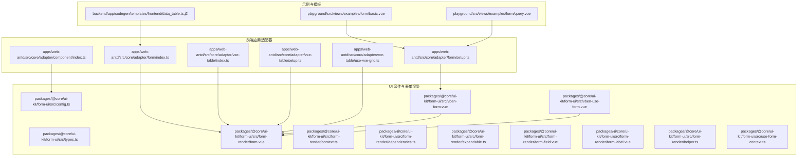
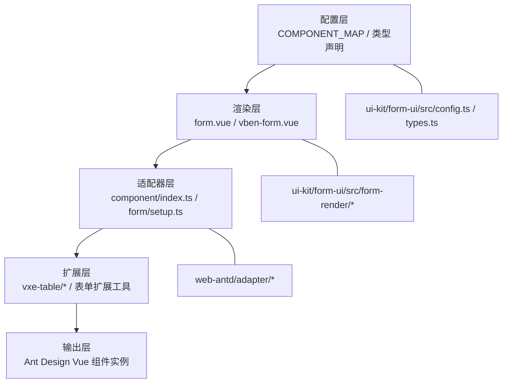
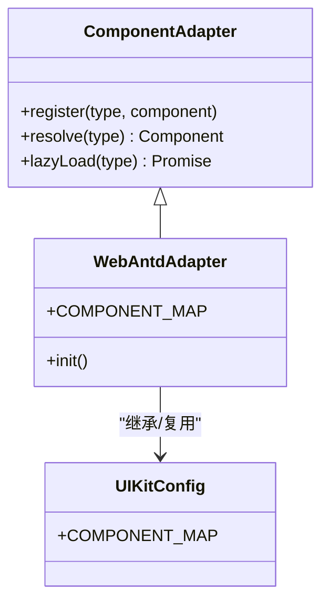
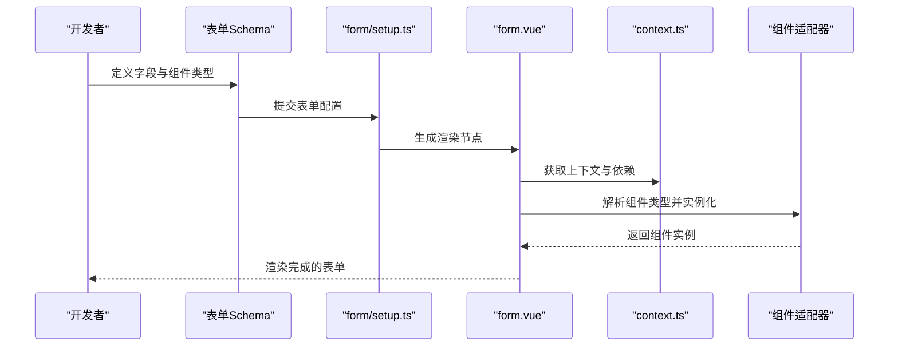
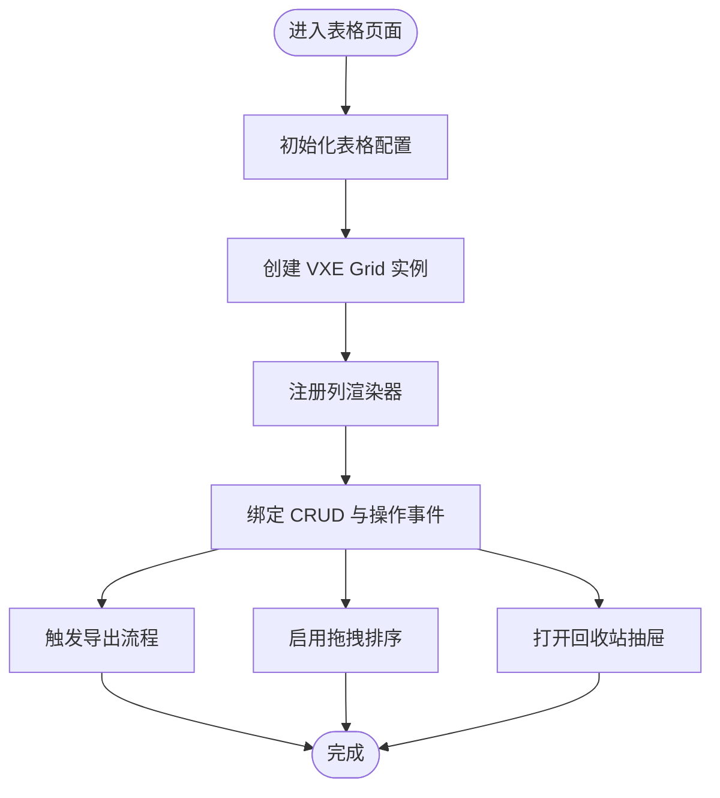
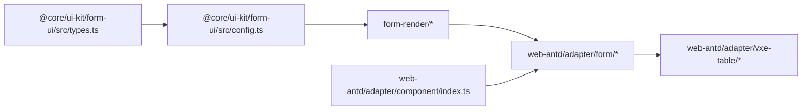

# 适配器组件

<cite>
**本文引用的文件**
- [frontend/apps/web-antd/src/core/adapter/component/index.ts](file://frontend/apps/web-antd/src/core/adapter/component/index.ts)
- [frontend/apps/web-antd/src/core/adapter/form/index.ts](file://frontend/apps/web-antd/src/core/adapter/form/index.ts)
- [frontend/apps/web-antd/src/core/adapter/form/setup.ts](file://frontend/apps/web-antd/src/core/adapter/form/setup.ts)
- [frontend/apps/web-antd/src/core/adapter/vxe-table/index.ts](file://frontend/apps/web-antd/src/core/adapter/vxe-table/index.ts)
- [frontend/apps/web-antd/src/core/adapter/vxe-table/setup.ts](file://frontend/apps/web-antd/src/core/adapter/vxe-table/setup.ts)
- [frontend/apps/web-antd/src/core/adapter/vxe-table/use-vxe-grid.ts](file://frontend/apps/web-antd/src/core/adapter/vxe-table/use-vxe-grid.ts)
- [frontend/packages/@core/ui-kit/form-ui/src/config.ts](file://frontend/packages/@core/ui-kit/form-ui/src/config.ts)
- [frontend/packages/@core/ui-kit/form-ui/src/types.ts](file://frontend/packages/@core/ui-kit/form-ui/src/types.ts)
- [frontend/packages/@core/ui-kit/form-ui/src/form-render/form.vue](file://frontend/packages/@core/ui-kit/form-ui/src/form-render/form.vue)
- [frontend/packages/@core/ui-kit/form-ui/src/form-render/context.ts](file://frontend/packages/@core/ui-kit/form-ui/src/form-render/context.ts)
- [frontend/packages/@core/ui-kit/form-ui/src/form-render/dependencies.ts](file://frontend/packages/@core/ui-kit/form-ui/src/form-render/dependencies.ts)
- [frontend/packages/@core/ui-kit/form-ui/src/form-render/expandable.ts](file://frontend/packages/@core/ui-kit/form-ui/src/form-render/expandable.ts)
- [frontend/packages/@core/ui-kit/form-ui/src/form-render/form-field.vue](file://frontend/packages/@core/ui-kit/form-ui/src/form-render/form-field.vue)
- [frontend/packages/@core/ui-kit/form-ui/src/form-render/form-label.vue](file://frontend/packages/@core/ui-kit/form-ui/src/form-render/form-label.vue)
- [frontend/packages/@core/ui-kit/form-ui/src/form-render/helper.ts](file://frontend/packages/@core/ui-kit/form-ui/src/form-render/helper.ts)
- [frontend/packages/@core/ui-kit/form-ui/src/use-form-context.ts](file://frontend/packages/@core/ui-kit/form-ui/src/use-form-context.ts)
- [frontend/packages/@core/ui-kit/form-ui/src/vben-form.vue](file://frontend/packages/@core/ui-kit/form-ui/src/vben-form.vue)
- [frontend/packages/@core/ui-kit/form-ui/src/vben-use-form.vue](file://frontend/packages/@core/ui-kit/form-ui/src/vben-use-form.vue)
- [frontend/playground/src/views/examples/form/basic.vue](file://frontend/playground/src/views/examples/form/basic.vue)
- [frontend/playground/src/views/examples/form/query.vue](file://frontend/playground/src/views/examples/form/query.vue)
- [backend/app/codegen/templates/frontend/data_table.ts.j2](file://backend/app/codegen/templates/frontend/data_table.ts.j2)
</cite>

## 目录
1. [引言](#引言)
2. [项目结构](#项目结构)
3. [核心组件](#核心组件)
4. [架构总览](#架构总览)
5. [详细组件分析](#详细组件分析)
6. [依赖关系分析](#依赖关系分析)
7. [性能考量](#性能考量)
8. [故障排除指南](#故障排除指南)
9. [结论](#结论)
10. [附录](#附录)

## 引言
本文件面向 NovusAI SaaS 的前端适配器体系，系统性梳理“组件适配器”“表单适配器”“表格适配器”的设计架构与适配策略。重点解释如何通过统一的适配层封装第三方组件库（如 Ant Design Vue），以满足项目在表单渲染、字段映射、样式桥接与事件转换方面的通用需求；并给出配置机制、扩展点、自定义能力、性能优化建议、使用示例、最佳实践与故障排除指南。

## 项目结构
适配器相关代码主要分布在以下位置：
- 前端应用适配器：apps/web-antd/src/core/adapter
- UI 套件与表单渲染：packages/@core/ui-kit/form-ui/src
- Playground 示例与适配器演示：playground/src/adapter 与 views/examples/form
- 后端代码生成模板：backend/app/codegen/templates/frontend/data_table.ts.j2

图表来源
- [frontend/apps/web-antd/src/core/adapter/component/index.ts](file://frontend/apps/web-antd/src/core/adapter/component/index.ts)
- [frontend/apps/web-antd/src/core/adapter/form/index.ts](file://frontend/apps/web-antd/src/core/adapter/form/index.ts)
- [frontend/apps/web-antd/src/core/adapter/form/setup.ts](file://frontend/apps/web-antd/src/core/adapter/form/setup.ts)
- [frontend/apps/web-antd/src/core/adapter/vxe-table/index.ts](file://frontend/apps/web-antd/src/core/adapter/vxe-table/index.ts)
- [frontend/apps/web-antd/src/core/adapter/vxe-table/setup.ts](file://frontend/apps/web-antd/src/core/adapter/vxe-table/setup.ts)
- [frontend/apps/web-antd/src/core/adapter/vxe-table/use-vxe-grid.ts](file://frontend/apps/web-antd/src/core/adapter/vxe-table/use-vxe-grid.ts)
- [frontend/packages/@core/ui-kit/form-ui/src/config.ts](file://frontend/packages/@core/ui-kit/form-ui/src/config.ts)
- [frontend/packages/@core/ui-kit/form-ui/src/types.ts](file://frontend/packages/@core/ui-kit/form-ui/src/types.ts)
- [frontend/packages/@core/ui-kit/form-ui/src/form-render/form.vue](file://frontend/packages/@core/ui-kit/form-ui/src/form-render/form.vue)
- [frontend/packages/@core/ui-kit/form-ui/src/vben-form.vue](file://frontend/packages/@core/ui-kit/form-ui/src/vben-form.vue)
- [frontend/packages/@core/ui-kit/form-ui/src/vben-use-form.vue](file://frontend/packages/@core/ui-kit/form-ui/src/vben-use-form.vue)
- [frontend/playground/src/views/examples/form/basic.vue](file://frontend/playground/src/views/examples/form/basic.vue)
- [frontend/playground/src/views/examples/form/query.vue](file://frontend/playground/src/views/examples/form/query.vue)
- [backend/app/codegen/templates/frontend/data_table.ts.j2](file://backend/app/codegen/templates/frontend/data_table.ts.j2)

章节来源
- [frontend/apps/web-antd/src/core/adapter/component/index.ts](file://frontend/apps/web-antd/src/core/adapter/component/index.ts)
- [frontend/apps/web-antd/src/core/adapter/form/index.ts](file://frontend/apps/web-antd/src/core/adapter/form/index.ts)
- [frontend/apps/web-antd/src/core/adapter/form/setup.ts](file://frontend/apps/web-antd/src/core/adapter/form/setup.ts)
- [frontend/apps/web-antd/src/core/adapter/vxe-table/index.ts](file://frontend/apps/web-antd/src/core/adapter/vxe-table/index.ts)
- [frontend/apps/web-antd/src/core/adapter/vxe-table/setup.ts](file://frontend/apps/web-antd/src/core/adapter/vxe-table/setup.ts)
- [frontend/apps/web-antd/src/core/adapter/vxe-table/use-vxe-grid.ts](file://frontend/apps/web-antd/src/core/adapter/vxe-table/use-vxe-grid.ts)
- [frontend/packages/@core/ui-kit/form-ui/src/config.ts](file://frontend/packages/@core/ui-kit/form-ui/src/config.ts)
- [frontend/packages/@core/ui-kit/form-ui/src/types.ts](file://frontend/packages/@core/ui-kit/form-ui/src/types.ts)
- [frontend/packages/@core/ui-kit/form-ui/src/form-render/form.vue](file://frontend/packages/@core/ui-kit/form-ui/src/form-render/form.vue)
- [frontend/packages/@core/ui-kit/form-ui/src/vben-form.vue](file://frontend/packages/@core/ui-kit/form-ui/src/vben-form.vue)
- [frontend/packages/@core/ui-kit/form-ui/src/vben-use-form.vue](file://frontend/packages/@core/ui-kit/form-ui/src/vben-use-form.vue)
- [frontend/playground/src/views/examples/form/basic.vue](file://frontend/playground/src/views/examples/form/basic.vue)
- [frontend/playground/src/views/examples/form/query.vue](file://frontend/playground/src/views/examples/form/query.vue)
- [backend/app/codegen/templates/frontend/data_table.ts.j2](file://backend/app/codegen/templates/frontend/data_table.ts.j2)

## 核心组件
- 组件适配器：负责将第三方组件库（如 Ant Design Vue）的组件映射到统一的组件类型系统，并提供按需加载与类型声明，确保表单渲染层可识别与实例化。
- 表单适配器：基于 schema 驱动的表单渲染引擎，将字段定义转换为具体 UI 组件，处理校验规则、联动、动态依赖、展开/折叠等高级特性。
- 表格适配器：基于 VXE Table 的 CRUD 能力封装，提供列渲染器、导出、拖拽排序、回收站抽屉等扩展功能，统一表格交互体验。

章节来源
- [frontend/apps/web-antd/src/core/adapter/component/index.ts](file://frontend/apps/web-antd/src/core/adapter/component/index.ts)
- [frontend/apps/web-antd/src/core/adapter/form/index.ts](file://frontend/apps/web-antd/src/core/adapter/form/index.ts)
- [frontend/apps/web-antd/src/core/adapter/vxe-table/index.ts](file://frontend/apps/web-antd/src/core/adapter/vxe-table/index.ts)

## 架构总览
适配器体系采用“配置驱动 + 渲染引擎 + 扩展插件”的分层架构：
- 配置层：定义组件类型映射与默认行为
- 渲染层：根据 schema 动态生成表单/表格 UI
- 扩展层：提供事件转换、样式桥接、依赖注入与业务钩子

图表来源
- [frontend/packages/@core/ui-kit/form-ui/src/config.ts](file://frontend/packages/@core/ui-kit/form-ui/src/config.ts)
- [frontend/packages/@core/ui-kit/form-ui/src/types.ts](file://frontend/packages/@core/ui-kit/form-ui/src/types.ts)
- [frontend/packages/@core/ui-kit/form-ui/src/form-render/form.vue](file://frontend/packages/@core/ui-kit/form-ui/src/form-render/form.vue)
- [frontend/packages/@core/ui-kit/form-ui/src/vben-form.vue](file://frontend/packages/@core/ui-kit/form-ui/src/vben-form.vue)
- [frontend/apps/web-antd/src/core/adapter/component/index.ts](file://frontend/apps/web-antd/src/core/adapter/component/index.ts)
- [frontend/apps/web-antd/src/core/adapter/form/setup.ts](file://frontend/apps/web-antd/src/core/adapter/form/setup.ts)
- [frontend/apps/web-antd/src/core/adapter/vxe-table/index.ts](file://frontend/apps/web-antd/src/core/adapter/vxe-table/index.ts)

## 详细组件分析

### 组件适配器（Component Adapter）
职责与策略
- 统一组件类型系统：通过类型别名与映射表，将第三方组件库的组件名称标准化为内部组件类型。
- 按需加载与懒加载：对大组件采用异步导入，降低首屏开销。
- 类型安全：在 TypeScript 层声明可用组件集合，避免运行时错误。
- 样式桥接：通过全局样式变量或主题切换，实现组件风格一致性。

实现要点
- 组件类型声明：集中于组件适配入口文件，定义可用组件集合与组件构造器类型。
- 组件映射：将组件类型映射到实际组件构造器，支持同步与异步两种形式。
- 初始化流程：在应用启动阶段完成组件注册，保证渲染阶段可直接使用。

图表来源
- [frontend/apps/web-antd/src/core/adapter/component/index.ts](file://frontend/apps/web-antd/src/core/adapter/component/index.ts)
- [frontend/packages/@core/ui-kit/form-ui/src/config.ts](file://frontend/packages/@core/ui-kit/form-ui/src/config.ts)

章节来源
- [frontend/apps/web-antd/src/core/adapter/component/index.ts](file://frontend/apps/web-antd/src/core/adapter/component/index.ts)
- [frontend/packages/@core/ui-kit/form-ui/src/config.ts](file://frontend/packages/@core/ui-kit/form-ui/src/config.ts)
- [frontend/packages/@core/ui-kit/form-ui/src/types.ts](file://frontend/packages/@core/ui-kit/form-ui/src/types.ts)

### 表单适配器（Form Adapter）
职责与策略
- Schema 驱动渲染：将字段定义（含组件类型、属性、校验规则、联动逻辑等）转换为具体 UI。
- 事件转换与联动：将底层组件事件转换为表单上下文事件，支持联动、动态依赖、条件显示等。
- 校验集成：统一接入校验规则与错误提示，支持异步校验与跨字段校验。
- 上下文管理：提供表单上下文、依赖注入、动态依赖解析等能力。

关键流程（Schema 到 UI）

图表来源
- [frontend/apps/web-antd/src/core/adapter/form/setup.ts](file://frontend/apps/web-antd/src/core/adapter/form/setup.ts)
- [frontend/packages/@core/ui-kit/form-ui/src/form-render/form.vue](file://frontend/packages/@core/ui-kit/form-ui/src/form-render/form.vue)
- [frontend/packages/@core/ui-kit/form-ui/src/form-render/context.ts](file://frontend/packages/@core/ui-kit/form-ui/src/form-render/context.ts)
- [frontend/apps/web-antd/src/core/adapter/component/index.ts](file://frontend/apps/web-antd/src/core/adapter/component/index.ts)

章节来源
- [frontend/apps/web-antd/src/core/adapter/form/index.ts](file://frontend/apps/web-antd/src/core/adapter/form/index.ts)
- [frontend/apps/web-antd/src/core/adapter/form/setup.ts](file://frontend/apps/web-antd/src/core/adapter/form/setup.ts)
- [frontend/packages/@core/ui-kit/form-ui/src/form-render/form.vue](file://frontend/packages/@core/ui-kit/form-ui/src/form-render/form.vue)
- [frontend/packages/@core/ui-kit/form-ui/src/form-render/context.ts](file://frontend/packages/@core/ui-kit/form-ui/src/form-render/context.ts)
- [frontend/packages/@core/ui-kit/form-ui/src/use-form-context.ts](file://frontend/packages/@core/ui-kit/form-ui/src/use-form-context.ts)

### 表格适配器（VXE Table Adapter）
职责与策略
- CRUD 封装：提供增删改查页面骨架与常用交互。
- 渲染器扩展：针对复杂列（如操作列、状态列）提供统一渲染器。
- 导出与导入：提供 Excel 导出弹窗与交互流程。
- 拖拽排序与回收站：支持行拖拽排序与软删除回收站抽屉。

图表来源
- [frontend/apps/web-antd/src/core/adapter/vxe-table/setup.ts](file://frontend/apps/web-antd/src/core/adapter/vxe-table/setup.ts)
- [frontend/apps/web-antd/src/core/adapter/vxe-table/use-vxe-grid.ts](file://frontend/apps/web-antd/src/core/adapter/vxe-table/use-vxe-grid.ts)
- [frontend/apps/web-antd/src/core/adapter/vxe-table/excel-export.ts](file://frontend/apps/web-antd/src/core/adapter/vxe-table/excel-export.ts)
- [frontend/apps/web-antd/src/core/adapter/vxe-table/drag-sort.ts](file://frontend/apps/web-antd/src/core/adapter/vxe-table/drag-sort.ts)
- [frontend/apps/web-antd/src/core/adapter/vxe-table/components/recycle-bin-drawer.vue](file://frontend/apps/web-antd/src/core/adapter/vxe-table/components/recycle-bin-drawer.vue)

章节来源
- [frontend/apps/web-antd/src/core/adapter/vxe-table/index.ts](file://frontend/apps/web-antd/src/core/adapter/vxe-table/index.ts)
- [frontend/apps/web-antd/src/core/adapter/vxe-table/setup.ts](file://frontend/apps/web-antd/src/core/adapter/vxe-table/setup.ts)
- [frontend/apps/web-antd/src/core/adapter/vxe-table/use-vxe-grid.ts](file://frontend/apps/web-antd/src/core/adapter/vxe-table/use-vxe-grid.ts)
- [frontend/apps/web-antd/src/core/adapter/vxe-table/excel-export.ts](file://frontend/apps/web-antd/src/core/adapter/vxe-table/excel-export.ts)
- [frontend/apps/web-antd/src/core/adapter/vxe-table/drag-sort.ts](file://frontend/apps/web-antd/src/core/adapter/vxe-table/drag-sort.ts)
- [frontend/apps/web-antd/src/core/adapter/vxe-table/components/recycle-bin-drawer.vue](file://frontend/apps/web-antd/src/core/adapter/vxe-table/components/recycle-bin-drawer.vue)

## 依赖关系分析
- 组件适配器依赖 UI 套件的配置与类型系统，确保组件类型一致与可解析。
- 表单适配器依赖渲染层与上下文工具，形成从 schema 到 UI 的闭环。
- 表格适配器依赖 VXE Table 生态与扩展工具，提供 CRUD 与导出能力。

图表来源
- [frontend/packages/@core/ui-kit/form-ui/src/types.ts](file://frontend/packages/@core/ui-kit/form-ui/src/types.ts)
- [frontend/packages/@core/ui-kit/form-ui/src/config.ts](file://frontend/packages/@core/ui-kit/form-ui/src/config.ts)
- [frontend/packages/@core/ui-kit/form-ui/src/form-render/form.vue](file://frontend/packages/@core/ui-kit/form-ui/src/form-render/form.vue)
- [frontend/apps/web-antd/src/core/adapter/form/setup.ts](file://frontend/apps/web-antd/src/core/adapter/form/setup.ts)
- [frontend/apps/web-antd/src/core/adapter/component/index.ts](file://frontend/apps/web-antd/src/core/adapter/component/index.ts)
- [frontend/apps/web-antd/src/core/adapter/vxe-table/index.ts](file://frontend/apps/web-antd/src/core/adapter/vxe-table/index.ts)

章节来源
- [frontend/packages/@core/ui-kit/form-ui/src/types.ts](file://frontend/packages/@core/ui-kit/form-ui/src/types.ts)
- [frontend/packages/@core/ui-kit/form-ui/src/config.ts](file://frontend/packages/@core/ui-kit/form-ui/src/config.ts)
- [frontend/packages/@core/ui-kit/form-ui/src/form-render/form.vue](file://frontend/packages/@core/ui-kit/form-ui/src/form-render/form.vue)
- [frontend/apps/web-antd/src/core/adapter/form/setup.ts](file://frontend/apps/web-antd/src/core/adapter/form/setup.ts)
- [frontend/apps/web-antd/src/core/adapter/component/index.ts](file://frontend/apps/web-antd/src/core/adapter/component/index.ts)
- [frontend/apps/web-antd/src/core/adapter/vxe-table/index.ts](file://frontend/apps/web-antd/src/core/adapter/vxe-table/index.ts)

## 性能考量
- 按需加载：对大型组件采用异步导入，减少首屏体积。
- 渲染优化：表单渲染层采用轻量上下文与依赖注入，避免不必要的重渲染。
- 缓存策略：对远程数据（如 ApiSelect）进行结果缓存，减少重复请求。
- 事件节流：对高频事件（如输入框实时校验）进行节流/防抖处理。
- 批量更新：在批量更新表单项时，尽量合并状态变更以降低渲染成本。

## 故障排除指南
常见问题与定位思路
- 组件未注册：检查组件类型是否在适配器中声明与注册，确认类型拼写与大小写。
- Schema 不生效：核对字段定义是否包含必需项（组件类型、字段名、标签），以及校验规则是否正确。
- 事件不触发：确认事件转换逻辑是否正确，检查表单上下文与依赖注入是否完整。
- 样式错乱：检查主题变量与样式桥接是否正确，确认组件包裹层级与样式隔离。
- 性能问题：排查是否存在大量异步组件同时加载、频繁的深层依赖计算或未缓存的远程数据。

章节来源
- [frontend/apps/web-antd/src/core/adapter/component/index.ts](file://frontend/apps/web-antd/src/core/adapter/component/index.ts)
- [frontend/apps/web-antd/src/core/adapter/form/setup.ts](file://frontend/apps/web-antd/src/core/adapter/form/setup.ts)
- [frontend/packages/@core/ui-kit/form-ui/src/form-render/context.ts](file://frontend/packages/@core/ui-kit/form-ui/src/form-render/context.ts)

## 结论
适配器体系通过“配置驱动 + 渲染引擎 + 扩展插件”的架构，实现了对第三方组件库的统一封装与扩展。组件适配器提供类型安全与按需加载，表单适配器实现 schema 驱动的渲染与联动，表格适配器提供 CRUD 与导出等高级能力。结合合理的性能优化与完善的故障排除流程，可有效提升开发效率与用户体验。

## 附录

### 使用示例与最佳实践
- 表单基础示例：参考 Playground 中的基础表单与查询表单示例，了解如何定义 schema 与组件类型。
- 代码生成联动：后端模板会根据模型类型自动推导表单组件类型，减少手写成本。
- 最佳实践：
  - 在适配器中集中声明与注册组件类型，保持类型一致性。
  - 使用 ApiSelect 等远程组件时，提供 afterFetch 映射与 autoSelect 策略。
  - 对复杂联动场景，优先使用表单上下文与依赖注入，避免在组件内做过多状态管理。

章节来源
- [frontend/playground/src/views/examples/form/basic.vue](file://frontend/playground/src/views/examples/form/basic.vue)
- [frontend/playground/src/views/examples/form/query.vue](file://frontend/playground/src/views/examples/form/query.vue)
- [backend/app/codegen/templates/frontend/data_table.ts.j2](file://backend/app/codegen/templates/frontend/data_table.ts.j2)

### 开发规范与维护策略
- 规范
  - 组件类型必须在适配器中声明，且与第三方组件库一一对应。
  - schema 字段定义需包含组件类型、字段名、标签与必要属性。
  - 扩展功能（如渲染器、导出）需遵循统一命名与模块化组织。
- 维护
  - 新增组件类型时，同步更新类型声明与映射表。
  - 对远程组件提供统一的 afterFetch 与错误处理策略。
  - 定期评估异步组件加载策略与缓存命中率，持续优化性能。