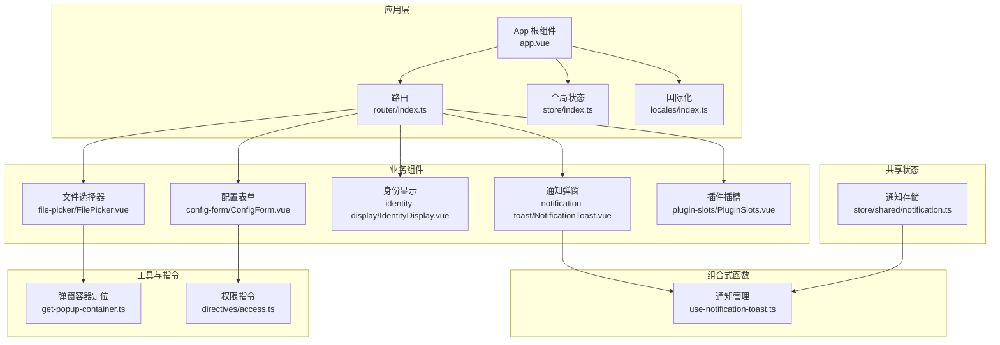
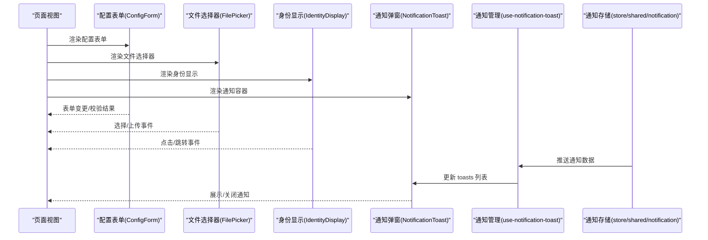
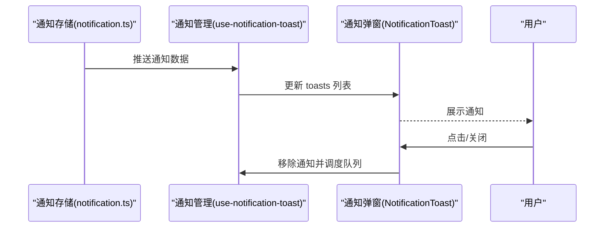
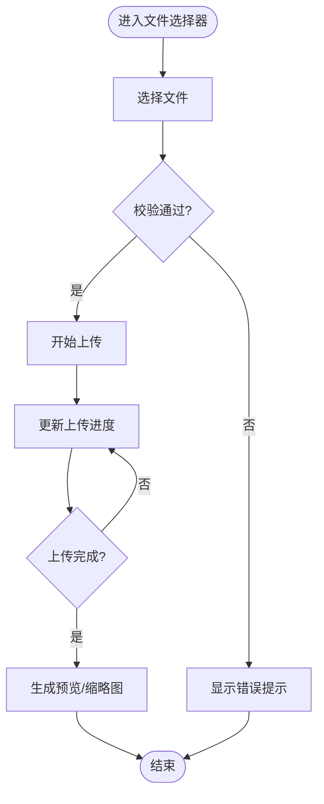
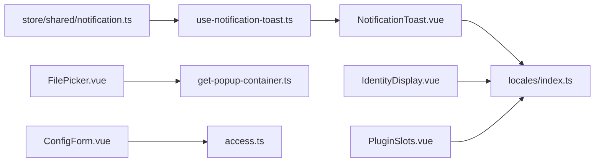

# 通用组件

<cite>
**本文引用的文件**
- [NotificationToast.vue](file://frontend/apps/web-antd/src/components/business/notification-toast/NotificationToast.vue)
- [use-notification-toast.ts](file://frontend/apps/web-antd/src/composables/use-notification-toast.ts)
- [notification.ts](file://frontend/apps/web-antd/src/store/shared/notification.ts)
- [get-popup-container.ts](file://frontend/packages/utils/src/helpers/get-popup-container.ts)
- [identity-display/IdentityDisplay.vue](file://frontend/apps/web-antd/src/components/business/identity-display/IdentityDisplay.vue)
- [identity-display/index.ts](file://frontend/apps/web-antd/src/components/business/identity-display/index.ts)
- [config-form/ConfigForm.vue](file://frontend/apps/web-antd/src/components/business/config-form/ConfigForm.vue)
- [config-form/index.ts](file://frontend/apps/web-antd/src/components/business/config-form/index.ts)
- [file-picker/FilePicker.vue](file://frontend/apps/web-antd/src/components/business/file-picker/FilePicker.vue)
- [file-picker/index.ts](file://frontend/apps/web-antd/src/components/business/file-picker/index.ts)
- [file-picker/types.ts](file://frontend/apps/web-antd/src/components/business/file-picker/types.ts)
- [plugin-slots/PluginSlots.vue](file://frontend/apps/web-antd/src/components/business/plugin-slots/PluginSlots.vue)
- [plugin-slots/index.ts](file://frontend/apps/web-antd/src/components/business/plugin-slots/index.ts)
- [plugin-slots/types.ts](file://frontend/apps/web-antd/src/components/business/plugin-slots/types.ts)
- [store/index.ts](file://frontend/apps/web-antd/src/store/index.ts)
- [router/index.ts](file://frontend/apps/web-antd/src/router/index.ts)
- [locales/index.ts](file://frontend/apps/web-antd/src/locales/index.ts)
- [styles/vxe-table-modern.css](file://frontend/apps/web-antd/src/styles/vxe-table-modern.css)
- [directives/access.ts](file://frontend/apps/web-antd/src/directives/access.ts)
- [composables/index.ts](file://frontend/apps/web-antd/src/composables/index.ts)
- [components/index.ts](file://frontend/apps/web-antd/src/components/index.ts)
</cite>

## 目录
1. [简介](#简介)
2. [项目结构](#项目结构)
3. [核心组件](#核心组件)
4. [架构总览](#架构总览)
5. [组件详解](#组件详解)
6. [依赖关系分析](#依赖关系分析)
7. [性能考量](#性能考量)
8. [故障排查指南](#故障排查指南)
9. [结论](#结论)
10. [附录](#附录)

## 简介
本文件面向 NovusAI SaaS 前端通用组件体系，聚焦以下通用 UI 组件的设计与复用：配置表单、文件选择器、身份显示、通知弹窗等。文档从设计理念、属性接口、事件系统、插槽设计、样式定制与主题适配、响应式布局、可访问性、国际化支持、浏览器兼容性等方面进行系统化梳理，并提供使用示例、参数说明、扩展指南以及开发规范与维护建议。

## 项目结构
通用组件主要位于前端应用的业务组件目录中，采用按功能域分层组织的方式：
- 业务组件集中于 components/business 下，每个子目录封装一个功能域组件（如 config-form、file-picker、identity-display、notification-toast、plugin-slots 等）
- 组合式函数（composables）用于状态与行为逻辑抽取（如 use-notification-toast）
- 共享状态通过 store 管理（如 store/shared/notification）
- 工具与辅助方法位于 packages/utils 或应用内工具模块（如 get-popup-container）

**图表来源**
- [components/index.ts](file://frontend/apps/web-antd/src/components/index.ts)
- [composables/index.ts](file://frontend/apps/web-antd/src/composables/index.ts)
- [store/index.ts](file://frontend/apps/web-antd/src/store/index.ts)
- [router/index.ts](file://frontend/apps/web-antd/src/router/index.ts)
- [locales/index.ts](file://frontend/apps/web-antd/src/locales/index.ts)

**章节来源**
- [components/index.ts](file://frontend/apps/web-antd/src/components/index.ts)
- [composables/index.ts](file://frontend/apps/web-antd/src/composables/index.ts)
- [store/index.ts](file://frontend/apps/web-antd/src/store/index.ts)
- [router/index.ts](file://frontend/apps/web-antd/src/router/index.ts)
- [locales/index.ts](file://frontend/apps/web-antd/src/locales/index.ts)

## 核心组件
本节对通用组件进行概览性介绍，涵盖职责边界、典型属性与事件、插槽设计、样式与主题适配要点、国际化与可访问性考虑。

- 配置表单（ConfigForm）
  - 职责：统一渲染与校验配置项，支持多种输入类型与联动规则
  - 属性接口：字段定义、默认值、是否必填、校验规则、禁用态等
  - 事件系统：变更回调、校验结果回调
  - 插槽设计：字段级自定义渲染、前缀/后缀操作区
  - 样式与主题：基于 Ant Design 风格变量，支持暗色模式切换
  - 国际化：标签与提示文本支持多语言
  - 可访问性：键盘导航、ARIA 标注、焦点管理

- 文件选择器（FilePicker）
  - 职责：上传、预览、删除、批量处理文件
  - 属性接口：允许类型、大小限制、多选、拖拽、裁剪、压缩等
  - 事件系统：选择完成、上传进度、错误回调
  - 插槽设计：自定义上传按钮、文件列表项、空态占位
  - 样式与主题：卡片/列表双模式，响应式布局
  - 国际化：提示文案、错误信息
  - 可访问性：按钮语义、可读性增强

- 身份显示（IdentityDisplay）
  - 职责：以头像、昵称、角色等维度展示用户或实体身份
  - 属性接口：头像、名称、角色、状态、尺寸、链接等
  - 事件系统：点击跳转、复制信息等
  - 插槽设计：徽章、状态点、操作按钮
  - 样式与主题：头像圆角、阴影、悬停高亮
  - 国际化：角色/状态文案
  - 可访问性：语义化标签、屏幕阅读器友好

- 通知弹窗（NotificationToast）
  - 职责：右下角堆叠式通知展示，支持优先级、自动关闭、模板化内容
  - 属性接口：标题、正文、分类、优先级、链接、数据模板
  - 事件系统：点击跳转、关闭回调
  - 插槽设计：模板化 UI（通过插件通知模板）
  - 样式与主题：颜色语义（低/正常/高/紧急）、动画过渡
  - 国际化：标题/按钮文本
  - 可访问性：ARIA live region、键盘关闭

- 插件插槽（PluginSlots）
  - 职责：承载插件扩展的 UI 片段，实现动态装配
  - 属性接口：插槽名、上下文数据、渲染模式
  - 事件系统：插槽内交互事件透传
  - 插槽设计：插槽容器、占位符、错误回退
  - 样式与主题：与宿主一致的视觉风格
  - 国际化：插槽内文案
  - 可访问性：插槽内组件遵循自身可访问性设计

**章节来源**
- [config-form/ConfigForm.vue](file://frontend/apps/web-antd/src/components/business/config-form/ConfigForm.vue)
- [config-form/index.ts](file://frontend/apps/web-antd/src/components/business/config-form/index.ts)
- [file-picker/FilePicker.vue](file://frontend/apps/web-antd/src/components/business/file-picker/FilePicker.vue)
- [file-picker/index.ts](file://frontend/apps/web-antd/src/components/business/file-picker/index.ts)
- [identity-display/IdentityDisplay.vue](file://frontend/apps/web-antd/src/components/business/identity-display/IdentityDisplay.vue)
- [identity-display/index.ts](file://frontend/apps/web-antd/src/components/business/identity-display/index.ts)
- [notification-toast/NotificationToast.vue](file://frontend/apps/web-antd/src/components/business/notification-toast/NotificationToast.vue)
- [use-notification-toast.ts](file://frontend/apps/web-antd/src/composables/use-notification-toast.ts)
- [plugin-slots/PluginSlots.vue](file://frontend/apps/web-antd/src/components/business/plugin-slots/PluginSlots.vue)
- [plugin-slots/index.ts](file://frontend/apps/web-antd/src/components/business/plugin-slots/index.ts)

## 架构总览
通用组件在应用中的协作关系如下：

**图表来源**
- [config-form/ConfigForm.vue](file://frontend/apps/web-antd/src/components/business/config-form/ConfigForm.vue)
- [file-picker/FilePicker.vue](file://frontend/apps/web-antd/src/components/business/file-picker/FilePicker.vue)
- [identity-display/IdentityDisplay.vue](file://frontend/apps/web-antd/src/components/business/identity-display/IdentityDisplay.vue)
- [notification-toast/NotificationToast.vue](file://frontend/apps/web-antd/src/components/business/notification-toast/NotificationToast.vue)
- [use-notification-toast.ts](file://frontend/apps/web-antd/src/composables/use-notification-toast.ts)
- [notification.ts](file://frontend/apps/web-antd/src/store/shared/notification.ts)

## 组件详解

### 通知弹窗（NotificationToast）
- 设计理念
  - 采用右下角堆叠展示，支持优先级与自动关闭策略，避免阻断用户操作
  - 使用 Teleport 将 DOM 挂载到 body，确保层级与定位不受父容器影响
  - 支持模板化插件通知 UI，便于扩展
- 属性接口
  - 标题、正文、分类、优先级、链接、数据模板、创建时间
  - 优先级枚举：低/正常/高/紧急；紧急项不自动关闭
- 事件系统
  - 点击通知：根据链接或模板动作执行
  - 关闭按钮：移除该条通知
- 插槽设计
  - 通过插件通知模板渲染复杂内容
- 样式与主题
  - 基于语义色（主色/警告/破坏色）区分优先级
  - 动画过渡与抖动（紧急项）提升感知
- 国际化与可访问性
  - 标题/按钮文本国际化
  - ARIA live region 提升可访问性
- 浏览器兼容性
  - 使用标准 DOM API 与 Vue TransitionGroup，主流浏览器支持良好

**图表来源**
- [notification.ts](file://frontend/apps/web-antd/src/store/shared/notification.ts)
- [use-notification-toast.ts](file://frontend/apps/web-antd/src/composables/use-notification-toast.ts)
- [notification-toast/NotificationToast.vue](file://frontend/apps/web-antd/src/components/business/notification-toast/NotificationToast.vue)

**章节来源**
- [notification.ts](file://frontend/apps/web-antd/src/store/shared/notification.ts)
- [use-notification-toast.ts](file://frontend/apps/web-antd/src/composables/use-notification-toast.ts)
- [notification-toast/NotificationToast.vue](file://frontend/apps/web-antd/src/components/business/notification-toast/NotificationToast.vue)

### 配置表单（ConfigForm）
- 设计理念
  - 以声明式方式定义字段与校验规则，统一渲染与交互体验
  - 支持字段联动、条件显示、动态校验
- 属性接口
  - 字段定义数组（含类型、默认值、校验规则、禁用态等）
  - 表单级校验与提交回调
- 事件系统
  - 字段变更事件、表单提交事件、校验结果事件
- 插槽设计
  - 字段级插槽：自定义渲染器
  - 前缀/后缀操作区插槽
- 样式与主题
  - 基于 Ant Design 组件风格，支持暗色模式
- 国际化与可访问性
  - 标签与提示文本国际化，语义化标签与键盘可达
- 浏览器兼容性
  - 依赖现代浏览器特性，需在目标环境中验证

**章节来源**
- [config-form/ConfigForm.vue](file://frontend/apps/web-antd/src/components/business/config-form/ConfigForm.vue)
- [config-form/index.ts](file://frontend/apps/web-antd/src/components/business/config-form/index.ts)

### 文件选择器（FilePicker）
- 设计理念
  - 统一文件上传流程，支持拖拽、预览、批量处理与错误提示
- 属性接口
  - 允许类型、大小限制、多选、裁剪、压缩、拖拽、禁用态
- 事件系统
  - 选择完成、上传进度、错误回调
- 插槽设计
  - 自定义上传按钮、文件列表项、空态占位
- 样式与主题
  - 卡片/列表双模式，响应式布局
- 国际化与可访问性
  - 提示文案与错误信息国际化，按钮语义明确
- 浏览器兼容性
  - 使用 File API 与拖拽 API，需在目标环境中验证

**图表来源**
- [file-picker/FilePicker.vue](file://frontend/apps/web-antd/src/components/business/file-picker/FilePicker.vue)
- [file-picker/types.ts](file://frontend/apps/web-antd/src/components/business/file-picker/types.ts)

**章节来源**
- [file-picker/FilePicker.vue](file://frontend/apps/web-antd/src/components/business/file-picker/FilePicker.vue)
- [file-picker/index.ts](file://frontend/apps/web-antd/src/components/business/file-picker/index.ts)
- [file-picker/types.ts](file://frontend/apps/web-antd/src/components/business/file-picker/types.ts)

### 身份显示（IdentityDisplay）
- 设计理念
  - 以头像、昵称、角色等维度简洁展示身份信息，支持点击跳转与复制
- 属性接口
  - 头像、名称、角色、状态、尺寸、链接、禁用态
- 事件系统
  - 点击跳转、复制信息等
- 插槽设计
  - 徽章、状态点、操作按钮
- 样式与主题
  - 头像圆角、阴影、悬停高亮
- 国际化与可访问性
  - 角色/状态文案国际化，语义化标签
- 浏览器兼容性
  - 依赖现代浏览器特性，需在目标环境中验证

**章节来源**
- [identity-display/IdentityDisplay.vue](file://frontend/apps/web-antd/src/components/business/identity-display/IdentityDisplay.vue)
- [identity-display/index.ts](file://frontend/apps/web-antd/src/components/business/identity-display/index.ts)

### 插件插槽（PluginSlots）
- 设计理念
  - 通过插槽机制承载插件扩展 UI，实现动态装配与解耦
- 属性接口
  - 插槽名、上下文数据、渲染模式
- 事件系统
  - 插槽内交互事件透传
- 插槽设计
  - 插槽容器、占位符、错误回退
- 样式与主题
  - 与宿主一致的视觉风格
- 国际化与可访问性
  - 插槽内文案国际化，遵循插槽内组件的可访问性设计
- 浏览器兼容性
  - 依赖现代浏览器特性，需在目标环境中验证

**章节来源**
- [plugin-slots/PluginSlots.vue](file://frontend/apps/web-antd/src/components/business/plugin-slots/PluginSlots.vue)
- [plugin-slots/index.ts](file://frontend/apps/web-antd/src/components/business/plugin-slots/index.ts)
- [plugin-slots/types.ts](file://frontend/apps/web-antd/src/components/business/plugin-slots/types.ts)

## 依赖关系分析
通用组件之间的依赖关系如下：

**图表来源**
- [use-notification-toast.ts](file://frontend/apps/web-antd/src/composables/use-notification-toast.ts)
- [notification-toast/NotificationToast.vue](file://frontend/apps/web-antd/src/components/business/notification-toast/NotificationToast.vue)
- [store/shared/notification.ts](file://frontend/apps/web-antd/src/store/shared/notification.ts)
- [file-picker/FilePicker.vue](file://frontend/apps/web-antd/src/components/business/file-picker/FilePicker.vue)
- [get-popup-container.ts](file://frontend/packages/utils/src/helpers/get-popup-container.ts)
- [config-form/ConfigForm.vue](file://frontend/apps/web-antd/src/components/business/config-form/ConfigForm.vue)
- [directives/access.ts](file://frontend/apps/web-antd/src/directives/access.ts)
- [locales/index.ts](file://frontend/apps/web-antd/src/locales/index.ts)

**章节来源**
- [use-notification-toast.ts](file://frontend/apps/web-antd/src/composables/use-notification-toast.ts)
- [notification.ts](file://frontend/apps/web-antd/src/store/shared/notification.ts)
- [NotificationToast.vue](file://frontend/apps/web-antd/src/components/business/notification-toast/NotificationToast.vue)
- [FilePicker.vue](file://frontend/apps/web-antd/src/components/business/file-picker/FilePicker.vue)
- [get-popup-container.ts](file://frontend/packages/utils/src/helpers/get-popup-container.ts)
- [ConfigForm.vue](file://frontend/apps/web-antd/src/components/business/config-form/ConfigForm.vue)
- [access.ts](file://frontend/apps/web-antd/src/directives/access.ts)
- [locales/index.ts](file://frontend/apps/web-antd/src/locales/index.ts)

## 性能考量
- 通知弹窗
  - 限制最大可见数量，超出部分入队延迟展示，避免频繁 DOM 操作
  - 紧急通知不自动关闭，减少重复渲染
- 文件选择器
  - 上传进度分片上报，避免主线程阻塞
  - 预览生成与缩略图缓存，减少重复计算
- 身份显示
  - 头像懒加载与占位符，降低首屏压力
- 插件插槽
  - 条件渲染与错误回退，避免插件异常影响主流程

## 故障排查指南
- 通知未显示
  - 检查通知存储是否正确推送数据
  - 确认通知管理器是否被调用
  - 校验国际化键是否存在
- 文件上传失败
  - 查看控制台错误日志与网络请求
  - 校验文件类型与大小限制
  - 确认上传凭据与服务端接口
- 身份显示异常
  - 检查头像资源可访问性
  - 校验角色/状态文案国际化
- 插件插槽空白
  - 检查插槽名与上下文数据
  - 查看插件是否正确注册与渲染

**章节来源**
- [use-notification-toast.ts](file://frontend/apps/web-antd/src/composables/use-notification-toast.ts)
- [notification.ts](file://frontend/apps/web-antd/src/store/shared/notification.ts)
- [notification-toast/NotificationToast.vue](file://frontend/apps/web-antd/src/components/business/notification-toast/NotificationToast.vue)
- [file-picker/FilePicker.vue](file://frontend/apps/web-antd/src/components/business/file-picker/FilePicker.vue)
- [identity-display/IdentityDisplay.vue](file://frontend/apps/web-antd/src/components/business/identity-display/IdentityDisplay.vue)
- [plugin-slots/PluginSlots.vue](file://frontend/apps/web-antd/src/components/business/plugin-slots/PluginSlots.vue)

## 结论
通用组件通过清晰的职责划分、统一的属性接口与事件系统、灵活的插槽设计，实现了跨页面的高复用与一致性体验。结合国际化、可访问性与主题适配，组件在不同场景下均能保持良好的可用性与可维护性。建议在后续迭代中持续完善测试覆盖与性能监控，确保组件在大规模使用下的稳定性。

## 附录

### 使用示例与参数说明（概述）
- 配置表单
  - 参数：字段定义数组、默认值、校验规则、禁用态
  - 事件：变更回调、提交回调、校验结果
  - 示例路径：[config-form/ConfigForm.vue](file://frontend/apps/web-antd/src/components/business/config-form/ConfigForm.vue)
- 文件选择器
  - 参数：允许类型、大小限制、多选、拖拽、裁剪、压缩
  - 事件：选择完成、上传进度、错误回调
  - 示例路径：[file-picker/FilePicker.vue](file://frontend/apps/web-antd/src/components/business/file-picker/FilePicker.vue)
- 身份显示
  - 参数：头像、名称、角色、状态、尺寸、链接
  - 事件：点击跳转、复制信息
  - 示例路径：[identity-display/IdentityDisplay.vue](file://frontend/apps/web-antd/src/components/business/identity-display/IdentityDisplay.vue)
- 通知弹窗
  - 参数：标题、正文、分类、优先级、链接、数据模板
  - 事件：点击跳转、关闭回调
  - 示例路径：[notification-toast/NotificationToast.vue](file://frontend/apps/web-antd/src/components/business/notification-toast/NotificationToast.vue)
- 插件插槽
  - 参数：插槽名、上下文数据、渲染模式
  - 事件：插槽内交互事件透传
  - 示例路径：[plugin-slots/PluginSlots.vue](file://frontend/apps/web-antd/src/components/business/plugin-slots/PluginSlots.vue)

### 扩展指南
- 新增通用组件
  - 在 components/business 下新建目录，遵循单一职责原则
  - 定义清晰的属性接口与事件系统
  - 提供插槽与主题适配能力
- 通知扩展
  - 通过模板代码与数据驱动扩展通知 UI
  - 保持优先级与自动关闭策略的一致性
- 文件处理扩展
  - 支持更多文件类型与压缩算法
  - 提供批量处理与断点续传能力

### 开发规范与维护建议
- 规范
  - 组件命名与目录结构统一
  - 属性与事件命名语义化
  - 插槽命名与作用域明确
- 主题与样式
  - 使用设计系统变量，支持暗色模式
  - 响应式布局适配移动端
- 国际化
  - 文案与提示文本统一走 i18n
  - 错误信息与可访问性文本国际化
- 可访问性
  - 语义化标签与键盘可达
  - ARIA live region 与焦点管理
- 兼容性
  - 在目标浏览器中验证核心功能
  - 对旧版浏览器提供降级方案

**章节来源**
- [config-form/ConfigForm.vue](file://frontend/apps/web-antd/src/components/business/config-form/ConfigForm.vue)
- [file-picker/FilePicker.vue](file://frontend/apps/web-antd/src/components/business/file-picker/FilePicker.vue)
- [identity-display/IdentityDisplay.vue](file://frontend/apps/web-antd/src/components/business/identity-display/IdentityDisplay.vue)
- [notification-toast/NotificationToast.vue](file://frontend/apps/web-antd/src/components/business/notification-toast/NotificationToast.vue)
- [plugin-slots/PluginSlots.vue](file://frontend/apps/web-antd/src/components/business/plugin-slots/PluginSlots.vue)