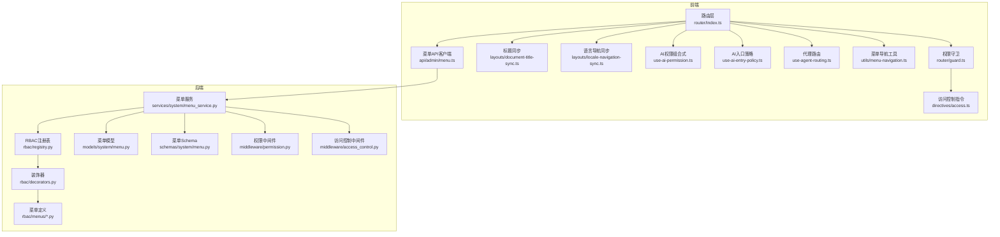
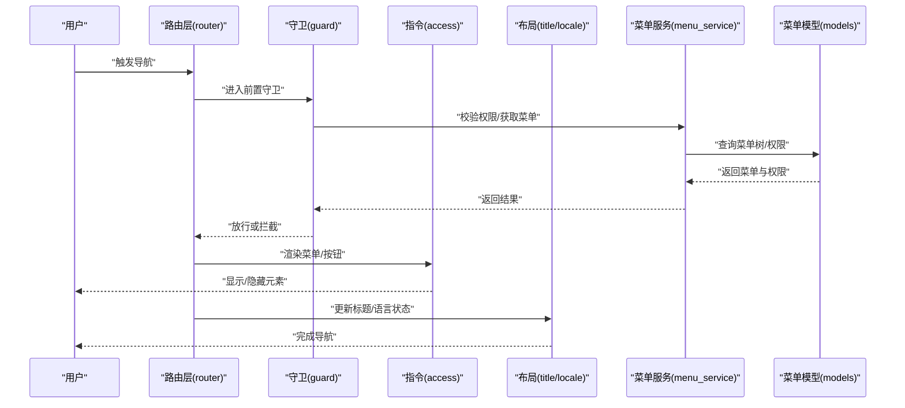
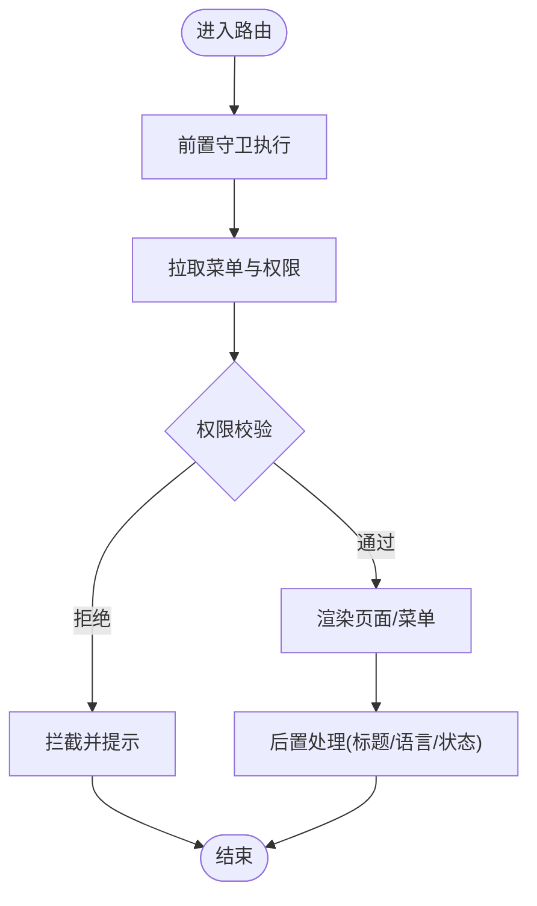
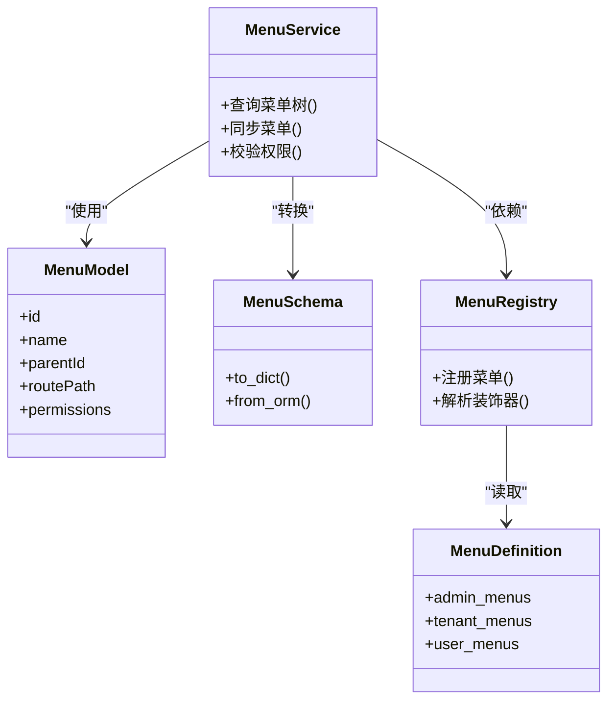
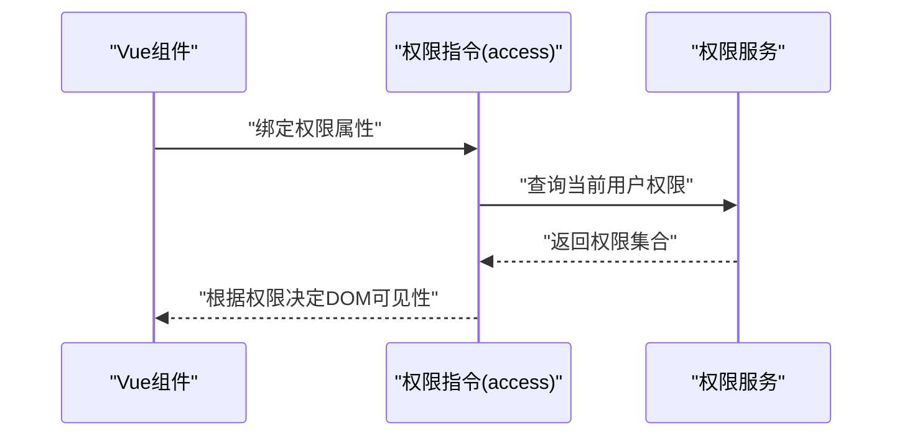
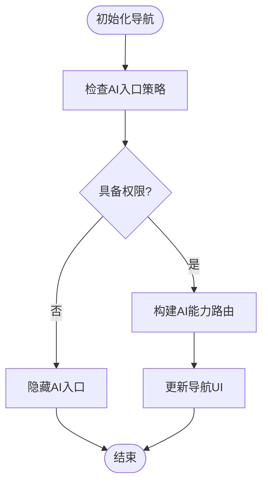
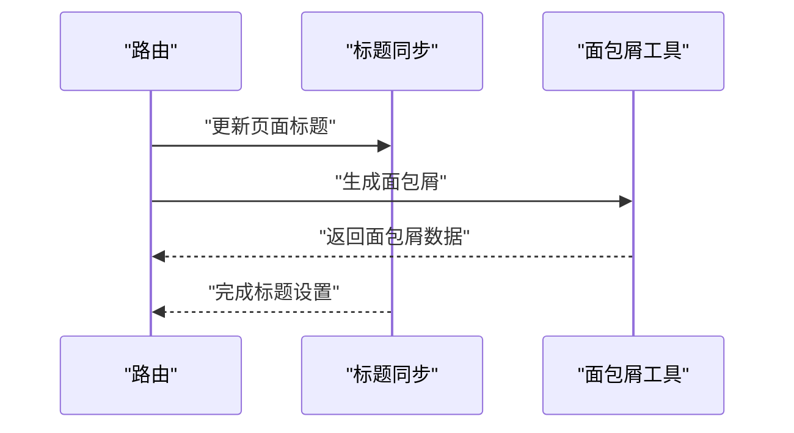
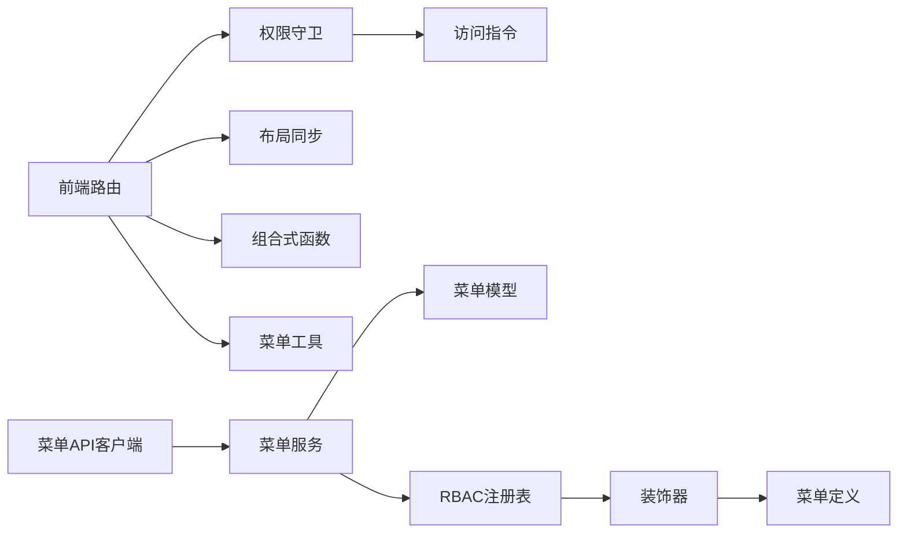

# 导航管理

<cite>
**本文引用的文件**
- [router/index.ts](file://frontend/apps/web-antd/src/router/index.ts)
- [router/guard.ts](file://frontend/apps/web-antd/src/router/guard.ts)
- [router/access.ts](file://frontend/apps/web-antd/src/router/access.ts)
- [directives/access.ts](file://frontend/apps/web-antd/src/directives/access.ts)
- [layouts/document-title-sync.ts](file://frontend/apps/web-antd/src/layouts/document-title-sync.ts)
- [layouts/locale-navigation-sync.ts](file://frontend/apps/web-antd/src/layouts/locale-navigation-sync.ts)
- [composables/use-ai-permission.ts](file://frontend/apps/web-antd/src/composables/use-ai-permission.ts)
- [composables/use-ai-entry-policy.ts](file://frontend/apps/web-antd/src/composables/use-ai-entry-policy.ts)
- [composables/use-agent-routing.ts](file://frontend/apps/web-antd/src/composables/use-agent-routing.ts)
- [utils/menu-navigation.ts](file://frontend/apps/web-antd/src/utils/menu-navigation.ts)
- [api/admin/menu.ts](file://frontend/apps/web-antd/src/api/admin/menu.ts)
- [backend/app/rbac/menus/admin_menus.py](file://backend/app/rbac/menus/admin_menus.py)
- [backend/app/rbac/menus/tenant_menus.py](file://backend/app/rbac/menus/tenant_menus.py)
- [backend/app/rbac/menus/user_menus.py](file://backend/app/rbac/menus/user_menus.py)
- [backend/app/middleware/permission.py](file://backend/app/middleware/permission.py)
- [backend/app/middleware/access_control.py](file://backend/app/middleware/access_control.py)
- [backend/app/schemas/system/menu.py](file://backend/app/schemas/system/menu.py)
- [backend/app/services/system/menu_service.py](file://backend/app/services/system/menu_service.py)
- [backend/app/models/system/menu.py](file://backend/app/models/system/menu.py)
- [backend/app/rbac/registry.py](file://backend/app/rbac/registry.py)
- [backend/app/rbac/decorators.py](file://backend/app/rbac/decorators.py)
</cite>

## 目录
1. [简介](#简介)
2. [项目结构](#项目结构)
3. [核心组件](#核心组件)
4. [架构总览](#架构总览)
5. [详细组件分析](#详细组件分析)
6. [依赖分析](#依赖分析)
7. [性能考虑](#性能考虑)
8. [故障排除指南](#故障排除指南)
9. [结论](#结论)
10. [附录](#附录)

## 简介
本文件系统性梳理 NovusAI SaaS 的导航管理系统，覆盖前端导航菜单的动态生成机制、权限控制与路由映射关系；后端 RBAC 菜单定义与同步；代理路由与 AI 能力导航；导航指令与界面适配；路由跳转策略、历史记录管理与浏览器兼容性；导航状态管理、面包屑生成与页面标题同步；以及导航性能优化、SEO 友好设计与用户体验提升方案。

## 项目结构
前端导航体系由“路由层（router）+ 权限守卫（guard/access）+ 指令层（directives）+ 布局层（layouts）+ 组合式函数（composables）+ 工具函数（utils）+ API 客户端（api）”构成；后端 RBAC 菜单通过服务与模型进行持久化与同步，并在运行时下发给前端。

图表来源
- [router/index.ts:1-200](file://frontend/apps/web-antd/src/router/index.ts#L1-L200)
- [router/guard.ts:1-200](file://frontend/apps/web-antd/src/router/guard.ts#L1-L200)
- [router/access.ts:1-200](file://frontend/apps/web-antd/src/router/access.ts#L1-L200)
- [directives/access.ts:1-200](file://frontend/apps/web-antd/src/directives/access.ts#L1-L200)
- [layouts/document-title-sync.ts:1-200](file://frontend/apps/web-antd/src/layouts/document-title-sync.ts#L1-L200)
- [layouts/locale-navigation-sync.ts:1-200](file://frontend/apps/web-antd/src/layouts/locale-navigation-sync.ts#L1-L200)
- [composables/use-ai-permission.ts:1-200](file://frontend/apps/web-antd/src/composables/use-ai-permission.ts#L1-L200)
- [composables/use-ai-entry-policy.ts:1-200](file://frontend/apps/web-antd/src/composables/use-ai-entry-policy.ts#L1-L200)
- [composables/use-agent-routing.ts:1-200](file://frontend/apps/web-antd/src/composables/use-agent-routing.ts#L1-L200)
- [utils/menu-navigation.ts:1-200](file://frontend/apps/web-antd/src/utils/menu-navigation.ts#L1-L200)
- [api/admin/menu.ts:1-200](file://frontend/apps/web-antd/src/api/admin/menu.ts#L1-L200)
- [backend/app/rbac/registry.py:1-200](file://backend/app/rbac/registry.py#L1-L200)
- [backend/app/rbac/decorators.py:1-200](file://backend/app/rbac/decorators.py#L1-L200)
- [backend/app/rbac/menus/admin_menus.py:1-200](file://backend/app/rbac/menus/admin_menus.py#L1-L200)
- [backend/app/rbac/menus/tenant_menus.py:1-200](file://backend/app/rbac/menus/tenant_menus.py#L1-L200)
- [backend/app/rbac/menus/user_menus.py:1-200](file://backend/app/rbac/menus/user_menus.py#L1-L200)
- [backend/app/services/system/menu_service.py:1-200](file://backend/app/services/system/menu_service.py#L1-L200)
- [backend/app/models/system/menu.py:1-200](file://backend/app/models/system/menu.py#L1-L200)
- [backend/app/schemas/system/menu.py:1-200](file://backend/app/schemas/system/menu.py#L1-L200)
- [backend/app/middleware/permission.py:1-200](file://backend/app/middleware/permission.py#L1-L200)
- [backend/app/middleware/access_control.py:1-200](file://backend/app/middleware/access_control.py#L1-L200)

章节来源
- [router/index.ts:1-200](file://frontend/apps/web-antd/src/router/index.ts#L1-L200)
- [router/guard.ts:1-200](file://frontend/apps/web-antd/src/router/guard.ts#L1-L200)
- [router/access.ts:1-200](file://frontend/apps/web-antd/src/router/access.ts#L1-L200)
- [directives/access.ts:1-200](file://frontend/apps/web-antd/src/directives/access.ts#L1-L200)
- [layouts/document-title-sync.ts:1-200](file://frontend/apps/web-antd/src/layouts/document-title-sync.ts#L1-L200)
- [layouts/locale-navigation-sync.ts:1-200](file://frontend/apps/web-antd/src/layouts/locale-navigation-sync.ts#L1-L200)
- [composables/use-ai-permission.ts:1-200](file://frontend/apps/web-antd/src/composables/use-ai-permission.ts#L1-L200)
- [composables/use-ai-entry-policy.ts:1-200](file://frontend/apps/web-antd/src/composables/use-ai-entry-policy.ts#L1-L200)
- [composables/use-agent-routing.ts:1-200](file://frontend/apps/web-antd/src/composables/use-agent-routing.ts#L1-L200)
- [utils/menu-navigation.ts:1-200](file://frontend/apps/web-antd/src/utils/menu-navigation.ts#L1-L200)
- [api/admin/menu.ts:1-200](file://frontend/apps/web-antd/src/api/admin/menu.ts#L1-L200)
- [backend/app/rbac/registry.py:1-200](file://backend/app/rbac/registry.py#L1-L200)
- [backend/app/rbac/decorators.py:1-200](file://backend/app/rbac/decorators.py#L1-L200)
- [backend/app/rbac/menus/admin_menus.py:1-200](file://backend/app/rbac/menus/admin_menus.py#L1-L200)
- [backend/app/rbac/menus/tenant_menus.py:1-200](file://backend/app/rbac/menus/tenant_menus.py#L1-L200)
- [backend/app/rbac/menus/user_menus.py:1-200](file://backend/app/rbac/menus/user_menus.py#L1-L200)
- [backend/app/services/system/menu_service.py:1-200](file://backend/app/services/system/menu_service.py#L1-L200)
- [backend/app/models/system/menu.py:1-200](file://backend/app/models/system/menu.py#L1-L200)
- [backend/app/schemas/system/menu.py:1-200](file://backend/app/schemas/system/menu.py#L1-L200)
- [backend/app/middleware/permission.py:1-200](file://backend/app/middleware/permission.py#L1-L200)
- [backend/app/middleware/access_control.py:1-200](file://backend/app/middleware/access_control.py#L1-L200)

## 核心组件
- 路由与守卫：负责导航跳转、前置守卫与后置处理、访问控制与权限校验。
- 指令层：基于元素级权限指令，实现按钮/菜单项的可见性与可点击性控制。
- 布局层：统一处理页面标题同步与语言导航状态同步。
- 组合式函数：封装 AI 能力导航、代理路由与入口策略等业务逻辑。
- 工具函数：提供菜单导航辅助能力，如面包屑生成、路径匹配与状态管理。
- API 客户端：从后端拉取菜单定义与权限数据，驱动前端动态渲染。
- 后端 RBAC：定义角色、权限与菜单树，提供菜单服务与中间件保障。

章节来源
- [router/index.ts:1-200](file://frontend/apps/web-antd/src/router/index.ts#L1-L200)
- [router/guard.ts:1-200](file://frontend/apps/web-antd/src/router/guard.ts#L1-L200)
- [router/access.ts:1-200](file://frontend/apps/web-antd/src/router/access.ts#L1-L200)
- [directives/access.ts:1-200](file://frontend/apps/web-antd/src/directives/access.ts#L1-L200)
- [layouts/document-title-sync.ts:1-200](file://frontend/apps/web-antd/src/layouts/document-title-sync.ts#L1-L200)
- [layouts/locale-navigation-sync.ts:1-200](file://frontend/apps/web-antd/src/layouts/locale-navigation-sync.ts#L1-L200)
- [composables/use-ai-permission.ts:1-200](file://frontend/apps/web-antd/src/composables/use-ai-permission.ts#L1-L200)
- [composables/use-ai-entry-policy.ts:1-200](file://frontend/apps/web-antd/src/composables/use-ai-entry-policy.ts#L1-L200)
- [composables/use-agent-routing.ts:1-200](file://frontend/apps/web-antd/src/composables/use-agent-routing.ts#L1-L200)
- [utils/menu-navigation.ts:1-200](file://frontend/apps/web-antd/src/utils/menu-navigation.ts#L1-L200)
- [api/admin/menu.ts:1-200](file://frontend/apps/web-antd/src/api/admin/menu.ts#L1-L200)
- [backend/app/rbac/registry.py:1-200](file://backend/app/rbac/registry.py#L1-L200)
- [backend/app/rbac/decorators.py:1-200](file://backend/app/rbac/decorators.py#L1-L200)
- [backend/app/rbac/menus/admin_menus.py:1-200](file://backend/app/rbac/menus/admin_menus.py#L1-L200)
- [backend/app/rbac/menus/tenant_menus.py:1-200](file://backend/app/rbac/menus/tenant_menus.py#L1-L200)
- [backend/app/rbac/menus/user_menus.py:1-200](file://backend/app/rbac/menus/user_menus.py#L1-L200)
- [backend/app/services/system/menu_service.py:1-200](file://backend/app/services/system/menu_service.py#L1-L200)
- [backend/app/models/system/menu.py:1-200](file://backend/app/models/system/menu.py#L1-L200)
- [backend/app/schemas/system/menu.py:1-200](file://backend/app/schemas/system/menu.py#L1-L200)
- [backend/app/middleware/permission.py:1-200](file://backend/app/middleware/permission.py#L1-L200)
- [backend/app/middleware/access_control.py:1-200](file://backend/app/middleware/access_control.py#L1-L200)

## 架构总览
前端导航系统以路由为核心，结合权限守卫与指令实现细粒度控制；后端 RBAC 菜单定义与服务提供统一的数据源，中间件保障接口访问安全。AI 能力通过组合式函数与代理路由实现动态导航与能力入口。

图表来源
- [router/index.ts:1-200](file://frontend/apps/web-antd/src/router/index.ts#L1-L200)
- [router/guard.ts:1-200](file://frontend/apps/web-antd/src/router/guard.ts#L1-L200)
- [router/access.ts:1-200](file://frontend/apps/web-antd/src/router/access.ts#L1-L200)
- [directives/access.ts:1-200](file://frontend/apps/web-antd/src/directives/access.ts#L1-L200)
- [layouts/document-title-sync.ts:1-200](file://frontend/apps/web-antd/src/layouts/document-title-sync.ts#L1-L200)
- [layouts/locale-navigation-sync.ts:1-200](file://frontend/apps/web-antd/src/layouts/locale-navigation-sync.ts#L1-L200)
- [backend/app/services/system/menu_service.py:1-200](file://backend/app/services/system/menu_service.py#L1-L200)
- [backend/app/models/system/menu.py:1-200](file://backend/app/models/system/menu.py#L1-L200)

## 详细组件分析

### 路由与权限守卫
- 路由层负责定义导航路径、懒加载视图与嵌套路由；权限守卫在导航前执行，依据后端菜单与权限判定是否允许访问；访问控制指令在 DOM 层面进一步细化按钮/菜单项的可见性。
- 后端中间件(permission/access_control)与 RBAC 注册表配合，确保接口与菜单一致的权限语义。

图表来源
- [router/guard.ts:1-200](file://frontend/apps/web-antd/src/router/guard.ts#L1-L200)
- [router/access.ts:1-200](file://frontend/apps/web-antd/src/router/access.ts#L1-L200)
- [backend/app/middleware/permission.py:1-200](file://backend/app/middleware/permission.py#L1-L200)
- [backend/app/middleware/access_control.py:1-200](file://backend/app/middleware/access_control.py#L1-L200)

章节来源
- [router/index.ts:1-200](file://frontend/apps/web-antd/src/router/index.ts#L1-L200)
- [router/guard.ts:1-200](file://frontend/apps/web-antd/src/router/guard.ts#L1-L200)
- [router/access.ts:1-200](file://frontend/apps/web-antd/src/router/access.ts#L1-L200)
- [backend/app/middleware/permission.py:1-200](file://backend/app/middleware/permission.py#L1-L200)
- [backend/app/middleware/access_control.py:1-200](file://backend/app/middleware/access_control.py#L1-L200)

### 动态菜单生成与后端同步
- 后端通过 rbac/menus 定义不同角色的菜单树，menu_service 提供查询与同步能力，schema/model 规范数据结构，middleware 保证访问一致性。
- 前端通过 api/admin/menu.ts 获取菜单树，结合 utils/menu-navigation.ts 进行面包屑与路径匹配计算。

图表来源
- [backend/app/services/system/menu_service.py:1-200](file://backend/app/services/system/menu_service.py#L1-L200)
- [backend/app/models/system/menu.py:1-200](file://backend/app/models/system/menu.py#L1-L200)
- [backend/app/schemas/system/menu.py:1-200](file://backend/app/schemas/system/menu.py#L1-L200)
- [backend/app/rbac/registry.py:1-200](file://backend/app/rbac/registry.py#L1-L200)
- [backend/app/rbac/decorators.py:1-200](file://backend/app/rbac/decorators.py#L1-L200)
- [backend/app/rbac/menus/admin_menus.py:1-200](file://backend/app/rbac/menus/admin_menus.py#L1-L200)
- [backend/app/rbac/menus/tenant_menus.py:1-200](file://backend/app/rbac/menus/tenant_menus.py#L1-L200)
- [backend/app/rbac/menus/user_menus.py:1-200](file://backend/app/rbac/menus/user_menus.py#L1-L200)

章节来源
- [backend/app/services/system/menu_service.py:1-200](file://backend/app/services/system/menu_service.py#L1-L200)
- [backend/app/models/system/menu.py:1-200](file://backend/app/models/system/menu.py#L1-L200)
- [backend/app/schemas/system/menu.py:1-200](file://backend/app/schemas/system/menu.py#L1-L200)
- [backend/app/rbac/registry.py:1-200](file://backend/app/rbac/registry.py#L1-L200)
- [backend/app/rbac/decorators.py:1-200](file://backend/app/rbac/decorators.py#L1-L200)
- [backend/app/rbac/menus/admin_menus.py:1-200](file://backend/app/rbac/menus/admin_menus.py#L1-L200)
- [backend/app/rbac/menus/tenant_menus.py:1-200](file://backend/app/rbac/menus/tenant_menus.py#L1-L200)
- [backend/app/rbac/menus/user_menus.py:1-200](file://backend/app/rbac/menus/user_menus.py#L1-L200)

### 导航指令与界面适配
- 指令层基于元素属性进行权限判断，实现按钮/菜单项的即时可见性控制，避免不必要的渲染与请求。
- 布局层统一处理页面标题与语言导航状态，确保多语言场景下导航一致性。

图表来源
- [directives/access.ts:1-200](file://frontend/apps/web-antd/src/directives/access.ts#L1-L200)
- [layouts/document-title-sync.ts:1-200](file://frontend/apps/web-antd/src/layouts/document-title-sync.ts#L1-L200)
- [layouts/locale-navigation-sync.ts:1-200](file://frontend/apps/web-antd/src/layouts/locale-navigation-sync.ts#L1-L200)

章节来源
- [directives/access.ts:1-200](file://frontend/apps/web-antd/src/directives/access.ts#L1-L200)
- [layouts/document-title-sync.ts:1-200](file://frontend/apps/web-antd/src/layouts/document-title-sync.ts#L1-L200)
- [layouts/locale-navigation-sync.ts:1-200](file://frontend/apps/web-antd/src/layouts/locale-navigation-sync.ts#L1-L200)

### 代理路由与 AI 能力导航
- 代理路由通过组合式函数封装，支持根据用户权限与 AI 能力状态动态调整导航入口与可用能力列表。
- AI 入口策略与权限组合式函数协同，确保仅展示用户具备访问权限的能力模块。

图表来源
- [composables/use-ai-entry-policy.ts:1-200](file://frontend/apps/web-antd/src/composables/use-ai-entry-policy.ts#L1-L200)
- [composables/use-ai-permission.ts:1-200](file://frontend/apps/web-antd/src/composables/use-ai-permission.ts#L1-L200)
- [composables/use-agent-routing.ts:1-200](file://frontend/apps/web-antd/src/composables/use-agent-routing.ts#L1-L200)

章节来源
- [composables/use-ai-entry-policy.ts:1-200](file://frontend/apps/web-antd/src/composables/use-ai-entry-policy.ts#L1-L200)
- [composables/use-ai-permission.ts:1-200](file://frontend/apps/web-antd/src/composables/use-ai-permission.ts#L1-L200)
- [composables/use-agent-routing.ts:1-200](file://frontend/apps/web-antd/src/composables/use-agent-routing.ts#L1-L200)

### 面包屑与页面标题同步
- 面包屑生成依赖菜单导航工具，结合当前路由路径与菜单树计算层级关系。
- 页面标题同步在布局层完成，确保浏览器标签页与页面内容一致。

图表来源
- [utils/menu-navigation.ts:1-200](file://frontend/apps/web-antd/src/utils/menu-navigation.ts#L1-L200)
- [layouts/document-title-sync.ts:1-200](file://frontend/apps/web-antd/src/layouts/document-title-sync.ts#L1-L200)

章节来源
- [utils/menu-navigation.ts:1-200](file://frontend/apps/web-antd/src/utils/menu-navigation.ts#L1-L200)
- [layouts/document-title-sync.ts:1-200](file://frontend/apps/web-antd/src/layouts/document-title-sync.ts#L1-L200)

## 依赖分析
- 前端路由依赖权限守卫与指令，守卫依赖菜单服务与模型；布局层依赖标题与语言同步工具；组合式函数依赖权限策略与代理路由。
- 后端 RBAC 依赖注册表与装饰器解析菜单定义，菜单服务依赖模型与 Schema，中间件保障接口访问安全。

图表来源
- [router/index.ts:1-200](file://frontend/apps/web-antd/src/router/index.ts#L1-L200)
- [router/guard.ts:1-200](file://frontend/apps/web-antd/src/router/guard.ts#L1-L200)
- [router/access.ts:1-200](file://frontend/apps/web-antd/src/router/access.ts#L1-L200)
- [layouts/document-title-sync.ts:1-200](file://frontend/apps/web-antd/src/layouts/document-title-sync.ts#L1-L200)
- [layouts/locale-navigation-sync.ts:1-200](file://frontend/apps/web-antd/src/layouts/locale-navigation-sync.ts#L1-L200)
- [composables/use-ai-permission.ts:1-200](file://frontend/apps/web-antd/src/composables/use-ai-permission.ts#L1-L200)
- [composables/use-ai-entry-policy.ts:1-200](file://frontend/apps/web-antd/src/composables/use-ai-entry-policy.ts#L1-L200)
- [composables/use-agent-routing.ts:1-200](file://frontend/apps/web-antd/src/composables/use-agent-routing.ts#L1-L200)
- [utils/menu-navigation.ts:1-200](file://frontend/apps/web-antd/src/utils/menu-navigation.ts#L1-L200)
- [api/admin/menu.ts:1-200](file://frontend/apps/web-antd/src/api/admin/menu.ts#L1-L200)
- [backend/app/services/system/menu_service.py:1-200](file://backend/app/services/system/menu_service.py#L1-L200)
- [backend/app/models/system/menu.py:1-200](file://backend/app/models/system/menu.py#L1-L200)
- [backend/app/rbac/registry.py:1-200](file://backend/app/rbac/registry.py#L1-L200)
- [backend/app/rbac/decorators.py:1-200](file://backend/app/rbac/decorators.py#L1-L200)
- [backend/app/rbac/menus/admin_menus.py:1-200](file://backend/app/rbac/menus/admin_menus.py#L1-L200)
- [backend/app/rbac/menus/tenant_menus.py:1-200](file://backend/app/rbac/menus/tenant_menus.py#L1-L200)
- [backend/app/rbac/menus/user_menus.py:1-200](file://backend/app/rbac/menus/user_menus.py#L1-L200)

章节来源
- [router/index.ts:1-200](file://frontend/apps/web-antd/src/router/index.ts#L1-L200)
- [router/guard.ts:1-200](file://frontend/apps/web-antd/src/router/guard.ts#L1-L200)
- [router/access.ts:1-200](file://frontend/apps/web-antd/src/router/access.ts#L1-L200)
- [layouts/document-title-sync.ts:1-200](file://frontend/apps/web-antd/src/layouts/document-title-sync.ts#L1-L200)
- [layouts/locale-navigation-sync.ts:1-200](file://frontend/apps/web-antd/src/layouts/locale-navigation-sync.ts#L1-L200)
- [composables/use-ai-permission.ts:1-200](file://frontend/apps/web-antd/src/composables/use-ai-permission.ts#L1-L200)
- [composables/use-ai-entry-policy.ts:1-200](file://frontend/apps/web-antd/src/composables/use-ai-entry-policy.ts#L1-L200)
- [composables/use-agent-routing.ts:1-200](file://frontend/apps/web-antd/src/composables/use-agent-routing.ts#L1-L200)
- [utils/menu-navigation.ts:1-200](file://frontend/apps/web-antd/src/utils/menu-navigation.ts#L1-L200)
- [api/admin/menu.ts:1-200](file://frontend/apps/web-antd/src/api/admin/menu.ts#L1-L200)
- [backend/app/services/system/menu_service.py:1-200](file://backend/app/services/system/menu_service.py#L1-L200)
- [backend/app/models/system/menu.py:1-200](file://backend/app/models/system/menu.py#L1-L200)
- [backend/app/rbac/registry.py:1-200](file://backend/app/rbac/registry.py#L1-L200)
- [backend/app/rbac/decorators.py:1-200](file://backend/app/rbac/decorators.py#L1-L200)
- [backend/app/rbac/menus/admin_menus.py:1-200](file://backend/app/rbac/menus/admin_menus.py#L1-L200)
- [backend/app/rbac/menus/tenant_menus.py:1-200](file://backend/app/rbac/menus/tenant_menus.py#L1-L200)
- [backend/app/rbac/menus/user_menus.py:1-200](file://backend/app/rbac/menus/user_menus.py#L1-L200)

## 性能考虑
- 菜单与权限缓存：前端在本地缓存菜单树与权限集合，减少重复请求；后端在菜单服务中利用查询优化与索引。
- 路由懒加载：按需加载视图组件，降低首屏体积。
- 指令级渲染控制：通过指令快速隐藏不可见元素，避免无效渲染。
- 标题与面包屑预计算：在路由变更时仅做必要计算，避免全量重算。
- 中间件前置校验：在进入业务逻辑前完成权限校验，减少无效调用。

## 故障排除指南
- 菜单不显示或权限错误：检查后端菜单服务是否正确返回菜单树与权限；确认前端守卫与指令是否正确读取权限集合。
- 标题未更新：确认布局层标题同步逻辑是否在路由后置钩子中执行。
- 面包屑异常：检查菜单导航工具对当前路由路径的匹配逻辑与菜单树结构一致性。
- 浏览器兼容性：确保路由模式与历史记录 API 在目标浏览器中可用；对不支持的场景提供降级策略。
- SEO 问题：为关键页面配置静态标题与描述，结合服务端渲染或预渲染策略。

章节来源
- [router/guard.ts:1-200](file://frontend/apps/web-antd/src/router/guard.ts#L1-L200)
- [layouts/document-title-sync.ts:1-200](file://frontend/apps/web-antd/src/layouts/document-title-sync.ts#L1-L200)
- [utils/menu-navigation.ts:1-200](file://frontend/apps/web-antd/src/utils/menu-navigation.ts#L1-L200)
- [backend/app/services/system/menu_service.py:1-200](file://backend/app/services/system/menu_service.py#L1-L200)

## 结论
本导航管理系统通过前后端协作，实现了动态菜单、细粒度权限控制与一致的用户体验。前端以路由为核心，结合守卫、指令与布局层，后端以 RBAC 与菜单服务为基础，确保权限与菜单的一致性。通过组合式函数与工具函数，系统支持 AI 能力导航与代理路由，满足复杂业务场景下的导航需求。

## 附录
- 使用建议：优先采用指令级权限控制与路由守卫双重保障；对关键页面启用标题与面包屑同步；对菜单与权限进行缓存与懒加载；在多语言环境下统一语言导航状态。
- 扩展点：可引入菜单权限变更通知机制，实现前端热更新；扩展代理路由以支持更多 AI 能力类型；增强 SEO 支持与可访问性（a11y）能力。