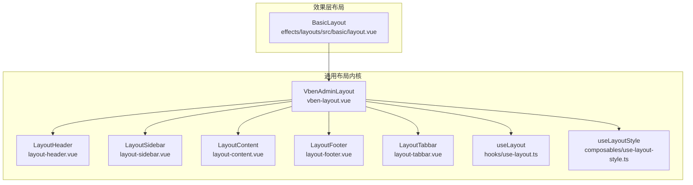
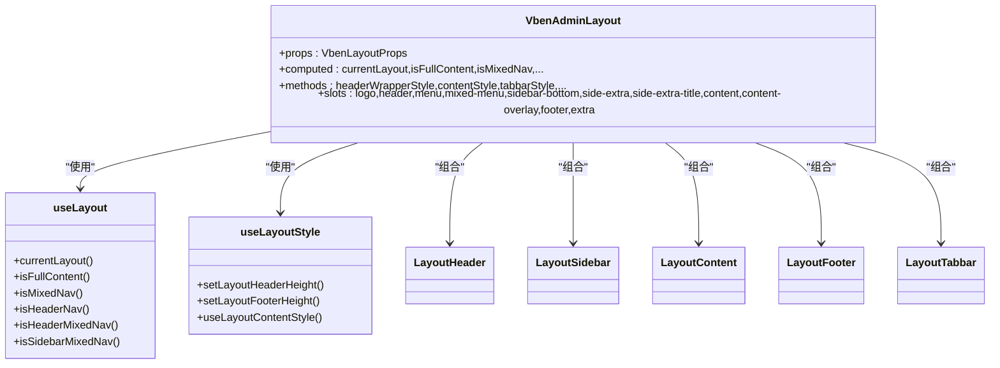
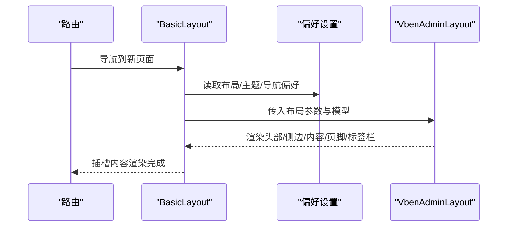
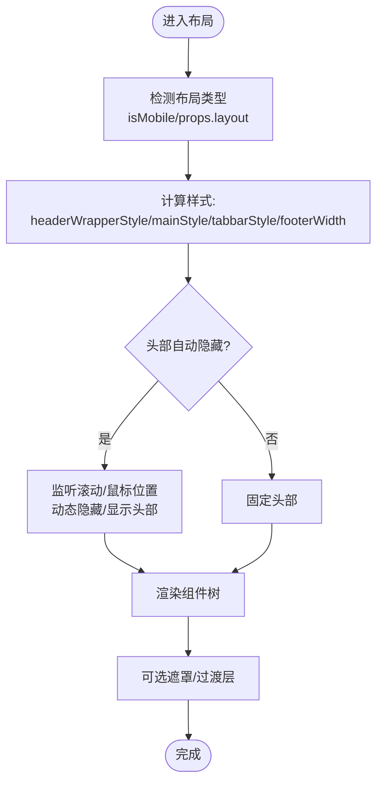
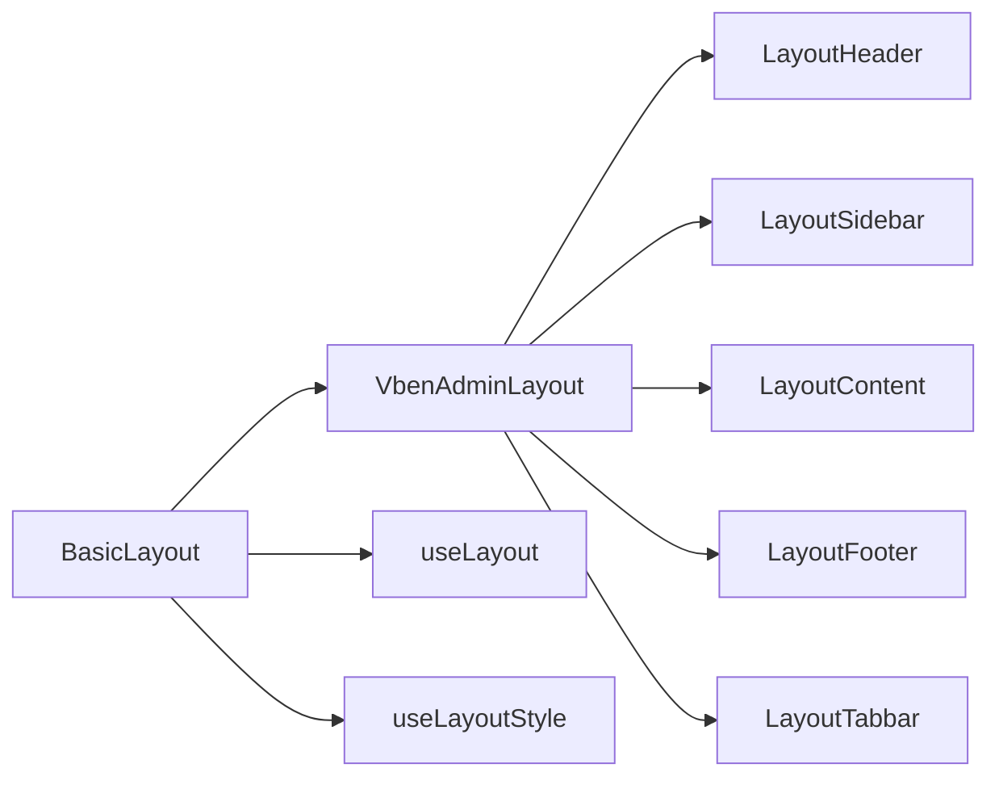

# 布局系统

<cite>
**本文引用的文件**
- [frontend/packages/@core/ui-kit/layout-ui/src/vben-layout.ts](file://frontend/packages/@core/ui-kit/layout-ui/src/vben-layout.ts)
- [frontend/packages/@core/ui-kit/layout-ui/src/vben-layout.vue](file://frontend/packages/@core/ui-kit/layout-ui/src/vben-layout.vue)
- [frontend/packages/@core/ui-kit/layout-ui/src/hooks/use-layout.ts](file://frontend/packages/@core/ui-kit/layout-ui/src/hooks/use-layout.ts)
- [frontend/packages/@core/ui-kit/layout-ui/src/components/layout-header.vue](file://frontend/packages/@core/ui-kit/layout-ui/src/components/layout-header.vue)
- [frontend/packages/@core/ui-kit/layout-ui/src/components/layout-sidebar.vue](file://frontend/packages/@core/ui-kit/layout-ui/src/components/layout-sidebar.vue)
- [frontend/packages/@core/ui-kit/layout-ui/src/components/layout-content.vue](file://frontend/packages/@core/ui-kit/layout-ui/src/components/layout-content.vue)
- [frontend/packages/@core/ui-kit/layout-ui/src/components/layout-footer.vue](file://frontend/packages/@core/ui-kit/layout-ui/src/components/layout-footer.vue)
- [frontend/packages/@core/ui-kit/layout-ui/src/components/layout-tabbar.vue](file://frontend/packages/@core/ui-kit/layout-ui/src/components/layout-tabbar.vue)
- [frontend/packages/@core/composables/src/use-layout-style.ts](file://frontend/packages/@core/composables/src/use-layout-style.ts)
- [frontend/packages/effects/layouts/src/basic/layout.vue](file://frontend/packages/effects/layouts/src/basic/layout.vue)
</cite>

## 目录
1. [简介](#简介)
2. [项目结构](#项目结构)
3. [核心组件](#核心组件)
4. [架构总览](#架构总览)
5. [详细组件分析](#详细组件分析)
6. [依赖关系分析](#依赖关系分析)
7. [性能考量](#性能考量)
8. [故障排查指南](#故障排查指南)
9. [结论](#结论)
10. [附录](#附录)

## 简介
本文件系统性梳理 NovusAI SaaS 前端布局体系，围绕“基础布局”“认证布局”“角色特定布局”的多布局架构进行深入解析。重点覆盖：
- 布局组件的嵌套结构与页面容器设计
- 响应式布局策略与移动端适配
- 页面切换动画与过渡组件配置
- 面包屑导航、动态标题与页面元数据管理
- 布局组件复用策略、样式定制与主题切换
- 开发规范、性能优化与无障碍访问建议

## 项目结构
布局系统由“通用布局内核 + 效果层布局”两层构成：
- 通用布局内核：提供可复用的布局容器、头部、侧边栏、内容区、页脚、标签栏等基础能力，并通过属性与模型驱动行为与样式。
- 效果层布局：基于通用内核封装业务布局（如基础布局），注入菜单、面包屑、版权、偏好设置面板等业务部件。

图表来源
- [frontend/packages/@core/ui-kit/layout-ui/src/vben-layout.vue:1-636](file://frontend/packages/@core/ui-kit/layout-ui/src/vben-layout.vue#L1-L636)
- [frontend/packages/@core/ui-kit/layout-ui/src/components/layout-header.vue:1-78](file://frontend/packages/@core/ui-kit/layout-ui/src/components/layout-header.vue#L1-L78)
- [frontend/packages/@core/ui-kit/layout-ui/src/components/layout-sidebar.vue:1-326](file://frontend/packages/@core/ui-kit/layout-ui/src/components/layout-sidebar.vue#L1-L326)
- [frontend/packages/@core/ui-kit/layout-ui/src/components/layout-content.vue:1-66](file://frontend/packages/@core/ui-kit/layout-ui/src/components/layout-content.vue#L1-L66)
- [frontend/packages/@core/ui-kit/layout-ui/src/components/layout-footer.vue:1-45](file://frontend/packages/@core/ui-kit/layout-ui/src/components/layout-footer.vue#L1-L45)
- [frontend/packages/@core/ui-kit/layout-ui/src/components/layout-tabbar.vue:1-31](file://frontend/packages/@core/ui-kit/layout-ui/src/components/layout-tabbar.vue#L1-L31)
- [frontend/packages/@core/ui-kit/layout-ui/src/hooks/use-layout.ts:1-54](file://frontend/packages/@core/ui-kit/layout-ui/src/hooks/use-layout.ts#L1-L54)
- [frontend/packages/@core/composables/src/use-layout-style.ts:1-88](file://frontend/packages/@core/composables/src/use-layout-style.ts#L1-L88)
- [frontend/packages/effects/layouts/src/basic/layout.vue:1-467](file://frontend/packages/effects/layouts/src/basic/layout.vue#L1-L467)

章节来源
- [frontend/packages/@core/ui-kit/layout-ui/src/vben-layout.vue:1-636](file://frontend/packages/@core/ui-kit/layout-ui/src/vben-layout.vue#L1-L636)
- [frontend/packages/effects/layouts/src/basic/layout.vue:1-467](file://frontend/packages/effects/layouts/src/basic/layout.vue#L1-L467)

## 核心组件
- VbenAdminLayout：统一布局容器，负责布局类型判定、尺寸计算、遮罩、滚动与自动隐藏头栏等行为；内部组合 Header/Sidebar/Content/Footer/Tabbar。
- useLayout：根据 props 判定当前布局模式（侧边/顶部/混合/全屏）与行为分支。
- useLayoutStyle：维护头部/页脚/内容区高度的 CSS 变量，支持响应式计算。
- LayoutHeader/LayoutSidebar/LayoutContent/LayoutFooter/LayoutTabbar：各自职责明确的子组件，通过插槽与属性承接业务内容。

章节来源
- [frontend/packages/@core/ui-kit/layout-ui/src/vben-layout.ts:1-181](file://frontend/packages/@core/ui-kit/layout-ui/src/vben-layout.ts#L1-L181)
- [frontend/packages/@core/ui-kit/layout-ui/src/vben-layout.vue:1-636](file://frontend/packages/@core/ui-kit/layout-ui/src/vben-layout.vue#L1-L636)
- [frontend/packages/@core/ui-kit/layout-ui/src/hooks/use-layout.ts:1-54](file://frontend/packages/@core/ui-kit/layout-ui/src/hooks/use-layout.ts#L1-L54)
- [frontend/packages/@core/composables/src/use-layout-style.ts:1-88](file://frontend/packages/@core/composables/src/use-layout-style.ts#L1-L88)
- [frontend/packages/@core/ui-kit/layout-ui/src/components/layout-header.vue:1-78](file://frontend/packages/@core/ui-kit/layout-ui/src/components/layout-header.vue#L1-L78)
- [frontend/packages/@core/ui-kit/layout-ui/src/components/layout-sidebar.vue:1-326](file://frontend/packages/@core/ui-kit/layout-ui/src/components/layout-sidebar.vue#L1-L326)
- [frontend/packages/@core/ui-kit/layout-ui/src/components/layout-content.vue:1-66](file://frontend/packages/@core/ui-kit/layout-ui/src/components/layout-content.vue#L1-L66)
- [frontend/packages/@core/ui-kit/layout-ui/src/components/layout-footer.vue:1-45](file://frontend/packages/@core/ui-kit/layout-ui/src/components/layout-footer.vue#L1-L45)
- [frontend/packages/@core/ui-kit/layout-ui/src/components/layout-tabbar.vue:1-31](file://frontend/packages/@core/ui-kit/layout-ui/src/components/layout-tabbar.vue#L1-L31)

## 架构总览
布局系统采用“组合 + 属性驱动”的设计，通过统一的布局容器承载多种布局模式，并以 hooks 与 composables 提供运行时行为与样式支撑。

图表来源
- [frontend/packages/@core/ui-kit/layout-ui/src/vben-layout.vue:1-636](file://frontend/packages/@core/ui-kit/layout-ui/src/vben-layout.vue#L1-L636)
- [frontend/packages/@core/ui-kit/layout-ui/src/hooks/use-layout.ts:1-54](file://frontend/packages/@core/ui-kit/layout-ui/src/hooks/use-layout.ts#L1-L54)
- [frontend/packages/@core/composables/src/use-layout-style.ts:1-88](file://frontend/packages/@core/composables/src/use-layout-style.ts#L1-L88)
- [frontend/packages/@core/ui-kit/layout-ui/src/components/layout-header.vue:1-78](file://frontend/packages/@core/ui-kit/layout-ui/src/components/layout-header.vue#L1-L78)
- [frontend/packages/@core/ui-kit/layout-ui/src/components/layout-sidebar.vue:1-326](file://frontend/packages/@core/ui-kit/layout-ui/src/components/layout-sidebar.vue#L1-L326)
- [frontend/packages/@core/ui-kit/layout-ui/src/components/layout-content.vue:1-66](file://frontend/packages/@core/ui-kit/layout-ui/src/components/layout-content.vue#L1-L66)
- [frontend/packages/@core/ui-kit/layout-ui/src/components/layout-footer.vue:1-45](file://frontend/packages/@core/ui-kit/layout-ui/src/components/layout-footer.vue#L1-L45)
- [frontend/packages/@core/ui-kit/layout-ui/src/components/layout-tabbar.vue:1-31](file://frontend/packages/@core/ui-kit/layout-ui/src/components/layout-tabbar.vue#L1-L31)

## 详细组件分析

### 基础布局（BasicLayout）
- 角色与权限：通过访问存储与偏好设置驱动布局行为，支持不同角色下的菜单与可见性差异。
- 布局装配：将头部、侧边栏、混合菜单、标签栏、内容区、页脚等部件按偏好装配到 VbenAdminLayout。
- 动态菜单：支持顶部导航、侧边导航、混合导航与双列扩展菜单，菜单项名称国际化包装。
- 响应式与自动隐藏：根据偏好与设备状态控制侧边栏显隐、头部自动隐藏与移动端折叠。
- 过渡与覆盖层：根据偏好启用页面切换过渡覆盖层，提升交互体验。

图表来源
- [frontend/packages/effects/layouts/src/basic/layout.vue:1-467](file://frontend/packages/effects/layouts/src/basic/layout.vue#L1-L467)
- [frontend/packages/@core/ui-kit/layout-ui/src/vben-layout.vue:1-636](file://frontend/packages/@core/ui-kit/layout-ui/src/vben-layout.vue#L1-L636)

章节来源
- [frontend/packages/effects/layouts/src/basic/layout.vue:1-467](file://frontend/packages/effects/layouts/src/basic/layout.vue#L1-L467)

### 通用布局容器（VbenAdminLayout）
- 布局类型：支持 sidebar-nav、header-nav、mixed-nav、sidebar-mixed-nav、header-mixed-nav、header-sidebar-nav、full-content 等。
- 尺寸与定位：根据头部模式、侧边栏状态、混合模式与右侧面板偏移动态计算主内容宽度、侧边栏宽度、标签栏宽度与位置。
- 自动隐藏头部：支持 auto/auto-scroll 模式，结合滚动方向与阈值实现头部隐藏/显示。
- 遮罩与移动端：移动端侧边栏展开时显示遮罩，点击遮罩收起侧边栏。
- 插槽扩展：提供 logo、header、menu/mixed-menu、sidebar-bottom、side-extra、content/content-overlay、footer、extra 等丰富插槽。

图表来源
- [frontend/packages/@core/ui-kit/layout-ui/src/vben-layout.vue:1-636](file://frontend/packages/@core/ui-kit/layout-ui/src/vben-layout.vue#L1-L636)
- [frontend/packages/@core/ui-kit/layout-ui/src/hooks/use-layout.ts:1-54](file://frontend/packages/@core/ui-kit/layout-ui/src/hooks/use-layout.ts#L1-L54)

章节来源
- [frontend/packages/@core/ui-kit/layout-ui/src/vben-layout.ts:1-181](file://frontend/packages/@core/ui-kit/layout-ui/src/vben-layout.ts#L1-L181)
- [frontend/packages/@core/ui-kit/layout-ui/src/vben-layout.vue:1-636](file://frontend/packages/@core/ui-kit/layout-ui/src/vben-layout.vue#L1-L636)
- [frontend/packages/@core/ui-kit/layout-ui/src/hooks/use-layout.ts:1-54](file://frontend/packages/@core/ui-kit/layout-ui/src/hooks/use-layout.ts#L1-L54)

### 子组件：头部（LayoutHeader）
- 行为：根据 show/fullWidth/height 等属性计算高度与位移，支持 logo 区域最小宽度适配。
- 主题：通过 theme 属性切换明暗主题类名。
- 插槽：logo、toggle-button（移动端或侧边开关）、自定义 header 内容。

章节来源
- [frontend/packages/@core/ui-kit/layout-ui/src/components/layout-header.vue:1-78](file://frontend/packages/@core/ui-kit/layout-ui/src/components/layout-header.vue#L1-L78)

### 子组件：侧边栏（LayoutSidebar）
- 行为：支持折叠、展开悬停、固定扩展区域、混合菜单模式、滚动锁定等。
- 样式：根据宽度、折叠状态、混合模式与扩展区域宽度动态计算布局与阴影。
- 插槽：logo、菜单、底部区域、扩展菜单与扩展标题。

章节来源
- [frontend/packages/@core/ui-kit/layout-ui/src/components/layout-sidebar.vue:1-326](file://frontend/packages/@core/ui-kit/layout-ui/src/components/layout-sidebar.vue#L1-L326)

### 子组件：内容区（LayoutContent）
- 行为：支持紧凑/宽版两种内容宽度模式，统一内外边距；通过 composables 计算内容可视区域尺寸并写入 CSS 变量。
- 插槽：overlay 覆盖层用于过渡动画或加载指示。

章节来源
- [frontend/packages/@core/ui-kit/layout-ui/src/components/layout-content.vue:1-66](file://frontend/packages/@core/ui-kit/layout-ui/src/components/layout-content.vue#L1-L66)
- [frontend/packages/@core/composables/src/use-layout-style.ts:1-88](file://frontend/packages/@core/composables/src/use-layout-style.ts#L1-L88)

### 子组件：页脚（LayoutFooter）
- 行为：根据 fixed/show/height/width/zIndex 控制固定与显隐，支持宽度随主内容区变化。

章节来源
- [frontend/packages/@core/ui-kit/layout-ui/src/components/layout-footer.vue:1-45](file://frontend/packages/@core/ui-kit/layout-ui/src/components/layout-footer.vue#L1-L45)

### 子组件：标签栏（LayoutTabbar）
- 行为：根据侧边栏状态与混合模式动态调整宽度与左外边距，保证与内容区对齐。

章节来源
- [frontend/packages/@core/ui-kit/layout-ui/src/components/layout-tabbar.vue:1-31](file://frontend/packages/@core/ui-kit/layout-ui/src/components/layout-tabbar.vue#L1-L31)

## 依赖关系分析
- BasicLayout 依赖 VbenAdminLayout 与各子组件，同时读取偏好设置与访问状态，形成“配置驱动”的布局装配。
- VbenAdminLayout 依赖 useLayout 与 useLayoutStyle，实现布局模式判定与尺寸/样式同步。
- 子组件之间低耦合，通过 props 与插槽解耦，便于复用与定制。

图表来源
- [frontend/packages/effects/layouts/src/basic/layout.vue:1-467](file://frontend/packages/effects/layouts/src/basic/layout.vue#L1-L467)
- [frontend/packages/@core/ui-kit/layout-ui/src/vben-layout.vue:1-636](file://frontend/packages/@core/ui-kit/layout-ui/src/vben-layout.vue#L1-L636)
- [frontend/packages/@core/ui-kit/layout-ui/src/hooks/use-layout.ts:1-54](file://frontend/packages/@core/ui-kit/layout-ui/src/hooks/use-layout.ts#L1-L54)
- [frontend/packages/@core/composables/src/use-layout-style.ts:1-88](file://frontend/packages/@core/composables/src/use-layout-style.ts#L1-L88)
- [frontend/packages/@core/ui-kit/layout-ui/src/components/layout-header.vue:1-78](file://frontend/packages/@core/ui-kit/layout-ui/src/components/layout-header.vue#L1-L78)
- [frontend/packages/@core/ui-kit/layout-ui/src/components/layout-sidebar.vue:1-326](file://frontend/packages/@core/ui-kit/layout-ui/src/components/layout-sidebar.vue#L1-L326)
- [frontend/packages/@core/ui-kit/layout-ui/src/components/layout-content.vue:1-66](file://frontend/packages/@core/ui-kit/layout-ui/src/components/layout-content.vue#L1-L66)
- [frontend/packages/@core/ui-kit/layout-ui/src/components/layout-footer.vue:1-45](file://frontend/packages/@core/ui-kit/layout-ui/src/components/layout-footer.vue#L1-L45)
- [frontend/packages/@core/ui-kit/layout-ui/src/components/layout-tabbar.vue:1-31](file://frontend/packages/@core/ui-kit/layout-ui/src/components/layout-tabbar.vue#L1-L31)

章节来源
- [frontend/packages/effects/layouts/src/basic/layout.vue:1-467](file://frontend/packages/effects/layouts/src/basic/layout.vue#L1-L467)
- [frontend/packages/@core/ui-kit/layout-ui/src/vben-layout.vue:1-636](file://frontend/packages/@core/ui-kit/layout-ui/src/vben-layout.vue#L1-L636)

## 性能考量
- 响应式尺寸计算：通过 CSS 变量与 ResizeObserver 同步内容区可视尺寸，降低频繁重排成本。
- 滚动与自动隐藏：使用节流/防抖减少滚动事件对头部隐藏逻辑的影响。
- 动画与过渡：统一使用过渡类与较短持续时间，避免复杂动画造成卡顿。
- 组件懒挂载：侧边栏与遮罩仅在需要时渲染，减少 DOM 节点数量。
- 插槽分发：通过插槽将业务内容延迟渲染，避免不必要的初始化开销。

章节来源
- [frontend/packages/@core/composables/src/use-layout-style.ts:1-88](file://frontend/packages/@core/composables/src/use-layout-style.ts#L1-L88)
- [frontend/packages/@core/ui-kit/layout-ui/src/vben-layout.vue:1-636](file://frontend/packages/@core/ui-kit/layout-ui/src/vben-layout.vue#L1-L636)

## 故障排查指南
- 头部未正确隐藏/显示
  - 检查头部模式是否为 auto/auto-scroll，确认滚动方向与阈值。
  - 章节来源
    - [frontend/packages/@core/ui-kit/layout-ui/src/vben-layout.vue:420-480](file://frontend/packages/@core/ui-kit/layout-ui/src/vben-layout.vue#L420-L480)
- 侧边栏宽度异常
  - 检查 isMobile、sidebarCollapse、sidebarMixedWidth、sidebarWidth、sidebarExtraCollapsedWidth 等属性组合。
  - 章节来源
    - [frontend/packages/@core/ui-kit/layout-ui/src/vben-layout.vue:220-269](file://frontend/packages/@core/ui-kit/layout-ui/src/vben-layout.vue#L220-L269)
- 标签栏宽度错位
  - 确认 isMixedNav 与 sidebarEnable 状态，检查 marginLeft 与 width 计算。
  - 章节来源
    - [frontend/packages/@core/ui-kit/layout-ui/src/vben-layout.vue:270-301](file://frontend/packages/@core/ui-kit/layout-ui/src/vben-layout.vue#L270-L301)
- 移动端遮罩无效
  - 确认 isMobile 与 sidebarCollapse 状态，遮罩仅在非折叠且移动端生效。
  - 章节来源
    - [frontend/packages/@core/ui-kit/layout-ui/src/vben-layout.vue:218-221](file://frontend/packages/@core/ui-kit/layout-ui/src/vben-layout.vue#L218-L221)
- 内容区高度不正确
  - 检查 useLayoutStyle 中 CSS 变量是否正确更新，确认 ResizeObserver 是否连接。
  - 章节来源
    - [frontend/packages/@core/composables/src/use-layout-style.ts:1-88](file://frontend/packages/@core/composables/src/use-layout-style.ts#L1-L88)

## 结论
该布局系统以“通用内核 + 效果层”分层设计，通过属性与模型驱动布局行为，具备良好的可扩展性与可维护性。配合偏好设置与访问控制，能够快速适配不同角色与场景的布局需求。建议在后续迭代中进一步完善无障碍与国际化细节，持续优化动画与性能表现。

## 附录

### 多布局架构与角色特定布局
- 基础布局：面向通用后台场景，提供完整的头部、侧边、内容、页脚与标签栏。
- 认证布局：可基于基础布局裁剪内容区与页脚，仅保留登录/注册等必要元素。
- 角色特定布局：通过偏好设置与访问控制，动态切换菜单、头部/侧边显隐与主题风格，实现“同一内核，千面应用”。

### 页面切换动画与过渡组件
- 过渡覆盖层：在内容区 overlay 插槽中插入过渡组件，实现页面切换时的视觉过渡。
- 动画策略：统一使用过渡类与较短持续时间，避免复杂动画影响性能。
- 章节来源
  - [frontend/packages/effects/layouts/src/basic/layout.vue:431-433](file://frontend/packages/effects/layouts/src/basic/layout.vue#L431-L433)

### 面包屑导航、动态标题与页面元数据
- 面包屑：在头部区域按需渲染面包屑组件，支持图标、首页入口与样式类型。
- 动态标题：通过路由元信息与国际化服务动态生成页面标题。
- 元数据：结合路由与偏好设置，统一注入页面描述、关键词等元信息。
- 章节来源
  - [frontend/packages/effects/layouts/src/basic/layout.vue:315-324](file://frontend/packages/effects/layouts/src/basic/layout.vue#L315-L324)

### 布局组件复用策略与主题切换
- 复用策略：通过插槽与属性解耦，子组件独立维护样式与行为，便于跨页面复用。
- 主题切换：头部/侧边主题与全局主题联动，支持半暗主题与明暗切换。
- 章节来源
  - [frontend/packages/effects/layouts/src/basic/layout.vue:70-78](file://frontend/packages/effects/layouts/src/basic/layout.vue#L70-L78)

### 开发规范与无障碍访问
- 开发规范
  - 使用统一的布局属性命名与默认值，确保一致性。
  - 通过 hooks 与 composables 抽象行为，避免重复逻辑。
- 无障碍访问
  - 为按钮与菜单提供语义化标签与键盘可达性。
  - 保持颜色对比度满足 WCAG 基本要求。
  - 为图片与图标提供替代文本与描述。