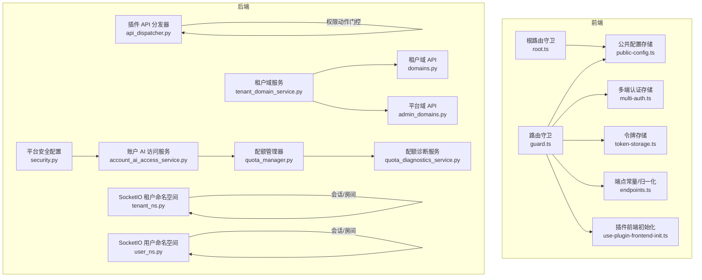
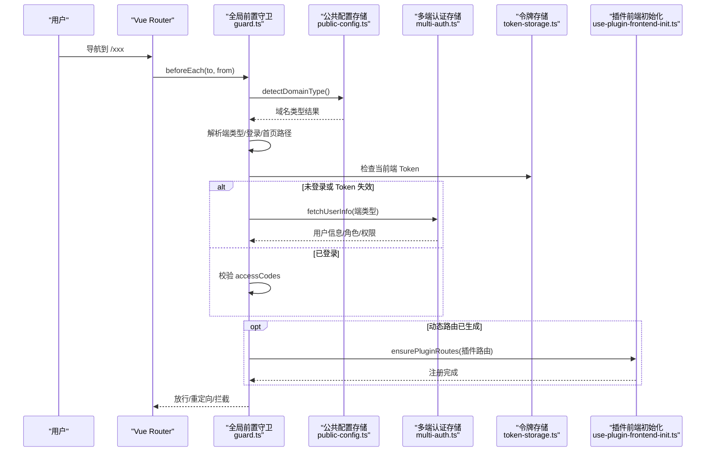
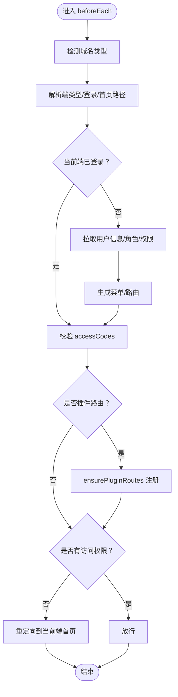
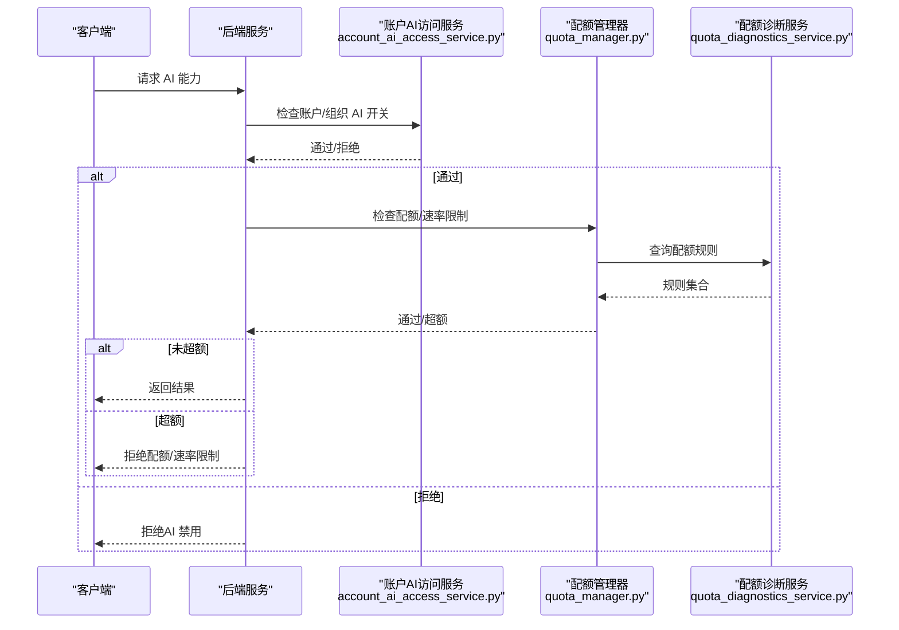
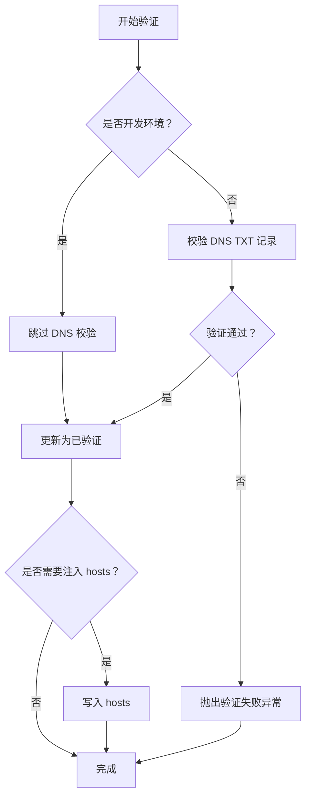
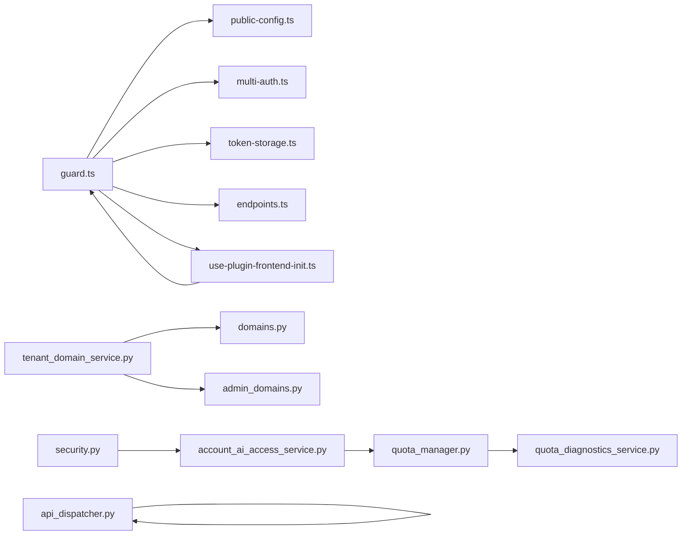

# 路由守卫

<cite>
**本文引用的文件**
- [guard.ts](file://frontend/apps/web-antd/src/router/guard.ts)
- [root.ts](file://frontend/apps/web-antd/src/router/routes/root.ts)
- [public-config.ts](file://frontend/apps/web-antd/src/store/shared/public-config.ts)
- [multi-auth.ts](file://frontend/apps/web-antd/src/store/shared/multi-auth.ts)
- [token-storage.ts](file://frontend/apps/web-antd/src/store/shared/token-storage.ts)
- [endpoints.ts](file://frontend/apps/web-antd/src/constants/endpoints.ts)
- [use-plugin-frontend-init.ts](file://frontend/apps/web-antd/src/composables/use-plugin-frontend-init.ts)
- [tenant_domain_service.py](file://backend/app/services/system/tenant_domain_service.py)
- [domains.py](file://backend/app/api/tenant/domains.py)
- [admin_domains.py](file://backend/app/api/admin/tenant_domains.py)
- [account_ai_access_service.py](file://backend/app/services/ai/account_ai_access_service.py)
- [quota_manager.py](file://backend/app/ai/quota_manager.py)
- [quota_diagnostics_service.py](file://backend/app/services/ai/quota_diagnostics_service.py)
- [security.py](file://backend/app/configs/definitions/platform/security.py)
- [api_dispatcher.py](file://backend/app/plugins/api_dispatcher.py)
- [tenant_ns.py](file://backend/app/sio/tenant_ns.py)
- [user_ns.py](file://backend/app/sio/user_ns.py)
</cite>

## 目录
1. [简介](#简介)
2. [项目结构](#项目结构)
3. [核心组件](#核心组件)
4. [架构总览](#架构总览)
5. [详细组件分析](#详细组件分析)
6. [依赖关系分析](#依赖关系分析)
7. [性能考量](#性能考量)
8. [故障排查指南](#故障排查指南)
9. [结论](#结论)
10. [附录](#附录)

## 简介
本文件系统化梳理 NovusAI SaaS 的路由守卫体系，覆盖前端全局前置守卫、路由独享守卫与组件内守卫的实现机制，详解权限验证流程、AI 能力访问控制与租户域名校验逻辑，明确导航拦截策略、重定向规则与错误处理机制，并给出 AI 入口策略、权限检查流程与用户状态管理的实现原理。同时提供执行顺序、性能优化建议、调试技巧以及自定义守卫开发指南与安全最佳实践。

## 项目结构
前端路由守卫集中在 web-antd 应用中，围绕 Vue Router 的 beforeEach 钩子构建统一的权限与入口策略；后端通过中间件与插件分发器实现 API 层权限与能力门控；域名校验与租户 SSL 流程由系统服务与 API 控制器协同完成；AI 能力访问控制贯穿账户级开关、配额与速率限制、运行时信任策略等环节。

图表来源
- [guard.ts:108-442](file://frontend/apps/web-antd/src/router/guard.ts#L108-L442)
- [root.ts:1-34](file://frontend/apps/web-antd/src/router/routes/root.ts#L1-L34)
- [public-config.ts:477-511](file://frontend/apps/web-antd/src/store/shared/public-config.ts#L477-L511)
- [multi-auth.ts:172-215](file://frontend/apps/web-antd/src/store/shared/multi-auth.ts#L172-L215)
- [token-storage.ts:154-188](file://frontend/apps/web-antd/src/store/shared/token-storage.ts#L154-L188)
- [endpoints.ts:224-262](file://frontend/apps/web-antd/src/constants/endpoints.ts#L224-L262)
- [use-plugin-frontend-init.ts:260-270](file://frontend/apps/web-antd/src/composables/use-plugin-frontend-init.ts#L260-L270)
- [api_dispatcher.py:249-289](file://backend/app/plugins/api_dispatcher.py#L249-L289)
- [tenant_domain_service.py:440-476](file://backend/app/services/system/tenant_domain_service.py#L440-L476)
- [domains.py:299-324](file://backend/app/api/tenant/domains.py#L299-L324)
- [admin_domains.py:196-219](file://backend/app/api/admin/tenant_domains.py#L196-L219)
- [account_ai_access_service.py:222-259](file://backend/app/services/ai/account_ai_access_service.py#L222-L259)
- [quota_manager.py:56-74](file://backend/app/ai/quota_manager.py#L56-L74)
- [quota_diagnostics_service.py:35-55](file://backend/app/services/ai/quota_diagnostics_service.py#L35-L55)
- [security.py:214-236](file://backend/app/configs/definitions/platform/security.py#L214-L236)
- [tenant_ns.py:101-132](file://backend/app/sio/tenant_ns.py#L101-L132)
- [user_ns.py:101-132](file://backend/app/sio/user_ns.py#L101-L132)

章节来源
- [guard.ts:108-442](file://frontend/apps/web-antd/src/router/guard.ts#L108-L442)
- [root.ts:1-34](file://frontend/apps/web-antd/src/router/routes/root.ts#L1-L34)

## 核心组件
- 全局前置守卫：负责端型识别、域名检测、端间导航拦截、登录态与权限校验、插件路由动态注入、重定向与兜底策略。
- 路由独享守卫：根路由的 beforeEnter 用于首屏入口分流（平台/租户）。
- 组件内守卫：通过路由 meta.accessCodes 与 accessCodesMode 实现细粒度权限控制。
- 后端权限门控：插件 API 分发器基于 permission/auth 字段进行动作权限校验。
- 域名校验与租户能力：系统服务与 API 控制器协作完成 DNS 验证、SSL 自动化与租户域可用性判定。
- AI 能力访问控制：账户级开关、配额/速率限制、运行时信任策略与会话/房间接入。

章节来源
- [guard.ts:108-442](file://frontend/apps/web-antd/src/router/guard.ts#L108-L442)
- [root.ts:15-30](file://frontend/apps/web-antd/src/router/routes/root.ts#L15-L30)
- [api_dispatcher.py:249-289](file://backend/app/plugins/api_dispatcher.py#L249-L289)
- [tenant_domain_service.py:440-476](file://backend/app/services/system/tenant_domain_service.py#L440-L476)

## 架构总览
路由守卫以“前端 + 后端”的双层防护实现安全与体验平衡：前端负责用户体验与端内一致性，后端负责强约束权限与能力边界。

图表来源
- [guard.ts:113-442](file://frontend/apps/web-antd/src/router/guard.ts#L113-L442)
- [public-config.ts:487-511](file://frontend/apps/web-antd/src/store/shared/public-config.ts#L487-L511)
- [multi-auth.ts:172-215](file://frontend/apps/web-antd/src/store/shared/multi-auth.ts#L172-L215)
- [token-storage.ts:154-188](file://frontend/apps/web-antd/src/store/shared/token-storage.ts#L154-L188)
- [use-plugin-frontend-init.ts:260-270](file://frontend/apps/web-antd/src/composables/use-plugin-frontend-init.ts#L260-L270)

## 详细组件分析

### 全局前置守卫（Access Guard）
- 端型与域名检测：通过公共配置存储进行幂等检测，结合端点解析函数确定当前端类型与登录/首页路径。
- 登录态与权限校验：优先使用已缓存用户信息，必要时拉取用户信息并生成菜单/路由；支持 accessCodes 与 accessCodesMode 的“任意/全部”模式。
- 端间导航拦截：当从平台域访问 admin 端或从租户域访问 user 端时，强制重定向至正确端的首页或登录页。
- 插件路由动态注入：对插件路径进行兜底注册，避免 404 或占位路由导致的白屏。
- 重定向与兜底：根据 redirect 参数、目标页与用户首页进行归一化重定向；异常时清理 Token 并跳转登录。

图表来源
- [guard.ts:113-442](file://frontend/apps/web-antd/src/router/guard.ts#L113-L442)
- [public-config.ts:487-511](file://frontend/apps/web-antd/src/store/shared/public-config.ts#L487-L511)
- [use-plugin-frontend-init.ts:260-270](file://frontend/apps/web-antd/src/composables/use-plugin-frontend-init.ts#L260-L270)

章节来源
- [guard.ts:108-442](file://frontend/apps/web-antd/src/router/guard.ts#L108-L442)

### 路由独享守卫（根路由）
- 根路由 beforeEnter：在首次导航时检测域名类型，若为租户域则直接重定向到用户端首页，否则放行。
- 作用：确保平台公共首页在租户域下不暴露给租户端用户，避免端混淆。

章节来源
- [root.ts:15-30](file://frontend/apps/web-antd/src/router/routes/root.ts#L15-L30)

### 组件内守卫（meta.accessCodes）
- 通过路由 meta.accessCodes 与 accessCodesMode（any/all）实现细粒度权限控制，支持通配符“*”代表超级管理员。
- 与全局守卫配合，形成“粗—细”两级权限过滤。

章节来源
- [guard.ts:119-136](file://frontend/apps/web-antd/src/router/guard.ts#L119-L136)

### 导航拦截策略与重定向规则
- 端间拦截：admin 与 user 端之间禁止跨端直跳，防止会话错配。
- 登录拦截：未登录访问受保护路由时，携带 redirect 参数跳转登录页，登录成功后按归一化路径回跳。
- 插件路由：插件页面在守卫中同步注册，避免 404 与重复跳转首页。
- 归一化路径：通过端点归一化函数保证跨端重定向的安全性与一致性。

章节来源
- [guard.ts:267-298](file://frontend/apps/web-antd/src/router/guard.ts#L267-L298)
- [guard.ts:413-441](file://frontend/apps/web-antd/src/router/guard.ts#L413-L441)
- [endpoints.ts:224-262](file://frontend/apps/web-antd/src/constants/endpoints.ts#L224-L262)

### 错误处理机制
- 用户信息拉取失败：清理当前端 Token，触发重定向登录，避免死循环。
- 插件路由注册失败：降级为重定向首页，记录警告日志。
- 权限不足：重定向到当前端首页或登录页，依据 ignoreAccess 控制是否放行。

章节来源
- [guard.ts:360-372](file://frontend/apps/web-antd/src/router/guard.ts#L360-L372)
- [guard.ts:424-435](file://frontend/apps/web-antd/src/router/guard.ts#L424-L435)

### AI 入口策略与权限检查流程
- 账户级 AI 开关：账户或组织层级禁用 AI 将抛出授权异常，阻止后续调用。
- 配额与速率限制：在调用前进行配额检查，未激活或超额将阻断请求。
- 运行时信任策略：根据会话/对话/操作者维度解析工具族与风险等级上限，限制高风险能力。
- 会话与房间接入：SocketIO 命名空间在建立连接时校验用户状态并加入相应房间，保障实时通道安全。

图表来源
- [account_ai_access_service.py:222-259](file://backend/app/services/ai/account_ai_access_service.py#L222-L259)
- [quota_manager.py:56-74](file://backend/app/ai/quota_manager.py#L56-L74)
- [quota_diagnostics_service.py:35-55](file://backend/app/services/ai/quota_diagnostics_service.py#L35-L55)

章节来源
- [account_ai_access_service.py:222-259](file://backend/app/services/ai/account_ai_access_service.py#L222-L259)
- [quota_manager.py:56-74](file://backend/app/ai/quota_manager.py#L56-L74)
- [quota_diagnostics_service.py:35-55](file://backend/app/services/ai/quota_diagnostics_service.py#L35-L55)

### 租户域名校验逻辑
- DNS TXT 记录验证：服务层在非开发环境执行 DNS 校验，开发环境可跳过；验证通过后更新域名为已验证状态并可选注入 hosts。
- 平台与租户域 API：提供租户域验证与 CNAME 目标查询，支持自动 SSL 启动后的状态反馈。
- 安全与合规：未验证域名不可用于生产流量，避免伪造或未授权使用。

图表来源
- [tenant_domain_service.py:440-476](file://backend/app/services/system/tenant_domain_service.py#L440-L476)
- [domains.py:299-324](file://backend/app/api/tenant/domains.py#L299-L324)
- [admin_domains.py:196-219](file://backend/app/api/admin/tenant_domains.py#L196-L219)

章节来源
- [tenant_domain_service.py:440-476](file://backend/app/services/system/tenant_domain_service.py#L440-L476)
- [domains.py:299-324](file://backend/app/api/tenant/domains.py#L299-L324)
- [admin_domains.py:196-219](file://backend/app/api/admin/tenant_domains.py#L196-L219)

### 后端权限门控（插件 API 分发器）
- 路由声明 permission 字段时，必须具备对应动作权限才可访问；未声明且非公开路由将被拒绝。
- 结合用户角色与租户上下文进行权限核验，记录拒绝原因便于审计。

章节来源
- [api_dispatcher.py:249-289](file://backend/app/plugins/api_dispatcher.py#L249-L289)

### 用户状态管理与会话安全
- 多端 Token 管理：不同端（admin/tenant/user）维护独立 Token，登出/失效时按端清理。
- 登录成功后持久化用户信息与偏好设置，确保端内一致性。
- SocketIO 命名空间在连接时校验用户有效性并加入房间，保障实时通道安全。

章节来源
- [multi-auth.ts:172-215](file://frontend/apps/web-antd/src/store/shared/multi-auth.ts#L172-L215)
- [token-storage.ts:154-188](file://frontend/apps/web-antd/src/store/shared/token-storage.ts#L154-L188)
- [tenant_ns.py:101-132](file://backend/app/sio/tenant_ns.py#L101-L132)
- [user_ns.py:101-132](file://backend/app/sio/user_ns.py#L101-L132)

## 依赖关系分析
- 前端守卫依赖公共配置存储进行域名检测，依赖多端认证存储获取用户信息，依赖令牌存储判断登录态，依赖端点归一化函数保证跨端安全。
- 插件前端初始化在守卫中被幂等调用，确保插件路由在导航时可用。
- 后端插件分发器依赖路由声明的权限字段进行动作级门控。
- 域名验证服务与 API 控制器共同完成租户域可用性与 SSL 状态管理。
- AI 能力访问控制贯穿账户服务、配额与诊断服务、运行时信任策略与会话/房间接入。

图表来源
- [guard.ts:108-442](file://frontend/apps/web-antd/src/router/guard.ts#L108-L442)
- [public-config.ts:487-511](file://frontend/apps/web-antd/src/store/shared/public-config.ts#L487-L511)
- [multi-auth.ts:172-215](file://frontend/apps/web-antd/src/store/shared/multi-auth.ts#L172-L215)
- [token-storage.ts:154-188](file://frontend/apps/web-antd/src/store/shared/token-storage.ts#L154-L188)
- [endpoints.ts:224-262](file://frontend/apps/web-antd/src/constants/endpoints.ts#L224-L262)
- [use-plugin-frontend-init.ts:260-270](file://frontend/apps/web-antd/src/composables/use-plugin-frontend-init.ts#L260-L270)
- [api_dispatcher.py:249-289](file://backend/app/plugins/api_dispatcher.py#L249-L289)
- [tenant_domain_service.py:440-476](file://backend/app/services/system/tenant_domain_service.py#L440-L476)
- [domains.py:299-324](file://backend/app/api/tenant/domains.py#L299-L324)
- [admin_domains.py:196-219](file://backend/app/api/admin/tenant_domains.py#L196-L219)
- [account_ai_access_service.py:222-259](file://backend/app/services/ai/account_ai_access_service.py#L222-L259)
- [quota_manager.py:56-74](file://backend/app/ai/quota_manager.py#L56-L74)
- [quota_diagnostics_service.py:35-55](file://backend/app/services/ai/quota_diagnostics_service.py#L35-L55)
- [security.py:214-236](file://backend/app/configs/definitions/platform/security.py#L214-L236)

## 性能考量
- 幂等域名检测：公共配置存储对域名检测进行去重与幂等控制，避免重复网络请求。
- 动态路由生成缓存：已生成的动态路由与权限码缓存于访问存储，减少重复计算。
- 插件路由注册：在守卫中同步注册，避免异步回调导致的闪烁与二次导航。
- 会话超时配置：平台会话超时参数影响 JWT 有效期与活跃会话，建议合理设置以平衡安全与体验。

章节来源
- [public-config.ts:487-511](file://frontend/apps/web-antd/src/store/shared/public-config.ts#L487-L511)
- [guard.ts:328-350](file://frontend/apps/web-antd/src/router/guard.ts#L328-L350)
- [security.py:214-236](file://backend/app/configs/definitions/platform/security.py#L214-L236)

## 故障排查指南
- 登录后仍被重定向到登录页：检查 Token 是否正确写入与端点归一化路径；确认 ignoreAccess 与 redirect 参数处理。
- 插件页面 404 或白屏：确认插件前端初始化是否在守卫中被调用并注册；查看注册异常日志。
- 权限不足导致拦截：核对路由 meta.accessCodes 与用户权限码集合；确认 accessCodesMode 设置。
- 域名验证失败：检查 DNS TXT 记录与验证流程；开发环境可跳过 DNS 校验但需注意 hosts 注入。
- SocketIO 连接被拒：确认用户状态与租户有效性；检查命名空间会话保存与房间加入逻辑。

章节来源
- [guard.ts:360-372](file://frontend/apps/web-antd/src/router/guard.ts#L360-L372)
- [guard.ts:424-435](file://frontend/apps/web-antd/src/router/guard.ts#L424-L435)
- [tenant_domain_service.py:440-476](file://backend/app/services/system/tenant_domain_service.py#L440-L476)
- [tenant_ns.py:101-132](file://backend/app/sio/tenant_ns.py#L101-L132)
- [user_ns.py:101-132](file://backend/app/sio/user_ns.py#L101-L132)

## 结论
NovusAI SaaS 的路由守卫体系通过“前端 + 后端”的双层防护，实现了端内一致性、跨端安全拦截、细粒度权限控制与 AI 能力的强约束访问。域名检测、插件路由动态注入、归一化重定向与错误兜底共同保障了用户体验与安全性。建议在扩展新功能时遵循现有守卫模式，确保权限与能力边界清晰、可审计、可维护。

## 附录

### 路由守卫执行顺序
- 域名检测与端型解析
- 登录态与用户信息获取
- 动态路由与权限码生成
- 组件内 accessCodes 校验
- 插件路由动态注入
- 重定向与放行

章节来源
- [guard.ts:113-442](file://frontend/apps/web-antd/src/router/guard.ts#L113-L442)

### 自定义守卫开发指南
- 前端
  - 使用 meta.accessCodes 与 accessCodesMode 定义路由权限。
  - 在全局守卫中处理端间拦截与重定向。
  - 对插件路由使用 ensurePluginRoutes 进行幂等注册。
- 后端
  - 在插件路由声明 permission 字段，确保动作级权限校验。
  - 结合用户角色与租户上下文进行权限核验。

章节来源
- [guard.ts:119-136](file://frontend/apps/web-antd/src/router/guard.ts#L119-L136)
- [api_dispatcher.py:249-289](file://backend/app/plugins/api_dispatcher.py#L249-L289)

### 安全最佳实践
- 严格区分 admin/tenant/user 端，避免跨端直跳。
- 使用通配符“*”仅授予超级管理员，其他角色按最小权限分配。
- 对敏感 AI 能力启用配额/速率限制与运行时信任策略。
- 租户域名校验必须通过 DNS 校验，开发环境除外。
- 会话超时与 Token 生命周期应与平台配置保持一致。

章节来源
- [guard.ts:267-298](file://frontend/apps/web-antd/src/router/guard.ts#L267-L298)
- [account_ai_access_service.py:222-259](file://backend/app/services/ai/account_ai_access_service.py#L222-L259)
- [tenant_domain_service.py:440-476](file://backend/app/services/system/tenant_domain_service.py#L440-L476)
- [security.py:214-236](file://backend/app/configs/definitions/platform/security.py#L214-L236)