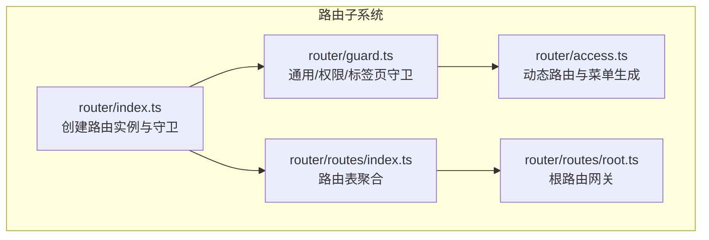
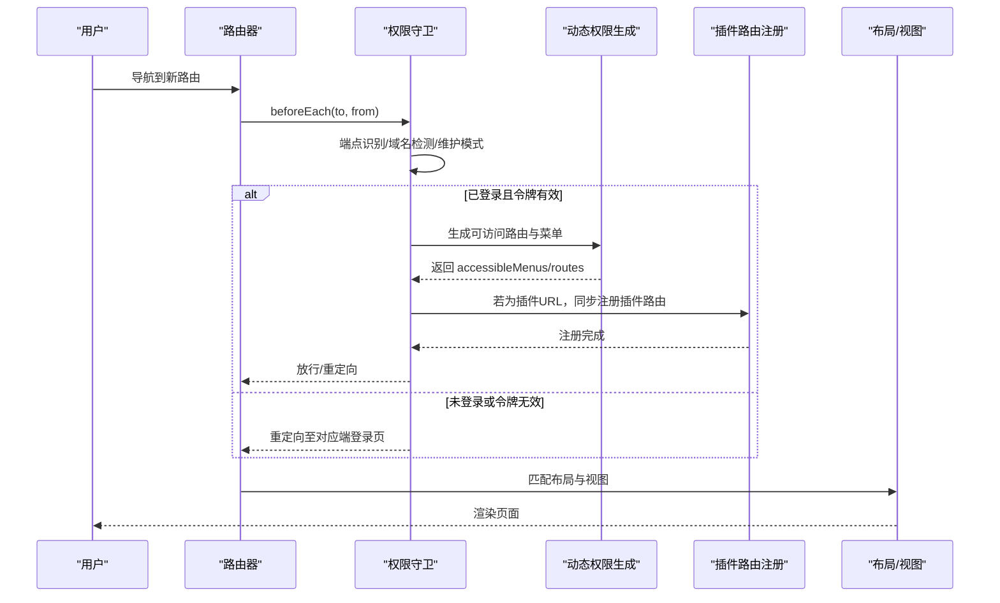
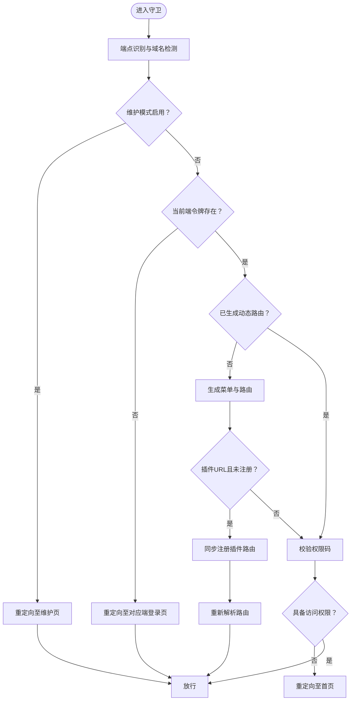
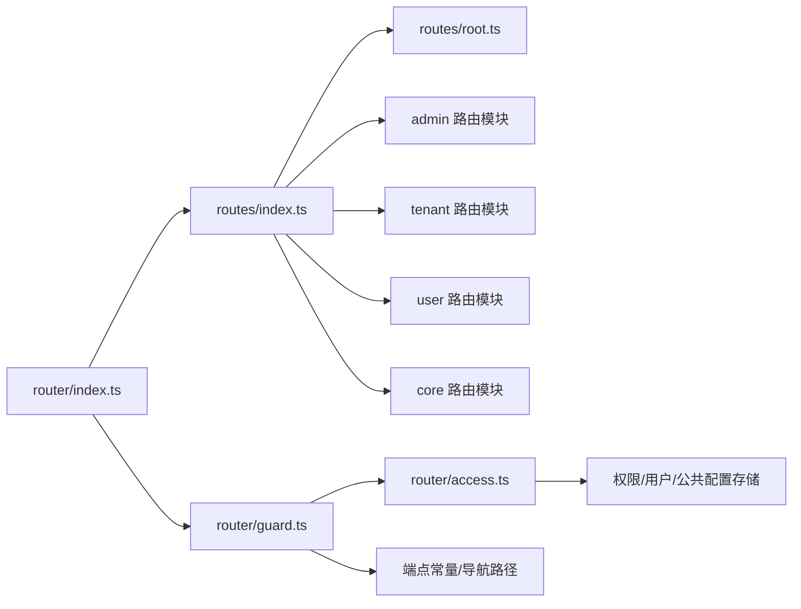

# 路由系统

<cite>
**本文引用的文件**
- [apps/web-antd/src/router/index.ts](file://frontend/apps/web-antd/src/router/index.ts)
- [apps/web-antd/src/router/guard.ts](file://frontend/apps/web-antd/src/router/guard.ts)
- [apps/web-antd/src/router/access.ts](file://frontend/apps/web-antd/src/router/access.ts)
- [apps/web-antd/src/router/routes/index.ts](file://frontend/apps/web-antd/src/router/routes/index.ts)
- [apps/web-antd/src/router/routes/root.ts](file://frontend/apps/web-antd/src/router/routes/root.ts)
</cite>

## 目录
1. [简介](#简介)
2. [项目结构](#项目结构)
3. [核心组件](#核心组件)
4. [架构总览](#架构总览)
5. [详细组件分析](#详细组件分析)
6. [依赖关系分析](#依赖关系分析)
7. [性能考量](#性能考量)
8. [故障排查指南](#故障排查指南)
9. [结论](#结论)
10. [附录](#附录)

## 简介
本文件系统性梳理 NovusAI SaaS 的前端路由体系，覆盖 Vue Router 的配置架构、路由表设计、嵌套路由与动态路由生成、路由守卫的实现机制（权限验证与导航拦截）、布局系统组织、页面切换动画与面包屑、懒加载与代码分割、预加载策略、路由参数与查询字符串处理、历史记录管理，以及开发规范、SEO 优化与用户体验提升建议。内容面向不同技术背景读者，既提供高层概览也包含深入的技术细节与可视化图示。

## 项目结构
前端路由位于应用工程的路由子系统中，采用“按端点聚合”的模块化组织方式：
- 路由入口与实例：负责创建路由实例、挂载滚动行为与守卫。
- 守卫模块：统一管理通用守卫、权限守卫与标签页隔离守卫。
- 动态权限生成：基于后端菜单与权限码生成可访问的菜单与路由。
- 路由表聚合：将 core、admin、tenant、root、user 等路由模块合并为最终路由表，并导出核心路由名称集合。

图表来源
- [apps/web-antd/src/router/index.ts:16-31](file://frontend/apps/web-antd/src/router/index.ts#L16-L31)
- [apps/web-antd/src/router/guard.ts:496-503](file://frontend/apps/web-antd/src/router/guard.ts#L496-L503)
- [apps/web-antd/src/router/access.ts:93-139](file://frontend/apps/web-antd/src/router/access.ts#L93-L139)
- [apps/web-antd/src/router/routes/index.ts:14-21](file://frontend/apps/web-antd/src/router/routes/index.ts#L14-L21)
- [apps/web-antd/src/router/routes/root.ts:5-31](file://frontend/apps/web-antd/src/router/routes/root.ts#L5-L31)

章节来源
- [apps/web-antd/src/router/index.ts:1-39](file://frontend/apps/web-antd/src/router/index.ts#L1-L39)
- [apps/web-antd/src/router/routes/index.ts:1-35](file://frontend/apps/web-antd/src/router/routes/index.ts#L1-L35)
- [apps/web-antd/src/router/routes/root.ts:1-35](file://frontend/apps/web-antd/src/router/routes/root.ts#L1-L35)

## 核心组件
- 路由实例与历史模式
  - 支持 Hash 与 HTML5 History 两种历史模式，通过环境变量控制基础路径。
  - 默认滚动行为：支持保存位置与锚点平滑滚动。
- 路由表聚合
  - 合并 core、admin、tenant、root、user 路由模块，并注入 404 回退路由。
  - 提供核心路由名称集合，用于绕过权限拦截。
- 守卫体系
  - 通用守卫：首屏进度条、页面加载标记。
  - 权限守卫：端点识别、域名检测、维护模式、令牌校验、动态路由生成、插件路由同步注册、跨端重定向安全。
  - 标签页守卫：端点隔离，批量关闭非当前端标签页。
- 动态权限生成
  - 基于后端菜单与权限码生成可访问路由与菜单。
  - 管理端静态子路由补全，避免后端重建后丢失。
  - 组件与布局映射、403 组件替换。

章节来源
- [apps/web-antd/src/router/index.ts:16-31](file://frontend/apps/web-antd/src/router/index.ts#L16-L31)
- [apps/web-antd/src/router/routes/index.ts:14-30](file://frontend/apps/web-antd/src/router/routes/index.ts#L14-L30)
- [apps/web-antd/src/router/guard.ts:57-81](file://frontend/apps/web-antd/src/router/guard.ts#L57-L81)
- [apps/web-antd/src/router/guard.ts:113-442](file://frontend/apps/web-antd/src/router/guard.ts#L113-L442)
- [apps/web-antd/src/router/guard.ts:451-489](file://frontend/apps/web-antd/src/router/guard.ts#L451-L489)
- [apps/web-antd/src/router/access.ts:93-139](file://frontend/apps/web-antd/src/router/access.ts#L93-L139)

## 架构总览
路由系统围绕“端点感知 + 动态权限 + 守卫拦截 + 布局渲染”展开，形成如下闭环：
- 端点识别：根据路径与域名检测确定 admin、tenant、user。
- 权限生成：拉取后端菜单与权限码，生成可访问路由树。
- 导航拦截：在 beforeEach 中完成令牌、维护模式、跨端重定向、插件路由注册等。
- 布局渲染：根据路由元信息选择布局与隐藏策略，配合标签页与面包屑。

图表来源
- [apps/web-antd/src/router/guard.ts:113-442](file://frontend/apps/web-antd/src/router/guard.ts#L113-L442)
- [apps/web-antd/src/router/access.ts:93-139](file://frontend/apps/web-antd/src/router/access.ts#L93-L139)
- [apps/web-antd/src/router/guard.ts:332-345](file://frontend/apps/web-antd/src/router/guard.ts#L332-L345)

## 详细组件分析

### 路由实例与历史模式
- 历史模式选择：通过环境变量决定 Hash 或 HTML5 History，并支持自定义基础路径。
- 滚动行为：优先恢复历史位置；否则平滑滚动到锚点或顶部。
- 重置静态路由：提供重置静态路由的能力，便于运行时刷新路由表。

章节来源
- [apps/web-antd/src/router/index.ts:16-31](file://frontend/apps/web-antd/src/router/index.ts#L16-L31)
- [apps/web-antd/src/router/index.ts:33-38](file://frontend/apps/web-antd/src/router/index.ts#L33-L38)

### 路由表设计与端点聚合
- 聚合策略：将 core、admin、tenant、root、user 路由模块合并为单一数组，末尾附加 404 回退路由。
- 核心路由名称：遍历所有核心路由名称，用于绕过权限拦截。
- 端点路由：admin、tenant、user 分别定义其专属路由树，root 定义根网关路由。

章节来源
- [apps/web-antd/src/router/routes/index.ts:14-30](file://frontend/apps/web-antd/src/router/routes/index.ts#L14-L30)
- [apps/web-antd/src/router/routes/root.ts:5-31](file://frontend/apps/web-antd/src/router/routes/root.ts#L5-L31)

### 根路由网关与端点分流
- 根路由：作为平台公共首页网关，依据域名检测结果将租户域重定向到用户端首页。
- 元信息：隐藏面包屑、菜单与标签页，标题国际化键值。

章节来源
- [apps/web-antd/src/router/routes/root.ts:5-31](file://frontend/apps/web-antd/src/router/routes/root.ts#L5-L31)

### 守卫体系与导航拦截
- 通用守卫
  - 首次访问开启进度条，afterEach 结束进度条。
  - 标记页面是否已加载，避免重复执行入场动画等副作用。
- 权限守卫
  - 端点识别与域名检测：支持平台域与租户域的端点切换。
  - 维护模式：非管理员与非登录页被重定向至维护页，维护关闭后自动回到首页。
  - 令牌校验：多端独立存储令牌，核心路由可绕过完整权限流程。
  - 动态路由生成：首次访问时拉取后端菜单与权限码，生成可访问路由树。
  - 插件路由同步注册：当目标为插件 URL 且尚未注册时，在守卫中无感注册并重解析。
  - 跨端重定向安全：防止跨端重定向导致的死循环。
- 标签页守卫
  - 端点隔离：批量关闭非当前端的标签页，保证标签页与端点一致。

图表来源
- [apps/web-antd/src/router/guard.ts:113-442](file://frontend/apps/web-antd/src/router/guard.ts#L113-L442)
- [apps/web-antd/src/router/guard.ts:451-489](file://frontend/apps/web-antd/src/router/guard.ts#L451-L489)

章节来源
- [apps/web-antd/src/router/guard.ts:57-81](file://frontend/apps/web-antd/src/router/guard.ts#L57-L81)
- [apps/web-antd/src/router/guard.ts:113-442](file://frontend/apps/web-antd/src/router/guard.ts#L113-L442)
- [apps/web-antd/src/router/guard.ts:451-489](file://frontend/apps/web-antd/src/router/guard.ts#L451-L489)

### 动态路由生成与权限校验
- 组件与布局映射：通过 import.meta.glob 收集视图组件，结合布局组件构建路由树。
- 后端菜单与权限码：拉取菜单与权限码，作为权限校验的权威快照，避免套餐降级后旧权限残留。
- 管理端静态子路由补全：在后端重建 AdminRoot 后，补回静态子路由，确保功能完整性。
- 403 组件替换：当路由受限但菜单仍可见时，可保留菜单项并展示禁止页面。

章节来源
- [apps/web-antd/src/router/access.ts:93-139](file://frontend/apps/web-antd/src/router/access.ts#L93-L139)
- [apps/web-antd/src/router/access.ts:42-67](file://frontend/apps/web-antd/src/router/access.ts#L42-L67)

### 嵌套路由与布局系统
- 布局组件：BasicLayout、UserLayout、IFrameView 等布局组件按需懒加载。
- 嵌套策略：通过路由 children 定义子路由，结合布局组件实现页面骨架与内容区域的分层。
- 元信息控制：hideInMenu、hideInBreadcrumb、hideInTab 等元信息控制菜单、面包屑与标签页的显示。

章节来源
- [apps/web-antd/src/router/access.ts:103-107](file://frontend/apps/web-antd/src/router/access.ts#L103-L107)
- [apps/web-antd/src/router/routes/root.ts:9-14](file://frontend/apps/web-antd/src/router/routes/root.ts#L9-L14)

### 页面切换动画与面包屑
- 切换动画：通过通用守卫中的 loaded 标记与进度条，配合布局与视图组件实现平滑过渡。
- 面包屑：路由元信息 hideInBreadcrumb 控制是否显示；结合布局组件的面包屑渲染逻辑实现层级导航。

章节来源
- [apps/web-antd/src/router/guard.ts:57-81](file://frontend/apps/web-antd/src/router/guard.ts#L57-L81)
- [apps/web-antd/src/router/routes/root.ts:9-14](file://frontend/apps/web-antd/src/router/routes/root.ts#L9-L14)

### 路由懒加载、代码分割与预加载
- 懒加载：视图组件与部分布局组件通过动态导入实现按需加载。
- 代码分割：按端点与功能模块拆分路由，减少初始包体积。
- 预加载：在守卫中对插件路由进行同步注册，避免首次访问时的延迟。

章节来源
- [apps/web-antd/src/router/access.ts:97-101](file://frontend/apps/web-antd/src/router/access.ts#L97-L101)
- [apps/web-antd/src/router/guard.ts:332-345](file://frontend/apps/web-antd/src/router/guard.ts#L332-L345)

### 路由参数传递、查询字符串处理与历史记录
- 路由参数：通过动态段与元信息 accessCodes、accessCodesMode 实现细粒度权限控制。
- 查询字符串：登录页重定向携带 redirect 参数，维护模式下通过 query.from 传递端点信息。
- 历史记录：滚动行为支持保存位置与锚点，保障用户阅读体验。

章节来源
- [apps/web-antd/src/router/guard.ts:309-314](file://frontend/apps/web-antd/src/router/guard.ts#L309-L314)
- [apps/web-antd/src/router/guard.ts:239-247](file://frontend/apps/web-antd/src/router/guard.ts#L239-L247)
- [apps/web-antd/src/router/index.ts:23-28](file://frontend/apps/web-antd/src/router/index.ts#L23-L28)

## 依赖关系分析
- 路由实例依赖路由表模块与守卫模块。
- 守卫模块依赖权限存储、用户存储、多认证存储、公共配置存储与端点常量。
- 动态权限生成依赖偏好设置、访问模式、后端菜单 API 与组件/布局映射。
- 路由表模块依赖各端路由定义与 404 回退路由。

图表来源
- [apps/web-antd/src/router/routes/index.ts:6-11](file://frontend/apps/web-antd/src/router/routes/index.ts#L6-L11)
- [apps/web-antd/src/router/index.ts:9-10](file://frontend/apps/web-antd/src/router/index.ts#L9-L10)
- [apps/web-antd/src/router/guard.ts:10-18](file://frontend/apps/web-antd/src/router/guard.ts#L10-L18)
- [apps/web-antd/src/router/access.ts:10-12](file://frontend/apps/web-antd/src/router/access.ts#L10-L12)

章节来源
- [apps/web-antd/src/router/routes/index.ts:1-35](file://frontend/apps/web-antd/src/router/routes/index.ts#L1-L35)
- [apps/web-antd/src/router/index.ts:1-39](file://frontend/apps/web-antd/src/router/index.ts#L1-L39)
- [apps/web-antd/src/router/guard.ts:1-506](file://frontend/apps/web-antd/src/router/guard.ts#L1-L506)
- [apps/web-antd/src/router/access.ts:1-153](file://frontend/apps/web-antd/src/router/access.ts#L1-L153)

## 性能考量
- 懒加载与代码分割：按端点与功能模块拆分路由，减少首屏负载。
- 动态权限生成：仅在首次访问时拉取后端菜单与权限码，后续复用。
- 插件路由同步注册：在守卫中无感注册，避免首次访问卡顿。
- 进度条与滚动行为：合理使用进度条与锚点滚动，平衡用户体验与性能。

## 故障排查指南
- 登录循环或跨端重定向异常
  - 检查重定向参数 redirect 与目标端令牌状态，确保跨端重定向安全。
- 维护模式下无法访问后台
  - 管理端路由应绕过维护模式拦截，确认端点识别正确。
- 插件路由 404
  - 确认守卫中插件路由同步注册逻辑已触发，必要时手动触发注册。
- 端点切换后权限残留
  - 确认端点切换时已重置权限状态并重新生成路由。

章节来源
- [apps/web-antd/src/router/guard.ts:268-298](file://frontend/apps/web-antd/src/router/guard.ts#L268-L298)
- [apps/web-antd/src/router/guard.ts:225-248](file://frontend/apps/web-antd/src/router/guard.ts#L225-L248)
- [apps/web-antd/src/router/guard.ts:332-345](file://frontend/apps/web-antd/src/router/guard.ts#L332-L345)
- [apps/web-antd/src/router/guard.ts:250-262](file://frontend/apps/web-antd/src/router/guard.ts#L250-L262)

## 结论
NovusAI SaaS 的路由系统以“端点感知 + 动态权限 + 守卫拦截”为核心，结合懒加载、代码分割与插件路由同步注册，实现了高可用、可扩展且用户体验友好的导航体系。通过清晰的模块划分与严格的导航拦截策略，系统在多端场景下保持了良好的一致性与安全性。

## 附录
- 开发规范
  - 路由命名：采用语义化命名，区分 core、admin、tenant、user 端路由。
  - 权限元信息：在路由 meta 中明确 accessCodes、accessCodesMode、hideInMenu/Breadcrumb/Tab 等。
  - 动态路由：新增菜单项需同步后端权限，确保动态生成准确。
- SEO 优化
  - 使用国际化标题键值，结合布局组件实现页面标题与描述的动态更新。
  - 对公开首页与静态页面设置合理的 canonical 与 noindex 策略。
- 用户体验提升
  - 合理使用进度条与锚点滚动，避免长列表跳转带来的视觉突兀。
  - 在插件路由与复杂页面中提供加载提示与骨架屏，改善感知性能。