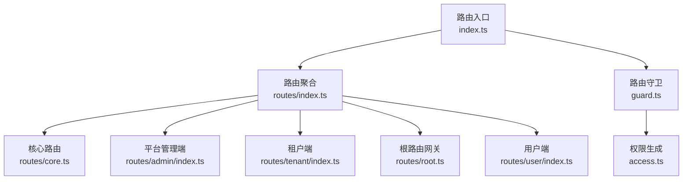
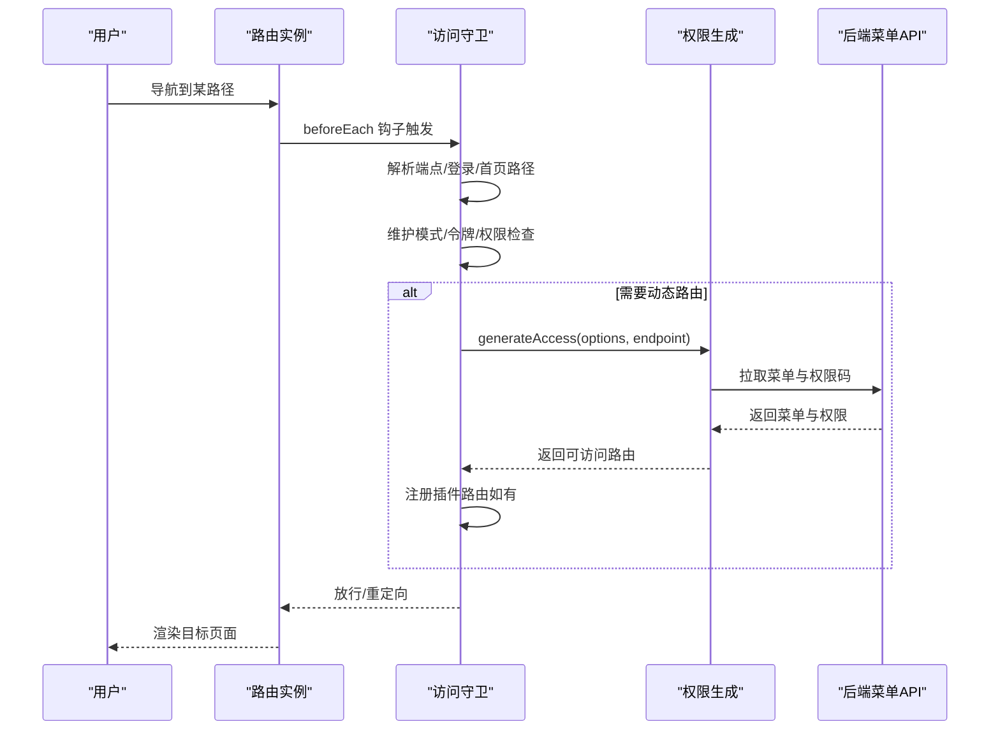
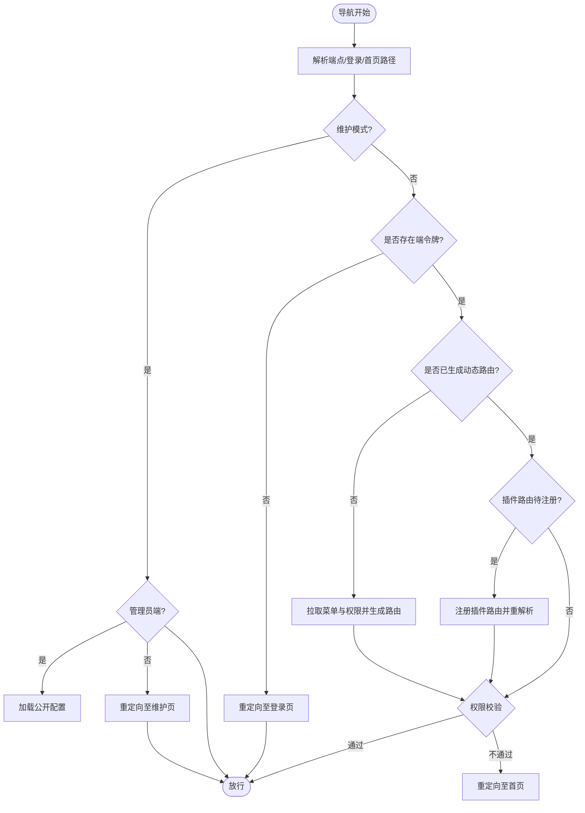
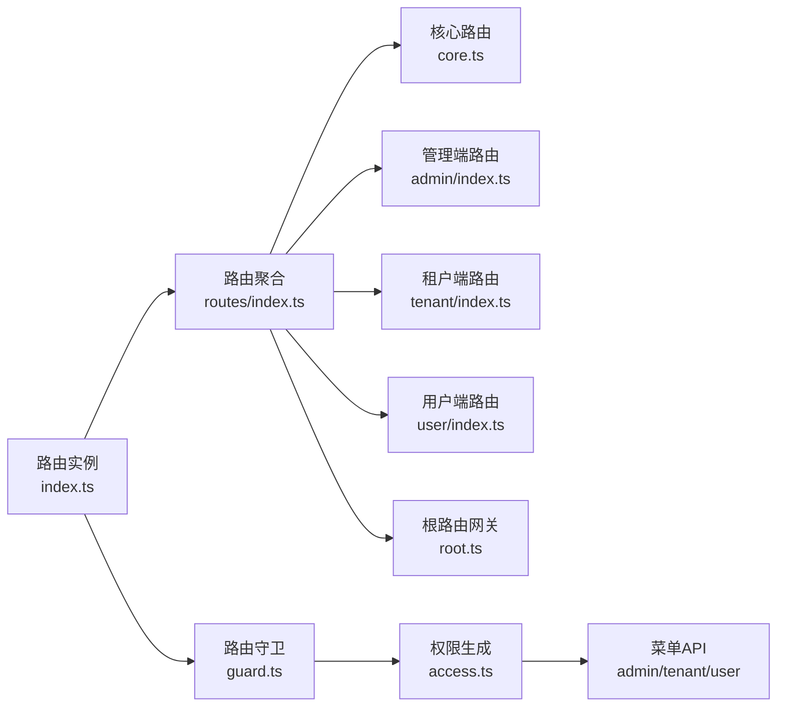

# 路由配置

<cite>
**本文引用的文件**
- [frontend/apps/web-antd/src/router/index.ts](file://frontend/apps/web-antd/src/router/index.ts)
- [frontend/apps/web-antd/src/router/routes/index.ts](file://frontend/apps/web-antd/src/router/routes/index.ts)
- [frontend/apps/web-antd/src/router/routes/core.ts](file://frontend/apps/web-antd/src/router/routes/core.ts)
- [frontend/apps/web-antd/src/router/routes/root.ts](file://frontend/apps/web-antd/src/router/routes/root.ts)
- [frontend/apps/web-antd/src/router/routes/admin/index.ts](file://frontend/apps/web-antd/src/router/routes/admin/index.ts)
- [frontend/apps/web-antd/src/router/routes/tenant/index.ts](file://frontend/apps/web-antd/src/router/routes/tenant/index.ts)
- [frontend/apps/web-antd/src/router/routes/tenant/names.ts](file://frontend/apps/web-antd/src/router/routes/tenant/names.ts)
- [frontend/apps/web-antd/src/router/routes/user/index.ts](file://frontend/apps/web-antd/src/router/routes/user/index.ts)
- [frontend/apps/web-antd/src/router/guard.ts](file://frontend/apps/web-antd/src/router/guard.ts)
- [frontend/apps/web-antd/src/router/access.ts](file://frontend/apps/web-antd/src/router/access.ts)
- [frontend/apps/web-antd/src/views/admin/ai/agents/detail-shell.vue](file://frontend/apps/web-antd/src/views/admin/ai/agents/detail-shell.vue)
</cite>

## 目录
1. [简介](#简介)
2. [项目结构](#项目结构)
3. [核心组件](#核心组件)
4. [架构总览](#架构总览)
5. [详细组件分析](#详细组件分析)
6. [依赖关系分析](#依赖关系分析)
7. [性能考量](#性能考量)
8. [故障排查指南](#故障排查指南)
9. [结论](#结论)
10. [附录](#附录)

## 简介
本文件面向 NovusAI SaaS 的前端路由体系，系统性梳理 Vue Router 的配置架构与运行机制，重点覆盖以下方面：
- 路由表的层级结构设计与模块化组织
- 路由元信息（meta）配置与权限控制策略
- 管理员、租户、用户三端路由分组与导航行为
- 路由参数、查询参数、重定向与通配符处理
- 动态路由参数、通配符与别名的使用
- 路由懒加载、代码分割与性能优化
- 路由守卫链路、端点识别与品牌配置联动
- 最佳实践与常见问题解决方案

## 项目结构
前端路由位于 web-antd 应用的 router 目录，采用“模块化 + 分层”的组织方式：
- 路由入口与历史模式选择：在路由实例创建时根据环境变量决定使用 Hash 或 HTML5 History，并统一注入滚动行为与严格模式注释。
- 路由聚合：将核心路由、平台管理端、租户端、根路由、用户端路由合并为最终路由表，并导出路由名称集合。
- 守卫与权限：在路由实例创建后挂载通用守卫、访问守卫与标签页隔离守卫。

图表来源
- [frontend/apps/web-antd/src/router/index.ts:1-39](file://frontend/apps/web-antd/src/router/index.ts#L1-L39)
- [frontend/apps/web-antd/src/router/routes/index.ts:1-35](file://frontend/apps/web-antd/src/router/routes/index.ts#L1-L35)
- [frontend/apps/web-antd/src/router/routes/core.ts:1-112](file://frontend/apps/web-antd/src/router/routes/core.ts#L1-L112)
- [frontend/apps/web-antd/src/router/routes/admin/index.ts:1-158](file://frontend/apps/web-antd/src/router/routes/admin/index.ts#L1-L158)
- [frontend/apps/web-antd/src/router/routes/tenant/index.ts:1-104](file://frontend/apps/web-antd/src/router/routes/tenant/index.ts#L1-L104)
- [frontend/apps/web-antd/src/router/routes/root.ts:1-35](file://frontend/apps/web-antd/src/router/routes/root.ts#L1-L35)
- [frontend/apps/web-antd/src/router/routes/user/index.ts:1-99](file://frontend/apps/web-antd/src/router/routes/user/index.ts#L1-L99)
- [frontend/apps/web-antd/src/router/guard.ts:1-506](file://frontend/apps/web-antd/src/router/guard.ts#L1-L506)
- [frontend/apps/web-antd/src/router/access.ts:1-153](file://frontend/apps/web-antd/src/router/access.ts#L1-L153)

章节来源
- [frontend/apps/web-antd/src/router/index.ts:1-39](file://frontend/apps/web-antd/src/router/index.ts#L1-L39)
- [frontend/apps/web-antd/src/router/routes/index.ts:1-35](file://frontend/apps/web-antd/src/router/routes/index.ts#L1-L35)

## 核心组件
- 路由实例与历史模式
  - 支持 Hash 与 HTML5 History 两种模式，可通过环境变量切换；默认启用滚动行为，支持锚点平滑滚动。
  - 提供重置静态路由的能力，便于运行时刷新路由表。
- 路由表聚合
  - 将 core、admin、tenant、root、user 五类路由合并为最终表，并导出核心路由名称集合（绕过权限拦截）。
- 路由守卫
  - 通用守卫：记录页面加载状态、控制首屏进度条。
  - 访问守卫：端点识别、登录/首页路径解析、维护模式、令牌与权限校验、动态路由生成与插件路由同步注册。
  - 标签页隔离守卫：按端点隔离标签页，避免跨端标签混杂。
- 权限生成
  - 基于后端菜单与权限码生成可访问菜单与路由，支持管理端静态子路由的回补，确保特定页面（如代码生成器）可用。

章节来源
- [frontend/apps/web-antd/src/router/index.ts:16-31](file://frontend/apps/web-antd/src/router/index.ts#L16-L31)
- [frontend/apps/web-antd/src/router/routes/index.ts:14-34](file://frontend/apps/web-antd/src/router/routes/index.ts#L14-L34)
- [frontend/apps/web-antd/src/router/guard.ts:57-81](file://frontend/apps/web-antd/src/router/guard.ts#L57-L81)
- [frontend/apps/web-antd/src/router/guard.ts:113-442](file://frontend/apps/web-antd/src/router/guard.ts#L113-L442)
- [frontend/apps/web-antd/src/router/guard.ts:451-489](file://frontend/apps/web-antd/src/router/guard.ts#L451-L489)
- [frontend/apps/web-antd/src/router/access.ts:93-139](file://frontend/apps/web-antd/src/router/access.ts#L93-L139)

## 架构总览
路由系统围绕“端点识别 + 权限校验 + 动态路由生成”展开，形成如下闭环：
- 路由入口负责创建实例与注入守卫
- 守卫在每次导航前进行端点判定、令牌与权限检查、动态路由生成
- 权限生成模块从后端拉取菜单与权限码，构建可访问路由树
- 根路由网关根据域名类型决定首屏渲染端点，实现“平台域/租户域”的分流

图表来源
- [frontend/apps/web-antd/src/router/guard.ts:113-442](file://frontend/apps/web-antd/src/router/guard.ts#L113-L442)
- [frontend/apps/web-antd/src/router/access.ts:93-139](file://frontend/apps/web-antd/src/router/access.ts#L93-L139)

## 详细组件分析

### 路由表层级与模块化组织
- 核心路由（core）
  - 包含全局 404、维护页与认证壳路由（登录、验证码登录、二维码登录、忘记密码、注册、法律文档等）。
  - 认证壳路由统一指向登录路径，便于跨端跳转。
- 平台管理端（admin）
  - 认证路由：/admin/auth -> /admin/login
  - 主布局路由：/admin -> /admin/dashboard，包含仪表盘、数据分析、技能包与智能体详情等页面。
  - 详情页采用动态参数，如 /admin/ai/agents/:id，并通过 activePath 保持菜单高亮。
- 租户端（tenant）
  - 认证路由：/tenant/auth -> /tenant/login 与模拟登录 /tenant/impersonate
  - 主布局路由：/tenant -> /tenant/dashboard，包含仪表盘、数据分析、智能体详情等。
- 根路由网关（root）
  - 根路径 / 在首次导航时检测域名类型，若为租户域则重定向至用户端首页，否则保持平台端。
- 用户端（user）
  - 根路径 / 作为用户端入口，包含首页、智能体列表、AI 聊天、帮助中心、设置（含个人资料与修改密码）等。

章节来源
- [frontend/apps/web-antd/src/router/routes/core.ts:7-109](file://frontend/apps/web-antd/src/router/routes/core.ts#L7-L109)
- [frontend/apps/web-antd/src/router/routes/admin/index.ts:11-151](file://frontend/apps/web-antd/src/router/routes/admin/index.ts#L11-L151)
- [frontend/apps/web-antd/src/router/routes/tenant/index.ts:11-98](file://frontend/apps/web-antd/src/router/routes/tenant/index.ts#L11-L98)
- [frontend/apps/web-antd/src/router/routes/root.ts:5-31](file://frontend/apps/web-antd/src/router/routes/root.ts#L5-L31)
- [frontend/apps/web-antd/src/router/routes/user/index.ts:10-92](file://frontend/apps/web-antd/src/router/routes/user/index.ts#L10-L92)

### 路由元信息与权限控制
- 核心路由名称集合
  - coreRouteNames 用于标识无需权限拦截的路由（如登录、认证文档、平台/租户认证壳等），守卫在命中核心路由时直接放行或重定向。
- 权限元信息
  - accessCodes：后端权限码数组，支持 any/all 模式（默认 any）。
  - ignoreAccess：声明后可绕过权限检查。
  - hideInMenu/hideInTab/hideInBreadcrumb：控制菜单/标签页/面包屑的可见性。
  - affixTab：固定标签页。
  - activePath：详情页用于保持父级菜单高亮。
  - authDocumentPage：认证文档页面采用全宽布局。
  - accessCodesMode：all/any，控制权限码满足条件的逻辑。
- 维护模式
  - 若启用维护模式且当前路由非管理员端与非登录页，则重定向至 /maintenance，并携带来源端信息；维护关闭后自动回到首页。

章节来源
- [frontend/apps/web-antd/src/router/routes/index.ts:24-30](file://frontend/apps/web-antd/src/router/routes/index.ts#L24-L30)
- [frontend/apps/web-antd/src/router/routes/admin/index.ts:48-53](file://frontend/apps/web-antd/src/router/routes/admin/index.ts#L48-L53)
- [frontend/apps/web-antd/src/router/routes/admin/index.ts:71-75](file://frontend/apps/web-antd/src/router/routes/admin/index.ts#L71-L75)
- [frontend/apps/web-antd/src/router/routes/tenant/index.ts:78-83](file://frontend/apps/web-antd/src/router/routes/tenant/index.ts#L78-L83)
- [frontend/apps/web-antd/src/router/routes/core.ts:9-16](file://frontend/apps/web-antd/src/router/routes/core.ts#L9-L16)
- [frontend/apps/web-antd/src/router/guard.ts:217-248](file://frontend/apps/web-antd/src/router/guard.ts#L217-L248)

### 管理员、租户与用户路由分组策略
- 端点识别
  - 通过路径解析确定当前端点（admin/tenant/user），并据此选择登录与首页路径。
  - 根路径 / 结合域名检测结果决定端点：租户域重定向至用户端首页，平台域保持平台端。
- 登录与首页重定向
  - 已登录用户访问登录页时，根据端点重定向至对应首页或携带的 redirect 目标。
- 维护模式与跨端限制
  - 管理端不受维护模式限制，确保后台可操作；租户域访问管理端时，引导至租户端或租户端登录。
- 标签页隔离
  - 按端点批量关闭非当前端的标签页，避免跨端标签混杂。

章节来源
- [frontend/apps/web-antd/src/router/guard.ts:34-45](file://frontend/apps/web-antd/src/router/guard.ts#L34-L45)
- [frontend/apps/web-antd/src/router/guard.ts:154-182](file://frontend/apps/web-antd/src/router/guard.ts#L154-L182)
- [frontend/apps/web-antd/src/router/guard.ts:217-248](file://frontend/apps/web-antd/src/router/guard.ts#L217-L248)
- [frontend/apps/web-antd/src/router/guard.ts:451-489](file://frontend/apps/web-antd/src/router/guard.ts#L451-L489)

### 路由参数、查询参数与重定向机制
- 动态路由参数
  - 管理端智能体详情：/admin/ai/agents/:id，组件通过 useRoute().params.id 获取 ID。
  - 租户端智能体详情：/tenant/ai/agents/:id，同理。
- 查询参数
  - 详情页支持 tab 查询参数，用于初始化激活的标签页。
- 重定向
  - 认证壳路由 redirect：/admin/auth -> /admin/login；/tenant/auth -> /tenant/login。
  - 维护模式重定向：/maintenance，携带来源端信息。
  - 登录成功后的 redirect 回退：若目标端无 Token，避免跨端重定向死循环。
- 通配符与 404
  - 全局 404 使用通配符路径捕获未匹配路由，统一展示错误页。

章节来源
- [frontend/apps/web-antd/src/router/routes/admin/index.ts:78-87](file://frontend/apps/web-antd/src/router/routes/admin/index.ts#L78-L87)
- [frontend/apps/web-antd/src/router/routes/tenant/index.ts:74-84](file://frontend/apps/web-antd/src/router/routes/tenant/index.ts#L74-L84)
- [frontend/apps/web-antd/src/views/admin/ai/agents/detail-shell.vue:36-76](file://frontend/apps/web-antd/src/views/admin/ai/agents/detail-shell.vue#L36-L76)
- [frontend/apps/web-antd/src/router/routes/core.ts:7-17](file://frontend/apps/web-antd/src/router/routes/core.ts#L7-L17)
- [frontend/apps/web-antd/src/router/guard.ts:268-298](file://frontend/apps/web-antd/src/router/guard.ts#L268-L298)
- [frontend/apps/web-antd/src/router/guard.ts:308-316](file://frontend/apps/web-antd/src/router/guard.ts#L308-L316)

### 动态路由参数、通配符与别名
- 动态参数
  - 管理端与租户端均存在以 :id 形式的动态参数，用于详情页场景。
- 通配符
  - 全局 404 使用通配符路径，确保兜底。
- 别名
  - 代码中未发现显式别名配置；如需别名可在路由定义中扩展。

章节来源
- [frontend/apps/web-antd/src/router/routes/admin/index.ts:69-87](file://frontend/apps/web-antd/src/router/routes/admin/index.ts#L69-L87)
- [frontend/apps/web-antd/src/router/routes/tenant/index.ts:76-84](file://frontend/apps/web-antd/src/router/routes/tenant/index.ts#L76-L84)
- [frontend/apps/web-antd/src/router/routes/core.ts:16-17](file://frontend/apps/web-antd/src/router/routes/core.ts#L16-L17)

### 路由懒加载、代码分割与性能优化
- 懒加载与代码分割
  - 所有页面组件均采用动态导入（import('#/views/...')）实现按需加载，配合打包工具进行代码分割。
  - 权限生成模块使用 import.meta.glob 收集页面组件，避免硬编码。
- 性能优化建议
  - 优先使用动态导入；对大型页面或第三方库进行异步加载。
  - 控制路由层级深度，减少嵌套层级带来的匹配开销。
  - 合理使用 keep-alive 缓存，避免频繁重复渲染。
  - 在守卫中仅做必要请求（如域名检测、公开配置），避免阻塞导航。

章节来源
- [frontend/apps/web-antd/src/router/routes/admin/index.ts:24-24](file://frontend/apps/web-antd/src/router/routes/admin/index.ts#L24-L24)
- [frontend/apps/web-antd/src/router/routes/tenant/index.ts:24-32](file://frontend/apps/web-antd/src/router/routes/tenant/index.ts#L24-L32)
- [frontend/apps/web-antd/src/router/routes/user/index.ts:22-22](file://frontend/apps/web-antd/src/router/routes/user/index.ts#L22-L22)
- [frontend/apps/web-antd/src/router/access.ts:97-101](file://frontend/apps/web-antd/src/router/access.ts#L97-L101)

### 路由守卫流程详解
- 通用守卫
  - 记录页面加载状态，首屏开启进度条，离开时停止。
- 访问守卫
  - 端点识别与路径解析：根据路径与域名检测结果确定端点与登录/首页路径。
  - 维护模式：管理员端放行，其他端在维护时重定向。
  - 令牌与权限：无令牌则跳转登录；有令牌则同步到访问存储；未生成动态路由则拉取后端菜单并生成。
  - 插件路由：若目标为插件路径且尚未注册，先注册再重解析。
  - 权限校验：基于 accessCodes 与模式（any/all）判断是否放行。
- 标签页隔离守卫
  - 按端点批量关闭非当前端标签页，保持标签页隔离。

图表来源
- [frontend/apps/web-antd/src/router/guard.ts:113-442](file://frontend/apps/web-antd/src/router/guard.ts#L113-L442)

章节来源
- [frontend/apps/web-antd/src/router/guard.ts:57-81](file://frontend/apps/web-antd/src/router/guard.ts#L57-L81)
- [frontend/apps/web-antd/src/router/guard.ts:113-442](file://frontend/apps/web-antd/src/router/guard.ts#L113-L442)
- [frontend/apps/web-antd/src/router/guard.ts:451-489](file://frontend/apps/web-antd/src/router/guard.ts#L451-L489)

## 依赖关系分析
- 路由入口依赖
  - 路由实例创建依赖历史模式选择与滚动行为配置。
  - 依赖路由聚合模块提供的 routes 与 coreRouteNames。
- 路由守卫依赖
  - 依赖端点常量与路径解析工具，访问存储、用户存储、多端认证存储、公开配置存储。
  - 依赖权限生成模块与插件前端初始化能力。
- 权限生成依赖
  - 依赖后端菜单 API（管理端/租户端/用户端），动态收集页面组件，构建可访问路由树。
  - 管理端静态子路由缺失时进行回补，保证特定页面可用。

图表来源
- [frontend/apps/web-antd/src/router/index.ts:1-39](file://frontend/apps/web-antd/src/router/index.ts#L1-L39)
- [frontend/apps/web-antd/src/router/routes/index.ts:1-35](file://frontend/apps/web-antd/src/router/routes/index.ts#L1-L35)
- [frontend/apps/web-antd/src/router/guard.ts:1-506](file://frontend/apps/web-antd/src/router/guard.ts#L1-L506)
- [frontend/apps/web-antd/src/router/access.ts:1-153](file://frontend/apps/web-antd/src/router/access.ts#L1-L153)

章节来源
- [frontend/apps/web-antd/src/router/index.ts:1-39](file://frontend/apps/web-antd/src/router/index.ts#L1-L39)
- [frontend/apps/web-antd/src/router/guard.ts:1-506](file://frontend/apps/web-antd/src/router/guard.ts#L1-L506)
- [frontend/apps/web-antd/src/router/access.ts:1-153](file://frontend/apps/web-antd/src/router/access.ts#L1-L153)

## 性能考量
- 懒加载与代码分割
  - 页面组件均采用动态导入，减少首屏体积。
  - import.meta.glob 自动收集页面组件，避免手动维护。
- 导航性能
  - 通用守卫中仅在首次访问时开启进度条，避免重复渲染开销。
  - 通过 loadedPaths 记录已加载路径，跳过重复进入效果。
- 请求节流
  - 域名类型检测仅在首次导航时发起，避免重复请求。
  - 维护模式检查与公开配置加载按端点进行，避免冗余请求。
- 路由生成优化
  - 权限生成后缓存菜单与权限，避免重复拉取。
  - 管理端静态子路由缺失时进行回补，减少后续查找成本。

## 故障排查指南
- 登录循环或跨端重定向异常
  - 症状：登录后仍被重定向到登录页或死循环。
  - 排查：确认 redirect 参数的目标端是否具备对应 Token；守卫中对跨端重定向做了防死循环处理。
- 维护模式导致无法访问
  - 症状：所有端均被重定向到维护页。
  - 排查：确认公开配置中的维护开关；管理员端不受维护模式限制。
- 详情页参数无效
  - 症状：/admin/ai/agents/:id 无法加载数据。
  - 排查：确认路由参数解析与组件中 useRoute().params 的使用一致；检查 activePath 是否正确设置以保持菜单高亮。
- 插件路由不可见
  - 症状：访问 /tenant/plugins/* 或 /admin/plugins/* 404。
  - 排查：守卫会在导航时尝试注册插件路由，若仍 404，检查插件前端初始化与路由注册逻辑。
- 标签页错乱
  - 症状：切换端点后出现非当前端标签页。
  - 排查：标签页隔离守卫会批量关闭非当前端标签页，确认守卫已生效。

章节来源
- [frontend/apps/web-antd/src/router/guard.ts:278-290](file://frontend/apps/web-antd/src/router/guard.ts#L278-L290)
- [frontend/apps/web-antd/src/router/guard.ts:225-248](file://frontend/apps/web-antd/src/router/guard.ts#L225-L248)
- [frontend/apps/web-antd/src/router/guard.ts:332-345](file://frontend/apps/web-antd/src/router/guard.ts#L332-L345)
- [frontend/apps/web-antd/src/router/guard.ts:451-489](file://frontend/apps/web-antd/src/router/guard.ts#L451-L489)

## 结论
本路由配置以“端点识别 + 权限校验 + 动态路由生成”为核心，结合懒加载与守卫链路，实现了管理员、租户与用户三端的清晰分治与高效导航。通过元信息与权限码的组合，既保证了安全可控，又提供了灵活的页面访问策略。建议在后续迭代中持续关注：
- 动态路由的稳定性与回补策略
- 插件路由的注册时机与一致性
- 大规模路由表的性能监控与优化

## 附录
- 最佳实践
  - 使用动态导入实现懒加载；对大型页面拆分模块。
  - 合理设置 meta 字段，明确权限与可见性；利用 ignoreAccess 与 accessCodesMode 精准控制。
  - 在根路由网关中结合域名检测进行端点分流，提升用户体验。
  - 保持核心路由名称集合与守卫逻辑一致，避免误放行。
- 常见问题
  - 404 页面：确认通配符路由与页面组件导入路径。
  - 权限不足：核对后端权限码与前端 accessCodes 配置。
  - 维护模式：管理员端不受影响，其他端需通过后台关闭。