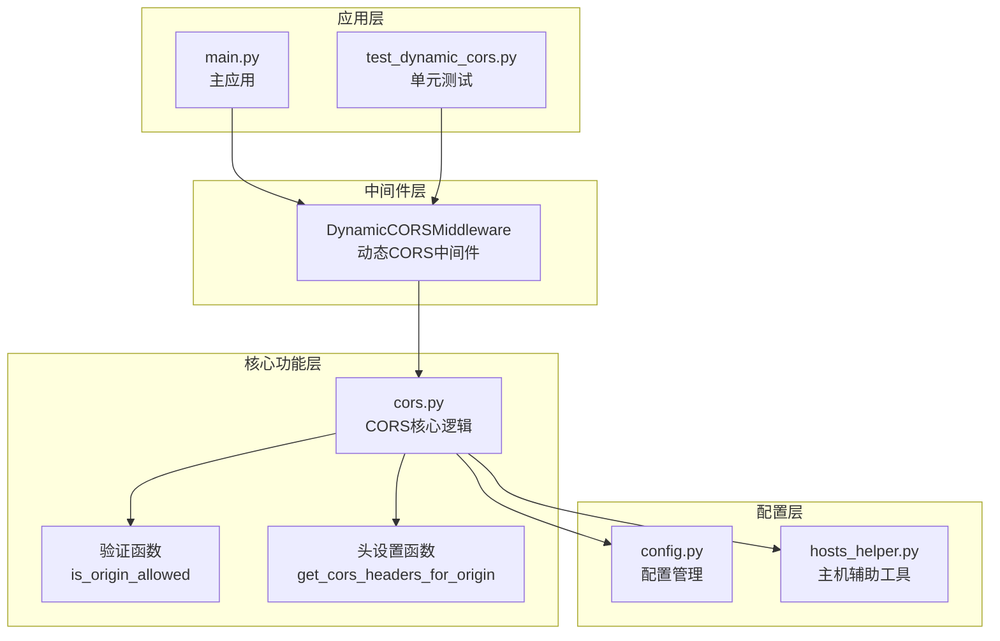
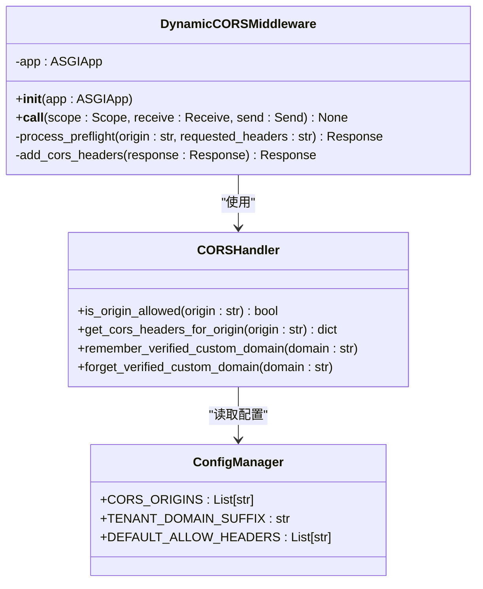
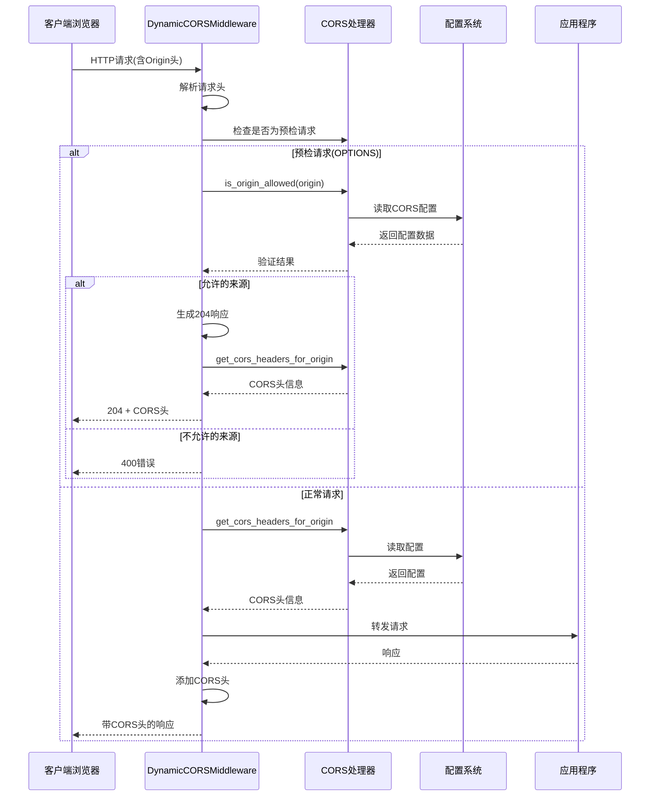
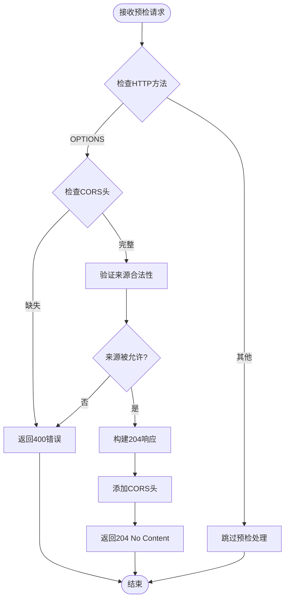
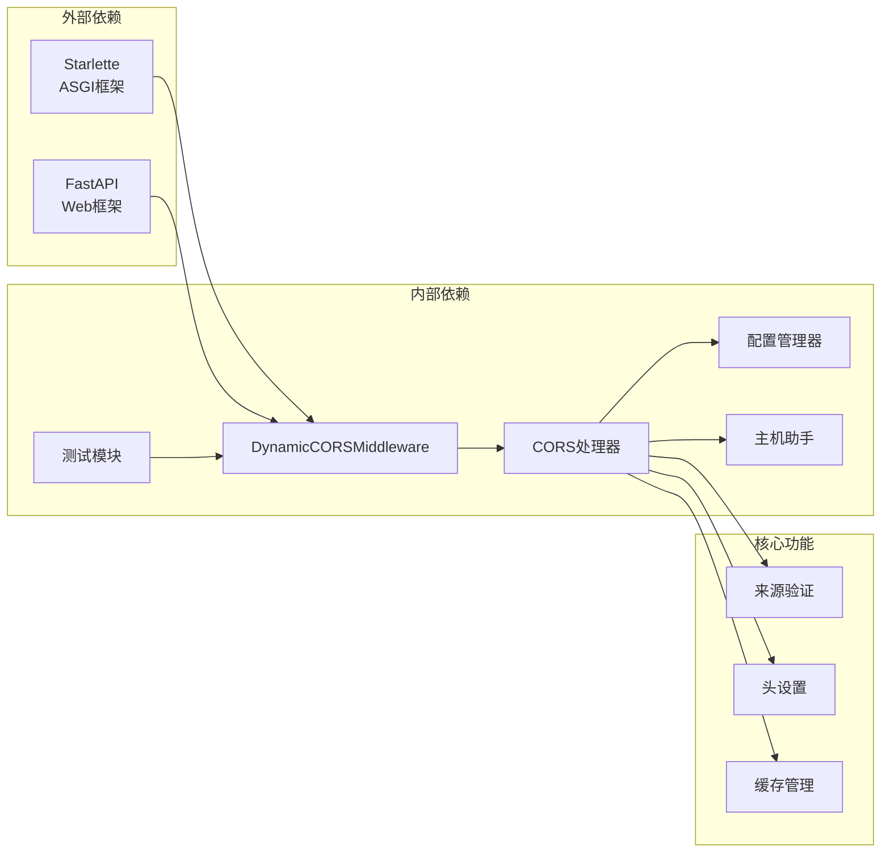

# CORS跨域中间件

<cite>
**本文档引用的文件**
- [dynamic_cors.py](file://backend/app/middleware/dynamic_cors.py)
- [test_dynamic_cors.py](file://backend/tests/middleware/test_dynamic_cors.py)
- [cors.py](file://backend/app/core/cors.py)
- [config.py](file://backend/app/core/config.py)
- [hosts_helper.py](file://backend/app/core/hosts_helper.py)
- [main.py](file://backend/app/main.py)
</cite>

## 目录
1. [简介](#简介)
2. [项目结构](#项目结构)
3. [核心组件](#核心组件)
4. [架构概览](#架构概览)
5. [详细组件分析](#详细组件分析)
6. [依赖关系分析](#依赖关系分析)
7. [性能考虑](#性能考虑)
8. [故障排除指南](#故障排除指南)
9. [结论](#结论)
10. [附录](#附录)

## 简介

CORS（跨域资源共享）跨域中间件是novus.ai SaaS平台中用于处理跨域请求的核心安全组件。该中间件实现了动态CORS策略，能够根据请求来源动态验证并设置适当的CORS头，支持预检请求的快速处理，并提供了灵活的跨域策略配置。

该中间件采用ASGI中间件架构，集成在Starlette/FastAPI框架中，为前端应用提供安全的跨域访问能力。通过动态验证机制，中间件能够有效防止恶意跨域攻击和XSS攻击，同时确保合法的跨域请求得到正确处理。

## 项目结构

CORS跨域中间件在项目中的组织结构如下：



**图表来源**
- [dynamic_cors.py:1-65](file://backend/app/middleware/dynamic_cors.py#L1-L65)
- [cors.py](file://backend/app/core/cors.py)
- [config.py](file://backend/app/core/config.py)

**章节来源**
- [dynamic_cors.py:1-65](file://backend/app/middleware/dynamic_cors.py#L1-L65)
- [cors.py](file://backend/app/core/cors.py)

## 核心组件

### DynamicCORSMiddleware类

DynamicCORSMiddleware是CORS跨域中间件的核心实现，采用ASGI中间件模式设计：



**图表来源**
- [dynamic_cors.py:19-65](file://backend/app/middleware/dynamic_cors.py#L19-L65)
- [cors.py](file://backend/app/core/cors.py)

**章节来源**
- [dynamic_cors.py:19-65](file://backend/app/middleware/dynamic_cors.py#L19-L65)

## 架构概览

CORS跨域中间件的整体架构采用分层设计，确保了良好的可维护性和扩展性：



**图表来源**
- [dynamic_cors.py:25-62](file://backend/app/middleware/dynamic_cors.py#L25-L62)
- [cors.py](file://backend/app/core/cors.py)

## 详细组件分析

### 预检请求处理流程

预检请求（OPTIONS方法）是CORS协议的重要组成部分，用于在实际请求前验证跨域权限：



**图表来源**
- [dynamic_cors.py:33-51](file://backend/app/middleware/dynamic_cors.py#L33-L51)

### CORS头设置机制

CORS中间件动态生成并设置必要的CORS响应头：

| CORS头 | 作用 | 设置条件 |
|--------|------|----------|
| Access-Control-Allow-Origin | 允许的来源 | 来源验证通过时设置为具体来源或通配符 |
| Access-Control-Allow-Credentials | 允许携带凭证 | 来源为租户子域名时启用 |
| Access-Control-Allow-Methods | 允许的HTTP方法 | 预检请求时返回所有支持的方法 |
| Access-Control-Allow-Headers | 允许的自定义头 | 预检请求时返回请求的头列表 |
| Access-Control-Expose-Headers | 暴露给客户端的头 | 包含自定义业务头 |
| Access-Control-Max-Age | 预检缓存时间 | 默认20分钟 |
| Vary | 缓存控制头 | 当Origin变化时设置 |

**章节来源**
- [dynamic_cors.py:38-50](file://backend/app/middleware/dynamic_cors.py#L38-L50)

### 跨域策略配置

CORS中间件支持多种来源验证策略：

#### 显式来源配置
系统支持通过配置项指定明确允许的来源列表，适用于开发和测试环境。

#### 租户子域名策略
自动允许基于租户域后缀的子域名，确保多租户架构下的正常跨域访问。

#### 自定义域验证缓存
实现了一个共享的已验证自定义域缓存系统，提高验证性能并减少重复验证开销。

**章节来源**
- [test_dynamic_cors.py:58-83](file://backend/tests/middleware/test_dynamic_cors.py#L58-L83)
- [test_dynamic_cors.py:146-151](file://backend/tests/middleware/test_dynamic_cors.py#L146-L151)

### 安全策略实现

CORS中间件实施了多层次的安全防护措施：

#### 源验证机制
- 实施严格的来源白名单验证
- 支持正则表达式匹配复杂来源规则
- 提供来源验证缓存以提高性能

#### 预防恶意攻击
- XSS攻击防护：通过严格的来源验证防止跨站脚本攻击
- CSRF攻击防护：结合其他中间件实现综合防护
- 恶意来源阻断：对未知或恶意来源直接拒绝

#### 头部安全控制
- 限制暴露的响应头范围
- 控制允许的自定义头部
- 管理预检请求的缓存策略

**章节来源**
- [cors.py](file://backend/app/core/cors.py)
- [test_dynamic_cors.py:84-96](file://backend/tests/middleware/test_dynamic_cors.py#L84-L96)

## 依赖关系分析

CORS跨域中间件的依赖关系体现了清晰的分层架构：



**图表来源**
- [dynamic_cors.py:12-16](file://backend/app/middleware/dynamic_cors.py#L12-L16)
- [cors.py](file://backend/app/core/cors.py)

**章节来源**
- [dynamic_cors.py:12-16](file://backend/app/middleware/dynamic_cors.py#L12-L16)
- [cors.py](file://backend/app/core/cors.py)

## 性能考虑

### 缓存策略
- 已验证来源的短期缓存，避免重复验证开销
- 预检请求结果的合理缓存，减少重复预检
- 内存缓存与持久化存储的平衡

### 异步处理
- 使用异步I/O操作提高并发处理能力
- 非阻塞的来源验证机制
- 流式响应处理优化

### 资源管理
- 及时释放中间件创建的临时资源
- 合理的内存使用策略
- 连接池管理优化

## 故障排除指南

### 常见问题及解决方案

#### 预检请求失败
**症状**：OPTIONS请求返回400错误
**原因**：缺少必要的CORS请求头或来源未被验证
**解决**：检查客户端是否正确发送CORS请求头，确认来源在允许列表中

#### 跨域头缺失
**症状**：响应中缺少Access-Control-Allow-Origin头
**原因**：来源验证失败或中间件未正确配置
**解决**：验证来源配置，检查中间件注册顺序

#### 凭证相关问题
**症状**：携带Cookie的请求失败
**原因**：Access-Control-Allow-Credentials设置不正确
**解决**：确保来源为受信任的子域名，正确配置凭证传递

#### 预检缓存问题
**症状**：修改CORS策略后变更未生效
**原因**：浏览器缓存了预检结果
**解决**：等待Max-Age过期或手动清除浏览器缓存

**章节来源**
- [test_dynamic_cors.py:84-129](file://backend/tests/middleware/test_dynamic_cors.py#L84-L129)

### 调试方法

#### 日志记录
- 启用详细的CORS验证日志
- 记录来源验证过程和结果
- 监控预检请求的处理情况

#### 单元测试
- 使用提供的测试用例验证功能
- 模拟各种跨域场景进行测试
- 验证安全策略的有效性

#### 性能监控
- 监控CORS验证的响应时间
- 分析来源验证的缓存命中率
- 评估中间件对整体性能的影响

**章节来源**
- [test_dynamic_cors.py:130-151](file://backend/tests/middleware/test_dynamic_cors.py#L130-L151)

## 结论

CORS跨域中间件为novus.ai SaaS平台提供了强大而灵活的跨域访问控制能力。通过动态验证机制、多层次的安全策略和高效的性能优化，该中间件确保了系统的安全性与可用性。

关键特性包括：
- 动态来源验证，支持多种验证策略
- 高效的预检请求处理机制
- 完善的安全防护措施
- 良好的性能表现和可扩展性

该中间件的设计充分考虑了现代Web应用的跨域需求，为前端应用提供了安全可靠的跨域访问解决方案。

## 附录

### 配置选项参考

| 配置项 | 类型 | 默认值 | 描述 |
|--------|------|--------|------|
| CORS_ORIGINS | List[str] | [] | 明确允许的来源列表 |
| TENANT_DOMAIN_SUFFIX | str | "" | 租户域后缀，用于子域名验证 |
| DEFAULT_ALLOW_HEADERS | List[str] | [] | 默认允许的自定义头部 |

### 部署环境配置示例

#### 开发环境
```python
# 开发环境配置
CORS_ORIGINS = [
    "http://localhost:3000",
    "http://127.0.0.1:3000",
    "http://localhost:5173"
]
TENANT_DOMAIN_SUFFIX = ".tenant.local"
```

#### 生产环境
```python
# 生产环境配置
CORS_ORIGINS = [
    "https://app.novus.ai",
    "https://*.novus.ai"
]
TENANT_DOMAIN_SUFFIX = ".novus.ai"
```

#### 多租户环境
```python
# 多租户配置
CORS_ORIGINS = [
    "https://dashboard.tenant1.example.com",
    "https://dashboard.tenant2.example.com"
]
TENANT_DOMAIN_SUFFIX = ".example.com"
```