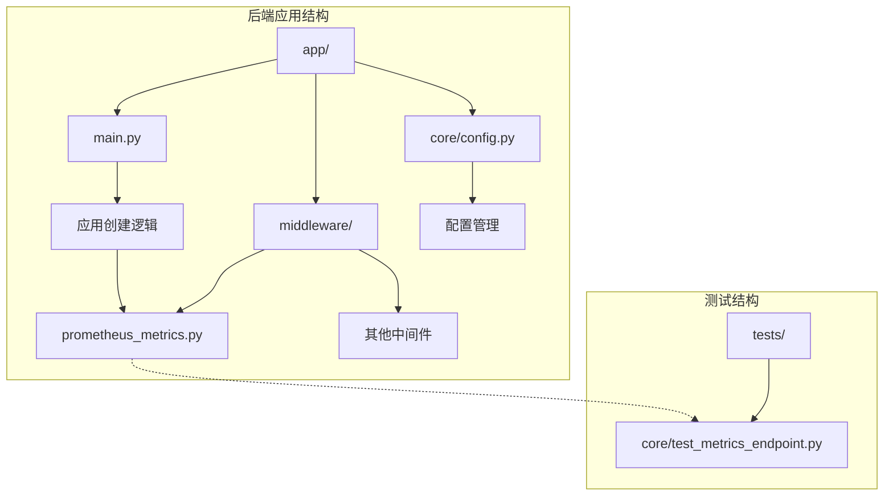
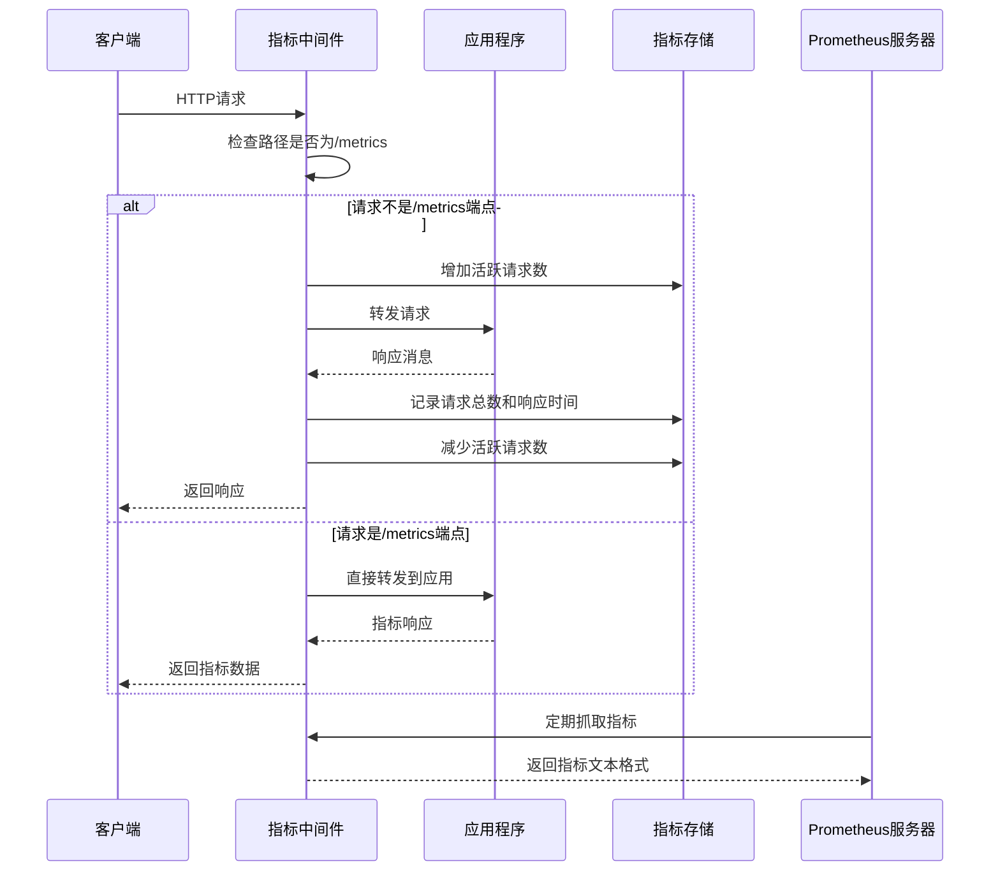
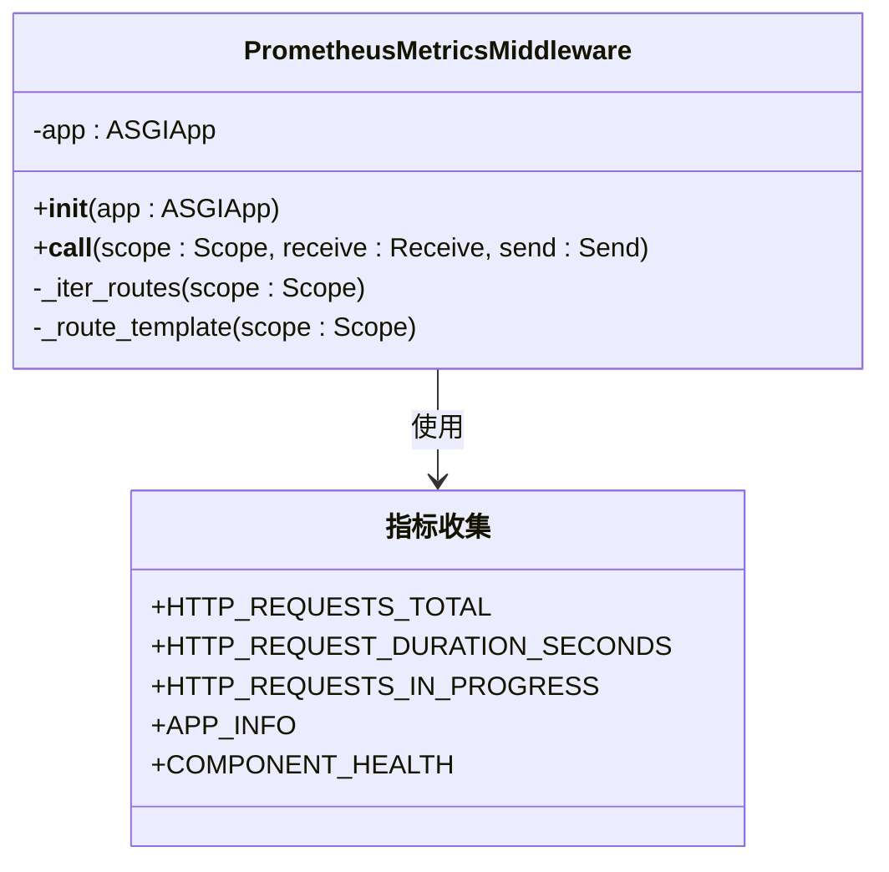
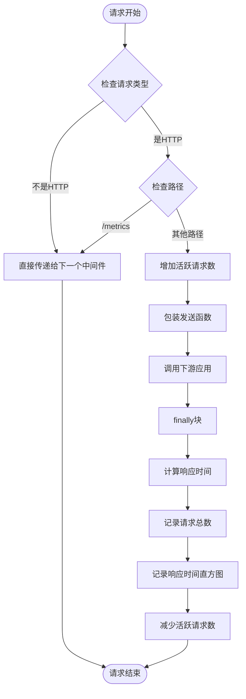
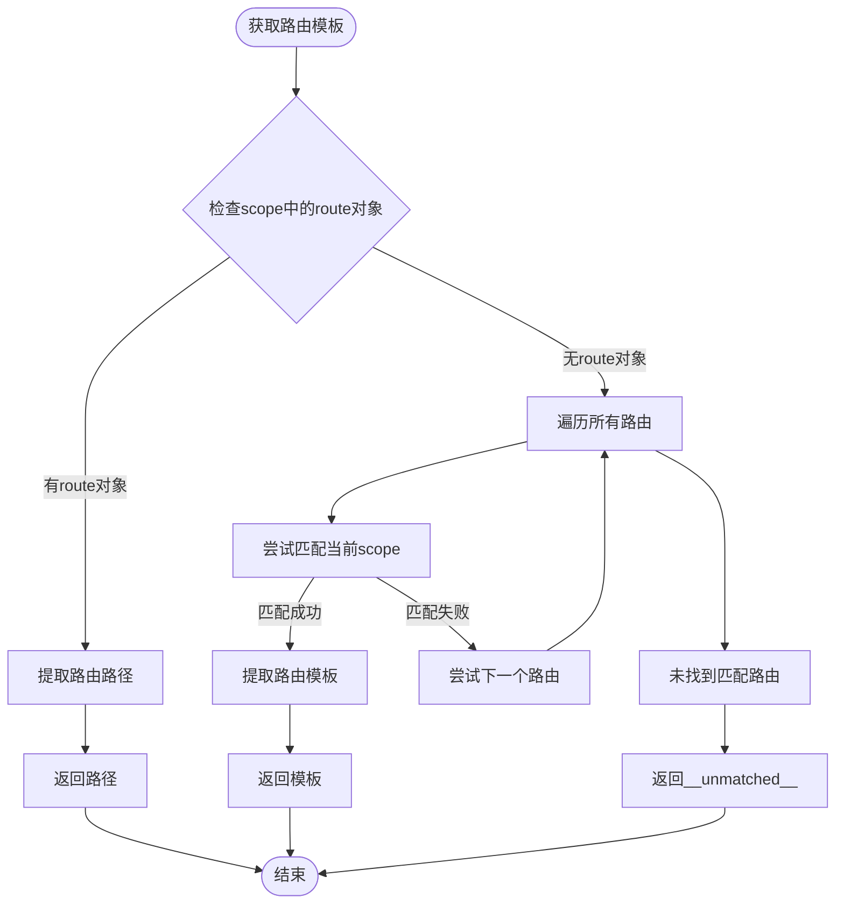
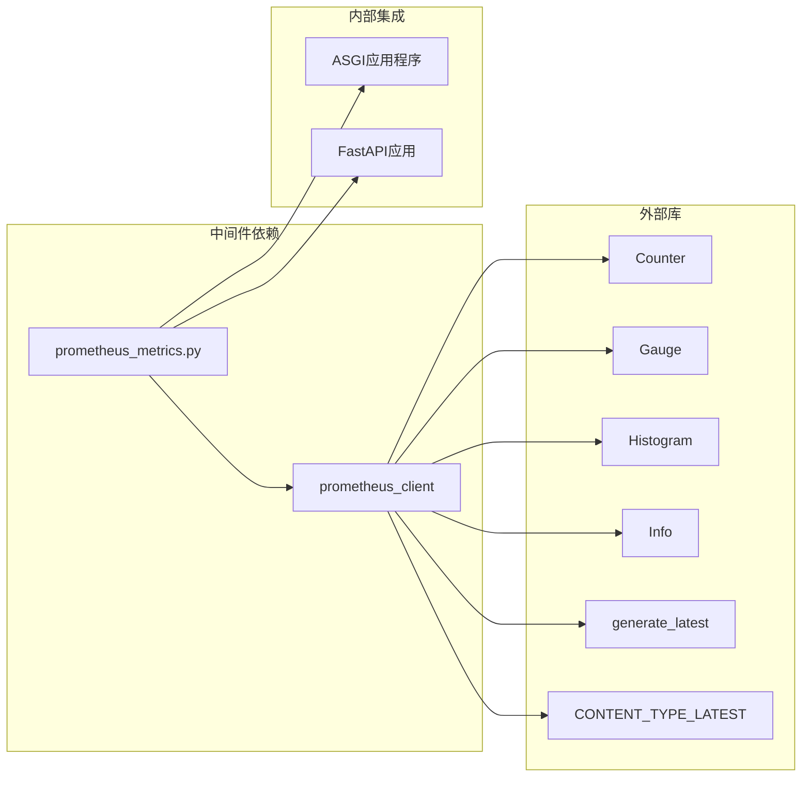
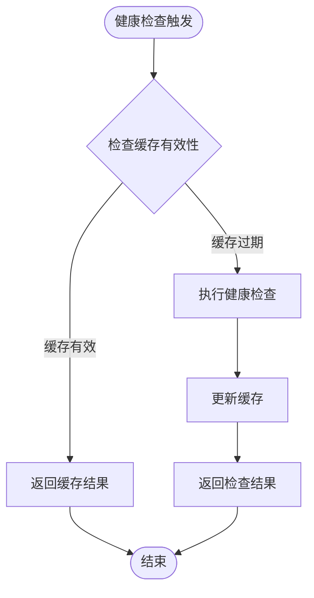

# Prometheus指标中间件

<cite>
**本文档引用的文件**
- [prometheus_metrics.py](file://backend/app/middleware/prometheus_metrics.py)
- [test_metrics_endpoint.py](file://backend/tests/core/test_metrics_endpoint.py)
- [main.py](file://backend/app/main.py)
- [config.py](file://backend/app/core/config.py)
</cite>

## 目录
1. [简介](#简介)
2. [项目结构](#项目结构)
3. [核心组件](#核心组件)
4. [架构概览](#架构概览)
5. [详细组件分析](#详细组件分析)
6. [依赖关系分析](#依赖关系分析)
7. [性能考虑](#性能考虑)
8. [故障排除指南](#故障排除指南)
9. [结论](#结论)

## 简介
本文档详细介绍了Prometheus指标中间件的设计与实现，该中间件为ASGI应用程序提供HTTP请求监控能力，包括请求计数、响应时间分布和活跃请求数等关键指标。中间件采用纯ASGI实现，避免了BaseHTTPMiddleware可能导致的取消级联问题，确保在中间件链中的可靠运行。

## 项目结构
Prometheus指标中间件位于后端应用的中间件目录中，与应用程序的核心配置和主入口文件紧密集成：



**图表来源**
- [prometheus_metrics.py:1-168](file://backend/app/middleware/prometheus_metrics.py#L1-L168)
- [main.py:1-1211](file://backend/app/main.py#L1-L1211)

**章节来源**
- [prometheus_metrics.py:1-168](file://backend/app/middleware/prometheus_metrics.py#L1-L168)
- [main.py:1-1211](file://backend/app/main.py#L1-L1211)

## 核心组件
Prometheus指标中间件包含三个核心组件：指标中间件类、指标响应函数和组件健康状态记录器。

### 指标中间件类
`PrometheusMetricsMiddleware`是中间件的核心实现，采用纯ASGI设计，通过拦截HTTP请求来收集指标数据。

### 指标响应函数
`metrics_response()`函数负责生成标准的Prometheus文本暴露格式，使外部监控系统能够正确解析指标数据。

### 组件健康状态记录器
`set_component_health()`函数允许应用程序报告各种组件的健康状态，为告警规则提供数据支持。

**章节来源**
- [prometheus_metrics.py:114-168](file://backend/app/middleware/prometheus_metrics.py#L114-L168)

## 架构概览
Prometheus指标中间件采用中间件模式集成到ASGI应用程序中，形成完整的监控生态系统：



**图表来源**
- [prometheus_metrics.py:124-161](file://backend/app/middleware/prometheus_metrics.py#L124-L161)

## 详细组件分析

### 指标中间件实现
指标中间件通过ASGI协议的生命周期钩子来捕获请求信息和响应状态：



**图表来源**
- [prometheus_metrics.py:114-168](file://backend/app/middleware/prometheus_metrics.py#L114-L168)

#### 请求处理流程
中间件采用异步包装器模式来捕获响应状态：



**图表来源**
- [prometheus_metrics.py:124-161](file://backend/app/middleware/prometheus_metrics.py#L124-L161)

**章节来源**
- [prometheus_metrics.py:114-168](file://backend/app/middleware/prometheus_metrics.py#L114-L168)

### 指标定义与标签体系
中间件定义了以下核心指标类型：

#### HTTP请求指标
- `novusai_http_requests_total`: HTTP请求总数（计数器）
- `novusai_http_request_duration_seconds`: HTTP请求持续时间（直方图）
- `novusai_http_requests_in_progress`: 正在进行的HTTP请求（Gauge）

#### 应用信息指标
- `novusai_app_info`: 应用基本信息（Info类型）

#### 组件健康指标
- `novusai_component_health`: 组件健康状态（Gauge类型）

**章节来源**
- [prometheus_metrics.py:38-79](file://backend/app/middleware/prometheus_metrics.py#L38-L79)

### 路由模板匹配机制
中间件实现了智能的路由模板匹配，避免将动态参数暴露为单独的指标维度：



**图表来源**
- [prometheus_metrics.py:90-111](file://backend/app/middleware/prometheus_metrics.py#L90-L111)

**章节来源**
- [prometheus_metrics.py:90-111](file://backend/app/middleware/prometheus_metrics.py#L90-L111)

### 指标响应生成
`metrics_response()`函数负责生成标准的Prometheus文本暴露格式：

```mermaid
sequenceDiagram
participant Client as 客户端
participant Handler as 指标处理器
participant Generator as 指标生成器
participant Parser as 文本解析器
Client->>Handler : GET /metrics
Handler->>Generator : generate_latest()
Generator-->>Handler : 指标字节流
Handler->>Parser : 解析指标数据
Parser-->>Handler : 格式化文本
Handler-->>Client : text/plain;charset=utf-8
```

**图表来源**
- [prometheus_metrics.py:82-87](file://backend/app/middleware/prometheus_metrics.py#L82-L87)

**章节来源**
- [prometheus_metrics.py:82-87](file://backend/app/middleware/prometheus_metrics.py#L82-L87)

## 依赖关系分析

### 外部依赖
中间件主要依赖于`prometheus_client`库，该库提供了完整的指标定义和暴露功能：



**图表来源**
- [prometheus_metrics.py:11-17](file://backend/app/middleware/prometheus_metrics.py#L11-L17)

### 内部集成关系
中间件与应用程序的集成通过以下方式实现：

```mermaid
graph TB
subgraph "应用程序集成"
A[main.py] --> B[create_application()]
B --> C[中间件注册]
C --> D[PrometheusMetricsMiddleware]
end
subgraph "配置集成"
E[config.py] --> F[Settings类]
F --> G[应用名称]
F --> H[版本信息]
F --> I[环境信息]
end
subgraph "测试集成"
J[test_metrics_endpoint.py] --> K[结构测试]
K --> L[指标验证]
K --> M[路由匹配测试]
end
D --> E
D --> J
```

**图表来源**
- [main.py:37-47](file://backend/app/main.py#L37-L47)
- [config.py:42-48](file://backend/app/core/config.py#L42-L48)

**章节来源**
- [main.py:37-47](file://backend/app/main.py#L37-L47)
- [config.py:42-48](file://backend/app/core/config.py#L42-L48)

## 性能考虑
Prometheus指标中间件在设计时充分考虑了性能影响，采用了多种优化策略：

### 异步处理
中间件完全基于异步I/O，不会阻塞事件循环，确保高并发场景下的性能表现。

### 指标更新策略
- 使用原子操作更新计数器，避免竞态条件
- 在finally块中确保指标更新的可靠性
- 采用轻量级的标签处理机制

### 内存管理
- 指标数据存储在内存中，避免磁盘I/O开销
- 合理的标签基数控制，防止内存泄漏
- 及时清理不再使用的指标

## 故障排除指南

### 常见问题诊断
根据测试文件显示，中间件存在以下关键行为：

#### 指标端点排除
中间件正确地排除了`/metrics`端点的业务指标记录，避免了自我监控的循环问题。

#### 路由模板匹配
中间件优先使用路由模板而非原始动态路径，确保指标维度的稳定性。

#### 错误状态处理
中间件能够正确处理500错误状态，并确保活跃请求数量的正确清理。

**章节来源**
- [test_metrics_endpoint.py:148-154](file://backend/tests/core/test_metrics_endpoint.py#L148-L154)
- [test_metrics_endpoint.py:116-127](file://backend/tests/core/test_metrics_endpoint.py#L116-L127)
- [test_metrics_endpoint.py:129-145](file://backend/tests/core/test_metrics_endpoint.py#L129-L145)

### 组件健康监控
应用程序集成了组件健康状态的TTL缓存机制：



**图表来源**
- [main.py:46-47](file://backend/app/main.py#L46-L47)
- [main.py:551-581](file://backend/app/main.py#L551-L581)

**章节来源**
- [main.py:46-47](file://backend/app/main.py#L46-L47)
- [main.py:551-581](file://backend/app/main.py#L551-L581)

## 结论
Prometheus指标中间件为ASGI应用程序提供了完整、可靠的监控解决方案。其设计特点包括：

1. **纯ASGI实现**：避免了BaseHTTPMiddleware的限制，确保中间件链的完整性
2. **智能路由匹配**：通过路由模板避免指标维度的过度细分
3. **全面的指标覆盖**：包含请求计数、响应时间、活跃请求数和组件健康状态
4. **高性能设计**：异步处理和内存友好的指标存储
5. **易于集成**：简洁的API接口，便于在现有应用程序中部署

该中间件为构建可观测性的SaaS平台奠定了坚实的基础，能够满足生产环境对监控精度和性能的要求。