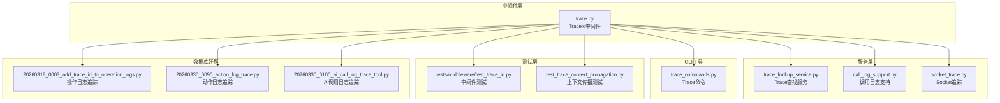
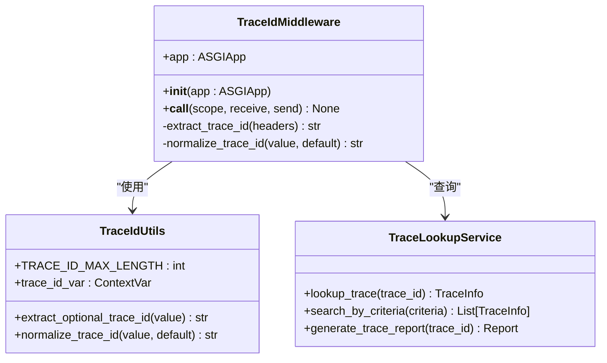
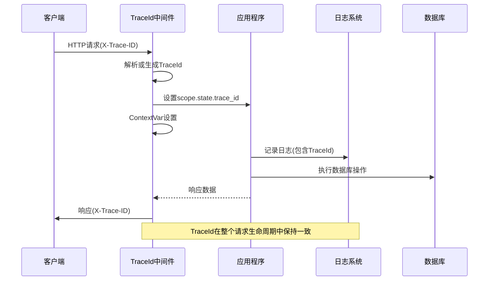
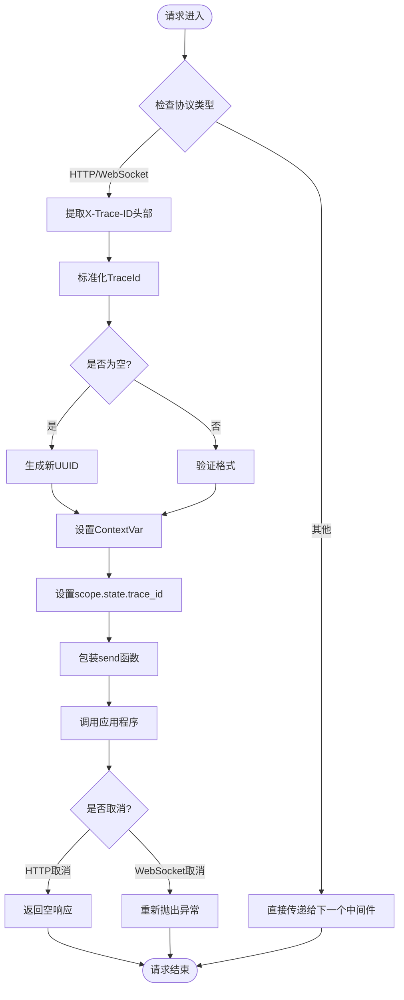
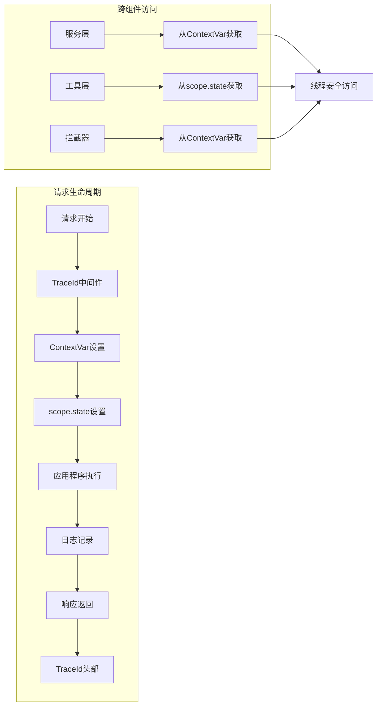
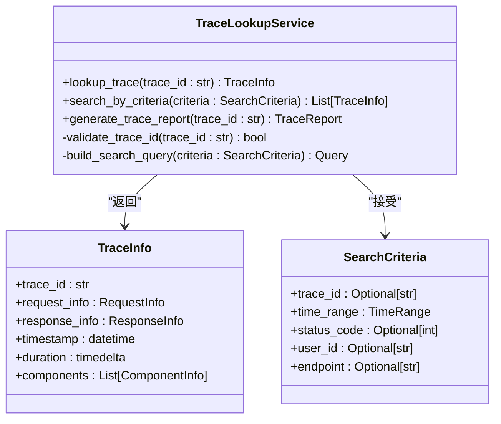
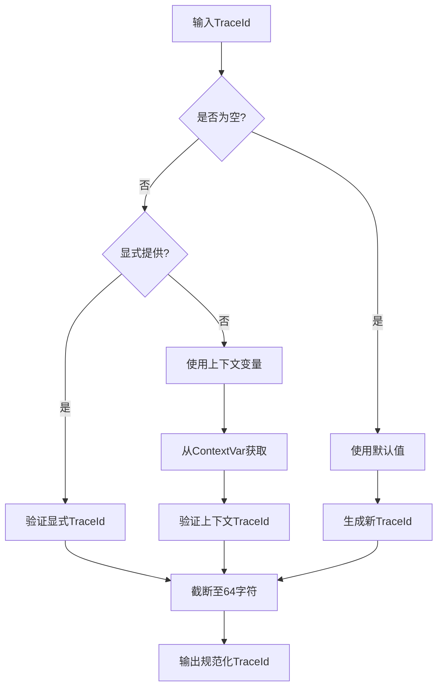
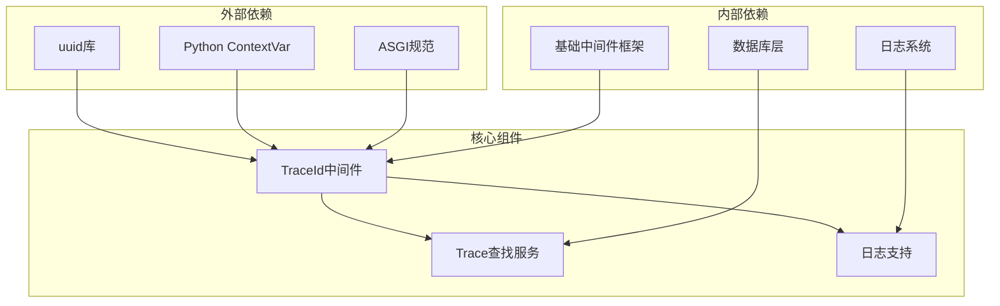
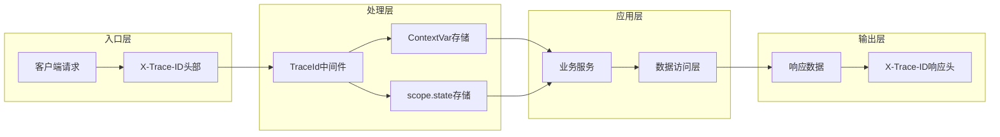

# TraceId中间件

<cite>
**本文档引用的文件**
- [backend/app/middleware/trace.py](file://backend/app/middleware/trace.py)
- [backend/app/services/ai/call_log_support.py](file://backend/app/services/ai/call_log_support.py)
- [backend/app/services/system/trace_lookup_service.py](file://backend/app/services/system/trace_lookup_service.py)
- [backend/app/sio/socket_trace.py](file://backend/app/sio/socket_trace.py)
- [backend/app/cli_commands/trace_commands.py](file://backend/app/cli_commands/trace_commands.py)
- [backend/tests/middleware/test_trace_id.py](file://backend/tests/middleware/test_trace_id.py)
- [backend/tests/test_trace_context_propagation.py](file://backend/tests/test_trace_context_propagation.py)
- [backend/migrations/versions/20260318_0003_add_trace_id_to_operation_logs.py](file://backend/migrations/versions/20260318_0003_add_trace_id_to_operation_logs.py)
- [backend/migrations/versions/20260330_0090_action_log_trace.py](file://backend/migrations/versions/20260330_0090_action_log_trace.py)
- [backend/migrations/versions/20260330_0100_ai_call_log_trace_tool.py](file://backend/migrations/versions/20260330_0100_ai_call_log_trace_tool.py)
</cite>

## 目录
1. [简介](#简介)
2. [项目结构](#项目结构)
3. [核心组件](#核心组件)
4. [架构概览](#架构概览)
5. [详细组件分析](#详细组件分析)
6. [依赖关系分析](#依赖关系分析)
7. [性能考虑](#性能考虑)
8. [故障排除指南](#故障排除指南)
9. [结论](#结论)
10. [附录](#附录)

## 简介

TraceId中间件是NovusAI SaaS平台中最外层的中间件组件，负责在整个分布式系统中建立和维护统一的请求跟踪标识符。该中间件采用纯ASGI实现，确保在HTTP和WebSocket协议下都能提供一致的跟踪能力。

在分布式系统中，每个用户请求都可能经过多个微服务和组件，TraceId中间件确保这些请求在整个调用链路中保持一致的标识符，从而实现端到端的请求追踪和问题排查。

## 项目结构

TraceId中间件在项目中的组织结构如下：



**图表来源**
- [backend/app/middleware/trace.py:1-150](file://backend/app/middleware/trace.py#L1-L150)
- [backend/app/services/system/trace_lookup_service.py:1-200](file://backend/app/services/system/trace_lookup_service.py#L1-L200)

**章节来源**
- [backend/app/middleware/trace.py:1-150](file://backend/app/middleware/trace.py#L1-L150)
- [backend/app/services/system/trace_lookup_service.py:1-200](file://backend/app/services/system/trace_lookup_service.py#L1-L200)

## 核心组件

### TraceId中间件类

TraceId中间件的核心实现包含以下关键特性：

- **纯ASGI实现**：支持HTTP和WebSocket协议
- **自动UUID生成**：当请求头中没有提供TraceId时自动生成
- **上下文变量支持**：使用Python的ContextVar确保线程安全
- **响应头传播**：将TraceId通过响应头传递给客户端

### 核心数据结构



**图表来源**
- [backend/app/middleware/trace.py:58-107](file://backend/app/middleware/trace.py#L58-L107)
- [backend/app/services/system/trace_lookup_service.py:1-200](file://backend/app/services/system/trace_lookup_service.py#L1-L200)

**章节来源**
- [backend/app/middleware/trace.py:58-107](file://backend/app/middleware/trace.py#L58-L107)
- [backend/app/services/system/trace_lookup_service.py:1-200](file://backend/app/services/system/trace_lookup_service.py#L1-L200)

## 架构概览

TraceId中间件在整个系统架构中的位置和作用：



**图表来源**
- [backend/app/middleware/trace.py:74-107](file://backend/app/middleware/trace.py#L74-L107)
- [backend/app/services/ai/call_log_support.py:266-282](file://backend/app/services/ai/call_log_support.py#L266-L282)

## 详细组件分析

### TraceId中间件实现

#### 初始化和配置

TraceId中间件的初始化过程包括：

1. **应用包装**：接收并存储底层ASGI应用程序
2. **协议支持**：支持HTTP和WebSocket两种协议类型
3. **状态管理**：确保scope对象具有state属性

#### 请求处理流程



**图表来源**
- [backend/app/middleware/trace.py:74-107](file://backend/app/middleware/trace.py#L74-L107)

#### TraceId生成算法

TraceId中间件使用UUID4算法生成全局唯一标识符：

- **算法选择**：基于uuid.uuid4()的随机UUID
- **格式规范**：标准UUID格式(36字符)
- **长度限制**：最大64字符，超出部分截断
- **字符集**：小写字母a-f和数字0-9

#### 上下文传播机制



**图表来源**
- [backend/app/middleware/trace.py:83-92](file://backend/app/middleware/trace.py#L83-L92)

**章节来源**
- [backend/app/middleware/trace.py:37-107](file://backend/app/middleware/trace.py#L37-L107)

### Trace查找服务

Trace查找服务提供TraceId相关的查询和分析功能：

#### 核心功能

1. **TraceId查询**：根据TraceId获取完整的请求信息
2. **条件搜索**：支持基于多种条件的TraceId搜索
3. **报告生成**：生成详细的TraceId分析报告

#### 查询接口设计



**图表来源**
- [backend/app/services/system/trace_lookup_service.py:1-200](file://backend/app/services/system/trace_lookup_service.py#L1-L200)

**章节来源**
- [backend/app/services/system/trace_lookup_service.py:1-200](file://backend/app/services/system/trace_lookup_service.py#L1-L200)

### 调用日志支持

调用日志支持模块提供TraceId在各种日志场景中的集成：

#### TraceId规范化流程



**图表来源**
- [backend/app/services/ai/call_log_support.py:266-282](file://backend/app/services/ai/call_log_support.py#L266-L282)

**章节来源**
- [backend/app/services/ai/call_log_support.py:266-282](file://backend/app/services/ai/call_log_support.py#L266-L282)

### CLI命令工具

Trace命令工具提供TraceId相关的命令行操作：

#### 主要功能

1. **TraceId生成**：生成新的TraceId用于测试
2. **TraceId验证**：验证TraceId格式的有效性
3. **TraceId转换**：在不同格式之间转换TraceId

**章节来源**
- [backend/app/cli_commands/trace_commands.py:1-200](file://backend/app/cli_commands/trace_commands.py#L1-L200)

## 依赖关系分析

### 组件依赖图



**图表来源**
- [backend/app/middleware/trace.py:1-150](file://backend/app/middleware/trace.py#L1-L150)
- [backend/app/services/system/trace_lookup_service.py:1-200](file://backend/app/services/system/trace_lookup_service.py#L1-L200)

### 数据流分析

TraceId在整个系统中的数据流向：



**图表来源**
- [backend/app/middleware/trace.py:74-107](file://backend/app/middleware/trace.py#L74-L107)

**章节来源**
- [backend/app/middleware/trace.py:74-107](file://backend/app/middleware/trace.py#L74-L107)

## 性能考虑

### 性能优化策略

1. **延迟初始化**：仅在需要时才创建TraceId
2. **内存管理**：使用ContextVar避免内存泄漏
3. **字符串处理**：最小化字符串操作和转换
4. **异常处理**：优雅处理取消和异常情况

### 性能特征

- **CPU开销**：极低(主要为UUID生成和字符串操作)
- **内存占用**：极低(ContextVar按需分配)
- **网络开销**：最小(仅增加一个HTTP头部)
- **延迟影响**：可忽略不计

## 故障排除指南

### 常见问题和解决方案

#### TraceId未正确传播

**问题描述**：TraceId在某些中间件中丢失

**解决方案**：
1. 检查中间件的执行顺序
2. 确保在TraceId中间件之后的所有中间件都正确处理scope.state
3. 验证ContextVar的正确使用

#### TraceId格式错误

**问题描述**：TraceId不符合预期格式

**解决方案**：
1. 使用内置的规范化函数
2. 检查输入数据的编码
3. 验证TraceId的最大长度限制

#### 性能问题

**问题描述**：TraceId中间件导致性能下降

**解决方案**：
1. 检查是否有不必要的TraceId生成
2. 优化日志记录频率
3. 减少TraceId相关的字符串操作

**章节来源**
- [backend/tests/middleware/test_trace_id.py:1-200](file://backend/tests/middleware/test_trace_id.py#L1-L200)
- [backend/tests/test_trace_context_propagation.py:150-245](file://backend/tests/test_trace_context_propagation.py#L150-L245)

## 结论

TraceId中间件作为分布式系统中最外层的中间件，为整个系统提供了统一的请求跟踪能力。其设计特点包括：

1. **简洁高效**：纯ASGI实现，性能开销极低
2. **可靠稳定**：使用标准UUID算法确保全局唯一性
3. **易于集成**：与现有日志系统和数据库无缝集成
4. **灵活配置**：支持多种TraceId来源和生成策略

通过TraceId中间件，开发团队可以实现端到端的请求追踪，快速定位问题根源，进行性能分析和监控。

## 附录

### 配置选项

| 配置项 | 类型 | 默认值 | 描述 |
|--------|------|--------|------|
| TRACE_ID_HEADER | str | "X-Trace-ID" | TraceId头部名称 |
| TRACE_ID_MAX_LENGTH | int | 64 | TraceId最大长度限制 |
| ENABLE_TRACE_PROPAGATION | bool | True | 是否启用TraceId传播 |

### API参考

#### TraceId中间件

```python
# 基本使用
from backend.app.middleware.trace import TraceIdMiddleware

app = TraceIdMiddleware(app)

# 自定义配置
middleware = TraceIdMiddleware(app, config={
    'header_name': 'X-Custom-Trace-ID'
})
```

#### TraceId工具函数

```python
from backend.app.middleware.trace import normalize_trace_id, extract_optional_trace_id

# 规范化TraceId
normalized = normalize_trace_id(input_value, default="default-id")

# 提取可选TraceId
optional = extract_optional_trace_id(header_value)
```

### 最佳实践

1. **始终使用TraceId中间件**：确保所有请求都有唯一的标识符
2. **在日志中包含TraceId**：便于问题排查和审计
3. **合理使用TraceId**：避免在不需要的地方生成新的TraceId
4. **监控TraceId分布**：定期检查TraceId的生成和传播情况