# 中间件架构设计

<cite>
**本文引用的文件**
- [backend/app/middleware/__init__.py](file://backend/app/middleware/__init__.py)
- [backend/app/middleware/trace.py](file://backend/app/middleware/trace.py)
- [backend/app/middleware/permission.py](file://backend/app/middleware/permission.py)
- [backend/app/middleware/audit_log.py](file://backend/app/middleware/audit_log.py)
- [backend/app/middleware/access_control.py](file://backend/app/middleware/access_control.py)
- [backend/app/middleware/dynamic_cors.py](file://backend/app/middleware/dynamic_cors.py)
- [backend/app/middleware/maintenance.py](file://backend/app/middleware/maintenance.py)
- [backend/app/middleware/tenant.py](file://backend/app/middleware/tenant.py)
- [backend/app/middleware/i18n.py](file://backend/app/middleware/i18n.py)
- [backend/app/middleware/nocache.py](file://backend/app/middleware/nocache.py)
- [backend/app/middleware/prometheus_metrics.py](file://backend/app/middleware/prometheus_metrics.py)
- [backend/app/main.py](file://backend/app/main.py)
</cite>

## 目录
1. [简介](#简介)
2. [项目结构](#项目结构)
3. [核心组件](#核心组件)
4. [架构总览](#架构总览)
5. [详细组件分析](#详细组件分析)
6. [依赖关系分析](#依赖关系分析)
7. [性能考量](#性能考量)
8. [故障排查指南](#故障排查指南)
9. [结论](#结论)
10. [附录](#附录)

## 简介
本设计文档面向 NovusAI SaaS 的中间件体系，系统化阐述中间件的执行顺序、设计理念与职责边界，重点说明 TraceIdMiddleware 作为最外层中间件在请求追踪与链路一致性中的关键作用。文档覆盖以下主题：
- 中间件职责分工：权限中间件负责 RBAC 权限预加载、审计日志中间件记录 API 调用、访问控制中间件实施安全策略、CORS 中间件处理跨域请求等
- 注册机制与配置：动态 CORS 配置、维护模式中间件的实现与缓存策略
- 中间件链执行流程与异常处理机制
- 自定义中间件的开发指南与最佳实践

## 项目结构
中间件位于 backend/app/middleware 目录，采用“按功能分层”的模块化组织方式，每个中间件独立实现，遵循纯 ASGI 设计，便于在中间件链中组合与替换。

```mermaid
graph TB
subgraph "中间件模块"
M1["trace.py<br/>TraceIdMiddleware"]
M2["permission.py<br/>PermissionMiddleware"]
M3["audit_log.py<br/>AuditLogMiddleware"]
M4["access_control.py<br/>AccessControlMiddleware"]
M5["tenant.py<br/>TenantMiddleware"]
M6["dynamic_cors.py<br/>DynamicCORSMiddleware"]
M7["prometheus_metrics.py<br/>PrometheusMetricsMiddleware"]
M8["i18n.py<br/>I18nMiddleware"]
M9["maintenance.py<br/>MaintenanceMiddleware"]
M10["nocache.py<br/>NoCacheAPIMiddleware"]
end
M1 --> M2 --> M3 --> M4 --> M5 --> M6 --> M7 --> M8 --> M9 --> M10
```

图表来源
- [backend/app/middleware/trace.py:58-108](file://backend/app/middleware/trace.py#L58-L108)
- [backend/app/middleware/permission.py:31-61](file://backend/app/middleware/permission.py#L31-L61)
- [backend/app/middleware/audit_log.py:219-349](file://backend/app/middleware/audit_log.py#L219-L349)
- [backend/app/middleware/access_control.py:35-99](file://backend/app/middleware/access_control.py#L35-L99)
- [backend/app/middleware/tenant.py:93-164](file://backend/app/middleware/tenant.py#L93-L164)
- [backend/app/middleware/dynamic_cors.py:19-63](file://backend/app/middleware/dynamic_cors.py#L19-L63)
- [backend/app/middleware/prometheus_metrics.py:114-162](file://backend/app/middleware/prometheus_metrics.py#L114-L162)
- [backend/app/middleware/i18n.py:13-41](file://backend/app/middleware/i18n.py#L13-L41)
- [backend/app/middleware/maintenance.py:37-76](file://backend/app/middleware/maintenance.py#L37-L76)
- [backend/app/middleware/nocache.py:16-50](file://backend/app/middleware/nocache.py#L16-L50)

章节来源
- [backend/app/middleware/__init__.py:1-29](file://backend/app/middleware/__init__.py#L1-L29)

## 核心组件
- TraceIdMiddleware：最外层中间件，负责生成或透传 X-Trace-ID，贯穿整个请求链路，为日志与下游服务关联提供唯一标识。
- PermissionMiddleware：在路由处理前预加载用户权限与数据权限上下文，供后续装饰器与数据过滤器使用。
- AuditLogMiddleware：拦截 API 请求，异步记录操作日志，包含请求/响应信息、脱敏处理与 TraceId 关联。
- AccessControlMiddleware：实施“默认拒绝”安全策略，要求端点显式标注访问级别，保障 API 安全边界。
- DynamicCORSMiddleware：动态校验 Origin，对预检请求短路响应，统一注入 CORS 头。
- TenantMiddleware：从 Host 解析租户上下文，支持子域名与自定义域名两种模式。
- PrometheusMetricsMiddleware：采集 HTTP 请求总量、时延与进行中请求数，提供组件健康指标。
- I18nMiddleware：解析语言偏好，设置当前请求语言上下文。
- MaintenanceMiddleware：维护模式开关，对非管理员路径拦截并返回 503。
- NoCacheAPIMiddleware：对未设置 Cache-Control 的 JSON 响应添加禁缓存头，避免浏览器缓存导致的数据陈旧。

章节来源
- [backend/app/middleware/trace.py:58-108](file://backend/app/middleware/trace.py#L58-L108)
- [backend/app/middleware/permission.py:31-61](file://backend/app/middleware/permission.py#L31-L61)
- [backend/app/middleware/audit_log.py:219-349](file://backend/app/middleware/audit_log.py#L219-L349)
- [backend/app/middleware/access_control.py:35-99](file://backend/app/middleware/access_control.py#L35-L99)
- [backend/app/middleware/dynamic_cors.py:19-63](file://backend/app/middleware/dynamic_cors.py#L19-L63)
- [backend/app/middleware/tenant.py:93-164](file://backend/app/middleware/tenant.py#L93-L164)
- [backend/app/middleware/prometheus_metrics.py:114-162](file://backend/app/middleware/prometheus_metrics.py#L114-L162)
- [backend/app/middleware/i18n.py:13-41](file://backend/app/middleware/i18n.py#L13-L41)
- [backend/app/middleware/maintenance.py:37-76](file://backend/app/middleware/maintenance.py#L37-L76)
- [backend/app/middleware/nocache.py:16-50](file://backend/app/middleware/nocache.py#L16-L50)

## 架构总览
中间件链严格遵循“从外到内”的执行顺序，确保 TraceIdMiddleware 作为最外层最先执行，随后依次为权限、审计、访问控制、租户识别、CORS、指标、国际化、维护模式与禁缓存。这种顺序既满足安全前置与可观测性的需求，也兼顾了性能与可维护性。

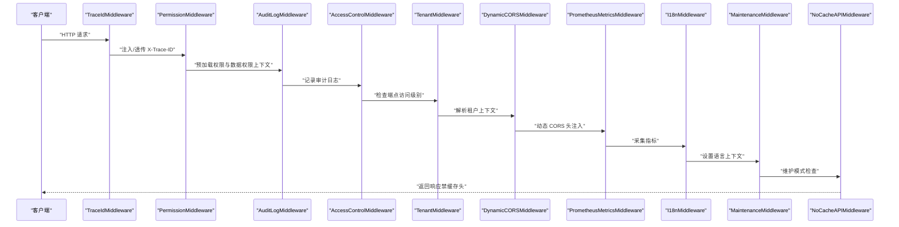

图表来源
- [backend/app/main.py:699-702](file://backend/app/main.py#L699-L702)
- [backend/app/middleware/trace.py:74-108](file://backend/app/middleware/trace.py#L74-L108)
- [backend/app/middleware/permission.py:40-61](file://backend/app/middleware/permission.py#L40-L61)
- [backend/app/middleware/audit_log.py:235-349](file://backend/app/middleware/audit_log.py#L235-L349)
- [backend/app/middleware/access_control.py:54-99](file://backend/app/middleware/access_control.py#L54-L99)
- [backend/app/middleware/tenant.py:120-164](file://backend/app/middleware/tenant.py#L120-L164)
- [backend/app/middleware/dynamic_cors.py:25-63](file://backend/app/middleware/dynamic_cors.py#L25-L63)
- [backend/app/middleware/prometheus_metrics.py:124-162](file://backend/app/middleware/prometheus_metrics.py#L124-L162)
- [backend/app/middleware/i18n.py:31-41](file://backend/app/middleware/i18n.py#L31-L41)
- [backend/app/middleware/maintenance.py:51-76](file://backend/app/middleware/maintenance.py#L51-L76)
- [backend/app/middleware/nocache.py:25-50](file://backend/app/middleware/nocache.py#L25-L50)

## 详细组件分析

### TraceIdMiddleware（最外层中间件）
- 设计理念：纯 ASGI 实现，避免 Ctrl+C 关闭时的 CancelledError 级联；在 scope.state 与 ContextVar 中同时注入 trace_id，确保在审计与日志中可全局访问。
- 关键行为：
  - 从请求头读取或生成 X-Trace-ID
  - 将 trace_id 写入 scope.state 与 ContextVar
  - 在响应头中回写 X-Trace-ID
  - 对 HTTP 请求进行包裹发送，WebSocket 场景下保留原生行为
- 重要性：作为中间件链最外层，确保后续中间件（如审计日志）可稳定获取 trace_id，支撑跨服务链路追踪与问题定位。

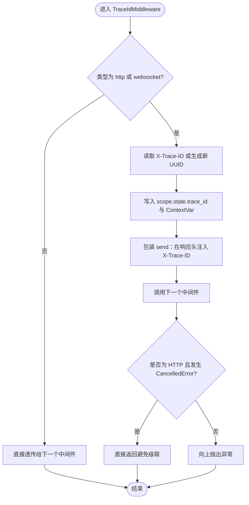

图表来源
- [backend/app/middleware/trace.py:74-108](file://backend/app/middleware/trace.py#L74-L108)

章节来源
- [backend/app/middleware/trace.py:58-108](file://backend/app/middleware/trace.py#L58-L108)

### PermissionMiddleware（权限预加载）
- 职责：从 Authorization 头解析 Bearer Token，按用户角色加载平台/企业管理员或普通用户的权限集合，并设置数据权限上下文（最大数据范围、可见组织等），供后续数据过滤器使用。
- 关键点：
  - 仅在 HTTP 类型请求中生效
  - 使用惰性导入避免循环依赖
  - 通过 ContextVar 与 request.state.user_permissions、request.state.data_permission 暴露给上层

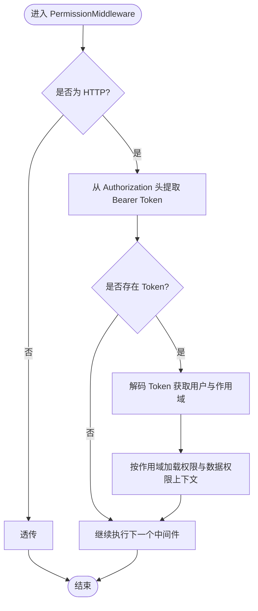

图表来源
- [backend/app/middleware/permission.py:40-61](file://backend/app/middleware/permission.py#L40-L61)
- [backend/app/middleware/permission.py:70-89](file://backend/app/middleware/permission.py#L70-L89)
- [backend/app/middleware/permission.py:90-272](file://backend/app/middleware/permission.py#L90-L272)

章节来源
- [backend/app/middleware/permission.py:31-61](file://backend/app/middleware/permission.py#L31-L61)
- [backend/app/middleware/permission.py:70-272](file://backend/app/middleware/permission.py#L70-L272)

### AuditLogMiddleware（审计日志）
- 职责：拦截 API 请求，收集请求/响应信息，脱敏敏感字段，异步写入操作日志，支持从 PermissionMiddleware 注入的用户信息与 TraceId。
- 关键点：
  - 路径白名单与正则排除（健康检查、指标、文档等）
  - 对 GET/POST/PUT/PATCH 等方法分别处理请求体读取与多次 body 读取兼容
  - 从路由装饰器提取模块/动作/资源码，支持特殊路径映射
  - 异步写入，避免阻塞请求

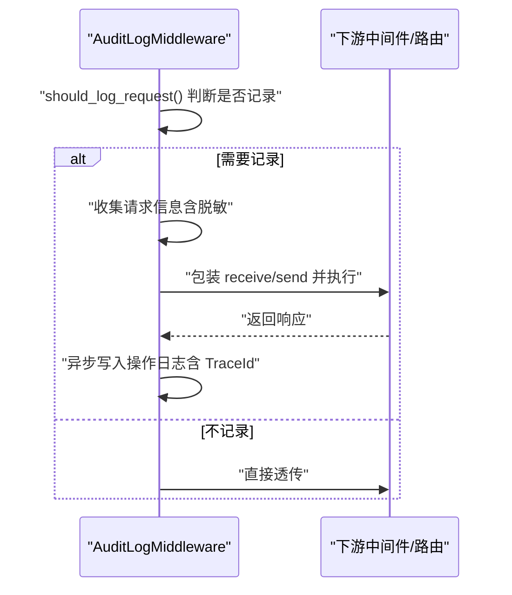

图表来源
- [backend/app/middleware/audit_log.py:235-349](file://backend/app/middleware/audit_log.py#L235-L349)
- [backend/app/middleware/audit_log.py:350-417](file://backend/app/middleware/audit_log.py#L350-L417)
- [backend/app/middleware/audit_log.py:487-582](file://backend/app/middleware/audit_log.py#L487-L582)

章节来源
- [backend/app/middleware/audit_log.py:219-349](file://backend/app/middleware/audit_log.py#L219-L349)
- [backend/app/middleware/audit_log.py:350-417](file://backend/app/middleware/audit_log.py#L350-L417)
- [backend/app/middleware/audit_log.py:487-582](file://backend/app/middleware/audit_log.py#L487-L582)

### AccessControlMiddleware（访问控制）
- 职责：实施“默认拒绝”安全策略，要求端点显式标注访问级别（public/auth_only/action_*），未标注端点统一返回 403。
- 关键点：
  - 路由匹配获取端点装饰器元信息
  - 对内置路径与静态资源豁免
  - 与 PermissionMiddleware 协作，确保认证与权限检查在依赖层完成

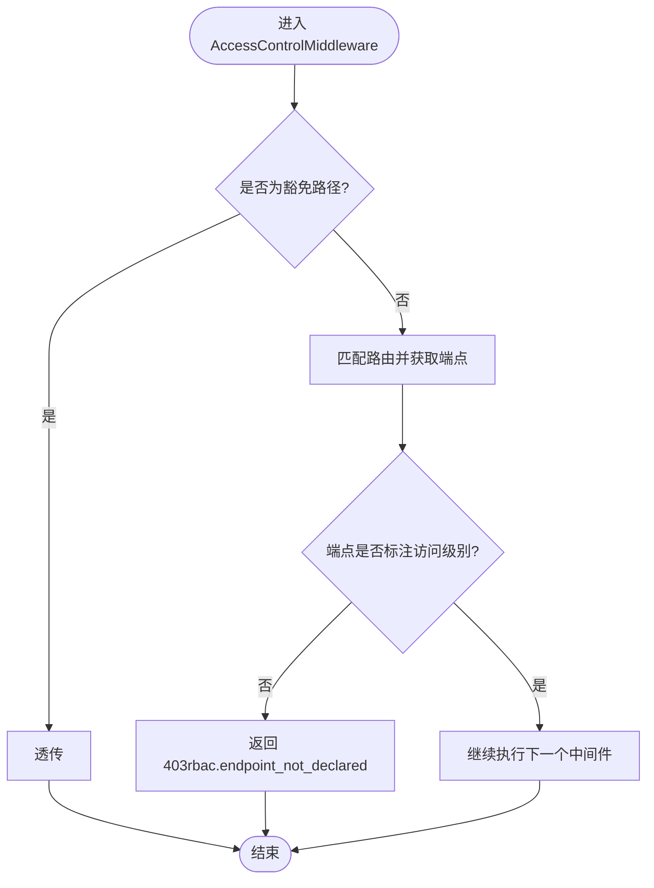

图表来源
- [backend/app/middleware/access_control.py:54-99](file://backend/app/middleware/access_control.py#L54-L99)

章节来源
- [backend/app/middleware/access_control.py:35-99](file://backend/app/middleware/access_control.py#L35-L99)

### DynamicCORSMiddleware（动态 CORS）
- 职责：校验 Origin，对预检请求 OPTIONS 直接短路响应，对实际请求注入允许的 CORS 头。
- 关键点：
  - 使用异步 is_origin_allowed 与 get_cors_headers_for_origin
  - 预检请求 204，非法 Origin 400
  - 包装 send 注入响应头，避免重复设置

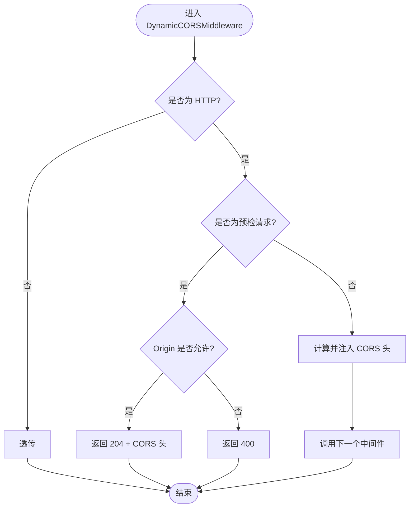

图表来源
- [backend/app/middleware/dynamic_cors.py:25-63](file://backend/app/middleware/dynamic_cors.py#L25-L63)

章节来源
- [backend/app/middleware/dynamic_cors.py:19-63](file://backend/app/middleware/dynamic_cors.py#L19-L63)

### TenantMiddleware（租户识别）
- 职责：从 Host 解析租户上下文，支持子域名与自定义域名两种模式，按需查询数据库并注入 request.state.tenant_ctx。
- 关键点：
  - 仅对特定路径前缀执行解析，避免不必要的 DB 查询
  - 解析失败时注入空上下文，保证下游不报错
  - 提供工具函数获取当前租户与上下文

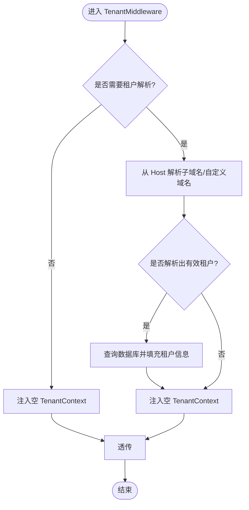

图表来源
- [backend/app/middleware/tenant.py:120-164](file://backend/app/middleware/tenant.py#L120-L164)
- [backend/app/middleware/tenant.py:166-222](file://backend/app/middleware/tenant.py#L166-L222)

章节来源
- [backend/app/middleware/tenant.py:93-164](file://backend/app/middleware/tenant.py#L93-L164)
- [backend/app/middleware/tenant.py:166-222](file://backend/app/middleware/tenant.py#L166-L222)

### PrometheusMetricsMiddleware（指标采集）
- 职责：采集 HTTP 请求总量、时延分布与进行中请求数，提供组件健康指标，避免 BaseHTTPMiddleware 的取消级联问题。
- 关键点：
  - 路由模板匹配与标签化
  - 对 /metrics 路径放行
  - 包装 send 捕获状态码

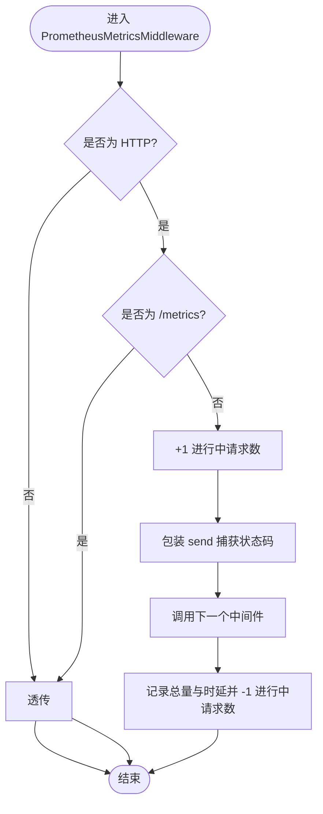

图表来源
- [backend/app/middleware/prometheus_metrics.py:124-162](file://backend/app/middleware/prometheus_metrics.py#L124-L162)

章节来源
- [backend/app/middleware/prometheus_metrics.py:114-162](file://backend/app/middleware/prometheus_metrics.py#L114-L162)

### I18nMiddleware（国际化）
- 职责：根据查询参数、自定义头或 Accept-Language 设置当前语言上下文，纯 ASGI 实现确保异常处理器正常工作。
- 关键点：
  - 优先级：查询参数 > 自定义头 > Accept-Language > 默认语言
  - 不修改响应，仅设置上下文

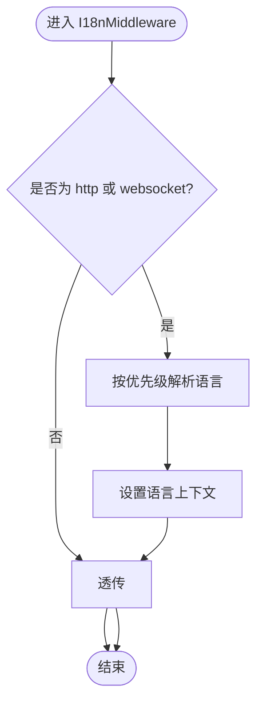

图表来源
- [backend/app/middleware/i18n.py:31-68](file://backend/app/middleware/i18n.py#L31-L68)

章节来源
- [backend/app/middleware/i18n.py:13-68](file://backend/app/middleware/i18n.py#L13-L68)

### MaintenanceMiddleware（维护模式）
- 职责：当启用维护模式时，拦截非管理员路径返回 503，支持 Redis 缓存与数据库回退。
- 关键点：
  - 豁免路径：管理端、公开 API、文档、健康检查、就绪探针、指标、Socket.IO、静态文件
  - 读取维护模式与提示信息，带 TTL 缓存

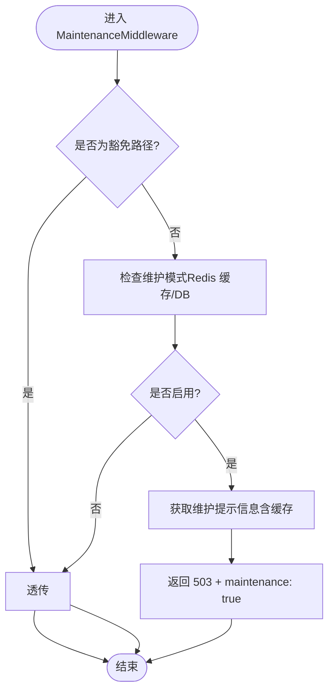

图表来源
- [backend/app/middleware/maintenance.py:51-147](file://backend/app/middleware/maintenance.py#L51-L147)

章节来源
- [backend/app/middleware/maintenance.py:37-147](file://backend/app/middleware/maintenance.py#L37-L147)

### NoCacheAPIMiddleware（禁缓存）
- 职责：对未设置 Cache-Control 的 JSON 响应添加禁缓存头，避免浏览器缓存 GET 导致保存后数据不更新。
- 关键点：
  - 仅对 JSON 响应生效
  - 包装 send 注入头

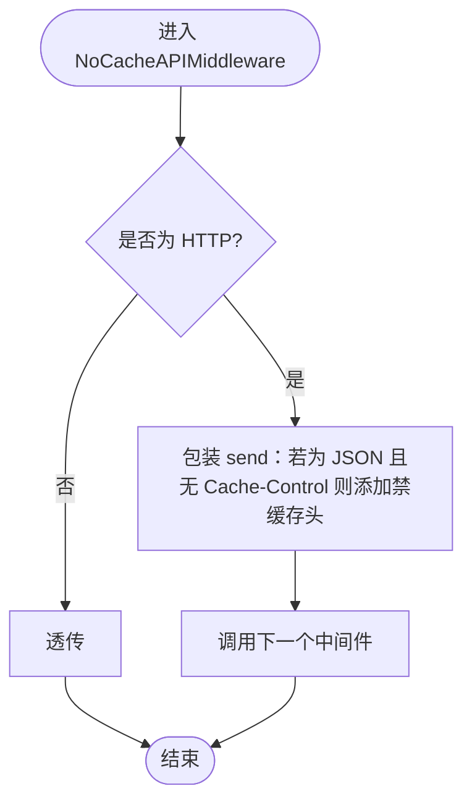

图表来源
- [backend/app/middleware/nocache.py:25-50](file://backend/app/middleware/nocache.py#L25-L50)

章节来源
- [backend/app/middleware/nocache.py:16-50](file://backend/app/middleware/nocache.py#L16-L50)

## 依赖关系分析
- 中间件注册顺序与依赖关系：
  - TraceIdMiddleware（最外层）→ PermissionMiddleware → AuditLogMiddleware → AccessControlMiddleware → TenantMiddleware → DynamicCORSMiddleware → PrometheusMetricsMiddleware → I18nMiddleware → MaintenanceMiddleware → NoCacheAPIMiddleware
- 关键耦合点：
  - AuditLogMiddleware 依赖 PermissionMiddleware 注入的用户信息与 TraceId
  - AccessControlMiddleware 依赖路由装饰器元信息
  - TenantMiddleware 依赖数据库查询
  - DynamicCORSMiddleware 依赖核心 CORS 工具函数
  - PrometheusMetricsMiddleware 依赖 FastAPI 路由匹配
  - MaintenanceMiddleware 依赖 Redis 缓存与配置服务
  - NoCacheAPIMiddleware 依赖响应头判断

图表来源
- [backend/app/main.py:699-702](file://backend/app/main.py#L699-L702)
- [backend/app/middleware/audit_log.py:512-518](file://backend/app/middleware/audit_log.py#L512-L518)
- [backend/app/middleware/access_control.py:67-71](file://backend/app/middleware/access_control.py#L67-L71)
- [backend/app/middleware/tenant.py:120-164](file://backend/app/middleware/tenant.py#L120-L164)
- [backend/app/middleware/dynamic_cors.py:25-63](file://backend/app/middleware/dynamic_cors.py#L25-L63)
- [backend/app/middleware/prometheus_metrics.py:124-162](file://backend/app/middleware/prometheus_metrics.py#L124-L162)
- [backend/app/middleware/maintenance.py:51-76](file://backend/app/middleware/maintenance.py#L51-L76)
- [backend/app/middleware/nocache.py:25-50](file://backend/app/middleware/nocache.py#L25-L50)

章节来源
- [backend/app/main.py:699-702](file://backend/app/main.py#L699-L702)

## 性能考量
- 中间件链顺序优化：将高开销中间件（如数据库查询、异步写日志）置于靠后位置，减少对快速路径的影响。
- 缓存策略：维护模式使用 Redis 缓存，降低 DB 压力；CORS 验证结果可结合缓存策略进一步优化。
- 异步与非阻塞：审计日志与指标采集均为异步，避免阻塞请求处理。
- 纯 ASGI 实现：避免 BaseHTTPMiddleware 导致的取消级联问题，提升稳定性。

## 故障排查指南
- TraceId 丢失
  - 检查最外层 TraceIdMiddleware 是否正确注入与回写 X-Trace-ID
  - 确认 WebSocket 场景下的行为符合预期
- 审计日志缺失
  - 确认路径未被排除（健康检查、指标、文档等）
  - 检查是否为 OPTIONS 预检请求
  - 核实 PermissionMiddleware 是否成功注入用户信息
- 权限判定异常
  - 检查 Token 是否正确传递与解码
  - 确认用户角色与权限数据是否同步
- CORS 失败
  - 核对 Origin 是否在允许列表
  - 预检请求是否返回 204
- 维护模式误拦截
  - 检查豁免路径配置
  - 确认 Redis/DB 缓存是否正确
- 指标不更新
  - 检查 /metrics 路径是否被拦截
  - 确认包装 send 是否正确捕获状态码

章节来源
- [backend/app/middleware/audit_log.py:250-254](file://backend/app/middleware/audit_log.py#L250-L254)
- [backend/app/middleware/audit_log.py:512-518](file://backend/app/middleware/audit_log.py#L512-L518)
- [backend/app/middleware/access_control.py:82-92](file://backend/app/middleware/access_control.py#L82-L92)
- [backend/app/middleware/dynamic_cors.py:38-51](file://backend/app/middleware/dynamic_cors.py#L38-L51)
- [backend/app/middleware/maintenance.py:64-76](file://backend/app/middleware/maintenance.py#L64-L76)
- [backend/app/middleware/prometheus_metrics.py:130-132](file://backend/app/middleware/prometheus_metrics.py#L130-L132)

## 结论
本中间件架构以 TraceIdMiddleware 为最外层，围绕“安全前置、可观测性、性能与可维护性”展开设计。通过明确的职责划分与严格的注册顺序，确保请求在进入业务逻辑前完成鉴权、审计、租户识别与跨域处理，同时通过异步与缓存策略保障性能。建议在新增中间件时遵循现有模式，保持纯 ASGI 实现与最小侵入原则。

## 附录

### 中间件注册机制与配置
- 注册方式：在应用入口中通过 add_middleware 逐个注册，严格遵循执行顺序。
- 配置示例要点：
  - 动态 CORS：通过 get_cors_headers_for_origin 与 is_origin_allowed 动态校验与注入头
  - 维护模式：通过 Redis 缓存与配置服务读取开关与提示信息
  - 指标采集：通过 Prometheus 客户端与路由模板匹配生成标签

章节来源
- [backend/app/main.py:699-702](file://backend/app/main.py#L699-L702)
- [backend/app/middleware/dynamic_cors.py:38-51](file://backend/app/middleware/dynamic_cors.py#L38-L51)
- [backend/app/middleware/maintenance.py:80-112](file://backend/app/middleware/maintenance.py#L80-L112)
- [backend/app/middleware/prometheus_metrics.py:95-112](file://backend/app/middleware/prometheus_metrics.py#L95-L112)

### 自定义中间件开发指南与最佳实践
- 设计原则
  - 纯 ASGI 实现，避免 BaseHTTPMiddleware 带来的级联取消问题
  - 仅在必要场景包裹 receive/send，减少对请求体的多次读取
  - 明确职责边界，避免与已有中间件重复处理同一逻辑
- 性能建议
  - 对高开销操作（数据库、外部 API）采用异步与缓存
  - 仅对目标路径执行处理，避免全量扫描
- 安全建议
  - 严格校验输入与来源（如 CORS、Token）
  - 对敏感信息进行脱敏处理（审计日志中间件可参考）
- 可观测性
  - 为关键路径埋点与指标采集
  - 保持 trace_id 的完整传递与记录